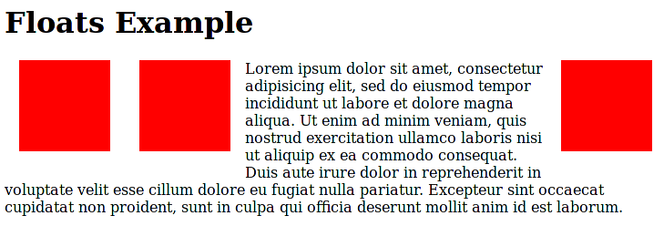

{{CSSRef}}

La propriété **`float`** indique qu'un élément doit être retiré du flux normal et doit être placé sur le côté droit ou sur le côté gauche de son conteneur. Le texte et les autres éléments en ligne (_inline_) entoureront alors l'élément flottant. L'élément est retiré du flux normal de la page mais s'inscrit toujours dans le flux (contrairement au [positionnement absolu](/fr/docs/Web/CSS/position#positionnement_absolu)).

{{EmbedInteractiveExample("pages/css/float.html")}}

Un **élément flottant** est un élément pour lequel [la valeur calculée](/fr/docs/Web/CSS/computed_value) de `float` est différente de `none`.

`float` implique l'utilisation d'une disposition en bloc, cette propriété modifie donc la valeur de {{cssxref("display")}} dans certains cas :

| [Valeur spécifiée](/fr/docs/Web/CSS/specified_value) | [Valeur calculée](/fr/docs/Web/CSS/computed_value) |
| ---------------------------------------------------- | -------------------------------------------------- |
| `inline`                                             | `block`                                            |
| `inline-block`                                       | `block`                                            |
| `inline-table`                                       | `table`                                            |
| `table-row`                                          | `block`                                            |
| `table-row-group`                                    | `block`                                            |
| `table-column`                                       | `block`                                            |
| `table-column-group`                                 | `block`                                            |
| `table-cell`                                         | `block`                                            |
| `table-caption`                                      | `block`                                            |
| `table-header-group`                                 | `block`                                            |
| `table-footer-group`                                 | `block`                                            |
| `inline-flex`                                        | `flex`                                             |
| `inline-grid`                                        | `grid`                                             |
| _autre_                                              | _inchangée_                                        |

> **Note :** Si vous utilisez cette propriété via JavaScript, comme propriété de l'objet {{domxref("HTMLElement.style")}}, la plupart des navigateurs récents permettra d'utiliser `float` mais il faudra utiliser `cssFloat` (attention à la casse) pour les navigateurs plus anciens. Pour Internet Explorer 8 et les versions antérieures, elle était appelée `styleFloat`. Le terme `float` étant réservé en JavaScript, ce cas de figure était une exception à la règle qui définit que le nom de la propriété DOM est une version [CamelCase](https://fr.wikipedia.org/wiki/CamelCase) de la propriété CSS construite avec des tirets. De même, `class` sera échappée en `className` et le `for` des éléments \<label> sera converti en `htmlFor`).

## Syntaxe

```css
float: left;
float: right;
float: none;
float: inline-start;
float: inline-end;

/* Valeurs globales */
float: inherit;
float: initial;
float: unset;
```

### Valeurs

- `left`
  - : Un mot-clé indiquant que l'élément doit flotter du côté gauche du bloc qui le contient.
- `right`
  - : Un mot-clé indiquant que l'élément doit flotter du côté droit du bloc qui le contient.
- `none`
  - : Un mot-clé indiquant que l'élément ne doit pas flotter
- `inline-start`
  - : Un mot-clé indiquant que l'élément doit flotter du côté du début du bloc qui le contient. Pour les scripts LTR (les langues qui s'écrivent de la gauche vers la droite), c'est le bord gauche ; pour les scripts RTL, c'est le bord droit.
- `inline-end`
  - : Un mot-clé indiquant que l'élément doit flotter du côté de la fin du bloc qui le contient. Pour les scripts LTR (les langues qui s'écrivent de la gauche vers la droite), c'est le bord droit ; pour les scripts RTL, c'est le bord gauche.

### Syntaxe formelle

{{csssyntax}}

## Exemples

### CSS

```css
div {
  border: solid red;
  max-width: 70ex;
}

h4 {
  float: left;
  margin: 0;
}
```

### HTML

```html
<div>
  <h4>Coucou !</h4>
  Voici du texte. Voici du texte. Voici du texte.
  Voici du texte. Voici du texte. Voici du texte.
  Voici du texte. Voici du texte. Voici du texte.
  Voici du texte. Voici du texte. Voici du texte.
</div>
```

### Résultat

{{EmbedLiveSample('Exemples')}}

## Le positionnement des éléments flottants

Comme évoqué ci-avant, lorsqu'un élément flotte, il est retiré du flux normal du document et il est décalé vers la droite ou vers la gauche jusqu'à ce qu'il touche le bord de son conteneur _ou un autre élément flottant_.

Dans l'image suivante, on voit trois carrés rouges. Deux flottent à gauche et un flotte à droite. On voit que le deuxième carré à gauche est placé à droite du premier. Si on ajoutait d'autres carrés, ils s'empileraient sur la gauche jusqu'à remplir le conteneur, ensuite, on passerait sur une autre ligne.



## Dégager des éléments du flottement

Dans l'illustration précédente, les éléments flottants sont verticalement plus courts que le texte sur lequel ils flottent. Cependant, si le texte n'était pas aussi long et ne dépassait pas des blocs, on pourrait avoir des effets indésirables. Par exemple, si le paragraphe ne contenait que « Lorem ipsum dolor sit amet » et était suivi d'un autre titre (semblable à « Floats Example »), le deuxième titre apparaîtrait entre les boîtes rouges. Or, la plupart du temps, on veut que le titre soit aligné tout à gauche. Pour cela, il faut dégager (_clear_) l'élément.

Pour cela, on pourra utiliser la propriété {{cssxref("clear")}} sur ce deuxième titre afin de s'assurer qu'il est aligné à gauche :

```css
h2.deuxiemeTitre { clear: both; }
```

Cela dit, cette méthode fonctionne uniquement s'il n'y a pas d'autres éléments dans le même [contexte de formatage de bloc](/fr/docs/Web/Guide/CSS/Block_formatting_context) pour lesquels on voudrait que l'élément apparaisse à droite. Par exemple, si l'élément `H2` est entourée de barres latérales à gauche et à droite et qu'on utilise `clear`, le titre apparaîtra alors en bas, sous les barres, plutôt qu'entre elles.

Aussi, si on ne peut pas dégager un élément, on peut limiter le formatage en bloc au conteneur des éléments flottants. Pour reprendre l'exemple précédent, on voit que toutes les boîtes rouges sont dans un élément {{HTMLElement("p")}}. On peut alors utiliser {{cssxref("overflow")}} avec `hidden` ou `auto` afin que l'élément s'agrandisse pour les contenir, sans les faire tomber en bas :

```css
p.avecBoitesRouges { overflow: hidden; height: auto; }
```

> **Note :** En utilisant `overflow`: `scroll` on contiendra également les éléments fils flottants mais cela affichera des barres de défilement quelle que soit la hauteur du contenu. Ici, nous utilisons `auto` pour `height` afin d'indiquer que le conteneur doit s'agrandir si nécessaire.

## Spécifications

| Spécification                                                                                    | État                                             | Commentaires                                                       |
| ------------------------------------------------------------------------------------------------ | ------------------------------------------------ | ------------------------------------------------------------------ |
| {{SpecName('CSS Logical Properties', '#float-clear', 'float and clear')}} | {{Spec2('CSS Logical Properties')}} | Les valeurs `inline-start` et `inline-end` sont ajoutées.          |
| {{SpecName('CSS3 Box', '#float', 'float')}}                                         | {{Spec2('CSS3 Box')}}                     | Introduction de nouvelles valeurs, pas encore clairement définies. |
| {{SpecName('CSS2.1', 'visuren.html#float-position', 'float')}}             | {{Spec2('CSS2.1')}}                         | Aucune modification.                                               |
| {{SpecName('CSS1', '#float', 'float')}}                                             | {{Spec2('CSS1')}}                         | Définition initiale.                                               |

{{cssinfo}}

## Compatibilité des navigateurs

{{Compat("css.properties.float")}}

## Voir aussi

- [Le contexte de formatage des blocs](/fr/docs/Web/Guide/CSS/Block_formatting_context)
