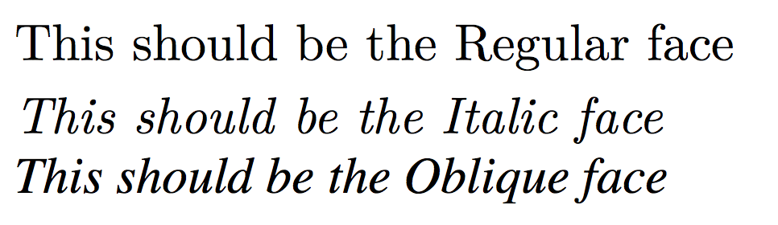

{{CSSRef}}

La propriété** `font-style`** permet de sélectionner une fonte italique (`italic`) ou (`oblique`) parmi celles listées par {{cssxref("font-family")}}.

{{EmbedInteractiveExample("pages/css/font-style.html")}}

La forme **italique** est généralement une forme cursive qui utilise moins d'espace horizontal que les autres formes classiques. La forme **oblique** quant à elle est simplement une version penchée de la forme normale. Les formes italique et oblique peuvent être synthétisées par le navigateur si elles sont absente (le moteur penche alors les glyphes de la forme normale), pour plus d'informations sur l'activation de cette synthèse, voir la propriété {{cssxref("font-synthesis")}}.

## Syntaxe

La propriété `font-style` peut être définie avec l'un des mots-clés suivants.

```css
font-style: normal;
font-style: italic;
font-style: oblique;
font-style: oblique 10deg;

/* Valeurs globales */
font-style: inherit;
font-style: initial;
font-style: unset;
```

La propriété `font-style` s'utilise avec un mot-clé parmi ceux qui suivent. Si ce mot-clé est `oblique`, il peut également être suivi de l' angle.

### Valeurs

- `normal`
  - : Sélectionne une police qualifiée de `normal` parmi celles de {{cssxref("font-family")}}.
- `italic`
  - : Sélectionne une police qualifiée d'`italic`, s'il n'y a pas de version italique, une version `oblique` sera sélectionnée à la place.
- `oblique`
  - : Sélectionne une police qualifiée d'`oblique`, s'il n'y a pas de version oblique, une version `italic` sera sélectionnée à la place.
- `oblique` `<angle>`
  - : Sélectionne une police qualifiée d'`oblique` et indique l'angle à utiliser pour la pente du texte. Si plusieurs fontes sont disponible pour la police, c'est la fonte avec la pente la plus proche qui est utilisée. Si aucune police oblique n'est disponible, le navigateur _synthétisera_ une police penchée en tournant les caractères d'une fonte normale.
    L'angle indiqué (cf. {{cssxref("&lt;angle&gt;")}}) doit être compris entre `-90deg` et `90deg`. Si aucun angle n'est indiqué, la valeur par défaut utilisée sera `14deg`. Les valeurs positives correspondent à une pente où le haut des caractères penche vers la fin de la ligne et les valeurs négatives permettent d'obtenir une pente orientée vers le début de la ligne.

### Syntaxe formelle

{{csssyntax}}

### Variable fonts

Les polices variables permettent d'obtenir un contrôle fin sur la pente appliqué à la fonte. Pour cela, on pourra utiliser une police variable et `font-style` avec le mot-clé `oblique` suivi d'une valeur d'angle.

Pour les polices variables TrueType ou OpenType, c'est l'axe de variation `"slnt"` qui est utilisé afin d'implémenter les variations de pente. C'est l'axe `"ital"` qui est utilisé avec une valeur de 1 pour implémenter les fontes italiques. Voir {{cssxref("font-variation-settings")}}.

Afin que l'exemple suivant fonctionne, votre navigateur doit prendre en charge la syntaxe _CSS Fonts Level 4_ qui permet d'utiliser `font-style: oblique` suivi d'un angle.

{{EmbedLiveSample("Variable_fonts", 1200, 180, "", "", "example-outcome-frame")}}

#### HTML

```html
<header>
    <input type="range" id="slant" name="slant" min="-90" max="90" />
    <label for="slant">Slant</label>
</header>
<div class="container">
    <p class="sample">...it would not be wonderful to meet a Megalosaurus, forty feet long or so, waddling like an elephantine lizard up Holborn Hill.</p>
</div>
```

#### CSS

```css
/*
AmstelvarAlpha-VF is created by David Berlow (https://github.com/TypeNetwork/Amstelvar)
and is used here under the terms of its license:
https://github.com/TypeNetwork/Amstelvar/blob/master/OFL.txt
*/

@font-face {
  src: url('https://mdn.mozillademos.org/files/16044/AmstelvarAlpha-VF.ttf');
  font-family:'AmstelvarAlpha';
  font-style: normal;
}

label {
  font: 1rem monospace;
}

.container {
  max-height: 150px;
  overflow: scroll;
}

.sample {
  font: 2rem 'AmstelvarAlpha', sans-serif;
}
```

```css hidden
html, body {
  max-height: 100vh;
  max-width: 100vw;
  overflow: hidden;
}

body {
  display: flex;
  flex-direction: column;
}

header {
  margin-bottom: 1.5rem;
}

.container {
  flex-grow: 1;
}

.container > p {
  margin-top: 0;
  margin-bottom: 0;
}
```

#### JavaScript

```js
let slantLabel = document.querySelector('label[for="slant"]');
let slantInput = document.querySelector('#slant');
let sampleText = document.querySelector('.sample');

function update() {
  let slant = `oblique ${slantInput.value}deg`;
  slantLabel.textContent = `font-style: ${slant};`;
  sampleText.style.fontStyle = slant;
}

slantInput.addEventListener('input', update);

update();
```

## Exemples

### CSS

```css
.normal {
  font-style: normal;
}

.italic {
  font-style: italic;
}

.oblique {
  font-style: oblique;
}
```

### HTML

```html
<p class="normal">Un paragraphe normale.</p>
<p class="italic">Un paragraphe italique.</p>
<p class="oblique">Un paragraphe oblique.</p>
```

### Résultat

{{EmbedLiveSample('Exemples')}}

> **Note :** Toutes les polices ne disposent pas nécessairement de formes pour `oblique` et `italic`, si ces formes sont absentes, le moteur simulera la forme absente à partir de celle qui est disponible. Voici un exemple du rendu d'une police qui dispose des différentes formes :
>
> 

## Accessibilité

L'utilisation de grandes portions de textes avec `font-style: italic` peut rendre la lecture difficile pour les personnes dyslexiques ou ayant des troubles cognitifs.

- [Comprendre les règles WCAG 1.4](/fr/docs/Web/Accessibility/Understanding_WCAG/Perceivable#guideline_1.4_make_it_easier_for_users_to_see_and_hear_content_including_separating_foreground_from_background)
- [_Understanding Success Criterion 1.4.8  | W3C Understanding WCAG 2.0_ (en anglais)](https://www.w3.org/TR/WCAG21/#visual-presentation)

## Spécific​ations

| Spécification                                                                                | État                             | Commentaires                                          |
| -------------------------------------------------------------------------------------------- | -------------------------------- | ----------------------------------------------------- |
| {{SpecName('CSS4 Fonts', '#font-style-prop', 'font-style')}}             | {{Spec2('CSS4 Fonts')}} | Permet d'indiquer un angle après le mot-clé `oblique` |
|                                                                                              |                                  |                                                       |
| {{SpecName('CSS3 Fonts', '#font-style-prop', 'font-style')}}             | {{Spec2('CSS3 Fonts')}} | Aucune modification.                                  |
| {{SpecName('CSS2.1', 'fonts.html#propdef-font-style', 'font-style')}} | {{Spec2('CSS2.1')}}         | Aucune modification.                                  |
| {{SpecName('CSS1', '#font-style', 'font-style')}}                             | {{Spec2('CSS1')}}         | Définition initiale.                                  |

{{cssinfo}}

## Compatibilité des navigateurs

{{Compat("css.properties.font-style")}}
