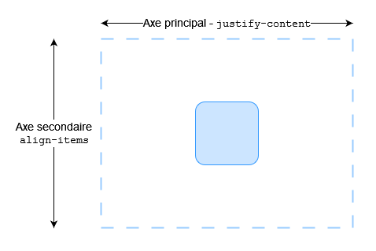
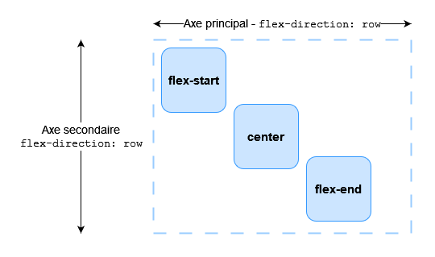
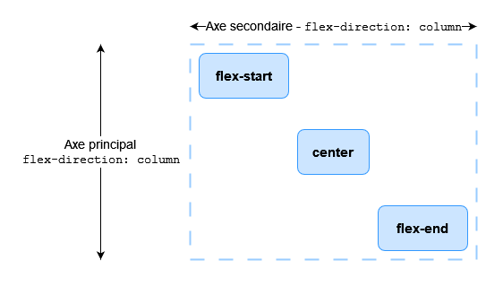
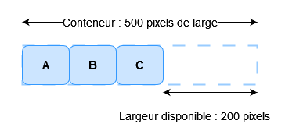
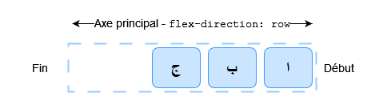
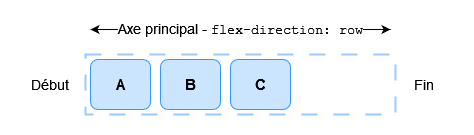
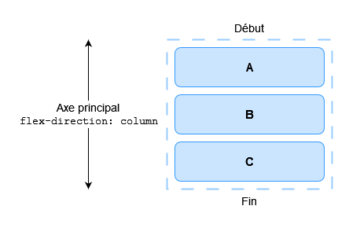
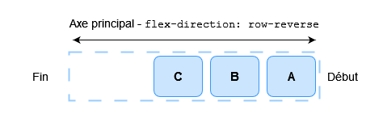
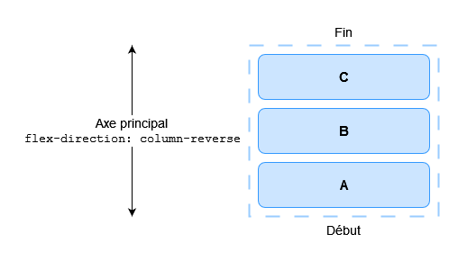

L'une des raisons pour lesquelles les boîtes flexibles sont si utiles est qu'elles permettent un alignement précis, notamment en offrant une méthode rapide pour centrer verticalement des éléments. Dans ce guide, nous allons examiner en détail le fonctionnement des propriétés d'alignement et de justification dans les boîtes flexibles.

## Utiliser l'alignement dans les boîtes flexibles

Les boîtes flexibles proposent plusieurs propriétés pour contrôler l'alignement et l'espacement, parmi lesquelles `align-items` et `justify-content` sont essentielles pour centrer des éléments. Pour centrer un élément, on utilise la propriété {{CSSxRef("align-items")}} afin d'aligner l'élément sur {{Glossary("cross axis", "l'axe transversal")}}, qui, dans ce cas, correspond à [l'axe de bloc](/fr/docs/Glossary/Flow_relative_values) s'étendant verticalement. Nous utilisons {{CSSxRef("justify-content")}} pour aligner l'élément sur l'axe principal, qui, dans ce cas, est l'axe en incise s'étendant horizontalement.



Modifiez la taille du conteneur ou de l'élément imbriqué dans l'exemple de code ci-dessous. L'élément imbriqué reste toujours centré.

```html live-sample___intro
<div class="boite">
  <div></div>
</div>
```

```css live-sample___intro
.boite {
  display: flex;
  align-items: center;
  justify-content: center;
  border: 2px dotted rgb(96 139 168);
}

.boite div {
  width: 100px;
  height: 100px;
  border: 2px solid rgb(96 139 168);
  border-radius: 5px;
  background-color: rgb(96 139 168 / 0.2);
}
```

{{EmbedLiveSample("intro")}}

## Les propriétés responsables de l'alignement

Voici les propriétés que nous étudions dans ce guide sont les suivantes.

- {{CSSxRef("justify-content")}}&nbsp;: Contrôle l'alignement de tous les objets sur l'axe principal.
- {{CSSxRef("align-items")}}&nbsp;: Contrôle l'alignement de tous les objets sur l'axe transversal.
- {{CSSxRef("align-self")}}&nbsp;: Contrôle l'alignement d'un objet flexible donné le long de l'axe transversal.
- {{CSSxRef("align-content")}}&nbsp;: Contrôle l'espace entre les lignes flexibles sur l'axe transversal.
- {{CSSxRef("gap")}}, {{CSSxRef("column-gap")}} et {{CSSxRef("row-gap")}}&nbsp;: Utilisées pour créer des espaces ou des gouttières entre les éléments flexibles.

Nous voyons également comment les marges automatiques peuvent être utilisées dans l'alignement des boîtes flexibles.

## Aligner des éléments sur l'axe transversal

La propriété {{CSSxRef("align-items")}}, définie sur le conteneur flexible, et la propriété {{CSSxRef("align-self")}}, définie sur les éléments flexibles, contrôlent l'alignement des éléments flexibles sur l'axe transversal. L'axe transversal s'étend le long des colonnes si {{CSSxRef("flex-direction")}} est défini sur `row`, et le long des lignes si `flex-direction` est défini sur `column`.

Dans cet exemple simple d'élément flexible, nous utilisons l'alignement sur l'axe transversal. Lorsque nous ajoutons `display: flex` à un conteneur, les éléments enfants deviennent des éléments flexibles disposés en incise. Par défaut, ils s'étirent tous pour s'adapter à la hauteur de l'élément le plus haut, car c'est cet élément qui définit la hauteur des éléments sur l'axe transversal. Si la hauteur du conteneur flexible est définie, les éléments s'étirent jusqu'à cette hauteur, quelle que soit la quantité de contenu contenue dans chaque élément.


La raison pour laquelle les éléments ont tous la même hauteur est que la valeur initiale de `align-items`, la propriété qui contrôle l'alignement sur l'axe transversal, est définie sur `stretch`.

Nous pouvons utiliser d'autres valeurs pour contrôler l'alignement des éléments&nbsp;:

- `align-items: stretch`
- `align-items: flex-start`
- `align-items: flex-end`
- `align-items: start`
- `align-items: end`
- `align-items: center`
- `align-items: baseline`
- `align-items: first baseline`
- `align-items: last baseline`

Dans l'exemple ci-dessous, la valeur de `align-items` est `stretch`. Testez les autres valeurs et observez comment les éléments s'alignent les uns par rapport aux autres dans le conteneur flexible.

```html live-sample___align-items
<div class="boite">
  <div>Un</div>
  <div>Deux</div>
  <div>Trois <br />contient <br />du <br />texte <br />supplémentaire</div>
</div>
```

```css live-sample___align-items
.boite {
  border: 2px dotted rgb(96 139 168);
  display: flex;
  align-items: stretch;
}

.boite div {
  width: 100px;
  background-color: rgb(96 139 168 / 0.2);
  border: 2px solid rgb(96 139 168);
  border-radius: 5px;
}
```

{{EmbedLiveSample("align-items")}}

### Aligner un objet avec `align-self`

La propriété `align-items` définit la valeur de la propriété `align-self` pour l'ensemble des objets flexibles. Cela signifie qu'on peut utiliser la propriété `align-self` de façon explicite, sur un élément donné, afin de préciser son alignement. La propriété `align-self` prend en charge les mêmes valeurs que `align-items` ainsi qu'un mot-clé `auto` qui reprend la valeur définie sur le conteneur flexible.

Dans l'exemple interactif suivant, le conteneur flexible a `align-items: flex-start`, ce qui signifie que les éléments sont tous alignés au début de l'axe secondaire. En utilisant le sélecteur `first-child`, le premier élément est défini avec `align-self: stretch`. Un autre élément avec la classe `selectionne` a `align-self: center` défini. Modifiez la valeur de `align-items` ou changez les valeurs de `align-self` sur les éléments individuels pour voir comment cela fonctionne.

```html live-sample___align-self
<div class="boite">
  <div>Un</div>
  <div>Deux</div>
  <div class="selectionne">Trois</div>
  <div>Quatre</div>
</div>
```

```css live-sample___align-self
.boite {
  border: 2px dotted rgb(96 139 168);
  display: flex;
  align-items: flex-start;
  height: 200px;
}
.boite div {
  background-color: rgb(96 139 168 / 0.2);
  border: 2px solid rgb(96 139 168);
  border-radius: 5px;
  padding: 20px;
}
.boite > *:first-child {
  align-self: stretch;
}
.boite .selectionne {
  align-self: center;
}
```

{{EmbedLiveSample("align-self", "", 250)}}

### Changer d'axe principal

Jusqu'à présent, nous avons examiné le comportement d'alignement lorsque la propriété `flex-direction` prend par défaut la valeur `row`, dans le cadre d'une langue s'écrivant de haut en bas, avec un axe principal horizontal et un axe transversal vertical.



En conservant le même mode d'écriture, lorsque la propriété `flex-direction` est définie sur `column`, les propriétés `align-items` et `align-self` alignent les éléments à gauche et à droite au lieu de les aligner en haut et en bas&nbsp;; ces propriétés continuent d'aligner les éléments le long de l'axe transversal, mais celui-ci est désormais horizontal&nbsp;!



Vous pouvez tester cela dans l'exemple ci-dessous, qui comporte un conteneur flexible avec `flex-direction: column`, mais qui est par ailleurs exactement identique à l'exemple précédent.

```html live-sample___align-self-column
<div class="boite">
  <div>Un</div>
  <div>Deux</div>
  <div class="selectionne">Trois</div>
  <div>Quatre</div>
</div>
```

```css live-sample___align-self-column
.boite {
  border: 2px dotted rgb(96 139 168);
  display: flex;
  flex-direction: column;
  align-items: flex-start;
  width: 200px;
}
.boite div {
  background-color: rgb(96 139 168 / 0.2);
  border: 2px solid rgb(96 139 168);
  border-radius: 5px;
  padding: 20px;
}
.boite > *:first-child {
  align-self: stretch;
}
.boite .selectionne {
  align-self: center;
}
```

{{EmbedLiveSample("align-self-column", "", 300)}}

## Aligner le contenu sur l'axe transversal à l'aide de la propriété `align-content`

Jusqu'à présent, nous nous sommes concentrés sur l'alignement d'éléments ou d'éléments individuels à l'intérieur de la zone définie par un {{Glossary("flex container", "conteneur flexible")}} contenant une seule ligne d'éléments flexibles. Lorsque les éléments flexibles peuvent s'étendre sur plusieurs lignes, la propriété {{CSSxRef("align-content")}} peut être utilisée pour contrôler la répartition de l'espace entre les lignes, également appelée **groupement des lignes flexibles**.

Pour que `align-content` ait un effet, la dimension de l'axe transversal (la hauteur dans ce cas) du conteneur flexible doit être supérieure à celle nécessaire à l'affichage des éléments. Elle s'applique alors à l'ensemble des éléments. Les valeurs de `align-content` déterminent ce qu'il advient de l'espace supplémentaire disponible et l'alignement de l'ensemble des éléments qu'il contient.

La propriété `align-content` prend les valeurs suivantes&nbsp;:

- `align-content: flex-start`
- `align-content: flex-end`
- `align-content: start`
- `align-content: end`
- `align-content: center`
- `align-content: space-between`
- `align-content: space-around`
- `align-content: space-evenly`
- `align-content: stretch`
- `align-content: normal` (se comporte comme `stretch`)
- `align-content: baseline`
- `align-content: first baseline`
- `align-content: last baseline`

Dans l'exemple interactif ci-dessous, le conteneur flexible a une hauteur de `400 pixels`, ce qui est supérieur à ce qui est nécessaire pour afficher nos éléments. La valeur de `align-content` est `space-between`, ce qui signifie que l'espace disponible est réparti _entre_ les lignes flexibles, qui sont alignées sur le début et la fin du conteneur selon l'axe transversal.

Essayez les autres valeurs pour voir comment fonctionne la propriété `align-content`.

```html live-sample___align-content
<div class="boite">
  <div>Un</div>
  <div>Deux</div>
  <div>Trois</div>
  <div>Quatre</div>
  <div>Cinq</div>
  <div>Six</div>
  <div>Sept</div>
  <div>Huit</div>
</div>
```

```css live-sample___align-content
.boite {
  width: 450px;
  border: 2px dotted rgb(96 139 168);
  display: flex;
  flex-wrap: wrap;
  height: 300px;
  align-content: space-between;
}

.boite > * {
  padding: 20px;
  border: 2px solid rgb(96 139 168);
  border-radius: 5px;
  background-color: rgb(96 139 168 / 0.2);
  flex: 1 1 100px;
}

.boite div {
  background-color: rgb(96 139 168 / 0.2);
  border: 2px solid rgb(96 139 168);
  border-radius: 5px;
  padding: 20px;
}
```

{{EmbedLiveSample("align-content", "", 380)}}

À nouveau, nous pouvons définir notre propriété `flex-direction` sur `column` afin d'observer le comportement de cette propriété lorsque nous travaillons en colonnes. Comme précédemment, nous avons besoin d'un espace suffisant sur l'axe transversal pour disposer d'un peu d'espace libre une fois tous les éléments affichés.

```html live-sample___align-content-column
<div class="boite">
  <div>Un</div>
  <div>Deux</div>
  <div>Trois</div>
  <div>Quatre</div>
  <div>Cinq</div>
  <div>Six</div>
  <div>Sept</div>
  <div>Huit</div>
</div>
```

```css live-sample___align-content-column
.boite {
  display: flex;
  flex-wrap: wrap;
  flex-direction: column;
  width: 400px;
  height: 300px;
  align-content: space-between;
  border: 2px dotted rgb(96 139 168);
}

.boite > * {
  padding: 20px;
  border: 2px solid rgb(96 139 168);
  border-radius: 5px;
  background-color: rgb(96 139 168 / 0.2);
  flex: 1 1 100px;
}

.boite div {
  background-color: rgb(96 139 168 / 0.2);
  border: 2px solid rgb(96 139 168);
  border-radius: 5px;
  padding: 20px;
}
```

{{EmbedLiveSample("align-content-column", "", 380)}}

## Aligner le contenu sur l'axe principal

Maintenant que nous avons vu comment fonctionne l'alignement sur l'axe transversal, nous pouvons nous intéresser à l'axe principal. Ici, nous ne disposons que d'une seule propriété — `justify-content`. En effet, sur l'axe principal, les éléments sont traités uniquement en tant que groupe. La propriété `justify-content` nous permet de contrôler ce qu'il advient de l'espace disponible lorsque celui-ci est supérieur à ce qui est nécessaire pour afficher les éléments.

Dans notre exemple initial avec `display: flex` sur le conteneur, les éléments s'affichent sur une ligne et s'alignent tous au début du conteneur. C'est dû à la valeur initiale de `justify-content`, qui est `normal` et se comporte comme `start`. Tout espace disponible est placé à la fin des éléments.



Les valeurs de `baseline` ne sont pas pertinentes dans cette dimension. Pour le reste, la propriété `justify-content` accepte les mêmes valeurs que `align-content`.

- `justify-content: flex-start`
- `justify-content: flex-end`
- `justify-content: start`
- `justify-content: end`
- `justify-content: left`
- `justify-content: right`
- `justify-content: center`
- `justify-content: space-between`
- `justify-content: space-around`
- `justify-content: space-evenly`
- `justify-content: stretch` (se comporte comme `start`)
- `justify-content: normal` (se comporte comme `stretch`, qui se comporte comme `start`)

Dans l'exemple ci-dessous, la valeur de `justify-content` est `space-between`. L'espace disponible après l'affichage des éléments est réparti entre ceux-ci. Les éléments de gauche et de droite s'alignent respectivement sur le début et la fin.

```html live-sample___justify-content
<div class="boite">
  <div>Un</div>
  <div>Deux</div>
  <div>Trois</div>
  <div>Quatre</div>
</div>
```

```css live-sample___justify-content
.boite {
  display: flex;
  justify-content: space-between;
  border: 2px dotted rgb(96 139 168);
}

.boite > * {
  padding: 20px;
  border: 2px solid rgb(96 139 168);
  border-radius: 5px;
  background-color: rgb(96 139 168 / 0.2);
}
```

{{EmbedLiveSample("justify-content")}}

Si l'axe principal correspond à la direction du bloc parce que `flex-direction` est défini sur `column`, alors `justify-content` distribue l'espace entre les éléments dans cette dimension, à condition qu'il y ait suffisamment d'espace disponible dans le conteneur flexible pour effectuer cette distribution.

```html live-sample___justify-content-column
<div class="boite">
  <div>Un</div>
  <div>Deux</div>
  <div>Trois</div>
  <div>Quatre</div>
</div>
```

```css live-sample___justify-content-column
.boite {
  display: flex;
  flex-direction: column;
  justify-content: space-between;
  height: 300px;
  border: 2px dotted rgb(96 139 168);
}

.boite > * {
  padding: 20px;
  border: 2px solid rgb(96 139 168);
  border-radius: 5px;
  background-color: rgb(96 139 168 / 0.2);
}
```

{{EmbedLiveSample("justify-content-column", "", 380)}}

### Alignement et modes d'écriture

N'oubliez pas que, pour toutes ces méthodes d'alignement, les valeurs de `start` et `end` dépendent du mode d'écriture. Si la valeur de `justify-content` est `start` et que le mode d'écriture est de gauche à droite, comme en français, les éléments s'alignent à partir du bord gauche du conteneur.


En revanche, si le mode d'écriture est de droite à gauche, comme en arabe, les éléments s'alignent à partir du côté droit du conteneur.



Dans l'exemple dynamique ci-dessous, la propriété `direction` est définie sur `rtl` (<i lang="en">right to left</i> en anglais) afin d'imposer un écoulement de droite à gauche pour nos éléments. Vous pouvez supprimer cette propriété ou modifier les valeurs de `justify-content` pour observer le comportement des boîtes flexibles lorsque le début de la direction en incise se trouve à droite.

```html live-sample___justify-content-writing-mode
<div class="boite">
  <div>Un</div>
  <div>Deux</div>
  <div>Trois</div>
  <div>Quatre</div>
</div>
```

```css live-sample___justify-content-writing-mode
.boite {
  direction: rtl;
  display: flex;
  justify-content: flex-end;
  border: 2px dotted rgb(96 139 168);
}

.boite > * {
  padding: 20px;
  border: 2px solid rgb(96 139 168);
  border-radius: 5px;
  background-color: rgb(96 139 168 / 0.2);
}
```

{{EmbedLiveSample("justify-content-writing-mode")}}

## Alignement et propriété `flex-direction`

La direction de `flex-start` de la ligne change également si vous modifiez la propriété `flex-direction` — par exemple, en utilisant `row-reverse` à la place de `row`. Les directions de `start` et `end` ne sont pas affectées par les modifications de `flex-direction`.

Dans l'exemple suivant, `flex-direction: row-reverse` et `justify-content: flex-end` définissent la direction et l'emplacement des éléments au sein du conteneur flexible. Dans une langue s'écrivant de gauche à droite, les éléments s'alignent à gauche. Essayez de remplacer `flex-direction: row-reverse` par `flex-direction: row`. Vous constatez que les éléments se déplacent désormais vers la droite et que leur ordre d'affichage est inversé.

```html live-sample___justify-content-reverse
<div class="boite">
  <div>Un</div>
  <div>Deux</div>
  <div>Trois</div>
  <div>Quatre</div>
</div>
```

```css live-sample___justify-content-reverse
.boite {
  display: flex;
  flex-direction: row-reverse;
  justify-content: flex-end;
  border: 2px dotted rgb(96 139 168);
}

.boite > * {
  padding: 20px;
  border: 2px solid rgb(96 139 168);
  border-radius: 5px;
  background-color: rgb(96 139 168 / 0.2);
}
```

{{EmbedLiveSample("justify-content-reverse")}}

Même si tout cela peut sembler un peu déroutant, la règle à retenir est que tant que vous n'intervenez pas pour modifier cet agencement, les éléments flexibles s'alignent dans le sens de la disposition des mots dans la langue de votre document, le long de l'axe en incise. `flex-start` correspond à l'endroit où commence le début d'une phrase.



Vous pouvez les faire s'afficher dans le sens du bloc pour la langue de votre document en sélectionnant `flex-direction: column`. Dans ce cas, `start` et `flex-start` correspondent à l'endroit où commence le premier paragraphe de votre texte.



Si vous modifiez `flex-direction` pour lui attribuer l'une des valeurs inverses, la disposition s'effectue à partir de l'axe de fin et dans l'ordre inverse de l'écriture des mots dans la langue de votre document. Dans ce cas, `flex-start` correspond à la fin de cet axe — c'est-à-dire à l'emplacement où vos lignes s'enroulent si vous travaillez en incises, ou à la fin de votre dernier paragraphe de texte dans le sens de bloc.





## Utiliser les marges automatiques pour aligner sur l'axe principal

Nous ne disposons pas des propriétés `justify-items` ou `justify-self` sur l'axe principal, car nos éléments sont traités comme un groupe sur cet axe. Il est toutefois possible de procéder à un alignement individuel afin de séparer un élément ou un groupe d'éléments des autres en utilisant les marges automatiques en combinaison avec les boîtes flexibles.

Un exemple courant est celui d'une barre de navigation où certains éléments clés sont alignés à droite, tandis que le groupe principal se trouve à gauche. On peut penser qu'il s'agit là d'un cas d'utilisation de la propriété `justify-self`. Cependant, observez l'image ci-dessous. Prenons par exemple l'image suivante, qui comporte trois éléments d'un côté et deux de l'autre. Si `justify-self` fonctionne sur les éléments flexibles et est appliqué à l'élément _d_, cela modifie également l'alignement de l'élément _e_ qui suit, ce qui n'est pas forcément le résultat souhaité.


Il est en revanche possible de décaler l'élément _d_ à l'aide des marges CSS.

Dans cet exemple interactif, l'élément 4 est séparé des trois premiers éléments en définissant {{CSSxRef("margin-left")}} sur `auto`, ce qui lui permet d'occuper tout l'espace disponible sur son axe. C'est ainsi que fonctionne le centrage d'un bloc avec une marge ({{CSSxRef("margin")}}) automatique à gauche et à droite. Chaque côté tente de prendre autant d'espace que possible, ce qui repousse le bloc vers le milieu.

Dans cet exemple interactif, les éléments flexibles sont disposés en incise avec les valeurs de flexibilité par défaut, et la classe `pousse`, attribuée au quatrième élément, applique la propriété `margin-left: auto` à cet élément. Essayez de supprimer cette classe du quatrième élément ou de l'attribuer à un autre élément pour voir comment cela fonctionne.

```html live-sample___auto-margins
<div class="boite">
  <div>Un</div>
  <div>Deux</div>
  <div>Trois</div>
  <div class="pousse">Quatre</div>
  <div>Cinq</div>
</div>
```

```css live-sample___auto-margins
.boite {
  display: flex;
  border: 2px dotted rgb(96 139 168);
}

.boite > * {
  padding: 20px;
  border: 2px solid rgb(96 139 168);
  border-radius: 5px;
  background-color: rgb(96 139 168 / 0.2);
}
.pousse {
  margin-left: auto;
}
```

{{EmbedLiveSample("auto-margins")}}

## Créer des espaces entre les éléments

Pour créer un espace entre des éléments flexibles, utilisez les propriétés {{CSSxRef("gap")}}, {{CSSxRef("column-gap")}}, et {{CSSxRef("row-gap")}}. La propriété {{CSSxRef("column-gap")}} crée des espaces entre les éléments d'une ligne. La propriété {{CSSxRef("row-gap")}} crée des espaces entre les lignes flexibles, lorsque le paramètre {{CSSxRef("flex-wrap")}} est défini sur `wrap`.

La propriété {{CSSxRef("gap")}} est une abréviation qui définit à la fois `row-gap` et `column-gap`.
Les espaces entre les éléments flexibles ou les lignes flexibles dépendent de la direction. Si la propriété {{CSSxRef("flex-direction")}} crée des lignes, la première valeur définit l'espace entre les lignes flexibles, et la deuxième valeur définit l'espace entre les éléments au sein de chaque ligne. Avec les colonnes (lorsque `flex-direction` est défini sur `column` ou `column-reverse`), la première valeur définit l'espace entre les éléments flexibles, et la deuxième valeur définit l'espace entre les lignes flexibles.

```html live-sample___gap
<div class="boite">
  <div>Un</div>
  <div>Deux</div>
  <div>Trois</div>
  <div>Quatre</div>
  <div>Cinq</div>
  <div>Six</div>
</div>
```

```css live-sample___gap
.boite {
  display: flex;
  flex-wrap: wrap;
  row-gap: 10px;
  column-gap: 2em;
  border: 2px dotted rgb(96 139 168);
}

.boite > * {
  flex: 1;
  padding: 20px;
  border: 2px solid rgb(96 139 168);
  border-radius: 5px;
  background-color: rgb(96 139 168 / 0.2);
}
```

{{EmbedLiveSample("gap")}}

## Voir aussi

- Le module [d'alignement des boîtes CSS](/fr/docs/Web/CSS/Guides/Box_alignment)
- Le module [de disposition en boîte flexible CSS](/fr/docs/Web/CSS/Guides/Flexible_box_layout)
- [L'alignement des boîtes avec les boîtes flexibles](/fr/docs/Web/CSS/Guides/Box_alignment/In_flexbox)
- [L'alignement des boîtes dans la disposition en grille](/fr/docs/Web/CSS/Guides/Box_alignment/In_grid_layout)
