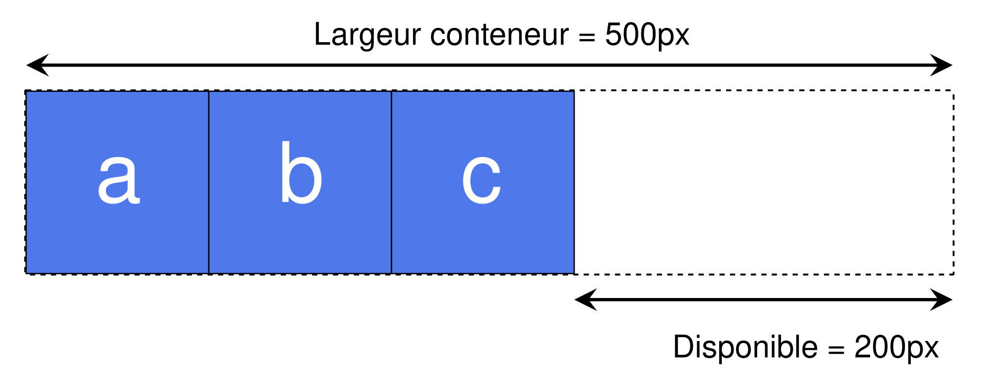

Dans ce guide, nous abordons les trois propriétés qui contrôlent la taille et la flexibilité des éléments flexibles le long de l'axe principal&nbsp;: {{CSSxRef("flex-grow")}}, {{CSSxRef("flex-shrink")}} et {{CSSxRef("flex-basis")}}. Bien comprendre comment ces propriétés interagissent avec les éléments qui s'agrandissent et qui rétrécissent est essentiel pour maîtriser la [disposition des boîtes flexibles CSS](/fr/docs/Web/CSS/Guides/Flexible_box_layout).

## Un premier aperçu

Nos trois propriétés contrôlent les aspects suivants de la flexibilité d'un élément flexible&nbsp;:

- `flex-grow`&nbsp;: quelle part de l'espace libre positif cet élément occupe-t-il&nbsp;?
- `flex-shrink`&nbsp;: quelle part d'espace libre négatif peut être retirée de cet élément&nbsp;?
- `flex-basis`&nbsp;: quelle est la taille de l'élément avant qu'il ne s'étende ou ne se rétrécisse&nbsp;?

Ces propriétés sont généralement exprimées à l'aide de la propriété raccourcie {{CSSxRef("flex")}}. Le code suivant définit la propriété `flex-grow` sur `2`, `flex-shrink` sur `1` et `flex-basis` sur `auto`.

```css
.item {
  flex: 2 1 auto;
}
```

## Les concepts majeurs relatifs à l'axe principal

Pour bien comprendre les propriétés `flex`, il est utile de connaître la _taille naturelle_ des éléments flexibles avant tout agrandissement ou rétrécissement. De plus, il est important de comprendre le concept _d'espace libre_, qui correspond à la différence entre la somme des tailles naturelles de tous les éléments flexibles situés le long de l'axe principal et la taille de cet axe principal lui-même.

### Dimensionner des éléments flexibles

Pour déterminer l'espace disponible pour la mise en page des éléments flexibles, le navigateur doit d'abord connaître la taille de l'élément. Comment cette taille est-elle calculée pour les éléments auxquels aucune largeur ni hauteur n'est attribuée à l'aide d'une unité de longueur absolue&nbsp;?

En CSS, les mots-clés {{CSSxRef("min-content")}} et {{CSSxRef("max-content")}} peuvent être utilisés à la place d'une unité {{CSSxRef("length")}}. En général, `min-content` correspond à la plus petite taille qu'un élément peut avoir tout en pouvant contenir le mot le plus long, tandis que `max-content` correspond à la taille dont l'élément a besoin pour contenir tout le contenu sans retour à la ligne.

L'exemple ci-dessous contient deux éléments de paragraphe avec des chaînes de caractères de texte différentes. Le premier paragraphe a une largeur de `min-content`. Notez que le texte a utilisé toutes les possibilités de retour à la ligne automatique dont il dispose, devenant ainsi aussi petit que possible sans déborder. Il s'agit de la taille `min-content` de cette chaîne de caractères. En substance, c'est le mot le plus long de la chaîne de caractères qui détermine la taille.

Le deuxième paragraphe, dont la valeur est `max-content`, fonctionne à l'inverse. Il s'agrandit autant que nécessaire pour contenir le contenu sans recourir aux possibilités de retour à la ligne automatique. Il déborde de la boîte qui le contient si celle-ci est trop étroite.

```html live-sample___min-max-content
<p class="min-content">
  Je suis dimensionné avec min-content et je profite donc de toutes les
  possibilités de retour à la ligne automatique.
</p>
<p class="max-content">
  Je suis dimensionné avec max-content et je ne profite donc d'aucune des
  possibilités de retour à la ligne automatique.
</p>
```

```css live-sample___min-max-content
.min-content {
  width: min-content;
  border: 2px dotted rgb(96 139 168);
}
.max-content {
  width: max-content;
  border: 2px dotted rgb(96 139 168);
}
```

{{EmbedLiveSample("min-max-content", "", 260)}}

Gardez à l'esprit ce comportement ainsi que les effets des propriétés `min-content` et `max-content` lorsque nous abordons les propriétés `flex-grow` et `flex-shrink` plus loin dans cet article.

### Espace libre positif et négatif

Il faut également comprendre le concept **d'espace libre positif et négatif**. Lorsqu'un conteneur flexible dispose d'un _espace libre positif_, cela signifie qu'il dispose de plus d'espace que nécessaire pour afficher les éléments flexibles qu'il contient. Par exemple, un conteneur de `500px` de large, dont la propriété {{CSSxRef("flex-direction")}} est définie sur `row` et qui contient trois éléments flexibles de `100px` de large, dispose de `200px` d'espace libre positif. Cet espace libre positif peut être réparti entre les éléments si l'on souhaite remplir le conteneur.



Un conteneur flexible dispose d'un _espace libre négatif_ lorsque la somme des tailles naturelles des éléments flexibles est supérieure à l'espace disponible dans le conteneur flexible. Si les trois éléments flexibles de l'exemple ci-dessus, placé dans un conteneur de `500px` de large, mesurent chacun `200px` de large au lieu de `100px`, leur largeur naturelle combinée est de `600px`, ce qui entraîne un espace libre négatif de `100px`. Cet espace peut être supprimé des éléments pour qu'ils s'adaptent au conteneur, sinon les éléments débordent.


Nous devons comprendre cette répartition de l'espace libre positif et la suppression de l'espace libre négatif pour mieux appréhender les composants de la propriété raccourcie `flex`.

Dans les exemples suivants, la propriété {{CSSxRef("flex-direction")}} est définie sur `row`, la taille des éléments est donc déterminée par leur largeur. Nous calculons l'espace libre positif et négatif en comparant la largeur totale de tous les éléments à celle du conteneur. Vous pouvez également tester chaque exemple avec `flex-direction: column`. L'axe principal est alors la colonne, et vous comparez la hauteur des éléments à celle de leur conteneur pour calculer l'espace libre positif et négatif.

## La propriété `flex-basis`

La propriété {{CSSxRef("flex-basis")}} définit la taille initiale d'un élément flexible avant toute répartition de l'espace libre positif ou négatif. La valeur initiale de cette propriété est `auto`. Cette propriété accepte les mêmes valeurs que les propriétés {{CSSxRef("width")}} et {{CSSxRef("height")}}, ainsi que le mot-clé `content`.

Si `flex-basis` est défini sur `auto`, la taille initiale de l'élément correspond à la taille {{CSSxRef("length-percentage")}} de la taille principale, si celle-ci a été définie. Par exemple, si l'élément a une propriété `width: 200px`, alors `200px` correspond à la valeur `flex-basis` de cet élément. Les valeurs en pourcentage sont relatives à la taille principale interne du conteneur flexible. Si `width: 50%` est défini, la valeur `flex-basis` de cet élément correspond à la moitié de la largeur de la boîte de contenu du conteneur. Si aucune taille n'est définie, ce qui signifie que l'élément est dimensionné automatiquement, alors `auto` correspond à la taille de son contenu (voir la section ci-dessus sur le dimensionnement [`min-` et `max-content`](#dimensionner_des_éléments_flexibles)), ce qui signifie que la `flex-basis` correspond à la taille `max-content` de l'élément.

Cet exemple contient trois éléments flexibles qui ne sont pas adaptables, avec `flex-grow` et `flex-shrink` tous deux définis sur `0`. Le premier élément, qui a une largeur explicite de `150px`, prend une valeur `flex-basis` de `150px`, tandis que les deux autres éléments n'ont pas de largeur définie et sont donc dimensionnés en fonction de la largeur de leur contenu ou de leur `max-content`.

```html live-sample___flex-basis
<div class="boite">
  <div>Un</div>
  <div>Deux</div>
  <div>Trois</div>
</div>
```

```css live-sample___flex-basis
.boite > * {
  border: 2px solid rgb(96 139 168);
  border-radius: 5px;
  background-color: rgb(96 139 168 / 0.2);
  flex: 0 0 auto;
}

.boite {
  width: 500px;
  border: 2px dotted rgb(96 139 168);
  display: flex;
}

.boite :first-child {
  width: 150px;
}
```

{{EmbedLiveSample("flex-basis")}}

En plus du mot-clé `auto` et de toute autre valeur valide de {{CSSxRef("width")}}, vous pouvez utiliser le mot-clé `content` comme valeur de `flex-basis`. Cela a pour effet que la valeur de `flex-basis` est basée sur la taille du contenu, même si une largeur (`width`) est définie pour l'élément. Cela produit le même effet que de supprimer toute largeur définie et d'utiliser `auto` comme valeur de `flex-basis`. Semblable à la propriété `max-content`, la valeur `content` permet de calculer n'importe quel {{CSSxRef("aspect-ratio")}} en fonction de la taille de l'axe transversal.

Pour ignorer complètement la taille de l'élément flexible lors de la répartition de l'espace, définissez `flex-basis` sur `0` et attribuez une valeur qui n'est pas nulle à `flex-grow`. Découvrons d'abord la propriété `flex-grow` avant de voir cette valeur en action.

## La propriété `flex-grow`

La propriété {{CSSxRef("flex-grow")}} définit le **coefficient d'agrandissement flexible**, qui détermine la façon dont un élément flexible grandit par rapport aux autres éléments flexibles du conteneur flexible lorsque l'espace libre positif est distribué.

Si tous les objets possèdent le même coefficient `flex-grow`, l'espace libre positif est réparti également entre eux. Dans ce scénario, la pratique courante consiste à définir `flex-grow: 1`, mais vous pouvez leur attribuer n'importe quelle valeur, telle que `88`, `100` ou `1.2`&nbsp;; c'est une proportion. Si le coefficient est le même pour tous les objets flexibles du conteneur et qu'il reste de l'espace libre positif, cet espace est réparti équitablement.

### Combiner `flex-grow` et `flex-basis`

L'interaction entre `flex-grow` et `flex-basis` peut prêter à confusion. Prenons le cas de trois éléments flexibles de longueurs de contenu différentes, auxquels s'appliquent les règles `flex` suivantes&nbsp;:

```css
.classe {
  flex: 1 1 auto;
}
```

Dans ce cas, la valeur de `flex-basis` est `auto` et aucune largeur n'est définie pour les éléments, qui sont donc redimensionnés automatiquement. Cela signifie que la valeur de `flex-basis` utilisée correspond à la taille `max-content` de chaque élément. Une fois les éléments disposés, il reste un espace libre positif dans le conteneur flexible, représenté sur l'image ci-dessous par la zone hachurée&nbsp;; cette zone hachurée correspond à l'espace libre positif qui est réparti entre les trois éléments en fonction de leurs facteurs `flex-grow`&nbsp;:


Nous travaillons avec une valeur `flex-basis` égale à la taille du contenu. Cela signifie que l'espace disponible à répartir est soustrait de l'espace total disponible (la largeur du conteneur flexible) et que l'espace restant est ensuite réparti à parts égales entre les trois éléments. L'élément le plus grand reste le plus grand, car il part d'une taille plus importante, même s'il dispose du même espace disponible que les autres&nbsp;:


Pour créer trois éléments de taille identique, même si les éléments d'origine ont des tailles différentes, définissez la propriété `flex-basis` sur `0`&nbsp;:

```css
.classe {
  flex: 1 1 0;
}
```

Ici, pour le calcul de la répartition de l'espace, nous définissons la taille de chaque élément sur `0`. Cela signifie que tout l'espace est disponible pour la répartition. Comme tous les éléments ont le même facteur `flex-grow`, ils se voient attribuer chacun une part d'espace égale. On obtient ainsi trois éléments flexibles de largeurs égales.

Essayez de modifier le facteur `flex-grow` de 1 à 0 dans cet exemple interactif pour observer la différence de comportement&nbsp;:

```html live-sample___flex-grow
<div class="boite">
  <div>Un</div>
  <div>Deux</div>
  <div>Trois a plus de contenu</div>
</div>
```

```css live-sample___flex-grow
.boite > * {
  border: 2px solid rgb(96 139 168);
  border-radius: 5px;
  background-color: rgb(96 139 168 / 0.2);
  flex: 1 1 0;
}

.boite {
  width: 400px;
  border: 2px dotted rgb(96 139 168);
  display: flex;
}
```

{{EmbedLiveSample("flex-grow")}}

### Affecter différents coefficients `flex-grow` aux éléments

Utiliser `flex-grow` et `flex-basis` ensemble nous permet de contrôler la taille des éléments individuellement en leur affectant différents facteurs `flex-grow`. Si nous conservons `flex-basis` à `0` afin que tout l'espace puisse être distribué, nous pouvons créer des éléments flexibles de tailles différentes en attribuant à chaque élément un facteur `flex-grow` différent.

Dans l'exemple ci-dessous, nous utilisons `1` comme facteur `flex-grow` pour les deux premiers éléments et le doublons à `2` pour le troisième élément. Avec `flex-basis: 0` défini sur tous les éléments, l'espace disponible est réparti comme suit&nbsp;:

1. Les valeurs des facteurs `flex-grow` de tous les éléments flexibles voisins sont additionnées (le total est de 4 dans ce cas).
2. L'espace libre positif dans le conteneur flexible est divisé par cette valeur totale.
3. L'espace libre est réparti en fonction des valeurs individuelles. Dans ce cas, le premier élément obtient une part, le deuxième une part et le troisième deux parts. Cela signifie que le troisième élément est deux fois plus grand que le premier et le deuxième éléments.

```html live-sample___flex-grow-ratios
<div class="boite">
  <div class="un">Un</div>
  <div class="deux">Deux</div>
  <div class="trois">Trois</div>
</div>
```

```css live-sample___flex-grow-ratios
.boite > * {
  border: 2px solid rgb(96 139 168);
  border-radius: 5px;
  background-color: rgb(96 139 168 / 0.2);
  flex: 1 1 0;
}

.boite {
  border: 2px dotted rgb(96 139 168);
  display: flex;
}

.un {
  flex: 1 1 0;
}

.deux {
  flex: 1 1 0;
}

.trois {
  flex: 2 1 0;
}
```

{{EmbedLiveSample("flex-grow-ratios")}}

N'oubliez pas que vous pouvez utiliser n'importe quelle valeur positive ici. C'est le rapport entre les éléments qui importe. Vous pouvez utiliser des nombres élevés ou des décimales&nbsp;; c'est à vous de choisir. Pour vérifier cela, remplacez les valeurs `flex-grow` de l'exemple ci-dessus par `.25`, `.25` et `.50`. Vous devez obtenir le même résultat.

## La propriété `flex-shrink`

La propriété {{CSSxRef("flex-shrink")}} définit le **coefficient de rétrécissement flexible**, qui détermine la façon dont l'élément flexible se réduit par rapport aux autres éléments flexibles dans le conteneur flexible lorsque l'espace négatif est distribué.

Cette propriété s'applique aux situations où la valeur combinée de `flex-basis` des éléments flexibles est trop grande pour tenir dans le conteneur flexible et déborde autrement. Tant que la valeur de `flex-shrink` d'un élément est positive, l'élément rétrécit pour ne pas dépasser du conteneur.

Alors que `flex-grow` est utilisé pour ajouter de l'espace disponible aux éléments qui peuvent croître, `flex-shrink` est utilisé pour retirer de l'espace afin de garantir que les éléments tiennent dans leur conteneur sans déborder.

Dans cet exemple, il y a trois éléments flexibles de `200px` de large dans un conteneur de `500px` de large. Avec `flex-shrink` réglé sur `0`, les éléments ne sont pas autorisés à rétrécir, ce qui les fait déborder du conteneur.

```html live-sample___flex-shrink
<div class="boite">
  <div>Un</div>
  <div>Deux</div>
  <div>Trois a plus de contenu</div>
</div>
```

```css live-sample___flex-shrink
.boite > * {
  border: 2px solid rgb(96 139 168);
  border-radius: 5px;
  background-color: rgb(96 139 168 / 0.2);
  flex: 0 0 auto;
  width: 200px;
}

.boite {
  width: 500px;
  border: 2px dotted rgb(96 139 168);
  display: flex;
}
```

{{EmbedLiveSample("flex-shrink")}}

Changez la valeur de `flex-shrink` à `1`&nbsp;; chaque élément rétrécit de la même manière, permettant à tous les éléments de tenir dans le conteneur. L'espace libre négatif a été retiré proportionnellement de chaque élément, rendant chaque élément flexible plus petit que sa largeur initiale.

### Combiner `flex-shrink` et `flex-basis`

Il peut sembler que `flex-shrink` fonctionne de la même manière que `flex-grow`, en rétrécissant plutôt qu'en agrandissant les éléments. Cependant, il y a quelques différences importantes à noter.

Le concept de [taille de base flexible](#quest-ce_qui_détermine_la_taille_de_base_dun_élément) affecte la manière dont l'espace négatif est distribué entre les éléments flexibles. Le coefficient de rétrécissement flexible est multiplié par la taille de base flexible lors de la distribution de l'espace négatif. Cela distribue l'espace négatif en proportion de la capacité de rétrécissement de l'élément. Ainsi, par exemple, un petit élément ne se rétrécit pas à zéro avant qu'un élément plus grand n'ait été réduit de manière significative.

Les petits éléments ne se rétrécissent pas en dessous de leur taille `min-content`, qui est la plus petite taille que l'élément peut avoir s'il utilise toutes les opportunités de retour à la ligne souple disponibles.

Cet exemple démontre le plancher `min-content`, avec le `flex-basis` résolvant à la taille du contenu. Si vous changez la largeur du conteneur flexible, par exemple en l'augmentant à `700px`, puis réduisez la largeur de l'élément flexible, vous pouvez voir que les deux premiers éléments vont se replier. Cependant, ils ne deviennent jamais plus petits que leur taille `min-content`. Lorsque le conteneur devient petit, l'espace n'est retiré que du troisième élément lorsqu'il est encore rétréci.

```html live-sample___flex-shrink-min-content
<div class="boite">
  <div>Élément un</div>
  <div>Élément deux</div>
  <div>Élément trois a plus de contenu et donc une taille plus grande</div>
</div>
```

```css live-sample___flex-shrink-min-content
.boite > * {
  border: 2px solid rgb(96 139 168);
  border-radius: 5px;
  background-color: rgb(96 139 168 / 0.2);
  flex: 1 1 auto;
}

.boite {
  border: 2px dotted rgb(96 139 168);
  width: 500px;
  display: flex;
}
```

{{EmbedLiveSample("flex-shrink-min-content")}}

En pratique, ce comportement de réduction donne des résultats satisfaisants. Il empêche le contenu de disparaître complètement et de devenir plus petit que sa taille minimale. Les règles ci-dessus sont pertinentes pour les contenus qui doivent être réduits afin de s'adapter à leur conteneur.

### Donner différents coefficients `flex-shrink` à des éléments

Tout comme pour `flex-grow`, vous pouvez attribuer des coefficients `flex-shrink` différents aux éléments flexibles. Cela permet de modifier le comportement par défaut si, par exemple, vous souhaitez qu'un élément rétrécisse plus ou moins rapidement que ses éléments voisins, voire qu'il ne rétrécisse pas du tout.

Dans cet exemple, le premier élément a un coefficient `flex-shrink` de `1`, le deuxième de `0` (il ne rétrécit donc pas du tout) et le troisième de `4`, ce qui donne un total de `5` coefficients de rétrécissement. Le troisième élément rétrécit donc environ quatre fois plus vite que le premier, mais aucun des deux ne rétrécit en dessous de sa largeur `min-content`. Jouez avec les différentes valeurs&nbsp;: comme pour `flex-grow`, vous pouvez également utiliser ici des décimales ou des nombres plus grands.

```html live-sample___flex-shrink-ratios
<div class="boite">
  <div class="un">Un</div>
  <div class="deux">Deux</div>
  <div class="trois">Trois</div>
</div>
```

```css live-sample___flex-shrink-ratios
.boite > * {
  border: 2px solid rgb(96 139 168);
  border-radius: 5px;
  background-color: rgb(96 139 168 / 0.2);
  width: 200px;
}

.boite {
  display: flex;
  width: 500px;
  border: 2px dotted rgb(96 139 168);
}

.un {
  flex: 1 1 auto;
}

.deux {
  flex: 1 0 auto;
}

.trois {
  flex: 2 4 auto;
}
```

{{EmbedLiveSample("flex-shrink-ratios")}}

## Maîtriser le dimensionnement des éléments flexibles

Pour comprendre le fonctionnement du dimensionnement des éléments flexibles, vous devez tenir compte des facteurs ci-dessous, que nous avons abordés dans ces guides&nbsp;:

### Quelle est la taille de base de l'élément ?

- Si `flex-basis` est défini sur `auto` et que l'élément a une largeur définie, la taille est basée sur cette largeur.
- Si `flex-basis` est défini sur `auto`, mais que l'élément n'a pas de largeur définie, la taille est basée sur la taille du contenu de l'élément.
- Si `flex-basis` est une longueur ou un pourcentage, mais pas zéro, la taille de l'élément est basée sur cette valeur (au moins à `min-content`).
- Si `flex-basis` vaut `0`, la taille de l'élément n'est pas prise en compte pour le calcul de la répartition de l'espace.

### Y-a-t-il de l'espace disponible ?

Les éléments peuvent s'étendre uniquement s'il y a un espace libre positif, et ils ne se réduisent que s'il y a un espace libre négatif.

- Si on additionne les largeurs de tous les éléments (ou les hauteurs si on travaille en colonne), ce total est-il **inférieur** à la largeur totale (ou à la hauteur) du conteneur&nbsp;:? Si c'est le cas, il y a un espace libre positif, et `flex-grow` entrent en jeu.
- Si on additionne les largeurs de tous les éléments (ou les hauteurs si on travaille en colonne), ce total est-il **supérieur** à la largeur totale (ou à la hauteur) du conteneur&nbsp;:? Si c'est le cas, il y a un espace libre négatif, et `flex-shrink` entrent en jeu.

### Quelles sont les autres façons de répartir l'espace ?

Si vous ne souhaitez pas ajouter d'espace aux éléments, rappelez-vous que vous pouvez gérer l'espace libre entre ou autour des éléments en utilisant les propriétés d'alignement décrites dans le guide sur l'alignement des éléments dans un conteneur flexibles. La propriété {{CSSxRef("justify-content")}} permet de répartir l'espace libre entre ou autour des éléments. Vous pouvez également utiliser des marges automatiques sur les éléments flexibles pour absorber l'espace et créer des écarts entre les éléments.

Avec toutes ces propriétés flexibles à votre disposition, vous pouvez constater que la plupart des tâches de mise en page sont possibles, bien que cela puisse nécessiter un peu d'expérimentation au début.
