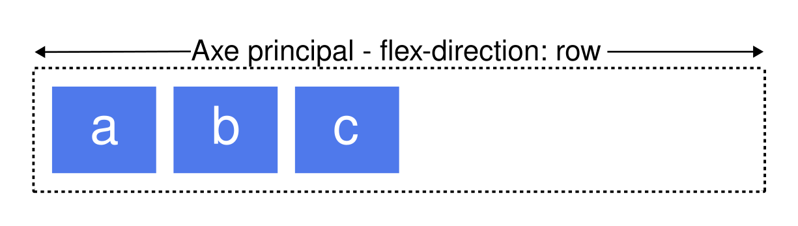

Les techniques de disposition telles que les boîtes flexibles et les grilles permettent de contrôler l'ordre du contenu. Dans cet article, nous allons examiner les différentes façons de modifier l'ordre visuel de votre contenu lorsque vous utilisez les boîtes flexibles. Nous voyons également comment le changement de l'ordre des éléments influe sur l'accessibilité.

## Inverser l'affichage des éléments

La propriété {{CSSxRef("flex-direction")}} peut être utilisée avec quatre valeurs&nbsp;:

- `row`
- `column`
- `row-reverse`
- `column-reverse`

Les deux premières valeurs permettent de conserver l'ordre des éléments tels qu'ils apparaissent dans le document source et de les afficher les uns à la suite des autres à partir de la ligne de début.




Les deux valeurs suivantes inversent l'ordre des éléments en échangeant les lignes de début et de fin.


Souvenez-vous que la ligne de début est liée aux modes d'écriture. Les exemples en incise ci-dessus montrent comment `row` et `row-reverse` fonctionnent dans une langue qui s'écrit de gauche à droite comme l'anglais. Si vous travaillez dans une langue qui s'écrit de droite à gauche comme l'arabe, alors `row` commence à droite et `row-reverse` à gauche.


Cela peut sembler être un moyen facile d'afficher les éléments dans l'ordre inverse. Cependant, vous devez garder à l'esprit que les éléments ne sont affichés en ordre inverse que _visuellement_. Les capacités de réorganisation du modèle flexible n'affectent que le rendu visuel. L'ordre de tabulation et l'ordre de lecture par les technologies d'assistance suivent l'ordre du code source. Cela signifie que seule la présentation visuelle change&nbsp;; l'ordre du code source reste le même, offrant une expérience utilisateur différente pour les agents non-CSS (pensez à Siri ou Alexa) et les utilisateur·ice·e de technologies d'assistance. Si vous changez l'ordre d'une barre de navigation, l'ordre de tabulation reste celui du code source du document, et non votre ordre visuel, ce qui peut être cognitivement déroutant.

Si vous utilisez une valeur inversée, ou que vous réorganisez autrement vos éléments, vous devez vous demander si vous devez vraiment changer l'ordre logique dans le code source.

La spécification du modèle de boîte flexible nous avertit de ne pas utiliser le changement de l'ordre comme moyen de corriger les problèmes de source&nbsp;:

> «&nbsp;Les auteur·ice·s _ne doivent pas_ utiliser l'ordre ou les valeurs \*-reverse de {{CSSxRef("flex-flow")}}/`flex-direction` comme substitut à un ordre correct dans le code source, car cela peut nuire à l'accessibilité du document.&nbsp;»

Comme vous changez par utilisation de <kbd>Tab</kbd> d'un lien à l'autre dans l'exemple interactif ci-dessous, le style de sélection est mis en évidence, démontrant que le changement de l'ordre des éléments flexibles avec `flex-direction` ne modifie pas l'ordre de tabulation, qui continue à suivre l'ordre du code source.

```html live-sample___flex-direction
<div class="boite">
  <div><a href="#">Un</a></div>
  <div><a href="#">Deux</a></div>
  <div><a href="#">Trois</a></div>
</div>
```

```css live-sample___flex-direction
.boite > * {
  border: 2px solid rgb(96 139 168);
  border-radius: 5px;
  background-color: rgb(96 139 168 / 0.2);
  padding: 10px;
}

.boite > * a:focus {
  background-color: yellow;
  color: black;
}

.boite {
  border: 2px dotted rgb(96 139 168);
  display: flex;
  flex-direction: row-reverse;
}
```

{{EmbedLiveSample("flex-direction")}}

De la même manière que le changement de la valeur de `flex-direction` ne modifie pas l'ordre de tabulation, le changement de cette valeur ne modifie pas l'ordre de rendu. Il s'agit uniquement d'une inversion visuelle des éléments.

## La propriété `order`

En plus d'inverser l'ordre dans lequel les éléments flexibles sont affichés visuellement, vous pouvez cibler des éléments individuels et modifier leur position dans l'ordre visuel avec la propriété {{CSSxRef("order")}}.

La propriété {{CSSxRef("order")}} est conçue pour disposer les éléments au sein de _groupes ordinaux_. Cela signifie que chaque élément reçoit un entier qui représente le numéro d'un groupe. Les éléments sont ensuite placés visuellement dans l'ordre qui correspond à cet entier, les éléments avec les numéros les plus petits étant placés en premiers. Si plusieurs éléments possèdent le même entier, les éléments de ce groupe sont alors ordonnés en suivant l'ordre du document source entre eux.

Dans cet exemple, cinq éléments flexibles se voient attribuer des valeurs `order` comme suit&nbsp;:

- Premier élément selon la source&nbsp;: `order: 2`
- Deuxième élément selon la source&nbsp;: `order: 3`
- Troisième élément selon la source&nbsp;: `order: 1`
- Quatrième élément selon la source&nbsp;: `order: 3`
- Cinquième élément selon la source&nbsp;: `order: 1`

Les éléments sont affichés sur la page dans l'ordre suivant&nbsp;:

- Troisième élément selon la source&nbsp;: `order: 1`
- Cinquième élément selon la source&nbsp;: `order: 1`
- Premier élément selon la source&nbsp;: `order: 2`
- Deuxième élément selon la source&nbsp;: `order: 3`
- Quatrième élément selon la source&nbsp;: `order: 3`


Amusez-vous à manipuler les valeurs dans cet exemple interactif ci-dessous et observez comment cela modifie l'ordre. Essayez également de changer `flex-direction` en `row-reverse` et voyez ce qui se passe — la ligne de départ est inversée, donc l'ordre commence du côté opposé.

```html live-sample___order
<div class="boite">
  <div><a href="#">1</a></div>
  <div><a href="#">2</a></div>
  <div><a href="#">3</a></div>
  <div><a href="#">4</a></div>
  <div><a href="#">5</a></div>
</div>
```

```css live-sample___order
.boite > * {
  border: 2px solid rgb(96 139 168);
  border-radius: 5px;
  background-color: rgb(96 139 168 / 0.2);
  padding: 10px;
}

.boite {
  border: 2px dotted rgb(96 139 168);
  display: flex;
  flex-direction: row;
}
.boite :nth-child(1) {
  order: 2;
}
.boite :nth-child(2) {
  order: 3;
}
.boite :nth-child(3) {
  order: 1;
}
.boite :nth-child(4) {
  order: 3;
}
.boite :nth-child(5) {
  order: 1;
}
```

{{EmbedLiveSample("order")}}

Les éléments flexibles ont par défaut une valeur de `order` de `0`. Par conséquent, les éléments avec une valeur entière supérieure à `0` sont affichés après tous les éléments pour lesquels aucune valeur explicite de `order` n'a été définie.

Vous pouvez également utiliser des valeurs négatives avec `order`, ce qui peut être très pratique. Si vous souhaitez qu'un élément s'affiche en premier tout en laissant l'ordre des autres éléments inchangé, vous pouvez attribuer à cet élément un ordre de `-1`. Comme cette valeur est inférieure à `0`, l'élément est toujours affiché en premier.

Dans l'exemple interactif ci-dessous, les éléments sont disposés avec les boîtes flexibles. En modifiant l'élément qui possède la classe `actif` dans le code HTML, vous pouvez modifier l'élément qui apparaît en premier et qui prend alors toute la largeur en haut, les autres éléments étant affichés en dessous.

```html live-sample___negative-order
<div class="boite">
  <div><a href="#">1</a></div>
  <div><a href="#">2</a></div>
  <div class="actif"><a href="#">3</a></div>
  <div><a href="#">4</a></div>
  <div><a href="#">5</a></div>
</div>
```

```css live-sample___negative-order
* {
  box-sizing: border-box;
}

.boite > * {
  border: 2px solid rgb(96 139 168);
  border-radius: 5px;
  background-color: rgb(96 139 168 / 0.2);
  padding: 10px;
}

.boite {
  width: 500px;
  border: 2px dotted rgb(96 139 168);
  display: flex;
  flex-wrap: wrap;
  flex-direction: row;
}

.actif {
  order: -1;
  flex: 1 0 100%;
}
```

{{EmbedLiveSample("negative-order")}}

Les éléments sont affichés dans ce que la spécification intitule _un ordre modifié à partir de l'ordre du document_. La valeur de la propriété `order` est prise en compte avant que les éléments soient affichés.

L'ordre modifie également l'ordre de rendu des éléments à l'écran. Les éléments pour lesquels `order` est plus petit sont affichés en premier et ceux avec un coefficient d'ordre plus élevé sont affichés ensuite.

## La propriété `order` et l'accessibilité

La propriété `order` a exactement les mêmes conséquences qu'une modification de `flex-direction` sur l'accessibilité. Utiliser `order` modifie l'ordre dans lequel les éléments sont affichés à l'écran et l'ordre dans lequel ils sont présentés visuellement. Cela ne modifie pas l'ordre de navigation. Aussi, si un·e utilisateur·ice navigue grâce aux tabulations entre les éléments, cette disposition peut prêter à confusion.

En utilisant la tabulation pour naviguer au sein des exemples interactifs de cette page, vous pouvez voir comment `order` peut créer une expérience de navigation étrange pour toute personne n'utilisant pas un dispositif de pointage comme une souris. Pour en savoir plus sur ce décalage entre l'ordre visuel et l'ordre logique et sur certains des problèmes potentiels qu'il soulève en matière d'accessibilité, consultez les ressources suivantes.

- [Navigation et déconnexion entre les boîtes flexibles et le clavier <sup>(angl.)</sup>](https://tink.uk/flexbox-the-keyboard-navigation-disconnect/) sur tink.uk (2016)
- [Ordre de la source HTML vs ordre d'affichage CSS <sup>(angl.)</sup>](https://adrianroselli.com/2015/10/html-source-order-vs-css-display-order.html) sur adrianroselli.com (2015)
- [Le conflit entre l'ordre adaptatif et la sélection au clavier <sup>(angl.)</sup>](https://alastairc.uk/blog/2017/06/the-responsive-order-conflict/) sur alastairc.uk (2017)

## Cas d'utilisation pour `order`

Il existe certains cas d'utilisation pour lesquels le fait que l'ordre logique et donc l'ordre de lecture des éléments flexibles soit séparé de l'ordre visuel est utile. Utilisée avec précaution, la propriété `order` peut permettre de mettre en œuvre facilement certains modèles courants utiles.

Vous pouvez avoir un design, peut-être une carte qui affiche un élément d'actualité. Le titre de l'élément d'actualité est l'élément clé à mettre en évidence et est l'élément sur lequel un utilisateur·ice peut sauter s'il navigue entre les titres pour trouver le contenu qu'il souhaite lire. La carte a également une date&nbsp;; le design final que nous voulons créer est quelque chose comme ceci.


Visuellement, la date apparaît au-dessus du titre, dans le code source. Cependant, si la carte est lue par un lecteur d'écran, je préfère que le titre soit annoncé en premier, puis la date de publication. Nous pouvons accomplir cela avec la propriété `order`.

La carte est notre conteneur flexible, avec `flex-direction` défini sur `column`. Nous donnons à la date un `order` de `-1`, la plaçant au-dessus du titre.

```html live-sample___usecase-order
<div class="enveloppe">
  <div class="carte">
    <h3>Titre de l'élément d'actualité</h3>
    <div class="date">1 Nov 2017</div>
    <p>Voici le contenu de mon élément d'actualité. Très digne d'intérêt.</p>
  </div>
  <div class="carte">
    <h3>Un autre titre</h3>
    <div class="date">6 Nov 2017</div>
    <p>Voici le contenu de mon élément d'actualité. Très digne d'intérêt.</p>
  </div>
</div>
```

```css live-sample___usecase-order
body {
  font-family: sans-serif;
}

.enveloppe {
  display: flex;
  flex: 1 1 200px;
  gap: 1em;
}

.carte {
  border: 2px solid rgb(96 139 168);
  border-radius: 5px;
  background-color: rgb(96 139 168 / 0.2);
  padding: 1em;
  display: flex;
  flex-direction: column;
}

.date {
  order: -1;
  text-align: right;
}
```

{{EmbedLiveSample("usecase-order", "", 220)}}

Ces petits ajustements sont le genre de cas où la propriété `order` a du sens. Conservez le même ordre logique que l'ordre de lecture et de tabulation du document, et maintenez-le de la manière la plus accessible et structurée possible. Ensuite, utilisez `order` pour des ajustements purement visuels. Ne réorganisez pas les éléments qui reçoivent le focus clavier. Assurez-vous de toujours tester votre contenu en utilisant uniquement un clavier plutôt qu'une souris ou un écran tactile&nbsp;; cela révèle si vos choix de développement rendent la navigation plus complexe.

## Voir aussi

- [Concepts simples des boîtes flexibles](/fr/docs/Web/CSS/Guides/Flexible_box_layout/Basic_concepts)
- [Relation entre les boîtes flexibles et les autres méthodes de disposition](/fr/docs/Web/CSS/Guides/Flexible_box_layout/Relationship_with_other_layout_methods)
- [Aligner les éléments dans un conteneur flexible](/fr/docs/Web/CSS/Guides/Flexible_box_layout/Aligning_items)
- [Contrôler les proportions des éléments flexibles le long de l'axe principal](/fr/docs/Web/CSS/Guides/Flexible_box_layout/Controlling_flex_item_ratios)
- [Maîtriser le passage à la ligne des éléments flexibles](/fr/docs/Web/CSS/Guides/Flexible_box_layout/Wrapping_items)
- [Cas d'utilisation typiques des boîtes flexibles](/fr/docs/Web/CSS/Guides/Flexible_box_layout/Use_cases)
- Le module [de disposition en boîte flexible CSS](/fr/docs/Web/CSS/Guides/Flexible_box_layout)
