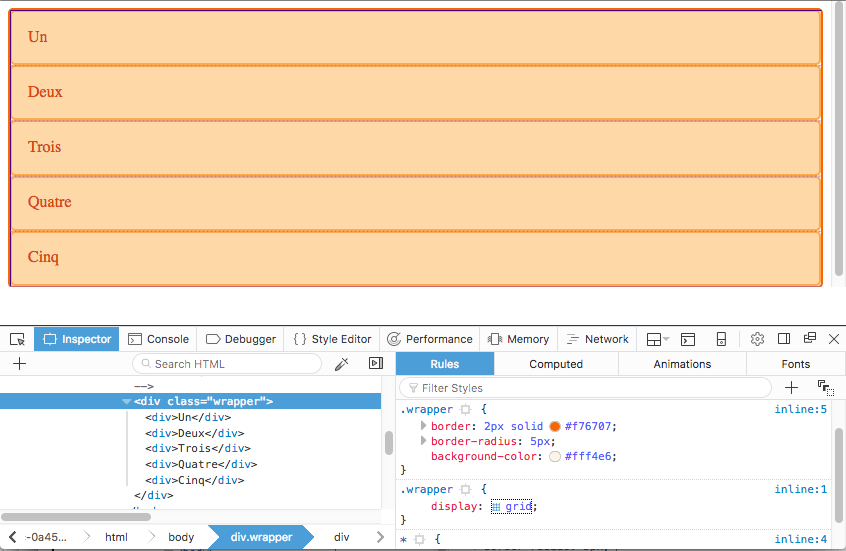
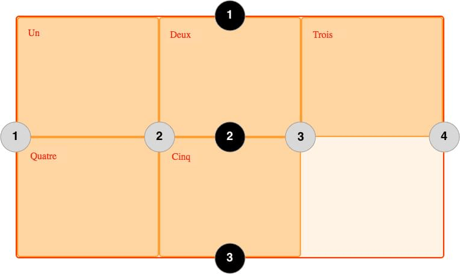
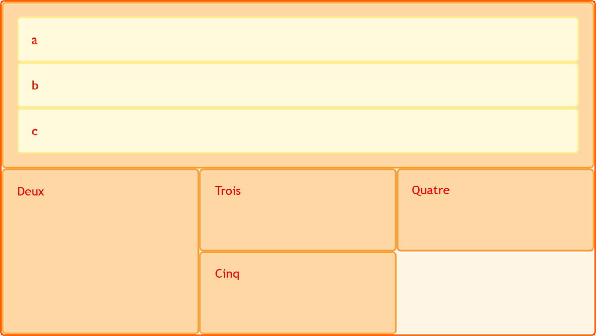

La [disposition en grille CSS](/fr/docs/Web/CSS/Guides/Grid_layout) introduit un système de grille en deux dimensions dans CSS. Les grilles peuvent être utilisées pour agencer des zones principales de la page ou de petits éléments d'interface utilisateur. Ce guide présente la disposition en grille CSS et la terminologie qui fait partie de la spécification de la disposition en grille CSS. Les fonctionnalités présentées dans cet aperçu sont ensuite expliquées plus en détail dans les autres guides de cette série.

## Qu'est-ce qu'une grille ?

Une grille est un ensemble de lignes horizontales et verticales qui se croisent et définissent des rangées et des colonnes. Les éléments peuvent être placés sur la grille, à l'intérieur de ces colonnes et rangées. La mise en page en grille CSS présente les caractéristiques suivantes&nbsp;:

### Pistes à taille fixe ou variable

On peut créer une grille avec des pistes à taille fixe — en utilisant par exemple des pixels. Cela définit la grille à la taille de pixel définie, ce qui correspond à la mise en page souhaitée. On peut également créer une grille avec des tailles flexibles en utilisant des pourcentages ou l'unité [`fr`](#lunité_fr) conçue à cet effet.

### Placement d'élément

Pour placer les éléments sur la grille, on peut utiliser le numéro ou le nom d'une ligne, ou cibler une zone particulière. La grille contient aussi un algorithme pour placer les éléments qui n'ont pas été placés explicitement.

### Création de pistes supplémentaires pour du contenu

Lorsqu'une grille explicite n'est pas définie, la spécification prend en charge le contenu défini en dehors d'une grille en ajoutant des colonnes et des rangées. Cela comprend des fonctionnalités telles que «&nbsp;l'ajout d'autant de colonnes que possible dans le conteneur&nbsp;».

### Contrôle de l'alignement

Les fonctionnalités de disposition en grille CSS et [d'alignement des boîtes CSS](/fr/docs/Web/CSS/Guides/Box_alignment) permettent de contrôler l'alignement des éléments une fois placés dans une zone de grille, ainsi que l'alignement de la grille entière.

### Contrôle des contenus qui se chevauchent

Plus d'un élément peut être placé dans une cellule ou une zone de la grille et ils peuvent se chevaucher partiellement. Cette superposition peut ensuite être contrôlée avec la propriété {{CSSxRef("z-index")}}.

La grille est un puissant module de mise en page qui, lorsqu'il est combiné avec d'autres parties de CSS telles que [les boîtes flexibles](/fr/docs/Web/CSS/Guides/Flexible_box_layout), peut vous aider à créer des mises en page réactives, flexibles et accessibles. Tout commence par la création d'une grille dans votre **{{Glossary("grid container", "conteneur de grille")}}**.

## Conteneur de grille

Nous créons un _conteneur de grille_ en déclarant `display: grid` ou `display: inline-grid` sur un élément. À partir du moment où on fait cela, tous les _enfants directs_ de cet élément deviennent des _éléments de grille_.

Dans cet exemple, nous avons un élément `<div>` contenant avec une classe `enveloppe`. À l'intérieur, il y a cinq éléments enfants.

```html
<div class="enveloppe">
  <div>Un</div>
  <div>Deux</div>
  <div>Trois</div>
  <div>Quatre</div>
  <div>Cinq</div>
</div>
```

Nous transformons `.enveloppe` en conteneur de grille en utilisant `display: grid;`.

```css
.enveloppe {
  display: grid;
}
```

```css hidden
* {
  box-sizing: border-box;
}

.enveloppe {
  border: 2px solid #f76707;
  border-radius: 5px;
  background-color: #fff4e6;
}

.enveloppe > div {
  border: 2px solid #ffa94d;
  border-radius: 5px;
  background-color: #ffd8a8;
  padding: 1em;
  color: #d9480f;
}
```

{{EmbedLiveSample("Conteneur de grille", 200, 300)}}

Tous les enfants directs sont maintenant des éléments de grille. Dans un navigateur web, vous ne voyez pas de différence dans la façon dont ces éléments sont affichés avant de les transformer en grille, car la grille a créé une grille à une seule colonne pour les éléments. Si vous inspectez la grille dans les outils de développement de votre navigateur, vous pouvez voir une petite icône à côté de la valeur `grid`. Cliquez dessus et, dans la plupart des navigateurs, la grille sur cet élément est superposée dans la fenêtre du navigateur.



Au fur et à mesure que vous apprenez et travaillez avec la mise en page de grille CSS, les outils de votre navigateur vous donnent une meilleure idée de ce qui se passe visuellement avec vos grilles.

Si nous voulons commencer à rendre cela plus semblable à une grille, nous devons ajouter des pistes pour les colonnes.

## Pistes de grille

Nous définissons les lignes et les colonnes de notre grille avec les propriétés {{CSSxRef("grid-template-rows")}} et {{CSSxRef("grid-template-columns")}}. Celles-ci définissent les {{Glossary("grid tracks")}}. Une _piste de grille_ est l'espace entre deux lignes adjacentes de la grille. L'image ci-dessous montre une piste mise en évidence — il s'agit de la piste de la première rangée de notre grille.


Les pistes de grille sont définies dans la [grille explicite](#grille_implicite_et_grille_explicite) en utilisant les propriétés `grid-template-columns` et `grid-template-rows` ou les propriétés raccourcies `grid` ou `grid-template`. Des pistes sont également créées dans la grille implicite en positionnant un élément de grille en dehors des pistes créées dans la grille explicite.

### Exemple simple

Nous pouvons ajouter des pistes de colonnes à notre exemple précédent en ajoutant la propriété `grid-template-columns`, puis en définissant la taille des pistes de colonnes.

Nous avons maintenant créé une grille avec trois pistes de colonnes de 200 pixels de large. Les éléments enfants sont disposés sur cette grille, un dans chaque cellule de la grille.

```html
<div class="enveloppe">
  <div>Un</div>
  <div>Deux</div>
  <div>Trois</div>
  <div>Quatre</div>
  <div>Cinq</div>
</div>
```

```css
.enveloppe {
  display: grid;
  grid-template-columns: 200px 200px 200px;
}
```

```css hidden
* {
  box-sizing: border-box;
}

.enveloppe {
  border: 2px solid #f76707;
  border-radius: 5px;
  background-color: #fff4e6;
}

.enveloppe > div {
  border: 2px solid #ffa94d;
  border-radius: 5px;
  background-color: #ffd8a8;
  padding: 1em;
  color: #d9480f;
}
```

{{EmbedLiveSample("Exemple simple", 610, 130)}}

### L'unité `fr`

Les pistes peuvent être définies à l'aide de n'importe quelle unité de mesure. Les grilles proposent aussi une nouvelle unité de mesure pour aider à la création de pistes flexibles. L'unité [`fr`](/fr/docs/Web/CSS/Reference/Values/flex_value) représente une fraction de l'espace disponible dans le conteneur de la grille. La définition de grille suivante crée trois pistes de largeur égale qui se redimensionnent en fonction de l'espace disponible.

```html
<div class="enveloppe">
  <div>Un</div>
  <div>Deux</div>
  <div>Trois</div>
  <div>Quatre</div>
  <div>Cinq</div>
</div>
```

```css
.enveloppe {
  display: grid;
  grid-template-columns: 1fr 1fr 1fr;
}
```

```css hidden
* {
  box-sizing: border-box;
}

.enveloppe {
  border: 2px solid #f76707;
  border-radius: 5px;
  background-color: #fff4e6;
}

.enveloppe > div {
  border: 2px solid #ffa94d;
  border-radius: 5px;
  background-color: #ffd8a8;
  padding: 1em;
  color: #d9480f;
}
```

{{EmbedLiveSample("L'unité `fr`", 220, 130)}}

### Tailles différentes

L'exemple suivant crée une grille avec une colonne de `2fr`, et deux colonnes de `1fr`. L'espace disponible est divisé en quatre. Les deux premières fractions sont allouées à la première colonne, et chacune des colonnes suivante dispose d'une fraction.

```html
<div class="enveloppe">
  <div>Un</div>
  <div>Deux</div>
  <div>Trois</div>
  <div>Quatre</div>
  <div>Cinq</div>
</div>
```

```css
.enveloppe {
  display: grid;
  grid-template-columns: 2fr 1fr 1fr;
}
```

```css hidden
* {
  box-sizing: border-box;
}

.enveloppe {
  border: 2px solid #f76707;
  border-radius: 5px;
  background-color: #fff4e6;
}

.enveloppe > div {
  border: 2px solid #ffa94d;
  border-radius: 5px;
  background-color: #ffd8a8;
  padding: 1em;
  color: #d9480f;
}
```

{{EmbedLiveSample("Tailles différentes", 220, 130)}}

### Mélanger des tailles flexibles et absolues

Dans ce dernier exemple, nous mélangeons des pistes de taille absolue avec des unités `fr`. La première piste fait `500px`, donc cette largeur fixe est soustraite de l'espace disponible. L'espace restant est divisé en trois et attribué proportionnellement aux deux pistes flexibles.

```html
<div class="enveloppe">
  <div>Un</div>
  <div>Deux</div>
  <div>Trois</div>
  <div>Quatre</div>
  <div>Cinq</div>
</div>
```

```css
.enveloppe {
  display: grid;
  grid-template-columns: 500px 1fr 2fr;
}
```

```css hidden
* {
  box-sizing: border-box;
}

.enveloppe {
  border: 2px solid #f76707;
  border-radius: 5px;
  background-color: #fff4e6;
}

.enveloppe > div {
  border: 2px solid #ffa94d;
  border-radius: 5px;
  background-color: #ffd8a8;
  padding: 1em;
  color: #d9480f;
}
```

{{EmbedLiveSample("Mélanger des tailles flexibles et absolues", 220, 130)}}

### Utiliser la notation `repeat()` pour définir les pistes

Pour les grilles comprenant de nombreuses pistes, on peut utiliser la notation {{CSSxRef("repeat()")}} pour répéter toute ou une partie des pistes définies. Par exemple la définition de grille&nbsp;:

```css
.enveloppe {
  display: grid;
  grid-template-columns: 1fr 1fr 1fr;
}
```

Peut également s'écrire&nbsp;:

```css
.enveloppe {
  display: grid;
  grid-template-columns: repeat(3, 1fr);
}
```

La notation de répétition peut être utilisée pour une partie de la liste des pistes. Dans cet exemple, nous créons une grille à 8 colonnes&nbsp;; la première piste fait `20px`, puis une section répétant 6 fois une piste de `1fr`, et enfin une piste finale de `20px`.

```css
.enveloppe {
  display: grid;
  grid-template-columns: 20px repeat(6, 1fr) 20px;
}
```

La notation de répétition (`repeat()`) utilise la liste des pistes pour créer un motif répétitif de pistes. Dans cet exemple, la grille a 10 pistes&nbsp;; une piste de `1fr` est suivie d'une piste de `2fr`, ce motif étant répété cinq fois.

```css
.enveloppe {
  display: grid;
  grid-template-columns: repeat(5, 1fr 2fr);
}
```

### Grille implicite et grille explicite

Lorsque nous créons notre grille d'exemple, nous définissons spécifiquement nos pistes de colonnes avec la propriété {{CSSxRef("grid-template-columns")}}, la grille créant des rangées au besoin pour s'adapter au contenu. Les colonnes définissent la grille explicite tandis que les rangées font partie de la grille implicite.

La _grille explicite_ est constituée des rangées et colonnes définies avec {{CSSxRef("grid-template-columns")}} ou {{CSSxRef("grid-template-rows")}}.
La _grille implicite_ étend la grille explicite définie lorsque du contenu est placé en dehors de cette grille, par exemple dans les rangées en traçant des rangées de grille supplémentaires.

Si vous placez quelque chose en dehors de la grille définie ou, en raison de la quantité de contenu, que davantage de pistes de grille sont nécessaires, alors la grille crée des rangées et des colonnes dans la _grille implicite_. Ces pistes implicites sont dimensionnées automatiquement par défaut, ce qui signifie que la taille des rangées ou colonnes créées est influencée à la fois par leur contenu et par l'espace libre disponible dans le conteneur de la grille. Le mot-clé `auto` permet aux pistes générées de s'adapter au contenu tout en partageant l'espace restant.

Vous pouvez également définir une taille fixe pour les pistes créées dans la grille implicite avec les propriétés {{CSSxRef("grid-auto-rows")}} et {{CSSxRef("grid-auto-columns")}}.

Dans cet exemple, nous définissons `grid-auto-rows: 200px`, garantissant que les pistes créées dans cette grille implicite ont une hauteur de `200px`.

```html
<div class="enveloppe">
  <div>Un</div>
  <div>Deux</div>
  <div>Trois</div>
  <div>Quatre</div>
  <div>Cinq</div>
</div>
```

```css
.enveloppe {
  display: grid;
  grid-template-columns: repeat(3, 1fr);
  grid-auto-rows: 200px;
}
```

```css hidden
* {
  box-sizing: border-box;
}

.enveloppe {
  border: 2px solid #f76707;
  border-radius: 5px;
  background-color: #fff4e6;
}

.enveloppe > div {
  border: 2px solid #ffa94d;
  border-radius: 5px;
  background-color: #ffd8a8;
  padding: 1em;
  color: #d9480f;
}
```

{{EmbedLiveSample("Grille implicite et grille explicite", 230, 420)}}

### Dimensionner une piste avec `minmax()`

Lors de la configuration d'une grille explicite ou de la définition de la taille des lignes ou colonnes créées automatiquement, nous pouvons vouloir donner aux pistes une taille minimale, tout en nous assurant qu'elles s'étendent pour s'adapter à tout contenu ajouté. Par exemple, nous pouvons vouloir que nos lignes ne s'effondrent jamais en dessous de 100 pixels, mais si notre contenu s'étend à 300 pixels de hauteur, nous voudrions que la ligne s'étende à cette hauteur. Cela est résolu par la fonction {{CSSxRef("minmax()")}}.

Dans cet exemple, nous utilisons `minmax()` dans la valeur de la propriété `grid-auto-rows`. En définissant `grid-auto-rows: minmax(100px, auto);`, les lignes créées automatiquement ont une hauteur minimale de `100px` et un maximum de `auto`. Définir `auto` comme valeur maximale permet à la piste de s'agrandir pour accueillir son contenu (jusqu'à sa taille `max-content`) tout en partageant également tout espace libre disponible dans le conteneur de la grille.

```css
.enveloppe {
  display: grid;
  grid-template-columns: repeat(3, 1fr);
  grid-auto-rows: minmax(100px, auto);
}
```

```css hidden
* {
  box-sizing: border-box;
}

.enveloppe {
  border: 2px solid #f76707;
  border-radius: 5px;
  background-color: #fff4e6;
}

.enveloppe > div {
  border: 2px solid #ffa94d;
  border-radius: 5px;
  background-color: #ffd8a8;
  padding: 1em;
  color: #d9480f;
}
```

```html
<div class="enveloppe">
  <div>Un</div>
  <div>
    Deux
    <p>Davantage de contenu.</p>
    <p>On dépasse les 100 pixels.</p>
  </div>
  <div>Trois</div>
  <div>Quatre</div>
  <div>Cinq</div>
</div>
```

{{EmbedLiveSample("Dimensionner une piste avec `minmax()`", 240, 260)}}

## Lignes de grille

Il faut noter que l'on définit les pistes d'une grille, et pas les lignes qui en résultent. La grille génère des lignes numérotées que l'on utilise pour positionner les éléments. Dans notre grille de trois colonnes et deux rangées, nous avons quatre lignes de colonnes.



Les lignes sont numérotées selon le sens de lecture du document. Dans un langage qui se lit de gauche à droite, la ligne 1 est située à gauche, dans un langage qui se lit de droite à gauche elle est située à droite. Les lignes peuvent aussi être nommées, comme nous le voyons dans le guide [de disposition de grille avec des lignes de grille nommées](/fr/docs/Web/CSS/Guides/Grid_layout/Named_grid_lines).

### Positionnement des éléments sur les lignes

L'exemple suivant illustre le placement de base basé sur les lignes&nbsp;; lorsque nous plaçons un élément, nous ciblons la ligne plutôt que la piste. Nous explorons cela plus en détail dans le guide [de disposition de grille avec placement basé sur les lignes](/fr/docs/Web/CSS/Guides/Grid_layout/Line-based_placement).

Dans cet exemple, les deux premiers éléments de notre grille à trois colonnes sont placés en utilisant les propriétés {{CSSxRef("grid-column-start")}}, {{CSSxRef("grid-column-end")}}, {{CSSxRef("grid-row-start")}} et {{CSSxRef("grid-row-end")}}. En allant de gauche à droite, le premier élément est placé sur la ligne de colonne 1, et s'étend jusqu'à la ligne de colonne 4, qui dans notre cas est la ligne la plus à droite de la grille. Il commence à la ligne de rangée 1 et se termine à la ligne de rangée 3, s'étendant ainsi sur deux pistes de rangée.

Le deuxième élément commence sur la ligne de colonne 1 et s'étend sur une piste. C'est la valeur par défaut, donc nous n'avons pas besoin de définir la ligne de fin. Il s'étend également sur deux pistes de rangée, de la ligne de rangée 3 à la ligne de rangée 5. Les autres éléments se placent dans les espaces vides de la grille.

```html
<div class="enveloppe">
  <div class="boite1">Un</div>
  <div class="boite2">Deux</div>
  <div class="boite3">Trois</div>
  <div class="boite4">Quatre</div>
  <div class="boite5">Cinq</div>
</div>
```

```css
.enveloppe {
  display: grid;
  grid-template-columns: repeat(3, 1fr);
  grid-auto-rows: 100px;
}

.boite1 {
  grid-column-start: 1;
  grid-column-end: 4;
  grid-row-start: 1;
  grid-row-end: 3;
}

.boite2 {
  grid-column-start: 1;
  grid-row-start: 3;
  grid-row-end: 5;
}
```

```css hidden
* {
  box-sizing: border-box;
}

.enveloppe {
  border: 2px solid #f76707;
  border-radius: 5px;
  background-color: #fff4e6;
}

.enveloppe > div {
  border: 2px solid #ffa94d;
  border-radius: 5px;
  background-color: #ffd8a8;
  padding: 1em;
  color: #d9480f;
}
```

{{EmbedLiveSample("Positionnement des éléments sur les lignes", 230, 420)}}

Utilisez l'inspecteur de grille dans vos outils de développement pour voir comment les éléments se positionnent par rapport aux lignes de la grille.

### Raccourcis de positionnement sur ligne

Les valeurs détaillées utilisées plus haut peuvent être abrégées en une ligne pour les colonnes avec le raccourci {{CSSxRef("grid-column")}}, et en une ligne pour les rangées avec le raccourci {{CSSxRef("grid-row")}}. L'exemple suivant donne le même positionnement que dans le code précédent, mais avec beaucoup moins de CSS. La valeur avant le caractère barre oblique (`/`) est la ligne de début, la valeur après est la ligne de fin.

Vous pouvez omettre la valeur de la ligne de fin si la zone ne recouvre qu'une piste.

```css
.enveloppe {
  display: grid;
  grid-template-columns: repeat(3, 1fr);
  grid-auto-rows: 100px;
}

.boite1 {
  grid-column: 1 / 4;
  grid-row: 1 / 3;
}

.boite2 {
  grid-column: 1;
  grid-row: 3 / 5;
}
```

## Cellules de grille

Une _cellule de grille_ est la plus petite unité sur une grille. Conceptuellement, c'est comme une cellule de tableau. Comme nous l'avons vu dans nos exemples précédents, une fois qu'une grille est définie sur un élément parent, les éléments enfants se positionnent chacun dans une cellule de la grille définie. Dans l'image ci-dessous, la première cellule de la grille est mise en avant.


## Zones de grille

Un élément peut s'étendre sur une ou plusieurs cellules, que ce soit par ligne ou par colonne, et cela crée une _zone de grille_. Les zones de grille doivent être rectangulaires — il n'est pas possible de créer une zone en forme de L par exemple. La zone de grille mise en avant s'étend sur deux lignes et deux colonnes.


## Gouttières

Les _gouttières_ ou _allées_ entre les cellules de la grille peuvent être créées à l'aide des propriétés {{CSSxRef("column-gap")}} et {{CSSxRef("row-gap")}}, ou de la propriété raccourcie {{CSSxRef("gap")}}. Dans l'exemple ci-dessous, nous ajoutons une gouttière de 10 pixels entre les colonnes et une gouttière de `1em` entre les lignes.

```css
.enveloppe {
  display: grid;
  grid-template-columns: repeat(3, 1fr);
  column-gap: 10px;
  row-gap: 1em;
}
```

```html
<div class="enveloppe">
  <div>Un</div>
  <div>Deux</div>
  <div>Trois</div>
  <div>Quatre</div>
  <div>Cinq</div>
</div>
```

```css hidden
* {
  box-sizing: border-box;
}

.enveloppe {
  column-gap: 10px;
  row-gap: 1em;
  border: 2px solid #f76707;
  border-radius: 5px;
  background-color: #fff4e6;
}

.enveloppe > div {
  border: 2px solid #ffa94d;
  border-radius: 5px;
  background-color: #ffd8a8;
  padding: 1em;
  color: #d9480f;
}
```

{{EmbedLiveSample("Gouttières")}}

L'espace utilisé par les gouttières est pris en compte avant l'assignation de la place restante aux pistes définies avec l'unité `fr`. La taille des gouttières est calculée comme celle des pistes, mais on ne peut pas placer d'élément dans une gouttière. Au niveau du positionnement des éléments sur les lignes, la gouttière se comporte comme une ligne épaisse et transparente.

## Grilles imbriquées

Un élément placé dans une grille peut aussi être le conteneur d'une autre grille. Dans l'exemple suivant nous retrouvons la grille de trois colonnes créée plus haut, avec deux éléments explicitement positionnés. Le premier élément contient lui-même des éléments. Comme ils ne sont pas des enfants directs de la grille principale, ils se positionnent normalement dans le flux.



### Imbrication sans sous-grille

En définissant la propriété `display: grid` sur l'élément `boite1`, il devient lui-même une grille et ses enfants se positionnent sur cette grille.

```html hidden
<div class="enveloppe">
  <div class="boite boite1">
    <div class="imbrique">a</div>
    <div class="imbrique">b</div>
    <div class="imbrique">c</div>
  </div>
  <div class="boite boite2">Deux</div>
  <div class="boite boite3">Trois</div>
  <div class="boite boite4">Quatre</div>
  <div class="boite boite5">Cinq</div>
</div>
```

```css
* {
  box-sizing: border-box;
}

.enveloppe {
  border: 2px solid #f76707;
  border-radius: 5px;
  gap: 3px;
  background-color: #fff4e6;
  display: grid;
  grid-template-columns: repeat(3, 1fr);
}

.boite {
  border: 2px solid #ffa94d;
  border-radius: 5px;
  background-color: #ffd8a8;
  padding: 1em;
  color: #d9480f;
}

.boite1 {
  grid-column-start: 1;
  grid-column-end: 4;
  grid-row-start: 1;
  grid-row-end: 3;
  display: grid;
  grid-template-columns: repeat(3, 1fr);
}

.imbrique {
  border: 2px solid #ffec99;
  border-radius: 5px;
  background-color: #fff9db;
  padding: 1em;
}
```

{{EmbedLiveSample("Imbrication sans sous-grille", 600, 220)}}

Dans ce cas, la grille imbriquée n'a aucun lien avec la grille parente. Comme vous pouvez le voir dans l'exemple, elle n'a pas hérité du {{CSSxRef("gap")}} de la grille parente et les lignes de la grille imbriquée ne s'alignent pas avec celles de la grille parente.

### Sous-grille

En plus des grilles régulières, nous pouvons créer une _sous-grille_. La valeur `subgrid` nous permet de créer des grilles imbriquées qui utilisent la définition des pistes de la grille parente.

Pour les utiliser, nous modifions l'exemple de grille imbriquée ci-dessus pour changer la définition des pistes de `grid-template-columns: repeat(3, 1fr)` en `grid-template-columns: subgrid`. La grille imbriquée utilise alors les pistes de la grille parente pour disposer les éléments.

```css
.boite1 {
  grid-column-start: 1;
  grid-column-end: 4;
  grid-row-start: 1;
  grid-row-end: 3;
  display: grid;
  grid-template-columns: subgrid;
}
```

## Superposer les éléments avec `z-index`

Les éléments de la grille peuvent occuper la même cellule, et dans ce cas, nous pouvons utiliser la propriété {{CSSxRef("z-index")}} pour contrôler l'ordre dans lequel les éléments se superposent.

### Chevauchement sans `z-index`

Si nous reprenons notre exemple avec les éléments positionnés par numéros de ligne, nous pouvons modifier cela pour que deux éléments se chevauchent.

```html
<div class="enveloppe">
  <div class="boite boite1">Un</div>
  <div class="boite boite2">Deux</div>
  <div class="boite boite3">Trois</div>
  <div class="boite boite4">Quatre</div>
  <div class="boite boite5">Cinq</div>
</div>
```

```css
.enveloppe {
  display: grid;
  grid-template-columns: repeat(3, 1fr);
  grid-auto-rows: 100px;
}

.boite1 {
  grid-column-start: 1;
  grid-column-end: 4;
  grid-row-start: 1;
  grid-row-end: 3;
}

.boite2 {
  grid-column-start: 1;
  grid-row-start: 2;
  grid-row-end: 4;
}
```

```css hidden
* {
  box-sizing: border-box;
}

.enveloppe {
  border: 2px solid #f76707;
  border-radius: 5px;
  background-color: #fff4e6;
}

.boite {
  border: 2px solid #ffa94d;
  border-radius: 5px;
  background-color: #ffd8a8;
  padding: 1em;
  color: #d9480f;
}
```

{{EmbedLiveSample("Chevauchement sans `z-index`", 230, 420)}}

L'élément `boite2` chevauche maintenant `boite1`, il s'affiche par-dessus parce qu'il arrive après dans le code source.

### Contrôler l'ordre de superposition

Nous pouvons contrôler l'ordre dans lequel les éléments s'empilent en utilisant la propriété `z-index`. Si nous donnons à `boite2` un `z-index` inférieur à celui de `boite1`, l'élément `boite2` s'affiche sous `boite1` dans la pile.

```css
.enveloppe {
  display: grid;
  grid-template-columns: repeat(3, 1fr);
  grid-auto-rows: 100px;
}

.boite1 {
  grid-column-start: 1;
  grid-column-end: 4;
  grid-row-start: 1;
  grid-row-end: 3;
  z-index: 2;
}

.boite2 {
  grid-column-start: 1;
  grid-row-start: 2;
  grid-row-end: 4;
  z-index: 1;
}
```

```html hidden
<div class="enveloppe">
  <div class="boite boite1">Un</div>
  <div class="boite boite2">Deux</div>
  <div class="boite boite3">Trois</div>
  <div class="boite boite4">Quatre</div>
  <div class="boite boite5">Cinq</div>
</div>
```

```css hidden
* {
  box-sizing: border-box;
}

.enveloppe {
  border: 2px solid #f76707;
  border-radius: 5px;
  background-color: #fff4e6;
}

.boite {
  border: 2px solid #ffa94d;
  border-radius: 5px;
  background-color: #ffd8a8;
  padding: 1em;
  color: #d9480f;
}
```

{{EmbedLiveSample("Contrôler l'ordre de superposition", 230, 420)}}

## Prochaines étapes

Dans cet article nous avons parcouru rapidement ce qu'il est possible de construire avec les grilles CSS. Expérimentez et jouez avec les exemples, avant de passer [à la suite de ce guide](/fr/docs/Web/CSS/Guides/Grid_layout/Relationship_with_other_layout_methods) pour commencer à vraiment plonger dans le détail des dispositions en grille CSS.
