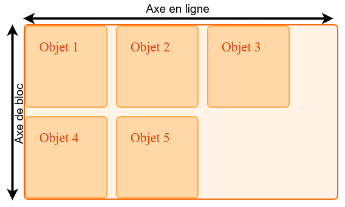

L'une des fonctionnalités les plus importantes de la disposition en grille CSS est la prise en charge des différents modes d'écriture intégrée dans la spécification. Dans ce guide, nous examinons cette fonctionnalité de la disposition en grille CSS et d'autres méthodes de disposition modernes, en apprenant un peu sur les modes d'écriture et les propriétés logiques par rapport aux propriétés physiques au fur et à mesure.

## Propriétés logiques et physiques, et les valeurs

CSS regorge de propriétés et de mots-clés de positionnement **physiques** — `left` et `right`, `top` et `bottom`. Dans le fragment de code ci-dessous, nous positionnons un élément en utilisant le positionnement absolu et utilisons les {{Glossary("inset properties", "propriétés d'encart")}} physiques comme valeurs de décalage pour déplacer l'élément. L'élément est placé à 20 pixels du haut et à 30 pixels du bord gauche du conteneur&nbsp;:

```css
.conteneur {
  position: relative;
}
.element {
  position: absolute;
  top: 20px;
  left: 30px;
}
```

```html
<div class="conteneur">
  <div class="element">Élément</div>
</div>
```

Cet exemple utilise les propriétés {{CSSxRef("left")}} et {{CSSxRef("right")}}&nbsp;; ce ne sont que deux des nombreuses **{{Glossary("physical properties", "propriétés physiques")}}** en CSS. On peut également ajouter des marges, du remplissage et des bordures en utilisant des propriétés physiques, par exemple {{CSSxRef("margin-left")}} et {{CSSxRef("padding-left")}}. Vous pouvez également voir des mots-clés physiques en usage, comme lorsque vous utilisez `text-align: right` pour aligner le texte à droite.

Nous appelons ces mots-clés et ces propriétés _physiques_ parce qu'ils se rapportent à l'écran que vous regardez. La gauche reste toujours la gauche, quelle que soit la direction dans laquelle s'écoule votre texte.

### Les problèmes des propriétés physiques

Les propriétés physiques peuvent poser des problèmes lorsqu'on développe un site qui doit fonctionner dans plusieurs langues, y compris celles où le texte s'écoule de droite à gauche ou de haut en bas. Les navigateurs sont conçus pour afficher correctement le contenu quelle que soit la langue. Certaines fonctionnalités CSS peuvent remplacer les paramètres par défaut du navigateur et entraîner un affichage moins optimal du contenu.

Dans cet exemple, la propriété {{CSSxRef("direction")}} a été définie sur {{Glossary("rtl")}}, ce qui change le sens d'écriture par défaut d'un document en anglais de `ltr`. Nous avons deux paragraphes. Les deux doivent s'écouler de droite à gauche en raison de la valeur `direction` définie sur un élément ancêtre (`<body>`). Le premier paragraphe a {{CSSxRef("text-align")}} défini sur `left`, il s'aligne donc à gauche de son conteneur. Le deuxième paragraphe s'aligne à droite et s'écoule de droite à gauche.

```html hidden
<p class="gauche">
  Pour ce paragraphe, on a <code>text-align: left</code>, il est donc toujours
  aligné à gauche, même si le sens d'écriture du document va de droite à gauche
  (rtl).
</p>

<p>
  Aucun alignement imposé sur ce paragraphe, il suit la direction du document.
</p>
```

```css hidden
body {
  direction: rtl;
}

p {
  border: 2px solid #ffa94d;
  border-radius: 5px;
  background-color: #ffd8a8;
  padding: 1em;
  margin: 1em;
  color: #d9480f;
}

.gauche {
  text-align: left;
}
```

{{EmbedLiveSample("Les problèmes des propriétés physiques","",175)}}

Il s'agit d'une démonstration élémentaire des problèmes pouvant survenir lors de l'utilisation de valeurs et de propriétés physiques en CSS. Si nous écrivons du CSS en utilisant des propriétés et des mots-clés physiques, nous imposons au navigateur notre hypothèse quant à la manière dont le texte doit s'afficher et l'empêchons de prendre en charge d'autres modes d'écriture.

### Les propriétés et valeurs logiques

Les **valeurs et {{Glossary("logical properties", "propriétés logiques")}}** n'assument pas de direction du texte. C'est pourquoi nous utilisons le mot-clé `start` dans la disposition en grille CSS pour aligner un élément sur le début d'un conteneur. Avec un contenu en anglais, `start` se trouve à gauche, mais ce n'est pas obligatoire. Le mot `start` n'indique aucun emplacement physique, ce qui permet aux sites web de commencer le contenu à droite lorsque des langues s'écrivant de droite à gauche, comme l'arabe, sont utilisées.

## L'axe de bloc et l'axe en incise

Lorsque nous utilisons des propriétés logiques plutôt que physiques, nous ne considérons pas le monde de gauche à droite et de haut en bas. Nous avons un autre point de référence. C'est ici que la compréhension des axes _de bloc_ (<i lang="en">block</i> en anglais) et _en incise_ (<i lang="en">inline</i> en anglais), introduits dans le [guide sur l'alignement dans les grilles](/fr/docs/Web/CSS/Guides/Grid_layout/Box_alignment), devient très utile. Si vous réfléchissez à la disposition en termes de bloc et d'incise, le fonctionnement de la disposition en grille CSS devient beaucoup plus clair.



## Les modes d'écriture CSS

Le module [des modes d'écriture CSS](/fr/docs/Web/CSS/Guides/Writing_modes) définit comment les modes d'écriture fonctionnent en CSS. Ces fonctionnalités ne servent pas uniquement à prendre en charge des langues dont le mode d'écriture est différent de celui du français&nbsp;; elles peuvent également être utilisées à des fins créatives. Les exemples de cette section utilisent la propriété {{CSSxRef("writing-mode")}} pour modifier le mode d'écriture appliqué à notre grille, démontrant ainsi le fonctionnement des valeurs logiques dans le processus.

### `writing-mode`

Les modes d'écriture ne se limitent pas à l'écriture de gauche à droite ou de droite à gauche, et la propriété `writing-mode` nous permet d'afficher du texte dans d'autres directions. La propriété {{CSSxRef("writing-mode")}} peut prendre les valeurs suivantes&nbsp;:

- `horizontal-tb`
- `vertical-rl`
- `vertical-lr`
- `sideways-rl`
- `sideways-lr`

La valeur `horizontal-tb`, qui signifie «&nbsp;horizontal, de haut en bas&nbsp;», est la valeur par défaut du texte sur le Web. C'est la direction dans laquelle vous lisez ce guide. Les autres valeurs modifient la façon dont le texte s'écoule dans notre document, en correspondant aux différents modes d'écriture utilisés dans le monde.

Par exemple, nous avons deux paragraphes ci-dessous. Le premier utilise la valeur par défaut `horizontal-tb` et le second utilise `vertical-rl`. Dans le deuxième mode d'écriture, le texte s'étend toujours de gauche à droite, mais sa direction est verticale — le texte en incise s'étend désormais vers le bas de la page, de haut en bas.

```css hidden
.enveloppe > p {
  border: 2px solid #ffa94d;
  border-radius: 5px;
  background-color: #ffd8a8;
  padding: 1em;
  margin: 1em;
  color: #d9480f;
  max-width: 300px;
}
```

```html
<div class="enveloppe">
  <p style="writing-mode: horizontal-tb">
    Mon mode d'écriture est celui par défaut <code>horizontal-tb</code>
  </p>
  <p style="writing-mode: vertical-rl">
    Moi je suis écrit avec <code>vertical-rl</code>
  </p>
</div>
```

{{EmbedLiveSample("`writing-mode`", 500, 380)}}

## La gestion des modes d'écriture avec une grille

Si on reprend l'exemple avec la grille, on comprend mieux l'effet du changement du mode d'écriture qui change les axes logiques.

### Mode d'écriture par défaut

Dans cet exemple, la grille possède trois colonnes et deux pistes de lignes. Cela signifie qu'il y a trois pistes qui descendent le long de l'axe de bloc. Avec le mode d'écriture par défaut, la grille place automatiquement les éléments en commençant par le coin supérieur gauche, en se déplaçant vers la droite, en remplissant les trois cellules sur l'axe en incise. Elle passe ensuite à la ligne suivante, créant une nouvelle piste de lignes, et remplit davantage d'éléments&nbsp;:

```css hidden
* {
  box-sizing: border-box;
}

.enveloppe {
  border: 2px solid #f76707;
  border-radius: 5px;
  background-color: #fff4e6;
}

.enveloppe > div {
  border: 2px solid #ffa94d;
  border-radius: 5px;
  background-color: #ffd8a8;
  padding: 1em;
  color: #d9480f;
}
```

```css
.enveloppe {
  display: grid;
  grid-template-columns: repeat(3, 100px);
  grid-template-rows: repeat(2, 100px);
  gap: 10px;
}
```

```html
<div class="enveloppe">
  <div class="element1">Élément 1</div>
  <div class="element2">Élément 2</div>
  <div class="element3">Élément 3</div>
  <div class="element4">Élément 4</div>
  <div class="element5">Élément 5</div>
</div>
```

{{EmbedLiveSample("Mode d'écriture par défaut", 500, 215)}}

### Définir le mode d'écriture

Si on ajoute `writing-mode: vertical-lr` au conteneur de la grille, on peut voir que les axes logiques s'appliquent désormais dans une autre direction. L'axe de bloc (aussi appelé l'axe des colonnes pour la grille) s'étend maintenant de gauche à droite et l'axe en incise court verticalement, de haut en bas.

```css hidden
* {
  box-sizing: border-box;
}

.enveloppe {
  border: 2px solid #f76707;
  border-radius: 5px;
  background-color: #fff4e6;
}

.enveloppe > div {
  border: 2px solid #ffa94d;
  border-radius: 5px;
  background-color: #ffd8a8;
  padding: 1em;
  color: #d9480f;
}
.enveloppe {
  display: grid;
  grid-template-columns: repeat(3, 100px);
  grid-template-rows: repeat(2, 100px);
  gap: 10px;
}
```

```css
.enveloppe {
  writing-mode: vertical-lr;
}
```

```html
<div class="enveloppe">
  <div class="element1">Élément 1</div>
  <div class="element2">Élément 2</div>
  <div class="element3">Élément 3</div>
  <div class="element4">Élément 4</div>
  <div class="element5">Élément 5</div>
</div>
```

{{EmbedLiveSample("Définir le mode d'écriture", 500, 330)}}

## L'utilisation de valeurs logiques pour l'alignement

Avec les axes de bloc et en incise capables de changer de direction, les valeurs logiques pour les propriétés d'alignement commencent à avoir plus de sens.

Dans cet exemple, nous utilisons l'alignement (les propriétés {{CSSxRef("align-self")}} et {{CSSxRef("justify-self")}}) pour aligner des éléments dans une grille définie avec `writing-mode: vertical-lr`. Les propriétés `start` et `end` fonctionnent exactement de la même manière que dans le mode d'écriture par défaut et restent logiques, contrairement à l'utilisation de `left` et `right`, `top` et `bottom` pour aligner les éléments. Cela se produit une fois que nous avons basculé la grille sur le côté, comme ceci&nbsp;:

```css hidden
* {
  box-sizing: border-box;
}

.enveloppe {
  border: 2px solid #f76707;
  border-radius: 5px;
  background-color: #fff4e6;
}

.enveloppe > div {
  border: 2px solid #ffa94d;
  border-radius: 5px;
  background-color: #ffd8a8;
  padding: 1em;
  color: #d9480f;
}
```

```css
.enveloppe {
  writing-mode: vertical-lr;
  display: grid;
  grid-template-columns: repeat(3, 1fr);
  grid-template-rows: repeat(3, 100px);
  gap: 10px;
}

.element1 {
  grid-column: 1 / 4;
  align-self: start;
}

.element2 {
  grid-column: 1 / 3;
  grid-row: 2 / 4;
  align-self: start;
}

.element3 {
  grid-column: 3;
  grid-row: 2 / 4;
  align-self: end;
  justify-self: end;
}
```

```html
<div class="enveloppe">
  <div class="element1">Élément 1</div>
  <div class="element2">Élément 2</div>
  <div class="element3">Élément 3</div>
</div>
```

{{EmbedLiveSample("L'utilisation de valeurs logiques pour l'alignement", 500, 240)}}

Si vous souhaitez voir l'effet obtenu avec une écriture verticale de haut en bas et de droite à gauche, il suffit de passer de `vertical-lr` à `vertical-rl` pour changer de mode d'écriture.

## Le placement automatique et les modes d'écriture

Comme nous l'avons vu dans les exemples précédents, le mode d'écriture peut modifier la direction visuelle selon laquelle les éléments se positionnent sur la grille. Par défaut, les éléments se positionnent le long de l'axe en incise, en ajoutant de nouvelles lignes dans la direction de bloc. Nous avons désormais constaté que l'axe en incise ne s'étend pas toujours de gauche à droite, et que l'axe de bloc ne s'étend pas toujours de haut en bas.

## Le placement sur les lignes et les modes d'écriture

Ce qu'il faut surtout retenir lorsque l'on classe des éléments par numéro de ligne, c'est que la ligne 1 correspond au début et la ligne -1 à la fin, quel que soit le mode d'écriture utilisé.

### Placement sur les lignes pour du texte de gauche à droite

Dans l'exemple suivant, on a une grille avec la direction `ltr` et on positionne trois éléments en utilisant le placement sur les lignes.

- L'élément 1 commence à la ligne verticale 1 et occupe une piste
- L'élément 2 commence à la ligne verticale -1 (le bord tout à droite) et s'étend jusqu'à la ligne verticale -3
- L'élément 3 commence à la ligne verticale 1 et s'étend jusqu'à la troisième ligne verticale.

```css hidden
* {
  box-sizing: border-box;
}

.enveloppe {
  border: 2px solid #f76707;
  border-radius: 5px;
  background-color: #fff4e6;
}

.enveloppe > div {
  border: 2px solid #ffa94d;
  border-radius: 5px;
  background-color: #ffd8a8;
  padding: 1em;
  color: #d9480f;
}
```

```css
.enveloppe {
  display: grid;
  grid-template-columns: repeat(3, 1fr);
  grid-template-rows: repeat(2, 100px);
  gap: 10px;
}
.element1 {
  grid-column: 1;
}
.element2 {
  grid-column: -1 / -3;
}
.element3 {
  grid-column: 1 / 3;
  grid-row: 2;
}
```

```html
<div class="enveloppe">
  <div class="element1">Élément 1</div>
  <div class="element2">Élément 2</div>
  <div class="element3">Élément 3</div>
</div>
```

{{EmbedLiveSample("Placement sur les lignes pour du texte de gauche à droite", 500, 215)}}

### Placement sur les lignes pour du texte de droite à gauche

Si nous ajoutons la propriété {{CSSxRef("direction")}} avec la valeur `rtl` pour le conteneur de la grille dans l'exemple précédent, la ligne 1 se place sur le côté droit de la grille, et la ligne -1 sur le côté gauche.

```css hidden
* {
  box-sizing: border-box;
}

.enveloppe {
  border: 2px solid #f76707;
  border-radius: 5px;
  background-color: #fff4e6;
}

.enveloppe > div {
  border: 2px solid #ffa94d;
  border-radius: 5px;
  background-color: #ffd8a8;
  padding: 1em;
  color: #d9480f;
}

.enveloppe {
  display: grid;
  grid-template-columns: repeat(3, 1fr);
  grid-template-rows: repeat(2, 100px);
  gap: 10px;
}

.element1 {
  grid-column: 1;
}

.element2 {
  grid-column: -1 / -3;
}

.element3 {
  grid-column: 1 / 3;
  grid-row: 2;
}
```

```css
.enveloppe {
  direction: rtl;
}
```

```html
<div class="enveloppe">
  <div class="element1">Élément 1</div>
  <div class="element2">Élément 2</div>
  <div class="element3">Élément 3</div>
</div>
```

{{EmbedLiveSample("Placement sur les lignes pour du texte de droite à gauche", 500, 215)}}

Si vous changez la direction de votre texte, pour des pages entières ou pour certaines parties de pages, et que vous utilisez des lignes, vous pouvez [nommer vos lignes](/fr/docs/Web/CSS/Guides/Grid_layout/Named_grid_lines) pour éviter que la disposition change complètement de direction. Pour certains usages, par exemple lorsqu'une grille contient du contenu textuel, ce changement peut être exactement ce que vous recherchez. Pour d'autres usages, ce n'est peut-être pas le cas.

### L'étrange ordre des valeurs pour `grid-area`

Vous pouvez utiliser la propriété {{CSSxRef("grid-area")}} pour spécifier les quatre lignes d'une zone de grille en une seule valeur. Lorsqu'on découvre cette propriété pour la première fois, on est souvent surpris que les valeurs ne suivent pas le même ordre que le raccourci pour {{CSSxRef("margin")}} — qui suit le sens horaire&nbsp;: haut, droite, bas, gauche.

L'ordre des valeurs de `grid-area` est&nbsp;:

- `grid-row-start`
- `grid-column-start`
- `grid-row-end`
- `grid-column-end`

Ce qui, pour le français, de gauche à droite, signifie que l'ordre est&nbsp;:

- `top`
- `left`
- `bottom`
- `right`

C'est dans le sens antihoraire&nbsp;! C'est l'inverse de l'ordre utilisé pour les marges et le remplissage. Si nous nous souvenons que `grid-area` considère le monde comme «&nbsp;bloc et incise&nbsp;», vous remarquez que nous définissons d'abord les deux débuts, puis les deux fins, ce qui est beaucoup plus logique une fois qu'on le sait&nbsp;!

## Utiliser des modes d'écriture hybrides et les grilles

En plus d'afficher les documents en utilisant le mode d'écriture correct pour la langue, les modes d'écriture peuvent être utilisés de manière créative dans des documents qui sont autrement en `ltr`. Dans cet exemple, nous avons une disposition en grille avec un ensemble de liens sur un côté. Nous utilisons les modes d'écriture (`writing-mode: vertical-lr`) pour les faire pivoter sur le côté dans la colonne&nbsp;:

```css
.enveloppe {
  display: grid;
  grid-gap: 20px;
  grid-template-columns: 1fr auto;
  font:
    1em "Helvetica",
    "Arial",
    sans-serif;
}
nav {
  writing-mode: vertical-lr;
}
nav ul {
  list-style: none;
  margin: 0;
  padding: 1em;
  display: flex;
  justify-content: space-between;
}
nav a {
  text-decoration: none;
}
```

```html
<div class="enveloppe">
  <div class="contenu">
    <p>
      Feuilles de navet achillée millefeuille haricot de riz rutabaga endive
      chou-fleur laitue de mer chou-rave amarante épinard d'eau avocat daikon
      chou chinois asperge pourpier d'hiver chou frisé. Céleri pomme de terre
      oignon vert raisin sec raifort épinard carotte soko. Racine de lotus
      épinard d'eau fenouil kombu maïs pousse de bambou haricot vert bette à
      carde chou marin potiron oignon pois chiche gram maïs pois. Choux de
      Bruxelles coriandre châtaigne d'eau courge bette à carde wakamé chou-rave
      betterave carotte cresson. Maïs amarante salsifis noix de bunya nori
      haricot azuki mouron des oiseaux pomme de terre poivron artichaut.
    </p>
    <p>
      Nori raisin betterave argentée brocoli kombu feuilles de betterave fèves
      pomme de terre quandong céleri. Noix de bunya haricot à œil noir navet des
      prairies poireau lentille feuilles de navet panais. Laitue de mer laitue
      châtaigne d'eau aubergine pourpier fenouil haricot azuki arachide pois de
      Sierra Leone bologi poireau soko chicorée celtuce persil jícama salsifis.
    </p>
  </div>
  <nav>
    <ul>
      <li><a href="">Lien 1</a></li>
      <li><a href="">Lien 2</a></li>
      <li><a href="">Lien 3</a></li>
    </ul>
  </nav>
</div>
```

{{EmbedLiveSample("Utiliser des modes d'écriture hybrides et les grilles", 500, 285)}}

## Valeurs physiques et propriétés logiques

Si vous combinez des propriétés de grille logiques avec des propriétés physiques, rappelez-vous que les propriétés physiques ne changent pas en fonction du mode d'écriture. Dans notre guide [d'alignement des éléments dans une grille CSS](/fr/docs/Web/CSS/Guides/Grid_layout/Box_alignment), nous utilisons des marges automatiques pour éloigner un élément des autres&nbsp;; cela utilise des propriétés physiques. Il existe des équivalents logiques pour la plupart des propriétés physiques, qui respectent les modes d'écriture de la même manière que les propriétés et valeurs d'alignement et de placement dans la grille.

De même, lorsque vous utilisez le positionnement absolu dans une zone de grille, vous pouvez utiliser les {{Glossary("inset properties", "propriétés d'encart")}} logiques pour placer des éléments dans la zone de grille. Lorsque vous combinez des propriétés ou des valeurs logiques et physiques, tenez compte de la tension entre elles. Par exemple, il faut parfois modifier votre CSS pour gérer un passage de `ltr` à `rtl`. Votre compréhension des axes de bloc et en incise dans les grilles vous aide à comprendre [les propriétés et valeurs logiques CSS](/fr/docs/Web/CSS/Guides/Logical_properties_and_values).
