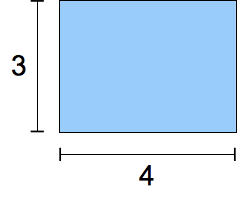
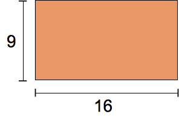
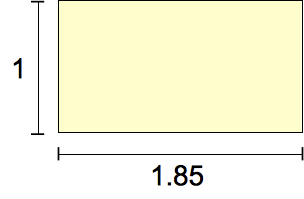
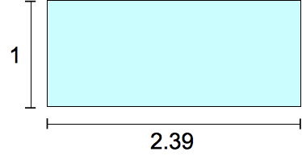

{{CSSRef}}

Le type de donnée CSS **`<ratio>`** permet de décrire les proportions [dans les _media queries_](/fr/docs/Web/CSS/Media_Queries) (N.D.T. pour « requête média » qui est moins usité). entre deux valeurs sans unité.

## Syntaxe

Une valeur de ce type se compose d'un entier strictement positif (type {{cssxref("&lt;integer&gt;")}}, suivi d'une barre oblique ('/', Unicode `U+002F SOLIDUS`) puis d'un second entier strictement positif (type {{cssxref("&lt;integer&gt;")}}). Il est possible d'avoir des espaces avant et après la barre oblique.

## Exemples

### Utiliser dans une _media query_

```css
@media screen and (min-aspect-ratio: 16/9) { … }
```

### Ratios fréquemment utilisés

|                      | Ratio                                                                                   | Utilisation                                                                                 |
| -------------------- | --------------------------------------------------------------------------------------- | ------------------------------------------------------------------------------------------- |
|     | `4/3`                                                                                   | Format traditionnel utilisé par les télévisions au XX<sup>e</sup> siècle.                   |
|    | `16/9`                                                                                  | Format « moderne » des télévisions.                                                         |
|  | `185/100` = `91/50` _(les numérateurs et dénominateurs décimaux ne sont pas autorisés)_ | Le format le plus utilisé pour la projection de films depuis les années 1960.               |
|  | `239/100` _(les numérateurs et dénominateurs décimaux ne sont pas autorisés)_           | Le format « large » utilisé pour projeter certains films (on parle de format anamorphique). |

## Exemple appliqué

### CSS

```css
@media screen and (min-aspect-ratio: 1/1) {
  .exemple {
    background-color: palegreen;
  }
}
```

### HTML

```html
<p class="exemple">
  Essayez de m'étirer en longueur ou de me réduire en largeur
</p>
```

### Résultat

{{EmbedLiveSample("Exemple_appliqué","300","300")}}

## Spécifications

| Spécification                                                                        | État                                     | Commentaires         |
| ------------------------------------------------------------------------------------ | ---------------------------------------- | -------------------- |
| {{SpecName('CSS3 Media Queries', '#values', '&lt;ratio&gt;')}} | {{Spec2('CSS3 Media Queries')}} | Définition initiale. |

## Compatibilité des navigateurs

{{Compat("css.types.ratio")}}

## Voir aussi

- [Les _media queries_ CSS](/fr/docs/Web/CSS/Media_Queries)
- [La caractéristique média aspect-ratio](/fr/docs/Web/CSS/@media/aspect-ratio)
