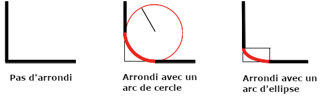

La propriété [CSS](/fr/docs/Web/CSS) **`border-bottom-left-radius`** arrondit le coin inférieur gauche d'un élément en définissant le rayon (ou les rayons des axes semi-majeur et semi-mineur) de l'ellipse qui détermine la courbure du coin.

{{InteractiveExample("Démonstration CSS&nbsp;: border-bottom-left-radius")}}

```css interactive-example-choice
border-bottom-left-radius: 80px 80px;
```

```css interactive-example-choice
border-bottom-left-radius: 250px 100px;
```

```css interactive-example-choice
border-bottom-left-radius: 50%;
```

```css interactive-example-choice
border-bottom-left-radius: 50%;
border: black 10px double;
background-clip: content-box;
```

```html interactive-example
<section class="default-example" id="default-example">
  <div class="transition-all" id="example-element">
    Ceci est une boîte avec un coin arrondi en bas à gauche.
  </div>
</section>
```

```css interactive-example
#example-element {
  width: 80%;
  height: 80%;
  display: flex;
  justify-content: center;
  flex-direction: column;
  background-color: #5b6dcd;
  color: white;
  padding: 10px;
}
```

## Syntaxe

```css
/* Le coin est un cercle */
/* border-bottom-left-radius: rayon */
border-bottom-left-radius: 3px;

/* Valeurs avec un pourcentage */

/* cercle si la boîte est un carré ou ellipse si la boîte est un rectangle */
border-bottom-left-radius: 20%;

/* identique à ci-dessus : 20% de l'horizontal (largeur) et du vertical (hauteur) */
border-bottom-left-radius: 20% 20%;

/* 20% de l'horizontal (largeur) et 10% du vertical (hauteur) */
border-bottom-left-radius: 20% 10%;

/* le coin est une ellipse */
/* border-bottom-left-radius: horizontal vertical */
border-bottom-left-radius: 0.5em 1em;

/* Valeurs globales */
border-bottom-left-radius: inherit;
border-bottom-left-radius: initial;
border-bottom-left-radius: revert;
border-bottom-left-radius: revert-layer;
border-bottom-left-radius: unset;
```

Avec une valeur&nbsp;:

- la valeur est une longueur ({{CSSxRef("&lt;length&gt;")}}) ou un pourcentage ({{CSSxRef("&lt;percentage&gt;")}}) qui indique le rayon du cercle à utiliser pour la bordure de ce coin.

Avec deux valeurs&nbsp;:

- la première valeur est une longueur ({{CSSxRef("&lt;length&gt;")}}) ou un pourcentage ({{CSSxRef("&lt;percentage&gt;")}}) qui indique le demi-axe horizontal de l'ellipse à utiliser pour la bordure de ce coin.
- la seconde valeur est une longueur ({{CSSxRef("&lt;length&gt;")}}) ou un pourcentage ({{CSSxRef("&lt;percentage&gt;")}}) qui indique le demi-axe vertical de l'ellipse à utiliser pour la bordure de ce coin.

### Valeurs

- `<length-percentage>`
  - : La mesure du rayon ou de l'un des demi-axes de l'ellipse. Une valeur absolue peut être exprimée dans n'importe quelle unité autorisée pour le type {{CSSxRef("&lt;length&gt;")}}. Les valeurs exprimées en pourcentage font référence à la hauteur de la boîte pour les valeurs verticales et à la largeur de la boîte pour les valeurs horizontales. Les valeurs négatives ne sont pas autorisées.

## Description

L'arrondi peut être un cercle ou une ellipse, ou si l'une des valeurs vaut `0`, aucun arrondi n'est appliqué et le coin est carré.



Un arrière-plan, qu'il s'agisse d'une image ou d'une couleur, est rogné à la bordure, même si elle est arrondie&nbsp;; l'endroit exact du rognage est défini par la valeur de la propriété {{CSSxRef("background-clip")}}.

> [!NOTE]
> Si la valeur de cette propriété n'est pas définie par la propriété raccourcie {{CSSxRef("border-radius")}} et que cette dernière est appliquée après la propriété CSS `border-bottom-left-radius`, la valeur de cette propriété est alors réinitialisée à sa valeur initiale par la [propriété raccourcie](/fr/docs/Web/CSS/Guides/Cascade/Shorthand_properties).

## Définition formelle

{{CSSInfo}}

## Syntaxe formelle

{{CSSSyntax}}

## Exemples

### Arc de cercle

Une seule valeur `<length>` produit un arc de cercle.

```html hidden
<div></div>
```

```css
div {
  border-bottom-left-radius: 40px;
  background-color: lightgreen;
  border: solid 1px black;
  width: 100px;
  height: 100px;
}
```

{{EmbedLiveSample("Arc de cercle")}}

### Arc d'une ellipse

Deux valeurs `<length>` différentes produisent un arc d'ellipse.

```html hidden
<div></div>
```

```css
div {
  border-bottom-left-radius: 40px 20px;
  background-color: lightgreen;
  border: solid 1px black;
  width: 100px;
  height: 100px;
}
```

{{EmbedLiveSample("### Arc d'une ellipse")}}

### Élément carré avec un rayon en pourcentage

Un élément carré avec une seule valeur `<percentage>` produit un arc de cercle.

```html hidden
<div></div>
```

```css
div {
  border-bottom-left-radius: 40%;
  background-color: lightgreen;
  border: solid 1px black;
  width: 100px;
  height: 100px;
}
```

{{EmbedLiveSample("Élément carré avec un rayon en pourcentage")}}

### Élément qui n'est pas un carré avec un rayon en pourcentage

Un élément qui n'est pas un carré avec une seule valeur `<percentage>` produit un arc d'ellipse.

```html hidden
<div></div>
```

```css
div {
  border-bottom-left-radius: 40%;
  background-color: lightgreen;
  border: solid 1px black;
  width: 200px;
  height: 100px;
}
```

{{EmbedLiveSample("Élément qui n'est pas un carré avec un rayon en pourcentage")}}

## Spécifications

{{Specifications}}

## Compatibilité des navigateurs

{{Compat}}

## Voir aussi

- La propriété raccourcie {{CSSxRef("border-radius")}}
- Les propriétés {{CSSxRef("border-top-right-radius")}}, {{CSSxRef("border-top-left-radius")}} et {{CSSxRef("border-bottom-right-radius")}}
