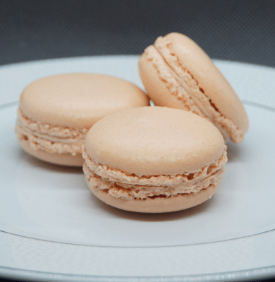

{{Deprecated_Header}}

> [!WARNING]
> Cette propriété est dépréciée, on utilisera {{CSSxRef("clip-path")}} à la place.

La propriété [CSS](/fr/docs/Web/CSS) **`clip`** définit la portion visible d'un élément. La propriété `clip` ne s'applique qu'aux éléments positionnés absolument — c'est-à-dire les éléments avec {{CSSxRef("position","position:absolute")}} ou {{CSSxRef("position","position:fixed")}}.

## Syntaxe

```css
/* Valeur avec un mot-clé */
clip: auto;

/* Valeur de type <shape> */
clip: rect(1px, 10em, 3rem, 2ch);

/* Valeurs globales */
clip: inherit;
clip: initial;
clip: revert;
clip: revert-layer;
clip: unset;
```

### Valeurs

- `rect()`
  - : Un rectangle défini à l'aide d'une fonction `rect()` de la forme `rect(<top>, <right>, <bottom>, <left>)`. Les valeurs `<top>` et `<bottom>` sont des décalages par rapport au \_bord supérieur de la boîte, tandis que `<right>` et `<left>` sont des décalages par rapport au \_bord gauche de la boîte - c'est-à-dire l'étendue de la marge de remplissage de boîte.

    Les valeurs `<top>`, `<right>`, `<bottom>` et `<left>` peuvent être soit une longueur ({{CSSxRef("&lt;length&gt;")}}) soit `auto`. Si la valeur d'un côté est `auto`, l'élément est rogné sur le _bord intérieur de la bordure_ de ce côté.

> [!NOTE]
> La fonction `rect()` {{CSSxRef("shape")}} utilisée dans la propriété dépréciée `clip` est différente de la fonction CSS {{CSSxRef("basic-shape/rect","rect()")}} utilisée pour définir une {{CSSxRef("basic-shape")}} CSS.

- `auto`
  - : L'élément n'est pas rogné (par défaut). Attention, le comportement est différent de celui obtenu avec `rect(auto, auto, auto, auto)`, qui rogne l'élément aux bords intérieurs de la bordure.

## Définition formelle

{{CSSInfo}}

## Syntaxe formelle

{{CSSSyntax}}

## Exemples

### Rogner une image

```html
<p class="dotted-border">
  
  
  
  
</p>
```

```css
.dotted-border {
  border: dotted;
  position: relative;
  width: 390px;
  height: 400px;
}

#top-left,
#middle,
#bottom-right {
  position: absolute;
  top: 0;
}

#top-left {
  left: 400px;
  clip: rect(0, 130px, 90px, 0);
}

#middle {
  left: 270px;
  clip: rect(100px, 260px, 190px, 130px);
}

#bottom-right {
  left: 140px;
  clip: rect(200px, 390px, 290px, 260px);
}
```

{{EmbedLiveSample("Rogner une image", "", 450)}}

## Spécifications

{{Specifications}}

## Compatibilité des navigateurs

{{Compat}}

## Voir aussi

- La propriété {{CSSxRef("clip-path")}}
- La propriété {{CSSxRef("position")}}
- La propriété {{CSSxRef("mask")}}
- La propriété {{CSSxRef("shape-image-threshold")}}
- La propriété {{CSSxRef("shape-outside")}}
