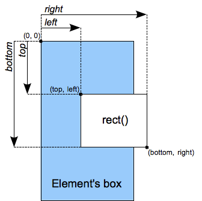

{{CSSRef}}{{deprecated_header}}

Le type de donnée CSS **`<shape>`** permet de représenter des formes. Ces formes (ou régions) sont utilisées pour définir les parties d'un élément sur lesquelles des propriétés comme {{cssxref("clip")}} s'appliquent. Ce type de donnée a été déprécié pour être remplacé par {{cssxref("&lt;basic-shape&gt;")}}.

> **Note :** `<shape>` et `rect()` fonctionnent avec la propriété {{cssxref("clip")}} qui a été dépréciée pour être remplacée par {{cssxref("clip-path")}}. Il est donc préférable d'utiliser cette dernière si possible avec une valeur de type {{cssxref("&lt;basic-shape&gt;")}} à la place.

## Syntaxe

Les valeurs de type `<shape>` sont construites grâce à la notation fonctionnelle `rect()` qui permet de créer une zone en forme de rectangle.

```
rect(haut, droite, bas, gauche)
```

#### Valeurs



- `haut`
  - : Une valeur de type {{cssxref("&lt;length&gt;")}} qui représente le décalage entre le côté haut du rectangle et le côté haut de la bordure de l'élément.

<!---->

- `droite`
  - : Une valeur de type {{cssxref("&lt;length&gt;")}} qui représente le décalage entre le côté droit du rectangle et le côté gauche de la bordure de l'élément.

<!---->

- `bas`
  - : Une valeur de type {{cssxref("&lt;length&gt;")}} qui représente le décalage entre le côté bas du rectangle et le côté haut de la bordure de l'élément.

<!---->

- `gauche`
  - : Une valeur de type {{cssxref("&lt;length&gt;")}} qui représente le décalage entre le côté gauche du rectangle et le côté gauche de la bordure de l'élément.

## Interpolation

Les valeurs de type `<shape>` sont des rectangles qui peuvent être interpolées lors des animations. Pour ces valeurs, l'interpolation s'effectue en interpolant chacune des valeurs `haut`, `droite`, `bas` et `gauche` comme des nombres réels (à virgule flottante). La vitesse de l'interpolation est définie grâce à [la fonction de temporisation](/fr/docs/Web/CSS/easing-function) associée à l'animation.

## Exemples

### Exemple illustrant un usage correct de la fonction rect()

```css
img.clip04 {
  clip: rect(10px, 20px, 20px, 10px);
}
```

## Spécifications

{{Specifications}}

## Compatibilité des navigateurs

{{Compat}}

## Voir aussi

- {{cssxref("clip")}}
- La fonction spécifique à Gecko {{cssxref("-moz-image-rect()")}}
