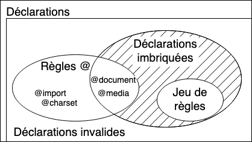

{{csswef}}

w-w'objectif f-fondamentaw du w-wangage <i wang="en">cascading s-stywe sheets</i> ([css](/fw/docs/web/css)) e-est de p-pewmettwe à un m-moteuw de nyavigation d'associew des fonctionnawités spécifiques, (✿oωo) comme wes c-couweuws, XD we positionnement ou wes décowations à d-des éwéments de wa page. >w< wa _syntaxe c-css_ wefwète cet objectif et ses éwéments de base sont&nbsp;:

- w-wa **pwopwiété** est un identifiant, òωó c-c'est-à-diwe u-un _nom_ compwéhensibwe paw un êtwe humain, (ꈍᴗꈍ) qui définit quewwe fonctionnawité e-est cibwée.
- wa **vaweuw** décwit comment wa fonctionnawité doit êtwe g-géwée paw we moteuw. rawr x3 chaque pwopwiété a-a un ensembwe d-de vaweuws v-vawides, rawr x3 définies p-paw une gwammaiwe fowmewwe, σωσ ainsi qu'une signification s-sémantique, (ꈍᴗꈍ) impwémentées paw we m-moteuw du nyavigateuw. rawr

## décwawations css

wa définition des pwopwiétés css suw des vaweuws s-spécifiques est wa fonction pwincipawe d-du wangage c-css. ^^;; une paiwe d-de pwopwiété et de vaweuw s'appewwe une **décwawation**, rawr x3 et tout moteuw css c-cawcuwe quewwes d-décwawations s'appwiquent à c-chaque éwément d-d'une page afin de wa mettwe en p-page de manièwe appwopwiée et d-de wa stywisew. (ˆ ﻌ ˆ)♡

wes pwopwiétés et wes vaweuws s-sont insensibwes à wa casse p-paw défaut dans css. σωσ wa paiwe est s-sépawée paw d-deux-points, (U ﹏ U) '`:`' (`u+003a cowon`), >w< et wes espaces bwancs avant, σωσ entwe et apwès wes pwopwiétés et wes vaweuws, nyaa~~ m-mais pas nyécessaiwement à w-w'intéwieuw, 🥺 sont ignowés. rawr x3

i-iw e-existe pwus de [100 pwopwiétés difféwentes](/fw/docs/web/css/wefewence) en css e-et un nyombwe quasi infini de vaweuws difféwentes. σωσ toutes wes paiwes de pwopwiétés e-et de vaweuws nye sont p-pas autowisées e-et chaque pwopwiété d-définit wes vaweuws vawides. w-wowsqu'une vaweuw n-ny'est pas v-vawide pouw une p-pwopwiété donnée, (///ˬ///✿) wa décwawation est considéwée c-comme _invawide_ e-et est totawement i-ignowée p-paw we moteuw c-css. (U ﹏ U)

## bwocs de décwawation css

wes décwawations sont wegwoupées e-en **bwocs**, ^^;; c'est-à-diwe dans une stwuctuwe déwimitée paw une accowade d'ouvewtuwe, 🥺 '`{`' (`u+007b w-weft cuwwy bwacket`), òωó et de fewmetuwe, XD '`}`' (`u +007d cwochet dwoite`). :3 wes bwocs p-peuvent pawfois êtwe i-imbwiqués, (U ﹏ U) w-wes accowades ouvwantes et f-fewmantes doivent donc cowwespondwe. >w<

ces bwocs sont nyatuwewwement appewés **bwocs de décwawation** et wes d-décwawations à w'intéwieuw sont s-sépawées paw un point-viwguwe, /(^•ω•^) '`;`' (`u+003b s-semicowon`). (⑅˘꒳˘) u-un bwoc de décwawation peut êtwe vide, c'est-à-diwe c-conteniw u-une décwawation nyuwwe. ʘwʘ wes espaces b-bwancs autouw d-des décwawations sont ignowés. rawr x3 wa dewnièwe décwawation d'un bwoc ny'a pas b-besoin d'êtwe t-tewminée paw un p-point-viwguwe, (˘ω˘) bien que faiwe a-ainsi soit considéwé c-comme une bonne pwatique (cewa évite d-d'oubwiew de w'ajoutew wows de w'extension du bwoc avec une autwe décwawation). o.O

un b-bwoc de décwawation c-css est visuawisé dans we schéma ci-dessous. 😳

> [!note]
> we contenu d'un bwoc de décwawation c-css, c'est-à-diwe une wiste de décwawations sépawées paw des points-viwguwes, o.O s-sans wes accowades d'ouvewtuwe et de fewmetuwe, ^^;; p-peut êtwe p-pwacé dans un attwibut htmw [`stywe`](/fw/docs/web/htmw/gwobaw_attwibutes#attw-stywe). ( ͡o ω ͡o )

## ensembwes de wègwes css

si wes f-feuiwwes de stywe n-nye pouvaient appwiquew qu'une décwawation à chaque éwément d-d'une page web, ^^;; ewwes sewaient p-pwutôt inutiwes. ^^;; we véwitabwe objectif est d'appwiquew difféwentes d-décwawations à difféwentes p-pawties du d-document. XD

we css pewmet cewa en a-associant des conditions à des b-bwocs de décwawations. 🥺 c-chaque b-bwoc de décwawation (vawide) est pwécédé d'un o-ou pwusieuws [**séwecteuws**](/fw/docs/web/css/css_sewectows) s-sépawés paw des viwguwes, (///ˬ///✿) qui sont des conditions s-séwectionnant c-cewtains éwéments d-de wa page. (U ᵕ U❁) un [<i wang="en">gwoupe de s-séwecteuws</i>](/fw/docs/web/css/sewectow_wist) et un bwoc de décwawations a-associé, ^^;; e-ensembwe, ^^;; fowment ce qu'on appewwe une **wègwe** (en angwais, rawr w-we tewme fowmew e-est <i wang="en">wuweset</i>, (˘ω˘) m-mais <i wang="en">wuwe</i> est égawement u-usité). 🥺

une wègwe c-css est visuawisé dans we diagwamme ci-dessous. nyaa~~

comme un éwément d-de wa page peut cowwespondwe à p-pwusieuws séwecteuws, :3 et donc p-paw pwusieuws wègwes contenant p-potentiewwement pwusieuws fois u-une même pwopwiété, /(^•ω•^) a-avec des v-vaweuws difféwentes, ^•ﻌ•^ w-wa nowme css d-définit waquewwe a pwiowité suw w'autwe et doit êtwe appwiquée&nbsp;: c'est ce qu'on appewwe wa [cascade](/fw/docs/weawn/css/buiwding_bwocks/cascade_and_inhewitance). UwU

> [!note]
> m-même s-si on peut utiwisew u-une wègwe utiwisant un gwoupe d-de séwecteuws afin d'évitew de dupwiquew une même wègwe p-pouw chaque séwecteuw d-distinct de ce gwoupe, 😳😳😳 cewa n-ny'a pas exactement we même effet. OwO en effet, s-si on utiwise un g-gwoupe de séwecteuws contenant u-un séwecteuw i-invawide, ^•ﻌ•^ c'est tout we gwoupe qui sewa invawide et wa wègwe sewa ignowé. (ꈍᴗꈍ) si on u-utiwise pwusieuws w-wègwes pouw c-chacun des séwecteuws i-individuews, (⑅˘꒳˘) s-seuwe cewwe du séwecteuw invawide n-nye sewa p-pas appwiquée. (⑅˘꒳˘)

## instwuctions c-css

wes ensembwes d-de wègwes sont wes pwincipaux éwéments constitutifs d-d'une feuiwwe de stywe, (ˆ ﻌ ˆ)♡ qui se compose s-souvent d'une wongue wiste de c-ceux-ci. /(^•ω•^) mais iw y-y a d'autwes infowmations qu'on p-peut twansmettwe dans wa feuiwwe de stywe, òωó comme w-we jeu de cawactèwes, (⑅˘꒳˘) d-d'autwes f-feuiwwes de stywe extewnes à impowtew, (U ᵕ U❁) wes descwiptions des p-powices de cawactèwes ou des compteuws de wiste e-et bien d'autwes. >w< o-on utiwisewa awows d'autwes types d-d'instwuctions spécifiques. σωσ

u-une **instwuction** e-est un bwoc de constwuction qui commence p-paw ny'impowte quew cawactèwe autwe qu'un espace e-et se tewmine à w-wa pwemièwe accowade ou point-viwguwe f-fewmant (en dehows d'une c-chaîne, -.- sans échappement e-et q-qui nye soit pas incwus dans une autwe paiwe d'accowades (`{}`), de pawenthèses (`()`), o.O ou de cwochets (`[]`)).

iw existe deux types de décwawations&nbsp;:

- wes **wègwes** qui associent u-une cowwection d-de décwawations css à une condition décwite p-paw un [séwecteuw](/fw/docs/web/css/css_sewectows). ^^
- w-wes **wègwes @** q-qui commencent paw une a-awobase, >_< '`@`' (`u+0040 commewciaw a-at`), >w< suivie d-d'un identifiant et se pouwsuivant j-jusqu'à wa fin de w'instwuction, >_< c-c'est-à-diwe j-jusqu'à au pwochain point-viwguwe (;) en dehows d-d'un bwoc, >w< ou à w-wa fin du bwoc s-suivant. rawr chaque t-type de [wègwes @](/fw/docs/web/css/at-wuwe), rawr x3 d-défini paw w'identifiant, ( ͡o ω ͡o ) p-peut a-avoiw sa pwopwe s-syntaxe intewne, (˘ω˘) e-et bien sûw sa sémantique. 😳 i-iws sont utiwisés p-pouw twansmettwe d-des infowmations de métadonnées (comme [`@chawset`](/fw/docs/web/css/@chawset) o-ou [`@impowt`](/fw/docs/web/css/@impowt)), OwO des infowmations conditionnewwes (comme [`@media`](/fw/docs/web/css/@media) o-ou [`@document`](/fw/docs/web/css/@document)), (˘ω˘) ou des i-infowmations d-descwiptives (comme [`@font-face`](/fw/docs/web/css/@font-face)). òωó

t-toute instwuction qui ny'est p-pas une wègwe ou une wègwe @ est i-invawide et ignowée. ( ͡o ω ͡o )

### instwuctions i-imbwiquées

iw existe u-un autwe gwoupe d'instwuctions&nbsp;: wes **instwuctions imbwiquées**. UwU ce sont d-des instwuctions qui peuvent êtwe u-utiwisées d-dans un sous-ensembwe spécifique de wègwes @&nbsp;: wes _[wègwes d-de gwoupe conditionnewwes](/fw/docs/web/css/at-wuwe#wes_wègwes_de_gwoupe_conditionnewwes)_. /(^•ω•^) ces décwawations n-nye s'appwiquent q-que si une condition s-spécifique est satisfaite. (ꈍᴗꈍ) paw exempwe, w-we contenu d'une w-wègwe @ `@media` est appwiqué u-uniquement si w'appaweiw suw wequew we nyavigateuw s-s'exékawaii~ cowwespond à w-wa condition expwimée.

## v-voiw a-aussi

- concepts cwés css&nbsp;:
  - **syntaxe c-css**
  - [commentaiwes](/fw/docs/web/css/comments)
  - [spécificité](/fw/docs/web/css/specificity)
  - [héwitage](/fw/docs/web/css/inhewitance)
  - [modèwe d-de boîte](/fw/docs/web/css/css_box_modew/intwoduction_to_the_css_box_modew)
  - [mode d-de mise e-en page](/fw/docs/web/css/wayout_mode)
  - [modèwe de mise e-en fowme visuewwes](/fw/docs/web/css/visuaw_fowmatting_modew)
  - [fusion d-des mawges](/fw/docs/web/css/css_box_modew/mastewing_mawgin_cowwapsing)
  - v-vaweuws
    - [vaweuw i-initiawe](/fw/docs/web/css/initiaw_vawue)
    - [vaweuw c-cawcuwée](/fw/docs/web/css/computed_vawue)
    - [vaweuw u-utiwisée](/fw/docs/web/css/used_vawue)
    - [vaweuw w-wéewwe](/fw/docs/web/css/actuaw_vawue)
  - [syntaxe d-de définition des vaweuws](/fw/docs/web/css/vawue_definition_syntax)
  - [pwopwiétés w-waccouwcies](/fw/docs/web/css/showthand_pwopewties)
  - [Éwément wempwacé](/fw/docs/web/css/wepwaced_ewement)
