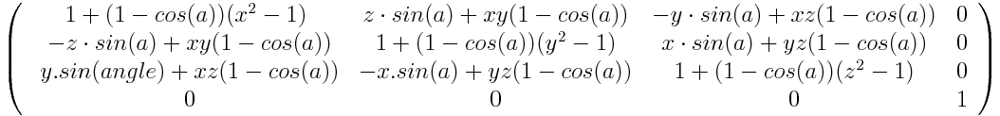

{{CSSRef}}

La fonction **`rotate3d()`** définit une transformation qui déplace un élément autour d'un axe sans le déformer. L'angle de la rotation est un argument de la fonction. Si l'angle indiqué est positif, le mouvement sera appliqué dans le sens horaire et sinon il sera appliqué dans le sens inverse des aiguilles d'une montre. La valeur obtenue par cette fonction est de type [`<transform-function>`](/fr/docs/Web/CSS/transform-function).

{{EmbedInteractiveExample("pages/css/rotate3d.html")}}

Dans l'espace (en trois dimensions), les rotations ont trois degrés de liberté qui définissent l'axe de rotation. Cet axe est défini par un vecteur `[x, y, z]` et passe par l'origine du repère (définie grâce à la propriété [`transform-origin`](/fr/docs/Web/CSS/transform-origin)). Si le vecteur n'est pas normalisé (autrement dit, si la somme des carrés de ses trois composantes ne vaut pas 1), il sera normalisé par le moteur. Un vecteur qui ne peut être normalisé (par exemple le vecteur nul `[0, 0, 0]`) empêchera la rotation d'être appliquée mais la propriété CSS restera valide.

> **Note :** Contrairement aux rotations appliquées dans le plan, la composition de rotations dans l'espace n'est pas commutative. Autrement dit, l'ordre dans lequel on applique les rotations est déterminant.

## Syntaxe

    rotate3d(x, y, z, a)

### Valeurs

- `x`
  - : Une valeur de type [`<number>`](/fr/docs/Web/CSS/number) qui définit la composante en X (l'abscisse) du vecteur qui sera l'axe de la rotation.
- `y`
  - : Une valeur de type [`<number>`](/fr/docs/Web/CSS/number) qui définit la composante en Y (l'ordonnée) du vecteur qui sera l'axe de la rotation.
- `z`
  - : Une valeur de type [`<number>`](/fr/docs/Web/CSS/number) qui définit la composante en Z (la côte) du vecteur qui sera l'axe de la rotation.
- `a`
  - : Une valeur de type [`<angle>`](/fr/docs/Web/CSS/angle) qui représente l'angle de la rotation. Un angle positif indique une rotation appliquée dans le sens horaire, un angle négatif applique une rotation dans le sens anti-horaire.

<table class="standard-table">
  <thead>
    <tr>
      <th scope="col">Coordonnées cartésiennes sur ℝ<sup>2</sup></th>
      <th scope="col">Coordonnées homogènes sur ℝℙ<sup>2</sup></th>
      <th scope="col">Coordonnées cartésiennes sur ℝ<sup>3</sup></th>
      <th scope="col">Coordonnées homogènes sur ℝℙ<sup>3</sup></th>
    </tr>
  </thead>
  <tbody>
    <tr>
      <td colspan="2">
        Cette transformation s'applique dans l'espace (3D) et ne peut pas être
        représentée en deux dimensions.
      </td>
      <td colspan="1">
        <math
          ><mfenced
            ><mtable
              ><mtr
                ><mtd
                  >1<mo>+</mo>(1<mo>-</mo>cos(<mi>a</mi>))(<msup
                    ><mi>x</mi><mn>2</mn></msup
                  ><mo>-</mo>1)</mtd
                ><mtd
                  ><mi>z</mi><mo>·</mo>sin(<mi>a</mi>)+<mi>x</mi
                  ><mi>y</mi>(1<mo>-</mo>cos(<mi>a</mi>))</mtd
                ><mtd
                  ><mo>-</mo><mi>y</mi><mo>·</mo>sin(<mi>a</mi>)<mo>+</mo
                  ><mi>x</mi><mi>z</mi
                  ><mo>·</mo>(1<mo>-</mo>cos(<mi>a</mi>))</mtd
                ></mtr
              ><mtr
                ><mtd
                  ><mo>-</mo><mi>z</mi><mo>·</mo>sin(<mi>a</mi>)<mo>+</mo
                  ><mi>x</mi><mi>y</mi
                  ><mo>·</mo>(1<mo>-</mo>cos(<mi>a</mi>))</mtd
                ><mtd>1+(1-cos(a))(y2-1)</mtd
                ><mtd
                  ><mi>x</mi><mo>·</mo>sin(<mi>a</mi>)<mo>+</mo><mi>y</mi
                  ><mi>z</mi><mo>·</mo>(1<mo>-</mo>cos(<mi>a</mi>))</mtd
                ><mtr
                  ><mtd>ysin(a) + xz(1-cos(a))</mtd
                  ><mtd>-xsin(a)+yz(1-cos(a))</mtd><mtd>1+(1-cos(a))(z2-1)</mtd
                  ><mtd>t</mtd></mtr
                ><mtr
                  ><mtd>0</mtd><mtd>0</mtd><mtd>0</mtd><mtd>1</mtd></mtr
                ></mtr
              ></mtable
            ></mfenced
          ></math
        >
      </td>
      <td>
        <a
          href="/fr/docs/Web/CSS/transform-function/rotate3d()/transform-functions-rotate3d_hom4.png"
          ></a>
      </td>
    </tr>
  </tbody>
</table>

## Exemples

### Définir une rotation en Y

#### HTML

```html
<p>toto</p>
<p class="transformation">truc</p>
```

#### CSS

```css
body {
  perspective: 800px;
}

p {
  width: 50px;
  height: 50px;
  background-color: teal;
  margin: auto;
}

.transformation{
  transform: rotate3d(0,1,0,60deg);
  background-color: blue;
}
```

#### Résultat

{{EmbedLiveSample("Définir_une_rotation_en_Y","100%","200")}}

### Définir une rotation sur un axe quelconque

#### HTML

```html
<p>toto</p>
<p class="transformation">truc</p>
```

#### CSS

```css
p {
  width: 50px;
  height: 50px;
  background-color: teal;
}

.transformation {
  transform: rotate3d(1, 2, -1, 192deg);
  background-color: blue;
}
```

#### Résultat

{{EmbedLiveSample("Définir_une_rotation_sur_un_axe_quelconque","100%","200")}}

## Spécifications

{{Specifications}}

## Compatibilité des navigateurs

{{Compat}}

## Voir aussi

- [`transform`](/fr/docs/Web/CSS/transform)
- [`<transform-function>`](/fr/docs/Web/CSS/transform-function)
