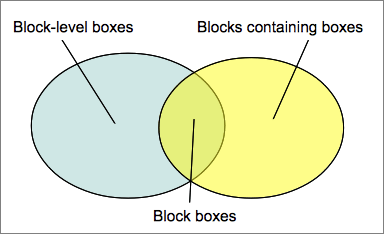
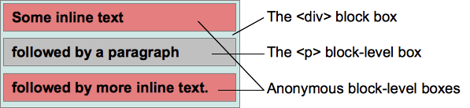
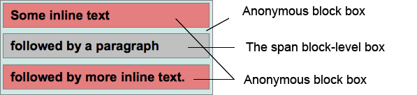

{{CSSRef}}

En CSS, le modèle de mise en forme visuelle est un algorithme qui traite un document afin de l'afficher sur un support visuel. Chaque élément du document est ainsi transformé en zéro, une ou plusieurs boîtes qui s'inscrivent dans [le modèle de boîtes CSS](/en-US/docs/Learn/CSS/Building_blocks/The_box_model). La disposition de chaque boîte est dictée par :

- Les dimensions de la boîte qui peuvent être définies explicitement, contraintes ou non
- Le type de la boîte : en ligne, en ligne et de niveau (_inline-level_), atomique, en bloc
- Le mode de positionnement : dans le flux normal, en flottement ou positionnée de façon absolue
- Les autres éléments présents dans l'arbre du document et notamment ses enfants et ses voisins
- La taille et la position de la zone d'affichage (_viewport_)
- Les dimensions intrinsèques des images qu'elle contient
- Éventuellement d'autres informations externes.

Le modèle affiche une boîte par rapport au bord du bloc qui la contient. Généralement, une boîte devient le bloc contenant pour ses éléments descendants. Toutefois, une boîte n'est pas contrainte dans son bloc contenant, le contenu d'une boîte peut parfois dépasser (ce qu'on appelle en anglais _overflow_).

## Génération de la boîte

Lors de cette étape, on crée les boîtes à partir des éléments du document. Les boîtes générées sont de différents types et ces types ont un impact sur la mise en forme visuelle. Le type de boîte générée dépend de la valeur de la propriété {{cssxref("display")}}.

### Les éléments de bloc et les boîtes de bloc

Un élément est dit « de bloc » lorsque [la valeur calculée](/fr/docs/Web/CSS/computed_value) de la propriété {{cssxref("display")}} qui lui est appliquée vaut : `block`, `list-item` ou `table`. Un élément de bloc est représenté sous la forme d'un bloc (comme un paragraphe par exemple) et les blocs sont empilés verticalement les uns sur les autres.

Chaque boîte de bloc contribue au [contexte de mise en forme des blocs](/fr/docs/Web/Guide/CSS/Block_formatting_context). Chaque élément de bloc génère au moins une boîte de niveau bloc, qu'on appelle la boîte de bloc principale. Certains éléments (comme les éléments d'une liste par exemple) génèrent d'autres boîtes afin de gérer les puces ou d'autres éléments typographiques.

La boîte de bloc principale contient les boîtes générées par les descendants ete le contenu généré. Cette boîte participe au schéma de positionnement.



Une boîte de bloc peut également un conteneur de blocs. Un conteneur de blocs est une boîte qui ne contient que d'autres boîtes de bloc ou qui crée un contexte de formatage en ligne et qui ne contient alors que des boîtes en ligne. Attention, les notions de boîtes de bloc et de conteneurs de blocs ne sont pas identiques. La première décrit la façon dont la boîte se comporte avec ses parents et ses voisins et le seconde définit la façon dont elle interagit avec ses descendants. Certaines boîtes de blocs, telles que les tableaux, ne sont pas des conteneurs de blocs. Réciproquement, certains conteneurs de blocs (tels que les cellules de tableau non remplacées) ne sont pas des boîtes de bloc.

Les boîtes de bloc qui sont également des conteneurs de blocs sont appelées des boîtes-bloc.

#### Les boîtes de bloc anonymes

Dans certains cas, l'algorithme doit ajouter certaines boîtes supplémentaires. Or, les sélecteurs CSS ne permettent pas de mettre en forme ou de nommer ces boîtes, elles sont donc appelées boîtes de bloc _anonymes_.

Les sélecteurs ne permettent pas de manipuler la mise en forme de ces boîtes. Aussi, pour ces boîtes, toutes les propriétés CSS utilisant l'héritage auront la valeur {{cssxref("inherit")}} et toutes les propriétés CSS qui ne sont pas héritées auront la valeur `initial`.

Les boîtes qui contiennent des blocs ne contiennent que des boîtes en ligne ou que des boîtes en blocs. Mais souvent, le document contient un mélange des deux. Dans ces cas, des boîtes de bloc anonymes sont créées autour des boîtes en lignes adjacentes.

Si on prend le code HTML suivant, mis en forme avec les règles par défaut (`display:block`) :

```html
<div>
   Some inline text
   <p>followed by a paragraph</p>
   followed by more inline text.
</div>
```

On aura deux boîtes de bloc anonymes qui seront créées : une pour le texte avant le paragraphe et une pour le texte après. On aura alors la structure suivante :
  

À la différence de la boîte des éléments {{HTMLElement("p")}}, les développeurs ne peuvent pas contrôler la mise en forme des boîtes anonymes. Les propriétés qui héritent des éléments parents récupèreront la valeur obtenue pour l'élément {{HTMLElement("div")}} et les autres propriétés auront la valeur `initial`.

Un autre scénario peut amener à la création de boîtes de bloc anonyme : lorsqu'une boîte en ligne contient une ou plusieurs boîtes de bloc. Dans ce cas, la boîte qui contient la boîte de bloc est divisée en deux boîtes en ligne : une avant et une après la boîte de bloc. Toutes les boîtes en ligne avant la boîte de bloc sont englobées dans une boîte de bloc anonyme et il en va de même pour les boîtes en ligne qui suivent la boîte de bloc. Aussi, la boîte de bloc devient un voisin de deux boîtes de bloc anonymes qui contiennent les éléments en ligne.

S'il y a plusieurs boîtes de bloc sans contenu en ligne entre elles, les boîtes de bloc anonymes sont créées avant et après ces boîtes.

Si on prend le code HTML suivant, pour lequel {{HTMLElement("p")}} aura `display:inline` et {{HTMLElement("span")}} aura `display:block` :

```html
<p>
  Some <em>inline</em> text
  <span>followed by a paragraph</span>
  followed by more inline text.
</p>
```

Deux boîtes de bloc anonymes sont créées : une pour le texte avant l'élément `<span>` et une pour le texte qui suit cet élément. On a alors la structure suivante :



### Les éléments en ligne et les boîtes en ligne

Un élément est dit « en ligne » lorsque la valeur de sa propriété CSS {{cssxref("display")}} vaut : `inline`, `inline-block` ou `inline-table`. Visuellement, un tel élément est organisé sur des lignes qui se suivent les unes les autres avec d'autre contenu en ligne. Généralement, il s'agit du contenu d'un paragraphe (éventuellement mis en forme).

Les éléments en ligne génèrent des boîtes en lignes qui contribuent [au contexte de mise en forme en ligne](/fr/docs/CSS/Inline_formatting_context).

Les boîtes en lignes atomiques ne peuvent pas être divisées en plusieurs lignes au sein d'un contexte de mise en forme.

```html
<style>
  span {
    /* La valeur par défaut */
    display:inline;
  }
</style>
<div style="width:20em;">
   Le texte dans le span <span>peut être divisé
   en plusieurs lignes</span> dans une boîte en
   ligne.
</div>
```

```html
<style>
  span {
    display:inline-block;
  }
</style>
<div style="width:20em;">
   Le texte dans le span <span>ne peut pas être
   divisé en plusieurs lignes car</span> il est
   dans une boîte de type inline-block.
</div>
```

#### Les boîtes en ligne anonymes

Comme pour les boîtes de bloc, il existe quelques cas pour lesquels des boîtes en lignes sont automatiquement créées par le moteur CSS. Ces boîtes en ligne sont également anonymes et ne peuvent être ciblées par les sélecteurs. Pour les propriétés qui fonctionnent avec l'héritage, ces boîtes hériteront de la valeur de la propriété `relative` à l'élément parent, pour les autres, elles vaudront `initial`.

La plupart du temps, une boîte en ligne anonyme est créée lorsque du texte se trouve être un enfant direct d'une boîte en bloc, ce qui crée un contexte de mise en forme en ligne. Dans ce cas, le texte est inclus dans la plus grande boîte en ligne qui puisse être et c'est cette boîte qui est la boîte anonyme. Par ailleurs, le contenu blanc qui serait retiré par la propriété {{cssxref("white-space")}} ne génère pas de boîtes en ligne car celles-ci seraient vides.

### Les autres types de boîte

#### Les boîtes de ligne

_Les boîtes de ligne_ sont générées dans un contexte de mise en forme en ligne afin de représenter une ligne de texte. Au sein d'une boîte en bloc, un boîte de ligne s'étend d'un bord à l'autre de la boîte. Lorsqu'il y a une disposition flottante, la boîte de ligne démarre au bord le plus à droite de la partie flottante qui est située à gauche et finit à la droite du bord gauche suivant.

Ces boîtes sont uniquement utilisées par le moteur et les développeurs web ne devraient pas avoir à s'en préoccuper.

#### Les types de boîtes liés au modèle CSS

En plus des boîtes en ligne et des boîtes de bloc, CSS définit plusieurs autres modèles de contenu qui peuvent être appliqués aux éléments. Ces modèles définissent des types de boîtes supplémentaires :

- Le modèle de contenu pour les tableaux utilise des boîtes englobant les tableaux, des boîtes de tableau et des boîtes de légende
- Le modèle de contenu à plusieurs colonnes permet de créer des boîtes de colonne entre la boîte englobante et le contenu*.*
- Les modèles de contenu expérimentaux en grille (_CSS Grid_) ou avec les boîtes flexibles (_flexbox_) définissent d'autres types de boîtes.

## Modes de positionnement

Une fois les boîtes générées, le moteur CSS doit les disposer les unes par rapport aux autres. Pour ce faire, il utilise un des algorithmes suivants :

- Le mode de positionnement normal positionne les boîtes les unes après les autres
- Le mode de positionnement flottant permet d'extraire une boîte du flux normal et de la placer sur le côté de la boîte englobante
- Le mode de positionnement absolu permet de placer une boîte dans un système de coordonnées absolues, basée sur l'élément englobant. Un élément positionné de façon absolue peut recouvrir d'autres éléments.

### Le mode normal

Dans le mode de positionnement normal, les boîtes sont disposées les unes après les autres. Pour un contexte de mise en forme de bloc, elles seront empilées verticalement et pour un contexte de mise en forme en ligne, elles se suivront horizontalement. Le mode de disposition normal est déclenché lorsque la propriété CSS {{cssxref("position")}} vaut `static` ou `relative` et si la propriété CSS {{cssxref("float")}} vaut `none`.

On a deux cas de figure pour le mode normal : le positionnement statique et le positionnement relatif.

- En positionnement statique (obtenu avec la valeur `static` pour la propriété {{cssxref("position")}}), les boîtes sont dessinées à l'emplacement exact dicté par le flux normal.
- En positionnement relatif (obtenu lorsque la propriété {{cssxref("position")}} vaut `relative`), les boîtes sont dessinées avec un décalage défini par les propriétés {{cssxref("top")}}, {{cssxref("bottom")}}, {{cssxref("left")}} et {{cssxref("right")}}.

### Le mode flottant

Avec le mode de positionnement flottant, certaines boîtes sont placées au début ou à la fin de ligne courante. Le texte (et tout ce qui se trouve dans le flux normal) épouse donc le contour des boîtes flottantes (sauf si la propriété {{cssxref("clear")}} dicte un autre comportement).

Pour qu'une boîte soit une boîte flottante, on utilisera la propriété {{cssxref("float")}} avec une valeur différente de `none` et la propriété {{cssxref("position")}} avec `static` ou `relative`. Si {{cssxref("float")}} vaut `left`, la boîte flottante sera positionnée au début de la ligne de la boîte englobante et si elle vaut `right`, elle sera à la fin de la ligne.

### Le mode absolu

En mode absolu, les boîtes sont entièrement retirées du flux normal et n'interagissent plus avec le flux. Elles sont positionnées de façon relative à leur bloc englobant grâce aux propriétés {{cssxref("top")}}, {{cssxref("bottom")}}, {{cssxref("left")}} et {{cssxref("right")}}.

Un élément est positionné de façon absolue lorsque la propriété {{cssxref("position")}} vaut `absolute` ou `fixed`.

Pour un élément positionné de façon fixe, le bloc englobant sera la zone d'affichage (_viewport_) et la position de l'élément est absolue par rapport à la zone d'affichage. Faire défiler le contenu ne modifie pas la position de l'élément.

## Voir aussi

- [La référence CSS](/fr/docs/Web/CSS/Reference)
- {{css_key_concepts}}
