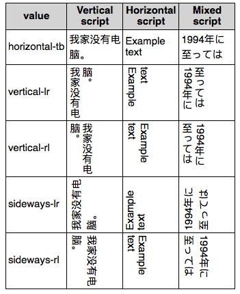

{{CSSRef}}

La propriété CSS **`writing-mode`** définit si les lignes d'un texte sont écrites horizontalement ou verticalement et la direction selon laquelle le bloc grandit. Lorsque cette propriété est définie pour un document entier, elle devrait être appliquée à la racine (soit l'élément {{HTMLElement("html")}} pour les documents HTML).

{{EmbedInteractiveExample("pages/css/writing-mode.html")}}

La propriété définit la direction du flux du bloc. C'est dans cette direction que les conteneurs de bloc seront empilés et c'est dans cette direction que le contenu en flux « coule » dans un bloc contenur. Ainsi, la propriété `writing-mode` détermine également l'ordre du contenu de niveau bloc.

## Syntaxe

```css
/* Avec un mot-clé */
writing-mode: horizontal-tb;
writing-mode: vertical-rl;
writing-mode: vertical-lr;

/* Valeurs globales */
writing-mode: inherit;
writing-mode: initial;
writing-mode: unset;
```

### Valeurs

- `horizontal-tb`
  - : Le contenu coule horizontalement de gauche à droite puis de haut en bas. La ligne horizontale suivante est positionnée sous la ligne précédente.
- `vertical-rl`
  - : Le contenu coule verticalement de haut en bas puis horizontalement de droite à gauche. La ligne verticale suivante est positionnée à gauche de la ligne précédente.
- `vertical-lr`
  - : Le contenu coule verticalement de haut en bas puis horizontalement de gauche à droite. La ligne verticale suivante est positionnée à droite de la ligne précédente.
- `sideways-rl`{{experimental_inline}}
  - : Le contenu coule verticalement du haut vers le bas et tous les glyphes, y compris pour les systèmes d'écriture verticaux sont tournés sur le côté, vers la droite.

<!---->

- `sideways-lr`{{experimental_inline}}
  - : Le contenu coule verticalement du haut vers le bas et tous les glyphes, y compris pour les systèmes d'écriture verticaux sont tournés sur le côté, vers la gauche.
- `lr` {{deprecated_inline}}
  - : Valeur dépréciée, sauf pour les documents SVG1. Pour CSS, il faut utiliser `horizontal-tb`.
- `lr-tb` {{deprecated_inline}}
  - : Valeur dépréciée, sauf pour les documents SVG1. Pour CSS, il faut utiliser `horizontal-tb`.
- `rl` {{deprecated_inline}}
  - : Valeur dépréciée, sauf pour les documents SVG1. Pour CSS, il faut utiliser `horizontal-tb`.
- `tb` {{deprecated_inline}}
  - : Valeur dépréciée, sauf pour les documents SVG1. Pour CSS, il faut utiliser `vertical-rl`.
- `tb-rl` {{deprecated_inline}}
  - : Valeur dépréciée, sauf pour les documents SVG1. Pour CSS, il faut utiliser `vertical-rl`.

### Syntaxe formelle

{{csssyntax}}

## Exemple

### HTML

Ce fragment de code HTML contient un tableau ({{HTMLElement("table")}}) dont chaque ligne indique le mode d'écriture et des exemples de scripts utilisés.

```html
<table>
    <tr>
        <th>Valeur</th>
        <th>Système d'écriture vertical</th>
        <th>Système d'écriture horizontal</th>
        <th>Système d'écriture hybride</th>
    </tr>
    <tr>
        <td>horizontal-tb</td>
        <td class="example Text1">我家没有电脑。</td>
        <td class="example Text1">Example text</td>
        <td class="example Text1">1994年に至っては</td>
    </tr>
    <tr>
        <td>vertical-lr</td>
        <td class="example Text2">我家没有电脑。</td>
        <td class="example Text2">Example text</td>
        <td class="example Text2">1994年に至っては</td>
    </tr>
    <tr>
        <td>vertical-rl</td>
        <td class="example Text3">我家没有电脑。</td>
        <td class="example Text3">Example text</td>
        <td class="example Text3">1994年に至っては</td>
    </tr>
    <tr>
        <td>sideways-lr</td>
        <td class="example Text4">我家没有电脑。</td>
        <td class="example Text4">Example text</td>
        <td class="example Text4">1994年に至っては</td>
    </tr>
    <tr>
        <td>sideways-rl</td>
        <td class="example Text5">我家没有电脑。</td>
        <td class="example Text5">Example text</td>
        <td class="example Text5">1994年に至っては</td>
    </tr>
```

### CSS

Cette première partie permet uniquement de rendre les choses plus agréables à lire :

```css
table {
  border-collapse:collapse;
}

td, th {
  border: 1px black solid; padding: 3px;
}
th {
  background-color: lightgray;
}
```

Ensuite, on ajoute la direction du contenu pour chaque cellule du tableau :

```css
.example.Text1 span, .example.Text1 {
  writing-mode: horizontal-tb;
  -webkit-writing-mode: horizontal-tb;
  -ms-writing-mode: horizontal-tb;
}

.example.Text2 span, .example.Text2 {
  writing-mode: vertical-lr;
  -webkit-writing-mode: vertical-lr;
  -ms-writing-mode: vertical-lr;
}

.example.Text3 span, .example.Text3 {
  writing-mode: vertical-rl;
  -webkit-writing-mode: vertical-rl;
  -ms-writing-mode: vertical-rl;
}

.example.Text4 span, .example.Text4 {
  writing-mode: sideways-lr;
  -webkit-writing-mode: sideways-lr;
  -ms-writing-mode: sideways-lr;
}

.example.Text5 span, .example.Text5 {
  writing-mode: sideways-rl;
  -webkit-writing-mode: sideways-rl;
  -ms-writing-mode: sideways-rl;
}
```

{{EmbedLiveSample("Exemple", 400, 500)}}

### Résultat statique

Voici un aperçu du résultat avec un navigateur qui prend en charge `writing-mode` :



## Spécifications

| Spécification                                                                            | État                                     | Commentaires                                      |
| ---------------------------------------------------------------------------------------- | ---------------------------------------- | ------------------------------------------------- |
| {{SpecName("CSS3 Writing Modes", "#block-flow", "writing-mode")}} | {{Spec2("CSS3 Writing Modes")}} | Définition initiale                               |
| {{SpecName("CSS4 Writing Modes", "#block-flow", "writing-mode")}} | {{Spec2("CSS4 Writing Modes")}} | Ajout des valeurs `sideways-lr` et `sideways-rl`. |

{{cssinfo}}

## Compatibilité des navigateurs

{{Compat("css.properties.writing-mode")}}

## Voir aussi

- L'attribut SVG [`writing-mode`](/fr/docs/Web/SVG/Attribute/writing-mode)
- {{cssxref("direction")}}
- {{cssxref("unicode-bidi")}}
- {{cssxref("text-orientation")}}
- {{cssxref("text-combine-upright")}}
- [Les propriétés logiques en CSS](/fr/docs/Web/CSS/CSS_Logical_Properties)
- [Mettre en forme du texte vertical (chinois, coréen, japonais, mongol)](https://www.w3.org/International/articles/vertical-text/)
- [Tests de prise en charge des navigateurs](https://w3c.github.io/i18n-tests/results/writing-mode-vertical)
