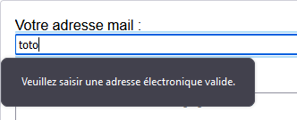
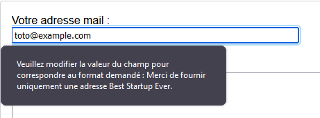

{{HTMLSidebar}}

Les éléments [`<input>`](/fr/docs/Web/HTML/Element/Input) dont l'attribut `type` vaut **`email`** permettent à une utilisatrice ou un utilisateur de saisir et d'éditer une adresse mail ou, si l'attribut [`multiple`](/fr/docs/Web/HTML/Attributes/multiple) est indiqué, une liste d'adresses mail. La valeur saisie est automatiquement validée afin de vérifier que le champ est vide ou que l'adresse (ou la liste d'adresses) est correcte. Les pseudo-classes CSS [`:valid`](/fr/docs/Web/CSS/:valid) et [`:invalid`](/fr/docs/Web/CSS/:invalid) sont appliquées automatiquement selon le cas.

{{EmbedInteractiveExample("pages/tabbed/input-email.html", "tabbed-shorter")}}

La valeur saisie dans le champ est automatiquement validée pour vérifier s'il s'agit d'une chaîne de caractères vide ou d'une adresse mail valide (ou une liste de telles adresses) avant que le formulaire soit envoyé. Les pseudo-classes CSS [`:valid`](/fr/docs/Web/CSS/:valid) et [`:invalid`](/fr/docs/Web/CSS/:invalid) sont automatiquement appliquées selon la validité des champs afin d'indiquer visuellement si la valeur courante du champ est une adresse mail valide ou non.

> **Note :** Les navigateurs qui ne prennent pas en charge le type `email` emploieront un élément `<input>` [`"text"`](/fr/docs/Web/HTML/Element/Input/text) à la place.

<table class="properties">
  <tbody>
    <tr>
      <td><strong>Valeur</strong></td>
      <td>Une chaîne de caractères (<a href="/fr/docs/Web/API/DOMString"><code>DOMString</code></a>) représentant une adresse électronique ou une chaîne vide.</td>
    </tr>
    <tr>
      <td><strong>Évènements</strong></td>
      <td><a href="/fr/docs/Web/API/HTMLElement/change_event"><code>change</code></a> et <a href="/fr/docs/Web/API/HTMLElement/Input_event"><code>input</code></a></td>
    </tr>
    <tr>
      <td><strong>Attributs pris en charge</strong></td>
      <td>
        <a href="/fr/docs/Web/HTML/Element/Input#attr-autocomplete"><code>autocomplete</code></a>, <a href="/fr/docs/Web/HTML/Element/Input#attr-list"><code>list</code></a>, <a href="/fr/docs/Web/HTML/Element/Input#attr-maxlength"><code>maxlength</code></a>, <a href="/fr/docs/Web/HTML/Element/Input#attr-minlength"><code>minlength</code></a>, <a href="/fr/docs/Web/HTML/Element/Input#attr-multiple"><code>multiple</code></a>, <a href="/fr/docs/Web/HTML/Element/Input#attr-name"><code>name</code></a>, <a href="/fr/docs/Web/HTML/Element/Input#attr-pattern"><code>pattern</code></a>, <a href="/fr/docs/Web/HTML/Element/Input#attr-placeholder"><code>placeholder</code></a>, <a href="/fr/docs/Web/HTML/Element/Input#attr-readonly"><code>readonly</code></a>, <a href="/fr/docs/Web/HTML/Element/Input#attr-required"><code>required</code></a>, <a href="/fr/docs/Web/HTML/Element/Input#attr-size"><code>size</code></a>, <a href="/fr/docs/Web/HTML/Element/Input#attr-type"><code>type</code></a></td>
    </tr>
    <tr>
      <td><strong>Attributs IDL</strong></td>
      <td><code>list</code> et <code>value</code></td>
    </tr>
    <tr>
      <td><strong>Méthodes</strong></td>
      <td><a href="/fr/docs/Web/API/HTMLInputElement/select"><code>select()</code></a>
      </td>
    </tr>
  </tbody>
</table>

## Valeur

La valeur d'un tel élément [`<input>`](/fr/docs/Web/HTML/Element/Input), contenue dans l'attribut [`value`](/fr/docs/Web/HTML/Element/Input#attr-value), contient une chaîne de caractères qui est automatiquement validée afin de vérifier que c'est une adresse électronique valide. Pour être plus précis, trois formes sont considérées valides&nbsp;:

1. Une chaîne de caractères vide (`""`) qui indique que l'utilisatrice ou l'utilisateur n'a saisi aucune valeur ou que la valeur a été retirée.
2. Une adresse électronique bien formée. Cela ne signifie pas que l'adresse en question existe mais qu'elle est correctement formatée. Autrement dit, elle respecte une structure `"nom@domaine.tld"`. Cette règle est un peu plus complexe (cf. la section [Validation](#validation) pour l'algorithme exact).
3. Si et seulement si l'attribut [`multiple`](/fr/docs/Web/HTML/Attributes/multiple) est indiqué, la valeur peut être une liste d'adresses électroniques correctes, séparées par des virgules. Chaque blanc situé avant et après chaque adresse sera retiré.

Pour plus de détails, se référer à la section [Validation](#validation) sur la façon dont les adresses mails sont validées.

## Attributs supplémentaires

En complément des attributs communs à l'ensemble des éléments [`<input>`](/fr/docs/Web/HTML/Element/Input), les champs de type `email` prennent en charge les attributs suivants&nbsp;:

### `list`

La valeur de cet attribut est l'identifiant d'un élément [`<datalist>`](/fr/docs/Web/HTML/Element/datalist) situé dans le même document. L'élément [`<datalist>`](/fr/docs/Web/HTML/Element/datalist) fournit la liste de valeurs prédéfinies à suggérer à l'utilisatrice ou à l'utilisateur. Toute valeur de la liste qui n'est pas compatible avec ce type de champ n'est pas incluse dans les options suggérées. Les valeurs fournies sont des suggestions et pas des valeurs imposées&nbsp;: il reste possible de sélectionner des valeurs en dehors de cette liste.

### `maxlength`

Le nombre maximum de caractères (exprimé en nombre de points de code UTF-16) que l'utilisatrice ou l'utilisateur peut saisir dans le champ. Cette valeur doit être un entier positif ou nul. Si aucune valeur n'est fournie pour `maxlength` ou qu'une valeur invalide est fournie, il n'y a pas de contrainte de taille maximale. La valeur indiquée par cet attribut doit être supérieure à `minlength`.

Le champ [ne sera pas valide](/fr/docs/Web/Guide/HTML/Constraint_validation) si la longueur du texte dépasse `maxlength` en nombre de points de code UTF-16. Les contraintes de validation sont uniquement appliquées lorsque la valeur est modifiée par l'utilisatrice ou l'utilisateur.

### `minlength`

Le nombre minimal de caractères (exprimé en nombre de points de code UTF-16) que l'utilisatrice ou l'utilisateur peut saisir dans le champ. Cette valeur doit être un entier positif ou nul. Si aucune valeur n'est fournie pour `minlength` ou qu'une valeur invalide est fournie, il n'y a pas de contrainte de taille minimale. La valeur indiquée par cet attribut doit être inférieure à `maxlength`.

Le champ [ne sera pas valide](/fr/docs/Web/Guide/HTML/Constraint_validation) si la longueur du texte est inférieure à `minlength` en nombre de points de code UTF-16. Les contraintes de validation sont uniquement appliquées lorsque la valeur est modifiée par l'utilisatrice ou l'utilisateur.

### `multiple`

Un attribut booléen qui indique, s'il est présent, que plusieurs adresses électroniques peuvent être saisies en étant séparées par des virgules (et éventuellement des espaces). Voir la section sur [la saisie de plusieurs adresses](#gérer_plusieurs_adresses_mail) ci-après.

> **Note :** Normalement, lorsque l'attribut [`required`](/fr/docs/Web/HTML/Element/Input#attr-required) est indiqué, la personne remplissant le formulaire doit saisir une adresse mail valide pour que le champ soit considéré valide. Toutefois, si l'attribut `multiple` est ajouté, une liste de zéro adresses (une chaîne de caractères vide ou un texte constitué uniquement d'espaces) sera une valeur valide. Autrement dit, la personne remplissant le formulaire n'est pas obligée de saisir une adresse lorsque `multiple` est présent, quelle que soit la valeur de `required`.

### `pattern`

L'attribut `pattern` est une expression rationnelle que doit respecter la valeur du champ afin d'être [valide](/fr/docs/Web/Guide/HTML/HTML5/Constraint_validation). Cette expression rationnelle doit être une expression rationnelle valide pour JavaScript (telle qu'utilisée par [`RegExp`](/fr/docs/Web/JavaScript/Reference/Global_Objects/RegExp) et telle que documentée dans [ce guide](/fr/docs/Web/JavaScript/Guide/Regular_Expressions)). Le marqueur `'u'` est fourni par le navigateur lors de la compilation de l'expression rationnelle afin que le motif soit traité comme une séquence de points de code Unicode plutôt que comme des caractères ASCII. Aucune barre oblique (`/`) ne devrait être utilisée autour du motif.

Si l'expression rationnelle est invalide ou que cet attribut n'est pas défini, l'attribut est ignoré.

> **Note :** L'attribut [`title`](/fr/docs/Web/HTML/Element/Input#attr-title) pourra être utilisé afin d'afficher une bulle d'informations qui explique les conditions à respecter. Il est également conseillé d'inclure un texte explicatif à proximité du champ.

Voir [la section sur l'utilisation de cet attribut ci-après](#validation_grâce_à_une_expression_rationnelle) pour plus d'exemples.

### `placeholder`

L'attribut `placeholder` est une chaîne de caractères fournissant une courte indication à l'utilisatrice ou l'utilisateur quant à l'information attendue dans le champ. Cet attribut devrait être un mot ou une phrase courte qui illustre le type de donnée attendu plutôt qu'un message explicatif. Le texte ne doit pas contenir de saut à la ligne.

Si le contenu du contrôle respecte une directionnalité donnée ([LTR](/fr/docs/Glossary/ltr) ou [RTL](/fr/docs/Glossary/rtl)) et que le texte indicatif doit être présenté dans l'autre sens, il est possible d'utiliser l'algorithme de formatage bidirectionnel Unicode&nbsp;: voir [Comment utiliser les contrôles Unicode pour le texte bidirectionnel (en anglais)](https://www.w3.org/International/questions/qa-bidi-unicode-controls).

> **Note :** On évitera, tant que faire se peut, d'utiliser l'attribut `placeholder`, car il n'est pas sémantiquement très utile pour expliquer le formulaire, et car il peut causer certains problèmes avec le contenu. Voir [la page sur `<input>`](/fr/docs/Web/HTML/Element/Input) pour plus d'informations.

### `readonly`

Un attribut booléen qui, lorsqu'il est présent, indique que le champ ne peut pas être édité par l'utilisatrice ou l'utilisateur. Toutefois, la valeur de l'attribut `value` peut toujours être modifiée via du code JavaScript, qui définirait la propriété `value` rattachée à [l'interface `HTMLInputElement`](/fr/docs/Web/API/HTMLInputElement).

> **Note :** Un champ en lecture seule ne pouvant pas avoir de valeur, l'attribut `required` n'aura pas d'effet si l'attribut `readonly` est également présent.

### `size`

L'attribut `size` est un nombre positif qui indique le nombre de caractères affichés à l'écran et qui définit donc la largeur du champ. La valeur par défaut de cet attribut est 20. Étant donné que la largeur des caractères peut varier cet attribut ne permet de définir une largeur exacte mais approximative.

Cet attribut ne définit pas la limite du nombre de caractères saisissables dans le champ mais uniquement, et approximativement, le nombre de caractères qui peuvent être affichés à l'écran simultanément. Pour fixer une taille maximale sur la valeur du champ, on utilisera plutôt l'attribut `maxlength`.

## Utiliser les champs de saisie d'adresses électroniques

Les adresses mails font partie des informations les plus fréquentes dans les formulaires web&nbsp;: elles sont utilisées pour se connecter, demander des informations, confirmer une commande, envoyer un email, etc. Le type `email` permet de simplifier le travail de construction de l'interface utilisateur et la logique associée pour les adresses électroniques. Lorsqu'on crée un champ dont l'attribut `type` vaut `email`, le navigateur valide ou non le texte saisi afin de vérifier qu'il s'agit d'une adresse correcte. Cela permet d'éviter les cas où la personne remplissant le formulaire a fait une faute de saisie ou lorsqu'elle a fourni une adresse invalide.

On notera toutefois que le navigateur ne vérifie pas si l'adresse saisie existe réellement ou correspond à une utilisatrice existante ou un utilisateur existant du site, ou si elle respecte quelque autre critère. Autrement dit, le navigateur vérifie uniquement que l'adresse fournie est bien formée.

> **Note :** Il est également important de rappeler qu'une utilisatrice ou un utilisateur peut modifier le HTML de la page grâce aux outils de développement. Votre site _ne doit pas_ reposer sur les mécanismes de validation du navigateur. Il est crucial de vérifier l'adresse électronique _côté serveur_ dès que le texte fournit est impliqué, d'une façon ou d'une autre, dans une fonctionnalité sensible (par exemple la connexion à un site, un achat, etc.).

### Un champ `email` simple

À l'heure actuelle, l'ensemble des navigateurs qui implémentent cet élément le gèrent comme un champ texte standard auquel certaines fonctionnalités de validation sont ajoutées. La spécification laisse toutefois une marge de manœuvre pour cette validation (l'élément pourrait, par exemple, consulter le répertoire de l'appareil pour choisir une adresse parmi cette liste). Dans sa forme la plus simple, un champ `email` peut être écrit de cette façon&nbsp;:

```html
<input id="emailAddress" type="email" />
```

{{EmbedLiveSample('', 600, 40)}}

Un tel champ est considéré comme valide lorsqu'il est vide ou lorsqu'une adresse électronique bien formée est saisie. Dans les autres cas, la valeur est considérée comme invalide. Si on ajoute l'attribut [`required`](/fr/docs/Web/HTML/Element/Input#attr-required), seules les adresses électroniques bien formées sont autorisées, il n'est plus possible de laisser la valeur vide.

### Gérer plusieurs adresses mail

Grâce à l'attribut [`multiple`](/fr/docs/Web/HTML/Attributes/multiple), on peut configurer le champ afin de saisir plusieurs adresses mail.

```html
<input id="emailAddress" type="email" multiple />
```

{{EmbedLiveSample('', 600, 40)}}

Avec cet attribut, la valeur saisie est valide quand on saisit zéro, une ou plusieurs adresses électroniques bien formées, séparées par des virgules et éventuellement entourées de blancs.

Voici certains exemples de chaînes de caractères valides lorsque `"multiple"` est utilisé&nbsp;:

- `""`
- `"me@example"`
- `"me@example.org"`
- `"me@example.org,you@example.org"`
- `"me@example.org, you@example.org"`
- `"me@example.org,you@example.org, us@example.org"`

En revanche, les exemples suivants sont considérés invalides&nbsp;:

- `","`
- `"me"`
- `"me@example.org you@example.org"`

### Textes indicatifs (<i lang="en">placeholders</i>)

Il est parfois utile de fournir une indication contextuelle quant à la valeur qui doit être saisie. C'est notamment pertinent quand la disposition de la page ne permet pas d'utiliser des étiquettes suffisamment descriptives (ou longues) pour chaque élément [`<input>`](/fr/docs/Web/HTML/Element/Input). Pour fournir une telle indication, on peut fournir un texte indicatif (<i lang="en">placeholder</i>) qui sera affiché dans le champ lorsque la valeur est vide et qui disparaît dès que des données sont saisies.

Dans l'exemple qui suit, on utilise un élément `<input>` de type `email` avec le texte indicatif `sophie@example.com`. Vous pouvez manipuler l'exemple afin de voir comment ce texte disparaît/réapparaît lorsqu'on édite la valeur du champ.

```html
<input type="email" placeholder="sophie@example.com" />
```

{{EmbedLiveSample('', 600, 40)}}

### Contrôler la taille du champ

Il est possible de contrôler la taille physique de la boîte de saisie et également la longueur minimale/maximale de la valeur qu'il est possible de saisir.

#### Contrôler la taille physique

La taille physique de la boîte de saisie peut être paramétrée grâce à l'attribut [`size`](/fr/docs/Web/HTML/Element/Input#attr-size). Grâce à cet attribut, on peut indiquer le nombre de caractères que le champ peut afficher. Dans l'exemple qui suit, la boîte d'édition pourra contenir jusqu'à 15 caractères&nbsp;:

```html
<input type="email" size="15" />
```

{{EmbedLiveSample('', 600, 40)}}

#### Contrôler la taille de la valeur

L'attribut `size` ne contraint pas la longueur de l'adresse qu'on pourra saisir. On peut donc avoir de petits champs qui permettent de saisir de longues adresses. Pour borner la taille de l'adresse mail à saisir, on pourra utiliser l'attribut [`minlength`](/fr/docs/Web/HTML/Element/Input#attr-minlength) pour indiquer le nombre minimal de caractères et l'attribut [`maxlength`](/fr/docs/Web/HTML/Element/Input#attr-maxlength) pour indiquer le nombre maximal de caractères contenus dans l'adresse électronique.

Dans l'exemple qui suit, on affiche une boîte de saisie qui mesure 32 caractères de large et dans laquelle on ne peut saisir des adresses qui ont au moins 3 caractères et au plus 64 caractères.

```html
<input type="email" size="32" minlength="3" maxlength="64" />
```

{{EmbedLiveSample("", 600, 40)}}

### Fournir des options par défaut

#### Fournir une seule option par défaut avec value

On peut également fournir une valeur par défaut en remplissant l'attribut [`value`](/fr/docs/Web/HTML/Element/Input#attr-value) de l'élément&nbsp;:

```html
<input type="email" value="default@example.com" />
```

{{EmbedLiveSample("", 600, 40)}}

#### Proposer des suggestions

Pour améliorer encore l'ergonomie, on peut fournir une liste d'options par défaut parmi laquelle l'utilisatrice ou l'utilisateur peut choisir. Cela fonctionne en utilisant l'attribut [`list`](/fr/docs/Web/HTML/Element/Input#attr-list) dont la valeur est un identifiant d'un élément [`<datalist>`](/fr/docs/Web/HTML/Element/datalist) qui contient différents éléments [`<option>`](/fr/docs/Web/HTML/Element/Option) dont les valeurs des attributs `value` fournissent les adresses suggérées. L'utilisatrice ou l'utilisateur n'est pas contraint à saisir une valeur parmi celles-ci, elles sont uniquement fournies à titre indicatif.

```html
<input type="email" size="40" list="defaultEmails" />

<datalist id="defaultEmails">
  <option value="jbond007@mi6.defence.gov.uk"></option>
  <option value="jbourne@unknown.net"></option>
  <option value="nfury@shield.org"></option>
  <option value="tony@starkindustries.com"></option>
  <option value="hulk@grrrrrrrr.arg"></option>
</datalist>
```

{{EmbedLiveSample("", 600, 40)}}

Lorsqu'on utilise l'élément [`<datalist>`](/fr/docs/Web/HTML/Element/datalist) et l'élément [`<option>`](/fr/docs/Web/HTML/Element/Option), le navigateur affichera les adresses suggérées lors de la saisie, généralement sous la forme d'une liste déroulante ou d'une popup. Bien que les détails d'interface puissent dépendre de chaque navigateur, cliquer sur le champ d'édition affichera généralement la liste sous forme d'un volet déroulant. Ensuite, la liste est restreinte au fur et à mesure des caractères saisis.

## Validation

Il existe deux niveaux de validation pour les champs de saisie de type `email`. Tout d'abord, on a le niveau standard qui permet de vérifier automatiquement si l'adresse électronique est bien formatée. Ensuite, il est possible d'ajouter un filtre spécifique si besoin de répondre à des contraintes plus spécifiques.

> **Attention :** La validation du formulaire HTML par l'agent utilisateur ne saurait remplacer la vérification des données saisies côté serveur. En effet, il est relativement simple de modifier le document HTML avec son navigateur pour outrepasser les contraintes exprimées ici (quitte à les transmettre directement au serveur). Si les données ne sont pas vérifiées côté serveur, cela pourra entraîner des erreurs (valeurs trop grande, au mauvais format) voire des failles de sécurité.

### Validation simple

Les navigateurs qui implémentent le type `email` fournissent une validation automatique afin de vérifier que la valeur saisie respecte le format d'une adresse électronique valide. Les navigateurs qui implémentent la spécification devraient utiliser un algorithme équivalent à l'expression régulière suivante&nbsp;:

```js
/^[a-zA-Z0-9.!#$%&'*+\/=?^_`{|}~-]+@[a-zA-Z0-9](?:[a-zA-Z0-9-]{0,61}
[a-zA-Z0-9])?(?:\.[a-zA-Z0-9](?:[a-zA-Z0-9-]{0,61}[a-zA-Z0-9])?)*$/
```

Les pseudo-classes CSS [`:valid`](/fr/docs/Web/CSS/:valid) et [`:invalid`](/fr/docs/Web/CSS/:invalid) peuvent être utilisées afin de mettre en forme la valeur selon qu'elle est valide ou non — voir [Validation des données de formulaires](/fr/docs/Learn/Forms/Form_validation) pour en apprendre davantage.

> **Note :** La spécification comporte certains problèmes relatifs aux noms de domaines internationaux et à la validation des adresses électroniques en HTML. Pour plus d'informations, voir [le bug 15489 du W3C](https://www.w3.org/Bugs/Public/show_bug.cgi?id=15489).

### Validation grâce à une expression rationnelle

S'il est nécessaire que l'adresse saisie respecte plus de critères, il est possible d'utiliser l'attribut [`pattern`](/fr/docs/Web/HTML/Element/Input#attr-pattern) afin d'indiquer [une expression rationnelle](/fr/docs/Web/JavaScript/Guide/Regular_Expressions) contre laquelle la valeur sera vérifiée. Si l'attribut [`multiple`](/fr/docs/Web/HTML/Element/Input#attr-multiple) est actif, chaque élément de la liste devra respecter cette expression rationnelle.

Prenons comme exemple l'intranet d'une entreprise avec un site web qui permet de contacter le département du support technique en cas de besoin. Un formulaire simplifier permet de saisir une adresse électronique et un message. Dans ce cas, on souhaite vérifier que l'adresse électronique est saisie mais également que c'est une adresse respectant le format de celles utilisées dans l'entreprise.

Le navigateur vérifie d'une part que l'adresse électronique est une adresse correctement formatée _et_ que celle-ci respecte l'expression rationnelle indiquée avec [`pattern`](/fr/docs/Web/HTML/Element/Input#attr-pattern). Voici un exemple d'application&nbsp;:

```css hidden
body {
  font: 16px sans-serif;
}

.emailBox {
  padding-bottom: 20px;
}

.messageBox {
  padding-bottom: 20px;
}

label {
  line-height: 22px;
}

label::after {
  content: " :";
}
```

```html
<form>
  <div class="emailBox">
    <label for="emailAddress">Votre adresse mail</label><br />
    <input
      id="emailAddress"
      type="email"
      size="64"
      maxlength="64"
      required
      placeholder="nomutilisateur@beststartupever.com"
      pattern=".+@beststartupever.com"
      title="Merci de fournir uniquement une adresse Best Startup Ever" />
  </div>

  <div class="messageBox">
    <label for="message">Requête</label><br />
    <textarea
      id="message"
      cols="80"
      rows="8"
      required
      placeholder="Mes chaussures sont trop petites."></textarea>
  </div>
  <input type="submit" value="Envoyer la requête" />
</form>
```

{{EmbedLiveSample("", 700, 275)}}

Le formulaire ([`<form>`](/fr/docs/Web/HTML/Element/Form)) contient un élément [`<input>`](/fr/docs/Web/HTML/Element/Input) de type `email` pour saisir l'adresse de l'utilisatrice ou l'utilisateur, un élément [`<textarea>`](/fr/docs/Web/HTML/Element/Textarea) permettant de saisir le message et un élément `<input>` de type [`"submit"`](/fr/docs/Web/HTML/Element/Input/submit) qui formera un bouton permettant d'envoyer le formulaire. Chaque champ possède un élément [`<label>`](/fr/docs/Web/HTML/Element/Label) associé qui permet d'indiquer ce qui est attendu.

Si on regarde le champ de saisie pour l'adresse électronique, on voit que les deux attributs [`size`](/fr/docs/Web/HTML/Element/Input#attr-size) et [`maxlength`](/fr/docs/Web/HTML/Element/Input#attr-maxlength) ont la valeur 64 (on affiche une boîte de saisie large de 64 caractères et on ne peut saisir une adresse électronique d'au plus 64 caractères). L'attribut [`required`](/fr/docs/Web/HTML/Element/Input#attr-required) est présent et l'adresse électronique est donc obligatoire pour l'envoi du formulaire.

L'attribut [`placeholder`](/fr/docs/Web/HTML/Element/Input#attr-placeholder) indique qu'une valeur semblable à `"nomutilisateur@beststartupever.com"` est attendue. L'intérêt de cette valeur est double&nbsp;: on indique qu'il faut saisir une adresse mail et on suggère que cette adresse provient d'un compte `beststartupever.com`. Le type `email` permet de valider le texte saisi afin de vérifier qu'il s'agit d'une adresse électronique valide. Si la valeur saisie n'est pas une adresse valide, un message d'erreur sera affiché&nbsp;:



Si on utilise uniquement les attributs qu'on vient de décrire, on restreint les valeurs saisissables aux adresses électroniques valides de 64 caractères. Or, on veut également valider le fait que l'adresse respecte le format `_nomutilisateur_@beststartupever.com`. C'est pourquoi on utilise l'attribut [`pattern`](/fr/docs/Web/HTML/Element/Input#attr-pattern) avec la valeur `".+@beststartupever.com"`. Cette valeur est une expression rationnelle qui permet de vérifier que la chaîne de caractère contient un ou plusieurs caractères quelconques, ensuite suivi d'une arobase (`@`) puis du nom de domaine `beststartupever.com`.

On notera que cette expression rationnelle ne permet pas de vérifier que l'adresse électronique est valide (on pourra par exemple avoir `@beststartupever.com` (avec une espace en début de chaîne) ou encore `@@beststartupever.com` qui ne sont pas valides). En fait, le navigateur vérifie que l'adresse respecte l'expression rationnelle fournie **et** que l'adresse est valide. Autrement dit, avec le type `email` et cette valeur pour l'attribut `pattern`, on s'assure que l'adresse est une adresse électronique valide et que c'est une bien une adresse avec le nom de domaine `beststartupever.com`.

Lorsqu'on utilise l'attribut `pattern`. il est conseillé d'utiliser l'attribut [`title`](/fr/docs/Web/HTML/Global_attributes#attr-title) afin de décrire le motif de l'expression rationnelle. Autrement dit, dans ce cas, l'attribut `title` doit décrire le format souhaité plutôt que contenir une autre information. En effet, cet attribut sera affiché ou prononcé en cas d'erreur. Par exemple, le navigateur pourrait afficher le message «&nbsp;Le texte saisi ne correspond pas au motif requis.&nbsp;» suivi du texte indiqué dans la valeur de `title`. Par exemple si l'attribut `title` vaut «&nbsp;Adresse mail&nbsp;», le message affiché serait «&nbsp;Le texte saisi ne correspond pas au motif requis. Adresse mail&nbsp;» ce qui n'est pas correct.

C'est pour cela qu'on indique la chaîne de caractères «&nbsp;Merci de fournir uniquement une adresse Best Startup Ever&nbsp;». Le message complet obtenu sera donc&nbsp;: «&nbsp;Le texte saisi ne correspond pas au motif requis. Merci de fournir uniquement une adresse Best Startup Ever.&nbsp;»



> **Note :** Si vous rencontrez des problèmes à propos de l'expression rationnelle, n'hésitez pas à ouvrir la console du navigateur. Cette dernière peut contenir des messages d'erreur aidant à diagnostiquer et résoudre le problème.

## Exemples

Dans l'exemple qui suit, on peut saisir une adresse électronique qui contient au plus 256 caractères. La boîte de saisie affichera au plus 64 caractères et contiendra le texte `"user@example.gov"` comme indication lorsque le champ est vide. On trouve également l'attribut [`multiple`](/fr/docs/Web/HTML/Attributes/multiple) qui permet de saisir zéro ou plusieurs adresses séparées par des virgules (cf. ci-avant). Enfin, l'attribut [`list`](/fr/docs/Web/HTML/Element/Input#attr-list) utilisé indique un identifiant d'un élément [`<datalist>`](/fr/docs/Web/HTML/Element/datalist) dont les éléments [`<option>`](/fr/docs/Web/HTML/Element/Option) déterminent les valeurs suggérées qui peuvent être sélectionnées par l'utilisatrice ou l'utilisateur.

L'élément [`<label>`](/fr/docs/Web/HTML/Element/Label) qui précède l'élément `<input>` permettra d'afficher un libellé avant la boîte de saisie. Le lien entre les deux est fait grâce à l'attribut `for` qui contient `"emailAddress"` qui est l'identifiant de l'élément [`<input>`](/fr/docs/Web/HTML/Element/Input). Grâce à cette association, cliquer sur l'étiquette permettra de placer le focus sur le champ de saisie.

```html
<label for="emailAddress">Adresse mail</label><br />
<input
  id="emailAddress"
  type="email"
  placeholder="user@example.gov"
  list="defaultEmails"
  size="64"
  maxlength="256"
  multiple />

<datalist id="defaultEmails">
  <option value="jbond007@mi6.defence.gov.uk"></option>
  <option value="jbourne@unknown.net"></option>
  <option value="nfury@shield.org"></option>
  <option value="tony@starkindustries.com"></option>
  <option value="hulk@grrrrrrrr.arg"></option>
</datalist>
```

{{EmbedLiveSample('', 600, 80)}}

## Spécifications

{{Specifications}}

## Compatibilité des navigateurs

{{Compat}}

## Voir aussi

- [Le guide relatif aux formulaires HTML](/fr/docs/Learn/Forms)
- [`<input>`](/fr/docs/Web/HTML/Element/Input)
- [`<input type="tel">`](/fr/docs/Web/HTML/Element/Input)
- [`<input type="url">`](/fr/docs/Web/HTML/Element/input/url)
- Les attributs&nbsp;:

  - [`list`](/fr/docs/Web/HTML/Element/Input#attr-list)
  - [`minlength`](/fr/docs/Web/HTML/Attributes/minlength)
  - [`maxlength`](/fr/docs/Web/HTML/Attributes/maxlength)
  - [`multiple`](/fr/docs/Web/HTML/Attributes/multiple)
  - [`pattern`](/fr/docs/Web/HTML/Attributes/pattern)
  - [`placeholder`](/fr/docs/Web/HTML/Element/Input#attr-placeholder)
  - [`readonly`](/fr/docs/Web/HTML/Attributes/readonly)
  - [`size`](/fr/docs/Web/HTML/Attributes/size)

- [La compatibilité des propriétés CSS pour les éléments de formulaire](/fr/docs/Learn/Forms/Property_compatibility_table_for_form_controls)
