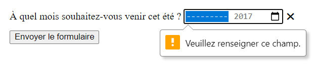

{{HTMLRef("Input_types")}}

Les éléments [`<input>`](/fr/docs/Web/HTML/Element/Input) dont l'attribut `type` vaut **`month`** permettent de créer des contrôles où l'utilisatrice ou l'utilisateur peut saisir un mois et année. La valeur associée à un tel élément suit le format `YYYY-MM`, où `YYYY` représente l'année sur quatre chiffre et `MM` le mois sur deux chiffres.

{{EmbedInteractiveExample("pages/tabbed/input-month.html", "tabbed-shorter")}}

L'interface utilisateur associée à ce contrôle varie d'un navigateur à l'autre et la prise en charge de cette fonctionnalité reste encore hétérogène&nbsp;: seuls Chrome, Opéra et Edge implémentent cette fonctionnalité sur ordinateur et la plupart des navigateurs mobiles possèdent une implémentation. Pour les navigateurs qui ne prennent pas en charge cette fonctionnalité, l'élément sera transformé en un simple [`<input type="text">`](/fr/docs/Web/HTML/Element/Input/text).

Si votre navigateur ne prend pas en charge ce type d'élément, voici ensuite une capture d'écran de Chrome&nbsp;: cliquer sur la flèche vers le bas permettra de faire apparaître un sélecteur de date qui permettra de choisir le mois et l'année.


Voici un aperçu du contrôle sous Edge&nbsp;:


## Résumé technique

<table class="properties">
  <tbody>
    <tr>
      <td><strong>Valeur</strong></td>
      <td>Une chaîne de caractères (<a href="/fr/docs/Web/API/DOMString"><code>DOMString</code></a>) qui représente un mois et une année ou bien la chaîne vide.</td>
    </tr>
    <tr>
      <td><strong>Évènements</strong></td>
      <td><a href="/fr/docs/Web/API/HTMLElement/change_event"><code>change</code></a> et <a href="/fr/docs/Web/API/HTMLElement/Input_event"><code>input</code></a></td>
    </tr>
    <tr>
      <td><strong>Attributs communs pris en charge</strong></td>
      <td><a href="/fr/docs/Web/HTML/Element/Input#attr-autocomplete"><code>autocomplete</code></a>, <a href="/fr/docs/Web/HTML/Element/Input#attr-list"><code>list</code></a>, <a href="/fr/docs/Web/HTML/Element/Input#attr-readonly"><code>readonly</code></a>, <a href="/fr/docs/Web/HTML/Element/Input#attr-step"><code>step</code></a></td>
    </tr>
    <tr>
      <td><strong>Attributs IDL</strong></td>
      <td><code>value</code></td>
    </tr>
    <tr>
      <td><strong>Méthodes</strong></td>
      <td><a href="/fr/docs/Web/API/HTMLInputElement/select"><code>select()</code></a>, <a href="/fr/docs/Web/API/HTMLInputElement/stepDown"><code>stepDown()</code></a>, <a href="/fr/docs/Web/API/HTMLInputElement/stepUp"><code>stepUp()</code></a></td>
    </tr>
  </tbody>
</table>

## Valeur

Une chaîne de caractères ([`DOMString`](/fr/docs/Web/API/DOMString)) qui représente la valeur du mois et de l'année saisies via le contrôle, au format `YYYY-MM` (c'est-à-dire une année sur 4 chiffres suivi d'un tiret (`-`) suivi du mois sur deux chiffres). Le format détaillé est [décrit dans l'article sur les formats des dates/heures](/fr/docs/Web/HTML/Date_and_time_formats#représentation_des_mois).

Il est possible de définir une valeur par défaut pour le contrôle en utilisant l'attribut [`value`](/fr/docs/Web/HTML/Element/Input#attr-value) de la façon suivante&nbsp;:

### Fournir une valeur par défaut

```html
<label for="bday-month">Quel est le mois de votre naissance ?</label>
<input id="bday-month" type="month" name="bday-month" value="2017-06">
```

{{EmbedLiveSample('', 600, 60)}}

On notera que la façon dont la date est affichée peut varier selon la locale de l'utilisatrice ou l'utilisateur et être présentée sous un format différent. En revanche, d'un point de vue technique, la valeur de l'attribut `value` suivra toujours le format `YYYY-MM`.

Par exemple, lorsque le formulaire précédent sera envoyé vers le serveur, l'information sera transmise de cette façon&nbsp;: `bday-month=1978-06`.

### Définir la valeur en JavaScript

Il est également possible de manipuler la date en JavaScript grâce à la propriété `value` rattachée à [l'interface `HTMLInputElement`](/fr/docs/Web/API/HTMLInputElement).

```html
<label for="bday-month">Quel est le mois de votre naissance ?</label>
<input id="bday-month" type="month" name="bday-month" value="2017-06">
```

```js
let monthControl = document.querySelector('input[type="month"]');
monthControl.value = '1978-06';
```

{{EmbedLiveSample("", 600, 60)}}

## Attributs supplémentaires

En complément des attributs pris en charge par l'ensemble des éléments [`<input>`](/fr/docs/Web/HTML/Element/Input), les champs pour les mois gèrent les attributs suivants&nbsp;:

### `list`

La valeur de cet attribut est l'identifiant d'un élément [`<datalist>`](/fr/docs/Web/HTML/Element/datalist) situé dans le même document. L'élément [`<datalist>`](/fr/docs/Web/HTML/Element/datalist) fournit la liste de valeurs prédéfinies à suggérer à l'utilisatrice ou à l'utilisateur. Toute valeur de la liste qui n'est pas compatible avec ce type de champ n'est pas incluse dans les options suggérées. Les valeurs fournies sont des suggestions et pas des valeurs imposées&nbsp;: il reste possible de sélectionner des valeurs en dehors de cette liste.

### `max`

Le mois le plus tardif, indiqué avec l'année, sous la forme d'une chaîne de caractères au format `yyyy-MM`. Si la valeur saisie dans le champ (représentée par l'attribut [`value`](/fr/docs/Web/HTML/Element/Input#attr-value)) est supérieure à cette date, [la validation échouera](/fr/docs/Web/Guide/HTML/Constraint_validation). Si la valeur fournie n'est pas une chaîne de caractères au format correct, aucun maximum ne sera fixé pour la valeur du contrôle.

Cette valeur doit être supérieure ou égale à celle indiquée par l'attribut `min`.

### `min`

Le mois le plus tôt, indiqué avec l'année, sous la forme d'une chaîne de caractères au format `yyyy-MM`. Si la valeur saisie dans le champ (représentée par l'attribut [`value`](/fr/docs/Web/HTML/Element/Input#attr-value)) est antérieure à cette date, [la validation échouera](/fr/docs/Web/Guide/HTML/Constraint_validation). Si la valeur fournie pour cet attribut n'est pas une chaîne de caractères au format correct, aucun minimum ne sera fixé pour la valeur du contrôle.

Cette valeur doit être inférieure ou égale à celle indiquée par l'attribut `max`.

### `readonly`

Un attribut booléen qui, lorsqu'il est présent, indique que le champ ne peut pas être édité par l'utilisatrice ou l'utilisateur. La valeur de l'attribut `value` peut toutefois être modifiée grâce à du code JavaScript, qui changerait la propriété `value` rattachée à [l'interface `HTMLInputElement`](/fr/docs/Web/API/HTMLInputElement).

> **Note :** Un champ en lecture seule pouvant ne pas avoir de valeur, l'attribut `required` n'aura aucun effet si l'attribut `readonly` est défini.

### `step`

L'attribut `step` est un nombre qui indique le «&nbsp;pas&nbsp;» suivi par le compteur. Il peut également prendre la valeur spéciale `any` (décrite ci-après). Seules les valeurs qui suivent cette progression (à partir de `min` ou de `value` si ces attributs sont fournis) seront considérées comme valides.

Une chaîne de caractères `any` indique qu'aucune contrainte de pas n'est appliquée et que n'importe quelle valeur (sous réserve qu'elle respecte les autres contraintes potentiellement indiquées par `min` ou `max`) est valide.

> **Note :** Lorsque les données saisies par l'utilisatrice ou l'utilisateur ne respectent pas cette contrainte, l'agent utilisateur pourra arrondir à la valeur valide la plus proche, avec une préférence pour les dates les plus avancées quand deux dates sont aussi proches de la valeur saisie.

Pour les champs `month`, la valeur de l'attribut `step` est exprimée en mois et le facteur d'amplification est égal à 1 (la valeur sous-jacente est également exprimée en mois). La valeur par défaut pour cet attribut est 1.

## Utiliser `<input type="month">`

Un élément `<input>` de type `month` permet d'avoir une interface utilisateur simple d'utilisation pour choisir un mois et également de respecter un même format, quelle que soit la locale de l'utilisatrice ou l'utilisateur. Toutefois, `<input type="month">` n'est pas pris en charge par l'ensemble des navigateurs ce qui peut poser problème.

Nous verrons ici quelques cas d'utilisation, simples puis complexes et nous aborderons ensuite comment gérer l'absence de prise en charge.

### Utilisation simple

Dans son expression la plus simple, il suffit d'employer un élément `<input>` ainsi qu'un élément [`<label>`](/fr/docs/Web/HTML/Element/Label)&nbsp;:

```html
<form>
  <label for="bday-month">Quel est le mois de votre naissance ?</label>
  <input id="bday-month" type="month" name="bday-month">
</form>
```

{{EmbedLiveSample('', 600, 40)}}

### Indiquer une date maximale et une date minimale

On peut utiliser les attributs [`min`](/fr/docs/Web/HTML/Element/Input#attr-min) et [`max`](/fr/docs/Web/HTML/Element/Input#attr-max) afin de restreindre la période pendant laquelle l'utilisatrice ou l'utilisateur peut choisir un mois. Dans l'exemple qui suit, on définit une date au plus tôt avec `1900-01` et une date au plus tard avec `2017-08`&nbsp;:

```html
<form>
  <label for="bday-month">Quel est le mois de votre naissance ?</label>
  <input id="bday-month" type="month" name="bday-month"
         min="1900-01" max="2017-08">
</form>
```

{{EmbedLiveSample('', 600, 40)}}

Grâce ce fragment de code&nbsp;:

- Seuls les mois entre janvier 1900 et août 2017 peuvent être sélectionnés (le contrôle ne doit pas permettre de sélectionner un mois en dehors de cette période)
- Selon le navigateur, les mois en dehors de la période ne peuvent pas être sélectionnés (Edge) ou sont invalides mais toujours disponibles (Chrome).

### Contrôler la taille du champ

`<input type="month">` ne peut pas être dimensionné grâce à `size`, il vous faudra utiliser [CSS](/fr/docs/Web/CSS) si besoin.

## Validation

Par défaut, `<input type="month">` n'applique pas de validation particulière sur la valeur saisie. C'est l'interface utilisateur qui ne permet pas de choisir autre chose qu'un mois.

Les attributs [`min`](/fr/docs/Web/HTML/Element/Input#attr-min) et [`max`](/fr/docs/Web/HTML/Element/Input#attr-max) permettent de limiter la période valide et l'attribut [`required`](/fr/docs/Web/HTML/Element/Input#attr-required) rend le champ obligatoire. Avec ces attributs, les navigateurs afficheront un message d'erreur si la date choisie est hors de la période ou si la valeur est vide.

Prenons un exemple avec une période délimitée et un champ obligatoire&nbsp;:

```html
<form>
  <div>
    <label for="month">À quel mois souhaitez-vous venir cet été ?</label>
    <input id="month" type="month" name="month"
           min="2017-06" max="2017-09" required>
    <span class="validity"></span>
  </div>
  <div>
      <input type="submit" value="Envoyer le formulaire">
  </div>
</form>
```

Si vous tentez d'envoyer le formulaire avec une date incomplète ou en dehors de cette période, le navigateur doit afficher un message d'erreur. Voici le résultat en direct&nbsp;:

{{EmbedLiveSample('', 600, 120)}}

Voici une capture d'écran qui illustre le résultat obtenu avec un navigateur prenant en charge cette fonctionnalité&nbsp;:



Voici ensuite la feuille de style CSS utilisée dans l'exemple précédent. On utilise [`:valid`](/fr/docs/Web/CSS/:valid) et [`:invalid`](/fr/docs/Web/CSS/:invalid) afin de mettre en forme le contrôle selon que la valeur saisie est invalide. Les icônes ajoutées sont placées dans un élément [`<span>`](/fr/docs/Web/HTML/Element/span) à part car Chrome ne permet pas de gérer du contenu généré à même le contrôle ni de mettre en forme ce contenu généré.

```css
div {
  margin-bottom: 10px;
  position: relative;
}

input[type="number"] {
  width: 100px;
}

input + span {
  padding-right: 30px;
}

input:invalid+span:after {
  position: absolute;
  content: '✖';
  padding-left: 5px;
}

input:valid+span:after {
  position: absolute;
  content: '✓';
  padding-left: 5px;
}
```

> **Attention :** Il est également important de vérifier le format de la valeur saisie côté serveur&nbsp;! En effet, il est tout à fait possible pour la personne naviguant le site de modifier le code HTML ou d'envoyer des données au serveur sans passer par le formulaire. Il est donc nécessaire de contrôler la valeur avant de s'en servir dans la logique de l'application côté serveur afin d'éviter des conséquences malheureuses.

## Gérer la prise en charge des navigateurs

Comme évoqué plus haut, le problème principal relatif à ces contrôles est l'absence partielle de prise en charge des navigateurs. Seuls Chrome, Opera et Edge supportent ce type de contrôle sur ordinateurs et la plupart des navigateurs mobiles le prennent en charge. À titre d'exemple, voici une capture d'écran du contrôle sous Chrome pour Android&nbsp;:


Les navigateurs qui ne prennent pas en charge cette fonctionnalité basculent sur un contrôle textuel classique mais cela pose problème à la fois en termes de cohérence de l'interface utilisateur et aussi par rapport à la gestion des données.

C'est ce deuxième aspect qui est le plus problématique. Comme nous l'avons mentionné, la valeur d'une date saisie dans un contrôle `<input type="month">` est toujours normalisée au format `YYYY-MM`. En revanche, avec un champ textuel, le navigateur ne convertit pas la valeur saisie et les personnes peuvent très bien écrire un mois sous plusieurs formes&nbsp;:

- `MMYYYY`
- `MM/YYYY`
- `MM-YYYY`
- `YYYY-MM`
- …et ainsi de suite.

Une façon de contourner ce problème consiste à utiliser l'attribut [`pattern`](/fr/docs/Web/HTML/Element/Input#attr-pattern) sur l'élément `<input type="month">`. Bien que le contrôle de type `month` ne gère pas cet attribut, ce dernier sera pris en charge par le champ texte. Vous pouvez essayer l'exemple suivant dans un navigateur qui ne prend pas en charge le contrôle de saisie des mois&nbsp;:

```html
<form>
  <div>
    <label for="month">À quel mois souhaitez-vous venir cet été ? (utilisez le format yyyy-mm)</label>
    <input id="month" type="month" name="month"
           min="2017-06" max="2017-09" required
           pattern="[0-9]{4}-[0-9]{2}">
    <span class="validity"></span>
  </div>
  <div>
      <input type="submit" value="Envoyer le formulaire">
  </div>
</form>
```

{{EmbedLiveSample('', 600, 100)}}

Si vous tentez d'envoyer ce formulaire, vous verrez un message d'erreur si la valeur saisie ne respecte pas le format `nnnn-nn`, où `n` est un chiffre entre 0 et 9. Bien entendu, cela n'empêche pas de saisir des dates inexistantes ou au mauvais format.

De plus, cela présage que l'utilisatrice ou l'utilisateur comprenne le format dans lequel il faut saisir la valeur. Bref, le problème subsiste.

```css hidden
div {
  margin-bottom: 10px;
  position: relative;
}

input[type="number"] {
  width: 100px;
}

input + span {
  padding-right: 30px;
}

input:invalid+span:after {
  position: absolute;
  content: '✖';
  padding-left: 5px;
}

input:valid+span:after {
  position: absolute;
  content: '✓';
  padding-left: 5px;
}
```

La meilleure façon de gérer la saisie de mois pour l'ensemble des navigateurs consiste actuellement à saisir le mois et l'année dans deux contrôles séparés, représentés chacun par un élément [`<select>`](/fr/docs/Web/HTML/Element/select). On peut également utiliser certaines bibliothèques JavaScript telles que [le sélecteur de date (<i lang="en">jQuery date picker</i>)](https://jqueryui.com/datepicker/) ou le plugin de [sélecteur d'heure jQuery (<i lang="en">jQuery timepicker</i>)](https://timepicker.co/).

## Exemples

Dans l'exemple qui suit, on crée deux ensembles d'éléments pour choisir un mois&nbsp;: un sélecteur natif `<input type="month">` d'une part et un ensemble de deux éléments [`<select>`](/fr/docs/Web/HTML/Element/select) pour choisir le mois et l'année d'autre part (ce sont ces deux éléments qui seront utilisés lorsque le navigateur ne prend pas en charge le contrôle natif).

{{EmbedLiveSample('', 600, 140)}}

Voici le fragment de code HTML utilisé&nbsp;:

```html
<form>
  <div class="nativeDatePicker">
    <label for="month-visit">À quel mois souhaitez-vous venir cet été ?</label>
    <input type="month" id="month-visit" name="month-visit">
    <span class="validity"></span>
  </div>
  <p class="fallbackLabel">À quel mois souhaitez-vous venir cet été ?</p>
  <div class="fallbackDatePicker">
    <div>
      <span>
        <label for="month">Mois :</label>
        <select id="month" name="month">
          <option selected>Janvier</option>
          <option>Février</option>
          <option>Mars</option>
          <option>Avril</option>
          <option>Mai</option>
          <option>Juin</option>
          <option>Juillet</option>
          <option>Août</option>
          <option>Septembre</option>
          <option>Octobre</option>
          <option>Novembre</option>
          <option>Décembre</option>
        </select>
      </span>
      <span>
        <label for="year">Année :</label>
        <select id="year" name="year">
        </select>
      </span>
    </div>
  </div>
</form>
```

Les mois sont représentés statiquement (ce sont toujours les mêmes) et les valeurs pour les années sont générées dynamiquement à partir de l'année courante (voir les commentaires dans le code suivant).

```css hidden
div {
  margin-bottom: 10px;
  position: relative;
}

input[type="number"] {
  width: 100px;
}

input + span {
  padding-right: 30px;
}

input:invalid+span:after {
  position: absolute;
  content: '✖';
  padding-left: 5px;
}

input:valid+span:after {
  position: absolute;
  content: '✓';
  padding-left: 5px;
}
```

Une partie intéressante du code est celle qui permet de détecter la prise en charge de fonctionnalité. Pour détecter si le navigateur prend en charge ce contrôle, on crée un nouvel élément [`<input>`](/fr/docs/Web/HTML/Element/Input) dont on modifie le type afin qu'il vaille `month` puis on vérifie immédiatement la valeur associée au type&nbsp;: les navigateurs qui ne prennent pas en charge la fonctionnalité renverront `text`, car le champ `month` a automatiquement transformé en `text`. Si c'est le cas, on masque le sélecteur natif et on affiche le sélecteur alternatif (celui construit avec les éléments [`<select>`](/fr/docs/Web/HTML/Element/select)).

```js
// On définit des variables
let nativePicker = document.querySelector('.nativeDatePicker');
let fallbackPicker = document.querySelector('.fallbackDatePicker');
let fallbackLabel = document.querySelector('.fallbackLabel');

let yearSelect = document.querySelector('#year');
let monthSelect = document.querySelector('#month');

// Par défaut on masque le sélecteur alternatif
fallbackPicker.style.display = 'none';
fallbackLabel.style.display = 'none';

// On teste si un nouveau contrôle est automatiquement
// converti en un champ texte
let test = document.createElement('input');
test.type = 'month';
// Si c'est le cas, on exécute le code dans ce bloc if
if(test.type === 'text') {
  // on masque le sélecteur natif et on masque le sélecteur alternatif
  nativePicker.style.display = 'none';
  fallbackPicker.style.display = 'block';
  fallbackLabel.style.display = 'block';

  // on génère les valeurs pour les années
  populateYears();
}

function populateYears() {
  // On récupère l'année courante
  let date = new Date();
  let year = date.getFullYear();

  // On ajoute l'année courante et les 100 années à venir
  // dans l'élément <select> pour l'année
  for(let i = 0; i <= 100; i++) {
    let option = document.createElement('option');
    option.textContent = year-i;
    yearSelect.appendChild(option);
  }
}
```

> **Note :** Attention, certaines années peuvent contenir 53 semaines&nbsp;! (cf. [cet article Wikipédia](https://fr.wikipedia.org/wiki/Numérotation_ISO_des_semaines#Années_longues)) Il vous faudra prendre cela en compte si vous souhaitez développer des applications réelles.

## Spécifications

{{Specifications}}

## Compatibilité des navigateurs

{{Compat}}

## Voir aussi

- L'élément générique [`<input>`](/fr/docs/Web/HTML/Element/Input) et l'interface DOM qui permet de le manipuler&nbsp;: [`HTMLInputElement`](/fr/docs/Web/API/HTMLInputElement)
- [Les formats de date et d'heure utilisés en HTML](/fr/docs/Web/HTML/Date_and_time_formats)
- [Un tutoriel à propos des sélecteurs de dates et d'heures](/fr/docs/Learn/Forms/Basic_native_form_controls#sélection_de_date_et_heure)
- [`<input type="datetime-local">`](/fr/docs/Web/HTML/Element/input/datetime-local)
- [`<input type="date">`](/fr/docs/Web/HTML/Element/input/date)
- [`<input type="time">`](/fr/docs/Web/HTML/Element/input/time)
- [`<input type="week">`](/fr/docs/Web/HTML/Element/input/week)
- [La compatibilité des propriétés CSS pour les contrôles de formulaires](/fr/docs/Learn/Forms/Property_compatibility_table_for_form_controls)
