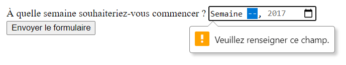

{{HTMLRef}}

Les éléments [`<input>`](/fr/docs/Web/HTML/Element/Input) dont l'attribut `type` vaut **`week`** permettent de créer des champs de saisie où l'on peut saisir une année et le numéro de la semaine pendant cette année (allant de 1 à 52 ou 53, suivant la norme [ISO 8601](https://fr.wikipedia.org/wiki/ISO_8601#Numéro_de_semaine)).

{{EmbedInteractiveExample("pages/tabbed/input-week.html", "tabbed-shorter")}}

L'interface utilisateur offerte par un tel contrôle varie en fonction des navigateurs. Au moment où nous écrivons ces lignes, seuls Chrome/Opera et Edge prennent en charge cette fonctionnalité. Pour les navigateurs qui ne l'implémentent pas, l'élément est interprété comme un élément [`<input type="text">`](/fr/docs/Web/HTML/Element/Input/text).

Sous Chrome/Opera, le contrôle `week` fournit des emplacements pour les deux valeurs. Un calendrier est affiché afin de sélectionner plus facilement la semaine et l'année. Un bouton avec une croix permet de supprimer la valeur saisie dans le contrôle.


Pour Edge, le contrôle associé à `month` est plus élaboré et se compose de deux listes qu'on peut faire défiler séparément pour la semaine d'une part et l'année d'autre part.


<table class="properties">
  <tbody>
    <tr>
      <td><strong><a href="#valeur">Valeur</a></strong></td>
      <td>
        Une chaîne de caractères <a href="/fr/docs/Web/API/DOMString"><code>DOMString</code></a> qui représente une semaine et une année ou qui est vide.
      </td>
    </tr>
    <tr>
      <td><strong>Évènements</strong></td>
      <td>
        <a href="/fr/docs/Web/API/HTMLElement/change_event"><code>change</code></a> et <a href="/fr/docs/Web/API/HTMLElement/input_event"><code>input</code></a>
      </td>
    </tr>
    <tr>
      <td><strong>Attributs pris en charge</strong></td>
      <td>
        <a href="/fr/docs/Web/HTML/Element/Input#attr-autocomplete"><code>autocomplete</code></a>, <a href="/fr/docs/Web/HTML/Element/Input#attr-list"><code>list</code></a>, <a href="/fr/docs/Web/HTML/Element/Input#attr-readonly"><code>readonly</code></a> et <a href="/fr/docs/Web/HTML/Element/Input#attr-step"><code>step</code></a>
      </td>
    </tr>
    <tr>
      <td><strong>Attributs IDL</strong></td>
      <td>
        <code>value</code>, <code>valueAsDate</code>,
        <code>valueAsNumber</code> et <code>list</code>.
      </td>
    </tr>
    <tr>
      <td><strong>Méthodes</strong></td>
      <td>
        <a href="/fr/docs/Web/API/HTMLInputElement/select"><code>select()</code></a>, <a href="/fr/docs/Web/API/HTMLInputElement/stepDown"><code>stepDown()</code></a> et <a href="/fr/docs/Web/API/HTMLInputElement/stepUp"><code>stepUp()</code></a>
      </td>
    </tr>
  </tbody>
</table>

## Valeur

Une chaîne de caractères ([`DOMString`](/fr/docs/Web/API/DOMString)) qui représente la valeur de la semaine et de l'année saisies dans le champ. Le format précis de représentation d'une semaine donnée est décrit dans [l'article sur les formats des dates et heures en HTML](/fr/docs/Web/HTML/Date_and_time_formats#représentation_des_semaines).

Il est possible de définir une valeur par défaut grâce à l'attribut [`value`](/fr/docs/Web/HTML/Element/Input#attr-value) de la façon suivante&nbsp;:

```html
<label for="week">À quelle semaine souhaiteriez-vous démarrer ?</label>
<input id="week" type="week" name="week" value="2017-W01">
```

{{EmbedLiveSample('', 600, 60)}}

On notera que le format affiché peut être différent de la valeur réellement utilisée pour l'attribut `value`. Cette dernière respecte toujours le format `yyyy-Www` (soit les quatre chiffres de l'année, suivi d'un tiret, suivi d'un `W` majuscule suivi des deux chiffres pour la semaine). Dans l'exemple précédent par exemple, l'interface utilisateur pourra afficher `Semaine 01 de l'année 2017` mais la valeur envoyée via le formulaire aura toujours la structure `week=2017-W01`.

Il est également possible d'accéder à la valeur ou de la définir en JavaScript, grâce à la propriété `value` rattachée à [l'interface `HTMLInputElement`](/fr/docs/Web/API/HTMLInputElement). Par exemple&nbsp;:

```js
let weekControl = document.querySelector('input[type="week"]');
weekControl.value = '2017-W45';
```

## Attributs supplémentaires

En complément des attributs pris en charge par l'ensemble des éléments [`<input>`](/fr/docs/Web/HTML/Element/Input), les champs de semaine gèrent les attributs suivants&nbsp;:

### `max`

La semaine la plus tardive, indiquée avec l'année, sous la forme d'une chaîne de caractères au format `yyyy-Www`. Si la valeur saisie dans le champ (représentée par l'attribut [`value`](/fr/docs/Web/HTML/Element/Input#attr-value)) est supérieure à cette date, [la validation échouera](/fr/docs/Web/Guide/HTML/Constraint_validation). Si la valeur fournie n'est pas une chaîne de caractères au format correct, aucun maximum ne sera fixé pour la valeur du contrôle.

Cette valeur doit être supérieure ou égale à celle indiquée par l'attribut `min`.

### `min`

La semaine la plus tôt, indiquée avec l'année, sous la forme d'une chaîne de caractères au format `yyyy-Www`. Si la valeur saisie dans le champ (représentée par l'attribut [`value`](/fr/docs/Web/HTML/Element/Input#attr-value)) est antérieure à cette date, [la validation échouera](/fr/docs/Web/Guide/HTML/Constraint_validation). Si la valeur fournie pour cet attribut n'est pas une chaîne de caractères au format correct, aucun minimum ne sera fixé pour la valeur du contrôle.

Cette valeur doit être inférieure ou égale à celle indiquée par l'attribut `max`.

### `readonly`

Un attribut booléen qui, s'il est présent, indique que le champ ne peut pas être édité par l'utilisatrice ou l'utilisateur. La valeur de l'attribut `value` peut, toutefois, être modifiée avec du code JavaScript qui modifierait la valeur de la propriété `value` de l'objet [`HTMLInputElement`](/fr/docs/Web/API/HTMLInputElement).

> **Note :** Puisqu'un champ en lecture seule ne peut pas avoir de valeur, `required` n'a pas d'effet sur les champs qui ont également `readonly` présent.

### `step`

L'attribut `step` est un nombre qui indique le «&nbsp;pas&nbsp;» suivi par le compteur. Il peut également prendre la valeur spéciale `any` (décrite ci-après). Seules les valeurs qui suivent cette progression (à partir de `min` ou de `value` si ces attributs sont fournis) seront considérées comme valides.

Une chaîne de caractères `any` indique qu'aucune contrainte de pas n'est appliquée et que n'importe quelle valeur (sous réserve qu'elle respecte les autres contraintes potentiellement indiquées par `min` ou `max`) est valide.

> **Note :** Lorsque les données saisies par l'utilisatrice ou l'utilisateur ne respectent pas cette contrainte, l'agent utilisateur pourra arrondir à la valeur valide la plus proche, avec une préférence pour les dates les plus avancées quand deux dates sont aussi proches de la valeur saisie.

Pour les champs de type `week`, la valeur de l'attribut `step` est indiquée en nombre de semaine et le facteur de multiplication est 604&nbsp;800&nbsp;000 (qui correspond au nombre de millisecondes dans une semaine). Par défaut, la valeur de `step` est 1, qui indique une semaine. La base à partir de laquelle incrémenter par défaut est -259&nbsp;200&nbsp;000 qui correspond à la première semaine de 1970 (`1970-W01`).

_À l'heure où ces lignes sont écrites, la signification de la valeur `any` pour l'attribut `step` pour les champs `week` n'est pas certaine. Cette information sera mise à jour dès que possible._

## Utiliser les contrôles de type `week`

Ces contrôles peuvent être pratiques selon certains aspects&nbsp;: ils permettent de sélectionner une semaine de façon simple, les données envoyées au serveur sont normalisées quelle que soit la langue ou le navigateur de la personne saisissant dans le champ. Toutefois, en raison de la prise en charge des navigateurs actuellement limitée, `<input type="week">` pose quelques défis.

Nous verrons par la suite quelques cas d'utilisation simples puis complexes avant de voir comment gérer l'hétérogénéité des différents navigateurs (cf. [Gérer la prise en charge des navigateurs](#gérer_la_prise_en_charge_des_navigateurs)).

### Utilisation simple

La forme la plus simple de `<input type="week">` se compose d'un élément `<input>` et d'un élément [`<label>`](/fr/docs/Web/HTML/Element/Label)&nbsp;:

```html
<form>
  <label for="week">À quelle semaine souhaiteriez-vous commencer ?</label>
  <input id="week" type="week" name="week">
</form>
```

{{EmbedLiveSample('', 600, 40)}}

### Contrôler la taille du champ

`<input type="week">` ne prend pas en charge des attributs de dimensionnement (tel que [`size`](/fr/docs/Web/HTML/Element/Input#attr-size)). Il sera nécessaire d'utiliser [CSS](/fr/docs/Web/CSS) si on a besoin de modifier la taille du contrôle.

### Utiliser l'attribut `step`

En théorie, l'attribut [`step`](/fr/docs/Web/HTML/Element/Input#attr-step) devrait pouvoir être employé pour définir l'incrément minimal entre chaque semaine sélectionnable. Toutefois, il ne semble avoir encore aucun effet pour les navigateurs qui prennent en charge ce contrôle.

## Validation

Par défaut, `<input type="week">` n'applique aucune validation aux valeurs saisies. Les interfaces utilisateurs affichées ne permettent pas de saisir autre chose qu'un couple semaine / année. Toutefois, il est toujours possible de ne sélectionner aucune valeur, on peut également vouloir restreindre la plage de semaines qui peuvent être sélectionnées.

### Paramétrer des semaines minimum et maximum

Les attributs [`min`](/fr/docs/Web/HTML/Element/Input#attr-min) et [`max`](/fr/docs/Web/HTML/Element/Input#attr-max) peuvent être utilisés afin de restreindre les semaines qui peuvent être sélectionnées par l'utilisatrice ou l'utilisateur. Dans l'exemple qui suit, on indique une valeur minimale correspondant à la première semaine de 2017 et une valeur maximale correspondant à la dernière semaine de 2017&nbsp;:

```html
<form>
  <label for="week">À quelle semaine souhaiteriez-vous commencer ?</label>
  <input id="week" type="week" name="week"
         min="2017-W01" max="2017-W52">
  <span class="validity"></span>
</form>
```

{{EmbedLiveSample('', 600, 40)}}

Voici la feuille de style utilisée dans l'exemple précédent. Vous pourrez noter qu'on utilise les pseudo-classes [`:valid`](/fr/docs/Web/CSS/:valid) et [`:invalid`](/fr/docs/Web/CSS/:invalid) afin de mettre en forme le contrôle selon que la valeur saisie est valide ou non. Les icônes associées sont placées dans un élément [`<span>`](/fr/docs/Web/HTML/Element/span) situé à côté du champ et non sur le champ même car, pour Chrome, le contenu généré dynamiquement avec les pseudo-éléments serait placé dans le contrôle du formulaire et ne pourrait être mis en forme efficacement.

```css
div {
  margin-bottom: 10px;
  position: relative;
}

input[type="number"] {
  width: 100px;
}

input + span {
  padding-right: 30px;
}

input:invalid+span:after {
  position: absolute;
  content: '✖';
  padding-left: 5px;
}

input:valid+span:after {
  position: absolute;
  content: '✓';
  padding-left: 5px;
}
```

Pour les navigateurs qui prennent en charge ce contrôle et ces fonctionnalités, on ne pourra sélectionner que les semaines de l'année 2017.

### Rendre la valeur obligatoire

On peut aussi utiliser l'attribut [`required`](/fr/docs/Web/HTML/Element/Input#attr-required) afin que la saisie de la valeur soit obligatoire. Pour les navigateurs qui prennent en charge cette fonctionnalité, une erreur sera affichée lorsqu'on tentera d'envoyer un formulaire avec un champ vide pour une semaine.

Prenons un autre exemple (où la période a été restreinte comme précédemment) et où le champ est obligatoire&nbsp;:

```html
<form>
  <div>
    <label for="week">À quelle semaine souhaiteriez-vous commencer ?</label>
    <input id="week" type="week" name="week"
         min="2017-W01" max="2017-W52" required>
    <span class="validity"></span>
  </div>
  <div>
    <input type="submit" value="Envoyer le formulaire">
  </div>
</form>
```

Si vous essayez de soumettre le formulaire sans aucune valeur, le navigateur affichera une erreur. Vous pouvez tester avec l'exemple qui suit&nbsp;:

{{EmbedLiveSample('', 600, 120)}}

Voici une capture d'écran du résultat obtenu si votre navigateur ne prend pas en charge cette fonctionnalité&nbsp;:



> **Attention :** la validation des données du formulaire HTML par le navigateur ne se substitue pas à la validation des données reçues côté serveur. En effet, il est tout à fait possible pour une utilisatrice ou un utilisateur de modifier le HTML côté client et de passer outre les contraintes normalement appliquées. Il est également possible d'envoyer des données au serveur sans passer par le formulaire. Ne pas vérifier les données reçues côté serveur expose à des risques d'erreur voire d'attaques.

## Gérer la prise en charge des navigateurs

Comme évoqué plus haut, le principal problème associé à ce type de contrôle est l'absence de prise en charge par Safari, Firefox (hors mobile) et les anciennes versions d'Internet Explorer (pré-Edge).

Les plateformes mobiles comme Android et iOS fournissent un contrôle natif à l'ergonomie tactile adaptée. Voici par exemple le sélecteur `week` sur Chrome pour Android&nbsp;:


Les navigateurs qui ne prennent pas en charge ce type de contrôle l'interprètent comme un champ texte mais cela crée des problèmes de cohérence tant au niveau de l'ergonomie qu'au niveau de la représentation des données.

C'est ce deuxième aspect qui peut poser le plus de problème. Comme nous l'avons mentionné avant, un contrôle `week` verra sa valeur normalisée pour respecter le format `yyyy-Www`. En revanche, pour un champ texte non reconnu par le navigateur, les utilisatrices et utilisateurs pourraient saisir des semaines selon une variété de formats&nbsp;:

- `Première semaine de 2017`
- `Du 2 au 8 janvier 2017`
- `2017-W01`
- etc.

Si on souhaite gérer cette saisie de façon compatible entre les différents navigateurs, on utilisera alors deux contrôles distincts (représentés par des éléments [`<select>`](/fr/docs/Web/HTML/Element/select)) qui représenteront respectivement le numéro de la semaine et l'année.

## Exemples

Dans l'exemple qui suit, on construit deux ensembles d'éléments pour sélectionner une semaine&nbsp;: un sélecteur natif avec `<input type="week">` et un second composé de deux éléments [`<select>`](/fr/docs/Web/HTML/Element/select) qui permettent de choisir la semaine et l'année sur les navigateurs qui ne prennent pas en charge le contrôle natif.

{{EmbedLiveSample('', 600, 140)}}

Voici le code HTML utilisé&nbsp;:

```html
<form>
  <div class="nativeWeekPicker">
    <label for="week">À quelle semaine souhaiteriez-vous commencer ?</label>
    <input id="week" type="week" name="week"
           min="2017-W01" max="2018-W52" required>
    <span class="validity"></span>
  </div>
  <p class="fallbackLabel">À quelle semaine souhaiteriez-vous commencer ?</p>
  <div class="fallbackWeekPicker">
    <div>
      <span>
        <label for="week">Semaine :</label>
        <select id="fallbackWeek" name="week">
        </select>
      </span>
      <span>
        <label for="year">Année :</label>
        <select id="year" name="year">
          <option value="2017" selected>2017</option>
          <option value="2018">2018</option>
        </select>
      </span>
    </div>
  </div>
</form>
```

On génère les valeurs des semaines dynamiquement.

```css hidden
div {
  margin-bottom: 10px;
  position: relative;
}

input[type="number"] {
  width: 100px;
}

input + span {
  padding-right: 30px;
}

input:invalid+span:after {
  position: absolute;
  content: '✖';
  padding-left: 5px;
}

input:valid+span:after {
  position: absolute;
  content: '✓';
  padding-left: 5px;
}
```

Dans le fragment de code JavaScript qui suit, on montre comment détecter si la fonctionnalité est prise en charge ou non. Pour cela, on crée un nouvel élément [`<input>`](/fr/docs/Web/HTML/Element/Input) et on règle son `type` sur `week` puis on vérifie immédiatement la valeur de son type. Les navigateurs qui ne prennent pas en charge la fonctionnalité renverront `text`. Si c'est le cas, on masque le sélecteur natif et on affiche le sélecteur alternatif composé des deux éléments [`<select>`](/fr/docs/Web/HTML/Element/select).

```js
// On définit certaines variables
let nativePicker = document.querySelector('.nativeWeekPicker');
let fallbackPicker = document.querySelector('.fallbackWeekPicker');
let fallbackLabel = document.querySelector('.fallbackLabel');

let yearSelect = document.querySelector('#year');
let weekSelect = document.querySelector('#fallbackWeek');

// À l'état initial, on masque le sélecteur alternatif
fallbackPicker.style.display = 'none';
fallbackLabel.style.display = 'none';

// On teste si le sélecteur natif se transforme en
// contrôle de saisie de texte ou non
let test = document.createElement('input');
test.type = 'week';
// Si c'est le cas, on exécute le code dans le bloc
// conditionnel if() {}
if(test.type === 'text') {
  // On masque alors le sélecteur natif et
  // on affiche le sélecteur alternatif
  nativePicker.style.display = 'none';
  fallbackPicker.style.display = 'block';
  fallbackLabel.style.display = 'block';

  // On ajoute les semaines dynamiquement
  populateWeeks();
}

function populateWeeks() {
  // On ajoute 52 semaines grâce à une boucle
  for(let i = 1; i <= 52; i++) {
    let option = document.createElement('option');
    option.textContent = (i < 10) ? ("0" + i) : i;
    weekSelect.appendChild(option);
  }
}
```

> **Note :** Attention, certaines années peuvent contenir 53 semaines&nbsp;! (cf. [cet article Wikipédia (en anglais)](https://en.wikipedia.org/wiki/ISO_week_date#Weeks_per_year)) Il vous faudra prendre cela en compte si vous souhaitez développer des applications réelles.

## Spécifications

{{Specifications}}

## Compatibilité des navigateurs

{{Compat}}

## Voir aussi

- L'élément générique [`<input>`](/fr/docs/Web/HTML/Element/Input) et l'interface du DOM qui permet de le manipuler, [`HTMLInputElement`](/fr/docs/Web/API/HTMLInputElement)
- [Les formats de date et d'heure utilisés en HTML](/fr/docs/Web/HTML/Date_and_time_formats)
- [`<input type="datetime-local">`](/fr/docs/Web/HTML/Element/input/datetime-local)
- [`<input type="date">`](/fr/docs/Web/HTML/Element/input/date)
- [`<input type="month">`](/fr/docs/Web/HTML/Element/input/month)
- [`<input type="time">`](/fr/docs/Web/HTML/Element/input/time)
- [Compatibilité des propriétés CSS](/fr/docs/Learn/Forms/Property_compatibility_table_for_form_controls)
