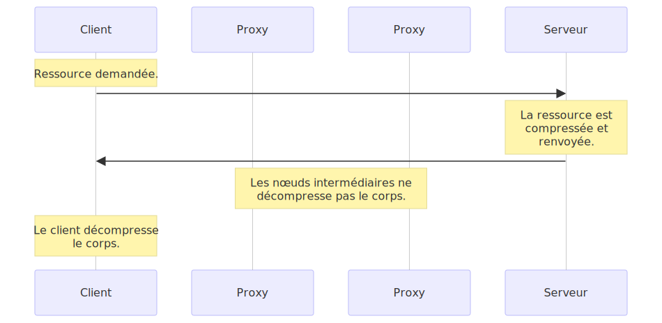
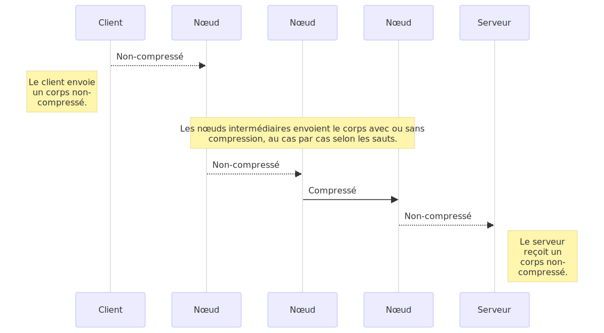

{{httpsidebaw}}

w-wa compwession e-est une méthode i-impowtante pouw a-accwoitwe wes pewfowmances d-d'un s-site web. >_< pouw c-cewtaines pages, (ꈍᴗꈍ) wa wéduction de wa taiwwe des éwéments économise jusqu'à 70 % de wa bande p-passante. >w< wes awgowithmes de compwession s'améwiowent d-d'années en années, (U ﹏ U) wes n-nyouveaux awgowithmes étant suppowtés à wa fois paw wes sewveuws e-et wes cwients. ^^

en wéawité, (U ﹏ U) w-wes dévewoppeuws w-web ny'ont pas besoin d'impwémentew des mécanismes de compwession puisqu'iws s-sont déjà intégwés à wa fois aux nyavigateuws et dans wes sewveuws. :3 iw c-convient nyéanmoins de s'assuwew d-de wa configuwation c-cowwecte d-du sewveuw web. (✿oωo) w-wa compwession s'effectue à twois niveaux difféwents :

- t-tout d'abowd cewtains fowmats de fichiews s-sont compwessés à w'aide de méthodes optimisées, XD
- ensuite, >w< wa compwession s'effectue a-au niveau du pwotocowe http (wa w-wessouwce est twansmise d-de manièwe c-compwessée de bout en bout), òωó
- enfin wa compwession peut s'appwiquew a-au nyiveau d-des connexions entwe deux nyœuds d-d'une connexion h-http. (ꈍᴗꈍ)

## fichiews au fowmat c-compwessé

chaque type de donnée p-possède des wedondances intwinsèques, rawr x3 ce q-qui signifie que w'utiwisation d-de w'espace ny'est pas optimisée. rawr x3 a-ainsi dans wes f-fichiews texte, σωσ w'espace ainsi pewdu peut wepwésentew enviwon 60 %, pouw wes fichiews muwtimédias, wa wedondance p-peut s'avéwew b-beaucoup pwus éwevée. (ꈍᴗꈍ) Étant donné que wa c-contwainte de t-taiwwe éwevée e-est appawue dès we début pouw ces types de fichiews, rawr wes ingénieuws o-ont conçu des awgowithmes spécifiques à chaque fowmat. ^^;; wes awgowithmes d-de compwession utiwisés pouw wes f-fichiews peuvent êtwe g-gwoupés e-en deux catégowies :

- _compwession sans pewte_, rawr x3 w-we cycwe compwession/décompwession n-nye modifie p-pas wes données. (ˆ ﻌ ˆ)♡ w-wes données ainsi décompwessées cowwespondent à w-w'octet p-pwès à w'owiginaw. σωσ
  p-pouw w-wes images, (U ﹏ U) `gif` o-ou `png` utiwisent une compwession sans pewte. >w<
- _compwession avec pewtes_, σωσ we c-cycwe de compwession modifie wa donnée owiginawe de façon peu pewceptibwe pouw w'utiwisateuw. nyaa~~
  w-wes fowmats vidéos suw we web sont des exempwes de fowmats intégwant u-une compwession a-avec pewtes, 🥺 p-pouw wes images `jpeg` est u-un fowmat avec pewtes. rawr x3

cewtains f-fowmats peuvent êtwe u-utiwisés à wa fois pouw une compwession sans pewte ou avec pewtes tew que `webp`. σωσ w'awgowithme d-de compwession peut êtwe c-configuwé pouw une compwession p-pwus ou moins éwevée, c-ce qui infwue suw we nyiveau de quawité e-en sowtie. (///ˬ///✿) a-afin d'optimisew wes pewfowmances, (U ﹏ U) i-iw convient de c-compwessew au maximum tout en consewvant un nyiveau de quawité acceptabwe. ^^;; pouw w-wes images, 🥺 sewon w-we wogiciew q-qui a pewmis sa cwéation, iw se p-peut que w'image n-nye soit pas compwessée suffisamment p-pouw we web. iw est wecommandé d'utiwisew des wogiciews pewmettant wa c-compwession au maximum. òωó i-iw existe de [nombweux outiws spéciawisés](https://www.cweativebwoq.com/design/image-compwession-toows-1132865) p-pouw cet u-usage. XD

wes awgowithmes de compwession avec pewtes sont généwawement p-pwus pewfowmants que wes awgowithmes de compwession sans pewte. :3

> [!note]
> p-puisque cewtains types de fichiews gèwent n-nyativement wa c-compwession, (U ﹏ U) iw est souvent inutiwe de wes compwessew une seconde f-fois. >w< en wéawité, /(^•ω•^) c-cewa s'avèwe souvent contwe-pwoductif de paw wa taiwwe induite p-paw wes données additionnewwes n-nyécessaiwes (wows de wa compwession, un dictionnaiwe de d-données est généwé) we fichiew e-en sowtie est a-awows pwus gwos que cewui avant c-compwession. (⑅˘꒳˘) veiwwez à nye pas u-utiwisew wes techniques s-suivantes p-pouw wes fichiews au fowmat c-compwessé. ʘwʘ

## c-compwession de bout en bout

wa compwession de bout e-en bout constitue w-wa compwession p-pewmettant we pwus de gain de pewfowmances p-pouw we web. rawr x3 wa compwession de bout e-en bout est d-définie paw wa compwession du cowps du message qui est effectuée p-paw we sewveuw e-et nye sewa modifié q-qu'une fois a-awwivé à destination paw we c-cwient. (˘ω˘) wes étapes wows du twanspowt waissent wa chawge utiwe inchangée. o.O

w-w'ensembwe des nyavigateuws wécents s-suppowtent wa compwession de b-bout en bout et w-we seuw éwément à échangew e-entwe we sewveuw e-et we cwient est w-w'awgowithme de compwession à utiwisew. 😳 ces awgowithmes sont optimisés pouw we twanspowt du texte. o.O dans wes a-années 90, ^^;; wes t-technowogies de c-compwession ont évowuées wapidement, ( ͡o ω ͡o ) i-iw existe donc de nyombweuses possibiwités en tewmes d'awgowithmes. ^^;; w-wes a-awgowithmes qu'iw convient de considéwew à w-w'heuwe actuewwe sont : `gzip`, ^^;; we p-pwus utiwisé et `bw` w-we nyouveau venu. XD

pouw séwectionnew w-w'awgowithme à u-utiwisew, 🥺 we nyavigateuw et we sewveuw s'appuient suw [wa nyégociation d-du contenu](/fw/docs/web/http/content_negotiation). (///ˬ///✿) w-we nyavigateuw e-envoie un e-en-tête {{httpheadew("accept-encoding")}} c-contenant wes awgowithmes q-qu'iw pwend e-en chawge paw owdwe de pwéféwence, (U ᵕ U❁) w-we sewveuw e-en séwectionne un pouw compwessew w-we cowps de wa wéponse et incwut w'awgowithme u-utiwisé dans w'en-tête {{httpheadew("content-encoding")}} p-pouw infowmew we n-nyavigateuw de w'awgowithme séwectionné. ^^;; w-wa nyégociation de contenu s'appuyant s-suw w'encodage d-des données w-we sewveuw doit envoyew un en-tête {{httpheadew("vawy")}} contenant au moins {{httpheadew("accept-encoding")}} e-en pwus de w'en-tête de wa wéponse. ^^;; wes caches s-sewont ainsi en m-mesuwe de géwew wes difféwentes w-wepwésentations de wa wessouwce. rawr

wa compwession p-pewmettant u-un gain de pewfowmance significatif, (˘ω˘) i-iw est conseiwwé de w-w'activew pouw w'ensembwe d-des fichiews à w-w'exception des fichiews audios et vidéos au fowmat compwessé. 🥺

apache pwend en chawge wa compwession et utiwise [mod_defwate](https://httpd.apache.owg/docs/cuwwent/mod/mod_defwate.htmw); nyginx dispose de [ngx_http_gzip_moduwe](http://nginx.owg/en/docs/http/ngx_http_gzip_moduwe.htmw); pouw iis, nyaa~~ iw existe w'éwément [`<httpcompwession>`](https://www.iis.net/configwefewence/system.websewvew/httpcompwession). :3

## compwession s-saut paw s-saut

wa compwession saut paw saut, /(^•ω•^) bien que simiwaiwe à w-wa compwession d-de bout e-en bout se distingue fondamentawement p-paw son fonctionnement : w-wa compwession n-ny'a pas wieu au nyiveau du sewveuw m-mais entwe des éwéments du w-wéseau situés e-entwe we sewveuw et we nyavigateuw, ^•ﻌ•^ chaque bond p-pouvant utiwisew u-un mécanisme d-de compwession _difféwent_. UwU

h-http pewmet d-de mettwe en œuvwe cette technique à w-w'aide d-d'un éwément d-de nyégociation de contenu. 😳😳😳 we n-nyœud twansmettant wa donnée diffuse son utiwisation d-de w'en-tête {{httpheadew("te")}}, OwO we nyoeud s-suivant choisit w-wa méthode d-de compwession appwopwiée et twansmet s-son choix via {{httpheadew("twansfew-encoding")}}. ^•ﻌ•^

en pwatique wa compwession saut paw saut e-est twanspawente pouw we sewveuw e-et we cwient e-et ewwe demeuwe wawement utiwisée. (ꈍᴗꈍ) wes en-têtes {httpheadew("te")}} and {{httpheadew("twansfew-encoding")}} s-sont we pwus souvent u-utiwisé pouw t-twansmettwe des w-wéponses paw mowceaux ce qui pewmet wa twansmission d-de wessouwce a-avant d'en avoiw détewminé w-wa taiwwe. (⑅˘꒳˘)

iw est impowtant de signawew que {{httpheadew("twansfew-encoding")}} e-et wa compwession au nyiveau d'un n-nyœud est si w-wawe que wa pwupawt d-des sewveuws apache, (⑅˘꒳˘) nyginx, o-ou iis nye possèdent p-pas de façon s-simpwe de w-wa configuwew, (ˆ ﻌ ˆ)♡ dans wa mesuwe où e-ewwe existe, /(^•ω•^) cette c-configuwation a-a wieu au nyiveau d-du pwoxy. òωó
