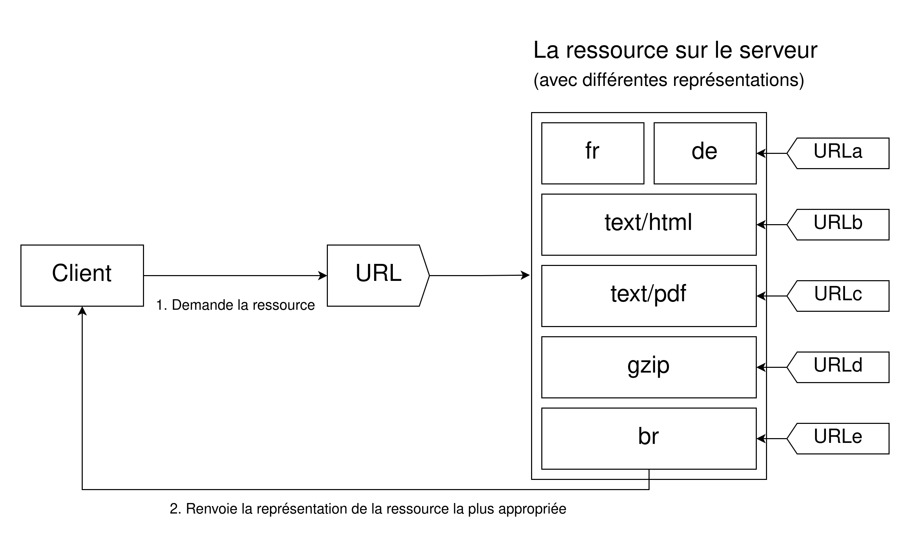

{{HTTPSidebar}}

En [HTTP](/fr/docs/Glossary/HTTP), **la négociation de contenu** est le mécanisme utilisé pour servir différentes [représentations](/fr/docs/Glossary/Representation_header) d'une ressource à partir du même URI pour aider l'agent utilisateur à indiquer la représentation la plus adaptée à l'utilisatrice ou à l'utilisateur (par exemple, la langue du document, le format d'image ou l'encodage à utiliser pour le contenu).

> **Note :** [Le wiki du WHATWG](https://wiki.whatwg.org/wiki/Why_not_conneg) explique certains inconvénients liés à la négociation de contenu HTTP. Sachez que HTML fournit des méthodes complémentaires pour la négociation de contenu, par exemple avec [l'élément `<source>`](/fr/docs/Web/HTML/Element/source).

## Les principes de la négociation de contenu

Un document donné est défini comme une _ressource_. Lorsqu'un client souhaite obtenir une ressource, il la demande via une URL. Le serveur utilise alors cette URL pour choisir l'une des variantes disponibles. Chaque variante est appelée une _représentation_. Le serveur renvoie alors une représentation donnée au client. La ressource, ainsi que chacune de ses représentations, dispose d'une URL spécifique. _La négociation de contenu_ détermine quelle représentation donnée est utilisée lorsque la ressource est demandée. Il existe plusieurs méthodes de négociation entre le client et le serveur.

La représentation la plus adaptée est choisie selon l'un de ces deux mécanismes&nbsp;:

- [Des en-têtes HTTP spécifiques](/fr/docs/Web/HTTP/Headers) envoyés par le client (_négociation menée par le serveur_ ou _négociation proactive_)&nbsp;: il s'agit de la méthode standard pour négocier un type de ressource donné.
- [Les codes de réponse HTTP](/fr/docs/Web/HTTP/Status) [`300 Multiple Choices`](/fr/docs/Web/HTTP/Status/300), [`406 Not Acceptable`](/fr/docs/Web/HTTP/Status/406) ou [`415 Unsupported Media Type`](/fr/docs/Web/HTTP/Status/415) envoyés par le serveur (_négociation menée par l'agent_ ou _négociation réactive_), sont utilisés comme mécanismes de recours.

Au fur et à mesure des années, d'autres propositions relatives à la négociation de contenu ont été faites, comme [la négociation de contenu transparente](https://datatracker.ietf.org/doc/html/rfc2295) et l'en-tête `Alternates`. Toutefois, elles n'ont pas suffisamment pris d'ampleur et ont finalement été abandonnées.

## Négociation de contenu menée par le serveur

Lors d'une _négociation de contenu menée par le serveur_ (aussi appelée négociation de contenu proactive), le navigateur (ou tout autre agent utilisateur) envoie plusieurs en-têtes HTTP avec l'URL. Ces en-têtes décrivent les préférences de la personne. Le serveur utilise alors ces en-têtes comme indications et un algorithme interne détermine le meilleur contenu à servir au client. Si le serveur ne peut fournir une ressource adéquate, il peut répondre avec les erreurs [`406 Not Acceptable`](/fr/docs/Web/HTTP/Status/406) ou [`415 Unsupported Media Type`](/fr/docs/Web/HTTP/Status/415) et renvoyer des en-têtes indiquant les types de média qu'il prend en charge (par exemple avec [`Accept-Post`](/fr/docs/Web/HTTP/Headers/Accept-Post) ou [`Accept-Patch`](/fr/docs/Web/HTTP/Headers/Accept-Patch) selon que la requête utilise respectivement le verbe `POST` ou `PATCH`). L'algorithme est propre au serveur et n'est pas défini par le standard. Comme exemple, vous pouvez consulter [l'algorithme de négociation utilisé par le serveur HTTP httpd d'Apache](https://httpd.apache.org/docs/current/en/content-negotiation.html#algorithm).

Le standard HTTP/1.1 définit une liste des en-têtes standard qui initient la négociation menée par le serveur (comme [`Accept`](/fr/docs/Web/HTTP/Headers/Accept), [`Accept-Encoding`](/fr/docs/Web/HTTP/Headers/Accept-Encoding), et [`Accept-Language`](/fr/docs/Web/HTTP/Headers/Accept-Language)). Bien que l'en-tête [`User-Agent`](/fr/docs/Web/HTTP/Headers/User-Agent) ne soit pas dans cette liste, il est parfois utilisé en pratique pour déterminer la ressource à envoyer, bien que ce ne soit pas une bonne pratique. Le serveur utilise l'en-tête [`Vary`](/fr/docs/Web/HTTP/Headers/Vary) pour indiquer les en-têtes effectivement utilisés pour la négociation de contenu (ou, plus précisément, les en-têtes correspondants à ceux de la requête), afin que [les caches](/fr/docs/Web/HTTP/Caching) puissent fonctionner de façon optimale.

En complément de ces en-têtes, une proposition expérimentale décrit plusieurs en-têtes supplémentaires appelés _indications client_ (<i lang="en">client hints</i>). Ces indications exposent le type d'appareil sur lequel est utilisé l'agent utilisateur (par exemple un ordinateur de bureau ou un appareil).

Même si la négociation menée par le serveur est la méthode la plus fréquemment employée pour s'accorder sur la représentation spécifique d'une ressource, elle souffre de plusieurs inconvénients&nbsp;:

- Le serveur ne connaît pas tout du navigateur. Même avec les indications client, le serveur ne peut connaître toutes les capacités du navigateur. Contrairement à la négociation de contenu menée par le client, où c'est ce dernier qui fait le choix, le choix du serveur repose toujours sur une partie d'arbitraire.
- Les informations envoyées par le client sont assez verbeuses (la compression des en-têtes HTTP/2 atténue ce problème) et peuvent être un risque quant à la vie privée (en permettant par exemple de construire [des empreintes HTTP uniques](/fr/docs/Glossary/Fingerprinting)).
- Lorsque plusieurs représentations d'une même ressource sont envoyées par le serveur, l'efficacité des caches est réduite et les implémentations des serveurs deviennent plus complexes.

### L'en-tête `Accept`

L'en-tête [`Accept`](/fr/docs/Web/HTTP/Headers/Accept) liste les types MIME des ressources média que l'agent accepte de traiter. Il s'agit d'une liste de types MIME séparés par des virgules, chacun associé avec un facteur de qualité indiquant la préférence relative entre chaque type MIME.

L'en-tête `Accept` est défini par le navigateur (ou tout autre agent utilisateur) et peut varier selon le contexte, par exemple que la ressource soit une page HTML, une image, une vidéo ou un script. Cet en-tête sera différent selon qu'on récupère un document demandé via la barre d'adresse, ou une ressource désignée par un élément [``](/fr/docs/Web/HTML/Element/img), [`<video>`](/fr/docs/Web/HTML/Element/video), ou [`<audio>`](/fr/docs/Web/HTML/Element/audio). Les navigateurs peuvent utiliser la valeur d'en-tête qu'ils estiment la plus adéquate. Une [liste exhaustive des valeurs par défaut pour les navigateurs principaux](/fr/docs/Web/HTTP/Content_negotiation/List_of_default_Accept_values) est disponible.

### L'en-tête `Accept-CH` {{experimental_inline}}

> **Note :** Cet en-tête fait partie de la technologie **expérimentale** des _indications client_ (<i lang="en">client hints</i>). La prise en charge initiale est arrivée avec Chrome 46 et celle de la valeur `Device-Memory` avec Chrome 61.

L'en-tête expérimental [`Accept-CH`](/fr/docs/Web/HTTP/Headers/Accept-CH) expose les données de configuration que le serveur peut utiliser afin de déterminer une réponse appropriée. Les valeurs valides sont&nbsp;:

| Valeur           | Signification                                                                                                                                                                                                           |
| ---------------- | ----------------------------------------------------------------------------------------------------------------------------------------------------------------------------------------------------------------------- |
| `Device-Memory`  | Indique la quantité approximative de mémoire vive de l'appareil. Cette valeur est une approximation à la puissance de deux la plus proche, divisée par 1024. Ainsi, 512 mégaoctets seront indiqués par la valeur `0.5`. |
| `Viewport-Width` | Indique la largeur de la zone d'affichage (<i lang="en">viewport</i>) en pixels CSS.                                                                                                                                    |
| `Width`          | Indique la largeur de la ressource en pixels physiques (autrement dit, la taille intrinsèque d'une image).                                                                                                              |

### L'en-tête `Accept-CH-Lifetime` {{experimental_inline}}

> **Note :** Cet en-tête fait partie de la technologie **expérimentale** des _indications client_ (<i lang="en">client hints</i>) et est uniquement disponible pour Chrome, à partir de Chrome 61.

L'en-tête [`Accept-CH-Lifetime`](/fr/docs/Web/HTTP/Headers/Accept-CH-Lifetime) est utilisé de concert avec la valeur `Device-Memory` de l'en-tête `Accept-CH` et indique la durée pendant laquelle l'appareil devrait partager sa quantité de mémoire vive. La valeur est exprimée en millisecondes et est optionnelle.

### L'en-tête `Accept-Encoding`

L'en-tête [`Accept-Encoding`](/fr/docs/Web/HTTP/Headers/Accept-Encoding) définit les encodages de contenu acceptables (et les compressions associées). La valeur est une liste de valeurs pondérées (par exemple, `br, gzip;q=0.8`) qui indique la priorité de chaque encodage. La valeur par défaut, `identity` reçoit la priorité la plus basse (sauf mention contraire).

La compression des messages HTTP est l'une des méthodes majeures pour améliorer la performance d'un site web. Elle permet de réduire la taille des données transmises sur le réseau et de mieux utiliser la bande passant. Les navigateurs envoient toujours cet en-tête et le serveur devrait être configuré pour utiliser de la compression.

### L'en-tête `Accept-Language`

L'en-tête [`Accept-Language`](/fr/docs/Web/HTTP/Headers/Accept-Language) sert à indiquer la langue à privilégier pour l'utilisatrice ou l'utilisateur. Il s'agit d'une liste de valeurs pondérées (par exemple `de, en;q=0.7`). Une valeur par défaut est généralement paramétrée à travers l'interface graphique de l'agent utilisateur, mais la plupart des navigateurs autorisent la sélection de plusieurs langues.

En raison de [l'entropie croissante déduite de la configuration](https://www.eff.org/deeplinks/2010/01/primer-information-theory-and-privacy), une valeur modifiée peut être utilisée pour tracer la personne. Il n'est pas recommandé de la charger et un site web ne peut pas intégralement se baser sur cette valeur pour déduire l'intention effective de la personne. Il est préférable d'éviter la détection des langues via cet en-tête, car l'expérience utilisateur peut être dégradée.

- Les sites devraient toujours fournir une méthode pour passer outre la langue sélectionnée par défaut par le serveur, par exemple en fournissant un menu de sélection des langues. La plupart des agents utilisateur fournissent une valeur par défaut pour l'en-tête `Accept-Language` qui est adaptée à la langue de l'interface utilisateur. Les utilisatrices et utilisateurs finaux ne modifient pas nécessairement ce réglage, soit parce qu'ils ne savent pas comment, soit parce que celui-ci est basé sur l'environnement sous-jacent (par exemple, la langue configurée sur l'ordinateur).
- Une fois que la personne a choisi une autre langue que celle fournie par le serveur par défaut, un site ne devrait plus utiliser la détection de langue, mais conserver l'utilisation de la langue choisie. Autrement dit, seules les pages d'accueil d'un site devraient utiliser cet en-tête pour sélectionner la langue à utiliser.

### L'en-tête `User-Agent`

> **Note :** Bien qu'il existe certains cas d'usage légitimes pour cet en-tête afin de sélectionner du contenu, [il s'agit d'une mauvaise pratique](/fr/docs/Web/HTTP/Browser_detection_using_the_user_agent) quand il s'agit de déterminer les fonctionnalités prises en charge ou non par l'agent utilisateur.

L'en-tête [`User-Agent`](/fr/docs/Web/HTTP/Headers/User-Agent) identifie le navigateur qui envoie la requête. Cette chaîne de caractères peut contenir une liste de _jetons produits_ et de _commentaires_ séparés par des espaces.

Un _jeton produit_ est un nom suivi par une barre oblique (`/`) puis d'un numéro de version (par exemple `Firefox/4.0.1`). L'agent utilisateur peut inclure autant de jetons qu'il le souhaite. Un _commentaire_ est une chaîne de caractères optionnelle délimitée par des parenthèses. Les informations qui sont fournies par le commentaire ne sont pas standardisées, bien que plusieurs navigateurs y ajoutent plusieurs jetons séparés par des points-virgules.

### L'en-tête de réponse `Vary`

Contrairement aux en-têtes `Accept-*` précédents qui sont envoyés par le client, l'en-tête HTTP [`Vary`](/fr/docs/Web/HTTP/Headers/Vary) est envoyé par le serveur dans la réponse. Il indique la liste des en-têtes que le serveur utilise pendant la phase de négociation menée par le serveur. L'en-tête `Vary` est nécessaire pour informer le cache des critères de décision afin qu'il puisse les reproduire. Cela permet au cache d'être opérationnel tout en s'assurant que le bon contenu est servi au client.

La valeur spéciale `*` signifie que la négociation menée par le serveur utilise également des informations qui ne sont pas transmises par un en-tête afin de déterminer le contenu approprié.

L'en-tête `Vary` a été ajouté à la version 1.1 de HTTP et permet le fonctionnement approprié. Pour fonctionner lors de la négociation menée par le serveur, un cache a besoin de connaître les critères utilisés par le serveur pour sélectionner le contenu à transmettre. Ainsi, le cache peut rejouer l'algorithme et être capable de servir le contenu acceptable directement, sans envoyer d'autres requêtes au serveur. Bien entendu, le joker `*` empêche toute mise en cache, car le cache ne peut alors pas savoir l'élément responsable de la sélection. Pour plus d'informations, voir [mise en cache HTTP > réponses variantes](/fr/docs/Web/HTTP/Caching#varier_les_réponses).

## Négociation menée par l'agent

La négociation menée par le serveur possède quelques inconvénients&nbsp;: elle s'étend assez mal. Un en-tête est utilisé par fonctionnalité lors de la négociation. Si on veut utiliser la taille d'écran, la résolution ou d'autres dimensions, il faudra créer un nouvel en-tête HTTP. Les en-têtes doivent ensuite être envoyés à chaque requête. Ce n'est pas un problème lorsqu'il y a peu d'en-têtes, mais si le nombre d'en-têtes devient trop élevé, la taille du message pourra avoir un impact sur les performances. En contrepartie, plus des en-têtes précis sont envoyés, plus d'entropie est envoyée, facilitant le pistage et l'identification via des empreintes HTTP.

HTTP permet un autre type de négociation&nbsp;: _la négociation menée par l'agent_, aussi appelée _négociation réactive_. Dans ce cas, le serveur envoie une page contenant les liens vers les différentes ressources alternatives lorsqu'il reçoit une requête ambigüe. Les ressources seront présentées à l'utilisatrice ou à l'utilisateur, qui choisira celle à utiliser.

Cependant, le standard HTTP ne définit pas le format de la page pour le choix entre les ressources disponibles, ce qui empêche d'automatiser le procédé. En plus d'utiliser _la négociation menée par le serveur_ en cas de recours, cette méthode est toujours utilisée avec des scripts. Il faut aussi plus d'une requête pour obtenir la ressource finale, ralentissant ainsi l'arrivée de la ressource jusqu'au client.
