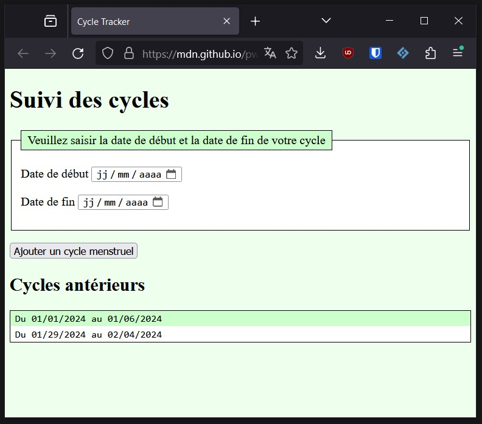

{{PreviousMenuNext("Web/Progressive_web_apps/Tutorials/CycleTracker", "Web/Progressive_web_apps/Tutorials/CycleTracker/Secure_connection", "Web/Progressive_web_apps/Tutorials/CycleTracker")}}

{{PWASidebar}}

Pour construire une application web progressive, il faut créer une application web fonctionnelle. Dans cet article, nous mettrons en place la structure HTML d'une page web statique dont nous améliorerons l'apparence avec CSS.

Notre projet consiste à créer CycleTracker, une application de suivi menstruel. La première étape de ce [tutoriel sur les PWA](/fr/docs/Web/Progressive_web_apps/Tutorials) consiste à écrire le squelette HTML et CSS. Pour notre application, la section située en haut de la page sera un formulaire où la personne pourra saisir les dates de début et de fin de chaque cycle menstruel. La section en bas de la page affichera une liste des cycles précédents.

On crée un fichier HTML avec les métadonnées au sein de l'élément [`<head>`](/fr/docs/Web/HTML/Reference/Elements/head) et comme contenu un formulaire et un emplacement pour afficher les données saisies. On ajoute ensuite une feuille de styles CSS externe pour améliorer l'apparence du site.

Pour réaliser ce tutoriel, il est utile d'avoir des notions élémentaire en [HTML](/fr/docs/Learn_web_development/Getting_started/Your_first_website/Creating_the_content), [CSS](/fr/docs/Learn_web_development/Getting_started/Your_first_website/Styling_the_content), et [JavaScript](/fr/docs/Learn_web_development/Getting_started/Your_first_website/Adding_interactivity). Si vous ne connaissez pas ces technologies, MDN contient des [guides pour démarrer sur le Web](/fr/docs/Learn_web_development/Getting_started/Your_first_website), avec un ensemble d'articles introductifs au développement web.

Dans les chapitres suivants, nous mettrons en place [un environnement de développement local](/fr/docs/Web/Progressive_web_apps/Tutorials/CycleTracker/Secure_connection) et verrons notre avancée avant d'ajouter [des fonctionnalités JavaScript](/fr/docs/Web/Progressive_web_apps/Tutorials/CycleTracker/JavaScript_functionality) pour convertir le contenu statique créé ici en une application web fonctionnelle. Une fois cette application fonctionnelle obtenue, nous pourrons l'améliorer progressivement pour obtenir une PWA qui puisse être installée et fonctionner hors-ligne.

## Contenu web statique

Notre site HTML statique contient des éléments [`<link>`](/fr/docs/Web/HTML/Reference/Elements/link) et [`<script>`](/fr/docs/Web/HTML/Reference/Elements/script) qui nous serviront à pointer vers les fichiers CSS et JavaScript externes à venir&nbsp;:

```html
<!doctype html>
<html lang="fr">
  <head>
    <meta charset="utf-8" />
    <meta name="viewport" content="width=device-width" />
    <title>Cycle Tracker</title>
    <link rel="stylesheet" href="style.css" />
  </head>
  <body>
    <h1>Suivi des cycles</h1>
    <form>
      <fieldset>
        <legend>
          Veuillez saisir la date de début et la date de fin de votre cycle
        </legend>
        <p>
          <label for="start-date">Date de début</label>
          <input type="date" id="start-date" required />
        </p>
        <p>
          <label for="end-date">Date de fin</label>
          <input type="date" id="end-date" required />
        </p>
      </fieldset>
      <p>
        <button type="submit">Ajouter un cycle menstruel</button>
      </p>
    </form>
    <section id="past-periods"></section>
    <script src="app.js" defer></script>
  </body>
</html>
```

Copiez le contenu de ce HTML dans votre éditeur de texte et enregistrez-le dans un fichier nommé `index.html`.

## Le contenu HTML

Même si le contenu HTML du fichier `index.html` vous semble familier, nous vous conseillons de lire cette section avant d'ajouter [temporairement des données en dur](#textes-temporaires-en-dur), d'ajouter du CSS dans la feuille de style externe [`styles.css`](#contenu-css), et de créer le fichier `app.js` qui contiendra [le code JavaScript de l'application](/fr/docs/Web/Progressive_web_apps/Tutorials/CycleTracker/JavaScript_functionality).

La première ligne du document HTML est un préambule [doctype](/fr/docs/Glossary/Doctype) qui permet le bon fonctionnement du contenu.

```html
<!doctype html>
```

La balise racine [`<html>`](/fr/docs/Web/HTML/Reference/Elements/html) englobe tout le contenu et possède l'attribut [`lang`](/fr/docs/Web/HTML/Reference/Global_attributes/lang) qui indique la langue principale de la page.

```html
<!doctype html>
<html lang="fr">
  <!-- les éléments <head> et <body> iront ici -->
</html>
```

### La tête du document (`<head>`)

L'élément [`<head>`](/fr/docs/Web/HTML/Reference/Elements/head) contient des informations à propos de l'application web, interprétables par une machine et qui ne sont pas visibles à l'exception de [`<title>`](/fr/docs/Web/HTML/Reference/Elements/title) qui affiche le titre de la page dans l'onglet du navigateur.

`<head>` contient toutes les [métadonnées](/fr/docs/Learn_web_development/Core/Structuring_content/Webpage_metadata). Les deux premières informations dans `<head>` devraient toujours être le jeu de caractères, qui définit [l'encodage utilisé pour les caractères](/fr/docs/Glossary/Character_encoding), et [l'instruction sur la zone d'affichage (<i lang="en">viewport</i>)](/fr/docs/Web/HTML/Guides/Viewport_meta_element) portée dans une balise [`<meta>`](/fr/docs/Web/HTML/Reference/Elements/meta) pour que la page soit bien affichée avec la largeur de la zone d'affichage et ne soit pas réduite lorsqu'elle est chargée sur des petits écrans.

```html
<head>
  <meta charset="utf-8" />
  <meta name="viewport" content="width=device-width" />
</head>
```

On définit le titre de la page avec le texte «&nbsp;Cycle Tracker&nbsp;» dans l'élément [`<title>`](/fr/docs/Web/HTML/Reference/Elements/title). Même si le reste du contenu de `<head>` n'est pas visible sur la page, on peut voir le contenu de `<title>` dans l'onglet du navigateur lorsque la page est chargée, dans les résultats d'un moteur de recherche ou comme titre par défaut lorsqu'on met un marque-page. Le titre fournit également un nom accessible aux lecteurs d'écran pour les personnes qui se basent sur cette information pour savoir sur quel onglet elles sont.

Le titre aurait pu être «&nbsp;Application de suivi des cycles menstruels&nbsp;», nous avons préféré une version plus courte et anglophone.

```html
<title>Cycle Tracker</title>
```

Bien qu'ils soient officiellement facultatifs, ces dex balises `<meta>` et l'élément `<title>` sont trois composants de l'élément `<head>` qui devraient être présents dans tout document HTML.

Le dernier composant inclus dans l'élément `<head>` est un élément [`<link>`](/fr/docs/Web/HTML/Reference/Elements/link) reliant à notre feuille de style externe `styles.css` (qui n'est pas encore écrite) à notre document HTML.

```html
<link rel="stylesheet" href="style.css" />
```

L'élément HTML `<link>` établit une relation entre le document courant et une ressource externe. Il existe plus de 25 valeurs pour l'attribut [`rel`](/fr/docs/Web/HTML/Reference/Attributes/rel) (et de nombreuses autres valeurs ne sont pas spécifiées). La forme la plus fréquente, `rel="stylesheet"`, importe une ressource externe comme feuille de style.

Nous reverrons cet élément `<link>` et son attribut `rel` dans un prochain chapitre lorsque nous inclurons [un lien vers le manifeste](/fr/docs/Web/Progressive_web_apps/Tutorials/CycleTracker/Manifest_file#ajouter_le_manifeste_à_lapplication).

### Le corps du document (`<body>`)

L'élément [`<body>`](/fr/docs/Web/HTML/Reference/Elements/body) contient tout le contenu qu'on souhaite afficher aux personnes qui visitent le site sur Internet.

Dans cet élément `<body>`, on inclut le nom de l'application sous la forme d'un titre de niveau 1 avec un élément [`<h1>`](/fr/docs/Web/HTML/Reference/Elements/Heading_Elements), puis on place un formulaire avec un élément [`<form>`](/fr/docs/Web/HTML/Reference/Elements/form).

```html
<body>
  <h1>Suivi des cycles</h1>
  <form></form>
</body>
```

Le formulaire contiendra les instructions, les contrôles de saisie, un libellé pour chaque contrôle et un bouton pour soumettre une nouvelle entrée. Pour les contrôles de notre formulaire, on doit pouvoir saisir une date de début et une date de fin pour chaque cycle menstruel.

Au sein de l'élément `<form>`, on inclut un élément [`<fieldset>`](/fr/docs/Web/HTML/Reference/Elements/fieldset) avec une légende ([`<legend>`](/fr/docs/Web/HTML/Reference/Elements/legend)) qui décrit l'objectif de ce groupe de champs.

```html
<form>
  <fieldset>
    <legend>
      Veuillez saisir la date de début et la date de fin de votre cycle
    </legend>
  </fieldset>
</form>
```

Les sélecteurs de date sont des éléments [`<input>`](/fr/docs/Web/HTML/Reference/Elements/input) avec [`type="date"`](/fr/docs/Web/HTML/Reference/Elements/input/date). On ajoute l'attribut [`required`](/fr/docs/Web/HTML/Reference/Attributes/required) pour réduire le risque d'erreur où la personne soumettrait un formulaire incomplet.

Pour associer un libellé (`<label>`) avec chaque contrôle de formulaire, on utilise l'attribut [`id`](/fr/docs/Web/HTML/Reference/Global_attributes/id) de chaque `<input>` et on fait correspondre la valeur de l'attribut [`for`](/fr/docs/Web/HTML/Reference/Attributes/for) de l'élément [`<label>`](/fr/docs/Web/HTML/Reference/Elements/label) associé. Chaque libellé associé fournit ainsi un [nom accessible](/fr/docs/Glossary/Accessible_name) au champ du formulaire..

```html
<label for="start-date">Date de début</label>
<input type="date" id="start-date" required />
```

Pour assembler le tout, on ajoute deux paragraphes ([`<p>`](/fr/docs/Web/HTML/Reference/Elements/p)) au sein de l'élément `<fieldset>`, chacun contenant un sélecteur date pour le début et la fin du cycle menstruel saisi et les libellés ([`<label>`](/fr/docs/Web/HTML/Reference/Elements/label)) associés. On ajoute aussi un élément [`<button>`](/fr/docs/Web/HTML/Reference/Elements/button) pour soumettre le formulaire avec le texte «&nbsp;Ajouter un cycle menstruel&nbsp;» entre les balises de l'élément. L'attribut `type="submit"` est optionnel, en effet `submit` est le type par défaut pour les éléments `<button>`.

```html
<form>
  <fieldset>
    <legend>
      Veuillez saisir la date de début et la date de fin de votre cycle
    </legend>
    <p>
      <label for="start-date">Date de début</label>
      <input type="date" id="start-date" required />
    </p>
    <p>
      <label for="end-date">Date de fin</label>
      <input type="date" id="end-date" required />
    </p>
  </fieldset>
  <p>
    <button type="submit">Ajouter un cycle menstruel</button>
  </p>
</form>
```

Nous vous invitons [à approfondir la construction de formulaires web accessibles](/fr/docs/conflicting/Learn_web_development/Extensions/Forms).

### Textes temporaires en dur

On ajoute ensuite un élément [`<section>`](/fr/docs/Web/HTML/Reference/Elements/section) vide. Ce conteneur sera rempli grâce à du code JavaScript.

```html
<section id="past-periods"></section>
```

Lorsque la personne enverra le formulaire, nous utiliserons JavaScript pour intercepter les données et afficheront ainsi une liste des cycles passés, avec un titre pour cette section.

Pour le moment, nous allons inscrire temporairement du contenu en dur dans cet élément `<section>`, avec un titre `<h2>` et quelques cycles passés. Ce contenu nous permettra de régler la mise en forme lorsque nous écrirons la feuille de style CSS.

```html
<section id="past-periods">
  <h2>Cycles antérieurs</h2>
  <ul>
    <li>Du 01/01/2024 au 01/06/2024</li>
    <li>Du 01/29/2024 au 02/04/2024</li>
  </ul>
</section>
```

Le contenu à l'intérieur de `<section id="past-periods"></section>` est temporaire. Nous le retirerons ou le commenterons lorsque nous aurons [terminé la mise en forme CSS](#contenu_css) et que l'apparence de l'application sera satisfaisante.

### Lien JavaScript

Avant de fermer l'élément `</body>`, on ajoute un lien vers le fichier JavaScript `app.js` (qui n'est pas encore écrit). On ajoute l'attribut [`defer`](/fr/docs/Learn_web_development/Core/Scripting/What_is_JavaScript#async_et_defer) pour que le chargement du script soit différé après le chargement et l'analyse du document HTML.

```html
<script src="app.js" defer></script>
```

Le fichier `app.js` contiendra tout le fonctionnement de notre application&nbsp;: les gestionnaires d'évènements pour le bouton, l'enregistrement des données dans le stockage local, et l'affichage des cycles dans la section correspondante.

[Le fichier HTML pour cette étape](https://github.com/mdn/pwa-examples/tree/master/cycletracker/html_and_css/index.html) est désormais terminé&nbsp;! Vous pouvez ouvrir le fichier dans votre navigateur. Toutefois, vous verrez qu'il est plutôt basique. Nous améliorerons cet aspect dans la section qui vient.

## Contenu CSS

Nous pouvons maintenant mettre en forme notre contenu HTML statique à l'aide de CSS. Voici la feuille de style CSS complète&nbsp;:

```css
body {
  margin: 1vh 1vw;
  background-color: #efe;
}
ul,
fieldset,
legend {
  border: 1px solid;
  background-color: #fff;
}
ul {
  padding: 0;
  font-family: monospace;
}
li,
legend {
  list-style-type: none;
  padding: 0.2em 0.5em;
  background-color: #cfc;
}
li:nth-of-type(even) {
  background-color: inherit;
}
```

Si vous comprenez chacune de ces lignes, n'hésitez pas à copier les règles précédentes ou à écrire votre propre CSS, puis enregistrez le fichier avec le nom [`style.css`](https://github.com/mdn/pwa-examples/tree/master/cycletracker/html_and_css/style.css), avant de [finaliser les fichiers HTML et CSS](#finaliser-le-html-statique-et-le-css-de-notre-pwa). Si vous découvrez quoi que ce soit dans cette feuille CSS, n'hésitez pas à poursuivre votre lecture, nous allons expliquer chaque règle.



### Explications du CSS

On utilise la propriété [`background-color`](/fr/docs/Web/CSS/background-color) pour créer un arrière-plan vert clair (`#efe`) sur le corps du document (`body`). Pour la liste non-ordonnée, l'ensemble des champs et la légende, on utilise un arrière-plan blanc (`#fff`) et une fine bordure grâce à la propriété [`border`](/fr/docs/Web/CSS/border). On surcharge la valeur de `background-color` pour la légende et les éléments de la liste en utilisant un vert plus foncé (`#cfc`).

On utilise [le sélecteur](/fr/docs/Web/CSS/CSS_selectors) de pseudo-classe [`:nth-of-type(even)`](/fr/docs/Web/CSS/:nth-of-type) pour cibler chaque élément pair de la liste et lui affecter [`inherit`](/fr/docs/Web/CSS/inherit) pour qu'il ait la couleur d'arrière-plan de son parent. Ici, cela signifie que les éléments pairs de la liste auront un arrière-plan blanc (`#fff`), comme celui de la liste.

```css
body {
  background-color: #efe;
}
ul,
fieldset,
legend {
  border: 1px solid;
  background-color: #fff;
}
li,
legend {
  background-color: #cfc;
}
li:nth-of-type(even) {
  background-color: inherit;
}
```

Pour que la liste et ses éléments non-ordonnés ne ressemblent pas à une liste, on retire le remplissage (<i lang="en">padding</i>) en indiquant [`padding: 0`](/fr/docs/Web/CSS/padding) sur l'élément `ul`, puis on retire les puces avec [`list-style-type: none`](/fr/docs/Web/CSS/list-style-type).

```css
ul {
  padding: 0;
}
li {
  list-style-type: none;
}
```

On ajoute un peu d'espace en fixant la marge ([`margin`](/fr/docs/Web/CSS/margin)) du corps en utilisant [les unités relatives à la zone d'affichage (<i lang="en">viewport</i>)](/fr/docs/Web/CSS/length#longueurs_liées_au_viewport) `vw` et `vh`. Ainsi, l'espace laissé autour de l'application sera proportionnel à la taille de la zone d'affichage. On ajoute également un peu de remplissage aux éléments `li` et `legend`. Enfin, pour améliorer l'alignement des données sur les cycles antérieurs, on applique [`font-family: monospace`](/fr/docs/Web/CSS/font-family) sur les éléments `ul` de la section des résultats. Avec une police à chasse fixe, chaque caractère aura ainsi la même largeur.

```css
body {
  margin: 1vh 1vw;
}
ul {
  font-family: monospace;
}
li,
legend {
  padding: 0.2em 0.5em;
}
```

On peut combiner ce qu'on vient de construire en plaçant plusieurs propriétés dans chaque bloc de déclaration. On peut même regrouper les styles pour `li` et `legend`. En effet, les styles qui ne s'appliquent pas à un sélecteur donné (comme la déclaration `list-style-type` pour `legend`) sont ignorés.

```css
body {
  margin: 1vh 1vw;
  background-color: #efe;
}
ul,
fieldset,
legend {
  border: 1px solid;
  background-color: #fff;
}
ul {
  padding: 0;
  font-family: monospace;
}
li,
legend {
  list-style-type: none;
  padding: 0.2em 0.5em;
  background-color: #cfc;
}
li:nth-of-type(even) {
  background-color: inherit;
}
```

Si le CSS qui précède vous paraît toujours abscons, n'hésitez pas à lire les définitions des [propriétés CSS](/fr/docs/Glossary/Property/CSS) et [des sélecteurs](/fr/docs/Web/CSS/CSS_selectors), ou à suivre le parcours d'apprentissage [Débuter en CSS](/fr/docs/conflicting/Learn_web_development/Core/Styling_basics/Getting_started).

Que vous utilisiez le CSS précédent tel quel, ou que vous ayez adapté cette mise en forme, voire que vous ayez écrit votre feuille de style à partir de 0, incluez ce contenu CSS dans un nouveau fichier et enregistrez-le avec le nom [`style.css`](https://github.com/mdn/pwa-examples/tree/master/cycletracker/html_and_css/style.css), dans le même répertoire que le fichier `index.html`.

### Finaliser le HTML statique et le CSS de notre PWA

Avant d'aller plus loin, [commentons](/fr/docs/Learn_web_development/Core/Structuring_content/Basic_HTML_syntax#commentaires_en_html) ou supprimons les fausses données et le titre correspondant&nbsp;:

```html
<section id="past-periods">
  <!--
  <h2>Cycles antérieurs</h2>
  <ul>
    <li>Du 01/01/2024 au 01/06/2024</li>
    <li>Du 01/29/2024 au 02/04/2024</li>
  </ul>
  -->
</section>
```

## Pour la suite

Avant d'ajouter [les fonctionnalités JavaScript](/fr/docs/Web/Progressive_web_apps/Tutorials/CycleTracker/JavaScript_functionality) pour convertir notre contenu statique en application web et de l'améliorer progressivement en une PWA grâce à [un manifeste](/fr/docs/Web/Progressive_web_apps/Tutorials/CycleTracker/Manifest_file) et [un <i lang="en">service worker</i>](/fr/docs/Web/Progressive_web_apps/Tutorials/CycleTracker/Service_workers), nous allons [créer un environnement de développement local](/fr/docs/Web/Progressive_web_apps/Tutorials/CycleTracker/Secure_connection) pour voir l'évolution de notre application dans notre navigateur.

Avant d'aller plus loin, vous pouvez [voir le résultat obtenu à ce chapitre](https://mdn.github.io/pwa-examples/cycletracker/html_and_css) et télécharger [le code source HTML et CSS de CycleTracker](https://github.com/mdn/pwa-examples/tree/master/cycletracker/html_and_css).

{{PreviousMenuNext("Web/Progressive_web_apps/Tutorials/CycleTracker/", "Web/Progressive_web_apps/Tutorials/CycleTracker/Secure_connection", "Web/Progressive_web_apps/Tutorials/CycleTracker")}}
