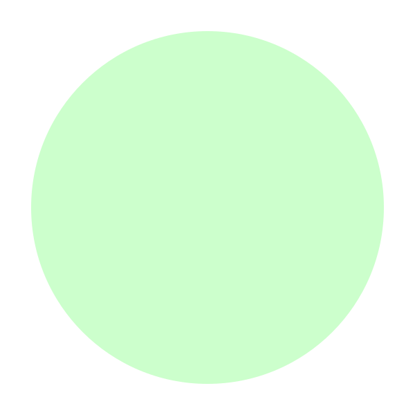
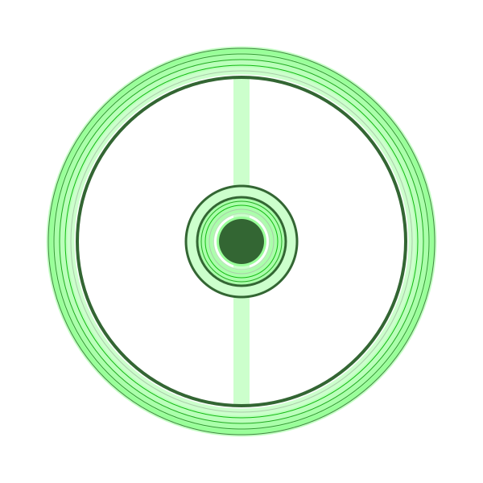

{{PreviousMenuNext("Web/Progressive_web_apps/Tutorials/CycleTracker/JavaScript_functionality", "Web/Progressive_web_apps/Tutorials/CycleTracker/Service_workers", "Web/Progressive_web_apps/Tutorials/CycleTracker")}}

{{PWASidebar}}

Le manifeste d'une PWA est un fichier JSON qui fournit des informations à propos des caractéristiques de l'application afin qu'elle puisse ressembler et se comporter comme une application native une fois installée sur un appareil. Le manifeste contient des métadonnées à propos de l'application comme son nom, ses icônes, ainsi que des directives d'affichage.

Bien que la spécification considère l'ensemble des champs du manifeste comme facultatifs, certains navigateurs, systèmes d'exploitation ou outils de distribution imposent [certains champs obligatoires](/fr/docs/Web/Progressive_web_apps/Guides/Making_PWAs_installable#required_manifest_members) pour qu'une application web soit une PWA. En incluant un nom ou un nom court, l'URL initiale, une icône respectant certains critères, le type de zone d'affichage dans laquelle l'application devrait être vue, votre application respectera les critères liés au manifeste pour être une PWA.

Voici un exemple de manifeste minimaliste pour notre application de suivi des cycles menstruels&nbsp;:

```js
{
  "short_name": "CT",
  "start_url" : "/",
  "icons": [
    {
      "src": "icon-512.png",
      "sizes": "512x512"
    }
  ],
  "display": "standalone"
}
```

Avant d'enregistrer le fichier du manifeste et d'inclure un pointeur vers celui-ci depuis notre document HTML, nous allons enrichir cet objet JSON afin qu'il reste concis, mais fournisse plus d'informations sur l'identité, la présentation et l'iconographie de la PWA. La version minimale ci-avant peut tout à fait fonctionner, mais voyons quelques autres propriétés qui aideront à mieux définir l'apparence de notre PWA CycleTracker.

## Identité de l'application

Pour identifier notre PWA, le document JSON doit inclure les propriétés `name` (nom) ou `short_name` (nom court), ou les deux. On peut également inclure un champ `description`.

- [`name`](/fr/docs/Web/Manifest/name)
  - : Le nom de la PWA. Il s'agit du nom utilisé lorsque le système d'exploitation liste les applications, comme le libellé situé à côté de l'icône de l'application, etc.
- [`short_name`](/fr/docs/Web/Manifest/short_name)
  - : Le nom de la PWA qui est affiché s'il n'y a pas suffisamment d'espace pour `name`. Cette valeur est utilisée comme libellé pour les icônes sur les écrans de smartphones, et, par exemple, dans la boîte de dialogue «&nbsp;Ajouter à l'écran d'accueil&nbsp;» sur iOS.

Lorsque `name` et `short_name` sont tous les deux renseignés, la valeur de `name` est utilisée dans la plupart des cas, tandis que `short_name` est utilisé lorsque l'espace d'affichage est limité.

- [`description`](/fr/docs/Web/Manifest/description)
  - : Une explication de ce que fait l'application. Elle fournit [une description accessible](/fr/docs/Web/Accessibility/ARIA/Attributes/aria-description) de l'objectif et des fonctionnalités de l'application.

### Tâche

Écrivez les premières lignes de votre fichier de manifeste. Vous pouvez utiliser le texte qui suit ou utiliser des valeurs plus descriptives ou discrètes, et une description de votre choix.

### Exemple de solution

```js
{
  "name": "CycleTracker : application de suivi menstruel",
  "short_name": "CT",
  "description": "Enregistrez de façon sécurisée et confidentielle vos cycles menstruels. Saisissez les dates de début et de fin de vos cycles, et enregistrez vos données privées dans votre navigateur sur votre appareil, sans qu'elles soient divulguées par ailleurs."
}
```

## Présentation de l'application

L'apparence de la PWA lors de son installation ou de son utilisation hors-ligne est définie dans le manifeste. Les champs du manifeste relatifs à cette apparence incluent notamment `start_url` et `display`, ainsi que d'autres champs permettant de [personnaliser les couleurs de votre application](/fr/docs/Web/Progressive_web_apps/How_to/Customize_your_app_colors), comme `theme_color` et `background_color`.

- [`start_url`](/fr/docs/Web/Manifest/start_url)
  - : La page de démarrage lorsque la PWA est lancée.
- [`display`](/fr/docs/Web/Manifest/display)
  - : Contrôle le mode d'affichage de l'application. Ce champ peut valoir `fullscreen`, `standalone` ([la PWA est alors affichée dans une fenêtre dédiée](/fr/docs/Web/Progressive_web_apps/How_to/Create_a_standalone_app)), `minimal-ui` (semblable à la vue `standalone`, mais avec certains éléments d'interface pour la navigation), et `browser`, qui ouvre l'application dans une fenêtre de navigateur classique.

Il existe également un champ [`orientation`](/fr/docs/Web/Manifest/orientation) qui définit l'orientation par défaut de la PWA et qui peut valoir `portrait` ou `landscape` (paysage). Comme notre application fonctionne dans les deux orientations, nous n'inclurons pas cette propriété.

### Couleurs

- [`theme_color`](/fr/docs/Web/Manifest/theme_color)
  - : [La couleur par défaut des éléments d'interface du système d'exploitation ou du navigateur](/fr/docs/Web/Progressive_web_apps/How_to/Customize_your_app_colors#define_a_theme_color) comme la barre d'état sur certains mobiles et la barre du titre d'application sur les systèmes d'exploitation de bureau.
- [`background_color`](/fr/docs/Web/Manifest/background_color)
  - : Une couleur de substitution qui peut être affichée [comme arrière-plan de l'application](/fr/docs/Web/Progressive_web_apps/How_to/Customize_your_app_colors#customize_the_app_window_background_color) jusqu'à ce que le CSS soit chargé. Pour créer une transition fluide entre le lancement de l'application et la fin du chargement, mieux vaudra utiliser [la couleur](/fr/docs/Web/CSS/color_value) déclarée pour [l'arrière-plan (propriété CSS `background-color`)](/fr/docs/Web/CSS/background-color) de l'application.

### Tâche

Ajouter les définitions de présentation au fichier de manifeste que vous avez initié lors de l'exercice précédent.

### Exemple de solution

Comme notre application d'exemple fonctionne sur une seule page, on pourra utiliser `"/"` comme valeur pour `start_url`, voire omettre ce champ. De même, nous pouvons afficher l'application sans l'interface utilisateur du navigateur en utilisant `standalone` comme valeur pour `display`.

Dans [notre fichier CSS](/fr/docs/Web/Progressive_web_apps/Tutorials/CycleTracker/HTML_and_CSS#contenu_css), nous appliquons `background-color: #efe;` sur le sélecteur de l'élément `body`. Aussi, nous utilisons ici `#eeffee` pour `background_color` afin d'obtenir une transition fluide lors du chargement de l'application.

```js
{
  "name": "…",
  "short_name": "…",
  "description": "…",
  "start_url": "/",
  "theme_color": "#eeffee",
  "background_color": "#eeffee",
  "display": "standalone"
}
```

## Iconographie de l'application

Les icônes d'une PWA aident à identifier l'application parmi les autres, aident à la rendre visuellement attractive et plus facilement découvrable. L'icône d'une PWA apparaît sur les écrans d'accueil, lanceurs d'application ou dans les résultats des magasins d'application. La taille de l'image affichée et les contraintes sur les fichiers utilisés varient selon le système et le contexte d'affichage. C'est dans le manifeste qu'on définit les images des différentes icônes.

Dans l'objet JSON qui représente le manifeste, le champ `icons` est un tableau d'un ou plusieurs objets représentant des icônes, chacun avec les propriétés `src` et `sizes`, et pouvant également inclure les propriétés optionnelles `type` et `purpose`. La propriété `src` de chaque objet icône indique la source d'un seul fichier image. La propriété `sizes` fournit une liste de tailles prises en charge pour cette image, séparées par des espaces, ou le mot-clé `any` (la valeur est analogue à l'attribut [`sizes`](/fr/docs/Web/HTML/Element/link#sizes) de l'élément HTML [`<link>`](/fr/docs/Web/HTML/Element/link)). La propriété `type` indique le type MIME de l'image.

```js
{
  "name": "MonAppli",
  "icons": [
    {
      "src": "icones/minuscule.webp",
      "sizes": "48x48"
    },
    {
      "src": "icones/petite.png",
      "sizes": "72x72 96x96 128x128 256x256",
      "purpose": "maskable"
    },
    {
      "src": "icones/grande.png",
      "sizes": "512x512"
    },
    {
      "src": "icones/vectorielle.svg",
      "sizes": "any"
    }
  ]
}
```

Toutes les icônes devraient avoir le même aspect afin que votre application soit reconnaissable quelle que soit la taille utilisée. Plus l'icône est grande, plus elle pourra contenir de détails. Bien que tous les fichiers d'icônes soient des images carrées, certains systèmes d'exploitation pourront les afficher avec une autre forme, en coupant certaines sections ou en appliquant un masque sur l'icône pour obtenir une homogénéité entre les applications, voire en les réduisant, en les centrant et en ajoutant un arrière-plan si l'icône n'est pas masquable. La [zone sûre](/fr/docs/Web/Progressive_web_apps/How_to/Define_app_icons#support-masking), celle qui sera affichée sans perte comme un cercle correspond aux 80% intérieurs de l'image. Les icônes qui peuvent recevoir un masque sans problème peuvent être identifiées avec la propriété `purpose` dotée de la valeur `maskable` (voir [les icônes adaptatives sur web.dev (en anglais)](https://web.dev/articles/maskable-icon)).

Dans Safari (et donc sur iOS et iPadOS), si vous incluez des éléments [`<link>`](/fr/docs/Web/HTML/Element/link) pour [les ressources non-standards `apple-touch-icon`](/fr/docs/Learn/HTML/Introduction_to_HTML/The_head_metadata_in_HTML#ajouter_des_icônes_personnalisées_à_un_site) dans l'élément [`<head>`](/fr/docs/Web/HTML/Element/head), ces icônes remplaceront celles déclarées dans le manifeste.

### Tâche

Ajoutez des icônes au manifeste construit dans les exercices précédents.

En jouant sur le mot «&nbsp;cycle&nbsp;» de CycleTracker et la couleur verte choisie comme thème, nos icônes peuvent être des carrés vert clair avec un cercle vert. Notre icône la plus petite, `circle.ico`, est un simple cercle représentant un point sur un carré utilisant la couleur du thème. Les images intermédiaires `circle.svg`, `tire.svg`, et `wheel.svg`, ajoutent progressivement plus de détails pour passer d'un cercle simple à une roue de plus en plus complexe, avec des rayons et un moyeu. Ceci étant écrit, la conception d'icônes est un sujet à part entière, que nous ne pouvons détailler pleinement dans ce tutoriel.

```html hidden
<div>
  
  
  
</div>
```

```css hidden
div {
  display: flex;
  gap: 5px;
}
img {
  width: 33%;
}
```

{{EmbedLiveSample("", 600, 250)}}

### Exemple de solution

```js
{
  "name": "...",
  "short_name": "...",
  "description": "...",
  "start_url": "...",
  "theme_color": "...",
  "background_color": "...",
  "display": "...",
  "icons": [
        {
      "src": "circle.ico",
      "sizes": "48x48"
    },
    {
      "src": "icons/circle.svg",
      "sizes": "72x72 96x96",
      "purpose": "maskable"
    },
    {
      "src": "icons/tire.svg",
      "sizes": "128x128 256x256"
    },
    {
      "src": "icons/wheel.svg",
      "sizes": "512x512"
    }
  ]
}
```

## Ajouter le manifeste à l'application

Nous avons désormais un fichier de manifeste utilisable. Il est temps de l'enregistrer et d'y faire référence depuis notre fichier HTML.

L'extension utilisée pour le fichier du manifeste peut être `.webappmanifest`, comme indiqué dans la spécification. Comme il s'agit d'un fichier JSON, on peut également l'enregistrer avec l'extension `.json`.

Pour une PWA, le manifeste doit être référencé dans le document HTML de l'application. Nous avons une application web fonctionnelle, mais ce n'est pas encore une PWA, car il n'y a pas encore de référence à notre manifeste JSON. Pour inclure la ressource JSON externe, on utilise un élément `<link>` avec l'attribut `rel="manifest"`, et on renseigne l'attribut `href` pour qu'il pointe vers le manifeste.

```html
<link rel="manifest" href="cycletracker.json" />
```

L'élément `<link>` sert généralement à référencer les feuilles de style, et dans le cas des PWA, le manifeste. On l'utilise aussi, entre autres, pour [les icônes d'un site](/fr/docs/Web/HTML/Attributes/rel#icon) (qu'il s'agisse des «&nbsp;favicons&nbsp;» et des icônes pour les écrans d'accueil sur mobile).

```html
<link rel="icon" href="icons/circle.svg" />
```

Si vous utilisez l'extension `.webmanifest`, il faut préciser `type="application/manifest+json"` si votre serveur ne gère pas automatiquement cette extension et son type MIME.

#### Tâche

Enregistrez le fichier de manifeste que vous avez créé jusqu'à présent, puis reliez-le depuis le fichier `index.html`.

Comme exercice facultatif, vous pouvez également ajouter un lien vers une icône depuis le document HTML.

#### Exemple de solution

L'élément [`<head>`](/fr/docs/Web/HTML/Element/head) de votre fichier `index.html` pourra ressembler à&nbsp;:

```html
<head>
  <meta charset="utf-8" />
  <meta name="viewport" content="width=device-width" />
  <title>Cycle Tracker</title>
  <link rel="stylesheet" href="style.css" />
  <link rel="manifest" href="cycletracker.json" />
  <link rel="icon" href="icons/circle.svg" />
</head>
```

Vous pouvez voir [le fichier `cycletracker.json` (en anglais)](https://mdn.github.io/pwa-examples/cycletracker/manifest_file/cycletracker.json) et [le code source du projet à ce stade](https://github.com/mdn/pwa-examples/tree/main/cycletracker/manifest_file) sur GitHub.

Lorsqu'un fichier manifeste est présent, Safari reconnaîtra votre site comme une application web. Toutefois, pour que l'application soit pleinement une PWA, il faut lui ajouter un <i lang="en">service worker</i>.

## Déboguer des fichiers manifeste

Certains outils de développement dans les navigateurs permettent d'inspecter les manifestes. Pour Edge, Firefox, et Chrome, les propriétés du manifeste et leur valeur sont visibles dans le panneau «&nbsp;Application&nbsp;».


Le panneau relatif au manifeste fournit un lien vers le fichier, et des sections sur l'identité, la présentation et les icônes.


Les propriétés du manifeste qui sont prises en charge sont affichées avec leur valeur. Dans cette capture d'écran, on peut voir les propriétés `orientation` et `id` apparaître, même si elles ne font pas partie de notre manifeste. Le panneau Applications peut être utilisé pour voir les propriétés et même apprendre certaines informations. Dans cet exemple, on peut voir que pour indiquer un identifiant d'application qui correspond à l'identité actuelle, il faut que la propriété `id` soit renseignée avec "/".

Chrome et Edge fournissent également des erreurs et des avertissements, les gestionnaires de protocole et des informations pour améliorer le manifeste et les icônes.

Notre application ne dispose pas de gestionnaires de protocole et nous n'aborderons pas ce sujet dans ce tutoriel. S'il y en avait eu d'inclus, ils auraient été listés dans la section correspondante. Cette section étant vide, les outils de développement fournissent des liens pour des informations à ce sujet.


Le panneau relatif au manifeste inclut également des informations sur les zones sûres des icônes masquables et un lien vers [un billet de blog (en anglais) sur ce sujet](https://web.dev/articles/maskable-icon). Pour créer des icônes, vous pouvez utiliser l'outil [imageGenerator (en anglais)](https://www.pwabuilder.com/imageGenerator) qui crée plus de 100 images carrées en PNG pour Android, Apple, et Windows, ainsi qu'un fichier JSON contenant l'ensemble des chemins des images avec leur taille. Celles-ci pourront ne pas toutes vous servir, mais cet outil vous permettra de voir la diversité des configurations utilisées pour servir une PWA.

Les outils de développement sont utiles pour identifier les champs de manifeste pris en charge. On notera par exemple que les outils de développement de Firefox affichent `dir`, `lang`, `orientation`, `scope`, et `id`, même si notre fichier de manifeste ne contient pas ces champs. Firefox inclut également la valeur de la propriété `purpose` pour chaque icône, en affichant `any` par défaut.


## Pour la suite

Pour que notre application bénéficie des avantages d'une PWA pour l'ensemble des navigateurs et des systèmes d'exploitation, nous devons lui [ajouter un <i lang="en">service worker</i>](/fr/docs/Web/Progressive_web_apps/Tutorials/CycleTracker/Service_workers). Dans le prochain article, nous verrons comment faire, sans utiliser de <i lang="en">framework</i>.

{{PreviousMenuNext("Web/Progressive_web_apps/Tutorials/CycleTracker/JavaScript_functionality", "Web/Progressive_web_apps/Tutorials/CycleTracker/Service_workers", "Web/Progressive_web_apps/Tutorials/CycleTracker")}}
