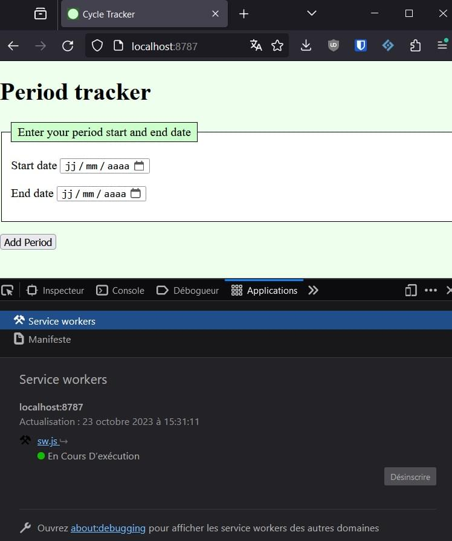
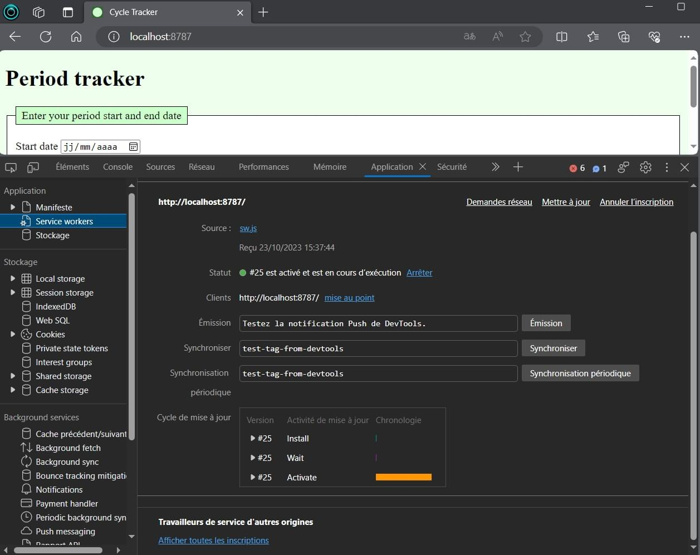

{{PWASidebar}}

{{PreviousMenu("Web/Progressive_web_apps/Tutorials/CycleTracker/Manifest_file", "Web/Progressive_web_apps/Tutorials/CycleTracker")}}

Jusqu'à présent, nous avons écrit le HTML, le CSS et le JavaScript de l'application CycleTracker. Nous avons ajouté un fichier de manifeste qui définit les couleurs, icônes, URL et d'autres fonctionnalités de l'application. Notre application web est fonctionnelle&nbsp;! Toutefois, ce n'est pas encore une application web progressive. Dans cette section, nous écrirons le JavaScript nécessaire pour que notre application web devienne une PWA qui puisse être distribuée comme une application à part entière et qui fonctionne hors-ligne.

Si ce n'est pas déjà fait, copiez les fichiers [HTML](https://github.com/mdn/pwa-examples/tree/master/cycletracker/manifest_file/index.html), [CSS](https://github.com/mdn/pwa-examples/tree/master/cycletracker/manifest_file/style.css), [JavaScript](https://github.com/mdn/pwa-examples/tree/master/cycletracker/manifest_file/app.js), et [celui du manifeste](https://github.com/mdn/pwa-examples/tree/master/cycletracker/manifest_file/cycletracker.json). Respectivement, enregistrez-les avec les noms `index.html`, `styles.css`, `app.js`, et `cycletracker.json`.

Dans cette section, nous allons créer un fichier `sw.js` qui contiendra le script de notre <i lang="en">service worker</i> qui convertira notre application web en PWA. Nous avons déjà un fichier JavaScript et la dernière ligne de notre fichier HTML appelle `app.js`. Ce code JavaScript fournit l'ensemble des fonctionnalités de notre application web classique. Plutôt que d'appeler le fichier `sw.js` comme nous l'avions fait pour
`app.js` en utilisant l'attribut `src` de l'élément [`<script>`](/fr/docs/Web/HTML/Element/script), nous allons créer une relation entre l'application web et le <i lang="en">service worker</i> en _enregistrant_ ce dernier.

À la fin de ce chapitre, vous aurez une PWA fonctionnelle&nbsp;: une application web améliorée qui peut être installée et qui fonctionne même sans accès à Internet.

## Rôles du <i lang="en">service worker</i>

Le <i lang="en">service worker</i> permet à l'application de fonctionner hors-ligne, tout en s'assurant qu'elle est toujours à jour. Pour cela, le <i lang="en">service worker</i> doit contenir les informations suivantes&nbsp;:

- Un numéro de version ou un identifiant
- Une liste des ressources à mettre en cache
- Un nom pour la version du cache

Le <i lang="en">service worker</i> servira également à&nbsp;:

- Installer le cache lors de l'installation de l'application
- Se mettre à jour lui-même, ainsi que les fichiers de l'application lorsque c'est nécessaire
- Retirer les fichiers en cache qui ne sont plus utiles

Pour réaliser ces tâches, on réagira aux trois évènements suivants du <i lang="en">service worker</i>&nbsp;:

- [`fetch`](/fr/docs/Web/API/ServiceWorkerGlobalScope/fetch_event)
- [`install`](/fr/docs/Web/API/ServiceWorkerGlobalScope/install_event)
- [`activate`](/fr/docs/Web/API/ServiceWorkerGlobalScope/activate_event)

### Numéro de version

Lorsque l'application est installée sur un appareil, la seule façon d'indiquer au navigateur qu'il y a de nouveaux fichiers à jour à récupérer consiste à modifier le <i lang="en">service worker</i>. En effet, si une modification est apportée à une autre ressource de la PWA (que ce soit le HTML mis à jour, un correctif apporté dans le CSS, une fonction ajoutée à `app.js`, une image compressée pour réduire la taille des fichiers, etc.), le <i lang="en">service worker</i> installé pour la PWA ne saura pas qu'il doit télécharger les ressources mises à jour. Seule une modification du <i lang="en">service worker</i> permettra à la PWA de savoir qu'il est temps de mettre à jour le cache, une tâche initiée par le <i lang="en">service worker</i>.

Bien que la modification d'un seul caractère suffise sur le plan technique, une bonne pratique consiste à créer une constante qui représentera un numéro de version et qui sera mise à jour de façon séquentielle lors de la mise à jour du fichier. Mettre à jour un numéro de version (ou une date) permet d'éditer officiellement le <i lang="en">service worker</i>, même si rien n'a changé par ailleurs dans son code et fournit aux développeuses et développeur un outil pour identifier les versions de l'application.

#### Tâche

Ouvrez un nouveau fichier JavaScript en indiquant un numéro de version&nbsp;:

```js
const VERSION = "v1";
```

Enregistrez ce fichier avec le nom `sw.js`

### Liste des ressources hors-ligne

Pour que l'application fonctionne correctement en étant déconnectée, la liste des fichiers mis en cache doit inclure toutes les ressources qui sont utilisées par la PWA hors-ligne. Bien que le fichier de manifeste utilise plusieurs icônes de différentes tailles, le cache de l'application a uniquement besoin d'inclure les fichiers utilisés par l'application en mode déconnecté.

```js
const APP_STATIC_RESOURCES = [
  "/",
  "/index.html",
  "/styles.css",
  "/app.js",
  "/icon-512x512.png",
];
```

Il n'est pas nécessaire d'inclure les différentes icônes utilisées par les différents systèmes d'exploitation dans cette liste. En revanche, il faut inclure les images utilisées dans l'application, y compris les fichiers utilisés pour les pages d'accueil ou de chargement qui pourraient servir ou encore pour les pages de type «&nbsp;vous devez vous connecter à Internet pour accéder à cette fonctionnalité&nbsp;».

Attention à ne pas inclure le fichier du <i lang="en">service worker</i> (`sw.js`) dans la liste des ressources à mettre en cache.

#### Tâche

Ajoutez au fichier `sw.js` la liste des ressources à mettre en cache pour la PWA CycleTracker.

#### Exemple de solution

Nous avons ici inclus les ressources statiques créées dans les sections précédentes de ce tutoriel et qui sont nécessaires au fonctionnement hors-ligne de CycleTracker. Voici notre fichier `sw.js` actuel&nbsp;:

```js
const VERSION = "v1";

const APP_STATIC_RESOURCES = [
  "/",
  "/index.html",
  "/styles.css",
  "/app.js",
  "/cycletrack.json",
  "/icons/wheel.svg",
];
```

Nous avons inclus l'icône `wheel.svg`, même si l'application courante ne l'utilise pas. Cela pourra vous servir si vous améliorez l'interface utilisateur de cette application, par exemple pour afficher le logo lorsqu'il n'y a pas de données saisies dans l'application.

### Nom pour la version du cache

Nous avons un numéro de version et les fichiers qui doivent être mis en cache. Avant de mettre les fichiers en cache, nous devons créer un nom pour le cache, qui sera utilisé pour stocker les ressources statiques de l'application. Le nom du cache devrait être versionné afin d'être certain·e de créer un nouveau cache et de supprimer l'ancien lorsque l'application est mise à jour.

#### Tâche

Utilisez le numéro `VERSION` pour créer un nom de cache `CACHE_NAME`, et ajoutez cette constante au fichier `sw.js`.

#### Exemple de solution

Nous nommons notre cache `period-tracker-` avec le suffixe provenant de la constante `VERSION`. Cette déclaration tenant sur une seule ligne, nous la plaçons avant le tableau des ressources statiques pour une meilleure lisibilité.

```js
const VERSION = "v1";
const CACHE_NAME = `period-tracker-${VERSION}`;

const APP_STATIC_RESOURCES = [ ... ];
```

Nous avons bien déclaré nos constantes&nbsp;: un identifiant unique, la liste des ressources pour un usage hors-ligne, et le nom du cache de l'application, qui changera dès que la version est mise à jour. Voyons maintenant comment installer, mettre à jour, et supprimer les ressources inutilisées mises en cache.

### Sauvegarder le cache à l'installation de la PWA

Lorsqu'une personne installe une PWA ou qu'elle visite un site web avec un <i lang="en">service worker</i>, un évènement `install` est déclenché dans la portée du <i lang="en">service worker</i>. Nous allons écouter cet évènement afin de remplir le cache avec les ressources statiques lors de l'installation. À chaque mise à jour de la version, le navigateur installe le nouveau <i lang="en">service worker</i> et l'évènement `install` est déclenché.

L'évènement `install` se produit lorsque l'application est utilisée pour la première fois ou lorsqu'une nouvelle version du <i lang="en">service worker</i> est détectée par le navigateur. Lorsqu'un ancien <i lang="en">service worker</i> est remplacé par un nouveau, l'ancien <i lang="en">service worker</i> est encore utilisé pour l'application jusqu'à ce que le nouveau <i lang="en">service worker</i> soit activé.

La propriété globale [`caches`](/fr/docs/Web/API/Window/caches), uniquement disponible dans des contextes sécurisés, renvoie un objet [`CacheStorage`](/fr/docs/Web/API/CacheStorage) associé au contexte courant. La méthode [`CacheStorage.open()`](/fr/docs/Web/API/CacheStorage/open) renvoie [une promesse (`Promise`)](/fr/docs/Web/JavaScript/Reference/Global_Objects/Promise) qui se résout en un objet [`Cache`](/fr/docs/Web/API/Cache) correspondant au nom passé en paramètre.

La méthode [`Cache.addAll()`](/fr/docs/Web/API/Cache/addAll) prend un tableau d'URL en paramètre, les récupère, et ajoute les réponses reçues au cache indiqué. La méthode [`waitUntil()`](/fr/docs/Web/API/ExtendableEvent/waitUntil) indique au navigateur que le chargement est en cours, jusqu'à ce que la promesse soit résolue et qu'il ne devrait pas interrompre le <i lang="en">service worker</i> pendant ce chargement. Bien qu'il appartienne aux navigateurs d'exécuter et de mettre fin aux <i lang="en">service workers</i> en temps normal, la méthode `waitUntil()` permet d'indiquer au navigateur qu'il ne faut pas interrompre le <i lang="en">service worker</i>, car une tâche est en cours.

```js
self.addEventListener("install", (e) => {
  e.waitUntil((async () => {
      const cache = await caches.open("cacheName_identifier");
      cache.addAll([
        "/",
        "/index.html"
        "/styles.css"
        "/app.js"
      ]);
    })()
  );
});
```

#### Tâche

Ajoutez un gestionnaire d'évènement pour `install`, qui récupère et enregistre les fichiers listés du tableau `APP_STATIC_RESOURCES` dans le cache intitulé `CACHE_NAME`.

#### Exemple de solution

```js
self.addEventListener("install", (event) => {
  event.waitUntil(
    (async () => {
      const cache = await caches.open(CACHE_NAME);
      cache.addAll(APP_STATIC_RESOURCES);
    })(),
  );
});
```

### Mettre à jour l'application et supprimer les anciens caches

Comme évoqué précédemment, lorsqu'un <i lang="en">service worker</i> est remplacé par une nouvelle version, c'est le <i lang="en">service worker</i> existant qui est utilisé jusqu'à ce que le nouveau <i lang="en">service worker</i> soit activé. On utilise l'évènement `activate` pour supprimer les anciens caches et éviter de manquer d'espace de stockage. Pour cela, on parcourt les objets [`Cache`](/fr/docs/Web/API/Cache) selon leurs noms et on les supprime tous, sauf le cache courant&nbsp;; on passe ensuite la main au nouveau <i lang="en">service worker</i> qui devient [le contrôleur (`controller`)](/fr/docs/Web/API/ServiceWorkerContainer/controller) de l'application.

Pour cela, on écoute l'évènement [`activate`](/fr/docs/Web/API/ServiceWorkerGlobalScope/activate_event) qui est émis sur la portée globale du <i lang="en">service worker</i> courant.

On récupère ensuite les noms des caches existants. Pour cela, on exécute la méthode [`CacheStorage.keys()`](/fr/docs/Web/API/CacheStorage/keys) (via la propriété globale [`caches`](/fr/docs/Web/API/Window/caches) qui permet d'accéder à `CacheStorage`) qui renvoie [une promesse (`Promise`)](/fr/docs/Web/JavaScript/Reference/Global_Objects/Promise) qui sera résolue en un tableau contenant des chaînes de caractères correspondant aux objets [`Cache`](/fr/docs/Web/API/Cache) nommés, dans l'ordre selon lequel ils ont été créés.

On utilise la méthode [`Promise.all()`](/fr/docs/Web/JavaScript/Reference/Global_Objects/Promise/all) pour parcourir toute cette liste de promesses. La méthode `all()` prend comme argument un itérable de promesses et renvoie une seule promesse. Pour chaque nom présent dans la liste, on vérifie si le cache est le cache courant. Si ce n'est pas le cas, on le supprime grâce à la méthode [`delete()`](/fr/docs/Web/API/Cache/delete).

Dans le fragment de code qui suit, la dernière ligne, `await clients.claim()`, utilise la méthode [`claim()`](/fr/docs/Web/API/Clients/claim) de l'interface [`Clients`](/fr/docs/Web/API/Clients) pour activer le <i lang="en">service worker</i> et qu'il devienne le contrôleur de notre client (ici, le terme client faire référence à l'instance courante de l'application). La méthode `claim()` permet au <i lang="en">service worker</i> de prendre la main pour l'ensemble des clients de sa portée. Ainsi, tous les clients chargés dans la même portée n'ont pas besoin d'être rechargés.

```js
self.addEventListener("activate", (event) => {
  event.waitUntil(
    (async () => {
      const names = await caches.keys();
      await Promise.all(
        names.map((name) => {
          if (name !== CACHE_NAME) {
            return caches.delete(name);
          }
        }),
      );
      await clients.claim();
    })(),
  );
});
```

#### Tâche

Ajoutez le gestionnaire d'évènement `activate` précédent à votre fichier `sw.js`.

### L'évènement `fetch`

Nous pouvons utiliser l'évènement [`fetch`](/fr/docs/Web/API/ServiceWorkerGlobalScope/fetch_event) pour empêcher une application installée d'envoyer des requêtes lorsque la personne est connectée. En écoutant l'évènement `fetch`, on peut intercepter toutes les requêtes et répondre avec les réponses mises en cache plutôt que de solliciter le réseau. La plupart des applications n'ont pas besoin de ce fonctionnement. De fait, pour certains modèles économiques, il est préférable que les requêtes soient envoyées jusqu'aux serveurs à des fins de pistage et de marketing. Aussi, même si d'aucuns auraient l'utilité de ne pas intercepter ces requêtes, nous souhaitons que notre application CycleTracker soit la plus respectueuse possible de la vie privée et on voudra donc éviter d'émettre ces requêtes inutiles.

Notre application ne contient qu'une seule page. Toutes les requêtes liées à la navigation concerneront uniquement la page `index.html`. Il n'y a pas d'autres pages à charger. Aussi, si la propriété [`mode`](/fr/docs/Web/API/Request/mode) de l'objet [`Request`](/fr/docs/Web/API/Request) fourni par l'API <i lang="en">Fetch</i> vaut `navigate` (indiquant que le navigateur cherche une page web), on utilisera la méthode [`respondWith()`](/fr/docs/Web/API/FetchEvent/respondWith) de `FetchEvent` pour empêcher la gestion par défaut du navigateur (qui consiste à demander la ressource au serveur) et on fournira notre propre promesse de réponse à l'aide de la méthode [`caches.match()`](/fr/docs/Web/API/CacheStorage/match).

Pour tous les autres modes des requêtes, on ouvre le cache que nous avions rempli [lors de l'installation](sauvegarder_le_cache_à_linstallation_de_la_PWA) en passant la requête de l'évènement à la méthode `match()`. Cette méthode vérifiera si la requête correspond à l'une des clés pour [une réponse (`Response`)](/fr/docs/Web/API/Response) enregistrée. Si ce n'est pas le cas, on renvoie [un statut 404](/fr/docs/Web/HTTP/Status/404) comme réponse.

Pour cela, on utilise le constructeur [`Response()`](/fr/docs/Web/API/Response/Response) avec un corps `null` et `status: 404` comme options. Cela ne signifie pas qu'il y a une erreur avec notre PWA. Tout ce qui est nécessaire devrait déjà être en cache, et si ce n'est pas le cas, nous n'allons pas contacter le serveur pour résoudre ce sujet.

```js
self.addEventListener("fetch", (event) => {
  // Lorsqu'on cherche une page HTML
  if (event.request.mode === "navigate") {
    // On renvoie à la page index.html
    event.respondWith(caches.match("/"));
    return;
  }

  // Pour tous les autres types de requête
  event.respondWith(
    (async () => {
      const cache = await caches.open(CACHE_NAME);
      const cachedResponse = await cache.match(event.request.url);
      if (cachedResponse) {
        // On renvoie la réponse mise en cache si elle est disponible.
        return cachedResponse;
      }
      // On répond avec une réponse HTTP au statut 404.
      return new Response(null, { status: 404 });
    })(),
  );
});
```

## Le fichier complet du <i lang="en">service worker</i>

Votre fichier `sw.js` devrait ressembler au code JavaScript qui suit. On notera que lorsqu'on met à jour une des ressources du tableau `APP_STATIC_RESOURCES`, seule la constante `VERSION` devra nécessairement être mise à jour.

```js
// La version du cache
const VERSION = "v1";

// Le nom du cache
const CACHE_NAME = `period-tracker-${VERSION}`;

// Les ressources statiques nécessaires au fonctionnement de l'application
const APP_STATIC_RESOURCES = [
  "/",
  "/index.html",
  "/app.js",
  "/styles.css",
  "/icons/wheel.svg",
];

// Lors de l'installation, on met en cache les ressources statiques
self.addEventListener("install", (event) => {
  event.waitUntil(
    (async () => {
      const cache = await caches.open(CACHE_NAME);
      cache.addAll(APP_STATIC_RESOURCES);
    })(),
  );
});

// Lors de l'activation, on supprime les anciens caches
self.addEventListener("activate", (event) => {
  event.waitUntil(
    (async () => {
      const names = await caches.keys();
      await Promise.all(
        names.map((name) => {
          if (name !== CACHE_NAME) {
            return caches.delete(name);
          }
        }),
      );
      await clients.claim();
    })(),
  );
});

// Lors de la récupération des ressources, on intercepte les
// requêtes au serveur et on répond avec les réponses en cache
// plutôt que de passer par le réseau
self.addEventListener("fetch", (event) => {
  // Notre application n'a qu'une seule page,
  // on n'utilisera que celle-ci.
  if (event.request.mode === "navigate") {
    event.respondWith(caches.match("/"));
    return;
  }

  // Pour toutes les autres requêtes, on passera par le cache
  event.respondWith(
    (async () => {
      const cache = await caches.open(CACHE_NAME);
      const cachedResponse = await cache.match(event.request.url);
      if (cachedResponse) {
        // On renvoie la réponse mise en cache si elle y est disponible
        return cachedResponse;
      }
      // Si la ressource n'est pas dans le cache, on renvoie une 404.
      return new Response(null, { status: 404 });
    })(),
  );
});
```

Lorsqu'on met à jour le code du <i lang="en">service worker</i>, la constante `VERSION` n'a pas nécessairement à être mise à jour, car toute modification du script du <i lang="en">service worker</i> déclenchera l'installation du nouveau <i lang="en">service worker</i> dans le navigateur. Toutefois, il s'agit généralement d'une bonne pratique que de mettre à jour ce numéro pour faciliter l'identification de la version qui s'exécute dans le navigateur (que ce soit pour d'autres développeuses, développeurs ou pour vous-même) en [vérifiant le nom du cache dans les outils de développement](#en_utilisant_les_outils_de_développement) (ou en inspectant la source du script).

**Note :** Il est important de mettre à jour `VERSION` dès qu'on modifie une des ressources de l'application, que ce soit les fichiers CSS, HTML, JavaScript ou encore les images. Seul un changement du code du <i lang="en">service worker</i>, ici avec le numéro de version, permettra de forcer la mise à jour de l'application auprès des utilisatrices et utilisateurs.

## Enregistrement du <i lang="en">service worker</i>

Maintenant que notre <i lang="en">service worker</i> est terminé, nous devons l'enregistrer.

Pour cela, on commence par vérifier la prise en charge de [l'API <i lang="en">Service Worker</i>](/fr/docs/Web/API/Service_Worker_API) par le navigateur en [détectant la fonctionnalité](/fr/docs/Learn/Tools_and_testing/Cross_browser_testing/Feature_detection#the_concept_of_feature_detection) avec un test de la présence de la propriété [`serviceWorker`](/fr/docs/Web/API/ServiceWorker) sur l'objet global [`navigator`](/fr/docs/Web/API/Navigator)&nbsp;:

```html
<script>
  // Est-ce que "serviceWorker" existe ?
  if ("serviceWorker" in navigator) {
    // Si c'est bien le cas, on enregistre le service worker
  }
</script>
```

Si la propriété est prise en charge, on peut alors utiliser la méthode [`register()`](/fr/docs/Web/API/ServiceWorkerContainer/register) de l'interface [`ServiceWorkerContainer`](/fr/docs/Web/API/ServiceWorkerContainer).

```html
<script>
  if ("serviceWorker" in navigator) {
    // On enregistre le service worker de l'application
    // en passant le nom du fichier où le worker est défini.
    navigator.serviceWorker.register("sw.js");
  }
</script>
```

Bien que le fragment précédent suffise pour les besoins de l'application CycleTracker, la méthode `register()` renvoie [une promesse (`Promise`)](/fr/docs/Web/JavaScript/Reference/Global_Objects/Promise) qui se résout en un objet [`ServiceWorkerRegistration`](/fr/docs/Web/API/ServiceWorkerRegistration). Pour une application plus robuste, il est préférable de vérifier s'il y a eu une erreur lors de l'enregistrement&nbsp;:

```js
if ("serviceWorker" in navigator) {
  navigator.serviceWorker.register("sw.js").then(
    (registration) => {
      console.log("Enregistrement du service worker réussi :", registration);
    },
    (error) => {
      console.error(`Échec de l'enregistrement du service worker : ${error}`);
    },
  );
} else {
  console.error("Les service workers ne sont pas pris en charge.");
}
```

### Tâche

Ouvrez le fichier `index.html` et ajoutez l'élément [`<script>`](/fr/docs/Web/HTML/Element/script) après le script incluant `app.js` et avant la balise fermante `</body>`.

```html
<!-- Enregistrement du service worker de l'application. -->
<script>
  if ("serviceWorker" in navigator) {
    navigator.serviceWorker.register("sw.js");
  }
</script>
```

Vous pouvez essayer [l'application CycleTracker fonctionnelle et complète](https://mdn.github.io/pwa-examples/cycletracker/service_workers) et consulter [son code source](https://github.com/mdn/pwa-examples/tree/master/cycletracker/service_workers) sur GitHub. Elle fonctionne, et c'est désormais bien une PWA&nbsp;!

## Débogage des <i lang="en">service workers</i>

Étant donné la façon dont nous utilisons le <i lang="en">service workers</i>, une fois que celui-ci aura été enregistré, chaque requête utilisera le cache plutôt que de charger du nouveau contenu. Lors du développement, on édite régulièrement le code et on veut généralement tester régulièrement dans le navigateur.

### En incrémentant le numéro de version et avec un rafraîchissement forcé

Pour obtenir un nouveau cache, on peut modifier [le numéro de version](#numéro_de_version) puis demander un rafraîchissement forcé. La méthode pour déclencher un tel rafraîchissement dépend du navigateur et du système d'exploitation&nbsp;:

- Sur Windows&nbsp;: <kbd>Ctrl</kbd>+<kbd>F5</kbd>, <kbd>Shift</kbd>+<kbd>F5</kbd>, ou <kbd>Ctrl</kbd>+<kbd>Shift</kbd>+<kbd>R</kbd>.
- Sur MacOS&nbsp;: <kbd>Shift</kbd>+<kbd>Command</kbd>+<kbd>R</kbd>.
- Safari sur MacOS&nbsp;: <kbd>Option</kbd>+<kbd>Command</kbd>+<kbd>E</kbd> pour vider le cache, puis <kbd>Option</kbd>+<kbd>Command</kbd>+<kbd>R</kbd>.
- Sur mobile&nbsp;: allez dans les paramètres du navigateur (Android) ou du système d'exploitation (Samsung, iOS)&nbsp;: dans les réglages avancés, trouvez le paramètre associé au navigateur (iOS) ou aux données des sites web (Android, Samsung), puis supprimer les données pour CycleTracker, avant de recharger la page.

### En utilisant les outils de développement

En général, on préfère éviter d'avoir à mettre à jour le numéro de version à chaque enregistrement dans son éditeur. Avant que vous ayez une nouvelle version de votre PWA prête à être déployée en production et diffusée à tout le monde, vous pouvez désinscrire le <i lang="en">service worker</i> plutôt que de modifier le numéro de version.

Vous pouvez désinscrire un <i lang="en">service worker</i> en cliquant sur le bouton «&nbsp;Désinscrire&nbsp;» dans [les outils de développement du navigateur](/fr/docs/Learn/Common_questions/Tools_and_setup/What_are_browser_developer_tools). En effectuant ensuite un rafraîchissement forcé, la page réinscrira le <i lang="en">service worker</i> et créera un nouveau cache.



Dans certains outils de développement, il est possible de désinscrire manuellement un <i lang="en">service worker</i>, ou de sélectionner les <i lang="en">service workers</i> à mettre à jour lors d'un rechargement, ce qui permet de réinitialiser et de réactiver le <i lang="en">service worker</i> à chaque rechargement, tant que les outils de développement sont ouverts. Il existe également une option pour passer outre le <i lang="en">service worker</i> et charger les ressources depuis le réseau. Ce panneau contient d'autres fonctionnalités que nous n'avons pas abordées dans ce tutoriel, mais qui pourront vous aider lorsque vous créerez des PWA plus avancées avec [la synchronisation](/fr/docs/Web/Progressive_web_apps/Guides/Offline_and_background_operation#periodic_background_sync) et [les messages poussés](/fr/docs/Web/Progressive_web_apps/Guides/Offline_and_background_operation#push), qui sont abordés [dans le guide sur les opérations hors-ligne et en arrière-plan](/fr/docs/Web/Progressive_web_apps/Guides/Offline_and_background_operation).



Dans l'onglet Application, la fenêtre dédiée aux <i lang="en">service workers</i> fournit un lien pour accéder à une fenêtre modale listant tous les <i lang="en">service workers</i> du navigateur (et pas uniquement celui de l'application de l'onglet courant). Pour chaque <i lang="en">service worker</i>, on a un bouton pour l'arrêter, le démarrer, ou le désinscrire.


Autrement dit, quand vous travaillez sur votre PWA, vous n'avez pas à mettre à jour le numéro de version pour chaque test de votre application. Attention toutefois, quand vous avez fini vos développements, assurez-vous de mettre à jour la valeur de `VERSION` avant de distribuer la mise à jour de votre PWA. Si vous oubliez ce point, toutes les personnes qui auront déjà installé l'application ou visité votre PWA en ligne ne verront pas votre mise à jour&nbsp;!

## Et c'est fini&nbsp;!

Pour synthétiser, une PWA est une application web qui peut être installée et qui est améliorée progressivement pour fonctionner hors-ligne. Nous avons ici créé une application web complètement fonctionnelle, à laquelle nous avons ajouté deux fonctionnalités&nbsp;: un manifeste et un <i lang="en">service worker</i>, ce qui permet d'en faire une PWA. Si vous souhaitez partager votre application avec d'autres, il faut qu'elle soit disponible via une connexion sécurisée. Sinon, si vous souhaitez utiliser CycleTracker pour vous-même, vous pouvez [créer un environnement de développement local](/fr/docs/Web/Progressive_web_apps/Tutorials/CycleTracker/Secure_connection), [installer la PWA](/fr/docs/Web/Progressive_web_apps/Guides/Installing), et c'est tout&nbsp;! Une fois que l'application est installée, vous n'avez même plus besoin d'exécuter un serveur local.

Félicitations&nbsp;!

{{PreviousMenu("Web/Progressive_web_apps/Tutorials/CycleTracker/Manifest_file", "Web/Progressive_web_apps/Tutorials/CycleTracker")}}
