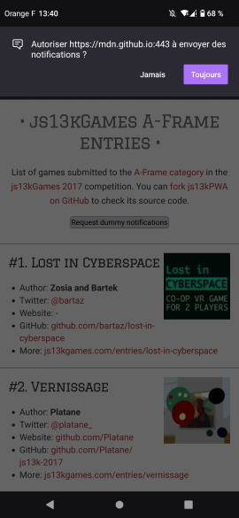

{{PreviousMenuNext("Web/Progressive_web_apps/Tutorials/js13kGames/Installable_PWAs", "Web/Progressive_web_apps/Tutorials/js13kGames/Loading", "Web/Progressive_web_apps/Tutorials/js13kGames")}}

{{PWASidebar}}

Mettre en cache le contenu d'une application pour travailler en mode déconnecté est une fonctionnalité appréciable, tout comme l'installation d'une application web sur son écran d'accueil. Toutefois, nous pouvons aller plus loin que les utilisations initiées par la personne. En effet, grâce aux messages poussés (<i lang="en">push messages</i>) et aux notifications, nous pouvons informer l'utilisatrice ou l'utilisateur que de nouvelles informations sont disponibles.

## Deux API, un seul but

[L'API <i lang="en">Push</i>](/fr/docs/Web/API/Push_API) et [l'API Notifications](/fr/docs/Web/API/Notifications_API) sont deux API distinctes, mais qui fonctionnent bien ensemble pour implémenter une fonctionnalité visant à éveiller l'intérêt de la personne. L'API <i lang="en">Push</i> est utilisée pour délivrer un nouveau contenu à votre application depuis le serveur, sans aucune intervention côté client&nbsp;; cette opération étant gérée par le <i lang="en">service worker</i> de l'application. Les notifications peuvent être utilisées par le <i lang="en">service worker</i> pour afficher les nouvelles informations à l'utilisatrice ou l'utilisateur, ou, du moins, prévenir que quelque chose a été mis à jour.

Tout ceci s'exécute en dehors de la fenêtre du navigateur, tout comme les service workers, de sorte que les mises à jour peuvent être poussées et que des notifications peuvent être affichées lorsque la page de l'application n'a pas le focus, voire quand elle est fermée.

## Notifications

Commençons avec les notifications. Elles peuvent fonctionner sans message poussé du serveur, même si elles sont très utiles avec ceux-ci. Pour commencer, voyons-les de façon isolée.

### Demander la permission

Pour afficher une notification, nous devons d'abord demander la permission. Cependant, au lieu d'afficher immédiatement la demande de permission, une bonne pratique consiste à l'afficher uniquement lorsque la personne le demande en cliquant sur un bouton&nbsp;:

```js
const button = document.getElementById("notifications");
button.addEventListener("click", () => {
  Notification.requestPermission().then((result) => {
    if (result === "granted") {
      randomNotification();
    }
  });
});
```

Il s'agit d'une fenêtre contextuelle utilisant le service de notification du système d'exploitation&nbsp;:



Une fois que la personne a confirmé qu'elle voulait recevoir des notifications, l'application peut alors les utiliser. Le résultat de cette demande de permission `default` (valeur par défaut), `granted` (autorisé) ou `denied` (interdit). L'option `default` sera utilisée si la personne n'a pas fait de choix, les autres valeurs correspondront au choix effectué.

Si la permission est donnée, elle vaut à la fois pour les notifications et les messages poussés.

### Créer une notification

L'application d'exemple crée une notification en utilisant les données disponibles — un jeu est choisi au hasard et les données associées sont utilisées pour générer le contenu de la notification&nbsp;: le nom du jeu pour le titre, la mention de l'auteur dans le corps du texte et l'image pour l'icône&nbsp;:

```js
function randomNotification() {
  const randomItem = Math.floor(Math.random() * games.length);
  const notifTitle = games[randomItem].name;
  const notifBody = `Created by ${games[randomItem].author}.`;
  const notifImg = `data/img/${games[randomItem].slug}.jpg`;
  const options = {
    body: notifBody,
    icon: notifImg,
  };
  new Notification(notifTitle, options);
  setTimeout(randomNotification, 30000);
}
```

Une nouvelle notification est créée au hasard toutes les 30 secondes, jusqu'à ce que ça devienne trop pénible et que la personne les désactive (pour une vraie application, les notifications devraient être moins fréquentes et plus utiles). L'avantage de l'API Notifications est qu'elle utilise la fonction de notification du système d'exploitation. Ceci signifie que les notifications peuvent être affichées même quand la personne ne regarde pas l'application et qu'elles auront le même aspect que celles affichées par les applications natives.

## Messages poussés

Les messages poussés (<i lang="en">push messages</i> ou <i lang="en">push</i>) sont plus compliqués à mettre en œuvre que les notifications. Nous avons besoin de nous abonner à un serveur qui enverra ensuite les données à l'application. Le <i lang="en">service worker</i> de l'application recevra les données du serveur qui les a poussées et pourra ensuite les afficher en utilisant le système de notifications (ou tout autre mécanisme).

La technologie en est à ses débuts. Certains exemples fonctionnels utilisent la plateforme Cloud de messagerie de Google, mais elles sont en cours de réécriture pour prendre en charge [VAPID](https://blog.mozilla.org/services/2016/08/23/sending-vapid-identified-webpush-notifications-via-mozillas-push-service/) (<i lang="en">Voluntary Application Identification</i>) qui offre une couche de sécurité supplémentaire. Vous pouvez étudier [les exemples du livre de recettes des <i lang="en">service workers</i>](https://github.com/mdn/serviceworker-cookbook/tree/master/push-payload), essayer de mettre en place un serveur d'émission de messages utilisant [Firebase](https://firebase.google.com/) ou construire votre propre serveur (en utilisant Node.js par exemple).

Comme mentionné précédemment, pour être capable de recevoir des messages poussés, vous devez avoir un <i lang="en">service worker</i> (voir les fondamentaux expliqués dans l'article [Fonctionnement hors connexion des PWA grâce aux <i lang="en">service workers</i>](/fr/docs/Web/Progressive_web_apps/Tutorials/js13kGames/Offline_Service_workers)). Au sein du <i lang="en">service worker</i>, on peut créer un mécanisme d'abonnement au service push en appelant la méthode [`getSubscription()`](/fr/docs/Web/API/PushManager/getSubscription) de l'interface [`PushManager`](/fr/docs/Web/API/PushManager).

```js
navigator.serviceWorker.register("service-worker.js").then((registration) => {
  return registration.pushManager.getSubscription().then(/* … */);
});
```

Une fois que la personne est abonnée, elle peut recevoir des notifications poussées par le serveur.

Côté serveur, le canal de communication doit être chiffré pour des raisons de sécurité&nbsp;: on ne veut pas que n'importe qui puisse intercepter les messages poussés vers l'application. Voir [la page de test de chiffrement pour les données web poussées](https://jrconlin.github.io/WebPushDataTestPage/) pour avoir des informations détaillées concernant la sécurisation du serveur. Le serveur enregistre toutes les informations reçues lorsqu'une personne s'abonne, si bien que les messages peuvent être envoyés plus tard quand c'est nécessaire.

Pour recevoir des messages poussés, nous pouvons écouter l'évènement [`push`](/fr/docs/Web/API/ServiceWorkerGlobalScope/push_event) dans le fichier du <i lang="en">service worker</i>&nbsp;:

```js
self.addEventListener("push", (e) => {
  /* … */
});
```

Les données peuvent être récupérées puis affichées immédiatement sous forme d'une notification. On peut ainsi émettre un rappel ou informer d'un nouveau contenu disponible dans l'application.

### Exemple d'utilisation de l'API <i lang="en">Push</i>

L'API <i lang="en">Push</i> nécessite une partie serveur. Nous ne pouvons donc pas l'inclure dans l'exemple js13kPWA, qui est hébergé avec des pages GitHub puisqu'elles ne permettent que de servir des fichiers statiques. Tout ceci est expliqué dans [le livre de recettes des <i lang="en">service workers</i>](https://github.com/mdn/serviceworker-cookbook) et notamment [la démonstration de charge utile poussée](https://github.com/mdn/serviceworker-cookbook/tree/master/push-payload).

Cette démonstration comporte trois fichiers&nbsp;:

- [`index.js`](https://github.com/mdn/serviceworker-cookbook/blob/master/push-payload/index.js)
  - : Le code source de notre application côté client
- [`server.js`](https://github.com/mdn/serviceworker-cookbook/blob/master/push-payload/server.js)
  - : La logique côté serveur (écrite en Node.js)
- [`service-worker.js`](https://github.com/mdn/serviceworker-cookbook/blob/master/push-payload/service-worker.js)
  - : Le code spécifique du <i lang="en">service worker</i>, chargé côté client.

Explorons tout ceci.

#### `index.js`

Le fichier `index.js` commence par enregistrer le service worker&nbsp;:

```js
navigator.serviceWorker
  .register("service-worker.js")
  .then((registration) => {
    return registration.pushManager
      .getSubscription()
      .then(async (subscription) => {
        // partie relative à l'enregistrement
      });
  })
  .then((subscription) => {
    // partie relative à l'abonnement
  });
```

Ce fragment de code est légèrement plus compliqué que le <i lang="en">service worker</i> que nous avons vu pour [l'application js13kPWA](https://mdn.github.io/pwa-examples/js13kpwa/). Ici, après l'enregistrement, nous utilisons l'objet d'enregistrement pour nous abonner, puis nous utilisons l'objet d'abonnement résultant pour terminer l'ensemble du processus.

Dans la partie enregistrement, le code ressemble à ceci&nbsp;:

```js
async (subscription) => {
  if (subscription) {
    return subscription;
  }
};
```

Si la personne s'est déjà abonnée, nous renvoyons l'objet d'abonnement et passons à la partie abonnement. Dans le cas contraire, nous initialisons un nouvel abonnement&nbsp;:

```js
const response = await fetch("./vapidPublicKey");
const vapidPublicKey = await response.text();
const convertedVapidKey = urlBase64ToUint8Array(vapidPublicKey);
```

L'application récupère la clef publique du serveur et convertit la réponse sous forme de texte. Cette réponse doit ensuite être convertie en un tableau de nombre entier non signé ([`Uint8Array`](/fr/docs/Web/JavaScript/Reference/Global_Objects/Uint8Array)). Pour en apprendre davantage sur les clefs VAPID, vous pouvez lire le billet de blog [Envoyer des notifications WebPush identifiées par VAPID via le service push de Mozilla (en anglais)](https://blog.mozilla.org/services/2016/08/23/sending-vapid-identified-webpush-notifications-via-mozillas-push-service/).

L'application peut maintenant utiliser l'interface [`PushManager`](/fr/docs/Web/API/PushManager) pour abonner la personne. Il y a deux options passées à la méthode [`PushManager.subscribe()`](/fr/docs/Web/API/PushManager/subscribe)&nbsp;: la première est `userVisibleOnly: true`, qui signifie que toutes les notifications envoyées à la personne lui seront visibles et la seconde est `applicationServerKey`, qui contient notre clef VAPID récupérée et convertie.

```js
registration.pushManager.subscribe({
  userVisibleOnly: true,
  applicationServerKey: convertedVapidKey,
});
```

Voyons maintenant la partie concernant l'abonnement. L'application envoie d'abord les détails de l'abonnement au format JSON au serveur en utilisant [`fetch()`](/fr/docs/Web/API/Window/fetch).

```js
fetch("./register", {
  method: "post",
  headers: {
    "Content-type": "application/json",
  },
  body: JSON.stringify({ subscription }),
});
```

Puis on définit la fonction [`onclick()`](/fr/docs/Web/API/Element/click_event) du bouton d'abonnement&nbsp;:

```js
document.getElementById("doIt").onclick = () => {
  const payload = document.getElementById("notification-payload").value;
  const delay = document.getElementById("notification-delay").value;
  const ttl = document.getElementById("notification-ttl").value;

  fetch("./sendNotification", {
    method: "post",
    headers: {
      "Content-type": "application/json",
    },
    body: JSON.stringify({
      subscription,
      payload,
      delay,
      ttl,
    }),
  });
};
```

Quand on clique sur le bouton, `fetch()` demande au serveur d'envoyer la notification avec les paramètres suivants&nbsp;:

- `payload`
  - : Le contenu que la notification doir afficher.
- `delay`
  - : Le délai, exprimé en secondes, avant que la notification soit affichée.
- `ttl`
  - : La durée, exprimée en secondes, pendant laquelle cette notification doit rester disponible sur le serveur.

Passons au fichier suivant.

#### `server.js`

La partie serveur est écrite en Node.js et doit être hébergée à un endroit adapté. Cet hébergement n'est pas le sujet de cet article et nous ne l'aborderons ici que de façon superficielle.

Le [module npm `web-push`](https://www.npmjs.com/package/web-push) est utilisé pour configurer les clefs VAPID et éventuellement les générer si besoin.

```js
const webPush = require("web-push");

if (!process.env.VAPID_PUBLIC_KEY || !process.env.VAPID_PRIVATE_KEY) {
  console.log(
    "You must set the VAPID_PUBLIC_KEY and VAPID_PRIVATE_KEY " +
      "environment variables. You can use the following ones:",
  );
  console.log(webPush.generateVAPIDKeys());
  return;
}

webPush.setVapidDetails(
  "https://example.com",
  process.env.VAPID_PUBLIC_KEY,
  process.env.VAPID_PRIVATE_KEY,
);
```

Ensuite, un module définit et exporte toutes les routes que l'application doit prendre en charge&nbsp;: obtenir la clef publique VAPID, l'enregistrement puis l'envoi de notifications. Vous pouvez voir l'utilisation des variables émises depuis le fichier `index.js`&nbsp;: `payload`, `delay` et `ttl`.

```js
module.exports = (app, route) => {
  app.get(`${route}vapidPublicKey`, (req, res) => {
    res.send(process.env.VAPID_PUBLIC_KEY);
  });

  app.post(`${route}register`, (req, res) => {
    res.sendStatus(201);
  });

  app.post(`${route}sendNotification`, (req, res) => {
    const subscription = req.body.subscription;
    const payload = req.body.payload;
    const options = {
      TTL: req.body.ttl,
    };

    setTimeout(() => {
      webPush
        .sendNotification(subscription, payload, options)
        .then(() => {
          res.sendStatus(201);
        })
        .catch((error) => {
          console.log(error);
          res.sendStatus(500);
        });
    }, req.body.delay * 1000);
  });
};
```

#### `service-worker.js`

Le dernier fichier que nous allons regarder est celui du <i lang="en">service worker</i>&nbsp;:

```js
self.addEventListener("push", (event) => {
  const payload = event.data?.text() ?? "no payload";
  event.waitUntil(
    self.registration.showNotification("ServiceWorker Cookbook", {
      body: payload,
    }),
  );
});
```

Le <i lang="en">service worker</i> ne fait qu'écouter l'évènement [`push`](/fr/docs/Web/API/ServiceWorkerGlobalScope/push_event), où il récupère la charge utile dans une variable (on utilisera une chaîne de caractères par défaut si les données sont vides) puis attend jusqu'à ce que la notification soit affichée sur l'appareil.

N'hésitez pas à explorer le reste des exemples du [le livre de recettes des <i lang="en">service workers</i>](https://github.com/mdn/serviceworker-cookbook) si vous voulez savoir comment ils sont gérés. Cet ensemble de nombreux exemples illustre les cas d'utilisation généraux des <i lang="en">service workers</i>, les messages poussés, les stratégies de mise en cache, les performances, le fonctionnement hors connexion et bien plus encore.

{{PreviousMenuNext("Web/Progressive_web_apps/Tutorials/js13kGames/Installable_PWAs", "Web/Progressive_web_apps/Tutorials/js13kGames/Loading", "Web/Progressive_web_apps/Tutorials/js13kGames")}}
