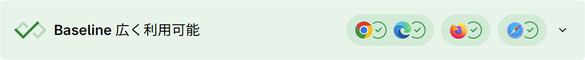
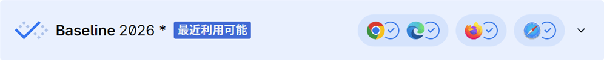
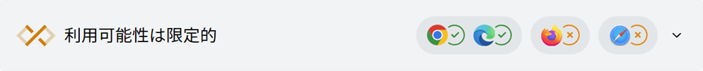

**Baseline** は、API、CSS プロパティ、JavaScript 構文など、主要なブラウザーにおけるウェブプラットフォーム機能の対応状況を特定するものです。Baseline では、ウェブ機能を「広く利用可能」または「最近利用可能」のどちらかで説明しています。Baseline の基準を満たさない機能については、「利用可能性は限定的」であるとします。

Baseline では、以下のブラウザーでの対応を考慮します。

- Apple Safari (iOS)
- Apple Safari (macOS)
- Google Chrome (Android)
- Google Chrome (デスクトップ)
- Microsoft Edge (デスクトップ)
- Mozilla Firefox (Android)
- Mozilla Firefox (デスクトップ)

Baseline は、ブラウザーの対応状況の概要です。アクセシビリティ、ユーザビリティ、パフォーマンス、セキュリティ、その他の検査の代わりとなるものではありません。Baseline では、以下の条件で機能が動作するかどうかは判別できない場合があります。

- 旧式の端末やブラウザーのバージョン
- オペレーティングシステムのウェブビューなど、ベースラインの定義が網羅していないブラウザー
- スクリーンリーダーなどの支援技術

## Baseline バッジ

**広く利用可能**と記載されている機能は、それぞれのベースラインブラウザーで、少なくとも 2.5 年間にわたり一貫して対応されてきた実績があります。

**最近利用可能**と記載されている機能は、それぞれのベースラインブラウザーの少なくとも最新の安定版では動作しますが、古いブラウザーや端末では動作しないことがあります。

**利用可能性は限定的**と記載されている機能は、現時点ではすべてのブラウザーで利用可能ではありません。

## 関連情報

- [テスト](/ja/docs/Learn_web_development/Extensions/Testing)
- [web-platform-dx/web-features repository](https://github.com/web-platform-dx/web-features)
- [W3C WebDX Community Group](https://www.w3.org/community/webdx/)
- [mdn/browser-compat-data repository](https://github.com/mdn/browser-compat-data)
- [caniuse.com](https://caniuse.com/)
- [a11ysupport.io](https://a11ysupport.io/)
