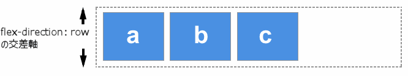
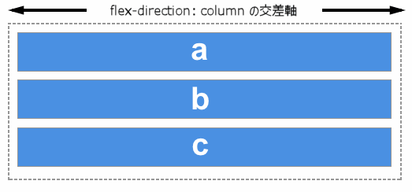

{{glossary("flexbox", "フレックスボックス")}} における交差軸 (cross axis / クロス軸) は、{{glossary("main axis", "主軸")}} (main axis / メイン軸) と交差する軸で、{{cssxref("flex-direction")}} が `row` または `row-reverse` であるとき (つまり主軸が行方向であるとき)、列方向の軸のことです。

主軸が `column` または `column-reverse` の場合は、交差軸は行方向となります。

交差軸方向のアイテムの配置は、フレックスコンテナーの `align-items` プロパティまたはアイテムの `align-self` プロパティによって行われます。交差軸方向に空間がある複数行のフレックスコンテナーでは、`align-content` を使って行の間を制御することができます。

## 関連情報

### プロパティリファレンス

- {{cssxref("align-content")}}
- {{cssxref("align-items")}}
- {{cssxref("align-self")}}
- {{cssxref("flex-wrap")}}
- {{cssxref("flex-direction")}}
- {{cssxref("flex")}}
- {{cssxref("flex-basis")}}
- {{cssxref("flex-flow")}}
- {{cssxref("flex-grow")}}
- {{cssxref("flex-shrink")}}
- {{cssxref("justify-content")}}
- {{cssxref("order")}}

### 参考文献

- CSS フレックスボックスガイド: _[フレックスボックスの基本概念](/ja/docs/Web/CSS/CSS_Flexible_Box_Layout/Basic_Concepts_of_Flexbox)_
- CSS フレックスボックスガイド: _[フレックスコンテナー内のアイテムの配置](/ja/docs/Web/CSS/CSS_Flexible_Box_Layout/Aligning_Items_in_a_Flex_Container)_
- CSS フレックスボックスガイド: _[フレックスアイテムの折り返しのマスター](/ja/docs/Web/CSS/CSS_Flexible_Box_Layout/Mastering_Wrapping_of_Flex_Items)_
- [用語集](/ja/docs/Glossary)

  - {{Glossary("Flex")}}
  - {{Glossary("Flex Container", "フレックスコンテナー")}}
  - {{Glossary("Flex Item", "フレックスアイテム")}}
  - {{Glossary("Grid", "グリッド")}}
