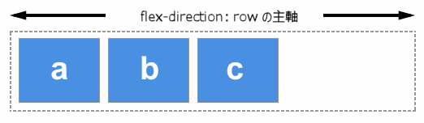
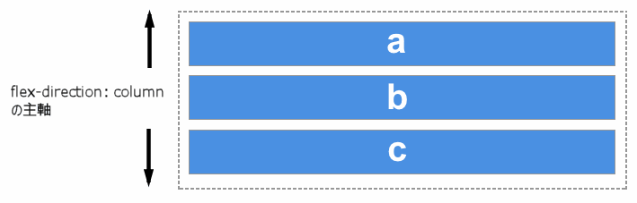

{{glossary("flexbox")}} における主軸は、{{cssxref("flex-direction")}} プロパティの設定方向によって定義されます。`flex-direction` が取り得る値は以下の 4 つです。

- `row`
- `row-reverse`
- `column`
- `column-reverse`

`row` または `row-reverse` を選んだ場合は、主軸はインライン要素の並ぶ方向に伸びる軸となります。

`column` または `column-reverse` を選んだ場合は、ページの上から下に向かってブロック要素の並ぶ方向に伸びる軸となります。

アイテムの `flex` プロパティを使って、フレックスアイテム自体が使える幅を指定することで、主軸に沿ったサイズを制御することができます。また、アイテム間そしてアイテムの周囲の空間については、`justify-content` プロパティを使って制御することができます。

## 関連情報

### プロパティリファレンス

- {{cssxref("flex-basis")}}
- {{cssxref("flex-direction")}}
- {{cssxref("flex-grow")}}
- {{cssxref("flex-shrink")}}
- {{cssxref("justify-content")}}
- {{cssxref("flex")}}

### 参考文献

- CSS フレックスボックスガイド: _[フレックスボックスの基本概念](/ja/docs/Web/CSS/CSS_Flexible_Box_Layout/Basic_Concepts_of_Flexbox)_
- CSS フレックスボックスガイド: _[フレックスコンテナー内のアイテムの配置](/ja/docs/Web/CSS/CSS_Flexible_Box_Layout/Aligning_Items_in_a_Flex_Container)_
- CSS フレックスボックスガイド: _[主軸に沿ったフレックスアイテムの比率の制御](/ja/docs/Web/CSS/CSS_Flexible_Box_Layout/Controlling_Ratios_of_Flex_Items_Along_the_Main_Ax)_
