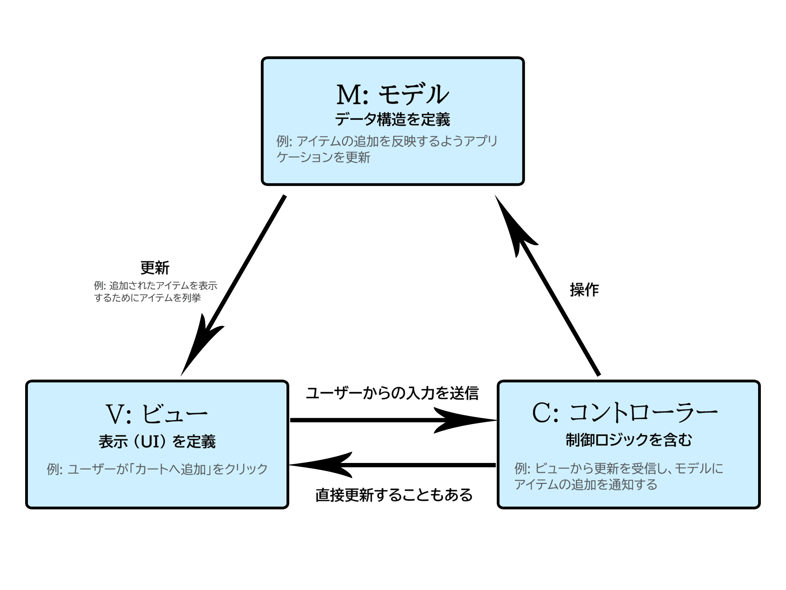

**MVC**（Model-View-Controller、モデル-ビュー-コントローラー）は、ソフトウェア設計のパターンです。 これは、ソフトウェアのビジネスロジックと表示の間の分離を強調します。 この「関心の分離」により、より良い労働の分業と改善されたメンテナンスが実現できます。MVVM（Model-View-Viewmodel、モデル-ビュー-ビューモデル）、MVP（Model-View-Presenter、モデル-ビュー-プレゼンター）、MVW（Model-View-Whatever、モデル-ビュー何でも）などの他のデザインパターンも MVC に基づいています。

MVC のソフトウェア設計パターンの 3 つの部分は、次のように記述できます。

1. モデル: データとビジネスロジックを管理します。
2. ビュー: レイアウトと表示を扱います。
3. コントローラー: コマンドをモデルとビューの間でルーティングします。

## MVC の例

単純な買い物リストアプリを想像してみてください。必要なものは、今週購入すべきそれぞれのアイテムの名前、数量、価格をまとめたリストだけです。以下、MVC を使用してこの機能の一部を実装する方法について記述します。

### M: モデル

モデルは、アプリがどのようなデータを保持すべきかを定義します。このデータの状態が変化した場合、モデルは通常、ビューに通知します（これにより、必要に応じて表示が更新されます）。また、更新されたビューを制御するために別のロジックが必要な場合は、コントローラーに通知することもあります。

先ほどの買い物リストアプリに戻ると、このモデルでは、リストアイテムにどのようなデータ（品目、価格など）が含まれているべきか、また、すでにどのようなリストアイテムが存在するかを定義します。

### V: ビュー

ビューは、アプリのデータをどのように表示すべきかを定義します。

この買い物リストアプリでは、ビューがリストをユーザーにどのように表示するかを定義し、モデルから表示のためのデータを受け取ります。

### C: コントローラー

コントローラーには、アプリのユーザーからの入力に応じて、モデルやビューを更新するロジックが含まれています。

例えば、買い物リストには、入力フォームやアイテムを追加・削除するためのボタンが配置されている場合があります。これらの操作を行うにはモデルを更新する必要があるため、入力データはコントローラーに送信されます。コントローラーはそれに応じてモデルを操作し、更新されたデータをビューに送信します。

ただし、データを別の形式で表示するためにビューを更新したい場合もあるかもしれません。例えば、アイテムの順序をアルファベット順に変更したり、価格の安い順から高い順に変更したりする場合です。この場合、コントローラーがモデルを更新することなく、直接処理を行うことがあります。

## ウェブにおける MVC

ウェブ開発者であれば、これまで意識的に使用したことがなくても、このパターンはおそらくお馴染みでしょう。データモデルは、何らかのデータベース（MySQL のような従来のサーバー側データベースであれ、[IndexedDB \[ja\]](/ja/docs/Web/API/IndexedDB_API) のようなクライアント側のソリューションであれ）に収められているはずです。アプリの制御コードはおそらく HTML や JavaScript で記述されており、インターフェイスはおそらく HTML や CSS、あるいはお好みの他の技術を使用して作成されていることでしょう。これは MVC によく似ていますが、MVC　ではこれらの要素がより厳格なパターンに従うようになっています。

ウェブの黎明期には、MVC アーキテクチャは主にサーバー側で実装されており、クライアントはフォームやリンクを介して更新をリクエストし、更新されたビューを受け取ってブラウザーに表示していました。しかし、最近では、クライアント側のデータストアの登場や、必要に応じてページの一部を更新できる[フェッチ API](/ja/docs/Web/API/Fetch_API) の普及により、ロジックの多くがクライアント側に移行しています。

[AngularJS](https://ja.wikipedia.org/wiki/AngularJS) や [Ember.js](https://en.wikipedia.org/wiki/Ember.js)(英語) といったウェブフレームワークは、すべて MVC アーキテクチャを実装しています。

## より詳しく知る

- [Model View Controller](https://ja.wikipedia.org/wiki/Model_View_Controller)（ウィキペディア）
