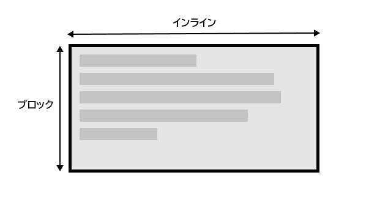
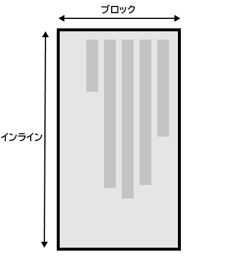

{{LearnSidebar}}{{PreviousMenuNext("Learn/CSS/Building_blocks/Backgrounds_and_borders", "Learn/CSS/Building_blocks/Overflowing_content", "Learn/CSS/Building_blocks")}}

CSS の学習でこれまでに遭遇したプロパティと値の多くは、画面の物理的な大きさに関係しています。たとえば、ボックスの上下左右に border を作成します。これらの物理的大きさは、水平に表示されるコンテンツに非常にきちんとマッピングされ、デフォルトでは、ウェブは右から左への言語（アラビア語など）よりも左から右への言語（英語やフランス語など）をサポートする傾向があります。

しかし近年、CSS は、右から左へのコンテンツや上から下へのコンテンツ（日本語など）を含むコンテンツのさまざまな方向性をより適切にサポートするために進化しました。これらのさまざまな方向性は**書き込みモード**と呼ばれます。学習を進めてレイアウトの操作を開始すると、書き込みモードを理解することが非常に役立ちます。そのため、これらのモードを紹介します。

| 前提条件: | 基本的なコンピューターリテラシー、[基本的なソフトウェアがインストールされている](/ja/Learn/Getting_started_with_the_web/Installing_basic_software)こと、[ファイルの扱い](/ja/Learn/Getting_started_with_the_web/Dealing_with_files)、HTML の基本（[HTML 入門](/ja/docs/Learn/HTML/Introduction_to_HTML)）および CSS に関するアイデア（[CSS の第一歩](/ja/docs/Learn/CSS/First_steps)）に関する基本的な知識を得ている。 |
| --------- | ---------------------------------------------------------------------------------------------------------------------------------------------------------------------------------------------------------------------------------------------------------------------------------------------------------------------------------------------------------------------------------------------------------------------- |
| 目的:     | 最新の CSS の "writing modes" の重要性を理解する。                                                                                                                                                                                                                                                                                                                                                                     |

## 書き込みモードとは？

CSS の書き込みモードは、テキストが水平方向または垂直方向のどちらで実行されているかを示します。{{cssxref("writing-mode")}} プロパティにより、ある書き込みモードから別の書き込みモードに切り替えることができます。これを行うために縦書きモードを使用する言語で作業する必要はありません。また、創造的な目的のためにレイアウトの一部の書き込みモードを変更することもできます。

次の例では、`writing-mode: vertical-rl`を使用して見出しを表示しています。これで、テキストが垂直方向に実行されます。縦書きテキストはグラフィックデザインでは一般的であり、Web デザインにより興味深い外観を追加する方法になります。

{{EmbedGHLiveSample("css-examples/learn/writing-modes/simple-vertical.html", '100%', 800)}}

[`writing-mode`](/ja/docs/Web/CSS/writing-mode) プロパティの 3 つの可能な値は次のとおりです:

- `horizontal-tb`: 上から下へのブロックの流れの方向。文は水平に実行されます。
- `vertical-rl`: 右から左へのブロックの流れの方向。文は垂直に実行されます。
- `vertical-lr`: 左から右へのブロックの流れの方向。文は垂直に実行されます。

したがって、`writing-mode`プロパティは、実際には、ページにブロックレベルの要素が表示される方向（上から下、右から左、または左から右）を設定します。これにより、文章内のテキストの流れが決まります。

## "writing modes" と ブロックレイアウトとインラインレイアウト

[ブロックとインラインのレイアウト](/ja/docs/Learn/CSS/Building_blocks/The_box_model)、およびいくつかの要素がブロック要素として表示され、他の要素がインライン要素として表示されるという事実についてはすでに説明しました。上で説明したように、ブロックとインラインは、物理的な画面ではなく、ドキュメントの書き込みモードに関連付けられています。英語などのテキストを水平方向に表示する書き込みモードを使用している場合、ブロックはページの上から下にのみ表示されます。

例を見れば、これはより明確になります。この次の例では、見出しと段落を含む 2 つのボックスがあります。 1 つ目は、`writing-mode: horizontal-tb`を使用します。これは、水平にページの上部から下部に向かって書き込まれる書き込みモードです。 2 番目は`writing-mode: vertical-rl`を使用します;これは、垂直に右から左に書き込まれる書き込みモードです。

{{EmbedGHLiveSample("css-examples/learn/writing-modes/block-inline.html", '100%', 1200)}}

書き込みモードを切り替えると、ブロックの方向とインラインの方向が変更されます。 `horizontal-tb`書き込みモードでは、ブロックの方向は上から下に向かっています。 `vertical-rl`書き込みモードでは、ブロックの方向は右から左に水平に実行されます。したがって、**block dimension** は常に、使用中の書き込みモードでページにブロックが表示される方向です。 **inline dimension**は、常に文が流れる方向です。

この図は、横書きモードでの 2 つの dimensions を示しています。

この図は、縦書きモードの 2 つの dimensions を示しています。

CSS レイアウト、特に新しいレイアウトメソッドを検討し始めると、このブロックとインラインの考え方が非常に重要になります。後で再検討します。

### 方向

書き込みモードに加えて、テキストの方向もあります。上記のように、アラビア語などの一部の言語は水平に書かれていますが、右から左に書かれています。これは、創造的な意味で使用する可能性のあるものではありません。単に右側に何かを並べたい場合は、他の方法もありますが、CSS の性質の一部としてこれを理解することが重要です。 Web は、左から右に表示される言語専用ではありません！

書き込みモードとテキストの方向が変更される可能性があるため、新しい CSS レイアウトメソッドは、左右、上下を参照しません。代わりに、インラインとブロックのこのアイデアとともに、開始と終了について話します。心配する必要はありませんが、レイアウトを見始めるときにはこれらのアイデアに留意してください。 CSS を理解する上で非常に役立ちます。

## 論理プロパティと値

ただし、学習のこの時点で書き込みモードと方向を記述することについて説明する理由は、私たちはすでに、画面の物理的な大きさに関連付けられた多くのプロパティを見ており、横書きモードのときに最も意味があるという事実のためです

2 つのボックスをもう一度見てみましょう。1 つは `horizontal-tb` の書き込みモード、もう 1 つは `vertical-rl`です。これらの両方のボックスに {{cssxref("width")}} を指定しました。ボックスが縦書きモードでも width があるため、テキストがオーバーフローすることがわかります。

{{EmbedGHLiveSample("css-examples/learn/writing-modes/width.html", '100%', 1200)}}

このシナリオで本当に必要なのは、書き込みモードに合わせて基本的に height と width を入れ替えることです。縦書きモードのときは、横書きモードの場合と同じように、ボックスをブロックのディメンションで拡大したいです。

これを簡単にするために、CSS は最近マッピングされたプロパティのセットを開発しました。これらは本質的に、物理的なプロパティ（`width` や `height` など）を**論理的な**、または**フローに関連する**バージョンに置き換えます。

横書きモードで`width`にマップされるプロパティは{{cssxref("inline-size")}} と呼ばれます。これはインラインディメンションのサイズを参照します。`height`のプロパティの名前は{{cssxref("block-size")}} で、ブロックディメンションのサイズです。`width`を`inline-size`に置き換えた以下の例で、これがどのように機能するかを見ることができます。

{{EmbedGHLiveSample("css-examples/learn/writing-modes/inline-size.html", '100%', 1200)}}

### 論理マージン、ボーダー、パディングのプロパティ

最後の 2 つのレッスンでは、CSS のボックスモデルと CSS のボーダーについて学びました。マージン、ボーダー、およびパディングのプロパティには{{cssxref("margin-top")}}, {{cssxref("padding-left")}}, および {{cssxref("border-bottom")}} があります。width と height のマッピングと同じ方法で、これらのプロパティのマッピングがあります。

`margin-top`プロパティは{{cssxref("margin-block-start")}}にマップされます—これは常にブロックディメンションの先頭のマージンを参照します。

{{cssxref("padding-left")}}プロパティは、インライン方向の開始に適用されるパディングである{{cssxref("padding-inline-start")}}にマップされます。これは、その書き込みモードで文章が始まる場所です。 {{cssxref("border-bottom")}} プロパティは、{{cssxref("border-block-end")}}にマップされます。これは、ブロックディメンションの最後のボーダーです。

以下の物理的特性と論理的特性の比較を見ることができます。

`.box`の`writing-mode`プロパティを`vertical-rl`に切り替えてボックスの書き込みモードを変更すると、物理プロパティが物理方向にどのように関連付けられているかがわかりますが、論理プロパティは書き込みモードで切り替わります。

また、 {{htmlelement("h2")}} には黒い `border-bottom`があることがわかります。両方のライティングモードで、下の境界線が常にテキストの下に来るようにする方法を見つけられますか？

{{EmbedGHLiveSample("css-examples/learn/writing-modes/logical-mbp.html", '100%', 1200)}}

個々のボーダーロングハンドをすべて考慮すると、膨大な数のプロパティがあり、[論理プロパティと値](/ja/docs/Web/CSS/CSS_Logical_Properties)の MDN ページですべてのマッピングプロパティを確認できます。

### 論理値

これまで、論理プロパティ名について見てきました。また、`top`, `right`, `bottom`, および `left`の物理値をとるプロパティもあります。これらの値には、論理値（`block-start`, `inline-end`, `block-end`, および `inline-start`）へのマッピングもあります。

たとえば、画像を左にフロートさせて、画像の周りにテキストを折り返すことができます。以下の例に示すように、`left`を`inline-start`に置き換えることができます。

**この例の書き込みモードを`vertical-rl`に変更して、画像がどうなるかを確認します。 `inline-start`を`inline-end`に変更して、フロートを変更します。**

{{EmbedGHLiveSample("css-examples/learn/writing-modes/float.html", '100%', 1200)}}

ここでは、書き込みモードが何であってもマージンが正しい場所にあることを保証するために、論理マージン値も使用しています。

### 物理的または論理的なプロパティを使うべきか？

論理的なプロパティと値は、物理的に同等のものよりも新しいため、ブラウザーにはごく最近実装されました。 MDN の任意のプロパティページをチェックして、ブラウザーサポートがどの程度前にサポートしているかを確認できます。複数の書き込みモードを使用していない場合は、現時点では物理バージョンを使用することをお勧めします。ただし、フレックスボックスやグリッドなどのレイアウトメソッドの処理を開始すると、多くの人が理にかなっているため、最終的にはほとんどの場合、人々は論理バージョンに移行することを期待しています。

## まとめ

このレッスンで説明する概念は、CSS でますます重要になっています。ブロックとインラインの方向、および書き込みモードの変更に伴うテキストフローの変化を理解することは、今後非常に役立ちます。水平モード以外の書き込みモードを使用しない場合でも、CSS を理解するのに役立ちます。

次のモジュールでは、CSS のオーバーフローについて詳しく見ていきます。

{{PreviousMenuNext("Learn/CSS/Building_blocks/Backgrounds_and_borders", "Learn/CSS/Building_blocks/Overflowing_content", "Learn/CSS/Building_blocks")}}

## このモジュール

1. [カスケードと継承](/ja/docs/Learn/CSS/Building_blocks/Cascade_and_inheritance)
2. [CSS セレクター](/ja/docs/Learn/CSS/Building_blocks/Selectors)

    - [要素・クラス・ID によるセレクター](/ja/docs/Learn/CSS/Building_blocks/Selectors/Type_Class_and_ID_Selectors)
    - [属性によるセレクター](/ja/docs/Learn/CSS/Building_blocks/Selectors/Attribute_selectors)
    - [擬似クラスおよび疑似要素によるセレクター](/ja/docs/Learn/CSS/Building_blocks/Selectors/Pseudo-classes_and_pseudo-elements)
    - [結合子](/ja/docs/Learn/CSS/Building_blocks/Selectors/Combinators)

3. [ボックスモデル](/ja/docs/Learn/CSS/Building_blocks/The_box_model)
4. [背景と枠線](/ja/docs/Learn/CSS/Building_blocks/Backgrounds_and_borders)
5. [テキスト方向の操作](/ja/docs/Learn/CSS/Building_blocks/Handling_different_text_directions)
6. [要素のはみ出し（オーバーフロー）](/ja/docs/Learn/CSS/Building_blocks/Overflowing_content)
7. [CSS の値と単位](/ja/docs/Learn/CSS/Building_blocks/Values_and_units)
8. [CSS によるサイズ設定](/ja/docs/Learn/CSS/Building_blocks/Sizing_items_in_CSS)
9. [画像・メディア・フォーム要素](/ja/docs/Learn/CSS/Building_blocks/Images_media_form_elements)
10. [表のスタイリング](/ja/docs/Learn/CSS/Building_blocks/Styling_tables)
11. [CSS のデバッグ](/ja/docs/Learn/CSS/Building_blocks/Debugging_CSS)
12. [CSS の整理](/ja/docs/Learn/CSS/Building_blocks/Organizing)
