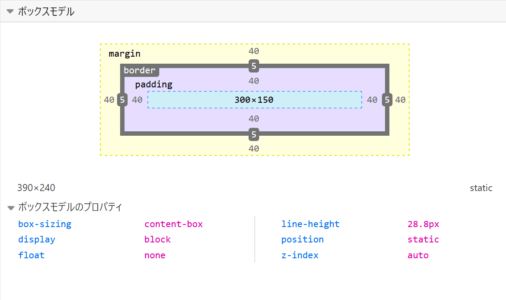

{{LearnSidebar}}{{PreviousMenuNext("Learn/CSS/Building_blocks/Selectors/Combinators", "Learn/CSS/Building_blocks/Backgrounds_and_borders", "Learn/CSS/Building_blocks")}}

CSS にはボックスの概念があり、これを理解することは CSS でレイアウトを作成したりアイテム同士を揃えたりするためのコツとなります。このレッスンでは CSS ボックスモデルを詳しく解説し、その仕組みと関連する用語を理解することでより複雑なレイアウトができるようにします。

| 前提条件: | 基本的なコンピューターリテラシー、[基本的なソフトウェアがインストールされている](/ja/Learn/Getting_started_with_the_web/Installing_basic_software)こと、[ファイルの扱い](/ja/Learn/Getting_started_with_the_web/Dealing_with_files)、HTML の基本 ([HTML 入門](/ja/docs/Learn/HTML/Introduction_to_HTML)) および CSS に関するアイデア ([CSS の第一歩](/ja/docs/Learn/CSS/First_steps)) に関する基本的な知識を得ている。 |
| --------- | ---------------------------------------------------------------------------------------------------------------------------------------------------------------------------------------------------------------------------------------------------------------------------------------------------------------------------------------------------------------------------------------------------------------------- |
| 目的:     | CSS のボックスモデルとその構成要素、代替モデルへの切り替えについて学ぶ。                                                                                                                                                                                                                                                                                                                                               |

## ブロックボックスとインラインボックス

CSS には、**ブロックボックス**と**インラインボックス**の 2 種類のボックスがあります。これらの特性は、ページフローの観点から、およびページ上の他のボックスとの関係でボックスがどのように動作するかを示します。

ボックスがブロックとして定義されている場合、次のように動作します:

- ボックスはインライン方向に伸びて、コンテナで使用可能なスペースを埋めます。 ほとんどの場合、これは、ボックスが container と同じ幅になり、使用可能なスペースの 100% を占めることを意味します。
- ボックスは新しい行に分割されます。
- {{cssxref("width")}} と {{cssxref("height")}} のプロパティが尊重されます。
- padding、margin および border により、他の要素がボックスから遠ざけられます。

表示タイプをインラインに変更することを決定しない限り、デフォルトでは見出し (例: `<h1>`) や `<p>` などの要素はすべて外部表示タイプとして `block` を使用します。

ボックスの外側の表示タイプが `inline` の場合:

- ボックスは改行されません。
- {{cssxref("width")}} と {{cssxref("height")}} のプロパティは適用されません。
- padding、margin および border が適用されますが、他のインラインボックスがボックスから移動することはありません。

リンクに使用される `<a>` 要素や、`<span>`、`<em>` および `<strong>` はすべて、デフォルトではインラインで表示される要素の例です。

要素に適用されるボックスのタイプは、`block` や `inline` などの {{cssxref("display")}} プロパティ値によって定義され、`display` の**外側**の値に関連します。

## 余談: 内側と外側の表示タイプ

この時点で、**内側**と**外側**の表示タイプについても説明するべきでしょう。上記のように、CSS のボックスには*外側*の表示タイプがあり、ボックスがブロックかインラインかを詳細に示します。

ただし、ボックスには内部表示タイプもあり、これにより、そのボックス内の要素のレイアウト方法が決まります。デフォルトでは、ボックス内の要素は**[通常のフロー](/ja/docs/Learn/CSS/CSS_layout/Normal_Flow)**でレイアウトされます。つまり、他のブロック要素やインライン要素と同じように動作します（上記で説明したように）。

ただし、`flex` などの `display` の値を使用して、内部の表示タイプを変更できます。要素に `display: flex;` を設定する場合、外側の表示タイプは `block` ですが、内側の表示タイプは `flex` に変更されます。このボックスの直接の子要素はすべてフレックスアイテムになり、[Flexbox](/ja/docs/Learn/CSS/CSS_layout/Flexbox) 仕様で規定されているルールに従ってレイアウトされます。これについては後で学習します。

> **メモ:** ディスプレイの値、およびブロックおよびインラインレイアウトでのボックスの動作の詳細については、[ブロックおよびインラインレイアウト](/ja/docs/Web/CSS/CSS_Flow_Layout/Block_and_Inline_Layout_in_Normal_Flow)に関する MDN ガイドを参照してください。

CSS レイアウトについてさらに詳しく学習すると、`flex` や、例えば [`grid`](/ja/docs/Learn/CSS/CSS_layout/Grids) のようなボックスに設定できる他のさまざまな内部の値と出会うでしょう。

ただし、ブロックおよびインラインレイアウトは、ウェブ上のデフォルトの動作です。前述のように、*通常のフロー*と呼ばれることもあります。他の指示がない場合、ボックスはブロックまたはインラインボックスとしてレイアウトされるためです。

## さまざまな表示タイプの例

次に進み、いくつかの例を見てみましょう。以下に、3 つの異なる HTML 要素があります。これらはすべて、外部表示タイプの `block` を持っています。1 つ目は段落で、CSS で border が追加されています。ブラウザーはこれを block box としてレンダリングするため、段落は新しい行で始まり、利用可能な全幅に拡張されます。

2 番目はリストで、これは `display：flex` を使用してレイアウトされます。これにより、コンテナ内のアイテムのフレックスレイアウトが確立されますが、リスト自体は block box であり、段落と同様に、container の幅いっぱいに拡張され、新しい行に分割されます。

この下にブロックレベルの段落があり、その中に 2 つの `<span>` 要素があります。通常、これらの要素は `inline` ですが、要素の 1 つにブロックのクラスがあり、`display: block` に設定しました。

{{EmbedGHLiveSample("css-examples/learn/box-model/block.html", '100%', 1000)}}

この次の例では、`inline` 要素の動作を確認できます。最初の段落の `<span>` はデフォルトではインラインのため、強制的に改行しません。

また、`display: inline-flex` に設定された `<ul>` 要素があり、一部の flex アイテムの周りにインラインボックスを作成します。

最後に、`display: inline` に設定された 2 つの段落があります。inline flex container と段落はすべて、ブロックレベルの要素として表示されている場合のように新しい行に分割されるのではなく、1 行で一緒に実行されます。

**この例では、`display: inline` を `display: block` に、または`display: inline-flex` を `display: flex` に変更して、これらの表示モードの間を切り替えられます。**

{{EmbedGHLiveSample("css-examples/learn/box-model/inline.html", '100%', 1000)}}

これらのレッスンの後半では、フレックスレイアウトなどの問題と出会います。現時点で覚えておくべき重要な点は、`display` プロパティの値を変更すると、ボックスの外側の表示タイプがブロックかインラインかを変更できるため、レイアウト内の他の要素と一緒に表示する方法が変わることです。

レッスンの残りの部分では、外側のディスプレイタイプに集中します。

## CSS のボックスモデルとは？

完全な CSS ボックスモデルはブロックボックスに適用され、インラインボックスはボックスモデルで定義された動作の一部のみを使用します。 モデルは、ボックスのさまざまな部分 (マージン、ボーダー、パディング、コンテンツ) がどのように連携してページに表示できるボックスを作成するかを定義します。 さらに複雑さを追加するために、標準および代替ボックスモデルがあります。

### ボックスの構成

CSS でブロックボックスを構成するには、次のものがあります。

- **Content box**: コンテンツが表示される領域。{{cssxref ("width")}} や {{cssxref("height")}} などのプロパティを使用してサイズを変更できます。
- **Padding box**: パディングはコンテンツの周囲に空白として配置されます。 そのサイズは {{cssxref ("padding")}} および関連するプロパティを使用して制御できます。
- **Border box**: 境界ボックスは、コンテンツとパディングをラップします。そのサイズとスタイルは、{{cssxref ("border")}} および関連するプロパティを使用して制御できます。
- **Margin box**: マージンは最も外側のレイヤーで、このボックスと他の要素の間の空白としてコンテンツ、パディング、および境界線をラップします。そのサイズは、{{cssxref ("margin")}} および関連するプロパティを使用して制御できます。

以下の図は、これらのレイヤーを示しています:

### CSS ボックスモデルの標準

標準のボックスモデルでは、ボックスに `width` と `height` を指定すると、*コンテンツボックス*の幅と高さが定義されます。 次に、すべての padding と border がその幅と高さに追加され、ボックスが占める合計サイズが取得されます。 これを下の画像に示します。

ボックスに `width`、`height`、`margin`、`border` および `padding` を定義する次の CSS があると仮定した場合:

```css
.box {
  width: 350px;
  height: 150px;
  margin: 25px;
  padding: 25px;
  border: 5px solid black;
}
```

標準のボックスモデルを使用してボックスが占めるスペースは、実際には 410px (350 + 25 + 25 + 5 + 5) で、高さは 210px (150 + 25 + 25 + 5 + 5) であり、padding と border は コンテンツボックスに使用される幅に追加されます。

> **メモ:** マージンは、ボックスの実際のサイズにはカウントされません。確かに、ボックスがページ上で占める合計スペースに影響しますが、ボックスの外側のスペースにのみ影響します。ボックスの領域は境界線で停止します—マージンまでは達しません。

### CSS ボックスモデルの代替

ボックスの実際のサイズを取得するために border と padding を追加する必要があるのはかなり不便だと思うかもしれませんが、正しい感覚でしょう！このため、CSS には、標準ボックスモデルのしばらく後に導入された代替ボックスモデルがありました。このモデルを使用すると、幅はページ上の表示ボックスの幅になるため、コンテンツ領域の幅は、その幅からパディングとボーダーの幅を引いたものになります。上記と同じ CSS を使用すると、以下の結果が得られます (幅 = 350px、高さ = 150px)。


デフォルトでは、ブラウザーは、標準のボックスモデルを使用します。もし要素に対して代替モデルをオンにしたい場合は、`box-sizing: border-box` を設定することでそうできます。これにより、設定した任意のサイズで定義された領域として境界ボックスを取るようにブラウザーに指示しています。

```css
.box {
  box-sizing: border-box;
}
```

すべての要素で代替ボックスモデルを使用することを望み、かつこれが開発者の間で一般的な選択である場合、以下のスニペットで見られるように、`<html>` 要素で `box-sizing` プロパティを設定して、他のすべての要素でその値を継承するように設定してください。この背景にある考え方を理解したい場合は、[ボックスサイズ設定に関する CSS トリック](https://css-tricks.com/inheriting-box-sizing-probably-slightly-better-best-practice/)の記事を参照してください。

```css
html {
  box-sizing: border-box;
}
*,
*::before,
*::after {
  box-sizing: inherit;
}
```

> **メモ:** 興味深い歴史 — Internet Explorer は以前は代替ボックスモデルにデフォルト設定されていましたが、切り替え可能なメカニズムはありませんでした。

## ボックスモデルを試してみる

以下の例では、2 つのボックスを見ることができます。両方とも `.box` のクラスを持ち、同じ `width`、`height`、`margin`、`border`、および`padding` を提供します。唯一の違いは、2 番目のボックスが代替ボックスモデルを使用するように設定されていることです。

**2 番目のボックスのサイズを変更 (`.alternate` クラスに CSS を追加) して、幅と高さを最初のボックスに一致させることはできますか？**

{{EmbedGHLiveSample("css-examples/learn/box-model/box-models.html", '100%', 1000)}}

> **メモ:** [ここ](https://github.com/mdn/css-examples/blob/master/learn/solutions.md#the-box-model)でこのタスクの解決策を見つけることができます。

### ブラウザーの開発ツールを利用して、ボックスモデルを見てみる

[ブラウザー開発ツール](/ja/docs/Learn/Common_questions/What_are_browser_developer_tools)を使用すると、ボックスモデルをとても簡単に理解できます。Firefox の DevTools で要素を調べると、要素のサイズに加えて、margin、padding、border を確認できます。 この方法で要素を検査することは、あなたのボックスが本当にあなたが思っているサイズであるかどうかを知る素晴らしい方法です！



## Margins、padding および borders

上記の例では、{{cssxref ("margin") }}、{{cssxref ("padding") }} および{{cssxref ("border") }} のプロパティが動作しているのを見てきました。 この例で使用されるプロパティは **shorthands** であり、ボックスの 4 辺すべてを一度に設定できます。これらの shorthands には、同等の longhand プロパティもあり、ボックスのさまざまな側面を個別に制御できます。

これらのプロパティをさらに詳しく見てみましょう。

### マージン

マージンは、ボックスの周りの見えないスペースです。 他の要素をボックスから遠ざけます。 マージンには正または負の値を設定できます。 ボックスの片側に負のマージンを設定すると、ページ上の他の部分と重なる場合があります。 標準または代替のボックスモデルを使用しているかどうかにかかわらず、表示ボックスのサイズが計算された後、マージンは常に追加されます。

{{cssxref ("margin") }} プロパティを使用して要素のすべてのマージンを一度に制御するか、同等の longhand properties を使用して各辺を個別に制御できます。

- {{cssxref("margin-top")}}
- {{cssxref("margin-right")}}
- {{cssxref("margin-bottom")}}
- {{cssxref("margin-left")}}

**次の例では、マージン値を変更して、この要素と含まれる要素の間のスペース (負のマージンの場合) を作成または削除するマージンのためにボックスがどのように押し出されるかを確認してください。**

{{EmbedGHLiveSample("css-examples/learn/box-model/margin.html", '100%', 1000)}}

#### マージンの相殺

マージンについて理解する重要なことは、マージンの相殺の概念です。 マージンが接する 2 つの要素が あり、両方のマージンが正の場合、それらのマージンは結合して 1 つのマージンになります。これは、個々のマージンのうちの最大サイズです。一方または両方のマージンが負の場合、負の値の量が合計から差し引かれます。

以下の例では、2 つの段落があります。 上の段落には、50 ピクセルの `margin-bottom` があります。2 番目の段落の `margin-top` は 30 ピクセルです。マージンは一緒に折りたたまれているため、ボックス間の実際のマージンは 50 ピクセルであり、2 つのマージンの合計ではありません。

**これをテストするには、第二段落の `margin-top` を 0 に設定します。2 つの段落間のマージンは変更されません。第一段落の `margin-bottom` に設定された 50 ピクセルを保持します。-10px に設定すると、全体のマージンが 40px になることがわかります— 50px から差し引かれま**す。

{{EmbedGHLiveSample("css-examples/learn/box-model/margin-collapse.html", '100%', 1000)}}

マージンが相殺される場合と相殺されない場合を規定する多くのルールがあります。 詳細については、[マージンの相殺](/ja/docs/Web/CSS/CSS_Box_Model/Mastering_margin_collapsing)に関する詳細ページをご覧ください。現時点で覚えておくべき主なことは、マージンの相殺が起こることです。マージンによるスペースを作成していて、期待したスペースが得られない場合、おそらくこれが起こっています。

### Borders

border は、ボックスの margin と padding の間に描かれます。標準ボックスモデルを使用している場合、border のサイズがボックスの `width` と `height` に追加されます。代替ボックスモデルを使用している場合、border のサイズが利用可能な `width` と `height` の一部を占めるため、コンテンツボックスが小さくなります。

border のスタイル設定には、多数のプロパティがあります。4 つの border があり、各 border には、操作したいスタイル、width、color があります。

{{cssxref("border")}} プロパティを使用して、4 つすべての border の width、color およびスタイルを一度に設定できます。

各辺のスタイルを個別に設定するには、次を使用できます:

- {{cssxref("border-top")}}
- {{cssxref("border-right")}}
- {{cssxref("border-bottom")}}
- {{cssxref("border-left")}}

すべての辺の幅、スタイル、色を設定するには、次を使用します:

- {{cssxref("border-width")}}
- {{cssxref("border-style")}}
- {{cssxref("border-color")}}

片側の色、スタイル、または width を設定するには、最もきめ細かい longhand プロパティのいずれかを使用できます:

- {{cssxref("border-top-width")}}
- {{cssxref("border-top-style")}}
- {{cssxref("border-top-color")}}
- {{cssxref("border-right-width")}}
- {{cssxref("border-right-style")}}
- {{cssxref("border-right-color")}}
- {{cssxref("border-bottom-width")}}
- {{cssxref("border-bottom-style")}}
- {{cssxref("border-bottom-color")}}
- {{cssxref("border-left-width")}}
- {{cssxref("border-left-style")}}
- {{cssxref("border-left-color")}}

**以下の例では、さまざまなショートハンドとロングハンドを使用して border を作成しています。 さまざまなプロパティを試して、それらがどのように機能するか理解していることを確認してください。border プロパティの MDN ページには、選択可能なさまざまな border スタイルに関する情報が表示されます。**

{{EmbedGHLiveSample("css-examples/learn/box-model/border.html", '100%', 1000)}}

### パディング

padding は、border とコンテンツ領域の間にあります。margin とは異なり、負の量の padding はできないため、値は 0 または正の値でなければなりません。要素に適用された背景は padding の背後に表示され、通常は border からコンテンツ遠ざけるために使用されます。

{{cssxref("padding")}} プロパティを使用して要素の各側の padding を個別に制御するか、同等のロングハンドプロパティを使用して各側を個別に制御できます。

- {{cssxref("padding-top")}}
- {{cssxref("padding-right")}}
- {{cssxref("padding-bottom")}}
- {{cssxref("padding-left")}}

**以下の例で `.box` クラスの padding の値を変更すると、ボックスに関連してテキストの開始位置が変わることがわかります。**

**`.container` クラスの padding を変更することもできます。これにより、container とボックスの間にスペースができます。padding は任意の要素で変更でき、border と要素内にあるものとの間にスペースを作ります。**

{{EmbedGHLiveSample("css-examples/learn/box-model/padding.html", '100%', 800)}}

## ボックスモデルとインラインボックス

上記のすべては、ブロックボックスに完全に適用されます。一部のプロパティは`<span>` 要素によって作成されたものなどの、インラインボックスにも適用できます。

以下の例では、段落内に `<span>` があり、`width`、`height`、`margin`、`border` および `padding` が適用されています。width と height が無視されていることがわかります。マージン、パディング、ボーダーは尊重されますが、他のコンテンツとインラインボックスの関係は変わらないため、パディングとボーダーは段落内の他の単語と重なります。

{{EmbedGHLiveSample("css-examples/learn/box-model/inline-box-model.html", '100%', 800)}}

## display: inline-block を使用する

`display` には特別な値があり、`inline` と `block` の中間に位置するものを提供します。これは、アイテムを新しい行に分割したくないが、`width` と `height` を尊重し、上記の上書きを避けたい場合に便利です。

`display: inline-block` を持つ要素は、私たちがすでに知っているブロックのサブセットを実行します:

- `width` と `height` のプロパティが尊重されます。
- padding、margin、および border により、他の要素がボックスから遠ざけられます。

ただし、新しい行に分割されることはなく、`width` プロパティと `height` プロパティを明示的に追加した場合にのみ、コンテンツよりも大きくなります。

次の例では、`<span>` 要素に `display: inline-block` を追加しました。これを `display: block` 変更したり、行を完全に削除したりして、表示モデルの違いを確認してください。

{{EmbedGHLiveSample("css-examples/learn/box-model/inline-block.html", '100%', 800)}}

これが役立つのは、padding を追加して、リンクのヒット領域を大きくしたい場合です。`<a>` は `<span>` のようなインライン要素です。 `display：inline-block` を使用して padding を設定できるようにし、ユーザーがリンクをクリックしやすくします。

これはナビゲーションバーにかなり頻繁に表示されます。以下のナビゲーションは、flexbox を使用して行に表示され、`<a>` にカーソルを合わせたときに背景色を変更できるように、`<a>` 要素に padding を追加しました。padding は、`<ul>` 要素の border に重なるように見えます。これは、`<a>`がインライン要素であるためです。

**`display: inline-block` を `.links-list a` セレクターを使用してルールに追加すると、padding が他の要素によって尊重されるようにすることで、この問題がどのように修正されるかがわかります。**

{{EmbedGHLiveSample("css-examples/learn/box-model/inline-block-nav.html", '100%', 600)}}

## まとめ

以上が、ボックスモデルについて理解する必要があるほとんどのことです。レイアウト内の大きなボックスの大きさについて混乱している場合は、このレッスンに戻ってください。

次のレッスンでは[背景とボーダー](/ja/docs/Learn/CSS/Building_blocks/Backgrounds_and_borders)を使用してプレーンボックスをより面白くする方法を見ていきます。

{{PreviousMenuNext("Learn/CSS/Building_blocks/Selectors/Combinators", "Learn/CSS/Building_blocks/Backgrounds_and_borders", "Learn/CSS/Building_blocks")}}
