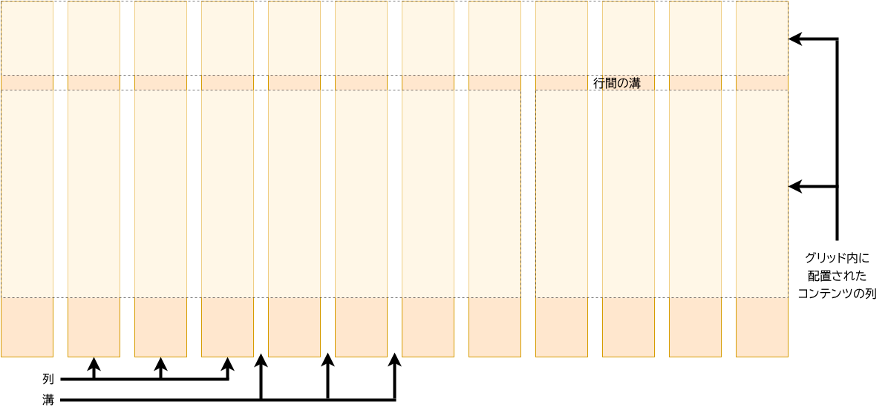

{{LearnSidebar}}{{PreviousMenuNext("Learn/CSS/CSS_layout/Flexbox", "Learn/CSS/CSS_layout/Floats", "Learn/CSS/CSS_layout")}}

CSS グリッドレイアウト（Grid Layout）は、ウェブ用の 2 次元レイアウトシステムです。 これにより、コンテンツを行と列にレイアウトすることができ、複雑なレイアウトを簡単に構築できるようにする多くの機能があります。 この記事では、ページレイアウトを始めるために知っておくべきことをすべて説明します。

| 前提知識: | HTML の基本（[HTML 入門](/ja/docs/Learn/HTML/Introduction_to_HTML)を学ぶ）、および CSS の機能の考え方（[CSS 入門](/ja/docs/Learn/CSS/Introduction_to_CSS)と[ボックスの装飾](/ja/docs/Learn/CSS/Styling_boxes)を学ぶ）。 |
| --------- | ----------------------------------------------------------------------------------------------------------------------------------------------------------------------------------------------------------------------- |
| 学習目標: | グリッドレイアウトシステムの背後にある基本概念と、CSS グリッドを使用してグリッドレイアウトを実装する方法を理解すること。                                                                                                |

## グリッドレイアウトとは？

グリッドとは、水平方向と垂直方向のラインを集めたもので、デザイン要素を並べて表示することができます。 ページ間を移動するときに要素が跳び回ったり幅が変わったりしないようなデザインを作成するのに役立ちます。 これにより、ウェブサイトの一貫性が向上します。

グリッドには通常、列（**column**）、行（**row**）、そしてそれぞれの行と列の間のギャップ（通常はガター（**gutter**）と呼ばれます）があります。



## CSS でグリッドを作りましょう

デザインに必要なグリッドを決定したら、CSS グリッドレイアウトを使用して CSS でそのグリッドを作成し、その上に項目を配置できます。 最初にグリッドレイアウトの基本機能を見てから、プロジェクト用のシンプルなグリッドシステムを作成する方法を探ります。

The following video provides a nice visual explanation of using CSS Grid:

{{EmbedYouTube("KOvGeFUHAC0")}}

### グリッドを定義する

出発点として、テキストエディタとブラウザーで[出発点ファイル](https://github.com/mdn/learning-area/blob/master/css/css-layout/grids/0-starting-point.html)をダウンロードして開きます（[ここでライブを見る](https://mdn.github.io/learning-area/css/css-layout/grids/0-starting-point.html)こともできます）。 いくつかの子項目を持つコンテナの例が表示されます。 デフォルトではこれらは通常フローで表示されるので、ボックスは上下に表示されます。 このレッスンの最初の部分でこのファイルを使用して、グリッドのふるまいを確認するための変更を加えます。

グリッドを定義するために、{{cssxref("display")}} プロパティに `grid` の値を使います。 フレックスボックスと同様に、これによりグリッドレイアウトがオンになり、コンテナの直接の子すべてがグリッド項目になります。 次のものをファイル内の CSS に追加してください。

```css
.container {
  display: grid;
}
```

フレックスボックスとは異なり、項目はすぐには違ったようには見えません。 `display: grid` を宣言すると 1 列のグリッドになるので、項目は通常フローで表示されるように上下に表示され続けます。

よりグリッドらしく見せるには、グリッドにいくつかの列を追加する必要があります。 ここに 200 ピクセルの列を 3 つ追加しましょう。 これらの列トラックを作成するために、任意の長さの単位やパーセントを使用できます。

```css
.container {
  display: grid;
  grid-template-columns: 200px 200px 200px;
}
```

CSS 規則に 2 番目の宣言を追加してからページをリロードすると、作成したグリッドの各セルに項目が 1 つずつ再配置されていることがわかります。

```css hidden
body {
  width: 90%;
  max-width: 900px;
  margin: 2em auto;
  font:
    0.9em/1.2 Arial,
    Helvetica,
    sans-serif;
}

.container > div {
  border-radius: 5px;
  padding: 10px;
  background-color: rgb(207, 232, 220);
  border: 2px solid rgb(79, 185, 227);
}
```

```html hidden
<div class="container">
  <div>One</div>
  <div>Two</div>
  <div>Three</div>
  <div>Four</div>
  <div>Five</div>
  <div>Six</div>
  <div>Seven</div>
</div>
```

```css hidden
.container {
  display: grid;
  grid-template-columns: 200px 200px 200px;
}
```

{{ EmbedLiveSample('Grid_1', '100%', 400) }}

### fr 単位での柔軟なグリッド

長さとパーセントを使用してグリッドを作成するだけでなく、`fr` 単位を使用して柔軟にグリッドの行と列のサイズを変更できます。 この単位は、グリッドコンテナ内の使用可能スペースの割合を表します。

トラックのリストを次の定義に変更し、`1fr` のトラックを 3 つ作成します。

```css
.container {
  display: grid;
  grid-template-columns: 1fr 1fr 1fr;
}
```

あなたは今、柔軟なトラックを持っているのを見るべきです。 `fr` 単位はスペースを比例して配分するので、トラックには異なる正の値を指定できます。 例えば次のように定義を変更したとします。

```css
.container {
  display: grid;
  grid-template-columns: 2fr 1fr 1fr;
}
```

最初のトラックの使用可能スペースは `2fr` になり、他の 2 つのトラックの使用可能スペースは `1fr` になり、最初のトラックのサイズが大きくなります。 `fr` 単位と固定長トラックを混在させることができます — そのような場合、固定長トラックに必要なスペースは、スペースが他のトラックに分配される前に取り除かれます。

```css hidden
body {
  width: 90%;
  max-width: 900px;
  margin: 2em auto;
  font:
    0.9em/1.2 Arial,
    Helvetica,
    sans-serif;
}

.container {
  display: grid;
  grid-template-columns: 2fr 1fr 1fr;
}

.container > div {
  border-radius: 5px;
  padding: 10px;
  background-color: rgb(207, 232, 220);
  border: 2px solid rgb(79, 185, 227);
}
```

```html hidden
<div class="container">
  <div>One</div>
  <div>Two</div>
  <div>Three</div>
  <div>Four</div>
  <div>Five</div>
  <div>Six</div>
  <div>Seven</div>
</div>
```

{{ EmbedLiveSample('Grid_2', '100%', 400) }}

> **メモ:** `fr` 単位は、*すべて*のスペースではなく、*使用可能*なスペースを分配します。 あなたのトラックの 1 つがその中に大きな何かを持っているならば、共有する空きスペースは少なくなります。

### トラック間のギャップ

トラック間のギャップを作成するには、列間のギャップには {{cssxref("grid-column-gap")}} プロパティ、行間のギャップには {{cssxref("grid-row-gap")}} プロパティ、両方を同時に設定するには {{cssxref("grid-gap")}} プロパティを使用します。

```css
.container {
  display: grid;
  grid-template-columns: 2fr 1fr 1fr;
  grid-gap: 20px;
}
```

これらのギャップは、長さの単位またはパーセントのいずれでもかまいませんが、`fr` 単位ではありません。

```css hidden
body {
  width: 90%;
  max-width: 900px;
  margin: 2em auto;
  font:
    0.9em/1.2 Arial,
    Helvetica,
    sans-serif;
}

.container {
  display: grid;
  grid-template-columns: 2fr 1fr 1fr;
  grid-gap: 20px;
}

.container > div {
  border-radius: 5px;
  padding: 10px;
  background-color: rgb(207, 232, 220);
  border: 2px solid rgb(79, 185, 227);
}
```

```html hidden
<div class="container">
  <div>One</div>
  <div>Two</div>
  <div>Three</div>
  <div>Four</div>
  <div>Five</div>
  <div>Six</div>
  <div>Seven</div>
</div>
```

{{ EmbedLiveSample('Grid_3', '100%', 400) }}

> **メモ:** `*gap` プロパティは以前は `grid-` という接頭辞を付けていましたが、これは仕様変更されています。 その意図はそれらを複数のレイアウト方法で使えるようにすることです。 接頭辞の付いたバージョンはエイリアスとして保持されるため、しばらくの間は安全に使用できます。 安全のために、コードをより万全にするために、両方のプロパティを倍増して追加することができます。

```css
.container {
  display: grid;
  grid-template-columns: 2fr 1fr 1fr;
  grid-gap: 20px;
  gap: 20px;
}
```

### トラックリストの繰り返し

反復記法を使用して、トラックリストの全部または一部を繰り返すことができます。 トラックリストを次のように変更します。

```css
.container {
  display: grid;
  grid-template-columns: repeat(3, 1fr);
  grid-gap: 20px;
}
```

今までと同じ 3 つの `1fr` のトラックが手に入ります。 repeat 関数に渡す最初の値はリストを繰り返す回数で、2 番目の値はトラックリストで、1 つ以上のトラックを繰り返すことができます。

### 暗黙的グリッドと明示的グリッド

ここまでは列トラックのみを指定しましたが、コンテンツを保持するために行が作成されています。 これは明示的グリッド対暗黙的グリッドの例です。 明示的グリッドは、`grid-template-columns` または `grid-template-rows` を使用して作成したものです。 暗黙的グリッドは、コンテンツがそのグリッドの外側、例えば行に配置されたときに作成されます。 明示的グリッドと暗黙的グリッドは、フレックスボックスの主軸および交差軸と類似しています。

デフォルトでは、暗黙的グリッドに作成されたトラックは `auto` でサイズ調整されます。 これは一般に、コンテンツに合わせて十分に大きいことを意味します。 暗黙的グリッドのトラックにサイズを指定したい場合は、{{cssxref("grid-auto-rows")}} プロパティと {{cssxref("grid-auto-columns")}} プロパティを使用できます。 CSS に `100px` の値で `grid-auto-rows` を追加すると、作成された行の高さは 100 ピクセルになります。

```css hidden
body {
  width: 90%;
  max-width: 900px;
  margin: 2em auto;
  font:
    0.9em/1.2 Arial,
    Helvetica,
    sans-serif;
}

.container > div {
  border-radius: 5px;
  padding: 10px;
  background-color: rgb(207, 232, 220);
  border: 2px solid rgb(79, 185, 227);
}
```

```html hidden
<div class="container">
  <div>One</div>
  <div>Two</div>
  <div>Three</div>
  <div>Four</div>
  <div>Five</div>
  <div>Six</div>
  <div>Seven</div>
</div>
```

```css
.container {
  display: grid;
  grid-template-columns: repeat(3, 1fr);
  grid-auto-rows: 100px;
  grid-gap: 20px;
}
```

{{ EmbedLiveSample('Grid_4', '100%', 400) }}

### minmax() 関数

100 ピクセルより高いコンテンツを追加する場合、100 ピクセルの高さのトラックはあまり役に立ちません。 その場合、オーバーフローが発生します。 トラックの高さは*最低* 100 ピクセルで、さらに多くのコンテンツがトラックに入る場合は拡大できると良いでしょう。 ウェブについてのかなり基本的な事実は、あなたが実際に何かがどれほど高くなるかを本当に知らないということです。 追加のコンテンツや大きなフォントサイズは、あらゆる次元でピクセルパーフェクトになろうとするデザインに問題を引き起こす可能性があります。

{{cssxref("minmax")}} 関数を使用すると、トラックの最小サイズと最大サイズ、例えば `minmax(100px, auto)` を設定できます。 最小サイズは 100 ピクセルですが、最大サイズは `auto` で、コンテンツに合わせて拡大されます。 次のように `minmax` の値を使用するように `grid-auto-rows` を変更してみてください。

```css
.container {
  display: grid;
  grid-template-columns: repeat(3, 1fr);
  grid-auto-rows: minmax(100px, auto);
  grid-gap: 20px;
}
```

追加のコンテンツを追加すると、それが収まるようにトラックが拡大されます。 拡張は行に沿って行われることに注意してください。

### 収まる限り多くの列

トラックリスト、反復記法、{{cssxref("minmax")}} について学んだことのいくつかを組み合わせて、便利なパターンを作成できます。 グリッドに、コンテナに収まるだけの数の列を作成するように依頼できると便利な場合があります。 これを行うには、{{cssxref("repeat")}} 記法を使用して `grid-template-columns` の値を設定しますが、数値を渡す代わりにキーワード `auto-fill` を渡します。 関数の 2 番目のパラメータには、`minmax()` を使用し、最小値は、必要な最小トラックサイズに等しく、最大値は `1fr` です。

以下の CSS を使用して、今すぐあなたのファイルで次を試してください。

```css hidden
body {
  width: 90%;
  max-width: 900px;
  margin: 2em auto;
  font:
    0.9em/1.2 Arial,
    Helvetica,
    sans-serif;
}

.container > div {
  border-radius: 5px;
  padding: 10px;
  background-color: rgb(207, 232, 220);
  border: 2px solid rgb(79, 185, 227);
}
```

```html hidden
<div class="container">
  <div>One</div>
  <div>Two</div>
  <div>Three</div>
  <div>Four</div>
  <div>Five</div>
  <div>Six</div>
  <div>Seven</div>
</div>
```

```css
.container {
  display: grid;
  grid-template-columns: repeat(auto-fill, minmax(200px, 1fr));
  grid-auto-rows: minmax(100px, auto);
  grid-gap: 20px;
}
```

{{ EmbedLiveSample('Grid_5', '100%', 400) }}

これは、グリッドがコンテナに収まるだけの数の 200 ピクセルの列を作成し、その後すべての列の間で残っているスペースを共有するためです — 最大は `1fr` で、すでにご存じのとおり、トラック間でスペースを均等に配分するためのものです。

## ラインベースの配置

グリッドの作成から、グリッド上に物を配置することに移ります。 グリッドは常にラインを持っていて、そのラインは 1 から始まり、文書の書字方向モード（Writing Mode）に関連しています。 したがって、英語では、列の 1 ライン目がグリッドの左側にあり、行の 1 ライン目が一番上にあります。 アラビア語では、アラビア語は右から左に書かれているので、列の 1 ライン目が右側になります。

開始ラインと終了ラインを指定することで、これらのラインに従って物を配置できます。 次のプロパティを使用してこれを行います。

- {{cssxref("grid-column-start")}}
- {{cssxref("grid-column-end")}}
- {{cssxref("grid-row-start")}}
- {{cssxref("grid-row-end")}}

これらのプロパティはすべて値としてライン番号を持つことができます。 次の一括指定プロパティを使用することもできます。

- {{cssxref("grid-column")}}
- {{cssxref("grid-row")}}

これにより、開始ラインと終了ラインを `/` （スラッシュ文字）で区切って一度に指定できます。

[出発点としてこのファイルをダウンロードする](https://github.com/mdn/learning-area/blob/master/css/css-layout/grids/8-placement-starting-point.html)か、[ここにあるライブを見てください](https://mdn.github.io/learning-area/css/css-layout/grids/8-placement-starting-point.html)。 それはすでに定義されたグリッドを持ち、そして簡単な記事が概説されています。 自動配置により、作成したグリッドの各セルに項目を 1 つずつ配置していることがわかります。

代わりに、グリッドラインを使用して、サイトのすべての要素をグリッドに配置します。 CSS の最後に次の規則を追加してください。

```css
header {
  grid-column: 1 / 3;
  grid-row: 1;
}

article {
  grid-column: 2;
  grid-row: 2;
}

aside {
  grid-column: 1;
  grid-row: 2;
}

footer {
  grid-column: 1 / 3;
  grid-row: 3;
}
```

```css hidden
body {
  width: 90%;
  max-width: 900px;
  margin: 2em auto;
  font:
    0.9em/1.2 Arial,
    Helvetica,
    sans-serif;
}

.container {
  display: grid;
  grid-template-columns: 1fr 3fr;
  grid-gap: 20px;
}
header {
  grid-column: 1 / 3;
  grid-row: 1;
}

article {
  grid-column: 2;
  grid-row: 2;
}

aside {
  grid-column: 1;
  grid-row: 2;
}

footer {
  grid-column: 1 / 3;
  grid-row: 3;
}

header,
footer {
  border-radius: 5px;
  padding: 10px;
  background-color: rgb(207, 232, 220);
  border: 2px solid rgb(79, 185, 227);
}

aside {
  border-right: 1px solid #999;
}
```

```html hidden
<div class="container">
  <header>This is my lovely blog</header>
  <article>
    <h1>My article</h1>
    <p>
      Duis felis orci, pulvinar id metus ut, rutrum luctus orci. Cras porttitor
      imperdiet nunc, at ultricies tellus laoreet sit amet. Sed auctor cursus
      massa at porta. Integer ligula ipsum, tristique sit amet orci vel, viverra
      egestas ligula. Curabitur vehicula tellus neque, ac ornare ex malesuada
      et. In vitae convallis lacus. Aliquam erat volutpat. Suspendisse ac
      imperdiet turpis. Aenean finibus sollicitudin eros pharetra congue. Duis
      ornare egestas augue ut luctus. Proin blandit quam nec lacus varius
      commodo et a urna. Ut id ornare felis, eget fermentum sapien.
    </p>

    <p>
      Nam vulputate diam nec tempor bibendum. Donec luctus augue eget malesuada
      ultrices. Phasellus turpis est, posuere sit amet dapibus ut, facilisis sed
      est. Nam id risus quis ante semper consectetur eget aliquam lorem. Vivamus
      tristique elit dolor, sed pretium metus suscipit vel. Mauris ultricies
      lectus sed lobortis finibus. Vivamus eu urna eget velit cursus viverra
      quis vestibulum sem. Aliquam tincidunt eget purus in interdum. Cum sociis
      natoque penatibus et magnis dis parturient montes, nascetur ridiculus mus.
    </p>
  </article>
  <aside>
    <h2>Other things</h2>
    <p>
      Nam vulputate diam nec tempor bibendum. Donec luctus augue eget malesuada
      ultrices. Phasellus turpis est, posuere sit amet dapibus ut, facilisis sed
      est.
    </p>
  </aside>
  <footer>Contact me@mysite.com</footer>
</div>
```

{{ EmbedLiveSample('Grid_6', '100%', 400) }}

> **メモ:** 終点の列または行のラインをターゲットとして値 `-1` を使用し、負の値を使用して終点から内側に向かって数えることもできます。 しかしこれは明示的グリッドに対してのみ有効です。 値 `-1` は、[暗黙的グリッド](/ja/docs/Glossary/Grid)の終点のラインをターゲットにしません。

## grid-template-areas での配置

項目をグリッドに配置する別の方法は、{{cssxref("grid-template-areas")}} プロパティを使用して、デザインのさまざまな要素に名前を付けることです。

最後の例からラインベースの配置を削除して（またはファイルを再ダウンロードして新しい出発点にして）、次の CSS を追加します。

```css
.container {
  display: grid;
  grid-template-areas:
    "header header"
    "sidebar content"
    "footer footer";
  grid-template-columns: 1fr 3fr;
  grid-gap: 20px;
}

header {
  grid-area: header;
}

article {
  grid-area: content;
}

aside {
  grid-area: sidebar;
}

footer {
  grid-area: footer;
}
```

ページをリロードすると、ライン番号を使用しなくても項目が以前と同じように配置されたことがわかります！

```css hidden
body {
  width: 90%;
  max-width: 900px;
  margin: 2em auto;
  font:
    0.9em/1.2 Arial,
    Helvetica,
    sans-serif;
}

header,
footer {
  border-radius: 5px;
  padding: 10px;
  background-color: rgb(207, 232, 220);
  border: 2px solid rgb(79, 185, 227);
}

aside {
  border-right: 1px solid #999;
}

.container {
  display: grid;
  grid-template-areas:
    "header header"
    "sidebar content"
    "footer footer";
  grid-template-columns: 1fr 3fr;
  grid-gap: 20px;
}

header {
  grid-area: header;
}

article {
  grid-area: content;
}

aside {
  grid-area: sidebar;
}

footer {
  grid-area: footer;
}
```

```html hidden
<div class="container">
  <header>This is my lovely blog</header>
  <article>
    <h1>My article</h1>
    <p>
      Duis felis orci, pulvinar id metus ut, rutrum luctus orci. Cras porttitor
      imperdiet nunc, at ultricies tellus laoreet sit amet. Sed auctor cursus
      massa at porta. Integer ligula ipsum, tristique sit amet orci vel, viverra
      egestas ligula. Curabitur vehicula tellus neque, ac ornare ex malesuada
      et. In vitae convallis lacus. Aliquam erat volutpat. Suspendisse ac
      imperdiet turpis. Aenean finibus sollicitudin eros pharetra congue. Duis
      ornare egestas augue ut luctus. Proin blandit quam nec lacus varius
      commodo et a urna. Ut id ornare felis, eget fermentum sapien.
    </p>

    <p>
      Nam vulputate diam nec tempor bibendum. Donec luctus augue eget malesuada
      ultrices. Phasellus turpis est, posuere sit amet dapibus ut, facilisis sed
      est. Nam id risus quis ante semper consectetur eget aliquam lorem. Vivamus
      tristique elit dolor, sed pretium metus suscipit vel. Mauris ultricies
      lectus sed lobortis finibus. Vivamus eu urna eget velit cursus viverra
      quis vestibulum sem. Aliquam tincidunt eget purus in interdum. Cum sociis
      natoque penatibus et magnis dis parturient montes, nascetur ridiculus mus.
    </p>
  </article>
  <aside>
    <h2>Other things</h2>
    <p>
      Nam vulputate diam nec tempor bibendum. Donec luctus augue eget malesuada
      ultrices. Phasellus turpis est, posuere sit amet dapibus ut, facilisis sed
      est.
    </p>
  </aside>
  <footer>Contact me@mysite.com</footer>
</div>
```

{{ EmbedLiveSample('Grid_7', '100%', 400) }}

`grid-template-area` の規則は次のとおりです。

- グリッドのすべてのセルを塗りつぶす必要があります。
- 2 つのセルにまたがるようにするには、名前を繰り返します。
- セルを空のままにするには、`.` （ピリオド）を使用します。
- 領域は長方形である必要があります。 例えば、L 字型の領域を持つことはできません。
- 領域は異なる場所で繰り返すことはできません。

あなたは私たちのレイアウトで遊ぶことができます。 例えば、フッターをコンテンツの下にだけあるように変更し、サイドバーをずっと下に広げるように変更できます。 これは、何が起こっているのかが CSS から明らかなので、レイアウトを記述するためのとても良い方法です。

## CSS グリッド、グリッドフレームワーク

グリッドの「フレームワーク」は、12 列または 16 列のグリッドと CSS グリッドを基にし、そのようなフレームワークを提供するためにサードパーティ製ツールを必要としません — すでに仕様にあります。

[出発点ファイルをダウンロードしてください](https://github.com/mdn/learning-area/blob/master/css/css-layout/grids/11-grid-system-starting-point.html)。 これには、12 列のグリッドが定義されたコンテナと、前の 2 つの例で使用したのと同じマークアップが含まれています。 ラインベースの配置を使用して、次のようにコンテンツを 12 列のグリッドに配置できます。

```css
header {
  grid-column: 1 / 13;
  grid-row: 1;
}

article {
  grid-column: 4 / 13;
  grid-row: 2;
}

aside {
  grid-column: 1 / 4;
  grid-row: 2;
}

footer {
  grid-column: 1 / 13;
  grid-row: 3;
}
```

```css hidden
body {
  width: 90%;
  max-width: 900px;
  margin: 2em auto;
  font:
    0.9em/1.2 Arial,
    Helvetica,
    sans-serif;
}

.container {
  display: grid;
  grid-template-columns: repeat(12, minmax(0, 1fr));
  grid-gap: 20px;
}

header {
  grid-column: 1 / 13;
  grid-row: 1;
}

article {
  grid-column: 4 / 13;
  grid-row: 2;
}

aside {
  grid-column: 1 / 4;
  grid-row: 2;
}

footer {
  grid-column: 1 / 13;
  grid-row: 3;
}

header,
footer {
  border-radius: 5px;
  padding: 10px;
  background-color: rgb(207, 232, 220);
  border: 2px solid rgb(79, 185, 227);
}

aside {
  border-right: 1px solid #999;
}
```

```html hidden
<div class="container">
  <header>This is my lovely blog</header>
  <article>
    <h1>My article</h1>
    <p>
      Duis felis orci, pulvinar id metus ut, rutrum luctus orci. Cras porttitor
      imperdiet nunc, at ultricies tellus laoreet sit amet. Sed auctor cursus
      massa at porta. Integer ligula ipsum, tristique sit amet orci vel, viverra
      egestas ligula. Curabitur vehicula tellus neque, ac ornare ex malesuada
      et. In vitae convallis lacus. Aliquam erat volutpat. Suspendisse ac
      imperdiet turpis. Aenean finibus sollicitudin eros pharetra congue. Duis
      ornare egestas augue ut luctus. Proin blandit quam nec lacus varius
      commodo et a urna. Ut id ornare felis, eget fermentum sapien.
    </p>

    <p>
      Nam vulputate diam nec tempor bibendum. Donec luctus augue eget malesuada
      ultrices. Phasellus turpis est, posuere sit amet dapibus ut, facilisis sed
      est. Nam id risus quis ante semper consectetur eget aliquam lorem. Vivamus
      tristique elit dolor, sed pretium metus suscipit vel. Mauris ultricies
      lectus sed lobortis finibus. Vivamus eu urna eget velit cursus viverra
      quis vestibulum sem. Aliquam tincidunt eget purus in interdum. Cum sociis
      natoque penatibus et magnis dis parturient montes, nascetur ridiculus mus.
    </p>
  </article>
  <aside>
    <h2>Other things</h2>
    <p>
      Nam vulputate diam nec tempor bibendum. Donec luctus augue eget malesuada
      ultrices. Phasellus turpis est, posuere sit amet dapibus ut, facilisis sed
      est.
    </p>
  </aside>
  <footer>Contact me@mysite.com</footer>
</div>
```

{{ EmbedLiveSample('Grid_8', '100%', 400) }}

[Firefox のグリッドインスペクタ](/ja/docs/Tools/Page_Inspector/How_to/Examine_grid_layouts)を使用してデザイン上のグリッドラインをオーバーレイすると、12 列グリッドがどのように機能するかがわかります。


## スキルをテストしましょう!

この記事の最後に到達しましたが、最も大事な情報を覚えていますか？次に移動する前に、この情報を保持しているか検証するテストがあります — [Test your skills: Grids](/ja/docs/Learn/CSS/CSS_layout/Grid_skills) を見てください。

## まとめ

この概要では、CSS グリッドレイアウトの主な機能について説明しました。 あなたのデザインでそれを使い始めることができるはずです。 仕様をさらに深く掘り下げるには、以下にあるグリッドレイアウトのガイドを読んでください。

## 関連情報

- [CSS グリッドのガイド](/ja/docs/Web/CSS/CSS_Grid_Layout#ガイド)
- [CSS グリッドインスペクター: グリッドレイアウトを調査する](/ja/docs/Tools/Page_Inspector/How_to/Examine_grid_layouts)

{{PreviousMenuNext("Learn/CSS/CSS_layout/Flexbox", "Learn/CSS/CSS_layout/Floats", "Learn/CSS/CSS_layout")}}
