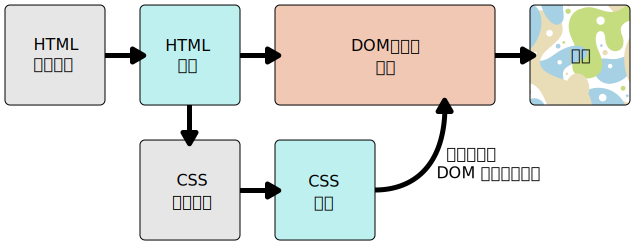

{{LearnSidebar}}
{{PreviousMenuNext("Learn/CSS/First_steps/How_CSS_is_structured", "Learn/CSS/First_steps/Styling_a_biography_page", "Learn/CSS/First_steps")}}

CSS の基本と目的、簡単なスタイルシートの書き方を学んできました。このレッスンでは、ブラウザーが CSS と HTML を実際にウェブページとして表示していくさまを見ていきます。

<table>
  <tbody>
    <tr>
      <th scope="row">前提条件:</th>
      <td>
        基本的なコンピューターリテラシー、<a
          href="/ja/Learn/Getting_started_with_the_web/Installing_basic_software"
          >基本的なソフトウェアがインストールされていること</a
        >、基本的な<a
          href="/ja/Learn/Getting_started_with_the_web/Dealing_with_files"
          >ファイルの操作方法</a
        >に関する知識、 HTML の基本（<a href="/ja/docs/Learn/HTML/Introduction_to_HTML"
          >HTML 概論</a
        >を学習のこと）。
      </td>
    </tr>
    <tr>
      <th scope="row">目的:</th>
      <td>ブラウザーが CSS と HTML を解析する方法、およびブラウザーが解釈できない CSS に遭遇したときに何が起こるかを理解する。</td>
    </tr>
  </tbody>
</table>

## CSS は実際にはどう機能するのか

ブラウザーが文書を表示するとき、ブラウザーはそのコンテンツをスタイル情報と結合する必要があります。以下にリストしたいくつかの段階で文書が処理されます。これはブラウザーがウェブページを読み込むときに起こることを単純化したものであり、各ブラウザーで処理は異なるものの、おおよそ何が起こるかを示しています。

1. ブラウザーが HTML をロードします（ネットワークから受信するなど）。
2. {{Glossary("HTML")}} を {{Glossary("DOM")}} (_Document Object Model_) に変換します。 DOM は文書をコンピューターのメモリー内で表現したものです。 DOM については、次の節でもう少し詳しく説明します。
3. その後ブラウザーは HTML 文書にリンクされているリソース、例えば埋め込まれた画像や動画、そしてリンクされた CSS をも取得します。JavaScript はもう少し後に処理されるため、ここでは簡略化のため説明しません。
4. ブラウザーは取得した CSS を構文解析し、要素、クラス、ID などセレクターの種類ごとに分類します。見つけたセレクターに基づいて、DOM のどのノードにどのルールを適用するかを決定し、スタイルを適用します（この中間ステップはレンダーツリーと呼ばれます）。
5. レンダーツリーは、ルール適用後の構造にレイアウトされます。
6. ページが画面に表示されます（この段階はペイントと呼ばれます）。

簡単に図に表すと次のとおりです。



## DOM について

DOM にはツリーのような構造があります。マークアップの各要素、属性、およびテキストは、ツリー構造の {{Glossary("Node/DOM","DOM ノード")}}になります。ノードは他の DOM ノードとの関係によって定義されます。要素は子ノードの親であり、子ノードには兄弟があります。

DOM は CSS と文書のコンテンツが出会う場所であるため、DOM を理解すると CSS の設計、デバッグ、および保守に役立ちます。ブラウザーの開発者ツールによって、どのルールが適用されるかを確認するために、アイテムを選択することで DOM にナビゲートされます。

## DOM の実際

長く退屈な説明ではなく、例を用いて実際の HTML が DOM に変換される様子を見てみましょう。

以下のような HTML があります。

```html
<p>
  Let's use:
  <span>Cascading</span>
  <span>Style</span>
  <span>Sheets</span>
</p>
```

この場合 DOM では `<p>` 要素が親ノードです。子には、テキストノードと 3 つの `<span>` 要素をノードとして持ちます。一方で `SPAN` ノードは親でもあり、テキストノードを子に持ちます。

```plain
P
├─ "Let's use:"
├─ SPAN
|  └─ "Cascading"
├─ SPAN
|  └─ "Style"
└─ SPAN
    └─ "Sheets"
```

ブラウザーは上述の HTML をこのように解釈し、DOM ツリーを以下のようにレンダリングし出力します。

{{EmbedLiveSample('A_real_DOM_representation', '100%', 55)}}

```css hidden
p {
  margin: 0;
}
```

## DOM への CSS 適用

文書に CSS を追加して、スタイルを設定したとします。先ほどと同じ以下の HTML を使います。

```html
<p>
  Let's use:
  <span>Cascading</span>
  <span>Style</span>
  <span>Sheets</span>
</p>
```

CSS は以下のものを適用します。

```css
span {
  border: 1px solid black;
  background-color: lime;
}
```

ブラウザーは HTML を解釈し、そこから DOM を作成します。次に CSS を解釈します。 CSS で利用できるルールは `span` セレクターだけなので、ブラウザーはすばやく CSS を並べ替えます。そのルールを 3 つの `<span>` のそれぞれに適用し、最終的な視覚表現を画面へ描画します。

結果、次のとおり出力されます。

{{EmbedLiveSample('Applying_CSS_to_the_DOM', '100%', 90)}}

次のモジュールの [CSS のデバッグ](/ja/docs/Learn/CSS/Building_blocks/Debugging_CSS) ではブラウザーの開発者ツールを使用した CSS のデバッグと、ブラウザーが CSS を解釈する方法について詳しく学習します。

## ブラウザーが解釈できない CSS に遭遇したらどうなるのか

[「CSS とは何か」記事の「ブラウザーの対応情報」節](/ja/docs/Learn/CSS/First_steps/What_is_CSS#ブラウザー対応情報)では、ブラウザーが必ずしも同時に新しい CSS を実装するとは限らないことを述べました。また多くの人が最新バージョンのブラウザーを使用しているわけでもありません。CSS は常に開発されており、ブラウザーがまだ認識できないような CSS セレクターや宣言に遭遇するとどうなるか疑問に思われるかもしれません。

その答えは何もせず、 CSS の次の部分に移動するということです。

ブラウザーがルールを解釈しているときに、理解できないプロパティまたは値に遭遇した場合、ブラウザーはそれを無視して次の宣言に進みます。こういうことは、プロパティまたは値のスペルが間違っている場合や、プロパティまたは値が新しすぎてブラウザーがまだサポートしていない場合に起こりえます。

同様に、ブラウザーが理解できないセレクターを検出した場合もそのルール全体を無視し、次のルールに進みます。

次の例では、色にイギリス英語のスペルを使用しているため、プロパティが正しくありません（訳注: color を誤って colour としてしまっている）。よって段落は青くなっていません。ただし、他の CSS はすべて適用されています。無効な行のみが無視されます。

```html
<p>I want this text to be large, bold and blue.</p>
```

```css
p {
  font-weight: bold;
  colour: blue; /* color プロパティのスペルが正しくありません */
  font-size: 200%;
}
```

{{EmbedLiveSample('What_happens_if_a_browser_encounters_CSS_it_doesnt_understand', '100%', 200)}}

この動作はとても有益なものです。つまり、新しい CSS を拡張機能として使用することができ、その CSS が理解されなくてもエラーは発生しません。これにより、基本的な代替スタイル設定が可能になります。

とりわけ新しいゆえに必ずしもサポートされているというわけではない、という値を使用する場合に有用です。例えば、一部の古いブラウザーは `calc()` をサポートしていません。ボックスに対して予防的にピクセル単位の幅を指定しておき、その後 `calc()` で `100% - 50px` の幅を指定した場合、古いブラウザーは前者（ピクセル指定）を使用し、理解できない `calc()` を無視します。かたや新しいブラウザーはピクセル指定を理解はできるものの、あとに記述された `calc()` の方を採用します。

```css
.box {
  width: 500px;
  width: calc(100% - 50px);
}
```

以降のレッスンで、さまざまなブラウザーをサポートするための多くの方法を検討していきます。

## まとめ

このモジュールはほぼ完了です。ただしもうひとつだけやっておいてほしいことがあります。次の記事の[新しい知識を使う](/ja/docs/Learn/CSS/First_steps/Styling_a_biography_page)にて実際のスタイリングをとおして CSS の腕試しをおこないます。

{{PreviousMenuNext("Learn/CSS/First_steps/How_CSS_is_structured", "Learn/CSS/First_steps/Styling_a_biography_page", "Learn/CSS/First_steps")}}
