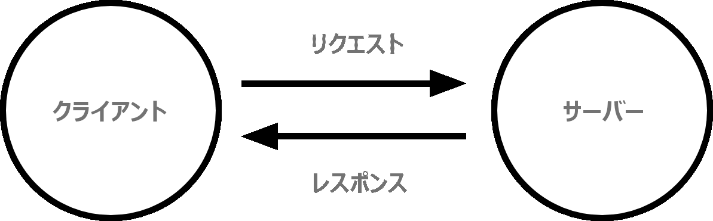

{{LearnSidebar}}{{PreviousMenu("Learn/Getting_started_with_the_web/Publishing_your_website", "Learn/Getting_started_with_the_web")}}

*ウェブのしくみ*では、あなたがコンピューターや携帯電話のウェブブラウザーでウェブページを見るときに起こることを簡単に説明します。

この理論は、ウェブのコードを書く上ですぐにでも必要というわけではありませんが、背景で何が起きているのかを理解しておくと、いずれ役に立つでしょう。

## クライアントとサーバー

ウェブに接続されたコンピューターは**クライアント** (client) と**サーバー** (server) と呼ばれます。これらがどのように相互作用するかを概略図で表すと次のようになります。

- クライアントは、一般的なウェブユーザーが使うインターネットに接続された端末 (例えば Wi-Fi に接続されているコンピューターや、モバイルネットワークに接続されているスマートフォン) と、これらの端末で利用できるウェブにアクセスするソフトウェア (ふつうは Firefox や Chrome などのウェブブラウザー) のことです。
- サーバーとは、ウェブページ、サイト、アプリを格納しているコンピューターのことです。クライアント端末がウェブページにアクセスしたいときは、ウェブページのコピーがサーバーからクライアントにダウンロードされ、ユーザーのウェブブラウザーに表示されます。

## 道具箱の他の部分

もちろん上で説明したクライアントとサーバーだけでなく、これら二つ以外にも、他に多くのものが関わっています。以下では、それについて説明します。

いま、ウェブが道路であると想像してみましょう。道路の片端にクライアントがあり、そこは例えば、あなたの自宅のようなものです。反対の端はサーバーで、そこは例えば、あなたが何かを買うお店のようなものです。

クライアントとサーバーに加えて、以下のものにも触れなければなりません。

- **インターネット接続**: ウェブ上でデータの送受信をできるようにします。あなたの自宅とお店との間の通りのようなものです。
- **TCP/IP**: Transmission Control Protocol と Internet Protocol は、どのようにウェブ上をデータが動くのか、を定義した通信プロトコルです。これは注文したり、店に行ったり、物を買ったりするための通信手段や交通機関のようなものです。身近な例では、車やバイク (またはその辺りにあるもの) のようなものです。
- **DNS**: Domain Name Servers はウェブサイトの住所録のようなものです。ブラウザーにウェブアドレスを入力すると、ブラウザーはウェブサイトを取得する前に DNS を見て、ウェブサイトの本当のアドレスを探します。ブラウザーはウェブサイトがどのサーバーにいるかを探し出す必要があり、それで HTTP のメッセージを正しい場所 (下記参照) に送ることができます。これはお店の所在地を探してからお店に行くようなものです。
- **HTTP**: Hypertext Transfer Protocol は、クライアントとサーバーが対話をする方法を定義するアプリケーション{{Glossary("Protocol" , "プロトコル")}}です。これは商品を注文するための言語のようなものです。
- **コンポーネントファイル**: ウェブサイトは多くの異なるファイルで構成されます。これはお店で複数の部品を買うようなものです。これらのファイルは主に 2 種類に当てはまります。

  - **コードファイル**: ウェブサイトは主に HTML、CSS、JavaScript から作られます。しかし、ちょっと後で他の技術にも出会うことになるでしょう。
  - **アセット**: これは画像、音楽、動画、Word 文書、PDF といったウェブサイトを構成するコード以外のすべての材料の集合的な名前です。

## ならば何が起こるのか

ブラウザーにウェブアドレスを打ち込んだ時に何が起こっているかというと (お店に歩いていく例えでは)、

1.  ブラウザーは DNS サーバーにアクセスし、ウェブサイトのあるサーバーの実際のアドレスを探します (お店の住所を見つけます)。
2.  ブラウザーはサーバーに HTTP リクエストメッセージを送信して、ウェブサイトのコピーをクライアントに送るよう求めます (お店に行ってものを注文します)。このメッセージ、およびクライアントとサーバーの間でやりとりされるその他すべてのデータは、TCP/IP を使用してインターネット経由で送信されます
3.  サーバーがクライアントのリクエストを承認すると、サーバーはクライアントに 「200 OK」 というメッセージを送ります。これは「もちろんそのウェブサイトを見ることができます。どうぞ！」という意味です。そしてウェブサイトのファイルを、データパケットと呼ばれる一連の小さな塊 (chunk) としてブラウザーに送信し始めます (お店は商品を渡し、あなたは自宅に持って帰ります)
4.  ブラウザーは小さな塊を完全なウェブページに組み立て、表示します (玄関にものが到着しました — 新しいピカピカのものです、すばらしい！)

## コンポーネントファイルが解析される順番

クライアントのリクエストが承認されると、サーバーはまず HTML (インデックス) ファイルを送り返します。 index.html は一般的に、サーバーによって解析されるウェブサイトの最初のファイルであるため、このような名前になっています。

HTML ファイルは、 [CSS](/ja/docs/Learn/CSS) と [JavaScript](/ja/docs/Learn/JavaScript) を参照することができます。それぞれ `<link>` と `<script>` 要素を使って外部ファイルに記述したり、 `<style>` と `<script>` 要素を使って HTML ページに埋め込んだりすることができます。

サーバーの観点からは、レスポンスが返信される際に、これらのファイルがどのような順序で解析されるかを知ることが重要です。

- まず HTML ファイルが解析され、そのファイルの中を見ることで、どの CSS ファイルや JavaScript ファイルが参照されているかをサーバーが認識します。
- HTML が解析され、 DOM ツリー構造が生成された後、リンクされた CSS が解析され、 DOM ツリーの適切な部分にスタイルが適用されます。この時点で、ページの視覚的な表現が画面に描かれ、ユーザーはページを見ることになります。
- JavaScript は通常、 HTML と CSS の後に解析され、ページに適用されます。

## DNS の説明

実際のウェブアドレスは、お気に入りのウェブサイトを見つけるためにアドレスバーに入力するような、すばらしい、覚えやすい文字列ではありません。実際のウェブアドレスは `63.245.215.20` のような特殊な数字です。

これは、 {{Glossary("IP Address", "IP アドレス")}}と呼ばれ、ウェブ上の一意の場所を表します。しかし、あまり覚えやすくはないですよね。だから、ドメインネームサーバーが発明されたのです。これらは特別なサーバーで、ブラウザーに入力したウェブアドレス ("mozilla.org" など) とウェブサイトの実際の (IP) アドレスを対応させます。

ウェブサイトには、IP アドレスを使用して直接アクセスできます。[DNS lookup](https://www.nslookup.io/website-to-ip-lookup/) のようなツールにドメインを打ち込むことで、ウェブサイトの IP アドレスを見つけることができます。

## パケットの説明

先ほど、データがサーバーからクライアントに送信される形式を説明するために、「パケット」という用語を使用しました。ここではどういう意味なのでしょうか。基本的に、ウェブ上でデータが送信されると、何千もの小さな塊として送信されるため、たくさんの異なるユーザーが同じウェブサイトを同時にダウンロードできます。ウェブサイトが単一の大きな塊として送信されるとすると、一度に 1 人のユーザーしかダウンロードできなくなるため、ウェブはとても効率が悪くなり、楽しんで使えなくなるでしょう。

## 関連情報

- [インターネットはどのように動くのか](/ja/docs/Learn/Common_questions/How_does_the_Internet_work)
- [HTTP — an Application-Level Protocol](https://dev.opera.com/articles/http-basic-introduction/)
- [HTTP: Let’s GET It On!](https://dev.opera.com/articles/http-lets-get-it-on/)
- [HTTP: Response Codes](https://dev.opera.com/articles/http-response-codes/)

## クレジット表示

道路の写真: [Street composing](https://www.flickr.com/photos/kdigga/9110990882/in/photolist-cXrKFs-c1j6hQ-mKrPUT-oRTUK4-7jSQQq-eT7daG-cZEZrh-5xT9L6-bUnkip-9jAbvr-5hVkHn-pMfobT-dm8JuZ-gjwYYM-pREaSM-822JRW-5hhMf9-9RVQNn-bnDMSZ-pL2z3y-k7FRM4-pzd8Y7-822upY-8bFN4Y-kedD87-pzaATg-nrF8ft-5anP2x-mpVky9-ceKc9W-dG75mD-pY62sp-gZmXVZ-7vVJL9-h7r9AQ-gagPYh-jvo5aM-J32rC-ibP2zY-a4JBcH-ndxM5Y-iFHsde-dtJ15p-8nYRgp-93uCB1-o6N5Bh-nBPUny-dNJ66P-9XWmVP-efXhxJ), by [Kevin D](https://www.flickr.com/photos/kdigga/).

{{PreviousMenu("Learn/Getting_started_with_the_web/Publishing_your_website", "Learn/Getting_started_with_the_web")}}

## このモジュール

- [基本的なソフトウェアのインストール](/ja/docs/Learn/Getting_started_with_the_web/Installing_basic_software)
- [ウェブサイトをどんな外見にするか](/ja/docs/Learn/Getting_started_with_the_web/What_will_your_website_look_like)
- [ファイルの扱い](/ja/docs/Learn/Getting_started_with_the_web/Dealing_with_files)
- [HTML の基本](/ja/docs/Learn/Getting_started_with_the_web/HTML_basics)
- [CSS の基本](/ja/docs/Learn/Getting_started_with_the_web/CSS_basics)
- [JavaScript の基本](/ja/docs/Learn/Getting_started_with_the_web/JavaScript_basics)
- [ウェブサイトの公開](/ja/docs/Learn/Getting_started_with_the_web/Publishing_your_website)
- [ウェブのしくみ](/ja/docs/Learn/Getting_started_with_the_web/How_the_Web_works)
