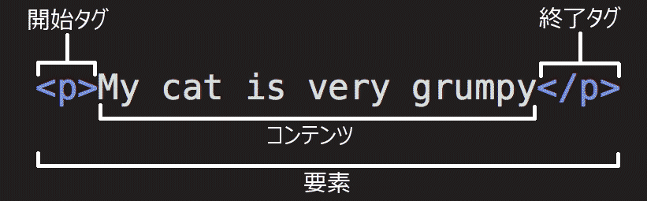
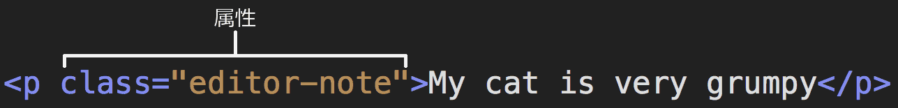

{{LearnSidebar}}

{{PreviousMenuNext("Learn/Getting_started_with_the_web/Dealing_with_files", "Learn/Getting_started_with_the_web/CSS_basics", "Learn/Getting_started_with_the_web")}}

HTML (<strong>H</strong>yper<strong>t</strong>ext <strong>M</strong>arkup <strong>L</strong>anguage、ハイパーテキスト・マークアップ・ランゲージ)は、ウェブサイトのコンテンツの構造を作るために使うコードです。例えば、コンテンツは段落、箇条書きのリスト、画像の使用、データテーブルなどの組み合わせで構成されています。タイトルが示すように、この記事では HTML とその機能の基本的な理解ができるように説明します。

<h2 id="So_what_is_HTML">HTML とは</h2>

HTML は、コンテンツの構造を定義する<em>マークアップ言語</em>です。 HTML は一連の<strong>{{Glossary("element", "要素")}}</strong>で構成されており、これらの要素がコンテンツのさまざまな部分を囲み、一定の表示や動作をさせることができます。{{Glossary("tag", "タグ")}}で囲むと、単語や画像をどこかにハイパーリンクさせたり、単語を斜体にしたり、フォントを大きくしたり小さくしたりすることができます。 例えば、次のようなコンテンツがあるとします。

<pre>My cat is very grumpy</pre>

行を独立させたい場合は、段落タグで囲んで段落であることを指定することができます。

<pre class="brush: html">&lt;p&gt;My cat is very grumpy&lt;/p&gt;</pre>

<h3 id="Anatomy_of_an_HTML_element">HTML 要素の中身</h3>

この段落要素についてもう少し詳しく見ていきましょう。

要素は主に以下のようなもので構成されています。

<ol>
 <li><strong>開始タグ</strong> (Opening tag): これは、要素の名前 (この場合は p) を<strong>山括弧</strong>で囲んだものです。どこから要素が始まっているのか、どこから効果が始まるのかを表します。 — 今回の場合どこから段落が始まるかを表しています。</li>
 <li><strong>終了タグ</strong> (Closing tag): これは、要素名の前に<strong>スラッシュ</strong>が入っていることを除いて開始タグと同じです。どこで要素が終わるのかを表しています。 — この場合は、段落が終わる場所を表します。終了タグの書き忘れは、初心者のよくある間違いで、おかしな結果になることがあります。</li>
 <li><strong>コンテンツ</strong> (Content): 要素の内容です。今回の場合はただのテキストです。</li>
 <li><strong>要素</strong> (Element): 開始タグ、終了タグ、コンテンツで要素を構成します。</li>
</ol>

要素には属性 (Attribute) を設定することができます。このような感じです。

属性には、実際のコンテンツには表示させたくない、要素に関する追加情報が含まれています。ここでは、 <code>class</code> が属性の<em>名前</em>で、 <code>editor-note</code> が属性の<em>値</em>です。 <code>class</code> 属性では、要素に一意ではない識別子を与えることができ、それを使って要素 (および同じ <code>class</code> 値を持つ他の要素) にスタイル情報などのターゲットを設定することができます。

属性は常に次のような形式になります。

<ol>
 <li>要素名 (すでにいくつか属性がある場合はひとつ前の属性) との間の空白</li>
 <li>属性名とそれに続く等号</li>
 <li>引用符で囲まれた属性の値</li>
</ol>

<strong>注</strong>: ASCII のホワイトスペース (または <code>"</code> <code>'</code> <code>`</code> <code>=</code> <code>&lt;</code> <code>&gt;</code> のいずれかの文字) を含まない単純な属性値は引用符を省略することができますが、コードを一貫性のあるものにし、理解を容易にするため、すべての属性値を引用符で囲むことをお勧めします。

<h3 id="Nesting_elements">要素の入れ子</h3>

要素の中に他の要素を入れることもできます。これを<strong>ネスト</strong> (または入れ子) と言います。もしあなたの猫が「とっても」機嫌が悪いことを表したいとしたら、「とっても」という単語を {{htmlelement("strong")}} 要素に入れて、単語の強調を表すことができます。

<pre class="brush: html">&lt;p&gt;私のネコは&lt;strong&gt;とっても&lt;/strong&gt;機嫌が悪い。&lt;/p&gt;</pre>

しかしながら要素は正しく入れ子にしなければなりません。上記の例では、まず始めに {{htmlelement("p")}} 要素が開始され、その次に {{htmlelement("strong")}} 要素が開始されています。その場合は、必ず {{htmlelement("strong")}} 要素、 {{htmlelement("p")}} 要素の順で終了しなければなりません。次の例は間違いです。

<pre class="example-bad brush: html">&lt;p&gt;私の猫は&lt;strong&gt;とっても機嫌が悪い。&lt;/p&gt;&lt;/strong&gt;</pre>

要素は確実に他の要素の中もしくは外で開始し、終了する必要があります。上記の例のように要素が重複してしまうと、ウェブブラウザーは言おうとしていることを推測してもっとも良いと思われる解釈をするため、予期せぬ結果になることがあります。そうならないよう気を付けましょう！

<h3 id="Empty_elements">空要素</h3>

コンテンツを持たない要素もあります。そのような要素を<strong>空要素</strong> (empty elements) と呼びます。すでに HTML ページにある {{htmlelement("img")}} 要素を例に見ていきましょう。

<pre class="brush: html">&lt;img src="images/firefox-icon.png" alt="My test image"&gt;</pre>

この要素は 2 つの属性を持っていますが、終了タグ <code>&lt;/img&gt;</code> がありませんし、内部にコンテンツもありません。これは画像要素は、その機能を果たすためにコンテンツを囲むものではないからです。画像要素の目的は、画像を HTML ページの表示させたいところに埋め込むことです。

<h3 id="Anatomy_of_an_HTML_document">HTML 文書の構造</h3>

ここまでは HTML 要素についてみてきました。しかし要素単体ではあまり役には立ちません。ここからはどのようにしてそれぞれの要素を組み合わせ、 HTML ページ全体を作っていくのかを勉強していきましょう。<a href="/ja/docs/Learn/Getting_started_with_the_web/Dealing_with_files">ファイルの扱い</a>で出てきた <code>index.html</code> に書いてあるコードをもう一度見てみましょう。

<pre class="brush: html">&lt;!DOCTYPE html&gt;
&lt;html&gt;
  &lt;head&gt;
    &lt;meta charset="utf-8"&gt;
    &lt;title&gt;My test page&lt;/title&gt;
  &lt;/head&gt;
  &lt;body&gt;
    &lt;img src="images/firefox-icon.png" alt="My test image"&gt;
  &lt;/body&gt;
&lt;/html&gt;</pre>

この中にあるものは以下の通りです。

<ul>
 <li><code>&lt;!DOCTYPE html&gt;</code> — 文書型宣言です。これは必須の前置きです。昔々、 HTML がまだ出来たばかりの頃 (1991～2年)、文書型宣言は HTML ページが正しい HTML と見なされるために従わなければならない、一連のルールへのリンクとして機能することを意味していました。つまり、自動エラーチェックなどの有益なものを表すことができました。しかし、最近ではあまり機能しておらず、文書が正しく動作するために必要なだけです。今はこれだけ知っていれば大丈夫です。</li>
 <li><code>&lt;html&gt;&lt;/html&gt;</code> — {{htmlelement("html")}} 要素です。この要素は、このページのすべてのコンテンツを囲み、ルート要素と呼ばれることもあります。</li>
 <li><code>&lt;head&gt;&lt;/head&gt;</code> — {{htmlelement("head")}} 要素です。この要素は、ページの閲覧者に向けて表示するためのコンテンツではない、 HTML ページに含めたいものをすべて収めるための入れ物です。 <code>&lt;head&gt;</code> 要素は検索エンジン向けの {{Glossary("keyword", "キーワード")}} や説明書き、ページの見た目を変更するための CSS、文字コードの宣言などを含みます。</li>
 <li><code>&lt;meta charset="utf-8"&gt;</code> — この要素は、大部分の書き言葉の文字のほとんどを含む UTF-8 を文書で使用するように設定しています。基本的には、文書はどんなテキストコンテンツでも扱えるようになります。これを設定しない理由はありませんし、後でいくつかの問題を回避するのに役立ちます。</li>
 <li><code>&lt;title&gt;&lt;/title&gt;</code> — {{htmlelement("title")}} 要素です。ページのタイトルを指定しています。このタイトルはページが読み込まれた時にブラウザーのタブに表示されます。また、ブックマークやお気に入りに登録した時の説明にも使われます。</li>
 <li><code>&lt;body&gt;&lt;/body&gt;</code> — {{htmlelement("body")}} 要素です。これには、テキスト、画像、ビデオ、ゲーム、再生可能なオーディオトラックなど、ページを訪れたウェブの利用者に表示したいすべてのコンテンツが含まれます。</li>
</ul>

<h2 id="Images">画像</h2>

もう一度 {{htmlelement("img")}} 要素について見ていくことにしましょう。

<pre class="brush: html">&lt;img src="images/firefox-icon.png" alt="My test image"&gt;</pre>

前に説明したように、ページのこれが現れたところに画像を埋め込みます。画像ファイルのパスを値に持つ <code>src</code> (source) 属性を指定することによってその画像を表示できます。

また、 <code>alt</code> (alternative; 代替) 属性も指定しています。これは以下のような理由で画像を見られない人に向けて説明するテキストを指定するものです。

<ol>
 <li>目が不自由な人。著しく目の不自由な人はよく画面リーダーと呼ばれるツールを使っていて、それが画像の <code>alt</code> 属性の内容を読み上げます。</li>
 <li>何らかの理由で画像の表示に失敗した場合。例えば、 <code>src</code> 属性の中のパスをわざと正しくないものに変更してみてください。ページを保存したり再読み込みしたりすると、画像の場所に下記のようなものが表示されるでしょう。</li>
</ol>

alt テキストのキーワードは「説明文」です。 alt テキストは、その画像が何を伝えているのかを読者が十分に理解できるような情報を提供する必要があります。この例では、現在のテキストである「My test image」は全く意味がありません。 Firefox のロゴであれば、「Firefox のロゴ: 地球の周りを燃えるような狐が囲んでいる。」の方がずっと良いでしょう。

画像に良い代替文字列を付けてみましょう。

アクセシビリティについて詳しくは <a href="/ja/docs/Learn/Accessibility">MDN のアクセシビリティのページ</a>を参照してください。

<h2 id="Marking_up_text">テキストのマークアップ</h2>

この節では、文字列をマークアップするために使用する基本的な HTML 要素をいくつか見ていきます。

<h3 id="Headings">見出し</h3>

見出し要素により、コンテンツの特定の部分を見出し、または小見出しとして指定することができます。本にメインタイトル、章立て、サブタイトルがあるように、 HTML 文書にも見出しがあります。 HTML には {{htmlelement("h1")}} から {{htmlelement("h6")}} の 6 段階の見出しがありますが、よく使うのはせいぜい 3 から 4 まででしょう。

<pre class="brush: html">&lt;h1&gt;メインタイトル&lt;/h1&gt;
&lt;h2&gt;最上位の見出し&lt;/h2&gt;
&lt;h3&gt;小見出し&lt;/h3&gt;
&lt;h4&gt;孫見出し&lt;/h4&gt;</pre>

それでは、あなたの HTML の {{htmlelement("img")}} 要素の上に適切なタイトルを付けてみましょう。

<strong>注</strong>: 見出しレベル 1 には、暗黙のスタイルがあることがわかりますね。テキストを大きくしたり、太くしたりするために見出し要素を使用しないでください。見出し要素は<a href="/ja/docs/Learn/Accessibility/HTML#text_content">アクセシビリティ</a>や  <a href="/ja/docs/Learn/HTML/Introduction_to_HTML/HTML_text_fundamentals#why_do_we_need_structure">SEO などの理由</a>で使用されているからです。レベルを飛ばすことなく、意味のある見出しの並びをページ上に作るようにしてください。

<h3 id="Paragraphs">段落</h3>

先に説明したように、 {{htmlelement("p")}} 要素は段落を示しています。通常の文章を書くときにはこの要素を頻繁に使うことになるでしょう。

<pre class="brush: html">&lt;p&gt;これは単独の段落です&lt;/p&gt;</pre>

サンプルテキストを (「<a href="/ja/docs/Learn/Getting_started_with_the_web/What_will_your_website_look_like">ウェブサイトをどんな外見にするか</a>」から持ってきてください) 1 つまたは複数の段落に入れ、 {{htmlelement("img")}} 要素のすぐ下に配置してください。

<h3 id="Lists">リスト</h3>

ウェブのコンテンツの多くはリストであり、 HTML にはリストのための特別な要素があります。リストのマークアップは、常に 2 つ以上の要素で構成されています。最も一般的なリストの種類は、順序付きリストと順序なしリストです。

<ol>
 <li><strong>順序なしリスト</strong>は、お買い物リストのようにアイテムの順番が特に関係ない時に使います。順序なしリストは {{htmlelement("ul")}} 要素で囲みます。</li>
 <li><strong>順序付きリスト</strong>は料理のレシピのようにアイテムの順番が関係ある時に使います。順序付きリストは {{htmlelement("ol")}} 要素で囲みます。</li>
</ol>

リストの中に入るそれぞれのアイテムは {{htmlelement("li")}} (list item) 要素の中に書きます。

例えば、次の段落の一部をリストにしたい場合、

<pre class="brush: html">&lt;p&gt;At Mozilla, we’re a global community of technologists, thinkers, and builders working together ... &lt;/p&gt;</pre>

以下のようにマークアップします。

<pre class="brush: html">&lt;p&gt;At Mozilla, we’re a global community of&lt;/p&gt;

&lt;ul&gt;
  &lt;li&gt;technologists&lt;/li&gt;
  &lt;li&gt;thinkers&lt;/li&gt;
  &lt;li&gt;builders&lt;/li&gt;
&lt;/ul&gt;

&lt;p&gt;working together ... &lt;/p&gt;</pre>

ページに番号付きリストと番号なしリストを追加してみましょう。

<h2 id="Links">リンク</h2>

リンクはとても重要です — これがウェブをウェブたらしめているものです。リンクを追加するには、シンプルな要素 {{htmlelement("a")}} を使う必要があります。 <code>a</code> は "anchor" を省略したものです。段落中の文字をリンクにするには次の手順で行います。

<ol>
 <li>リンクにしたい文字を選びます。今回は "Mozilla Manifesto" を選びました。</li>
 <li>選んだ文字を {{htmlelement("a")}} 要素で囲みます。
  <pre class="brush: html">&lt;a&gt;Mozilla Manifesto&lt;/a&gt;</pre>
 </li>
 <li>このように {{htmlelement("a")}} 要素に <code>href</code> 属性を追加します。
  <pre class="brush: html">&lt;a href=""&gt;Mozilla Manifesto&lt;/a&gt;</pre>
 </li>
 <li>このリンクのリンク先になるウェブアドレスを、この属性の値に書き込みます。
  <pre class="brush: html">&lt;a href="https://www.mozilla.org/en-US/about/manifesto/"&gt;Mozilla Manifesto&lt;/a&gt;</pre>
 </li>
</ol>

アドレスの先頭にある <code>https://</code> や <code>http://</code> の部分 (<em>プロトコル</em>と言います) を書き忘れると、予期せぬ結果となってしまうかもしれません。リンクを作ったら、ちゃんとそれが遷移したいところに行ってくれるかを確かめましょう。

<code>href</code> は属性名として変に思うかもしれません。覚えにくかったら、 <code>href</code> は <em><strong>h</strong>ypertext <strong>ref</strong>erence</em> を表しているということを覚えておきましょう。

もしまだやってないのなら、ページにリンクを追加してみましょう。

<h2 id="Conclusion">まとめ</h2>

ここまでの説明に沿ってやってきたのなら、以下のようなページができあがっているはずです (<a href="https://mdn.github.io/beginner-html-site/">ここ</a>でも見られます)。 
  
 

もし途中で行き詰まってしまったなら、 GitHub にある<a href="https://github.com/mdn/beginner-html-site/blob/gh-pages/index.html">完成版のコード例</a>と見比べてみてください。

この記事では HTML の表面的な部分だけを勉強しました。もっと知りたい場合は <a href="/ja/docs/Learn/HTML">HTML を学ぶ</a>を読んでみてくだい。

{{PreviousMenuNext("Learn/Getting_started_with_the_web/Dealing_with_files", "Learn/Getting_started_with_the_web/CSS_basics", "Learn/Getting_started_with_the_web")}}

<h2 id="In_this_module">このモジュール</h2>

<ul>
 <li id="Installing_basic_software"><a href="/ja/docs/Learn/Getting_started_with_the_web/Installing_basic_software">基本的なソフトウェアのインストール</a></li>
 <li id="What_will_your_website_look_like"><a href="/ja/docs/Learn/Getting_started_with_the_web/What_will_your_website_look_like">ウェブサイトをどんな外見にするか</a></li>
 <li id="Dealing_with_files"><a href="/ja/docs/Learn/Getting_started_with_the_web/Dealing_with_files">ファイルの扱い</a></li>
 <li id="HTML_basics"><a href="/ja/docs/Learn/Getting_started_with_the_web/HTML_basics">HTML の基本</a></li>
 <li id="CSS_basics"><a href="/ja/docs/Learn/Getting_started_with_the_web/CSS_basics">CSS の基本</a></li>
 <li id="JavaScript_basics"><a href="/ja/docs/Learn/Getting_started_with_the_web/JavaScript_basics">JavaScript の基本</a></li>
 <li id="Publishing_your_website"><a href="/ja/docs/Learn/Getting_started_with_the_web/Publishing_your_website">ウェブサイトの公開</a></li>
 <li id="How_the_web_works"><a href="/ja/docs/Learn/Getting_started_with_the_web/How_the_Web_works">ウェブのしくみ</a></li>
</ul>
