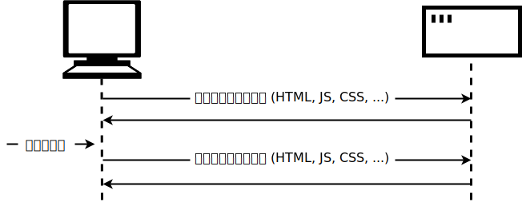

{{LearnSidebar}}{{PreviousMenuNext("Learn/JavaScript/Client-side_web_APIs/Manipulating_documents", "Learn/JavaScript/Client-side_web_APIs/Third_party_APIs", "Learn/JavaScript/Client-side_web_APIs")}}

現代のウェブサイトやアプリケーションでとても一般的なもう一つのタスクは、新しいページ全体を読み込むことなくウェブページの一部を更新するために、サーバーから個々のデータ項目を取得することです。この一見小さなことが、サイトのパフォーマンスや動作に大きな影響を与えてきました。そこでこの記事では、この概念を説明し、これを可能にする技術、特に [Fetch API](/ja/docs/Web/API/Fetch_API) を見ていきます。

<table>
  <tbody>
    <tr>
      <th scope="row">前提条件:</th>
      <td>
        JavaScript の基本
        （<a href="/ja/docs/Learn/JavaScript/First_steps">第一歩</a>、
        <a href="/ja/docs/Learn/JavaScript/Building_blocks"
          >構成要素</a
        >,
        <a href="/ja/docs/Learn/JavaScript/Objects">JavaScript のオブジェクト</a>）、
        <a href="/ja/docs/Learn/JavaScript/Client-side_web_APIs/Introduction"
          >クライアントサイド API の基本</a
        >
      </td>
    </tr>
    <tr>
      <th scope="row">目標:</th>
      <td>
        サーバーからデータを取得し、そのデータを使用してウェブページのコンテンツを更新する方法を習得する。
      </td>
    </tr>
  </tbody>
</table>

## ここでの問題

ウェブページは、 HTML ページと、（通常は）スタイルシート、スクリプト、画像など、その他のさまざまなファイルから構成されています。ウェブでのページ読み込みの基本モデルは、ブラウザーがページを表示するために必要なファイルをサーバーに 1 回以上の HTTP リクエストを行い、サーバーが要求されたファイルで応答することです。別のページにアクセスすると、ブラウザーは新しいファイルを要求し、サーバーはそのファイルを応答します。



このモデルは、多くのサイトにとって完璧に動作するものです。しかし、データ駆動型のウェブサイトを考えてみましょう。例えば、 [Vancouver Public Library](https://www.vpl.ca/) のような図書館のウェブサイトです。このようなサイトは、特にデータベースへのユーザーインターフェイスと考えることができます。特定のジャンルの本を検索したり、以前に借りた本をもとに、あなたが好きそうな本を推薦してくれるかもしれません。このような場合、表示する本の新しい設定をして、ページを更新する必要があります。しかし、ページのヘッダー、サイドバー、フッターなど、ほとんどのページコンテンツはそのままであることに注意してください。

従来のモデルでは、ページの一部分だけを更新する必要がある場合でも、ページ全体を取得して読み込まなければならないことが問題でした。これでは効率が悪く、使い勝手が損なわれてしまいます。

そこで、従来のモデルの代わりに、多くのウェブサイトでは JavaScript API を使用してサーバーにデータをリクエストし、ページを読み込むことなくページコンテンツを更新しています。そのため、ユーザーが新製品を検索した場合、ブラウザーはページの更新に必要なデータ、たとえば表示する新刊書籍の設定のみをリクエストするのです。



ここでの主な API は、[Fetch API](/ja/docs/Web/API/Fetch_API) です。これは、ページ内で動作する JavaScript が、サーバーに対して [HTTP](/ja/docs/Web/HTTP) リクエストを行い、特定のリソースを取得できるようにするものです。サーバーがこれを提供すると、 JavaScript はそのデータを使用してページを更新することができます。通常は [DOM 操作 API](/ja/docs/Learn/JavaScript/Client-side_web_APIs/Manipulating_documents) を使用することになります。リクエストされるデータは、多くの場合 [JSON](/ja/docs/Learn/JavaScript/Objects/JSON)で、これは構造化データの転送に適した形式ですが、 HTML や単なるテキストであっても構いません。

これは Amazon、YouTube、eBay など、データ駆動型のサイトによく見られるパターンです。このモデルを使うと次のようなことが実現できます。

- ページの更新が非常に速く、ページの更新を待つ必要がないため、サイトがより速く、より応答的に感じられることになります。
- 更新のたびにダウンロードされるデータがいくらか減るので、帯域の無駄が少なくなります。これは、ブロードバンド接続のデスクトップではそれほど大きな問題ではないかもしれませんが、モバイル端末や高速なインターネットサービスを持たない国では大きな問題です。

> **メモ:** 初期の頃、この一般的な技術は [Asynchronous](/ja/docs/Glossary/Asynchronous) JavaScript and XML ([Ajax](/ja/docs/Glossary/AJAX)) と呼ばれていましたが、これは XML データをリクエストする傾向があるためでした。最近では通常このようなことはありませんが（JSON をリクエストすることの方が多いでしょう）、結果的には同じことであり、 "Ajax" という用語は今でもこの技術を説明するのによく使用されています。

さらに高速化するために、一部のサイトでは、最初にリクエストされたときにユーザーのコンピューターに資産や データを保存しています。つまり、その後の訪問では、ページを最初に読み込むたびに新しいコピーをダウンロードせずに、 ローカルバージョンを使用するのです。コンテンツは、更新されたときだけサーバーから再読み込みされます。

## Fetch API

それでは、 Fetch API の例をいくつか見てみましょう。

### テキストコンテンツの読み取り

この例では、いくつかの異なるテキストファイルからデータをリクエストし、それらを使用してコンテンツエリアにデータを入力します。

実際のアプリケーションでは、PHP、Python、Node などのサーバーサイドの言語を使用して、データベースからデータを要求したほうが良いでしょう。しかし、ここではシンプルに、クライアント側の部分に集中したいと思います。

この例を始めるには、 [fetch-start.html](https://github.com/mdn/learning-area/blob/main/javascript/apis/fetching-data/fetch-start.html) と 4 つのテキストファイル（[verse1.txt](https://github.com/mdn/learning-area/blob/main/javascript/apis/fetching-data/verse1.txt), [verse2.txt](https://github.com/mdn/learning-area/blob/main/javascript/apis/fetching-data/verse2.txt), [verse3.txt](https://github.com/mdn/learning-area/blob/main/javascript/apis/fetching-data/verse3.txt), [verse4.txt](https://github.com/mdn/learning-area/blob/main/javascript/apis/fetching-data/verse4.txt)）のローカルコピーを、自分のコンピューターの新しいディレクトリーに作ってください。この例では、ドロップダウンメニューで選択されたときに、詩の異なる連（よくご存じのもの）を取得することにしています。

{{htmlelement("script")}} 要素のすぐ内側に、以下のコードを追加してください。これは、 {{htmlelement("select")}} 要素と {{htmlelement("pre")}} 要素への参照を格納し、 `<select>` 要素にリスナーを追加して、ユーザーが新しい値を選択したときに、新しい値が引数として `updateDisplay()` という関数に渡されるようにするものです。

```js
const verseChoose = document.querySelector("select");
const poemDisplay = document.querySelector("pre");

verseChoose.addEventListener("change", () => {
  const verse = verseChoose.value;
  updateDisplay(verse);
});
```

`updateDisplay()` 関数を定義しましょう。まずはさっきのコードブロックの下に以下を書き足します。これは関数の空の箱です。

```js
function updateDisplay(verse) {}
```

この関数は、後で必要になるので、読み込むテキストファイルを指し示す関連 URL を構築することから開始します。 {{htmlelement("select")}} 要素の値は、選択されている {{htmlelement("option")}} の中のテキストと常に同じです（value 属性で異なる値を指定しない限り）。対応する連のテキストファイルは "verse1.txt" で、 HTML ファイルと同じディレクトリーにあるので、ファイル名だけで十分です。

ただ、ウェブサーバーはたいてい大文字小文字を区別しますし、今回のファイル名にスペースが含まれていません。 "Verse 1" を "verse1.txt" に変換するためには、 V を小文字にして、スペースを取り除き、 .txt を末尾に追加しなければなりません。これは {{jsxref("String.replace", "replace()")}} と {{jsxref("String.toLowerCase", "toLowerCase()")}}、あと単なる[文字列の結合](/ja/docs/Learn/JavaScript/First_steps/Strings#文字列を連結する)で実現できます。以下のコードを `updateDisplay()` 関数の内側に追加してください。

```js
verse = verse.replace(" ", "").toLowerCase();
const url = `${verse}.txt`;
```

ついに Fetch API を使用する準備ができました。

```js
// `fetch()` を呼び出し、 URL を渡します。
fetch(url)
  // fetch() はプロミスを返します。サーバーからレスポンスを受け取ると、
  // プロミスの `then()` ハンドラーがそのレスポンスとともに呼び出されます。
  .then((response) => {
    // このハンドラーは、リクエストが成功しなかった場合にエラーを報告します。
    if (!response.ok) {
      throw new Error(`HTTP error: ${response.status}`);
    }
    // そうでない場合（レスポンスが成功した場合）、ハンドラーは
    // response.text() を呼び出してレスポンスをテキストとして取得し、
    // 直ちに `response.text()` が返すプロミスを返します。
    return response.text();
  })
  // response.text() が成功したら、そのテキストで `then()` ハンドラーが
  // 呼び出され、それを `poemDisplay` ボックスにコピーします。
  .then((text) => (poemDisplay.textContent = text))
  // 起こりうるエラーをキャッチし、`poemDisplay` ボックスにメッセージを
  // 表示します。
  .catch(
    (error) => (poemDisplay.textContent = `Could not fetch verse: ${error}`),
  );
```

ここでは、かなり多くのことを解説します。

まず、 Fetch API のエントリーポイントは {{domxref("fetch", "fetch()")}} というグローバル関数で、URL を引数として呼び出します（カスタム設定のために別のオプションの引数を取りますが、ここでは使用しません）。

次に、 `fetch()` はプロミス ({{jsxref("Promise")}}) を返す非同期 API で す。もしこれが何かわからない場合は、[非同期 JavaScript](/ja/docs/Learn/JavaScript/Asynchronous)のモジュール、特に[プロミス](/ja/docs/Learn/JavaScript/Asynchronous/Promises)を読んでからこの記事に戻ってきてください。この記事には `fetch()` API についても書かれていることが分かると思います。

つまり、 `fetch()` はプロミスを返すので、返されたプロミスの {{jsxref("Promise/then", "then()")}} メソッドに関数を渡します。このメソッドは、 HTTP リクエストがサーバーからレスポンスを保有したときに呼び出されます。ハンドラーでは、リクエストが成功したかどうかを調べ、成功しなかった場合はエラーを発生させます。そうでない場合は {{domxref("Response/text", "response.text()")}} を呼び出して、レスポンスの本文をテキストで取得します。

`response.text()` も非同期であることがわかったので、それが返すプロミスを返し、この新しいプロミスの `then()` メソッドに関数を渡します。この関数は、レスポンスのテキストの準備ができたときに呼び出され、その中で `<pre>` ブロックをそのテキストで更新します。

最後に {{jsxref("Promise/catch", "catch()")}} ハンドラーを最後に連結し、呼び出された非同期関数やそのハンドラーで発生したエラーを捕捉しています。

この例の問題点として、最初に読み込んだときに詩が表示されないことが挙げられます。これを修正するには、コードの一番下（閉じられた `</script>` タグのすぐ上）に以下の 2 行を追加して、既定で 1 節を読み込み、 {{htmlelement("select") }} 要素が常に正しい値を示していることを確認します。

```js
updateDisplay("Verse 1");
verseChoose.value = "Verse 1";
```

#### 例はサーバーから提供すること

現代のブラウザーは、ローカルファイルから例を実行しただけでは、 HTTP リクエストを動作させません。これは、セキュリティ上の制約があるためです（ウェブセキュリティについては、[ウェブサイトのセキュリティ](/ja/docs/Learn/Server-side/First_steps/Website_security)をお読みください)。

これを回避するには、ローカルのウェブサーバーでこの例を動作させてテストする必要があります。この方法を探すには、[ローカルのテストサーバーを設定するためのガイド](/ja/docs/Learn/Common_questions/set_up_a_local_testing_server)を読んでください。

### 缶詰屋

この例では、 The Can Store というサンプルサイトを作成しました。これは、缶詰だけを販売する架空のスーパーマーケットです。この例は [GitHub 上でライブ実行](https://mdn.github.io/learning-area/javascript/apis/fetching-data/can-store/)することができ、[ソースコード](https://github.com/mdn/learning-area/tree/main/javascript/apis/fetching-data/can-store)も見ることができます。


既定で、サイトにはすべての製品が表示されますが、左列のフォームコントロールを使用して、カテゴリー、または検索語、またはその両方で製品をフィルタリングすることができます。

カテゴリーや検索キーワードによる商品のフィルタリング、データが UI に正しく表示されるように文字列を操作するなど、かなり多くの複雑なコードが存在します。この記事ではそのすべてについて説明しませんが、コードの中に広範なコメントがあります。（[can-script.js](https://github.com/mdn/learning-area/blob/main/javascript/apis/fetching-data/can-store/can-script.js)を見てください）。

ですが、 Fetch のコードについては説明していきます。

Fetch を使用できる最初のブロックは、 JavaScript で開始されたところにあります。

```js
fetch("products.json")
  .then((response) => {
    if (!response.ok) {
      throw new Error(`HTTP error: ${response.status}`);
    }
    return response.json();
  })
  .then((json) => initialize(json))
  .catch((err) => console.error(`Fetch problem: ${err.message}`));
```

`fetch()` 関数はプロミスを返します。これが成功裏に完了すると、一つ目の `.then()` ブロックの中にある関数は、ネットワークから返された `response` を受け取ります。

この関数の中では、以下のようなことを行っています。

- サーバがエラー（[`404 Not Found`](/ja/docs/Web/HTTP/Status/404) のような値）を返さなかったかどうか調べます。もしエラーが発生した場合は、そのエラーを報告します。
- レスポンスに対して {{domxref("Response.json", "json()")}} を呼び出します。これにより、データは [JSON オブジェクト](/ja/docs/Learn/JavaScript/Objects/JSON)として取得されます。`response.json()` が返すプロミス値を返します。

次に、返されたプロミスの `then()` メソッドに、関数を渡します。この関数には、レスポンスデータを JSON として含むオブジェクトが渡され、それを `initialize()` 関数に渡します。この関数は、ユーザーインターフェースにすべての製品を表示する処理を開始します。

エラーを処理するために、連鎖の最後に `.catch()` ブロックを連鎖させています。これは、何らかの理由でプロミスが失敗した場合に実行されます。その中には、引数として渡される関数、 `err` オブジェクトが含まれています。この `err` オブジェクトを使用して、発生したエラーがどういうものかを伝えられます。ここでは単純な `console.log()` を使用して伝えています。

しかし、完全なウェブサイトであれば、ユーザーの画面にメッセージを表示したり、状況を改善するためのオプションを提供したりして、より上品にこのエラーを処理しますが、ここでは、単純な `console.error()` 以上のものは必要ありません。

失敗のケースを自分でテストすることができます。

1. 例のファイルのローカルコピーを作成してください。
2. コードをウェブサーバーを通して実行するようにします（上記の[例はサーバーから提供すること](#例はサーバーから提供すること)で説明した通り）。
3. 読み取るファイルのパスを、 'produc.json' のようなものに変更します（誤ったファイル名にして下さい）。
4. ここでインデックスファイルをブラウザーに読み込んで（`localhost:8000` から）、ブラウザーの開発者コンソールを見ます。 "Fetch problem: HTTP error: 404" のようなメッセージが表示されるはずです。

2 つ目の Fetch ブロックは `fetchBlob()` 関数の中にあります。

```js
fetch(url)
  .then((response) => {
    if (!response.ok) {
      throw new Error(`HTTP error: ${response.status}`);
    }
    return response.blob();
  })
  .then((blob) => showProduct(blob, product))
  .catch((err) => console.error(`Fetch problem: ${err.message}`));
```

これは、 {{domxref("Response.json","json()")}} を使用する代わりに {{domxref("Response.blob","blob()")}} を使用することを除いて、前のものとほとんど同じ方法で動作します。この場合、レスポンスを画像ファイルとして返したいので、そのために使用するデータ形式は [Blob](/ja/docs/Web/API/Blob) です（この用語は "Binary Large Object" の省略形であり、基本的に画像や動画ファイルなど、大きなファイルのようなオブジェクトを表すために使用できます）。

Blob を正常に受信したら、それを `showProduct()` 関数に渡して、表示させます。

## The XMLHttpRequest API

時々、特に古いコードでは、[`XMLHttpRequest`](/ja/docs/Web/API/XMLHttpRequest) (しばしば "XHR" と略されます) という別の API を使って、HTTP リクエストを行っているのを見かけることがあります。これは Fetch よりも前にあり、AJAX を実装するために実際に広く使用された最初の API でした。できれば Fetch を使用することをお勧めします。`XMLHttpRequest` よりもシンプルな API で、より多くの機能を有しています。ここでは、`XMLHttpRequest` を使用する例については紹介しませんが、最初の缶詰屋のリクエストの `XMLHttpRequest` バージョンがどのようになるかを示します。

```js
const request = new XMLHttpRequest();

try {
  request.open("GET", "products.json");

  request.responseType = "json";

  request.addEventListener("load", () => initialize(request.response));
  request.addEventListener("error", () => console.error("XHR error"));

  request.send();
} catch (error) {
  console.error(`XHR error ${request.status}`);
}
```

ここには 5 つの段階があります。

1. 新しい `XMLHttpRequest` オブジェクトを作成します。
2. [`open()`](/ja/docs/Web/API/XMLHttpRequest/open) メソッドを呼び出して、初期化します。
3. [`load`](/ja/docs/Web/API/XMLHttpRequest/load_event) イベントにイベントリスナーを追加します。このイベントは、レスポンスが正常に完了したときに発行されます。リスナーでは、データを指定して `initialize()` を呼び出します。
4. [`error`](/ja/docs/Web/API/XMLHttpRequest/error_event) イベントにイベントリスナーを追加し、リクエストがエラーになったときに発行されるようにします。
5. リクエストを送信します。

また、 `open()` や `send()` で発生したエラーを処理するために、全体を [try...catch](/ja/docs/Web/JavaScript/Reference/Statements/try...catch) ブロックで囲む必要があります。

Fetch API がこれより改善されていると思うことを期待します。特に、 2 つの異なる場所でエラーを処理しなければならない点を見てください。

## まとめ

この記事では、 Fetch を使ってサーバーからデータを取得する作業を開始する方法を示しました。

## 関連情報

この記事では、さまざまなテーマを取り上げましたが、実際に表面をこすったに過ぎません。このようなテーマについては、以下の記事でより詳しく説明しています。

- [Ajax — 始めましょう](/ja/docs/Web/Guide/AJAX/Getting_Started)
- [Fetch を使う](/ja/docs/Web/API/Fetch_API/Using_Fetch)
- [プロミス](/ja/docs/Web/JavaScript/Reference/Global_Objects/Promise)
- [JSON データの操作](/ja/docs/Learn/JavaScript/Objects/JSON)
- [HTTP の概要](/ja/docs/Web/HTTP/Overview)
- [サーバーサイドウェブサイトプログラミング](/ja/docs/Learn/Server-side)

{{PreviousMenuNext("Learn/JavaScript/Client-side_web_APIs/Manipulating_documents", "Learn/JavaScript/Client-side_web_APIs/Third_party_APIs", "Learn/JavaScript/Client-side_web_APIs")}}
