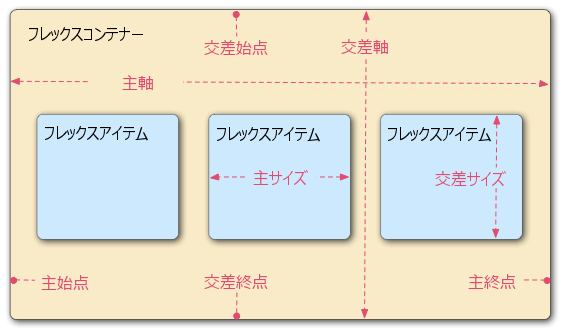

{{PreviousMenuNext("Learn_web_development/Core/CSS_layout/Test_your_skills/Position", "Learn_web_development/Core/CSS_layout/Test_your_skills/Flexbox", "Learn_web_development/Core/CSS_layout")}}

[フレックスボックス](/ja/docs/Web/CSS/Guides/Flexible_box_layout) (Flexbox) は、アイテムを行または列に並べるための 1 次元のレイアウト方法です。アイテムがたわんで（伸びて）追加の空間を埋めたり、縮んで小さい空間に収まったりします。この記事では、すべての基本事項について説明します。

<table>
  <tbody>
    <tr>
      <th scope="row">前提知識:</th>
      <td>
        <a href="/ja/docs/Learn_web_development/Core/Structuring_content"
          >HTML によるコンテンツの構造化</a
        >、
        <a href="/ja/docs/Learn_web_development/Core/Styling_basics">CSS によるスタイル設定の基本</a>、
        <a href="/ja/docs/Learn_web_development/Core/Text_styling/Fundamentals">基本的なテキストとフォントのスタイル設定</a>、
        <a href="/ja/docs/Learn_web_development/Core/CSS_layout/Introduction">CSS レイアウトの基本概念</a>の基礎知識。
      </td>
    </tr>
    <tr>
      <th scope="row">学習成果:</th>
      <td>
        <ul>
          <li>フレックスボックスの目的。一連のブロック要素やインライン要素を、 1 次元で柔軟にレイアウトすること。</li>
          <li>フレックスの用語 — フレックスコンテナー、フレックスアイテム、主軸、交差軸。</li>
          <li>既定で <code>display: flex</code> が何をもたらすかを理解すること。</li>
          <li>新しい行や列にコンテンツを折り返す方法。</li>
          <li>フレックスアイテムを柔軟にサイズ変更したり、並べ替えたりすること。</li>
          <li>コンテンツの位置合わせと配置。</li>
        </ul>
      </td>
    </tr>
  </tbody>
</table>

## なぜフレックスボックスなのか

CSS フレックスボックスレイアウトでは、以下のことができるようになります。

- コンテンツのブロックを、親コンテンツの中で上下中央に配置すること。
- 利用できる幅や高さに関係なく、コンテナーのすべての子が利用できる幅や高さを等しくすること。
- 段組みのレイアウトで、コンテンツの量が異なっていても、すべての段の高さが同じになるようにすること。

フレックスボックス機能は、1 次元レイアウトのニーズに最適なソリューションでしょう。早速みてみましょう。

> [!NOTE]
> Scrimba の入門ガイド [Flexbox](https://scrimba.com/learn-html-and-css-c0p/~017?via=mdn) <sup>[_MDN 学習パートナー_](/ja/docs/MDN/Writing_guidelines/Learning_content#partner_links_and_embeds)</sup> は、フレックスボックスがウェブ上でどれほど一般的であり、学ぶことがなぜ重要なのかを網羅するインタラクティブなガイドを提供し、フレックスボックスの威力を示す典型的な場合を順を追って説明しています。

## 簡単な例の紹介

この記事では、フレックスボックスの仕組みを理解するための演習を順を追って進めます。始める前に、HTML と CSS のローカルコピーを作成してください。最新のブラウザー（Firefox や Chrome など）で読み込み、コードエディターでコードを確認しましょう。または "Play" ボタンをクリックすると、playground で開くことができます。

```html live-sample___flexbox_0
<header>
  <h1>サンプルのフレックスボックスの例</h1>
</header>
<section>
  <article>
    <h2>1 つ目の記事</h2>
    <p>コンテンツ…</p>
  </article>
  <article>
    <h2>2 つ目の記事</h2>
    <p>コンテンツ…</p>
  </article>
  <article>
    <h2>3 つ目の記事</h2>
    <p>コンテンツ…</p>
  </article>
</section>
```

```css live-sample___flexbox_0
body {
  font-family: sans-serif;
  margin: 0;
}
header {
  background: purple;
  height: 100px;
}
h1 {
  text-align: center;
  color: white;
  line-height: 100px;
  margin: 0;
}
section {
  zoom: 0.8;
}
article {
  padding: 10px;
  margin: 10px;
  background: aqua;
}
/* 以下にフレックスボックスの CSS を追加 */
```

{{EmbedLiveSample("flexbox_0", "100", "415")}}

内部に最上位の見出しを持つ {{htmlelement("header")}} 要素と、 {{htmlelement("section")}} 要素があり、その中に 3 つの {{htmlelement("article")}} を含むます。 これらを使用して、かなり標準的な 3 列のレイアウトを作成しましょう。

## 柔軟な箱としてレイアウトする要素を指定

まず最初に、どの要素を柔軟な箱 (flexible box) としてレイアウトするかを選択する必要があります。 これを行うために、影響を与えたい要素の親要素に {{cssxref("display")}} の特別な値を設定します。 この場合、 {{htmlelement("article")}} 要素をレイアウトしたいので、これを {{htmlelement("section")}} に設定します。

```html hidden live-sample___flexbox_1
<header>
  <h1>サンプルのフレックスボックスの例</h1>
</header>
<section>
  <article>
    <h2>1 つ目の記事</h2>
    <p>コンテンツ…</p>
  </article>
  <article>
    <h2>2 つ目の記事</h2>
    <p>コンテンツ…</p>
  </article>
  <article>
    <h2>3 つ目の記事</h2>
    <p>コンテンツ…</p>
  </article>
</section>
```

```css hidden live-sample___flexbox_1
body {
  font-family: sans-serif;
  margin: 0;
}
header {
  background: purple;
  height: 100px;
}
h1 {
  text-align: center;
  color: white;
  line-height: 100px;
  margin: 0;
}
section {
  zoom: 0.8;
}
article {
  padding: 10px;
  margin: 10px;
  background: aqua;
}
/* 以下にフレックスボックスの CSS を追加 */
```

```css live-sample___flexbox_1
section {
  display: flex;
}
```

これによって、`<section>` 要素が**フレックスコンテナー**となり、その子は**フレックスアイテム**になります。その結果、以下のような感じになるでしょう。

{{EmbedLiveSample("flexbox_1", "100", "210")}}

このたった一つの宣言が必要なものすべてを与えてくれます。信じられないでしょう？ 同じ幅の列を持つ複数列のレイアウトがあり、列の高さはすべて同じです。 これは、フレックスアイテム（フレックスコンテナーの子）に与えられる既定値が、このような一般的な問題を解決するために設定されているためです。 それらについての詳細は後で。

ここで何が起こっているのかを復習しましょう。要素に {{cssxref("display")}} を `flex` の値で追加すると、その要素はフレックスコンテナーになります。コンテナーは、ページの他の部分と相互作用するという点で、[ブロックレベルのコンテンツ](/ja/docs/Glossary/Block-level_content)として表示されます。要素がフレックスコンテナーに変換されると、その子要素はフレックスアイテムに変換されます。

コンテナーをインラインにするには、このコンテナー自体がページ内でどのようにレイアウトされるかを指定する[外側の `display` 値](/ja/docs/Web/CSS/Reference/Properties/display#outside)（例: `display: inline flex`）を使用することができます。
古い値である `inline-flex` は、コンテナーをインラインとして表示します。
このチュートリアルでは、コンテナーの中身がどのように振る舞うかに焦点を当てますが、インラインレイアウトとブロックレイアウトの効果の違いを見たければ、 `display` プロパティページの [値の比較](/ja/docs/Web/CSS/Reference/Properties/display#display_値の比較)で見ることができます。

次の節では、フレックスアイテムとは何か、フレックスコンテナーの中にすると要素の中で何が起こるかについて詳しく説明します。

## フレックスモデル

要素が柔軟な箱として配置されるとき、それらは次のように 2 つの軸に沿って配置されます。



- 主軸 (**main axis**) は、フレックスアイテムが配置されている方向に走る軸です（例えば、ページを横切る行、またはページを縦に走る列として）。この軸の始点と終点は、主始点 (**main start**) および主終点 (**main end**) と呼ばれます。主始点から主終点までの長さは主軸長 (**main size**) です。
- 交差軸 (**cross axis**) は、フレックスアイテムが配置されている方向に対して垂直に走る軸です。 この軸の始点と終点は、交差始点 (**cross start**) と交差終点 (**cross end**) と呼ばれます。交差始点から交差終点までの長さは交差長 (**corss size**) と呼ばれます。
- `display: flex` が設定されている親要素（この例では {{htmlelement("section")}}）は、フレックスコンテナー (**flex container**) と呼ばれます。
- フレックスコンテナー内の柔軟な箱としてレイアウトされているアイテムは、フレックスアイテム (**flex item**) と呼ばれます（この例では {{htmlelement("article")}} 要素）。

この後の節を読むときに、この用語を覚えておいてください。使用する用語に迷ったときは、常にこの用語を参照してください。

## 列か行か

フレックスボックスは {{cssxref("flex-direction")}} というプロパティを提供します。 これは主軸が走る方向（フレックスボックスの子がどの方向にレイアウトされるか）を指定します。既定では `row` に設定されていて、ブラウザーの既定の言語が動作する方向（英語のブラウザーの場合は左から右に）にそれらが横一列にレイアウトされます。

次の宣言を {{htmlelement("section")}} のルールに追加してみてください。

```css
flex-direction: column;
```

これにより、 CSS を追加する前と同じように、アイテムが縦一列のレイアウトに戻されます。 先に進む前に、この宣言を例から削除してください。

> [!NOTE]
> `row-reverse` と `column-reverse` の値を使用して、フレックスアイテムを逆方向にレイアウトすることもできます。 これらの値も試してみてください。

## 折り返し

レイアウトに固定幅や固定高を設定した場合に生じる課題の一つは、最終的にフレックスボックスの子要素がコンテナーからはみ出し、レイアウトが崩れることです。次の例では 5 つの {{htmlelement("article")}} 要素がありますが、これらは `min-width: 400px` が設定されているため収まらず、水平スクロールが発生します。

```html hidden live-sample___flex-wrap_0
<header>
  <h1>サンプルのフレックスボックスの例</h1>
</header>
<section>
  <article>
    <h2>1 つ目の記事</h2>
    <p>コンテンツ…</p>
  </article>
  <article>
    <h2>2 つ目の記事</h2>
    <p>コンテンツ…</p>
  </article>
  <article>
    <h2>3 つ目の記事</h2>
    <p>コンテンツ…</p>
  </article>
  <article>
    <h2>4 つ目の記事</h2>
    <p>コンテンツ…</p>
  </article>
  <article>
    <h2>5 つ目の記事</h2>
    <p>コンテンツ…</p>
  </article>
</section>
```

```css hidden live-sample___flex-wrap_0
body {
  font-family: sans-serif;
  margin: 0;
}
header {
  background: purple;
  height: 100px;
}
h1 {
  text-align: center;
  color: white;
  line-height: 100px;
  margin: 0;
}
article {
  min-width: 400px;
  padding: 10px;
  margin: 10px;
  background: aqua;
}
section {
  display: flex;
  flex-direction: row;
  zoom: 0.8;
}
```

{{EmbedLiveSample("flex-wrap_0", "100", "230")}}

ここで、子要素が確かにコンテナーからはみ出していることがわかります。デフォルトで、`flex-direction` が `row` に設定されている場合、ブラウザーはすべてのフレックスアイテムを単一の行に配置しようとします。一方、`flex-direction` が `column` に設定されている場合は単一の列に配置しようとします。

```html hidden live-sample___flex-wrap_1
<header>
  <h1>サンプルのフレックスボックスの例</h1>
</header>
<section>
  <article>
    <h2>1 つ目の記事</h2>
    <p>コンテンツ…</p>
  </article>
  <article>
    <h2>2 つ目の記事</h2>
    <p>コンテンツ…</p>
  </article>
  <article>
    <h2>3 つ目の記事</h2>
    <p>コンテンツ…</p>
  </article>
  <article>
    <h2>4 つ目の記事</h2>
    <p>コンテンツ…</p>
  </article>
  <article>
    <h2>5 つ目の記事</h2>
    <p>コンテンツ…</p>
  </article>
</section>
```

```css hidden live-sample___flex-wrap_1
body {
  font-family: sans-serif;
  margin: 0;
}
header {
  background: purple;
  height: 100px;
}
h1 {
  text-align: center;
  color: white;
  line-height: 100px;
  margin: 0;
}
article {
  min-width: 400px;
  padding: 10px;
  margin: 10px;
  background: aqua;
}
section {
  display: flex;
  flex-direction: row;
  zoom: 0.8;
}
```

この問題を修正する方法の一つは、{{htmlelement("section")}} ルールに次の宣言を追加することです。

```css live-sample___flex-wrap_1
section {
  flex-wrap: wrap;
}
```

これを加えると、レイアウトがずっと見やすくなるのがわかるでしょう。

{{EmbedLiveSample("flex-wrap_1", "100", "430")}}

行が複数になりました。それぞれの行には、合理的な範囲で可能な限り多くのフレックスボックスの子要素が配置されます。オーバーフローした要素は次の行に移動されます。

しかし、ここでできることは他にもあります。 まず最初に、 {{cssxref("flex-direction")}} プロパティの値を `row-reverse` に変更してみてください。 これで、まだ複数行のレイアウトがあることがわかりますが、ブラウザーウィンドウの反対側の隅から開始して逆方向に流れます。

## flex-flow 一括指定

ここで、 {{cssxref("flex-direction")}} と {{cssxref("flex-wrap")}} には {{cssxref("flex-flow")}} という一括指定が存在することに注目する価値があります。 例えば、次のように置き換えることができます。

```css
flex-direction: row;
flex-wrap: wrap;
```

を

```css
flex-flow: row wrap;
```

## フレックスアイテムの柔軟なサイズ変更

では最初の例に戻り、フレックスアイテムが他のフレックスアイテムと比較してどの程度の空間を占めるかを制御できる方法を見ていきましょう。

```html hidden live-sample___flexbox_2
<header>
  <h1>サンプルのフレックスボックスの例</h1>
</header>
<section>
  <article>
    <h2>1 つ目の記事</h2>
    <p>コンテンツ…</p>
  </article>
  <article>
    <h2>2 つ目の記事</h2>
    <p>コンテンツ…</p>
  </article>
  <article>
    <h2>3 つ目の記事</h2>
    <p>コンテンツ…</p>
  </article>
</section>
```

```css hidden live-sample___flexbox_2
body {
  font-family: sans-serif;
  margin: 0;
}
header {
  background: purple;
  height: 100px;
}
h1 {
  text-align: center;
  color: white;
  line-height: 100px;
  margin: 0;
}
article {
  padding: 10px;
  margin: 10px;
  background: aqua;
}
section {
  zoom: 0.8;
  display: flex;
}
```

ローカルコピーの CSS ファイルの末尾に、次のルールを追加してください。

```css live-sample___flexbox_2
article {
  flex: 1;
}
```

{{EmbedLiveSample("flexbox_2", "100", "210")}}

これは、各フレックスアイテムが主軸に沿って使用可能な空間のうちどれだけを占めるかを決定する、無単位の割合値です。 この場合、それぞれの {{htmlelement("article")}} 要素に同じ値（`1` の値）を与えています。 つまり、パディングやマージンなどを設定した後の残りの予備スペースのうちから、すべてが同じ量を占めます。これは割合であり、各フレックスアイテムに `400000` の値を指定してもまったく同じ効果があることを意味します。

```html hidden live-sample___flexbox_3
<header>
  <h1>サンプルのフレックスボックスの例</h1>
</header>
<section>
  <article>
    <h2>1 つ目の記事</h2>
    <p>コンテンツ…</p>
  </article>
  <article>
    <h2>2 つ目の記事</h2>
    <p>コンテンツ…</p>
  </article>
  <article>
    <h2>3 つ目の記事</h2>
    <p>コンテンツ…</p>
  </article>
</section>
```

```css hidden live-sample___flexbox_3
body {
  font-family: sans-serif;
  margin: 0;
}
header {
  background: purple;
  height: 100px;
}
h1 {
  text-align: center;
  color: white;
  line-height: 100px;
  margin: 0;
}
article {
  padding: 10px;
  margin: 10px;
  background: aqua;
}
section {
  zoom: 0.8;
  display: flex;
}
article {
  flex: 1;
}
```

それでは、前のルールの下に次のルールを追加します。

```css live-sample___flexbox_3
article:nth-of-type(3) {
  flex: 2;
}
```

{{EmbedLiveSample("flexbox_3", "100", "210")}}

更新すると、3 番目の {{htmlelement("article")}} が他の 2 つの幅の 2 倍の幅を占めるようになります。 合計で 4 割合単位が使用可能です。 最初の 2 つのフレックスアイテムはそれぞれ 1 単位ずつ持つため、それぞれ使用可能なスペースの 1/4 を占めます。 3 つ目は 2 単位を持っているので、それは使用可能なスペースの 2/4（または 1/2）を占めます。

`flex` の値内に最小サイズ値を指定することもできます。 既存の `article` のルールを次のように更新してみてください。

```html hidden live-sample___flexbox_4
<header>
  <h1>サンプルのフレックスボックスの例</h1>
</header>
<section>
  <article>
    <h2>1 つ目の記事</h2>
    <p>コンテンツ…</p>
  </article>
  <article>
    <h2>2 つ目の記事</h2>
    <p>コンテンツ…</p>
  </article>
  <article>
    <h2>3 つ目の記事</h2>
    <p>コンテンツ…</p>
  </article>
</section>
```

```css hidden live-sample___flexbox_4
body {
  font-family: sans-serif;
  margin: 0;
}
header {
  background: purple;
  height: 100px;
}
h1 {
  text-align: center;
  color: white;
  line-height: 100px;
  margin: 0;
}
article {
  padding: 10px;
  margin: 10px;
  background: aqua;
}
section {
  zoom: 0.8;
  display: flex;
}
```

```css live-sample___flexbox_4
article {
  flex: 1 100px;
}

article:nth-of-type(3) {
  flex: 2 100px;
}
```

これは基本的に「各フレックスアイテムには最初に `100px` の使用可能な空間が与えられます。 その後、残りの使用可能な空間は割合単位に従って共有されます。」と述べています。空間の共有方法に違いが見られます。

{{EmbedLiveSample("flexbox_4", "100", "210")}}

すべてのフレックスアイテムの最小幅は 100 ピクセルで、'flex' を使用して設定されています。最初の 2 つのフレックスアイテムの flex の値は 1 で、3 つ目のアイテムは 2 です。これはフレックスコンテナーの残りの空間を 4 等分に分割します。最初の 2 つのフレックスアイテムにはそれぞれ 1 単位、3 つ目のフレックスアイテムには 2 単位が割り当てられており、3 つ目のフレックスアイテムの幅は、同じ幅の他の 2 種類よりも広くなっています。

フレックスボックスの真の価値は、その柔軟性/応答性に見ることができます。ブラウザーウィンドウのサイズを変更したり、別の {{htmlelement("article")}} 要素を追加したりしても、レイアウトは問題なく機能します。

## flex: 一括指定対個別指定

{{cssxref("flex")}} は、最大 3 つの異なる値を指定できる一括指定プロパティです。

- 上記で説明した無単位の割合値。 これは {{cssxref("flex-grow")}} 個別指定プロパティを使用して個別に指定できます。
- {{cssxref("flex-shrink")}} というフレックスアイテムがコンテナーをオーバーフローしているときに有効になる、2 番目の無単位の割合値。 これは、各フレックスアイテムのサイズからオーバーフローする量を取り除き、それらがコンテナーからオーバーフローするのを防ぐために指定します。 これはかなり高度なフレックスボックスの機能で、この記事ではこれ以上説明しません。
- 上記で説明した最小サイズ値。 これは、{{cssxref("flex-basis")}} の個別指定値を使用して個別に指定できます。

本当に必要な場合以外は、個別指定の flex プロパティを使用しないことをお勧めします（例えば、以前に設定したものを上書きする場合など）。 それらは多くの余分なコードが書かれることにつながり、多少混乱するかもしれません。

## 水平方向と垂直方向の配置

フレックスボックスの機能を使用して、主軸または交差軸に沿ってフレックスアイテムを整列させることもできます。新しい例を見てみましょう。

```html live-sample___flex-align_0
<div>
  <button>Smile</button>
  <button>Laugh</button>
  <button>Wink</button>
  <button>Shrug</button>
  <button>Blush</button>
</div>
```

```css live-sample___flex-align_0
body {
  font-family: sans-serif;
  width: 90%;
  max-width: 960px;
  margin: 10px auto;
}
div {
  height: 100px;
  border: 1px solid black;
}
button {
  font-size: 18px;
  line-height: 1.5;
  width: 15%;
}
/* 以下にフレックスボックスの CSS を追加 */
```

これは、きちんとした柔軟なボタン/ツールバーに変わります。 現時点では、いくつかのボタンが左上隅に詰まった水平のメニューバーが表示されます。

{{EmbedLiveSample("flex-align_0", "100", "125")}}

まず、この例のローカルコピーを取ります。

次に、例の CSS の最後に次のものを追加してください。

```html hidden live-sample___flex-align_1
<div>
  <button>Smile</button>
  <button>Laugh</button>
  <button>Wink</button>
  <button>Shrug</button>
  <button>Blush</button>
</div>
```

```css hidden live-sample___flex-align_1
body {
  font-family: sans-serif;
  width: 90%;
  max-width: 960px;
  margin: 10px auto;
}
div {
  height: 100px;
  border: 1px solid black;
}
button {
  font-size: 18px;
  line-height: 1.5;
  width: 15%;
}
/* 以下にフレックスボックスの CSS を追加 */
```

```css live-sample___flex-align_1
div {
  display: flex;
  align-items: center;
  justify-content: space-around;
}
```

{{EmbedLiveSample("flex-align_1", "100", "125")}}

ページを更新すると、ボタンが横方向と縦方向に中央揃えになっていることがわかります。 これを 2 つの新しいプロパティを介して行いました。フレックスアイテムは `align-items` プロパティを `center` に設定することで、交差軸の中心に配置されます。`justify-content` プロパティを `space-around` に 設定することで、フレックスアイテムは主軸に沿って等間隔に配置されます。

{{cssxref("align-items")}} プロパティは、フレックスアイテムが交差軸上のどこに配置されるかを制御します。

- 既定では、この値は `normal` であり、フレックスボックスでは `stretch` として動作します。これは、すべてのフレックスアイテムを親を埋めるように交差軸方向に引き伸ばします。 親が交差軸方向に固定サイズを持っていない場合、すべてのフレックスアイテムが最長のフレックスアイテムと同じ長さになります。 これが最初の例が既定で同じ高さの列を得た方法です。
- 上記のコードで使用した `center` の値により、アイテムは固有の寸法を維持しますが、交差軸の中心に配置されます。 これが、この例のボタンが縦方向に中央揃えされている理由です。これが、最初の例で既定では同じ高さの列になった理由です。
- `flex-start`、`self-start`、`start`、`flex-end`、`self-end`、`end` のような値を指定することもでき、それぞれすべてのアイテムを交差軸の先頭と末尾に配置します。`baseline` を指定すると、フレックスアイテムのベースラインを揃えます。基本的に、各フレックスアイテムの交差始点とベースラインの間の距離が最も大きい要素の最初の行の下端に並べられます。詳細は {{cssxref("align-items")}} を参照してください。

個々のフレックスアイテムの {{cssxref("align-items")}} のふるまいは、 {{cssxref("align-self")}} プロパティを適用することで上書きできます。 例えば、 CSS に次のコードを追加してみてください。

```html hidden live-sample___flex-align_2
<div>
  <button>Smile</button>
  <button>Laugh</button>
  <button>Wink</button>
  <button>Shrug</button>
  <button>Blush</button>
</div>
```

```css hidden live-sample___flex-align_2
body {
  font-family: sans-serif;
  width: 90%;
  max-width: 960px;
  margin: 10px auto;
}
div {
  height: 100px;
  border: 1px solid black;
}
button {
  font-size: 18px;
  line-height: 1.5;
  width: 15%;
}
div {
  display: flex;
  align-items: center;
  justify-content: space-around;
}
/* 以下にフレックスボックスの CSS を追加 */
```

```css live-sample___flex-align_2
button:first-child {
  align-self: flex-end;
}
```

{{EmbedLiveSample("flex-align_2", "100", "125")}}

これがどのような影響を与えるのかを見て、終了したらもう一度削除してください。

{{cssxref("justify-content")}} は、フレックスアイテムが主軸上のどこに配置されるかを制御します。

- 既定値は `normal` であり、`start` として動作します。 これにより、すべてのアイテムが主軸の先頭に配置されます。
- `end` または `flex-end` を使うことで、それらを末尾に配置することができます。
- `left` および `right` の値は、書字方向に応じて `start` または `end` として動作します。
- `center` は `justify-content` のための値でもあり、フレックスアイテムを主軸方向の中央に配置します。
- 上記で使用した値、`space-around` は便利です。 両端に少しの空間を残して、すべてのアイテムを主軸に沿って均等に配置します。
- もう 1 つの値、`space-between` があります。 これは、両端に空間を残さないという点を除けば、`space-around` にとてもよく似ています。

{{cssxref("justify-items")}} プロパティはフレックスボックスレイアウトでは無視されます。

続ける前に、これらの値を使用してそれらがどのように機能するかを確認することをお勧めします。

## フレックスアイテムの順序付け

フレックスボックスには、ソース順に影響を与えずにフレックスアイテムのレイアウトの順序を変更する機能もあります。 これも従来のレイアウト方法では不可能なことです。

ボタンバーのサンプルコードに次の CSS を追加してみてください。

```css
button:first-child {
  order: 1;
}
```

更新すると、 "Smile" ボタンが主軸の終点に移動したことがわかります。 これがどのように機能するかについてもう少し詳しく説明しましょう。

- 既定では、すべてのフレックスアイテムの {{cssxref("order")}} の値は `0` です。
- 指定された順序の値 (order) が大きいフレックスアイテムの表示順序は、順序の値が小さいアイテムよりも後に表示されます。
- 順序の値が同じフレックスアイテムは、ソース順で表示されます。そのため、4 つのアイテムがあり、順序の値がそれぞれ `2`、`1`、`1`、`0` と設定されていた場合、表示順序は 4 番目、2 番目、3 番目、1 番目となります。
- 3 番目のアイテムは 2 番目の後に表示されます。 これは、順序の値が同じであり、ソース順でそれより後にあるためです。

順序に負の値を設定すると、`0` が設定されているアイテムよりも早くアイテムを表示することができます。 例えば、次のルールを使用して、"Blush" ボタンを主軸の始点に表示させることができます。

```css
button:last-child {
  order: -1;
}
```

`order` を使用して順番を変更することができますが、タブの順番はコード順のままです。フォーカス可能な要素の順序を変更すると、キーボードユーザーのユーザビリティに悪影響を与える可能性があります！

## ネストしたフレックスボックス

フレックスボックスを使ってかなり複雑なレイアウトを作成することは可能です。 フレックスアイテムをフレックスコンテナーとしても設定して、その子も柔軟な箱のようにレイアウトできるようにしてもまったく問題ありません。

```html hidden live-sample___flex-nesting
<header>
  <h1>複雑なフレックスボックスの例</h1>
</header>
<section>
  <article>
    <h2>1 つ目の記事</h2>
    <p>コンテンツ…</p>
  </article>
  <article>
    <h2>2 つ目の記事</h2>
    <p>コンテンツ…</p>
  </article>
  <article>
    <div>
      <button>Smile</button>
      <button>Laugh</button>
      <button>Wink</button>
      <button>Shrug</button>
      <button>Blush</button>
    </div>
    <div>
      <p>段落 1 のコンテンツ…</p>
    </div>
    <div>
      <p>段落 2 のコンテンツ…</p>
    </div>
  </article>
</section>
```

```css hidden live-sample___flex-nesting
body {
  font-family: sans-serif;
  margin: 0;
}
header {
  background: purple;
  height: 100px;
}
h1 {
  text-align: center;
  color: white;
  line-height: 100px;
  margin: 0;
}
article {
  padding: 10px;
  margin: 10px;
  background: aqua;
}
section {
  display: flex;
  zoom: 0.8;
}
article {
  flex: 1 170px;
}
article:nth-of-type(3) {
  flex: 3 170px;
  display: flex;
  flex-flow: column;
}
article:nth-of-type(3) div:first-child {
  flex: 1 100px;
  display: flex;
  flex-flow: row wrap;
  align-items: center;
  justify-content: space-around;
}
button {
  flex: 1 auto;
  margin: 5px;
  font-size: 18px;
  line-height: 1.5;
}
```

{{EmbedLiveSample("flex-nesting", "100", "290")}}

このように、フレックスアイテムがいくつかある複雑なレイアウトは、フレックスコンテナーとして扱われます。このための HTML はかなり素直です。 3 つの {{htmlelement("article")}} を含む {{htmlelement("section")}} 要素があります。 3 番目の {{htmlelement("article")}} には 3 つの {{htmlelement("div")}} が含まれています。

```plain
section - article
          article
          article - div - button
                    div   button
                    div   button
                          button
                          button
```

レイアウトに使用したコードを見てみましょう。

まず、{{htmlelement("section")}} の子を柔軟な箱として配置するように設定します。

```css
section {
  display: flex;
}
```

次に、{{htmlelement("article")}} 自体にいくつかの `flex` の値を設定します。 ここで 2 番目のルールに特に注意してください — 3 番目の {{htmlelement("article")}} は、その子もフレックスアイテムのようにレイアウトするように設定していますが、今回はそれらを `column` のようにレイアウトしています。

```css
article {
  flex: 1 100px;
}

article:nth-of-type(3) {
  flex: 3 100px;
  display: flex;
  flex-flow: column;
}
```

次に、最初の {{htmlelement("div")}} を選択します。 最初に `flex: 1 100px;` を使用して効果的にそれの最小の高さを `100px` にしてから、その子（{{htmlelement("button")}} 要素）もフレックスアイテムのように配置されるように設定します。 ここでそれらをラッピングする行にレイアウトし、先ほど見た個々のボタンの例で行ったように、それらを使用可能なスペースの中央に配置します。

```css
article:nth-of-type(3) div:first-child {
  flex: 1 100px;
  display: flex;
  flex-flow: row wrap;
  align-items: center;
  justify-content: space-around;
}
```

最後に、ボタンにサイズを設定します。今回は、 flex 値として `1 auto` を指定しました。これはとても興味深い効果があり、ブラウザーのウィンドウ幅を変更してみるとわかります。ボタンはできるだけ多くの空間を占有しようとします。できる限り同じ行に配置しようとしますが、それを超えると新しい行に移動します。

```css
button {
  flex: 1 auto;
  margin: 5px;
  font-size: 18px;
  line-height: 1.5;
}
```

## まとめ

以上でフレックスボックスの基本についての解説を終わります。これから学習を進めていく中で、フレックスボックスで楽しく遊んでいただけることを期待しています。次の記事では、これらの知識をどれだけ理解し、定着させられたかを調べるためのテストをいくつかご紹介します。

## 関連情報

- [フレックスボックスの基本概念](/ja/docs/Web/CSS/Guides/Flexible_box_layout/Basic_concepts)
- [フレックスコンテナー内のアイテムの配置](/ja/docs/Web/CSS/Guides/Flexible_box_layout/Aligning_items)
- [フレックスアイテムの順序](/ja/docs/Web/CSS/Guides/Flexible_box_layout/Ordering_items)
- [主軸方向のフレックスアイテムの比率の制御](/ja/docs/Web/CSS/Guides/Flexible_box_layout/Controlling_flex_item_ratios)
- [CSS フレックスボックスレイアウト](/ja/docs/Web/CSS/Guides/Flexible_box_layout)モジュール
- [CSS-Tricks guide to flexbox](https://css-tricks.com/snippets/css/a-guide-to-flexbox/) — フレックスボックスのすべてを視覚的にわかりやすく説明した記事です。
- [Flexbox Froggy](https://flexboxfroggy.com/) — フレックスボックスの基本を学び、理解を深めるための教育ゲームです。

{{PreviousMenuNext("Learn_web_development/Core/CSS_layout/Test_your_skills/Position", "Learn_web_development/Core/CSS_layout/Test_your_skills/Flexbox", "Learn_web_development/Core/CSS_layout")}}
