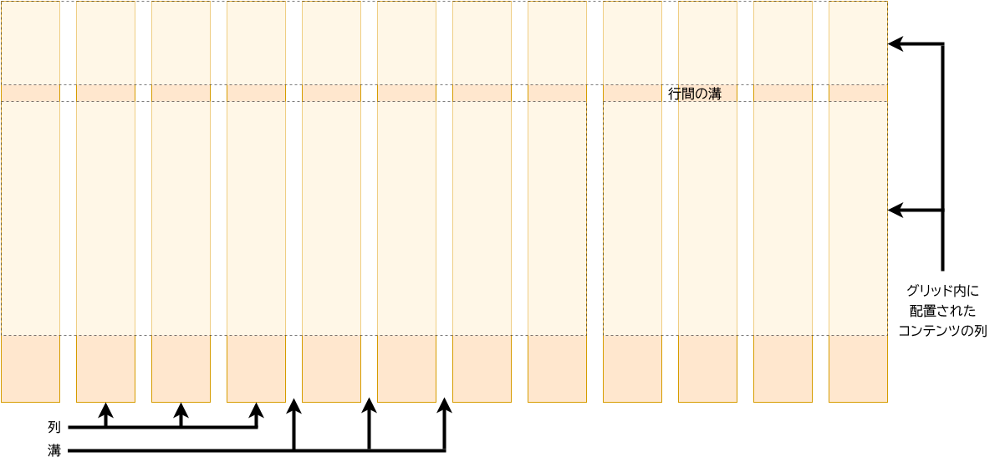

{{LearnSidebar}}

{{PreviousMenuNext("Learn_web_development/Core/CSS_layout/Flexbox", "Learn_web_development/Core/CSS_layout/Responsive_design", "Learn_web_development/Core/CSS_layout")}}

CSS グリッドレイアウト (Grid Layout) は、ウェブ用の 2 次元レイアウトシステムです。 コンテンツを行と列に整理することができ、複雑なレイアウトの作成を簡素化する多くの機能を提供します。この記事では、グリッドレイアウトを始めるに当たって知っておくべきことをすべて説明します。

<table>
  <tbody>
    <tr>
      <th scope="row">前提知識:</th>
      <td>
        <a href="/ja/docs/Learn_web_development/Core/Structuring_content"
          >HTML によるコンテンツの構造化</a
        >、
        <a href="/ja/docs/Learn_web_development/Core/Styling_basics">CSS によるスタイル設定の基本</a>、
        <a href="/ja/docs/Learn_web_development/Core/Text_styling/Fundamentals">基本的なテキストとフォントのスタイル設定</a>、
        <a href="/ja/docs/Learn_web_development/Core/CSS_layout/Introduction">CSS レイアウトの基本概念</a>の基礎知識。
      </td>
    </tr>
    <tr>
      <th scope="row">学習成果:</th>
      <td>
        <ul>
          <li>CSS グリッドの目的を理解すること。一連のブロック要素やインライン要素を、 2 次元で柔軟にレイアウトします。</li>
          <li>グリッドの用語を理解すること。行、列、間隔、溝。</li>
          <li>既定で <code>display: grid</code> が何をもたらすかを理解すること。</li>
          <li>グリッド行、列、間隔の定義。</li>
          <li>グリッドでの要素の配置。</li>
        </ul>
      </td>
    </tr>
  </tbody>
</table>

## グリッドレイアウトとは

グリッドとは、水平方向と垂直方向の線を集めたもので、デザイン要素を並べて表示することができます。 ページ間を移動するときに要素が跳び回ったり幅が変わったりしないようなデザインを作成するのに役立ちます。 これにより、ウェブサイトの一貫性が向上します。

グリッドには通常、**列** (column)、**行** (row)、そしてそれぞれの行と列の間の間隔です。間隔はよく溝またはガター (**gutter**) と呼ばれます。



## CSS でグリッドを作成

デザインに必要なグリッドを決定したら、CSS グリッドレイアウトを使用して CSS でそのグリッドを作成し、その上にアイテムを配置できます。 最初にグリッドレイアウトの基本機能を見てから、プロジェクト用のシンプルなグリッドシステムを作成する方法を探ります。
次の動画では、 CSS グリッドを使用する方法を視覚的にわかりやすく説明しています。

{{EmbedYouTube("KOvGeFUHAC0")}}

### グリッドを定義

例を使ってグリッドレイアウトを試してみましょう。出発点として、テキストエディターとブラウザーで[出発点ファイル](https://github.com/mdn/learning-area/blob/main/css/css-layout/grids/0-starting-point.html)をダウンロードして開いてください（[ここでライブを見る](https://mdn.github.io/learning-area/css/css-layout/grids/0-starting-point.html)こともできます）。 いくつかの子アイテムを持つコンテナーの例が表示されます。既定では、これらのアイテムは通常フローで表示され、他のアイテムの下に1つずつ現れます。このレッスンの最初の部分では、このファイルを使用してグリッドの動作を確認します。

フレックスボックスを定義する方法と同様に、 {{cssxref("display")}} プロパティの値に `grid` を設定することでグリッドレイアウトを定義します。フレックスボックスの場合と同様に、`display: grid` プロパティはコンテナーの直接の子をすべてグリッドアイテムに変換します。以下を CSS に追加してください。

```css
.container {
  display: grid;
}
```

フレックスボックスとは異なり、アイテムはすぐには違ったようには見えません。 `display: grid` を宣言すると 1 列のグリッドになるので、アイテムは通常フローと同様に下方向に表示されていきます。

よりグリッドらしく見せるには、グリッドにいくつかの列を追加する必要があります。 ここに 200 ピクセルの列を 3 つ追加しましょう。 これらの列トラックを作成するために、任意の長さの単位やパーセントを使用できます。

```css
.container {
  display: grid;
  grid-template-columns: 200px 200px 200px;
}
```

CSS ルールに 2 番目の宣言を追加してからページを再読み込みすると、作成したグリッドの各セルにアイテムが 1 つずつ再配置されていることがわかります。

```css hidden
body {
  width: 90%;
  max-width: 900px;
  margin: 2em auto;
  font:
    0.9em/1.2 Arial,
    Helvetica,
    sans-serif;
}

.container > div {
  border-radius: 5px;
  padding: 10px;
  background-color: rgb(207 232 220);
  border: 2px solid rgb(79 185 227);
}
```

```html hidden
<div class="container">
  <div>One</div>
  <div>Two</div>
  <div>Three</div>
  <div>Four</div>
  <div>Five</div>
  <div>Six</div>
  <div>Seven</div>
</div>
```

{{ EmbedLiveSample('Defining_a_grid', '100%', 200) }}

### fr 単位を使用した柔軟なグリッド

長さとパーセントを使用してグリッドを作成するだけでなく、 [`fr`](/ja/docs/Web/CSS/flex_value) 単位を使用して柔軟にグリッドの行と列のサイズを変更できます。 この単位は、グリッドコンテナー内の使用可能な空間の割合を表します。

トラックのリストを次の定義に変更し、 `1fr` のトラックを 3 つ作成します。

```css
.container {
  display: grid;
  grid-template-columns: 1fr 1fr 1fr;
}
```

これで柔軟なトラックになりました。 `fr` 単位は空間を比例配分します。このようにトラックに異なる正の値を指定することができます。

```css
.container {
  display: grid;
  grid-template-columns: 2fr 1fr 1fr;
}
```

最初のトラックは、利用できる空間の `2fr` を確保し、他の 2 つのトラックは `1fr` を確保するので、最初のトラックはより大きくなります。 `fr` 単位と固定された長さの単位を混合することができます。この場合、修正されたトラックに必要な空間が最初に使用され、残りの空間が他のトラックに分配されます。

```css hidden
body {
  width: 90%;
  max-width: 900px;
  margin: 2em auto;
  font:
    0.9em/1.2 Arial,
    Helvetica,
    sans-serif;
}

.container > div {
  border-radius: 5px;
  padding: 10px;
  background-color: rgb(207 232 220);
  border: 2px solid rgb(79 185 227);
}
```

```html hidden
<div class="container">
  <div>One</div>
  <div>Two</div>
  <div>Three</div>
  <div>Four</div>
  <div>Five</div>
  <div>Six</div>
  <div>Seven</div>
</div>
```

{{ EmbedLiveSample('Flexible_grids_with_the_fr_unit', '100%', 200) }}

> **メモ:** `fr` 単位は、*すべて*の空間ではなく、*使用可能*な空間を分配します。そのため、トラックの中に何か大きなものがある場合、共有できる自由空間は少なくなります。

### トラックの間隔

トラックの間隔を作成するには、次のプロパティを使用してください。

- {{cssxref("column-gap")}} は列の間隔
- {{cssxref("row-gap")}} は行の間隔
- {{cssxref("gap")}} は両方の一括指定

```css
.container {
  display: grid;
  grid-template-columns: 2fr 1fr 1fr;
  gap: 20px;
}
```

これらの間隔は、長さの単位またはパーセント値のどちらでもかまいませんが、`fr` 単位は使えません。

```css hidden
body {
  width: 90%;
  max-width: 900px;
  margin: 2em auto;
  font:
    0.9em/1.2 Arial,
    Helvetica,
    sans-serif;
}

.container > div {
  border-radius: 5px;
  padding: 10px;
  background-color: rgb(207 232 220);
  border: 2px solid rgb(79 185 227);
}
```

```html hidden
<div class="container">
  <div>One</div>
  <div>Two</div>
  <div>Three</div>
  <div>Four</div>
  <div>Five</div>
  <div>Six</div>
  <div>Seven</div>
</div>
```

{{ EmbedLiveSample('Gaps_between_tracks', '100%', 250) }}

### トラックリストの繰り返し

CSS の `repeat()` 関数を使用して、トラックリストの全部または一部を繰り返すことができます。
トラックリストを次のように変更します。

```css
.container {
  display: grid;
  grid-template-columns: repeat(3, 1fr);
  gap: 20px;
}
```

今までと同じ 3 つの `1fr` のトラックが手に入ります。 `repeat()` 関数に渡す最初の値はリストを繰り返す回数で、2 番目の値はトラックリストで、1 つ以上のトラックを繰り返すことができます。

### 暗黙的グリッドと明示的グリッド

ここまで、列のトラックだけを指定してきましたが、行はコンテンツを保持するために自動的に作成されます。この概念は、明示的グリッドと暗黙的グリッドの違いを強調しています。
ここでは、 2 つの型のグリッドの違いについてもう少し詳しく説明します。

- **明示的グリッド**は、 `grid-template-columns` または `grid-template-rows` を使用して作成します。
- **暗黙的グリッド**は、定義した明示的なグリッドを拡張するもので、そのグリッドの外側、例えば新しい行にグリッド線を描画することでコンテンツを配置します。

既定では、暗黙的グリッドに作成されたトラックは `auto` でサイズ調整されます。 これは一般に、コンテンツを十分に含むことができる大きさがあることを意味します。 暗黙的グリッドのトラックにサイズを指定したい場合は、 {{cssxref("grid-auto-rows")}} プロパティと {{cssxref("grid-auto-columns")}} プロパティを使用できます。 CSS に `grid-auto-rows` を `100px` の値で追加すると、作成された行の高さは 100 ピクセルになります。

```css hidden
body {
  width: 90%;
  max-width: 900px;
  margin: 2em auto;
  font:
    0.9em/1.2 Arial,
    Helvetica,
    sans-serif;
}

.container > div {
  border-radius: 5px;
  padding: 10px;
  background-color: rgb(207 232 220);
  border: 2px solid rgb(79 185 227);
}
```

```html hidden
<div class="container">
  <div>One</div>
  <div>Two</div>
  <div>Three</div>
  <div>Four</div>
  <div>Five</div>
  <div>Six</div>
  <div>Seven</div>
</div>
```

```css
.container {
  display: grid;
  grid-template-columns: repeat(3, 1fr);
  grid-auto-rows: 100px;
  gap: 20px;
}
```

{{ EmbedLiveSample('Implicit_and_explicit_grids', '100%', 400) }}

### minmax() 関数

100 ピクセルより高いコンテンツを追加する場合、100 ピクセルの高さのトラックはあまり役に立ちません。 その場合、オーバーフローが発生します。 トラックの高さは*最低* 100 ピクセルで、さらに多くのコンテンツがトラックに入る場合は拡大できると良いでしょう。 ウェブについてのかなり基本的な事実は、あなたが実際に何かがどれほど高くなるかを本当に知らないということです。 追加のコンテンツや大きなフォントサイズは、あらゆる次元でピクセルパーフェクトになろうとするデザインに問題を引き起こす可能性があります。

{{cssxref("minmax", "minmax()")}} 関数を使用すると、トラックの最小サイズと最大サイズ、例えば `minmax(100px, auto)` を設定できます。 最小サイズは 100 ピクセルですが、最大サイズは `auto` で、コンテンツに合わせて拡大されます。 次のように `minmax` の値を使用するように `grid-auto-rows` を変更してみてください。

```css
.container {
  display: grid;
  grid-template-columns: repeat(3, 1fr);
  grid-auto-rows: minmax(100px, auto);
  gap: 20px;
}
```

追加のコンテンツを追加すると、それが収まるようにトラックが拡大されます。 拡張は行に沿って行われることに注意してください。

### 収まる限り多くの列

トラックリスト、反復記法、 {{cssxref("minmax", "minmax()")}} について学んだことのいくつかを組み合わせて、便利なパターンを作成できます。 グリッドに、コンテナーに収まるだけの数の列を作成するように依頼できると便利な場合があります。 これを行うには、 `grid-template-columns` の値を {{cssxref("repeat", "repeat()")}} 記法を使用して設定しますが、数値を渡す代わりにキーワード `auto-fit` を渡します。 関数の 2 番目の引数には、`minmax()` を使用し、最小値は、必要な最小トラックサイズに等しく、最大値は `1fr` です。

自分のファイルで下記の CSS を使用してみてください。

```css hidden
body {
  width: 90%;
  max-width: 900px;
  margin: 2em auto;
  font:
    0.9em/1.2 Arial,
    Helvetica,
    sans-serif;
}

.container > div {
  border-radius: 5px;
  padding: 10px;
  background-color: rgb(207 232 220);
  border: 2px solid rgb(79 185 227);
}
```

```html hidden
<div class="container">
  <div>One</div>
  <div>Two</div>
  <div>Three</div>
  <div>Four</div>
  <div>Five</div>
  <div>Six</div>
  <div>Seven</div>
</div>
```

```css
.container {
  display: grid;
  grid-template-columns: repeat(auto-fit, minmax(200px, 1fr));
  grid-auto-rows: minmax(100px, auto);
  gap: 20px;
}
```

{{ EmbedLiveSample('As_many_columns_as_will_fit', '100%', 400) }}

これは、グリッドがコンテナーに収まるだけの数の 200 ピクセルの列を作成し、その後すべての列の間で残っている空間を共有するためです — 最大は `1fr` で、すでにご存じのとおり、トラック間で空間を均等に配分するためのものです。

## 線に基づいた配置

ここで、グリッドの作成からグリッドへの配置に移ります。グリッドには常に線があります。これらは 1 から始まり、文書の[書字方向](/ja/docs/Web/CSS/CSS_writing_modes)に関連しています。例えば、英語（左書き）の場合、列線 1 はグリッドの左端であり、行線 1 はグリッドの上端となり、アラビア語（右書き）の場合、列線 1 は右端になります。

これらの線に沿ってアイテムを配置するには、アイテムを配置するグリッド領域の開始線と終了線を指定します。このために使用することができる 4 つのプロパティがあります。

- {{cssxref("grid-column-start")}}
- {{cssxref("grid-column-end")}}
- {{cssxref("grid-row-start")}}
- {{cssxref("grid-row-end")}}

これらのプロパティはその値として線番号を受け入れるので、例えばある項目が 1 本目から始まり 3 本目で終わるように指定することができます。
また、開始線と終了線を同時に指定する一括指定プロパティを使用することもできます。指定する線はスラッシュ `/` で区切ります。

- {{cssxref("grid-column")}} は `grid-column-start` および `grid-column-end` の一括指定
- {{cssxref("grid-row")}} は `grid-row-start` および `grid-row-end` の一括指定

これを実際に見るには、[線に基づいた配置の開始点ファイル](https://github.com/mdn/learning-area/blob/main/css/css-layout/grids/8-placement-starting-point.html)をダウンロードするか、[ここでライブを見てください](https://mdn.github.io/learning-area/css/css-layout/grids/8-placement-starting-point.html)。これは定義したグリッドと単純な記事の概要が入っています。自動配置が各アイテムをグリッドの自分自身のセルに配置していることがわかります。

代わりに、グリッド線を使用して、サイトのすべての要素をグリッドに配置しましょう。 CSS の最後に次のルールを追加してください。

```css
header {
  grid-column: 1 / 3;
  grid-row: 1;
}

article {
  grid-column: 2;
  grid-row: 2;
}

aside {
  grid-column: 1;
  grid-row: 2;
}

footer {
  grid-column: 1 / 3;
  grid-row: 3;
}
```

```css hidden
body {
  width: 90%;
  max-width: 900px;
  margin: 2em auto;
  font:
    0.9em/1.2 Arial,
    Helvetica,
    sans-serif;
}

.container {
  display: grid;
  grid-template-columns: 1fr 3fr;
  gap: 20px;
}

header,
footer {
  border-radius: 5px;
  padding: 10px;
  background-color: rgb(207 232 220);
  border: 2px solid rgb(79 185 227);
}

aside {
  border-right: 1px solid #999;
}
```

```html hidden
<div class="container">
  <header>This is my lovely blog</header>
  <article>
    <h1>My article</h1>
    <p>
      Duis felis orci, pulvinar id metus ut, rutrum luctus orci. Cras porttitor
      imperdiet nunc, at ultricies tellus laoreet sit amet. Sed auctor cursus
      massa at porta. Integer ligula ipsum, tristique sit amet orci vel, viverra
      egestas ligula. Curabitur vehicula tellus neque, ac ornare ex malesuada
      et. In vitae convallis lacus. Aliquam erat volutpat. Suspendisse ac
      imperdiet turpis. Aenean finibus sollicitudin eros pharetra congue. Duis
      ornare egestas augue ut luctus. Proin blandit quam nec lacus varius
      commodo et a urna. Ut id ornare felis, eget fermentum sapien.
    </p>

    <p>
      Nam vulputate diam nec tempor bibendum. Donec luctus augue eget malesuada
      ultrices. Phasellus turpis est, posuere sit amet dapibus ut, facilisis sed
      est. Nam id risus quis ante semper consectetur eget aliquam lorem. Vivamus
      tristique elit dolor, sed pretium metus suscipit vel. Mauris ultricies
      lectus sed lobortis finibus. Vivamus eu urna eget velit cursus viverra
      quis vestibulum sem. Aliquam tincidunt eget purus in interdum. Cum sociis
      natoque penatibus et magnis dis parturient montes, nascetur ridiculus mus.
    </p>
  </article>
  <aside>
    <h2>Other things</h2>
    <p>
      Nam vulputate diam nec tempor bibendum. Donec luctus augue eget malesuada
      ultrices. Phasellus turpis est, posuere sit amet dapibus ut, facilisis sed
      est.
    </p>
  </aside>
  <footer>Contact me@example.com</footer>
</div>
```

{{ EmbedLiveSample('Line-based_placement', '100%', 550) }}

> [!NOTE]
> 最後の列または行の線をターゲットとして値 `-1` を使用することができ、負の値を使用して終点から数えることもできます。 しかしこれは明示的グリッドに対してのみ有効です。 値 `-1` は、[暗黙的グリッド](/ja/docs/Glossary/Grid)の終点の線をターゲットにしません。

## grid-template-areas での配置

アイテムをグリッドに配置する別の方法は、 {{cssxref("grid-template-areas")}} プロパティを使用して、デザインのさまざまな要素に名前を付けることです。

最後の例から線に基づいた配置を削除して（またはファイルを再ダウンロードして新しい出発点にして）、次の CSS を追加します。

```css
.container {
  display: grid;
  grid-template-areas:
    "header header"
    "sidebar content"
    "footer footer";
  grid-template-columns: 1fr 3fr;
  gap: 20px;
}

header {
  grid-area: header;
}

article {
  grid-area: content;
}

aside {
  grid-area: sidebar;
}

footer {
  grid-area: footer;
}
```

ページを再読み込みすると、線番号を使用しなくてもアイテムが以前と同じように配置されたことがわかります！

```css hidden
body {
  width: 90%;
  max-width: 900px;
  margin: 2em auto;
  font:
    0.9em/1.2 Arial,
    Helvetica,
    sans-serif;
}

header,
footer {
  border-radius: 5px;
  padding: 10px;
  background-color: rgb(207 232 220);
  border: 2px solid rgb(79 185 227);
}

aside {
  border-right: 1px solid #999;
}
```

```html hidden
<div class="container">
  <header>This is my lovely blog</header>
  <article>
    <h1>My article</h1>
    <p>
      Duis felis orci, pulvinar id metus ut, rutrum luctus orci. Cras porttitor
      imperdiet nunc, at ultricies tellus laoreet sit amet. Sed auctor cursus
      massa at porta. Integer ligula ipsum, tristique sit amet orci vel, viverra
      egestas ligula. Curabitur vehicula tellus neque, ac ornare ex malesuada
      et. In vitae convallis lacus. Aliquam erat volutpat. Suspendisse ac
      imperdiet turpis. Aenean finibus sollicitudin eros pharetra congue. Duis
      ornare egestas augue ut luctus. Proin blandit quam nec lacus varius
      commodo et a urna. Ut id ornare felis, eget fermentum sapien.
    </p>

    <p>
      Nam vulputate diam nec tempor bibendum. Donec luctus augue eget malesuada
      ultrices. Phasellus turpis est, posuere sit amet dapibus ut, facilisis sed
      est. Nam id risus quis ante semper consectetur eget aliquam lorem. Vivamus
      tristique elit dolor, sed pretium metus suscipit vel. Mauris ultricies
      lectus sed lobortis finibus. Vivamus eu urna eget velit cursus viverra
      quis vestibulum sem. Aliquam tincidunt eget purus in interdum. Cum sociis
      natoque penatibus et magnis dis parturient montes, nascetur ridiculus mus.
    </p>
  </article>
  <aside>
    <h2>Other things</h2>
    <p>
      Nam vulputate diam nec tempor bibendum. Donec luctus augue eget malesuada
      ultrices. Phasellus turpis est, posuere sit amet dapibus ut, facilisis sed
      est.
    </p>
  </aside>
  <footer>Contact me@example.com</footer>
</div>
```

{{ EmbedLiveSample('Positioning_with_grid-template-areas', '100%', 550) }}

`grid-template-area` のルールは次のとおりです。

- グリッドのすべてのセルを埋める必要があります。
- 2 つのセルにまたがるようにするには、名前を繰り返します。
- セルを空のままにするには、`.` （ピリオド）を使用します。
- 領域は長方形である必要があります。 例えば、L 字型の領域を持つことはできません。
- 領域を異なる場所で繰り返すことはできません。

レイアウトを弄ることができます。フッターを記事の下にだけ配置したり、サイドバーをすべて下にまたがるように変更したりすることができます。 CSS を見ていくだけで、何が起こっているのかがよくわかるので、これはレイアウトを記述するのにとてもいい方法です。

## 入れ子のグリッドとサブグリッド

グリッドを別のグリッドの中に入れ子にして、[サブグリッド](/ja/docs/Web/CSS/CSS_grid_layout/Subgrid)を作成することが可能です。
これを行うには、グリッドアイテムに `display: grid` プロパティを設定します。

記事のコンテナーを追加し、入れ子のグリッドを使用して複数の記事のレイアウトを制御することで、前回の例を展開してみましょう。
入れ子のグリッドでは 1 列しか使用していませんが、 `grid-template-rows` プロパティを使用することで、行を 2:1:1 の比率で分割するように定義することができます。
この手法により、ページ上部の 1 つの記事を大きく表示し、他にもプレビューのように小さく表示するレイアウトを作成することができます。

```html hidden live-sample___nesting-grids
<div class="container">
  <header>This is my lovely blog</header>
  <div class="articles">
    <article>
      <h1>Darmok and Jalad had a picnic at Tanagra</h1>

      <p>
        Duis felis orci, pulvinar id metus ut, rutrum luctus orci. Cras
        porttitor imperdiet nunc, at ultricies tellus laoreet sit amet. Sed
        auctor cursus massa at porta. Integer ligula ipsum, tristique sit amet
        orci vel, viverra egestas ligula. Curabitur vehicula tellus neque, ac
        ornare ex malesuada et. In vitae convallis lacus. Aliquam erat volutpat.
        Suspendisse ac imperdiet turpis. Aenean finibus sollicitudin eros
        pharetra congue. Duis ornare egestas augue ut luctus. Proin blandit quam
        nec lacus varius commodo et a urna. Ut id ornare felis, eget fermentum
        sapien.
      </p>

      <button>Read more</button>
    </article>
    <article>
      <h1>Temba held his arms wide</h1>
      <p>
        Duis felis orci, pulvinar id metus ut, rutrum luctus orci. Cras
        porttitor imperdiet nunc, at ultricies tellus laoreet sit amet. Sed
        auctor cursus massa at porta. Integer ligula ipsum, tristique sit amet
        orci vel, viverra egestas ligula. Curabitur vehicula tellus neque, ac
        ornare ex malesuada et ...
      </p>
      <button>Read more</button>
    </article>
    <article>
      <h1>Gilgamesh, a king, at Uruk</h1>
      <p>
        Duis felis orci, pulvinar id metus ut, rutrum luctus orci. Cras
        porttitor imperdiet nunc, at ultricies tellus laoreet sit amet. Sed
        auctor cursus massa at porta ...
      </p>
      <button>Read more</button>
    </article>
  </div>
  <aside>
    <h2>Other things</h2>
    <p>
      Nam vulputate diam nec tempor bibendum. Donec luctus augue eget malesuada
      ultrices. Phasellus turpis est, posuere sit amet dapibus ut, facilisis sed
      est.
    </p>
    <button>Read more</button>
  </aside>
  <footer>Contact me@example.com</footer>
</div>
```

```css hidden live-sample___nesting-grids
body {
  width: 90%;
  max-width: 900px;
  margin: 2em auto;
  font:
    0.9em/1.2 Arial,
    Helvetica,
    sans-serif;
}

header,
footer {
  border-radius: 5px;
  padding: 10px;
  background-color: rgb(207 232 220);
  border: 2px solid rgb(79 185 227);
}
header {
  grid-area: header;
}

aside {
  border-right: 1px solid #999;
  grid-area: sidebar;
  padding-right: 10px;
  font-size: 0.8em;
}

footer {
  grid-area: footer;
}
.container {
  display: grid;
  grid-template-areas:
    "header header"
    "sidebar content"
    "footer footer";
  grid-template-columns: 1fr 3fr;
  gap: 20px;
}
```

```css live-sample___nesting-grids
.articles {
  display: grid;
  grid-template-rows: 2fr 1fr 1fr;
  gap: inherit;
}

article {
  padding: 10px;
  border: 2px solid rgb(79 185 227);
  border-radius: 5px;
}
```

{{EmbedLiveSample('nesting-grids', '100%', 1100)}}

入れ子グリッドのレイアウトを簡単に作業するために、 `grid-template-rows` と `grid-template-columns` プロパティに `subgrid` を使用することができます。これにより、親グリッドで定義したトラックを活用することができます。

次の例では、[線に基づいた配置](#線に基づいた配置)を使用しており、入れ子グリッドを親グリッドの複数の列や行にまたがるようにすることができます。
`subgrid` を追加し、親グリッドの列を継承しつつ、入れ子グリッド内の行に異なるレイアウトを追加します。

```css hidden live-sample___subgrid
body {
  width: 90%;
  max-width: 900px;
  margin: 2em auto;
  font:
    0.9em/1.2 Arial,
    Helvetica,
    sans-serif;
}

.container div {
  border-radius: 5px;
  padding: 10px;
  background-color: rgb(207 232 220);
  border: 2px solid rgb(79 185 227);
}
```

```html live-sample___subgrid
<div class="container">
  <div>One</div>
  <div>Two</div>
  <div>Three</div>
  <div>Four</div>
  <div id="subgrid">
    <div>Five</div>
    <div>Six</div>
    <div>Seven</div>
    <div>Eight</div>
  </div>
  <div>Nine</div>
  <div>Ten</div>
</div>
```

```css live-sample___subgrid
.container {
  display: grid;
  grid-template-columns: repeat(4, 1fr);
  grid-template-rows: repeat(1, 1fr);
  gap: 10px;
}

#subgrid {
  grid-column: 1 / 4;
  grid-row: 2 / 4;
  display: grid;
  gap: inherit;
  grid-template-columns: subgrid;
  grid-template-rows: 2fr 1fr;
}
```

{{ EmbedLiveSample('subgrid', '100%', 300) }}

## グリッドシステム

コンテンツのレイアウトに役立つ、 12 列または 16 列のグリッドを提供する数多くのグリッドフレームワークが利用できます。
良い知らせは、グリッドベースのレイアウトを作成するのにサードパーティ製のフレームワークはおそらく必要ないということです。グリッド機能はすでに仕様に記載されており、ほとんどの現行ブラウザーで対応しています。

[出発点ファイルをダウンロードしてください](https://github.com/mdn/learning-area/blob/main/css/css-layout/grids/11-grid-system-starting-point.html)。 これには、12 列のグリッドが定義されたコンテナーと、前の 2 つの例で使用したのと同じマークアップが含まれています。 線に基づいた配置を使用して、次のようにコンテンツを 12 列のグリッドに配置できます。

```css
.container {
  display: grid;
  grid-template-columns: repeat(12, minmax(0, 1fr));
  gap: 20px;
}
```

これで、行ベースの配置を使用して、 12 列のグリッドにコンテンツを配置することができます。

```css
header {
  grid-column: 1 / 13;
  grid-row: 1;
}

article {
  grid-column: 4 / 13;
  grid-row: 2;
}

aside {
  grid-column: 1 / 4;
  grid-row: 2;
}

footer {
  grid-column: 1 / 13;
  grid-row: 3;
}
```

```css hidden
body {
  width: 90%;
  max-width: 900px;
  margin: 2em auto;
  font:
    0.9em/1.2 Arial,
    Helvetica,
    sans-serif;
}

header,
footer {
  border-radius: 5px;
  padding: 10px;
  background-color: rgb(207 232 220);
  border: 2px solid rgb(79 185 227);
}

aside {
  border-right: 1px solid #999;
}
```

```html hidden
<div class="container">
  <header>This is my lovely blog</header>
  <article>
    <h1>My article</h1>
    <p>
      Duis felis orci, pulvinar id metus ut, rutrum luctus orci. Cras porttitor
      imperdiet nunc, at ultricies tellus laoreet sit amet. Sed auctor cursus
      massa at porta. Integer ligula ipsum, tristique sit amet orci vel, viverra
      egestas ligula. Curabitur vehicula tellus neque, ac ornare ex malesuada
      et. In vitae convallis lacus. Aliquam erat volutpat. Suspendisse ac
      imperdiet turpis. Aenean finibus sollicitudin eros pharetra congue. Duis
      ornare egestas augue ut luctus. Proin blandit quam nec lacus varius
      commodo et a urna. Ut id ornare felis, eget fermentum sapien.
    </p>

    <p>
      Nam vulputate diam nec tempor bibendum. Donec luctus augue eget malesuada
      ultrices. Phasellus turpis est, posuere sit amet dapibus ut, facilisis sed
      est. Nam id risus quis ante semper consectetur eget aliquam lorem. Vivamus
      tristique elit dolor, sed pretium metus suscipit vel. Mauris ultricies
      lectus sed lobortis finibus. Vivamus eu urna eget velit cursus viverra
      quis vestibulum sem. Aliquam tincidunt eget purus in interdum. Cum sociis
      natoque penatibus et magnis dis parturient montes, nascetur ridiculus mus.
    </p>
  </article>
  <aside>
    <h2>Other things</h2>
    <p>
      Nam vulputate diam nec tempor bibendum. Donec luctus augue eget malesuada
      ultrices. Phasellus turpis est, posuere sit amet dapibus ut, facilisis sed
      est.
    </p>
  </aside>
  <footer>Contact me@example.com</footer>
</div>
```

{{ EmbedLiveSample('Grid frameworks in CSS grid', '100%', 600) }}

[Firefox のグリッドインスペクター](https://firefox-source-docs.mozilla.org/devtools-user/page_inspector/how_to/examine_grid_layouts/index.html)を使用してデザイン上のグリッド線をオーバーレイすると、12 列グリッドがどのように機能するかがわかります。


## スキルテスト

この記事の最後に達しましたが、最も大切な情報を覚えていますか？次に進む前に、この情報が身に付いたかどうかを確認するテストがあります。[スキルテスト: グリッド](/ja/docs/Learn_web_development/Core/CSS_layout/Grid_skills) を見てください。

## まとめ

この概要では、CSS グリッドレイアウトの主な機能について説明しました。 あなたのデザインでそれを使い始めることができるはずです。 仕様をさらに深く掘り下げるには、以下にあるグリッドレイアウトのガイドを読んでください。

## 関連情報

- [CSS グリッドレイアウト](/ja/docs/Web/CSS/CSS_grid_layout#ガイド)
  - : CSS グリッドレイアウトモジュールのメインページで、多数の追加リソースを格納しています。
- [A complete guide to CSS grid](https://css-tricks.com/snippets/css/complete-guide-grid/)（英語）
  - : 視覚的なガイド（CSS-Tricks、2023）
- [Grid Garden](https://cssgridgarden.com/)（英語）
  - : グリッドの基本を学び、より理解を深めるための教育用ゲームです。

{{PreviousMenuNext("Learn_web_development/Core/CSS_layout/Flexbox", "Learn_web_development/Core/CSS_layout/Responsive_design", "Learn_web_development/Core/CSS_layout")}}
