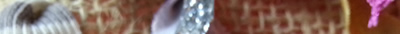

{{LearnSidebar}}

{{PreviousMenuNext("Learn_web_development/Core/CSS_layout/Floats", "Learn_web_development/Core/CSS_layout/Flexbox", "Learn_web_development/Core/CSS_layout")}}

位置指定を使用すると、文書の通常のレイアウトフローから要素を取り出して異なるふるまいをさせることができます。 例えば、互いの上に重なったり、常にブラウザーのビューポート内の同じ場所に留まったりします。 この記事では、さまざまな {{cssxref("position")}} の値とその使い方について説明します。

<table>
  <tbody>
    <tr>
      <th scope="row">前提知識:</th>
      <td>
        <a href="/ja/docs/Learn_web_development/Core/Structuring_content"
          >HTML によるコンテンツの構造化</a
        >、
        <a href="/ja/docs/Learn_web_development/Core/Styling_basics">CSS によるスタイル設定の基本</a>、
        <a href="/ja/docs/Learn_web_development/Core/Text_styling/Fundamentals">基本的なテキストとフォントのスタイル設定</a>、
        <a href="/ja/docs/Learn_web_development/Core/CSS_layout/Introduction">CSS レイアウトの基本概念</a>の基礎知識。
      </td>
    </tr>
    <tr>
      <th scope="row">学習成果:</th>
      <td>
        <ul>
          <li><code>static</code> 位置指定が、ページ上で要素を位置指定するための既定の方法であること。</li>
          <li>相対位置指定の要素は通常フローに残る一方で、絶対（および固定・粘着）位置指定は通常フローから完全に外し、個別のレイヤーに配置すること。</li>
          <li>最終的なレイアウト位置は <code>top</code>, <code>bottom</code>, <code>left</code>, <code>right</code> の各プロパティで変更できるものの、設定されている <code>position</code> 値によって効果が異なること。</li>
          <li>位置指定要素の位置のコンテキストを、祖先要素の位置指定によって設定すること。</li>
        </ul>
      </td>
    </tr>
  </tbody>
</table>

可能であれば、あなたのローカルコンピューターで演習することをお勧めします。GitHub リポジトリーから [`0_basic-flow.html`](https://mdn.github.io/learning-area/css/css-layout/positioning/0_basic-flow.html) のコピーを入手し（[ソースコードはここ](https://github.com/mdn/learning-area/blob/main/css/css-layout/positioning/0_basic-flow.html)）、それを出発点として使用します。

## 位置指定の紹介

位置指定（Positioning、ポジショニング）の本来の趣旨は、興味深い効果を生み出すために、上記の基本的な文書フローのふるまいを上書きできるようにすることです。 レイアウト内のいくつかのボックスの位置をデフォルトのレイアウトフローの位置からわずかに変更して、ちょっと風変わりでアンティーク調の感じにしたらどうでしょうか？ 位置指定はあなたのツールです。 あるいは、ページの他の部分の上に浮かぶ UI 要素を作成したり、ページをいくらスクロールしても常にブラウザーウィンドウ内の同じ場所に配置したいですか？ 位置指定はそのようなレイアウト作業を可能にします。

HTML 要素に適用できるさまざまな種類の位置指定があります。 特定の種類の位置指定を要素でアクティブにするには、{{cssxref("position")}} プロパティを使用します。

## 静的位置指定

静的位置指定 (Static positioning) は、すべての要素が取得するデフォルトです。 これは、「要素を文書レイアウトフロー内の通常の位置に配置する — ここで見るべき特別なことは何もありません」を意味します。

これを実演し、例をこれからのセクションのために準備するために、最初に HTML で次のように、 2 つ目の {{htmlelement("p")}} の `class` に `positioned` を追加します。

```html
<p class="positioned">…</p>
```

それでは、CSS の最後に次のルールを追加してください。

```css
.positioned {
  position: static;
  background: yellow;
}
```

保存して再読み込みしても、2 段落目の背景色が更新されていることを除けば、まったく違いはありません。 これは問題ありません。 前にも述べたように、静的位置指定は既定のふるまいです！

> [!NOTE]
> この時点でのライブ例は [`1_static-positioning.html`](https://mdn.github.io/learning-area/css/css-layout/positioning/1_static-positioning.html) にあります（[ソースコードを見る](https://github.com/mdn/learning-area/blob/main/css/css-layout/positioning/1_static-positioning.html)）。

## 相対位置指定

相対位置指定 (Relative positioning) は、最初に見ていく位置指定の種類です。 これは静的位置指定と非常によく似ていますが、位置指定要素 (positioned element) が通常のレイアウトフローで配置されたら、ページ上の他の要素と重なることも含んで最終的な位置を変更できるという点が異なります。 先に進んで、次のようにコード内の `position` の宣言を更新してください。

```css
position: relative;
```

この段階で保存して再読み込みしても、結果にまったく変化はありません。 それでは、どうやって要素の位置を変更するのでしょうか？ {{cssxref("top")}}、{{cssxref("bottom")}}、{{cssxref("left")}}、{{cssxref("right")}} の各プロパティを使用する必要があります。 これについては次のセクションで説明します。

### top、bottom、left、right の紹介

{{cssxref("top")}}（上）、{{cssxref("bottom")}}（下）、{{cssxref("left")}}（左）、{{cssxref("right")}}（右）は {{cssxref("position")}} と一緒に使用され、位置指定要素の移動先を正確に指定します。 これを試すには、CSS の `.positioned` ルールに次の宣言を追加してください。

```css
top: 30px;
left: 30px;
```

> [!NOTE]
> これらのプロパティの値は、論理的に想定される任意の[単位](/ja/docs/Learn_web_development/Core/Styling_basics/Values_and_units)（ピクセル、mm、rem、% など）をとることができます。

保存して再読み込みすると、次のような結果になります。

```html-nolint hidden live-sample___ntroducing_top_bottom_left_and_right
<h1>相対位置指定</h1>

<p>
  これは基本的なブロックレベル要素です。隣接するブロックレベル要素は、この下に新しい行に配置されます。
</p>

<p class="positioned">
  既定では、親要素の幅を 100% 使用し、子コンテンツの高さと同じ高さになります。全体の幅と高さは、コンテンツの幅と高さ＋パディング＋境界線の幅/高さです。
</p>

<p>
  これらはマージンによって分離されています。マージンが相殺されているため、互いのマージンではなく、マージン 1 つ分のサイズによって分離されています。
</p>

<p>
  この<span>インライン要素</span>や<span>このインライン要素</span>は、同じ行に空間がある場合、隣接するテキストノードとともに同じ行に配置されます。
  インライン要素がオーバーフローすると、<span>可能な場合は（テキストを含むこの要素のように）新しい行に折り返されます</span>。そうでない場合は、この画像のように、新しい行にそのまま続きます。
  
</p>
```

```css hidden live-sample___ntroducing_top_bottom_left_and_right
body {
  width: 500px;
  margin: 0 auto;
}

p {
  background: aqua;
  border: 3px solid blue;
  padding: 10px;
  margin: 10px;
}

span {
  background: red;
  border: 1px solid black;
}

.positioned {
  position: relative;
  background: yellow;
  top: 30px;
  left: 30px;
}
```

{{ EmbedLiveSample('Introducing_top_bottom_left_and_right', '100%', 500) }}

かっこいいですよね？はい、おそらくこれは期待していたものではなかったでしょう。上と左を指定したのに、なぜ下と右に移動したのでしょうか？ 最初は非論理的に聞こえるかもしれませんが、これは相対的位置指定が機能する方法です。位置指定したボックスの指定した側を反対方向に押す見えない力を考える必要があります。 例えば、`top: 30px;` と指定した場合、力がボックスの上側を押して、箱の上側が 30px 下向きに移動します。

> [!NOTE]
> この時点でのライブ例は [`2_relative-positioning.html`](https://mdn.github.io/learning-area/css/css-layout/positioning/2_relative-positioning.html) にあります（[ソースコードを見る](https://github.com/mdn/learning-area/blob/main/css/css-layout/positioning/2_relative-positioning.html)）。

## 絶対位置指定

絶対位置指定 (Absolute positioning) はまったく異なる結果をもたらします。

### position: absolute の設定

コード内の `position` 宣言を次のように変更してみましょう。

```css
position: absolute;
```

保存して再読み込みすると、次のようになります。

```html-nolint hidden
<h1>絶対位置指定</h1>

<p>
  これは基本的なブロックレベル要素です。隣接するブロックレベル要素は、この下に新しい行に配置されます。
</p>

<p class="positioned">
  既定では、親要素の幅を 100% 使用し、子コンテンツの高さと同じ高さになります。全体の幅と高さは、コンテンツの幅と高さ＋パディング＋境界線の幅/高さです。
</p>

<p>
  これらはマージンによって分離されています。マージンが相殺されているため、互いのマージンではなく、マージン 1 つ分のサイズによって分離されています。
</p>

<p>
  この<span>インライン要素</span>や<span>このインライン要素</span>は、同じ行に空間がある場合、隣接するテキストノードとともに同じ行に配置されます。
  インライン要素がオーバーフローすると、<span>可能な場合は（テキストを含むこの要素のように）新しい行に折り返されます</span>。そうでない場合は、この画像のように、新しい行にそのまま続きます。
  
</p>
```

```css hidden
body {
  width: 500px;
  margin: 0 auto;
}

p {
  background: aqua;
  border: 3px solid blue;
  padding: 10px;
  margin: 10px;
}

span {
  background: red;
  border: 1px solid black;
}

.positioned {
  position: absolute;
  background: yellow;
  top: 30px;
  left: 30px;
}
```

{{ EmbedLiveSample('Setting_position_absolute', '100%', 450) }}

まず、文書内のフローに位置指定された要素が配置されていたはずのすき間が、なくなっていることに注意してください。これがなくなったので、 1 つ目と 3 つ目の要素は互いに隣接しています。ある意味、これは正しいです。 絶対位置指定要素は、通常の文書レイアウトフローには存在しなくなります。 他のすべてのものとは異なる独自のレイヤー上にあります。これはとても便利です。つまり、ページ上の他の要素のレイアウトを妨げない独立した UI 機能を作成できるということです。例えば、ポップアップ情報ボックスやコントロールメニュー、ロールオーバーパネル、ページ上の任意の場所にドラッグアンドドロップできる UI 機能、等々です。

次に、要素の位置が変更されたことに注意してください。 これは、{{cssxref("top")}}、{{cssxref("bottom")}}、{{cssxref("left")}}、{{cssxref("right")}} の絶対位置指定でのふるまいが異なるためです。 通常の文書レイアウトフロー内での相対的な位置に基づいて要素を配置するのではなく, 要素がそれぞれの包含要素の側からあるべき距離を指定します。 したがって、この場合は、絶対位置指定要素は「包含要素」の上側から 30 ピクセル、左側から 30 ピクセルとなるようにします。（この場合、**包含要素**とは、**初期包含ブロック** (initial containing block) のことです。詳細については、以下の節を参照してください。）

> [!NOTE]
> 必要に応じて、 {{cssxref("top")}}、{{cssxref("bottom")}}、{{cssxref("left")}}、{{cssxref("right")}} を使用して要素のサイズを変更することができます。 位置指定要素に `top: 0; bottom: 0; left: 0; right: 0; margin: 0;` を設定して、何が起こるか見てみてください。後で元に戻しましょう。

> [!NOTE]
> そう、マージンはなお位置指定要素に影響します。 しかしながら、マージンの相殺行われません。

> [!NOTE]
> この時点でのライブ例は [`3_absolute-positioning.html`](https://mdn.github.io/learning-area/css/css-layout/positioning/3_absolute-positioning.html) にあります（[ソースコードを見る](https://github.com/mdn/learning-area/blob/main/css/css-layout/positioning/3_absolute-positioning.html)）。

### 位置指定コンテキスト

絶対位置指定要素の「包含要素」はどの要素でしょうか？ これは、位置指定要素の祖先の `position` プロパティに大きく依存します。

明示的に定義された `position` プロパティを持つ祖先要素がない場合、デフォルトではすべての祖先要素は静的位置を持ちます。 この結果、絶対位置指定要素は**初期包含ブロック**に含まれます。 初期包含ブロックはビューポートの大きさを持ち、{{htmlelement("html")}} 要素を含むブロックでもあります。 簡単に言うと、絶対位置指定要素は {{htmlelement("html")}} 要素の外側に表示され、最初のビューポートを基準にして配置されます。

位置指定要素は HTML ソースの {{htmlelement("body")}} 内に含まれていますが、最終的なレイアウトでは、ページの端の左上から 30 ピクセル離れています。 **位置指定コンテキスト** (positioning context) — 絶対位置指定要素が配置される基準となる要素 — を変更することができます。 これは、要素の祖先の 1 つに位置指定を設定することによって行われます。つまり、位置指定する要素を内部に含んでいる要素の 1 つです（その要素を含んでいない要素を基準にして配置することはできません）。これを確認するために、次の宣言を `body` ルールに追加してください。

```css
position: relative;
```

これにより、次のような結果になります。

```html-nolint hidden
<h1>位置指定コンテキスト</h1>

<p>
  これは基本的なブロックレベル要素です。隣接するブロックレベル要素は、この下に新しい行に配置されます。
</p>

<p class="positioned">
  この絶対位置指定要素は、 <code>&lt;body&gt;</code> 要素からの相対位置となり、 <code>&lt;html&gt;</code> 要素からの相対位置ではなくなりました。
</p>

<p>
  これらはマージンによって分離されています。マージンが相殺されているため、互いのマージンではなく、マージン 1 つ分のサイズによって分離されています。
</p>

<p>
  この<span>インライン要素</span>や<span>このインライン要素</span>は、同じ行に空間がある場合、隣接するテキストノードとともに同じ行に配置されます。
  インライン要素がオーバーフローすると、<span>可能な場合は（テキストを含むこの要素のように）新しい行に折り返されます</span>。そうでない場合は、この画像のように、新しい行にそのまま続きます。
  
</p>
```

```css hidden
body {
  width: 500px;
  margin: 0 auto;
  position: relative;
}

p {
  background: aqua;
  border: 3px solid blue;
  padding: 10px;
  margin: 10px;
}

span {
  background: red;
  border: 1px solid black;
}

.positioned {
  position: absolute;
  background: yellow;
  top: 30px;
  left: 30px;
}
```

{{ EmbedLiveSample('Positioning_contexts', '100%', 420) }}

位置指定要素は、{{htmlelement("body")}} 要素を基準にして配置されます。

> [!NOTE]
> この時点でのライブ例は [`4_positioning-context.html`](https://mdn.github.io/learning-area/css/css-layout/positioning/4_positioning-context.html) にあります（[ソースコードを見る](https://github.com/mdn/learning-area/blob/main/css/css-layout/positioning/4_positioning-context.html)）。

### z-index の紹介

この絶対位置指定はすべて楽しいものですが、まだ検討していないことがもう 1 つあります。 要素が重なり合ったときに、どの要素が他のどの要素の上に表われるかを決定するのは何でしょうか？ これまで見てきた例では、位置指定コンテキスト内には位置指定要素が 1 つしかなく、位置指定要素は位置指定されていない要素よりも優先されるため、一番上に表われます。 複数あるときはどうでしょうか？

最初の段落も絶対位置指定にするために、 CSS に次を追加してみてください。

```css
p:nth-of-type(1) {
  position: absolute;
  background: lime;
  top: 10px;
  right: 30px;
}
```

この時点で、最初の段落がライム色に着色され、文書フローの外に移動し、元の位置よりも少し上に配置されていることがわかります。 また、2 つが重なったところでは、元の `.positioned` 段落の下にも重なっています。 これは、`.positioned` 段落がソース順の 2 つ目の段落であり、ソース順の後ろに配置された要素がソース順の前に配置された要素よりも優先されるためです。

重ね合わせ順を変更できるでしょうか？ はい、 {{cssxref("z-index")}} プロパティを使うことでできます。 "z-index" は z 軸への参照です。 背景画像やドロップシャドウのオフセットなどを位置指定するために、水平（x 軸）座標と垂直（y 軸）座標を使用してウェブページについて説明したコースの前のポイントから思い出すことができます。 (0,0) はページ（または要素）の左上にあり、x 軸と y 軸はページの右下を横切っています（左から右の言語ならば）。

ウェブページには、z 軸もあります。 画面の表面から自分の顔に向かって走る想像上の線（または、画面の前に持ってきたい他の何か）です。 {{cssxref("z-index")}} の値は、位置指定要素がその軸のどこにあるかに影響します。 正の値はそれらを重ね合わせの上に移動し、負の値はそれらを重ね合わせの下に移動します。 既定では、位置指定要素はすべて `auto` の `z-index` を持ち、これは事実上 0 です。

重ね合わせ順を変更するには、 `p:nth-of-type(1)` ルールに次の宣言を追加してみてください。

```css
z-index: 1;
```

これで完成した例が表示され、ライム色の段落が一番上になります。

```html-nolint hidden
<h1>z-index</h1>

<p>
  これは基本的なブロックレベル要素です。隣接するブロックレベル要素は、この下に新しい行に配置されます。
</p>

<p class="positioned">
  この絶対位置指定要素は、 <code>&lt;body&gt;</code> 要素からの相対位置となり、 <code>&lt;html&gt;</code> 要素からの相対位置ではなくなりました。
</p>

<p>
  これらはマージンによって分離されています。マージンが相殺されているため、互いのマージンではなく、マージン 1 つ分のサイズによって分離されています。
</p>

<p>
  この<span>インライン要素</span>や<span>このインライン要素</span>は、同じ行に空間がある場合、隣接するテキストノードとともに同じ行に配置されます。
  インライン要素がオーバーフローすると、<span>可能な場合は（テキストを含むこの要素のように）新しい行に折り返されます</span>。そうでない場合は、この画像のように、新しい行にそのまま続きます。
  
</p>
```

```css hidden
body {
  width: 500px;
  margin: 0 auto;
  position: relative;
}

p {
  background: aqua;
  border: 3px solid blue;
  padding: 10px;
  margin: 10px;
}

span {
  background: red;
  border: 1px solid black;
}

.positioned {
  position: absolute;
  background: yellow;
  top: 30px;
  left: 30px;
}

p:nth-of-type(1) {
  position: absolute;
  background: lime;
  top: 10px;
  right: 30px;
  z-index: 1;
}
```

{{ EmbedLiveSample('Introducing_z-index', '100%', 400) }}

`z-index` は、単位のないインデックス値のみを受け入れることに注意してください。 1 つの要素を z 軸の 23 ピクセル上に配置するように指定することはできません。そのようには機能しません。 より大きい値はより小さい値より上になり、どんな値を使うかはあなた次第です。 2 と 3 を使用するのと、300 と 40000 では同じ効果が得られます。

> [!NOTE]
> この時点でのライブ例は [`5_z-index.html`](https://mdn.github.io/learning-area/css/css-layout/positioning/5_z-index.html) にあります（[ソースコードを見る](https://github.com/mdn/learning-area/blob/main/css/css-layout/positioning/5_z-index.html)）。

## 固定位置指定

固定位置指定 (Fixed positioning) を見てみましょう。これは絶対位置指定とまったく同じように機能しますが、1 つの重要な違いがあります。 絶対位置指定では、要素をその最も近くで位置指定された祖先（存在しない場合は初期包含ブロック） に対して固定しますが、**固定位置指定**では、ふつう、ビューポートの見えている部分に対して固定します。つまり、ページのスクロール量に関係なく常に表示される持続的なナビゲーションメニューのような、固定された便利な UI アイテムを作成できることを意味します。

簡単な例をまとめて、意味を説明しましょう。 まず最初に、CSS から既存の `p:nth-of-type(1)` ルールと `.positioned` ルールを削除します。

それでは、次のように `body` ルールを更新して `position: relative;` 宣言を削除して、固定の高さを追加します。

```css
body {
  width: 500px;
  height: 1400px;
  margin: 0 auto;
}
```

それでは、{{htmlelement("Heading_Elements", "&lt;h1>")}} 要素に `position: fixed;` を与え、ビューポートの中央上部に配置します。 CSS に次のルールを追加してください。

```css
h1 {
  position: fixed;
  top: 0;
  width: 500px;
  margin-top: 0;
  background: white;
  padding: 10px;
}
```

`top: 0;` は、画面の上部に貼り付けるために必要です。 見出しにコンテンツ列と同じ幅を指定し、それからそれに白い背景といくらかのパディングとマージンを与えるので、コンテンツはその下に見えないでしょう。

保存して再読み込みすると、見出しが固定されたまま、コンテンツがスクロールしてその下に現れるという、ちょっとした楽しい効果が見られます。しかし、最初はコンテンツの一部が見出しの下で切り取られていることに注意してください。これは、配置された見出しが文書内のフローに現れなくなったため、残りのコンテンツが上へ移動しているためです。段落をすべて少し下に移動させることで、これを改善できます。これを行うには、最初の段落に上マージンを設定します。今回はこれを追加しましょう。

```css
p:nth-of-type(1) {
  margin-top: 60px;
}
```

完成した例を見てください。

```html-nolint hidden
<h1>固定位置指定</h1>

<p>
  これは基本的なブロックレベル要素です。隣接するブロックレベル要素は、この下に新しい行に配置されます。
</p>

<p class="positioned">これは位置指定されなくなりました。</p>

<p>
  これらはマージンによって分離されています。マージンが相殺されているため、互いのマージンではなく、マージン 1 つ分のサイズによって分離されています。
</p>

<p>
  この<span>インライン要素</span>や<span>このインライン要素</span>は、同じ行に空間がある場合、隣接するテキストノードとともに同じ行に配置されます。
  インライン要素がオーバーフローすると、<span>可能な場合は（テキストを含むこの要素のように）新しい行に折り返されます</span>。そうでない場合は、この画像のように、新しい行にそのまま続きます。
  
</p>
```

```css hidden
body {
  width: 500px;
  height: 1400px;
  margin: 0 auto;
}

p {
  background: aqua;
  border: 3px solid blue;
  padding: 10px;
  margin: 10px;
}

span {
  background: red;
  border: 1px solid black;
}

h1 {
  position: fixed;
  top: 0px;
  width: 500px;
  background: white;
  padding: 10px;
}

p:nth-of-type(1) {
  margin-top: 60px;
}
```

{{ EmbedLiveSample('Fixed_positioning', '100%', 400) }}

> [!NOTE]
> この時点でのライブ例は [`6_fixed-positioning.html`](https://mdn.github.io/learning-area/css/css-layout/positioning/6_fixed-positioning.html) にあります（[ソースコードを見る](https://github.com/mdn/learning-area/blob/main/css/css-layout/positioning/6_fixed-positioning.html)）。

## 粘着位置指定

他にも `position: sticky` と呼ばれる位置指定の値が利用可能です。 これは他よりもやや新しいものです。 これは基本的に相対位置指定と固定位置指定のハイブリッドです。位置指定要素は、特定のしきい値の位置（例えば、ビューポートの上部から 10px）までスクロールされるまで相対位置指定されたように動作し、その後固定されます。

### 基本的な例

これは、ナビゲーションバーを特定の位置までページと共にスクロールさせ、その後ページの上部に固定するなどの目的で使用できます。

```html-nolint hidden
<h1>粘着位置指定</h1>

<p>
  Lorem ipsum dolor sit amet, consectetur adipiscing elit. Nulla luctus aliquam
  dolor, eu lacinia lorem placerat vulputate. Duis felis orci, pulvinar id metus
  ut, rutrum luctus orci. Cras porttitor imperdiet nunc, at ultricies tellus
  laoreet sit amet. Sed auctor cursus massa at porta. Integer ligula ipsum,
  tristique sit amet orci vel, viverra egestas ligula. Curabitur vehicula tellus
  neque, ac ornare ex malesuada et. In vitae convallis lacus. Aliquam erat
  volutpat. Suspendisse ac imperdiet turpis. Aenean finibus sollicitudin eros
  pharetra congue. Duis ornare egestas augue ut luctus. Proin blandit quam nec
  lacus varius commodo et a urna. Ut id ornare felis, eget fermentum sapien.
</p>

<div class="positioned">粘着</div>

<p>
  Nam vulputate diam nec tempor bibendum. Donec luctus augue eget malesuada
  ultrices. Phasellus turpis est, posuere sit amet dapibus ut, facilisis sed
  est. Nam id risus quis ante semper consectetur eget aliquam lorem. Vivamus
  tristique elit dolor, sed pretium metus suscipit vel. Mauris ultricies lectus
  sed lobortis finibus. Vivamus eu urna eget velit cursus viverra quis
  vestibulum sem. Aliquam tincidunt eget purus in interdum. Cum sociis natoque
  penatibus et magnis dis parturient montes, nascetur ridiculus mus.
</p>

<p>
  Lorem ipsum dolor sit amet, consectetur adipiscing elit. Nulla luctus aliquam
  dolor, eu lacinia lorem placerat vulputate. Duis felis orci, pulvinar id metus
  ut, rutrum luctus orci. Cras porttitor imperdiet nunc, at ultricies tellus
  laoreet sit amet. Sed auctor cursus massa at porta. Integer ligula ipsum,
  tristique sit amet orci vel, viverra egestas ligula. Curabitur vehicula tellus
  neque, ac ornare ex malesuada et. In vitae convallis lacus. Aliquam erat
  volutpat. Suspendisse ac imperdiet turpis. Aenean finibus sollicitudin eros
  pharetra congue. Duis ornare egestas augue ut luctus. Proin blandit quam nec
  lacus varius commodo et a urna. Ut id ornare felis, eget fermentum sapien.
</p>
```

```css hidden
body {
  width: 500px;
  margin: 0 auto;
}

.positioned {
  background: rgb(255 84 104 / 30%);
  border: 2px solid rgb(255 84 104);
  padding: 10px;
  margin: 10px;
  border-radius: 5px;
}
```

```css
.positioned {
  position: sticky;
  top: 30px;
  left: 30px;
}
```

{{ EmbedLiveSample('Basic_example', '100%', 200) }}

### スクロールする索引

`position:sticky` の興味深く一般的な使用法は、スクロールする索引ページを作成し、異なる見出しが到達するにつれてページの上部にくっつくようにすることです。そのような例のマークアップは次のようになります。

```html
<h1>粘着位置指定</h1>

<dl>
  <dt>A</dt>
  <dd>Apple</dd>
  <dd>Ant</dd>
  <dd>Altimeter</dd>
  <dd>Airplane</dd>
  <dt>B</dt>
  <dd>Bird</dd>
  <dd>Buzzard</dd>
  <dd>Bee</dd>
  <dd>Banana</dd>
  <dd>Beanstalk</dd>
  <dt>C</dt>
  <dd>Calculator</dd>
  <dd>Cane</dd>
  <dd>Camera</dd>
  <dd>Camel</dd>
  <dt>D</dt>
  <dd>Duck</dd>
  <dd>Dime</dd>
  <dd>Dipstick</dd>
  <dd>Drone</dd>
  <dt>E</dt>
  <dd>Egg</dd>
  <dd>Elephant</dd>
  <dd>Egret</dd>
</dl>
```

CSS は次のようになります。 通常フローでは、{{htmlelement("dt")}} 要素はコンテンツとともにスクロールします。 {{htmlelement("dt")}} 要素に `position: sticky` を 0 の {{cssxref("top")}} の値と共に追加すると、サポートするブラウザーでは、その位置に達すると、見出しをビューポートの一番上に固定します。 それ以降の各見出しは、その位置までスクロールアップするときに、前の見出しを置き換えます。

```css
dt {
  background-color: black;
  color: white;
  padding: 10px;
  position: sticky;
  top: 0;
  left: 0;
  margin: 1em 0;
}
```

```css hidden
body {
  width: 500px;
  height: 880px;
  margin: 0 auto;
}
```

{{ EmbedLiveSample('Scrolling_index', '100%', 200) }}

粘着要素は「スクロール機構」を持つ最も近い祖先（[overflow](/ja/docs/Web/CSS/Reference/Properties/overflow) プロパティによって決定する）に相対的に「粘着」します。

> [!NOTE]
> このライブ例は [`7_sticky-positioning.html`](https://mdn.github.io/learning-area/css/css-layout/positioning/7_sticky-positioning.html) にあります（[ソースコードを見る](https://github.com/mdn/learning-area/blob/main/css/css-layout/positioning/7_sticky-positioning.html)）。

## スキルテスト

この記事の最後に達しましたが、最も大切な情報を覚えていますか？次に進む前に、この情報が身に付いたかどうかを確認するテストがあります。[スキルテスト: 位置指定](/ja/docs/Learn_web_development/Core/CSS_layout/Test_your_skills/Position)を参照してください。

## まとめ

私はあなたが基本的な位置指定と一緒に遊ぶことができて楽しかったと確信しています。 これは、レイアウト全体に使用する方法ではありませんが、ご覧のとおり、それが適しているタスクはたくさんあります。

## 関連情報

- {{cssxref("position")}} プロパティのリファレンス。
- いくつかのより有用なアイデアのための[実用的な位置指定の例](/ja/docs/Learn_web_development/Core/CSS_layout/Practical_positioning_examples)。

{{PreviousMenuNext("Learn_web_development/Core/CSS_layout/Floats", "Learn_web_development/Core/CSS_layout/Flexbox", "Learn_web_development/Core/CSS_layout")}}
