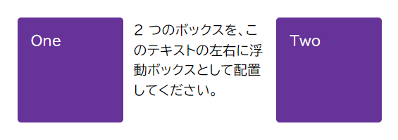
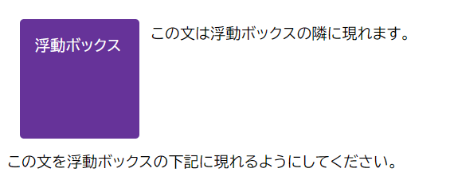
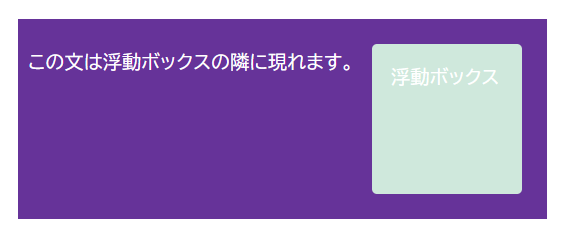

このスキルテストの目的は、 [CSS の浮動ボックス](/ja/docs/Learn_web_development/Core/CSS_layout/Floats)を理解しているかを評価するために、 {{CSSxRef("float")}} と {{CSSxRef("clear")}} プロパティと値、そして浮動ボックスをクリアするその他の方法を使用することです。今までに扱った素材のさまざまな要素を使用する、 3 つの小さな課題に取り組んでいただきます。

> [!NOTE]
> 手助けが必要な場合は、[スキルテスト](/ja/docs/Learn_web_development#スキルテスト)使用ガイドをお読みください。また、[コミュニケーションチャネル](/ja/docs/MDN/Community/Communication_channels)のいずれかを使用して、私たちに連絡することもできます。

## 課題 1

この課題では、クラスが `float1` と `float2` の 2 つの要素をそれぞれ左右に浮動させる必要があります。テキストは下記の画像のように 2 つのボックスの間に現れるはずです。



```html-nolint live-sample___float1
<div class="box">
  <div class="float float1">One</div>
  <div class="float float2">Two</div>
  <p>2 つのボックスを、このテキストの左右に浮動ボックスとして配置してください。</p>
</div>
```

```css live-sample___float1
body {
  font: 1.2em / 1.5 sans-serif;
}

* {
  box-sizing: border-box;
}

.box {
  padding: 0.5em;
}

.float {
  margin: 15px;
  width: 150px;
  height: 150px;
  border-radius: 5px;
  background-color: rebeccapurple;
  color: #fff;
  padding: 1em;
}

.float1 {
  /* ここにスタイルを追加 */
}

.float2 {
  /* ここにスタイルを追加 */
}
```

{{EmbedLiveSample("float1", "", "210px")}}

<details>
<summary>ここをクリックすると、模範解答を表示します。</summary>

次のように、両方のボックスに `float` を使用します。

```css
.float1 {
  float: left;
}

.float2 {
  float: right;
}
```

</details>

## 課題 2

この課題を完成させるには、次のようにしてください。

1. この課題では、クラスが `float` の要素を左に浮動させてください。
2. そして、最初の行のテキストはその要素の隣に表示し、続く行のテキスト（クラス `below` を持つ）はその下に表示してください。

最終結果は下記の画像のようになるはずです。



```html live-sample___float2
<div class="box">
  <div class="float">浮動ボックス</div>
  <p>この文は浮動ボックスの隣に現れます。</p>
  <p class="below">この文を浮動ボックスの下記に現れるようにしてください。</p>
</div>
```

```css live-sample___float2
body {
  font: 1.2em / 1.5 sans-serif;
}

* {
  box-sizing: border-box;
}

.box {
  padding: 0.5em;
}

.float {
  margin: 15px;
  width: 150px;
  height: 150px;
  border-radius: 5px;
  background-color: rebeccapurple;
  color: #fff;
  padding: 1em;
}

.float {
  /* ここにスタイルを追加 */
}

.below {
  /* ここにスタイルを追加 */
}
```

{{EmbedLiveSample("float2", "", "300px")}}

<details>
<summary>ここをクリックすると、模範解答を表示します。</summary>

アイテムを左に配置し、 2 つ目の段落のクラスに `clear: left` を追加する必要があります。

```css
.float {
  float: left;
}

.below {
  clear: left;
}
```

</details>

## 課題 3

この課題では、浮動ボックスがあります。浮動ボックスとテキストを包むボックスは、浮動ボックスの後ろに表示されています。

利用できる最新の方法を使用して、下記の画像のようにボックスの背景を浮動ボックスの下まで拡張させてください。



```html live-sample___float3
<div class="box">
  <div class="float">浮動ボックス</div>
  <p>この文は浮動ボックスの隣に現れます。</p>
</div>
```

```css live-sample___float3
body {
  font: 1.2em / 1.5 sans-serif;
}

* {
  box-sizing: border-box;
}

.box {
  padding: 0.5em;
}

.float {
  margin: 15px;
  width: 150px;
  height: 150px;
  border-radius: 5px;
  background-color: rgb(207 232 220);
  padding: 1em;
  color: #fff;
}

.box {
  background-color: rebeccapurple;
  padding: 10px;
  color: #fff;
}

.float {
  float: right;
}

.box {
  /* ここにスタイルを追加 */
}
```

{{EmbedLiveSample("float3", "", "300px")}}

<details>
<summary>ここをクリックすると、模範解答を表示します。</summary>

浮動ボックスの下にあるボックスを解除するには、 `.box` のクラスに `display: flow-root` を追加します。
他にも、 `overflow` や clearfix ハックを使用する方法もありますが、教材では、この目的を達成するための最新の方法として、 `flow-root` メソッドについて詳しく説明しています。

```css
.box {
  display: flow-root;
}
```

</details>
