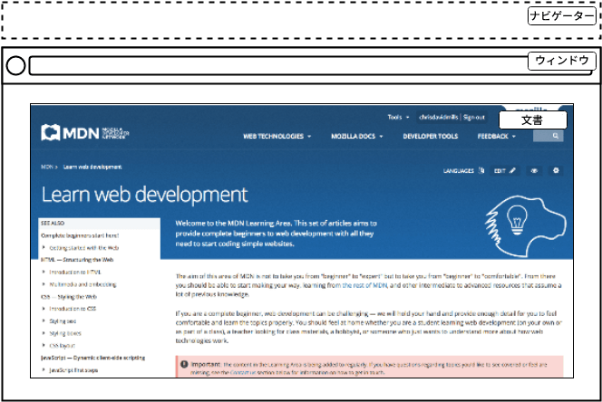

{{PreviousMenuNext("Learn_web_development/Core/Scripting/Test_your_skills/Object_basics","Learn_web_development/Core/Scripting/Image_gallery", "Learn_web_development/Core/Scripting")}}

ウェブページやアプリを書くとき、最もよく行うことのひとつが、何らかの方法で文書内の構造を操作することでしょう。これは通常、ドキュメントオブジェクトモデル (DOM) を使用して行われます。これは HTML とスタイル情報を制御するための API の集合です。この記事では **DOM スクリプティング**にご案内します。

<table>
  <tbody>
    <tr>
      <th scope="row">前提知識:</th>
      <td><a href="/ja/docs/Learn_web_development/Core/Structuring_content">HTML</a>および<a href="/ja/docs/Learn_web_development/Core/Styling_basics">CSS の基礎</a>を理解し、これまでのレッスンで説明した JavaScript を把握していること。</td>
    </tr>
    <tr>
      <th scope="row">学習成果:</th>
      <td>
        <ul>
          <li>DOM とは何か。ブラウザーの内部表現であり、文書内の HTML 構造をオブジェクトの階層として表したもの。</li>
          <li>JavaScript で表されるウェブブラウザーの重要な部分。 <code>Navigator</code>、<code>Window</code>、<code>Document</code>。</li>
          <li>DOM ノードが DOM ツリー内で相対的にどのように存在しているか（ルート、親、子、兄弟、子孫など）。</li>
          <li>DOM ノードを参照し、新しいノードを作成し、ノードや属性を追加したり除去したりすること。</li>
          <li>JavaScript で CSS スタイルを操作すること。</li>
        </ul>
      </td>
    </tr>
  </tbody>
</table>

## ウェブブラウザーの重要なパーツ

ウェブブラウザーはとてもたくさんの動いている部品からなるソフトウェアの複雑な集合体で、部品の多くはウェブ開発者が JavaScript を使用して制御や操作をすることはできません。こんな制約はよろしくないと思う方もいるかもしれませんが、ブラウザーが保護されているのには十分な理由があって、これは主にセキュリティ関係のためです。もしあるウェブサイトが保存しているパスワードやその他の秘密情報にアクセスできて、あなたのふりをして他のサイトにログインできたとしたらどう思いますか。

制限はありますが、ウェブ API は多くの機能へのアクセスを提供し、ウェブページで非常に多くのことを行うことを可能にしてくれます。コードで定期的に参照する実に明白な部分がいくつかあります。以下の図は、ウェブページの表示に直接関係するブラウザーの主要な部分を表しています。



- **ウィンドウ**は、ウェブページが読み込まれるブラウザーのタブを表します。これは JavaScript では {{domxref("Window")}} オブジェクトで表現されます。このオブジェクトに備わるメソッドを使って、ウィンドウの大きさを調べたり（{{domxref("Window.innerWidth")}} と {{domxref("Window.innerHeight")}} を参照）、ウィンドウに読み込まれる文書を操作したり、その文書に関係するデータをクライアント側で保存したり（例えばローカルデータベースや他のデータ保存機構）、現在のウィンドウに対して[イベントハンドラー](/ja/docs/Learn_web_development/Core/Scripting/Events)を追加したりすることができます。
- **ナビゲーター**は、ブラウザー（すなわちユーザーエージェント）の状態やウェブ上における存在の身元を表します。JavaScript では {{domxref("Navigator")}} オブジェクトで表わされます。このオブジェクトを使用して、ユーザーの好む言語や、ユーザーのウェブカメラからのメディアストリームなどを取得することができます。
- **文書**（ブラウザーでは DOM で表される）は、ウィンドウに読み込まれた実際のページであり、JavaScript では {{domxref("Document")}} オブジェクトで表されます。このオブジェクトを使用して、文書を構成する HTML と CSS に関する情報を返したり、操作したりすることができます。例えば、DOM 内の要素への参照を取得し、そのテキストコンテンツを変更し、新しいスタイルを適用し、新しい要素を作成して現在の要素に子として追加したり、あるいは完全に削除したりすることができます。

この記事では、主に文書内の操作に焦点を当てますが、それ以外にもいくつか有用な点を紹介します。

## ドキュメントオブジェクトモデル

このコースの前半でも見かけた、ドキュメントオブジェクトモデル (DOM) について、簡単に復習しておきましょう。ブラウザーのそれぞれのタブに現在読み込まれている文書は、 DOM によって表されます。これは、ブラウザーが作成した「ツリー構造」の表現で、プログラミング言語から HTML の構造に簡単にアクセスできるようになっています。例えば、ブラウザー自身はこれを使用して、ページを表示するときに正しい要素にスタイルやその他の情報を適用し、開発者はページが表示された後に JavaScript で DOM を操作することができます。

> [!NOTE]
> Scrimba の [The Document Object Model](https://scrimba.com/learn-javascript-c0v/~0g?via=mdn) [_MDN 学習パートナー_](/ja/docs/MDN/Writing_guidelines/Learning_content#外部リンクと埋め込み)</sup> は、"DOM"という用語とその意味について、わかりやすい解説を提供しています。

[dom-example.html](https://github.com/mdn/learning-area/blob/main/javascript/apis/document-manipulation/dom-example.html) にちょっとした例を作成しました（[ライブ実行](https://mdn.github.io/learning-area/javascript/apis/document-manipulation/dom-example.html)もどうぞ）。ブラウザーから開いてみてください。これはとても簡素なページで、{{htmlelement("section")}} 要素の中に画像が一つと、一つのリンクを含む一つの段落があります。HTML のソースはこんな感じです。

```html-nolint
<!doctype html>
<html lang="ja">
  <head>
    <meta charset="utf-8" />
    <title>シンプルな DOM の例</title>
  </head>
  <body>
    <section>
      
      <p>
        ここに、<a href="https://www.mozilla.org/">Mozilla ホームページ</a>へのリンクを追加します。
      </p>
    </section>
  </body>
</html>
```

一方、 DOM はこのようになります。


> [!NOTE]
> この DOM ツリーの図は Ian Hickson の [Live DOM viewer](https://software.hixie.ch/utilities/js/live-dom-viewer/) を使って作成しました。

ツリーのそれぞれの商品は、**ノード**と呼ばれます。上の図では、ノードには要素（`HTML`、`HEAD`、`META` などと識別される）を表すものや 、テキスト（`#text` と識別される）を表すものがあることが分かります。[他の種類のノード](/ja/docs/Web/API/Node/nodeType)もありますが、よく見かけるものはこれらのものです。

また、ノードは、ツリーの中で他のノードからの相対的な位置によって参照されます。

- **ルートノード (Root node)**: ツリーの最上位ノードで、HTML の場合は常に `HTML` ノードです（SVG や独自の XML など他のマークアップ語彙では、別の最上位要素があります）。
- **子ノード (Child node)**: 他のノード内の*直下*にあるノードです。上の例では、例えば `IMG` は `SECTION` の子ノードとなります。
- **子孫ノード (Descendant node)**: 他のノード内の*どこか*にあるノードです。上の例では、例えば `IMG` は `SECTION` の子ノードであり、子孫ノードでもあります。`IMG` は `BODY` の 2 段階内側にあるので `BODY` の子ノードではありませんが、`BODY` の子孫ノードではあります。
- **親ノード (Parent node)**: その中に他のノードを持つノードです。例えば上の例では `BODY` は `SECTION` ノードの親ノードになります。
- **兄弟ノード (Sibling node)**: DOM ツリーの同じ階層にあるノードです。上の例では `IMG` と `P` は兄弟ノードになります。

これからコードを見ていくとこういう語が頻出するので、 DOM を使い始める前に、これらの用語をしっかり覚えておくと良いでしょう。また、CSS でもこれらの語を見かけることでしょう（子孫セレクター、子セレクターなど）。

## 基本的な DOM 操作をいくつか実行

DOM 操作の学習を始めるにあたり、まずは実践的な例から始めましょう。

1. [dom-example.html のページ](https://github.com/mdn/learning-area/blob/main/javascript/apis/document-manipulation/dom-example.html) と[画像](https://github.com/mdn/learning-area/blob/main/javascript/apis/document-manipulation/dinosaur.png)のローカルコピーを一緒に作成して下さい。
2. `<script></script>` 要素を、閉じ `</body>` タグのすぐ上に追加して下さい。
3. DOM の中の要素を操作するため、まず DOM を選びだしてこれへの参照を変数に保存する必要があります。script 要素の中に、次の行を追加して下さい。

   ```js
   const link = document.querySelector("a");
   ```

4. 要素への参照を変数に保存したので、これが備えているプロパティとメソッドを使って DOM の操作を始められます（利用できるプロパティとメソッドは、たとえば {{htmlelement("a")}} 要素であれば {{domxref("HTMLAnchorElement")}} インターフェイス、さらにその汎化した親のインターフェイス {{domxref("HTMLElement")}} や {{domxref("Node")}} — これは DOM の全てノードが相当します — で定義されています）。まずは、リンクの中のテキストを、{{domxref("Node.textContent")}} プロパティを更新する事で変更してみましょう。上で書いた行の下に、次の行を追加して下さい。

   ```js
   link.textContent = "Mozilla Developer Network";
   ```

5. クリックされたときに間違った場所に行かないよう、リンクが指す先の URL も変えておくべきでしょう。また下に、以下の行を追加して下さい。

   ```js
   link.href = "https://developer.mozilla.org";
   ```

JavaScript でよくあることですが、要素を選択し、その参照を変数に格納する方法はたくさんあることに注意してください。{{domxref("Document.querySelector()")}} は、現代の手法として推奨されています。CSS のセレクターを使用して要素を選択することができるので便利です。上記の `querySelector()` 呼び出しは、文書内に最初に現れる {{htmlelement("a")}} 要素を選択します。もし、複数の要素を選択して何かをしたいのであれば、 {{domxref("Document.querySelectorAll()")}} を使用することができます。これはセレクターに一致する文書内のすべての要素を選択し、それらへの参照を[配列](/ja/docs/Learn_web_development/Core/Scripting/Arrays)風のオブジェクトである {{domxref("NodeList")}} に格納します。

要素への参照を得るためには、次のような古いやり方もあります。

- {{domxref("Document.getElementById()")}} は、指定された `id` 属性値を持つ要素を選択します。例えば `<p id="myId">My paragraph</p>` の場合、この関数に引数として ID を渡します。すなわち、 `const elementRef = document.getElementById('myId')` とします。
- {{domxref("Document.getElementsByTagName()")}} は、指定した種類の全ての要素を配列風オブジェクトに入れて返します、例えばすべての `<p>`、すべての `<a>` などです。要素の型をこの関数に引数として渡します。すなわち、 `const elementRefArray = document.getElementsByTagName('p')` のようにします。

この 2 つは、古いブラウザーでは `querySelector()` のような現代のメソッドよりもよく対応していますが、それほど便利なものではありません。他にどんなものがあるか、探してみてください。

### 新しいノードの作成と配置

以上、何ができるかを少しばかり紹介しましたが、さらに進んで、新しい要素を作成する方法を見てみましょう。

1. 現在の例題に戻って、 {{htmlelement("section")}} 要素を掴むところから始めましょう。すでに書いてあるスクリプトの下に次のコードを追加して下さい（この先の他の行についても、同じようにしてください）。

   ```js
   const sect = document.querySelector("section");
   ```

2. {{domxref("Document.createElement()")}} を使って新しい段落を作成し、先ほどと同じようにテキストコンテンツを与えてみましょう。

   ```js
   const para = document.createElement("p");
   para.textContent = "We hope you enjoyed the ride.";
   ```

3. この新しい段落は、セクションの最後に {{domxref("Node.appendChild()")}} を使って追加することができます。

   ```js
   sect.appendChild(para);
   ```

4. 最後に、この部分のために、リンクがある段落にテキストノードを追加して、文章をきれいにまとめましょう。まず、 {{domxref("Document.createTextNode()")}}を使って、テキストノードを作成します。

   ```js
   const text = document.createTextNode(
     " — the premier source for web development knowledge.",
   );
   ```

5. ここで、リンクが含まれている段落への参照を取得し、そこにテキストノードを追加します。

   ```js
   const linkPara = document.querySelector("p");
   linkPara.appendChild(text);
   ```

DOM にノードを追加するために必要なものは、これでほとんど揃いました。動的なインターフェイスを構築する際には、これらのメソッドを多く使用することになるでしょう（後でいくつかの例を見てみましょう）。

### 要素の移動や除去

ノードを移動させたり、 DOM から完全に除去したい場合があります。これは完全に可能です。

リンクが含まれる段落を節の一番下に移動させたい場合は、このようにします。

```js
sect.appendChild(linkPara);
```

これは段落をセクションの一番下に移動させます。 2 つ目のコピーができると思ったかもしれませんが、そうではありません。 `linkPara` は、その段落の唯一のコピーを参照するものなのです。もしコピーを作成してそれも追加したい場合は、代わりに {{domxref("Node.cloneNode()")}} を使用する必要があります。

ノードの削除も、少なくとも削除するノードとその親への参照がある場合は、とても簡単です。今回の例では、以下のように {{domxref("Node.removeChild()")}} を使用するだけです。

```js
sect.removeChild(linkPara);
```

よくあることですが、自分自身を参照しているノードだけを削除したい場合は、 {{domxref("Element.remove()")}} を使用することができます。

```js
linkPara.remove();
```

このメソッドは、古いブラウザーでは対応していません。これらのブラウザーには、ノードに自分自身を削除するように指示するメソッドがないため、以下のようにする必要があります。

```js
linkPara.parentNode.removeChild(linkPara);
```

上の行をコードに追加してやってみて下さい。

### スタイルの操作

いろんなやり方で CSS スタイルを JavaScript から操作することができます。

まず始めに、 {{domxref("Document.styleSheets")}} を使用すると、文書に添付されているすべてのスタイルシートのリストを、{{domxref("CSSStyleSheet")}} オブジェクトが入った配列風のオブジェクトで返します。これで、好きなようにスタイルを追加したり削除したりすることができます。しかし、これらの機能はやや古風で、スタイルを操作するのが難しい方法であるため、ここでは紹介しないことにします。もっと簡単な方法があります。

最初の方法は、動的にスタイルを設定したい要素に直接インラインスタイルを追加することです。これは {{domxref("HTMLElement.style")}} プロパティで行われ、文書内の各要素に対するインラインスタイル情報を含んでいます。このオブジェクトのプロパティを設定することで、要素のスタイルを直接更新することができます。

1. 例として、作成中の例題に以下の行を追加してみて下さい。

   ```js
   para.style.color = "white";
   para.style.backgroundColor = "black";
   para.style.padding = "10px";
   para.style.width = "250px";
   para.style.textAlign = "center";
   ```

2. ページを再読み込みすると、スタイルがその段落に適用されていることがわかります。その段落をブラウザーの[ページインスペクター/DOM インスペクター](https://firefox-source-docs.mozilla.org/devtools-user/page_inspector/index.html)で見てみると、これらの行が確かに文書内のスタイルを追加していることがわかります。

   ```html
   <p
     style="color: white; background-color: black; padding: 10px; width: 250px; text-align: center;">
     We hope you enjoyed the ride.
   </p>
   ```

> [!NOTE]
> JavaScript のプロパティ版では、 CSS スタイルが{{Glossary("camel_case", "小文字のキャメルケース")}}で書かれているのに対し、CSS 版はハイフン区切り（{{Glossary("kebab_case", "ケバブケース")}}）で書かれていることに注意してください（`backgroundColor` と `background-color` など）。これらを混合しないように注意してください。さもなければ、これは動作しません。

文書のスタイルを動的に変更するもう 1 つの一般的な方法は、スタイルを別のスタイルシートに記述し、クラス名の追加や削除によってそれらのスタイルを参照する方法です。

1. さっき JavaScript に追加した 5 行を削除します。
2. HTML の {{htmlelement("head")}} の中に、以下を追加します。

   ```html
   <style>
     .highlight {
       color: white;
       background-color: black;
       padding: 10px;
       width: 250px;
       text-align: center;
     }
   </style>
   ```

3. このクラス名を、この要素の {{domxref("Element/classList", "classList")}} の `add()` メソッドを使用して、要素に追加します。

   ```js
   para.classList.add("highlight");
   ```

4. ページを更新すると、何も変化がないことがわかります。CSS は引き続き段落に適用されていますが、今回はインライン CSS スタイルではなく、CSS ルールによって選択されたクラスが与えられています。

どちらの方法を選ぶかは、あなた次第です。どちらも長所と短所があります。最初の方法は設定が少なくて済み、単純な使用に適しています。一方、 2 番目の方法はより純粋主義的です（CSS と JavaScript を混合しない、悪しき習慣とされるインラインスタイルも使用しない）。より大規模で複雑なアプリを作り始めると、おそらく 2 つ目の方法をより多く使用するようになるでしょうが、それは実にあなた次第です。

この点で、我々は実際に有用なことは何もしていません! 静的コンテンツを作成するために JavaScript を使用する意味はありません。 JavaScript を使用せず、 HTML に記述したほうがよいでしょう。 HTML よりも複雑ですし、 JavaScript でコンテンツを作成することには他にも付随する問題があります（検索エンジンに読み取られないなど）。

次の節では、 DOM API をより有用に使用する方法を見ていきます。

> [!NOTE]
> [dom-example.html の完成版](https://github.com/mdn/learning-area/blob/main/javascript/apis/document-manipulation/dom-example-manipulated.html) のデモが GitHub にあります（[ライブ実行版も](https://mdn.github.io/learning-area/javascript/apis/document-manipulation/dom-example-manipulated.html)）。

## 動的な買い物リストの作成

この演習では、フォームの入力欄とボタンを使用して商品を追加できる動的な買い物リストを作成します。入力欄に商品名を入力し、ボタンをクリックするか、<kbd>Enter</kbd> キーを押すと、次のような動作になるようにしてください。

- その商品がリストに現れます。
- それぞれの商品には、押すとその商品をリストから削除するためのボタンを設定します。
- 入力欄は空になり、次の商品を入力できるようになります。

完成版のデモはこんな感じになるでしょう。

```html hidden live-sample___dynamic-shopping-list
<h1>買い物リスト</h1>

<form>
  <label for="item">新しい商品を入力:</label>
  <input type="text" name="item" id="item" />
  <button>商品を追加</button>
</form>

<ul></ul>
```

```css hidden live-sample___dynamic-shopping-list
li {
  margin-bottom: 10px;
}

li button {
  font-size: 12px;
  margin-left: 20px;
}
```

```js hidden live-sample___dynamic-shopping-list
const list = document.querySelector("ul");
const input = document.querySelector("input");
const button = document.querySelector("button");

button.addEventListener("click", (event) => {
  event.preventDefault();

  const myItem = input.value;
  input.value = "";

  const listItem = document.createElement("li");
  const listText = document.createElement("span");
  const listBtn = document.createElement("button");

  listItem.appendChild(listText);
  listText.textContent = myItem;
  listItem.appendChild(listBtn);
  listBtn.textContent = "削除";
  list.appendChild(listItem);

  listBtn.addEventListener("click", () => {
    list.removeChild(listItem);
  });

  input.focus();
});
```

{{EmbedLiveSample("dynamic-shopping-list", "100%", 300)}}

この課題を完了させるには、以下のステップに従い、上で説明した通りに買い物リストが動くようにして下さい。

1. まず私たちが用意した [shopping-list.html](https://github.com/mdn/learning-area/blob/main/javascript/apis/document-manipulation/shopping-list.html) 初期ファイルをダウンロードしてローカルコピーをどこかに作成してください。最小限の CSS、ラベルのついたリスト、input とボタン、空のリストと {{htmlelement("script")}} 要素が書いてあるはずです。この先書き足していくものは全部 script の中に書きます。
2. ({{htmlelement("ul")}}) と {{htmlelement("input")}} と {{htmlelement("button")}} 要素への参照を保持する 3 つの変数を作成します。
3. ボタンがクリックされた時の応答として走らせる[関数](/ja/docs/Learn_web_development/Core/Scripting/Functions)を作成します。
4. 関数本体では、まず [`preventDefault()`](/ja/docs/Web/API/Event/preventDefault) を呼び出します。入力フィールドはフォーム要素で囲まれているため、<kbd>Enter</kbd> キーを押すとフォームが送信されます。`preventDefault()` を呼び出すことで、フォームによるページの再読み込みが阻止され、代わりにリストに新しい商品が追加できるようになります。
5. 関数本体は、input 要素の現在の[値](/ja/docs/Web/API/HTMLInputElement#プロパティ)を変数に保存するところから始めます。
6. 次に、input 要素の値に空文字列 (`''`) を代入して、 input 要素を空にします。
7. 3 つの要素を作成します — リストアイテム ({{htmlelement('li')}}) と {{htmlelement('span')}} と {{htmlelement('button')}} で、これらを変数に保存します。
8. span と button をリスト商品の子に追加します。
9. span のテキストに、先ほど保存した input 要素の値を代入し、ボタンのテキストを「削除」にします。
10. できたリスト商品をリストの子に追加します。
11. 削除ボタンにイベントハンドラーを追加して、クリックされたらボタンが含まれているリスト商品全体を削除するようにします。
12. 最後に、[`focus()`](/ja/docs/Web/API/HTMLElement/focus) メソッドを使って input 要素にフォーカスし、次の買い物リスト商品をすぐに入力できるようにします。

## まとめ

文書と DOM の操作に関する学習は、これで終わりです。この時点で、文書やユーザーのウェブ体験の他の側面を制御することに関して、ウェブブラウザーの重要な部分が何であるかを理解しているはずです。最も重要なことは、ドキュメントオブジェクトモデルとは何か、そして有用な機能を作成するためにそれをどのように操作するかを理解することです。

## 関連情報

- 文書を操作するために利用できる機能は他にもたくさんあります。以下の参考資料を確認して、どんな機能があるか探してみてください。
  - {{domxref("Document")}}
  - {{domxref("Window")}}
  - {{domxref("Node")}}
  - {{domxref("HTMLElement")}}, {{domxref("HTMLInputElement")}}, {{domxref("HTMLImageElement")}}, など
- [DOM Scripting](https://explainers.dev/dom-scripting/) - explainers.dev

{{PreviousMenuNext("Learn_web_development/Core/Scripting/Test_your_skills/Object_basics","Learn_web_development/Core/Scripting/Image_gallery", "Learn_web_development/Core/Scripting")}}
