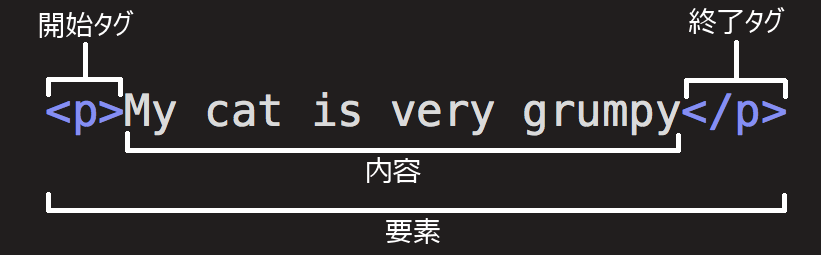
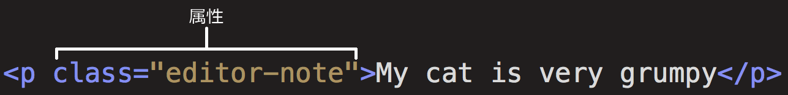

{{LearnSidebar}}

{{NextMenu("Learn_web_development/Core/Structuring_content/Webpage_metadata", "Learn_web_development/Core/Structuring_content")}}

この記事では HTML の不変的な基礎を扱って、始められるようにします。要素や属性などの重要な用語 (すでに聞き覚えはあるかもしれません)、それらが言語にどう組み込まれているか説明します。また、HTML 要素の構造、典型的な HTML ページの構造を見せて、その他の重要な基礎言語機能について説明します。それでは、 HTML の例とともに見ていきましょう。

<table>
  <tbody>
    <tr>
      <th scope="row">前提条件:</th>
      <td>
        <a href="/ja/docs/Learn_web_development/Getting_started/Environment_setup/Installing_software">基本的なソフトウェアのインストール</a>、<a href="/ja/docs/Learn_web_development/Getting_started/Environment_setup/Dealing_with_files">ファイルの取り扱い</a>に関する基本的な理解。
      </td>
    </tr>
    <tr>
      <th scope="row">学習成果:</th>
      <td>
        <ul>
          <li>HTML 要素の構造 — 要素、開始タグ、コンテンツ、終了タグ、属性。</li>
          <li>HTML本文と、ページコンテンツのコンテナーとしてのその目的。</li>
          <li><a href="/ja/docs/Glossary/Void_element">空要素</a>とは何か、また、他の要素とどのように異なるか。</li>
          <li>HTML 文書内の先頭に文書型を記述する必要性。その元々の意図通りに機能していること、そして、これで過去には何かしらの成果があったという事実。</li>
          <li>HTML は正しく入れ子にする必要があることを理解すること。</li>
        </ul>
      </td>
    </tr>
  </tbody>
</table>

## HTML とは？

{{glossary("HTML")}} (ハイパーテキストマークアップ言語、HyperText Markup Language) は、訪れたウェブサイトの構成をブラウザーに対して伝えるために使うマークアップ言語です。 HTML 言語はウェブ開発者が望むこと次第で、複雑なものにも簡単なものにもなります。HTML は{{glossary("Element", "要素")}}の集まりからなり、コンテンツの一部を要素で囲む（*マークアップ*する）ことで、特定の見せ方・動かし方に変えられます。囲むための{{glossary("Tag", "タグ")}}は、コンテンツの一部をハイパーリンク（ウェブ上の別ページへリンクすること）にしたり、単語を斜体にしたりすることができます。たとえば、次の一行を見てください。

```plain
My cat is very grumpy
```

この行を独立させたい場合、それを段落要素 ({{htmlelement("p")}}) で囲んで段落であることを指定することができます。

```html
<p>My cat is very grumpy</p>
```

> [!NOTE]
> HTML のタグは大文字小文字を区別しません。つまり大文字でも小文字でも書くことができます。例えば {{htmlelement("title")}} タグは `<title>`、`<TITLE>`、`<Title>`、`<TiTlE>` などと書くことができ、どれも正しく動作します。しかし、すべての要素を小文字で書くことが、一貫性や信頼性、その他の理由のために最良の習慣です。

## HTML 要素の構成

前段で紹介した段落要素についてもう少し詳しく見ていきましょう。



この要素の主要な部分は次のとおりです。

- **開始タグ (Opening tag):** 要素名（この場合は段落を表す _p_）、囲んでいる開き山括弧と閉じ山括弧で構成されます。これは要素が始まってその効果が開始する位置を宣言します。この場合、段落が始まる位置です。
- **内容 (Content):** これは要素の内容です。この例の場合、段落のテキストです。
- **終了タグ (Closing tag):** 開始タグと同じですが、要素名の前にスラッシュを記載します。これは、要素の終わりを示すものです。終了タグを記載し忘れるのは、初心者にありがちなミスで、おかしな結果を生むことがあります。

要素は開始タグ、内容、終了タグが続いたものです。

### アクティブラーニング: 最初の HTML 要素を作ってみる

下記の「編集可能なコード」内の行を `<em>` および `</em>` タグで囲むよう編集してください。要素を開始するには、開始タグ `<em>` を行の先頭に付けてください。要素を終了するには、行の最後に終了タグ `</em>` を付けてください。こうすることで、行がイタリック体（斜体）で書式化されるはずです。変更した内容が _Output_ 領域に反映されるのを確認してください。

もし入力ミスをしても、_リセット_ ボタンを押すことでいつでもリセットできます。本当に行き詰ってしまったら、 _答えを見る_ ボタンを押せば答えを見ることができます。

```html hidden
<h2>ライブ出力</h2>
<div class="output" style="min-height: 50px;"></div>

<h2>編集可能なコード</h2>
<p class="a11y-label">
  Esc を押すとコード領域からフォーカスを移動させることができます（Tab
  はタブ文字を挿入します）。
</p>

<textarea id="code" class="playable-code" style="min-height: 100px;width: 95%">
  This is my text.
</textarea>

<div class="controls">
  <input id="reset" type="button" value="リセット" />
  <input id="solution" type="button" value="答えを見る" />
</div>
```

```css hidden
html {
  font-family: "Open Sans Light", Helvetica, Arial, sans-serif;
}

h2 {
  font-size: 16px;
}

.a11y-label {
  margin: 0;
  text-align: right;
  font-size: 0.7rem;
  width: 98%;
}

body {
  margin: 10px;
  background: #f5f9fa;
}
```

```js hidden
const textarea = document.getElementById("code");
const reset = document.getElementById("reset");
const solution = document.getElementById("solution");
const output = document.querySelector(".output");
const code = textarea.value;
let userEntry = textarea.value;

function updateCode() {
  output.innerHTML = textarea.value;
}

const htmlSolution = "<em>This is my text.</em>";
let solutionEntry = htmlSolution;

reset.addEventListener("click", () => {
  textarea.value = code;
  userEntry = textarea.value;
  solutionEntry = htmlSolution;
  solution.value = "答えを見る";
  updateCode();
});

solution.addEventListener("click", () => {
  if (solution.value === "答えを見る") {
    textarea.value = solutionEntry;
    solution.value = "答えを隠す";
  } else {
    textarea.value = userEntry;
    solution.value = "答えを見る";
  }
  updateCode();
});

textarea.addEventListener("input", updateCode);
window.addEventListener("load", updateCode);

// テキストエリアでのタブキーによるタブ移動を止め、
// 代わりにキャレット位置にタブを書くようにします。
textarea.onkeydown = (e) => {
  if (e.code === "Tab") {
    e.preventDefault();
    insertAtCaret("\t");
  }

  if (e.code === "Escape") {
    textarea.blur();
  }
};

function insertAtCaret(text) {
  const scrollPos = textarea.scrollTop;
  let caretPos = textarea.selectionStart;

  const front = textarea.value.substring(0, caretPos);
  const back = textarea.value.substring(
    textarea.selectionEnd,
    textarea.value.length,
  );
  textarea.value = front + text + back;
  caretPos += text.length;
  textarea.selectionStart = caretPos;
  textarea.selectionEnd = caretPos;
  textarea.focus();
  textarea.scrollTop = scrollPos;
}

// ユーザーがテキストエリアのコードを更新するたびに、保存されている userCode を更新します。

textarea.onkeyup = () => {
  // ユーザーコードが表示されているときのみ状態を保存したい。
  // 答えがユーザーコードのを上書きして保存されることはありません。
  if (solution.value === "答えを見る") {
    userEntry = textarea.value;
  } else {
    solutionEntry = textarea.value;
  }

  updateCode();
};
```

{{ EmbedLiveSample('Active_learning_creating_your_first_HTML_element', 700, 400, "", "") }}

### 要素を入れ子にする

要素の中に要素を入れることができます。これは**入れ子**（ネスト）と呼ばれています。たとえば "My cat is **very** grumpy." と記述したい場合、"very" という語を {{htmlelement("strong")}} 要素で囲むことができ、その語がより強く強調表示されることを意味します。

```html
<p>My cat is <strong>very</strong> grumpy.</p>
```

入れ子にする方法には、正しい方法と間違った方法があります。上の例では、最初に `p` 要素を始め、次に `strong` 要素を始めました。適切に入れ子にするには、先に `strong` 要素を閉じてから `p` を閉じなければなりません。

次のものは、間違った入れ子の例です。

```html-nolint example-bad
<p>My cat is <strong>very grumpy.</p></strong>
```

**タグを開始および終了するには、互いの内側または外側にあるような形にしなければなりません**。上の例のような重ね方では、ブラウザーはあなたの意図を推測しなければなりません。このような推測は、予期しない結果をもたらす可能性があります。

### 空要素

全ての要素が上述の開始タグ、コンテンツ、終了タグのパターンに従っているわけではありません。要素によっては単一のタグのみで構成され、通常、文書内でそれが含まれている場所に何かを挿入したり埋め込んだりするために使用されます。そのような要素は{{glossary("void element", "空要素")}}と呼ばれます。例えば、以下の {{htmlelement("img")}} 要素はウェブページ上のそれが含まれた場所に 1 つの画像ファイルを埋め込みます。

```html

```

これはページに次の画像を出力するはずです。

{{ EmbedLiveSample('Void_elements', 700, 300, "", "") }}

> [!NOTE]
> HTML では、例えば `` のように、空要素のタグの末尾に `/` を追加する必要はありません。しかし、これは有効な構文であり、 HTML を有効な XML にしたい場合に使うことがあります。

## 属性

要素は次のように属性 (Attribute) を持つこともできます。



属性は実際のコンテンツの中で表示させたくない、要素に関する追加情報を保有します。この例では、**`class`** 属性は、要素をスタイル情報の対象とするために使用される識別名です。

各属性は次の要件を満たす必要があります。

1. 属性名と要素名の間に 1 つの半角空白（その要素内にすでに 1 つ以上の属性が設定されている場合は、併せて各属性名の間）
2. 属性名とそれに続く等号 (=)
3. 属性値、先頭と末尾を引用符で囲む

### アクティブラーニング: 要素に属性を追加する

`` 要素はいくつもの属性を取ることができます。例えば次のようなものです。

- `src`
  - : `src` 属性は**必須**の属性であり、画像の位置を指定します。例えば、 `src="https://raw.githubusercontent.com/mdn/beginner-html-site/gh-pages/images/firefox-icon.png"` のようにします。
- `alt`
  - : `alt` 属性は画像のテキストでの説明を示します。例えば、 `alt="The Firefox icon"` のようにします。
- `width`
  - : `width` 属性は、画像の幅をピクセル単位で指定します。例えば、 `width="300"` のようにします。
- `height`
  - : `height` 属性は、画像の幅をピクセル単位で指定します。例えば、 `height="300"` のようにします。

それでは下記の入力欄の中の行を編集して、画像に変更してみましょう。

1. お好みの画像をオンラインで探し、正しいクリックをし、[画像のリンク/アドレスをコピー] をクリックします。
2. 下記のエリアに戻り、`src`属性を追加し、段階1からのリンクを記入します。
3. `alt` 属性を設定します。
4. `width` および `height` 属性を追加します。

変更は、ライブ出力領域でリアルタイムに確認できます。

もし、間違えた場合は、常に _リセット_ ボタンを使用してリセットすることができます。実に困ったときは、_答えを見る_ ボタンを押して、答えを見ることができます。

```html-nolint hidden
<h2>ライブ出力</h2>

<div class="output" style="min-height: 50px;"></div>

<h2>編集可能なコード</h2>
<p class="a11y-label">
  Esc を押すとコード領域からフォーカスを移動させることができます（Tab はタブ文字を挿入します）。
</p>

<textarea id="code" class="input" style="min-height: 100px;width: 95%">
&lt;img alt="これは画像であるべきです" &gt;
</textarea>

<div class="playable-buttons">
  <input id="reset" type="button" value="リセット" />
  <input id="solution" type="button" value="答えを見る" />
</div>
```

```css hidden
html {
  font-family: sans-serif;
}

h2 {
  font-size: 16px;
}

.a11y-label {
  margin: 0;
  text-align: right;
  font-size: 0.7rem;
  width: 98%;
}

body {
  margin: 10px;
  background: #f5f9fa;
}
```

```js hidden
const textarea = document.getElementById("code");
const reset = document.getElementById("reset");
const solution = document.getElementById("solution");
const output = document.querySelector(".output");
const code = textarea.value;
let userEntry = textarea.value;

function updateCode() {
  output.innerHTML = textarea.value;
}

const htmlSolution =
  '';
let solutionEntry = htmlSolution;

reset.addEventListener("click", () => {
  textarea.value = code;
  userEntry = textarea.value;
  solutionEntry = htmlSolution;
  solution.value = "答えを見る";
  updateCode();
});

solution.addEventListener("click", () => {
  if (solution.value === "答えを見る") {
    textarea.value = solutionEntry;
    solution.value = "答えを隠す";
  } else {
    textarea.value = userEntry;
    solution.value = "答えを見る";
  }
  updateCode();
});

textarea.addEventListener("input", updateCode);
window.addEventListener("load", updateCode);

// テキストエリアからのタブキーによる移動を停止し、
// 代わりにキャレット位置にタブを挿入するようにする。

textarea.onkeydown = (e) => {
  if (e.code === "Tab") {
    e.preventDefault();
    insertAtCaret("\t");
  }

  if (e.code === "Escape") {
    textarea.blur();
  }
};

function insertAtCaret(text) {
  const scrollPos = textarea.scrollTop;
  let caretPos = textarea.selectionStart;

  const front = textarea.value.substring(0, caretPos);
  const back = textarea.value.substring(
    textarea.selectionEnd,
    textarea.value.length,
  );
  textarea.value = front + text + back;
  caretPos += text.length;
  textarea.selectionStart = caretPos;
  textarea.selectionEnd = caretPos;
  textarea.focus();
  textarea.scrollTop = scrollPos;
}

// ユーザーがテキストエリアのコードを更新する時点ごとに、保存された userCode を更新ます。

textarea.onkeyup = () => {
  // We only want to save the state when the user code is being shown,
  // not the solution, so that solution is not saved over the user code
  if (solution.value === "答えを見る") {
    userEntry = textarea.value;
  } else {
    solutionEntry = textarea.value;
  }

  updateCode();
};
```

{{ EmbedLiveSample('Active_learning_Adding_attributes_to_an_element', 700, 400, "", "") }}

### 論理属性

沢山の HTML ソースを見ていくうちに、属性値のない属性を見かけることがあるでしょう。これは文法的に許されています。これらは「[論理属性](/ja/docs/Glossary/Boolean/HTML)」と呼ばれています。論理属性が値なしで、または `"false"` のように任意の値で記述された場合、論理属性は常に true に設定されます。それ以外の場合、属性が HTML タグ内に記述されていない場合、属性は false に設定されます。仕様では、属性の値は空文字列（属性に値が明示的に指定されていない場合も含む）または属性名と同じであることが求められていますが、他の値でも同様に機能します。例えば、 [`disabled`](/ja/docs/Web/HTML/Reference/Elements/input#disabled) 属性は `input` 要素に指定することができる論理属性と考えてください。（これを使用して、ユーザーが入力できないようにフォームの入力要素を「無効」にします。無効にされた要素は、通常グレーアウトした外見になります。）

```html
<input type="text" disabled="disabled" />
```

略式で、以下のように書いても受け入れられます。

```html
<!-- disabled 属性を使用すると、エンドユーザーが入力ボックスにテキストを入力できないようにします。 -->
<input type="text" disabled />

<!-- disabled 属性がないため、テキスト入力が許可されます。 -->
<input type="text" />
```

参考までに、上記の例では無効ではないフォームの入力要素も記載しています。上の例の HTML は、このような結果になります。

{{ EmbedLiveSample('Boolean_attributes', 700, 100, "", "") }}

### 属性値を引用符で囲むことの省略

他にも多くのサイトのコードを見ていると、引用符を使わない属性値など、奇妙なマークアップのスタイルに出会うことがあります。これは特定の状況では許容されますが、他の状況ではマークアップを壊す可能性もあります。下記のコードスニペットの要素 `<a>` はアンカーと呼ばれます。アンカーはテキストを囲み、リンクに変換します。`href` 属性は、リンクが指し示すウェブアドレスを指定します。 `href` 属性だけを使った基本的なバージョンを次のように書くことができます。

```html
<a href=https://www.mozilla.org/>favorite website</a>
```

アンカーは、リンク先のページの説明である `title` 属性も持つことができます。しかし、`href` 属性と同じ方法で `title` を追加すると、問題が生じます。

```html-nolint example-bad
<a href=https://www.mozilla.org/ title=The Mozilla homepage>favorite website</a>
```

この場合だと「`title` 属性は `The` という属性値を持ち、それとは別に `<a>` 要素が `Mozilla` と `homepage` という論理属性を持つ」というようにブラウザーは誤解します。明らかに、これは意図したものではありません。以下のライブ例でわかるように、エラーや予期せぬ動作を発生させます。リンクの上にマウスを当てて、タイトルテキストを表示してみてください。

{{ EmbedLiveSample('Omitting_quotes_around_attribute_values', 700, 100, "", "") }}

必ず属性値には引用符をつけましょう。そうすれば、先ほどのような問題を避けることができ、コードの可読性も向上します。

### 二重引用符か単一引用符か

この記事では、属性を囲む引用符としてすべて二重引用符 (`"`) を使用しています。しかし HTML コードによっては単一引用符 (`'`) を見ることがあるかもしれません。これは書き方の問題なので、属性値は二重引用符で囲んでも単一引用符で囲んでも構いません。例えば次の 2 つの行は等価です。

```html-nolint
<a href='https://www.example.com'>A link to my example.</a>

<a href="https://www.example.com">A link to my example.</a>
```

単一引用符と二重引用符を混在させることはできないことに注意してください。この（以下の）例は引用符を混在させたもので、間違った動作をします。

```html-nolint example-bad
<a href="https://www.example.com'>A link to my example.</a>
```

しかし、一方の型の引用符を使用している場合、属性値の _中_ にもう一方の型の引用符を記載することができます。

```html
<a href="https://www.example.com" title="Isn't this fun?">
  A link to my example.
</a>
```

引用符を同じ種類の引用符（単一引用符または二重引用符）の中で使用する場合は、{{glossary("character reference", "文字参照")}}を使用してください。例えば、このようにすると壊れてしまいます。

```html-nolint example-bad
<a href="https://www.example.com" title="An "interesting" reference">A link to my example.</a>
```

代わりに、このようにしてください。

```html-nolint
<a href="https://www.example.com" title="An &quot;interesting&quot; reference">A link to my example.</a>
```

## HTML 文書の構造

個々の HTML 要素は、単体ではあまり有用ではありません。ここでは個々の HTML の要素を使って HTML ページを構成する方法を説明していきます。

```html
<!doctype html>
<html lang="en-US">
  <head>
    <meta charset="utf-8" />
    <title>My test page</title>
  </head>
  <body>
    <p>This is my page</p>
  </body>
</html>
```

上記の HTML 文書を例に、順に解説していきます。

1. `<!doctype html>`: 文書型定義です。 HTML の黎明期（1991 ～ 1992 年ごろ）には、文書型定義は、 HTML ページが良い HTML とみなされるために従わなければならない一連のルールへのリンクとして機能するものでした。文書型定義は、以前は次のような形で使用されていました。

   ```html
   <!DOCTYPE html PUBLIC "-//W3C//DTD XHTML 1.0 Transitional//EN" "http://www.w3.org/TR/xhtml1/DTD/xhtml1-transitional.dtd">
   ```

   最近は、文書型定義は歴史的な遺物であり、他のすべてが正しく動作するために記載する必要があるものです。`<!doctype html>` は、有効な文書型定義としてカウントされる最も短い文字列です。知っておくことがあることはこれだけです。

2. `<html></html>`: {{htmlelement("html")}} 要素。ページ上のすべての内容を囲む要素です。ルート要素と呼ばれることもあります。
3. `<head></head>`: {{htmlelement("head")}} 要素。この要素は、 HTML ページに記載する、ページが閲覧者に見せる**コンテンツではないもの**すべてを入れるコンテナーとして機能します。これには、検索結果に現れるキーワードやページの説明文、内容をスタイル設定するための CSS、文字セットの宣言などが記載されます。これについては、次の記事で詳しく説明します。
4. `<meta charset="utf-8">`: {{htmlelement("meta")}} この要素は、 {{htmlelement("base")}}, {{htmlelement("link")}}, {{htmlelement("script")}}, {{htmlelement("style")}} または {{htmlelement("title")}} など、他の HTML メタ関連の要素では表現できないメタデータを表現します。[`charset`](/ja/docs/Web/HTML/Reference/Elements/meta#charset) 属性は、文書の文字セットを UTF-8 に設定します。これは、人間の書いた言語の大半の文字を含むものです。この設定により、ページは、それが含むかもしれないあらゆるテキスト内容を扱うことができます。これを設定しない理由はありませんし、後でいくつかの問題を回避するのに役立ちます。
5. `<title></title>`: {{htmlelement("title")}} 要素。ページのタイトルを設定します。このタイトルは、ページが読み込まれたブラウザータブに表示されるタイトルです。また、ページタイトルは、そのページがブックマークされたときの説明にも使用されます。
6. `<body></body>`: {{htmlelement("body")}} 要素。テキスト、画像、動画、ゲーム、再生可能な音声トラックなど、ページに表示される**すべての**コンテンツがこの中に記載されます。

### アクティブラーニング: HTML 文書にいくつかの機能を追加

もし HTML 文書を書く練習をローカルコンピューターで試したい場合は、次のようにしてください。

1. 上記の HTML ページのコードサンプル全体を選択して「コピー」します。
2. テキストエディター上で新規ファイルを作成します。
3. 新規テキストファイルの中で「貼り付け」します。
4. `index.html` という名前でファイルを保存します。

> [!NOTE]
> 元となる HTML テンプレートは [MDN 学習領域 GitHub リポジトリー](https://github.com/mdn/learning-area/blob/main/html/introduction-to-html/getting-started/index.html)にも置いてあります。

ウェブブラウザーでこのファイルを開くとレンダリングされた HTML 文書が表示されます。コードを編集した場合は、ブラウザー上でページの更新（または、再読み込み）を行うと編集結果が反映されます。最初はこんな表示です。


このアクティブラーニングでは、前述のようにコンピューター上でコードをローカルに編集することもできますし、下のサンプルウィンドウで編集することもできます（編集可能なサンプルウィンドウは、この場合 {{htmlelement("body")}} 要素の内容だけを表しています）。以下の作業を実装するために、腕を磨いてください。

- {{htmlelement("body")}} 要素の開始タグの直下にページのメインタイトルを書きましょう。このメインタイトルは `<h1>` 開始タグと `</h1>` 終了タグで囲んでください。
- 段落の内容を編集して、自分が興味を持っている話題についてテキストを記入しましょう。
- 重要な言葉は、 `<strong>` 開始タグと `</strong>` 終了タグで囲み、太字で目立たせるようにしましょう。
- [この記事の前の方](#実習_要素に属性を追加する)で説明したリンクを段落に追加してみましょう。
- 文書に画像を追加しましょう。[この記事の前の方](#空要素)で説明したように、段落の下に配置しましょう。別の画像（コンピューターのローカル、またはウェブのどこか）にリンクすることができれば、ボーナスポイントを獲得できます。

間違えた場合は _リセット_ ボタンを押すことで元に戻すことができます。分からない場合は 答えを見る ボタンを押して答えを見てみましょう。

```html hidden
<h2>ライブ出力</h2>

<div class="output" style="min-height: 50px;"></div>

<h2>編集可能なコード</h2>
<p class="a11y-label">
  Esc を押すとコード領域からフォーカスを移動させることができます（Tab
  はタブ文字を挿入します）。
</p>

<textarea id="code" class="input" style="min-height: 100px;width: 95%">
  &lt;p&gt;This is my page&lt;/p&gt;
</textarea>

<div class="playable-buttons">
  <input id="reset" type="button" value="Reset" />
  <input id="solution" type="button" value="答えを見る" />
</div>
```

```css hidden
html {
  font-family: sans-serif;
}

h1 {
  color: blue;
}

h2 {
  font-size: 16px;
}

.a11y-label {
  margin: 0;
  text-align: right;
  font-size: 0.7rem;
  width: 98%;
}

img {
  max-width: 100%;
}

body {
  margin: 10px;
  background: #f5f9fa;
}
```

```js hidden
const textarea = document.getElementById("code");
const reset = document.getElementById("reset");
const solution = document.getElementById("solution");
const output = document.querySelector(".output");
const code = textarea.value;
let userEntry = textarea.value;

function updateCode() {
  output.innerHTML = textarea.value;
}

const htmlSolution =
  '<h1>Some music</h1><p>I really enjoy <strong>playing the drums</strong>. One of my favorite drummers is Neal Peart, who plays in the band <a href="https://en.wikipedia.org/wiki/Rush_%28band%29" title="Rush Wikipedia article">Rush</a>. My favorite Rush album is currently <a href="http://www.deezer.com/album/942295">Moving Pictures</a>.</p> ';
let solutionEntry = htmlSolution;

reset.addEventListener("click", () => {
  textarea.value = code;
  userEntry = textarea.value;
  solutionEntry = htmlSolution;
  solution.value = "答えを見る";
  updateCode();
});

solution.addEventListener("click", () => {
  if (solution.value === "答えを見る") {
    textarea.value = solutionEntry;
    solution.value = "答えを隠す";
  } else {
    textarea.value = userEntry;
    solution.value = "答えを見る";
  }
  updateCode();
});

textarea.addEventListener("input", updateCode);
window.addEventListener("load", updateCode);

// stop tab key tabbing out of textarea and
// make it write a tab at the caret position instead

textarea.onkeydown = (e) => {
  if (e.keyCode === 9) {
    e.preventDefault();
    insertAtCaret("\t");
  }

  if (e.keyCode === 27) {
    textarea.blur();
  }
};

function insertAtCaret(text) {
  const scrollPos = textarea.scrollTop;
  let caretPos = textarea.selectionStart;

  const front = textarea.value.substring(0, caretPos);
  const back = textarea.value.substring(
    textarea.selectionEnd,
    textarea.value.length,
  );
  textarea.value = front + text + back;
  caretPos += text.length;
  textarea.selectionStart = caretPos;
  textarea.selectionEnd = caretPos;
  textarea.focus();
  textarea.scrollTop = scrollPos;
}

// Update the saved userCode every time the user updates the text area code
textarea.onkeyup = () => {
  // We only want to save the state when the user code is being shown,
  // not the solution, so that solution is not saved over the user code
  if (solution.value === "答えを見る") {
    userEntry = textarea.value;
  } else {
    solutionEntry = textarea.value;
  }

  updateCode();
};
```

{{ EmbedLiveSample('Active_learning_Adding_some_features_to_an_HTML_document', 700, 500) }}

### HTML 内のホワイトスペース

上記の例において、大量の（半角）ホワイトスペースがコード内にあることに気づいたかもしれません。これは無くても構いません。次の 2 つのコードスニペットは等価です。

```html-nolint
<p id="noWhitespace">Dogs are silly.</p>

<p id="whitespace">Dogs
    are
         silly.</p>
```

HTML 要素の内容でどれだけホワイトスペースを使用したとしても（1 つ以上の空白文字だけでなく、改行も含みます）、 HTML パーサーはコードをレンダリングする際に、ホワイトスペースの並びを単一の空白に縮小します。では、なぜこれほど多くのホワイトスペースを使用するのでしょうか。その答えは、読みやすさにあります。

> [!NOTE]
> 訳注: 全角空白はホワイトスペースに含まれず、空白の縮小の対象にもなりません。

コードをきれいに整形すると、何をしようとしているのかがわかりやすくなります。この HTML では、入れ子になっている各要素を、中に入っている要素よりも空白 2 文字分多く字下げしています。整形スタイル（それぞれの字下げレベルを空白何文字分にするか、など）はあなた次第ですが、書式化は検討した方がいいでしょう。

上記の 2 つの段落を、ホワイトスペースありとなしでブラウザーがどのようにレンダリングするのかを見ていきましょう。

{{ EmbedLiveSample('Whitespace_in_HTML', 700, 100) }}

> [!NOTE]
> JavaScript で要素の [innerHTML](/ja/docs/Web/API/Element/innerHTML) にアクセスすると、すべてのホワイトスペースがそのまま残ります。
> ブラウザーでホワイトスペースがトリミングされると、予期せぬ結果を返す場合があります。

```js
const noWhitespace = document.getElementById("noWhitespace").innerHTML;
console.log(noWhitespace);
// "Dogs are silly."

const whitespace = document.getElementById("whitespace").innerHTML;
console.log(whitespace);
// "Dogs
//    are
//        silly."
```

## 文字参照: HTML に特殊文字を含める

HTML では、`<`、`>`、`"`、`'`、`&` の各文字が特殊文字として扱われます。これらは HTML の構文の一部です。では、これらの特殊文字をどのようにテキストに記述するのでしょうか？例えば、アンパサンドや小なり記号を使用したい場合、コードとして解釈されないようにするには、次のようにします。

そのためには、{{glossary("character reference", "文字参照")}}を使用します。これは文字を表す特別なコードで、まさにそのような状況で使用するためのものです。それぞれの文字参照は、アンパサンド (&) で始まり、セミコロン (;) で終わります。

| 実際の文字 | 等価な文字参照 |
| ---------- | -------------- |
| <          | `&lt;`         |
| >          | `&gt;`         |
| "          | `&quot;`       |
| '          | `&apos;`       |
| &          | `&amp;`        |

等価な文字参照は、未満 (less than) は `&lt;`、引用 (quotation) は `&quot;` という具合に思い出しやすくできています。実体参照についての詳細は、[XML と HTML の文字実体参照一覧](https://ja.wikipedia.org/wiki/文字参照) （ウィキペディア）を参照してください。

次の例には、 2 つの段落があります。

```html-nolint
<p>HTML では、<p> 要素で段落を定義します。</p>

<p>HTML では、&lt;p&gt; 要素で段落を定義します。</p>
```

上記の例をブラウザーに解釈させたものを下記に出力しています。 1 つ目の段落の出力が間違っていることが分かるかと思います。2 つ目の `<p>` が新しい段落の始まりとして認識されているためです。 2 つ目の段落は、山括弧を文字参照に置き換えているため、正しく表示されます。

{{ EmbedLiveSample('Entity_references_Including_special_characters_in_HTML', 700, 200, "", "") }}

> [!NOTE]
> 他の記号に実体参照を使用する必要はありません。現代のブラウザーは、HTML の[文字エンコーディングが UTF-8 に設定](/ja/docs/Learn_web_development/Core/Structuring_content/Webpage_metadata#html_文書の文字コードを指定する)されていれば、実際の記号を正しく扱うことができるからです。

## HTML のコメント

HTML には、コードにコメントを書く仕組みがあります。ブラウザーはコメントを無視するので、事実上、ユーザーからはコメントが見えません。コメントのそのため、自分の論理やコーディングを説明するためのメモをコードに記載することができます。これは、コードベースを完全に覚えていないほど長い間離れていた後に、コードベースに戻った場合にとても役に立ちます。同様に、コメントは、さまざまな人が変更や更新を行う際に非常に重要です。

HTML のコメントを書くには、特別なマーカーである `<!--` と `-->` で囲んで下さい。例えば以下のようにします。

```html
<p>コメントの外にいます。</p>

<!-- <p>コメントの中にいます。</p> -->
```

下記を見ると、最初の段落は表示されますが、次の段落は表示されないことが分かります。

{{ EmbedLiveSample('HTML_comments', 700, 100, "", "") }}

## まとめ

記事の最後までたどり着きました。 HTML の基本を楽しんでいただけたでしょうか。

この時点で、あなたは HTML がどのようなものか、そしてどのように動作するのか、基本的なレベルで理解できたはずです。また、いくつかの要素や属性を書くことができるようになっているはずです。このモジュールの後続の記事では、ここで紹介したトピックのいくつかをさらに詳しく説明し、また、この言語の他の概念も表示する予定です。

- HTML をもっと学び始めたら、CSS (Cascading Style Sheets) の基本を学ぶことも検討してみてください。 [CSS](/ja/docs/Learn_web_development/Core/Styling_basics) は、ウェブページのスタイル設定に使用される言語です。例えば、フォントや色を変更したり、ページのレイアウトを変更したりすることができます。HTML と CSS がうまく協調しながら動作することがおわかりいただけると思います。

## 関連情報

- [CSS を使って HTML 要素に色をつける](/ja/docs/Web/CSS/Guides/Colors/Applying_color)

{{NextMenu("Learn_web_development/Core/Structuring_content/Webpage_metadata", "Learn_web_development/Core/Structuring_content")}}
