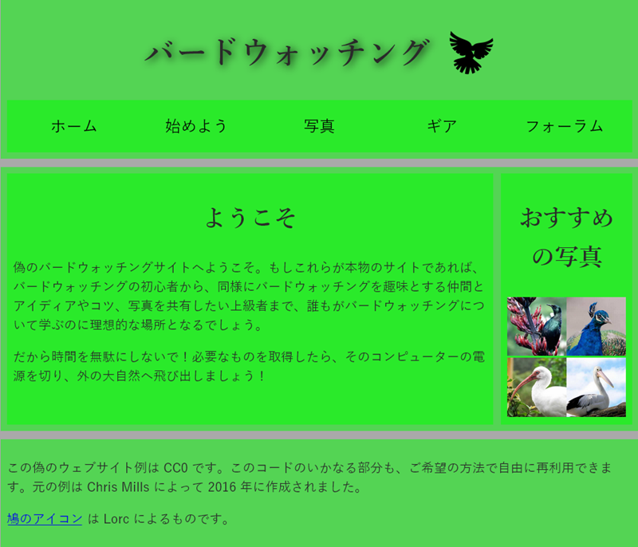

{{PreviousMenuNext("Learn_web_development/Core/Structuring_content/Test_your_skills/Links", "Learn_web_development/Core/Structuring_content/HTML_images", "Learn_web_development/Core/Structuring_content")}}

CSS を使用してレイアウトできるようにコンテンツのページを構成することは、習得が非常に重要なスキルです。そのためこの評価では、ページがどのように表示されるのかを検討し、適切な構造セマンティクスを選択してその上にレイアウトを構築する能力についてテストします。

## 出発点

この課題を解決するため、コンピューターのハードドライブ上のフォルダー内、または [CodePen](https://codepen.io/) や [JSFiddle](https://jsfiddle.net/) などのオンラインエディターを使用して、単純なウェブサイトプロジェクトを作成してください。必要なコードの大部分は既に提供されています。

1. コンピューターの適切な場所に `structuring-html-challenge` という名前の新しいフォルダーを作成してください（またはオンラインエディターを開き、新しいプロジェクトを作成するために要求される手順を実行してください）。
2. 次の HTML リストを、フォルダー内の `index.html` というファイルに保存してください（またはオンラインエディターの HTML ペインに貼り付けてください）。

   ```html-nolint
   <!doctype html>
   <html lang="ja">
     <head>
       <meta charset="utf-8" />
       <title>バードウォッチング</title>
       <link
         href="https://fonts.googleapis.com/css?family=Roboto+Condensed:300%7CCinzel+Decorative:700"
         rel="stylesheet" />
     </head>

     <body>
       <h1>バードウォッチング</h1>

       ホーム 始めよう 写真 ギア フォーラム

       <h2>ようこそ</h2>

       <p>
         偽のバードウォッチングサイトへようこそ。もしこれらが本物のサイトであれば、バードウォッチングの初心者から、同様にバードウォッチングを趣味とする仲間とアイディアやコツ、写真を共有したい上級者まで、誰もがバードウォッチングについて学ぶのに理想的な場所となるでしょう。
       </p>

       <p>
         だから時間を無駄にしないで！必要なものを取得したら、そのコンピューターの電源を切り、外の大自然へ飛び出しましょう！
       </p>

       <h2>おすすめの写真</h2>

       <!-- ここに画像をリンク -->

       <p>
         この偽のウェブサイト例は CC0 です。このコードのいかなる部分も、ご希望の方法で自由に再利用できます。元の例は Chris Mills によって 2016 年に作成されました。
        </p>

       <p>
         <a href="http://game-icons.net/lorc/originals/dove.html">鳩のアイコン</a>
         は Lorc によるものです。
       </p>
     </body>
   </html>
   ```

3. 以下の CSS リストを、フォルダー内の `style.css` というファイルに保存してください（またはオンラインエディターの CSS ペインに貼り付けてください）。

   ```css
   /* || 全般的なセットアップ */

   body {
     margin: 0;
   }

   html {
     font-size: 10px;
     background-color: darkgrey;
   }

   body {
     width: 70%;
     min-width: 800px;
     margin: 0 auto;
   }

   /* || 書体 */

   h1,
   h2 {
     font-family: "Yu Mincho", cursive;
     color: #2a2a2a;
   }

   p,
   li {
     font-family: "Yu Gothic Medium", sans-serif;
     color: #2a2a2a;
   }

   h1 {
     font-size: 4rem;
     text-align: center;
     text-shadow: 2px 2px 10px black;
   }

   h2 {
     font-size: 3rem;
     text-align: center;
   }

   p,
   li {
     font-size: 1.6rem;
     line-height: 1.5;
   }

   /* || ヘッダーレイアウト */

   header {
     margin-bottom: 10px;
   }

   main,
   header,
   nav,
   article,
   aside,
   footer,
   section {
     background-color: #00ff0080;
     padding: 1%;
   }

   h1 {
     text-transform: uppercase;
     display: flex;
     align-items: center;
     justify-content: center;
     gap: 20px;
   }

   header img {
     height: 60px;
   }

   nav ul {
     padding: 0;
     list-style-type: none;
     display: flex;
   }

   nav li {
     text-align: center;
     flex: 1;
   }

   nav a {
     font-size: 2rem;
     text-transform: uppercase;
     text-decoration: none;
     color: black;
   }

   nav a:hover,
   nav a:focus {
     color: red;
   }

   /* || メインレイアウト */

   main {
     display: flex;
     gap: 10px;
   }

   article {
     flex: 4;
   }

   aside {
     flex: 1;
   }

   aside a {
     display: block;
     float: left;
     width: 50%;
   }

   aside img {
     max-width: 100%;
   }

   footer {
     margin-top: 10px;
   }
   ```

後ほど、ページに次の URL を記載する必要があります。

- `dove.png`: [サイトロゴ](https://mdn.github.io/shared-assets/images/examples/learn/birds/dove.png)
- `favorite-bird-1.jpg`: [最初のサイドバー画像のフルサイズ版](https://mdn.github.io/shared-assets/images/examples/learn/birds/favorite-bird-1.jpg)
- `favorite-bird-1_th.jpg`: [最初のサイドバー画像のサムネイル](https://mdn.github.io/shared-assets/images/examples/learn/birds/favorite-bird-1_th.jpg)
- `favorite-bird-2.jpg`: [2 つ目のサイドバー画像のフルサイズ版](https://mdn.github.io/shared-assets/images/examples/learn/birds/favorite-bird-2.jpg)
- `favorite-bird-2_th.jpg`: [2 つ目のサイドバー画像のサムネイル](https://mdn.github.io/shared-assets/images/examples/learn/birds/favorite-bird-2_th.jpg)
- `favorite-bird-3.jpg`: [3 つ目のサイドバー画像のフルサイズ版](https://mdn.github.io/shared-assets/images/examples/learn/birds/favorite-bird-3.jpg)
- `favorite-bird-3_th.jpg`: [3 つ目のサイドバー画像のサムネイル](https://mdn.github.io/shared-assets/images/examples/learn/birds/favorite-bird-3_th.jpg)
- `favorite-bird-4.jpg`: [4 つ目のサイドバー画像のフルサイズ版](https://mdn.github.io/shared-assets/images/examples/learn/birds/favorite-bird-4.jpg)
- `favorite-bird-4_th.jpg`: [4 つ目のサイドバー画像のサムネイル](https://mdn.github.io/shared-assets/images/examples/learn/birds/favorite-bird-4_th.jpg)

## プロジェクト概要

このプロジェクトでは、あなたの仕事はバードウォッチングのウェブサイトのホームページのコンテンツを取り、それにページレイアウトを適用できるように構造要素を追加することです。同時に、コンテンツにいくつか追加を行う必要があります。

### コンテンツの追加

1. `<h1>` 要素内に、ページにハトのロゴを記載する `` 要素を追加します。代替テキストは空文字列 ("") にします。
2. "Home", "Get started", "Photos", "Gear", "Forum" のテキストアイテムは、ナビゲーションメニューに変換する必要があります。
   1. それらを順序なしリストとしてマークアップしてください。
   2. それぞれのリストアイテムの内部では、テキストを `<a>` 要素で囲み、そのリンク先 URL を `#`（ダミーリンクを作成する）に設定してください。
3. `<!-- ここに画像をリンク -->` のコメントを除去してください。代わりに「お気に入りの鳥」のサムネイル画像を 4 つ配置します。それぞれの画像には適切な代替テキスト（画像の説明）を記載し、フルサイズ画像へのリンクとなる `<a>` 要素で囲んでください。

### 構造要件

サイト構造は次の要素で構成される必要があります。

1. 最上位のページ見出しとナビゲーションメニューリストを囲むヘッダー。
2. ナビゲーションメニューリストを囲む追加のラッパー。
3. 2 つの列を含むメインコンテンツ領域。ウェルカムテキストを含むメインブロックと、画像のサムネイルを含みます。
4. 著作権情報とクレジットを含むフッター。

以下に適したラッパーを追加する必要があります。

- ヘッダー
- ナビゲーションメニュー
- メインコンテンツ
- ウェルカムテキスト
- 画像サイドバー
- フッター

### ページのスタイル設定

必要であれば、HTML の先頭で指定された既存の {{htmlelement("link")}} 要素の直下に、別の要素を追加することで、指定された CSS をページに適用してください（一部のオンラインエディターでは CSS が自動的に適用されます）。

## ヒント

- [W3C HTML validator](https://validator.w3.org/) を使用すると、HTML の意図しないミスを捕捉し、修正することができます。
- この評価をするために CSS を知る必要はありません。 提供された CSS を HTML 要素の中に入れるだけです。
- 行き詰まって、どの要素をどこに配置すべきか見当がつけられない場合は、ページレイアウトの単純なブロック図を描き、それぞれのブロックを囲むべき要素を書き込んでみてください。これは大変役立ちます。

## 例

次のスクリーンショットは、マークアップ後のホームページの表示例を示しています。実装方法がわからない場合は、ライブサンプルの下にある解決策を参照してください。



<details>
<summary>ここをクリックすると、模範解答を表示します。</summary>

完了した HTML は、次のようになるはずです。

```html
<!doctype html>
<html lang="ja">
  <head>
    <meta charset="utf-8" />
    <title>バードウォッチング</title>
    <link
      href="https://fonts.googleapis.com/css?family=Roboto+Condensed:300%7CCinzel+Decorative:700"
      rel="stylesheet" />
    <link href="style.css" rel="stylesheet" />
  </head>

  <body>
    <header>
      <h1>
        バードウォッチング
        
      </h1>

      <nav>
        <ul>
          <li><a href="#">ホーム</a></li>
          <li><a href="#">始めよう</a></li>
          <li><a href="#">写真</a></li>
          <li><a href="#">ギア</a></li>
          <li><a href="#">フォーラム</a></li>
        </ul>
      </nav>
    </header>

    <main>
      <article>
        <h2>ようこそ</h2>

        <p>
          偽のバードウォッチングサイトへようこそ。もしこれらが本物のサイトであれば、バードウォッチングの初心者から、同様にバードウォッチングを趣味とする仲間とアイディアやコツ、写真を共有したい上級者まで、誰もがバードウォッチングについて学ぶのに理想的な場所となるでしょう。
        </p>

        <p>
          だから時間を無駄にしないで！必要なものを取得したら、そのコンピューターの電源を切り、外の大自然へ飛び出しましょう！
        </p>
      </article>

      <aside>
        <h2>おすすめの写真</h2>

        <a
          href="https://mdn.github.io/shared-assets/images/examples/learn/birds/favorite-bird-1.jpg">
          
        </a>
        <a
          href="https://mdn.github.io/shared-assets/images/examples/learn/birds/favorite-bird-2.jpg">
          
        </a>
        <a
          href="https://mdn.github.io/shared-assets/images/examples/learn/birds/favorite-bird-3.jpg">
          
        </a>
        <a
          href="https://mdn.github.io/shared-assets/images/examples/learn/birds/favorite-bird-4.jpg">
          
        </a>
      </aside>
    </main>

    <footer>
      <p>
        この偽のウェブサイト例は CC0 です。このコードのいかなる部分も、ご希望の方法で自由に再利用できます。元の例は Chris Mills によって 2016 年に作成されました。
      </p>

      <p>
        <a href="http://game-icons.net/lorc/originals/dove.html">鳩のアイコン</a>
      は Lorc によるものです。
      </p>
    </footer>
  </body>
</html>
```

</details>

{{PreviousMenuNext("Learn_web_development/Core/Structuring_content/Test_your_skills/Links", "Learn_web_development/Core/Structuring_content/HTML_images", "Learn_web_development/Core/Structuring_content")}}
