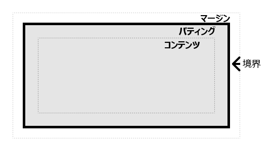
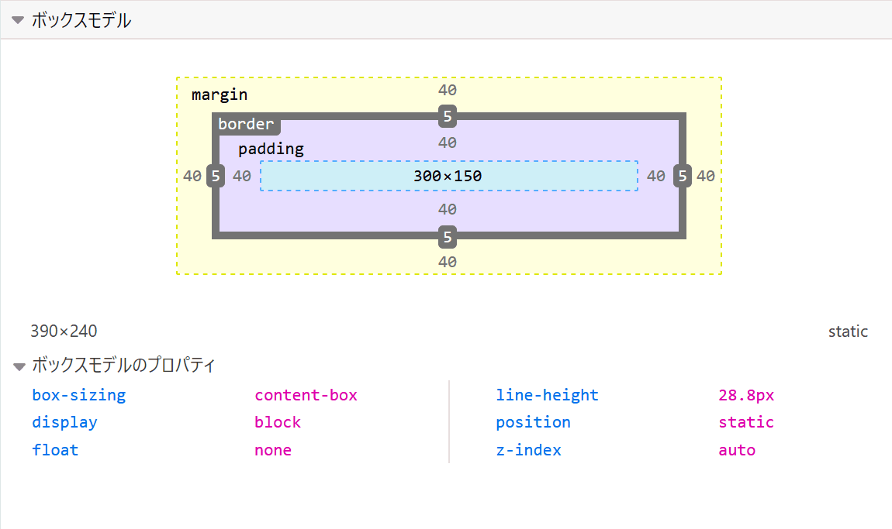

{{PreviousMenuNext("Learn_web_development/Core/Styling_basics/Test_your_skills/Selectors", "Learn_web_development/Core/Styling_basics/Test_your_skills/Box_model", "Learn_web_development/Core/Styling_basics")}}

CSS にはボックスの概念があり、これを理解することは CSS でレイアウトを作成したりアイテム同士を揃えたりするためのコツとなります。このレッスンでは CSS ボックスモデルを詳しく解説し、その仕組みと関連する用語を理解することでより複雑なレイアウトができるようにします。

<table>
  <tbody>
    <tr>
      <th scope="row">前提知識:</th>
      <td>
        HTML の基本（
        <a href="/ja/docs/Learn_web_development/Core/Structuring_content/Basic_HTML_syntax"
          >基本的な HTML の構文</a
        >を学んでいること）。
      </td>
    </tr>
    <tr>
      <th scope="row">学習成果:</th>
      <td>
        <ul>
          <li>ブロック要素とインライン要素。</li>
          <li>要素を構成するさまざまなボックスと、それらのスタイル設定方法（コンテンツ、マージン、境界、パディング）</li>
          <li>代替ボックスモデル（<code>box-sizing: border-box</code> でアクセス）と、通常のボックスモデルとの違いについて説明します。</li>
          <li>マージンの相殺。</li>
          <li>基本的な display の値（<code>block</code>, <code>inline</code>, <code>inline-block</code>, <code>none</code>）とボックスの動作にどう影響するか。</li>
        </ul>
      </td>
    </tr>
  </tbody>
</table>

## ブロックボックスとインラインボックス

CSS にはいくつかの種類のボックスがあり、一般的に**ブロックボックス**と**インラインボックス**のカテゴリーに分類されます。この種類は、ページの流れやページ上の他のボックスとの関連において、ボックスがどのように振る舞うかを参照します。ボックスには**内側の表示型**と**外側の表示型**があります。

一般的に、{{cssxref("display")}} プロパティを使用して、表示型に様々な値を設定することができます。

ボックスの表示型が `block` である場合は、次のように動作します。

- ボックスは新しい行に現れます。
- {{cssxref("width")}} および {{cssxref("height")}} プロパティが尊重されます。
- パディング、マージン、境界により、このボックスから他の要素が遠ざけられます。
- {{cssxref("width")}} が指定されていない場合、ボックスはインライン方向に伸びて、コンテナーで使用可能な空間を埋めます。多くの場合、ボックスがコンテナーと同じ幅になり、利用可能な空間の 100% を占めるということです。

HTML 要素の中には `<h1>` や `<p>` のように、既定で `block` を外側の表示型として使用するものがあります。

ボックスの表示型が `inline` である場合は、次のように動作します。

- ボックスは新しい行に分割されません。
- {{cssxref("width")}} プロパティと {{cssxref("height")}} プロパティ、上下のマージンは効果がありません。
- **上下**のパディングと境界は、周囲のコンテンツの位置に影響を与えずにボックスのサイズを変更するため、重なりが発生する可能性があります。
- **左右**のパディング、マージン、境界は、周囲のインラインコンテンツの位置に影響を与えます。

HTML 要素の中には、 `<a>`、`<span>`、`<em>`、`<strong>` のように、既定で `inline` を外側の表示型として使用するものがあります。

ブロックおよびレイアウトは、ウェブにおける既定の振る舞いです。既定では、他に指示がない限り、ボックス内の要素は **[通常フロー](/ja/docs/Learn_web_development/Core/CSS_layout/Introduction#normal_layout_flow)** でレイアウトされ、ブロックボックスやインラインボックスとして振る舞います。

## 内側の表示型と外側の表示型

`block`および`inline`の表示値は、**外側の表示**型と言います。ボックスが、その周囲の他のボックスと関連してどのようにレイアウトされるかに影響します。ボックスには、**内側の表示**型もあり、ボックス内の要素がどのようにレイアウトされるかを決定します。

内側の表示型は、例えば `display: flex;` を設定することで変更することができます。この要素は外側の表示型に `block` を使用しますが、内側の表示型は `flex` に変更されます。このボックスの直接の子要素はフレックスアイテムとなり、[フレックスボックス](/ja/docs/Learn_web_development/Core/CSS_layout/Flexbox)の仕様に従って動作します。

CSS のレイアウトのより詳しい学習をしていくと、 [`flex`](/ja/docs/Learn_web_development/Core/CSS_layout/Flexbox) や、ボックスが持つことができる他の様々な、例えば [`grid`](/ja/docs/Learn_web_development/Core/CSS_layout/Grids) などに出会うでしょう。

現時点で内側と外側の用語についてあまり心配する必要はありません。これは内部的に現れるもので、他の場所でこれを見かける可能性がある場合に備えてここで言及しただけです。通常は単一の `display` 値を処理するだけで、それについて深く考える必要はありません。

## さまざまな表示型の例

下記の例では 3 つの異なる HTML 要素があり、すべて外側の表示型は `block` です。

- CSS で境界線を追加した段落。ブラウザーはこれをブロックボックスとして描画します。段落は新しい行から始まり、利用できる幅全体を水平方向を埋めるように広がります。

- `display: flex` を使用してレイアウトされたリスト。これにより、コンテナーの子要素に対してフレックスレイアウトが設定されます。これらの子要素はフレックスアイテムであり、デフォルトで横一行に配置されます。リストそのものはブロックボックスで、段落のようにコンテナーの幅いっぱいに展開され、新しい行に分割されます。

- ブロックレベルの段落があり、その中に 2 つの `<span>` 要素があります。これらの要素は通常 `inline` ですが、そのうち 1 つの要素には `block` クラスが設定されており、`display: block` と指定されています。その結果、その単語は親要素の全幅にまたがる新しい行から始まります。

```html-nolint live-sample___block
<p>これは段落です。短いものです。</p>
<ul>
  <li>アイテム 1</li>
  <li>アイテム 2</li>
  <li>アイテム 3</li>
</ul>
<p>
  別の段落です。一部の<span class="block">単語</span>は <span>span 要素</span>で折り返されています。
</p>
```

```css live-sample___block
body {
  font-family: sans-serif;
}
p,
ul {
  border: 2px solid rebeccapurple;
  padding: 0.2em;
}

.block,
li {
  border: 2px solid blue;
  padding: 0.2em;
}

ul {
  display: flex;
  list-style: none;
}

.block {
  display: block;
}
```

{{EmbedLiveSample("block", "", "220px")}}

次の例では、`inline` 要素の動作を確認できます。

- 最初の段落の `<span>` は既定ではインラインのため、強制的に改行しません。

- `display: inline-flex` に設定された `<ul>` 要素は、いくつかのフレックスアイテムの入ったインラインボックスを生成します。

- `display: inline` に設定された 2 つの段落があります。インラインフレックスコンテナーと段落はすべて、（ブロックレベル要素として表示されるように）新しい行に分割されるのではなく、横に 1 行に並びます。

この例では、 `display: inline` を `display: block` に、または `display: inline-flex` を `display: flex` に変更して、これらの表示モードの間を切り替えられます。

```html-nolint live-sample___inline
<p>
  これは段落です。一部の<span class="block">単語</span>は <span>span 要素</span>で折り返されています。
</p>
<ul>
  <li>アイテム 1</li>
  <li>アイテム 2</li>
  <li>アイテム 3</li>
</ul>
<p class="inline">これは段落です。短いものです。</p>
<p class="inline">これは他の段落です。これも短いものです。</p>
```

```css live-sample___inline
body {
  font-family: sans-serif;
}
p,
ul {
  border: 2px solid rebeccapurple;
}

span,
li {
  border: 2px solid blue;
}

ul {
  display: inline-flex;
  list-style: none;
  padding: 0;
}

.inline {
  display: inline;
}
```

{{EmbedLiveSample("inline")}}

現時点で覚えておくべき重要な点は、`display` プロパティの値を変更すると、ボックスの外側の表示型がブロックかインラインかを変更できるため、レイアウト内の他の要素と一緒に表示する方法が変わることです。

## CSS ボックスモデルとは

ブロックボックスには CSS ボックスモデル全体が適用され、ボックスのさまざまな部分（マージン、境界、パディング、コンテンツ）がどのように連携して動作し、ページ上に表示されるボックスを生成するのかを定義します。インラインボックスは、ボックスモデルで定義されている動作の一部だけを使用します。

さらに複雑なことに、標準ボックスモデルと代替ボックスモデルがあります。既定では、ブラウザーは標準ボックスモデルを使用します。

### ボックスの構成

CSS でブロックボックスを構成するものとしては、以下のものがあります。

- **コンテンツボックス**: コンテンツが表示される領域。サイズは {{cssxref("width")}} や {{cssxref("height")}} などのプロパティを使用して制御します。
- **パディングボックス**: パディングはコンテンツの周囲に空白として配置されます。サイズは {{cssxref("padding")}} および関連するプロパティを使用して制御します。
- **境界ボックス**: 境界ボックスは、コンテンツとパディングを囲みます。サイズは {{cssxref("border")}} および関連するプロパティを使用して制御します。
- **マージンボックス**: マージンは最も外側のレイヤーで、このボックスと他の要素の間の空白としてコンテンツ、パディング、および境界線を囲みます。サイズは {{cssxref("margin")}} および関連するプロパティを使用して制御できます。

以下の図は、これらのレイヤーを示しています。



### CSS 標準ボックスモデル

標準ボックスモデルでは、ボックスに `width` と `height` を指定すると、*コンテンツボックス*のインライン方向のサイズととブロック方向のサイズ（横書きの言語では幅と高さ）が定義されます。すべてのパディングと境界がその幅と高さに追加され、ボックスが占める合計サイズが算出されます。

以下の CSS をボックスに適用した場合、

```css
.box {
  width: 350px;
  height: 150px;
  margin: 10px;
  padding: 25px;
  border: 5px solid black;
}
```

ボックスが実際に占める空間は、幅 `410px` (350 + 25 + 25 + 5 + 5)、高さ `210px` (150 + 25 + 25 + 5 + 5) です。


> [!NOTE]
> マージンは、ボックスの実際のサイズにはカウントされません。確かに、ボックスがページ上で占める合計スペースに影響しますが、ボックスの外側のスペースにのみ影響します。ボックスの領域は境界線で停止し、マージンまでは達しません。

### CSS 代替ボックスモデル

代替ボックスモデルを使用すると、幅はページ上に表示されるボックスの幅になります。コンテンツ領域の幅は、その幅からパディングと境界の幅を引いたものになります。これは、ボックスの実質的なサイズを取得する際に、境界線とパディングを追加する必要がないため便利です。

要素に対して代替モデルを有効にしたい場合は、`box-sizing: border-box` を設定してください。

```css
.box {
  box-sizing: border-box;
}
```

次のように、ボックスの CSS が上記と同様であった場合、

```css
.box {
  width: 350px;
  height: 150px;
  margin: 10px;
  padding: 25px;
  border: 5px solid black;
}
```

これで、ボックスが実際に占める空間は、インライン方向に `350px`、ブロック方向に `150px` になります。


すべての要素に代替ボックスモデルを使用するには（開発者の間ではよくある選択です）、 `<html>` 要素に `box-sizing` プロパティを設定し、他の要素はすべてその値を継承するように設定します。

```css
html {
  box-sizing: border-box;
}

*,
*::before,
*::after {
  box-sizing: inherit;
}
```

基盤となっている考えを理解するためには、 [CSS Tricks article on box-sizing](https://css-tricks.com/inheriting-box-sizing-probably-slightly-better-best-practice/) を読んでください。

## ボックスモデルの実践

以下の例では、2 つのボックスを見ることができます。両方とも `.box` のクラスを持ち、同じ `width`、`height`、`margin`、`border`、`padding` を提供します。唯一の違いは、2 番目のボックスが代替ボックスモデルを使用するように設定されていることです。
2 番目のボックスのサイズを変更 (`.alternate` クラスに CSS を追加) して、幅と高さを最初のボックスに一致させることはできますか？

```html-nolint live-sample___box-models
<div class="box">これは標準ボックスモデルを使用しています。</div>
<div class="box alternate">これは代替ボックスモデルを使用しています。</div>
```

```css live-sample___box-models
.box {
  border: 5px solid rebeccapurple;
  background-color: lightgray;
  padding: 40px;
  margin: 40px;
  width: 300px;
  height: 150px;
}

.alternate {
  box-sizing: border-box;
}
```

{{EmbedLiveSample("box-models", "", "400px")}}

> [!NOTE]
> [css-examples のリポジトリー](https://github.com/mdn/css-examples/blob/main/learn/solutions.md#the-box-model)でこのタスクの解決策を見つけることができます。

### ブラウザーの開発者ツールを使用してボックスモデルを見る

[ブラウザーの開発者ツール](/ja/docs/Learn_web_development/Howto/Tools_and_setup/What_are_browser_developer_tools)を使用すると、ボックスモデルをはるかに簡単に理解できます。 Firefox の開発者ツールで要素を調べると、要素のサイズに加えて、マージン、パディング、境界が確認できます。この方法で要素を検査することは、ボックスが本当に思っているサイズであるかどうかを知る素晴らしい方法です。



## マージン、パディング、境界

上記の例では、{{cssxref("margin")}}、{{cssxref("padding")}}、{{cssxref("border")}} のプロパティが動作しているのを見てきました。この例で使用されているプロパティは**一括指定**であり、ボックスの 4 辺すべてを一度に設定できます。これらの一括指定には、同等の個別指定プロパティもあり、ボックスのさまざまな辺を個別に制御できます。

これらのプロパティをさらに詳しく見てみましょう。

### マージン

マージンは、ボックスの周りの見えない空間です。 他の要素をボックスから遠ざけます。 マージンには正または負の値を設定できます。 ボックスの片側に負のマージンを設定すると、ページ上の他の部分と重なる場合があります。 標準または代替のボックスモデルを使用しているかどうかにかかわらず、表示ボックスのサイズが計算された後、マージンは常に追加されます。

{{cssxref("margin")}} プロパティを使用して要素のすべてのマージンを一度に制御するか、同等の個別指定プロパティを使用して各辺を個別に制御できます。

- {{cssxref("margin-top")}}
- {{cssxref("margin-right")}}
- {{cssxref("margin-bottom")}}
- {{cssxref("margin-left")}}

#### マージンの実践

次の例を編集してみてください。マージンの値を変更してみて、マージンによってこの要素と格納する要素との間に空間が作成されたり除去されたり（負のマージンの場合）して、ボックスがどのように押しやられるかを確認してください。

```html-nolint live-sample___margin
<div class="container">
  <div class="box">マージンを変更してみてください。</div>
</div>
```

```css live-sample___margin
.container {
  border: 5px solid blue;
  margin: 40px;
}

.box {
  border: 5px solid rebeccapurple;
  background-color: lightgray;
  padding: 10px;
  height: 100px;
  /* margin プロパティを変更してみてください */
  margin-top: -40px;
  margin-right: 30px;
  margin-bottom: 40px;
  margin-left: 4em;
}
```

{{EmbedLiveSample("margin", "", "220px")}}

#### マージンの相殺

マージンが接する 2 つの要素のマージンが正の値か負の値かによって、結果が異なります。

- 2 つの正のマージンは、結合して 1 つのマージンになります。その大きさは、それぞれのマージンの最大値と同じになります。
- 2 つの負のマージンは、折り畳まれ、最も小さい（ゼロから最も遠い）値が使用されます。
- 一方のマージンが負の場合、その値が合計から引かれます。

以下の例には、2 つの段落があります。 上の段落には、50 ピクセルの `margin-bottom` があります。2 番目の段落の `margin-top` は 30 ピクセルです。マージンは一緒に折りたたまれているため、ボックス間の実際のマージンは 50 ピクセルであり、2 つのマージンの合計ではありません。

これをテストするには、第 2 段落の `margin-top` を `0` に設定します。2 つの段落間のマージンは変更されません。第 1 段落の `margin-bottom` に設定された 50 ピクセルを保持します。 `-10px` に設定すると、全体のマージンが `40px` になることがわかります。 `50px` から差し引かれます。

```html-nolint live-sample___margin-collapse
<div class="container">
  <p class="one">これは段落 1 です。</p>
  <p class="two">これは段落 2 です。</p>
</div>
```

```css live-sample___margin-collapse
.container {
  border: 5px solid blue;
  margin: 40px;
}

p {
  border: 5px solid rebeccapurple;
  background-color: lightgray;
  padding: 10px;
}
.one {
  margin-bottom: 50px;
}

.two {
  margin-top: 30px;
}
```

{{EmbedLiveSample("margin-collapse", "", "280px")}}

マージンが相殺される場合と相殺されない場合を規定する多くのルールがあります。 詳細については、[マージンの相殺](/ja/docs/Web/CSS/Guides/Box_model/Margin_collapsing)に関する詳細ページをご覧ください。覚えておくべき主なことは、マージンの相殺は、マージンで空間を作成しているときに、期待した空間が得られなかった場合に起こることだということです。

> [!NOTE]
> [Learn margins via flags](https://scrimba.com/frontend-path-c0j/~01e?via=mdn) <sup>[_MDN 学習パートナー_](/ja/docs/MDN/Writing_guidelines/Learning_content#partner_links_and_embeds)</sup>（Scrimba 提供）の対話型レッスンでは、マージンに関する有益な実践的な練習を提供しています。

### 境界

境界 (border) は、ボックスのマージンとパディングの間に描かれます。標準ボックスモデルを使用している場合、境界のサイズがコンテンツボックスの `width` と `height` に追加されます。代替ボックスモデルを使用している場合、境界のサイズが利用可能な `width` と `height` の一部を占めるため、コンテンツボックスが小さくなります。

境界のスタイル設定には、多数のプロパティがあります。4 つの境界があり、それぞれの境界には、操作することができるスタイル、幅、色があります。

{{cssxref("border")}} プロパティを使用して、4 つすべての境界の幅、色、スタイルを一度に設定することができます。

それぞれの辺のプロパティを個別に設定するには、次のものを使用します。

- {{cssxref("border-top")}}
- {{cssxref("border-right")}}
- {{cssxref("border-bottom")}}
- {{cssxref("border-left")}}

すべての辺の幅、スタイル、色を設定するには、次のものを使用します。

- {{cssxref("border-width")}}
- {{cssxref("border-style")}}
- {{cssxref("border-color")}}

単一の辺の幅、スタイル、色を設定するには、より詳細な以下の個別指定プロパティのいずれかを使用します。

- {{cssxref("border-top-width")}}
- {{cssxref("border-top-style")}}
- {{cssxref("border-top-color")}}
- {{cssxref("border-right-width")}}
- {{cssxref("border-right-style")}}
- {{cssxref("border-right-color")}}
- {{cssxref("border-bottom-width")}}
- {{cssxref("border-bottom-style")}}
- {{cssxref("border-bottom-color")}}
- {{cssxref("border-left-width")}}
- {{cssxref("border-left-style")}}
- {{cssxref("border-left-color")}}

#### 境界の実践

次の例では、境界線を生成するために様々な一括指定と個別指定プロパティを使用しています。各プロパティを編集して、それらがどのように動作するかを確認してください。境界のプロパティの MDN ページには、利用できる様々な境界のスタイル設定についての情報があります。

```html-nolint live-sample___border
<div class="container">
  <div class="box">境界線を変更してみてください。</div>
</div>
```

```css live-sample___border
body {
  font-family: sans-serif;
}
.container {
  margin: 40px;
  padding: 20px;
  border-top: 5px dotted green;
  border-right: 1px solid black;
  border-bottom: 20px double rgb(23 45 145);
}

.box {
  padding: 20px;
  background-color: lightgray;
  border: 1px solid #333333;
  border-top-style: dotted;
  border-right-width: 20px;
  border-bottom-color: hotpink;
}
```

{{EmbedLiveSample("border", "", "220px")}}

### パディング

パディングは境界とコンテンツ領域の間に位置し、コンテンツを境界から離すために使用します。マージンとは異なり、負のパディングを指定することはできません。要素に背景が適用されると、パディングの背後に表示されます。

{{cssxref("padding")}} プロパティは、要素のすべての辺のパディングを制御します。各辺を個別に制御するには、以下の個別指定プロパティを使用します。

- {{cssxref("padding-top")}}
- {{cssxref("padding-right")}}
- {{cssxref("padding-bottom")}}
- {{cssxref("padding-left")}}

#### パディングの実践

以下の例で `.box` クラスのパディングの値を変更すると、ボックスからみたテキストの開始位置がどのように変わるかがわかります。 `.container` クラスのパディングを変更することもできます。これにより、コンテナーとボックスの間に空間ができます。要素のパディングを変更することで、要素の境界線と要素の内部にあるものとの間に空間を作成することができます。

```html-nolint live-sample___padding
<div class="container">
  <div class="box">パディングを変更してみてください。</div>
</div>
```

```css live-sample___padding
body {
  font-family: sans-serif;
}
.box {
  border: 5px solid rebeccapurple;
  background-color: lightgray;
  padding-top: 0;
  padding-right: 30px;
  padding-bottom: 40px;
  padding-left: 4em;
}

.container {
  border: 5px solid blue;
  margin: 40px;
  padding: 20px;
}
```

{{EmbedLiveSample("padding", "", "220px")}}

## ボックスモデルとインラインボックス

ブロックボックスには、上記のすべてが適用されます。プロパティのいくつかは `<span>` 要素で作成されるようなインラインボックスにも適用できます。

次の例では、段落内に `<span>` を配置しています。これに `width`、`height`、`margin`、`border`、`padding` を指定しています。幅、高さ、上下マージンは `<span>` に影響を与えません。上下のパディングと境界線はインラインボックスのサイズを変更しますが、周囲のコンテンツの位置には影響しません。代わりに、上下のパディングと境界線は段落内の他の単語と重なります。`<span>` を囲むテキストの位置に影響を与えるのは、左右パディング、左右マージン、境界線のみです。

```html-nolint live-sample___inline-box-model
<p>
  これは段落で、ここに段落内の <span>span</span> があります。 span はインライン要素で、 width と height を使用しません。
</p>
```

```css live-sample___inline-box-model
body {
  font-family: sans-serif;
}
p {
  border: 2px solid rebeccapurple;
  width: 200px;
}
span {
  margin: 20px 30px;
  padding: 10px 20px;
  width: 80px;
  height: 150px;
  background-color: lightblue;
  border: solid blue;
  border-width: 7px 1px;
}
```

{{EmbedLiveSample("inline-box-model")}}

## display: inline-block の使用

`display: inline-block` は `display` の特別な値で、`inline` と `block` の中間を提供します。アイテムを改行させたくないが、 `width` と `height` を尊重し、上記のような重なりを避けたい場合に使用します。

`display: inline-block` を持つ要素は、すでにおなじみのブロックのサブセットになります。

- `width` と `height` のプロパティが尊重されます。
- パディング、マージン、境界により、他の要素がボックスから遠ざけられます。

ただし、新しい行に分割されることはなく、コンテンツより大きくなるのは `width` および `height` プロパティを明示的に追加した場合のみです。

### inline-block の実践

次の例では、`<span>` 要素に `display: inline-block` を追加しています。これを `display: block` 変更したり、行を完全に削除したりして、表示モデルの違いを確認してください。

```html-nolint live-sample___inline-block
<p>
  これは段落で、ここに段落内の <span>span</span> があります。 span はインライン要素で、 width と height を使用しません。
</p>
```

```css live-sample___inline-block
body {
  font-family: sans-serif;
}
p {
  border: 2px solid rebeccapurple;
  width: 300px;
}

span {
  margin: 20px;
  padding: 20px;
  width: 80px;
  height: 50px;
  background-color: lightblue;
  border: 2px solid blue;
  display: inline-block;
}
```

{{EmbedLiveSample("inline-block", "", "240px")}}

これが役立つのは、 `padding` を追加して、リンクのヒット領域を大きくしたい場合です。 `<a>` は `<span>` のようなインライン要素です。 `display: inline-block` を使用してパディングを設定できるようにし、ユーザーがリンクをクリックしやすくします。

次のナビゲーションはフレックスボックスを使用して1列で表示されており、`<a>` 要素にパディングを追加しています。これは、`<a>` にポインターを置いた際に `background-color` を変更できるようにしたいからです。パディングが `<ul>` 要素の境界線と重なって現れているように見えます。これは、`<a>` がインライン要素であるためです。

`display: inline-block` を `.links-list a` セレクターを使用してルールに追加すると、他の要素でパディングが尊重されるようになり、この課題が修正されたことがわかります。

```html-nolint live-sample___inline-block-nav
<nav>
  <ul class="links-list">
    <li><a href="">リンク 1</a></li>
    <li><a href="">リンク 2</a></li>
    <li><a href="">リンク 3</a></li>
  </ul>
</nav>
```

```css live-sample___inline-block-nav
ul {
  font-family: sans-serif;
  display: flex;
  list-style: none;
  border: 1px solid black;
}

li {
  margin: 5px;
}

.links-list a {
  background-color: rgb(179 57 81);
  color: white;
  text-decoration: none;
  padding: 1em 2em;
}

.links-list a:hover {
  background-color: rgb(66 28 40);
  color: white;
}
```

{{EmbedLiveSample("inline-block-nav")}}

<<<<<<< 260222-Learn_web_development/Core/Styling_basics/Box_model
=======
## 確認テスト

この記事の最後まで到達しましたが、最も重要な情報を覚えていますか？移動される前に、この情報が記憶されているかどうかを確認するためのテストを探すことができます。[確認テスト: ボックスモデル](/ja/docs/Learn_web_development/Core/Styling_basics/Test_your_skills/Box_model)を参照してください。

>>>>>>> main
## まとめ

以上が、ボックスモデルについて理解する必要があるほとんどのことです。レイアウト内の大きなボックスの大きさについて混乱している場合は、このレッスンに戻ってください。

次の記事では、CSS ボックスモデルに関する情報の理解度と記憶度を調べるための確認テストをいくつかご紹介します。

{{PreviousMenuNext("Learn_web_development/Core/Styling_basics/Test_your_skills/Selectors", "Learn_web_development/Core/Styling_basics/Test_your_skills/Box_model", "Learn_web_development/Core/Styling_basics")}}
