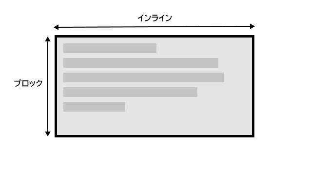
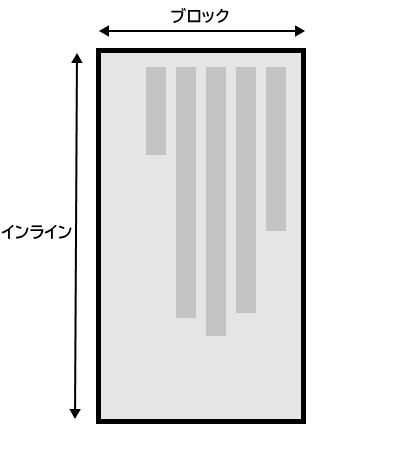

{{LearnSidebar}}

これまで CSS の学習で出会ったプロパティや数値の多くは、画面の物理的な寸法と結びついていました。例えば、境界線はボックスの上、下、左、右に作成します。これらの物理的な寸法は、横書きで表示されるコンテンツにとてもうまく割り当てられ、既定ではウェブは右書きの言語（アラビア語など）よりも左書きの言語（英語やフランス語など）に対応する傾向があります。

しかし近年、CSS は、右書きへのコンテンツや縦書きのコンテンツ（日本語など）を含むコンテンツのさまざまな方向により適切に対応するために進化しました。これらのさまざまな方向は**書字方向**と呼ばれます。学習を進めてレイアウトの操作を開始すると、書字方向を理解することが非常に役立ちます。そのため、これらのモードを紹介します。

<table>
  <tbody>
    <tr>
      <th scope="row">前提条件:</th>
      <td>
        <a
          href="/ja/docs/Learn_web_development/Getting_started/Environment_setup/Installing_software"
          >基本的なソフトウェアがインストールされている</a
        >こと、<a
          href="/ja/docs/Learn_web_development/Getting_started/Environment_setup/Dealing_with_files"
          >ファイルの扱い</a
        >、HTML の基本（<a href="/ja/docs/Learn_web_development/Core/Structuring_content"
          >HTML 入門</a
        >の学習）、CSS がどのように動作するかの考え（<a href="/ja/docs/Learn_web_development/Core/Styling_basics">CSS によるスタイル設定の基本</a>で学習）の基本的な知識を得ていること。
      </td>
    </tr>
    <tr>
      <th scope="row">目的:</th>
      <td>最新の CSS の書字方向の重要性を理解する。</td>
    </tr>
  </tbody>
</table>

## 書字方向とは

CSS の書字方向は、テキストが横書きと縦書きのどちらで実行されているかを示します。{{cssxref("writing-mode")}} プロパティにより、ある書字方向から別の書字方向に切り替えることができます。これを行うために縦書きモードを使用する言語で作業する必要はありません。また、創造的な目的のためにレイアウトの一部の書字方向を変更することもできます。

次の例では、 `writing-mode: vertical-rl` を使用して見出しを表示しています。これで、テキストが垂直方向に進みます。縦書きテキストはグラフィックデザインでは一般的であり、ウェブデザインにより興味深い外観を追加する方法になります。

```html live-sample___simple-vertical
<h1>書字方向で遊びましょう</h1>
```

```css live-sample___simple-vertical
body {
  font-family: sans-serif;
  height: 300px;
}
h1 {
  writing-mode: vertical-rl;
  color: white;
  background-color: black;
  padding: 10px;
}
```

{{EmbedLiveSample("simple-vertical", "", "350px")}}

[`writing-mode`](/ja/docs/Web/CSS/Reference/Properties/writing-mode) プロパティの 3 つの可能な値は次のとおりです。

- `horizontal-tb`: 上から下の方向へブロックが流れます。文は横書きになります。
- `vertical-rl`: 右から左の方向へブロックが流れます。文は縦書きになります。
- `vertical-lr`: 左から右の方向へブロックが流れます。文は縦書きになります。

したがって、 `writing-mode` プロパティは、実際には、ページにブロックレベルの要素が表示される方向（上から下、右から左、または左から右）を設定します。これにより、文章内のテキストの流れが決まります。

## 書字方向とブロックレイアウトとインラインレイアウト

[ブロックとインラインのレイアウト](/ja/docs/Web/CSS/Guides/Display/Block_and_inline_layout)、およびいくつかの要素がブロック要素として表示され、他の要素がインライン要素として表示されるという事実についてはすでに説明しました。上で説明したように、ブロックとインラインは、物理的な画面ではなく、ドキュメントの書字方向に関連付けられています。英語などのテキストを横書きで表示する書字方向を使用している場合、ブロックはページの上から下にのみ表示されます。

例を見れば、これはより明確になります。この次の例では、見出しと段落を含む 2 つのボックスがあります。 1 つ目は、 `writing-mode: horizontal-tb` を使用します。これは、横書きでページの上部から下部に向かって書いていく書字方向です。 2 番目は `writing-mode: vertical-rl` を使用します。これは、縦書きで右から左に書いていく書字方向です。

```html live-sample___block-inline
<div class="wrapper">
  <div class="box horizontal">
    <h2>見出し</h2>
    <p>CSS での書字方向をデモする段落です。</p>
  </div>
  <div class="box vertical">
    <h2>見出し</h2>
    <p>CSS での書字方向をデモする段落です。</p>
  </div>
</div>
```

```css live-sample___block-inline
body {
  font-family: sans-serif;
  height: 300px;
}
.wrapper {
  display: flex;
}

.box {
  border: 1px solid #ccc;
  padding: 0.5em;
  margin: 10px;
}

.horizontal {
  writing-mode: horizontal-tb;
}

.vertical {
  writing-mode: vertical-rl;
}
```

{{EmbedLiveSample("block-inline", "", "350px")}}

書字方向を切り替えると、ブロックの方向とインラインの方向が変更されます。 `horizontal-tb` の書字方向では、ブロックの方向は上から下へ向かいます。 `vertical-rl` の書字方向では、ブロックの方向は右から左へ横書きに進みます。したがって、**ブロック軸**は常に、使用中の書字方向でページにブロックが表示される方向です。**インライン軸**は、常に文が流れる方向です。

この図は、横書きモードでの 2 つの軸を示しています。

この図は、縦書きモードの 2 つの軸を示しています。



CSS レイアウト、特に新しいレイアウトメソッドを検討し始めると、このブロックとインラインの考え方が非常に重要になります。また後で触れます。

### 方向

書字方向に加えて、テキストの方向もあります。上記のように、アラビア語などの一部の言語は横書きで書かれていますが、右から左に書かれています。これは、創造的な意味で使用する可能性のあるものではありません。単に右側に何かを並べたい場合は、他の方法もありますが、 CSS の性質の一部としてこれを理解することが重要です。ウェブは、左から右に表示される言語だけのものではありません。

書字方向とテキストの方向が変更される可能性があるため、新しい CSS レイアウトメソッドは、左右、上下という形では参照しません。代わりに、インラインとブロックのこの考え方とともに、先頭と末尾について話します。心配する必要はありませんが、レイアウトを見始めるときにはこれらのアイデアに留意してください。 CSS を理解する上で非常に役立ちます。

## 論理的プロパティと値

学習のこの時点で書字方向と記述モードについて話す理由は、画面の物理的な寸法に関連するプロパティをすでにたくさん見てきており、これらは横書きモードのときに、より意味が出てくるからです。

2 つのボックスをもう一度見てみましょう。1 つは `horizontal-tb` の書字方向、もう 1 つは `vertical-rl`です。これらの両方のボックスに {{cssxref("width")}} を指定しました。ボックスが縦書きモードでも width があるため、テキストがあふれることがわかります。

```html live-sample___width
<div class="wrapper">
  <div class="box horizontal">
    <h2>見出し</h2>
    <p>CSS での書字方向をデモする段落です。</p>
    <p>これらのボックスには width が設定されています。</p>
  </div>
  <div class="box vertical">
    <h2>見出し</h2>
    <p>CSS での書字方向をデモする段落です。</p>
    <p>これらのボックスには width が設定されています。</p>
  </div>
</div>
```

```css live-sample___width
body {
  font-family: sans-serif;
  height: 300px;
}
.wrapper {
  display: flex;
}

.box {
  border: 1px solid #ccc;
  padding: 0.5em;
  margin: 10px;
  width: 100px;
}

.horizontal {
  writing-mode: horizontal-tb;
}

.vertical {
  writing-mode: vertical-rl;
}
```

{{EmbedLiveSample("width", "", "350px")}}

このシナリオで本当に必要なのは、書字方向に合わせて基本的に height と width を入れ替えることです。縦書きモードのときは、横書きモードの場合と同じように、ボックスをブロック軸で拡大したいところです。

これを簡単にするために、CSS は最近対応付けされたプロパティのセットを開発しました。これらは本質的に、物理的なプロパティ（`width` や `height` など）を**論理的な**、または**フローに関連する**バージョンに置き換えます。

横書きモードで `width` にマップされるプロパティは {{cssxref("inline-size")}} と呼ばれます。これはインライン軸の寸法を参照します。 `height` のプロパティの名前は {{cssxref("block-size")}} で、ブロック軸の寸法です。 `width` を `inline-size` に置き換えた以下の例で、これがどのように機能するかを見ることができます。

```html live-sample___inline-size
<div class="wrapper">
  <div class="box horizontal">
    <h2>見出し</h2>
    <p>CSS での書字方向をデモする段落です。</p>
    <p>これらのボックスには inline-size が設定されています。</p>
  </div>
  <div class="box vertical">
    <h2>見出し</h2>
    <p>CSS での書字方向をデモする段落です。</p>
    <p>これらのボックスには inline-size が設定されています。</p>
  </div>
</div>
```

```css live-sample___inline-size
.wrapper {
  display: flex;
}

.box {
  border: 1px solid #ccc;
  padding: 0.5em;
  margin: 10px;
  inline-size: 100px;
}

.horizontal {
  writing-mode: horizontal-tb;
}

.vertical {
  writing-mode: vertical-rl;
}
```

{{EmbedLiveSample("inline-size", "", "300px")}}

### 論理マージン、境界線、パディングのプロパティ

最後の 2 つのレッスンでは、CSS のボックスモデルと CSS の境界線について学びました。マージン、境界線、パディングのプロパティには {{cssxref("margin-top")}}, {{cssxref("padding-left")}}, {{cssxref("border-bottom")}} があります。 width と height の対応付けと同じ方法で、これらのプロパティの対応付けがあります。

`margin-top` プロパティは {{cssxref("margin-block-start")}} に対応付けられます。これは常にブロック軸の先頭のマージンを参照します。

{{cssxref("padding-left")}} プロパティは、インライン方向の先頭に適用されるパディングである {{cssxref("padding-inline-start")}} に対応付けられます。これは、その書字方向で文が始まる場所です。 {{cssxref("border-bottom")}} プロパティは、 {{cssxref("border-block-end")}} に対応付けられます。これは、ブロック軸の末尾の境界線です。

以下に、物理的特性と論理的特性の比較を見ることができます。

`.box` の `writing-mode` プロパティを `vertical-rl` に切り替えてボックスの書字方向を変更すると、物理プロパティが物理方向にどのように関連付けられているかがわかりますが、論理的プロパティは書字方向で切り替わります。

また、 {{htmlelement("Heading_Elements", "h2")}} には黒い `border-bottom` があることがわかります。両方の書字方向で、下の境界線が常にテキストの下に来るようにする方にはどうすればよいでしょうか？

```html live-sample___logical-mbp
<div class="wrapper">
  <div class="box physical">
    <h2>物理的プロパティ</h2>
    <p>CSS の論理的プロパティをデモする段落です。</p>
  </div>
  <div class="box logical">
    <h2>論理的プロパティ</h2>
    <p>CSS の論理的プロパティをデモする段落です。</p>
  </div>
</div>
```

```css live-sample___logical-mbp
.wrapper {
  display: flex;
  border: 5px solid #ccc;
}

.box {
  margin-right: 30px;
  inline-size: 200px;
  writing-mode: horizontal-tb;
}

.logical {
  margin-block-start: 20px;
  padding-inline-end: 2em;
  padding-block-start: 2px;
  border-block-start: 5px solid pink;
  border-inline-end: 10px dotted rebeccapurple;
  border-block-end: 1em double orange;
  border-inline-start: 1px solid black;
}

.physical {
  margin-top: 20px;
  padding-right: 2em;
  padding-top: 2px;
  border-top: 5px solid pink;
  border-right: 10px dotted rebeccapurple;
  border-bottom: 1em double orange;
  border-left: 1px solid black;
}

h2 {
  border-bottom: 5px solid black;
}
```

{{EmbedLiveSample("logical-mbp", "", "200px")}}

個々の境界線の個別指定をすべて考慮すると、膨大な数のプロパティがあります。[論理的プロパティと値](/ja/docs/Web/CSS/Guides/Logical_properties_and_values)の MDN ページですべての対応付けプロパティを確認できます。

### 論理的な値

これまで、論理的プロパティ名について見てきました。また、`top`, `right`, `bottom`, `left` の物理値をとるプロパティもあります。これらの値には、論理値（`block-start`, `inline-end`, `block-end`, および `inline-start`）への対応付けもあります。

たとえば、画像を左に浮動させて、画像の周りにテキストを折り返すことができます。以下の例に示すように、 `left` を `inline-start` に置き換えることができます。

この例の書字方向を `vertical-rl` に変更して、画像がどうなるかを確認します。 `inline-start` を `inline-end` に変更して、浮動を変更します。

```html-nolint live-sample___float
<div class="wrapper">
  <div class="box logical">
    
    <p>
      このボックスは論理的プロパティを使用しています。星の画像は inline-start で浮動化されており、 inline-end と block-end にもマージンがあります。
    </p>
  </div>
</div>
```

```css live-sample___float
.wrapper {
  display: flex;
}

.box {
  margin: 10px;
  padding: 0.5em;
  border: 1px solid #ccc;
  inline-size: 200px;
  writing-mode: horizontal-tb;
}

img {
  float: inline-start;
  margin-inline-end: 10px;
  margin-block-end: 10px;
}
```

{{EmbedLiveSample("float", "", "200px")}}

ここでは、書字方向が何であってもマージンが正しい場所にあることを保証するために、論理マージン値も使用しています。

### 物理的・論理的のどちらのプロパティを使うべきか

論理的プロパティと値は、物理的に同等のものよりも新しいため、ブラウザーには最近実装されました。 MDN の任意のプロパティページをチェックして、ブラウザーの対応がどの程度前に行われたかを確認できます。複数の書字方向を使用していない場合は、現時点では物理バージョンを使用することをお勧めします。ただし、フレックスボックスやグリッドなどのレイアウトメソッドの処理を始めると、多くの人が理にかなっているため、最終的にはほとんどの場合、人々は論理バージョンに移行することを期待しています。

## スキルテスト

この記事の終わりまで来ましたが、最も重要な情報を覚えていますか？次に進む前に、この情報を覚えているかどうかを確認するためのテストがいくつかあります。[スキルテスト: 書字方向と論理的プロパティ](/ja/docs/Learn_web_development/Core/Styling_basics/Handling_different_text_directions)を見てください。

## まとめ

このレッスンで説明する概念は、 CSS でますます重要になっています。ブロックとインラインの方向、および書字方向の変更に伴うテキストフローの変化を理解することは、今後非常に役立ちます。横書き以外の書字方向を使用しない場合でも、 CSS を理解するのに役立ちます。
