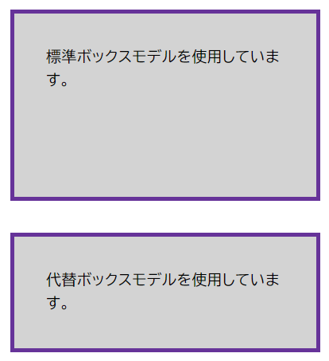
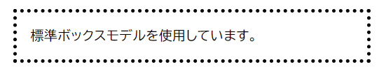

このスキルテストの目的は、 [CSS ボックスモデル](/ja/docs/Learn_web_development/Core/Styling_basics/Box_model)を理解しているかどうかを評価することです。

> [!NOTE]
> 手助けが必要な場合は、[スキルテスト](/ja/docs/Learn_web_development#スキルテスト)使用ガイドをお読みください。また、[コミュニケーションチャネル](/ja/docs/MDN/Community/Communication_channels)のいずれかを使用して、私たちに連絡することもできます。

<!--
## 対話型チャレンジ

まず最初に、[学習パートナー](/ja/docs/MDN/Writing_guidelines/Learning_content#外部リンクと埋め込み)である [Scrimba](https://scrimba.com/home) が作成した、マージンの一括指定を使った楽しくインタラクティブな課題をご紹介します。

埋め込みのスクリームを見て、指示に従ってコードを編集し、タイムライン上の課題（小さな幽霊のアイコン）を完了してください。完了したら、スクリームの再生を再開して、教師の解答が自分の解答と一致するかどうかを調べることができます。

<scrim-inline url="https://scrimba.com/learn-html-and-css-c0p/~01s" scrimtitle="Margin shorthand" survey="true"></scrim-inline>
-->

## 課題 1

この課題では、下記の 2 種類のボックスがあり、 1 つは標準ボックスモデル、もう 1 つは代替ボックスモデルを使用しています。 `.alternate` クラスに宣言を追加して 2 つ目のボックスの幅を変更し、最初のボックスの視覚的な幅と一致するようにしましょう。

最終的には下記画像のようになるはずです。



```html live-sample___box-models
<div class="box">標準ボックスモデルを使用しています。</div>
<div class="box alternate">代替ボックスモデルを使用しています。</div>
```

```css live-sample___box-models
body {
  font: 1.2em / 1.5 sans-serif;
}
.box {
  border: 5px solid rebeccapurple;
  background-color: lightgray;
  padding: 40px;
  margin: 40px;
  width: 300px;
  height: 150px;
}

.alternate {
  box-sizing: border-box;
}
```

{{EmbedLiveSample("box-models", "", "540px")}}

<details>
<summary>ここをクリックすると、模範解答を表示します。</summary>

2 つ目のブロックの高さと幅を大きくし、パディングと境界線のサイズを追加する必要があります。

```css
.alternate {
  box-sizing: border-box;
  width: 390px;
}
```

</details>

## 課題 2

この課題では、ボックスに次のものを追加してください。

- 5px、黒、点線の境界線
- 20px の上マージン
- 1em の右マージン
- 40px の下マージン
- 2em の左マージン
- すべての辺に 1em のパディング

最終的には下記画像のようになるはずです。



```html live-sample___mbp
<div class="box">標準ボックスモデルを使用しています。</div>
```

```css live-sample___mbp
body {
  font: 1.2em / 1.5 sans-serif;
}

.box {
}
```

{{EmbedLiveSample("mbp")}}

<details>
<summary>ここをクリックすると、模範解答を表示します。</summary>

この作業には、マージン、境界線、パディングのプロパティを正しく使用することが含まれます。
個別指定プロパティ（{{cssxref("margin-top")}}、{{cssxref("margin-right")}} など）を使用することもできますが、すべての辺にマージンとパディングを設定する場合は、一括指定を使用するのがより良い選択でしょう。

```css
.box {
  border: 5px dotted black;
  margin: 20px 1em 40px 2em;
  padding: 1em;
}
```

</details>

## 課題 3

この課題では、インライン要素にマージン、パディング、境界線があります。しかし、上下の行が重なっています。

この課題を完了するには、要素をインラインのまま維持しながら、マージン、パディング、および境界線のサイズが他の行でも尊重されるように CSS を更新してください。

最終的には下記画像のようになるはずです。


```html live-sample___inline-block
<div class="box">
  <p>
    Veggies es bonus vobis, <span>proinde vos postulo</span> essum magis
    kohlrabi welsh onion daikon amaranth tatsoi tomatillo melon azuki bean
    garlic.
  </p>

  <p>
    Gumbo beet greens corn soko endive gumbo gourd. Parsley shallot courgette
    tatsoi pea sprouts fava bean collard greens dandelion okra wakame tomato.
    Dandelion cucumber earthnut pea peanut soko zucchini.
  </p>
</div>
```

```css live-sample___inline-block
body {
  font: 1.2em / 1.5 sans-serif;
}

.box span {
  background-color: pink;
  border: 5px solid black;
  padding: 1em;
}
```

{{EmbedLiveSample("inline-block")}}

<details>
<summary>ここをクリックすると、模範解答を表示します。</summary>

この課題を解決するには、異なる {{cssxref("display")}} 値を使用するタイミングを理解することが要求されます。
`display: inline-block` を追加すると、ブロック方向のマージン、境界線、パディングにより、他にも行が要素から押し出されるようになります。

```css
.box span {
  background-color: pink;
  border: 5px solid black;
  padding: 1em;
  display: inline-block;
}
```

</details>
