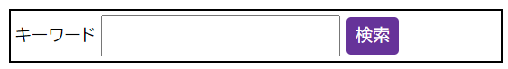

このスキルテストの目的は、[画像、メディア、フォーム要素](/ja/docs/Learn_web_development/Core/Styling_basics/Images_media_forms)のような特殊な要素が CSS でどのように扱われるかを理解しているかどうかを評価することです。

> [!NOTE]
> 手助けが必要な場合は、[スキルテスト](/ja/docs/Learn_web_development#スキルテスト)使用ガイドをお読みください。また、[コミュニケーションチャネル](/ja/docs/MDN/Community/Communication_channels)のいずれかを使用して、私たちに連絡することもできます。

## 課題 1

この課題では、ボックスからはみ出している画像があります。画像は余分な余白なくボックス内に収まるように変倍したいのですが、 画像の一部が切り取られても構いません。これを実現するには、CSS を更新してください。

最終的には下記画像のようになるはずです。


```html live-sample___object-fit
<div class="box">
  
</div>
```

```css live-sample___object-fit
.box {
  border: 5px solid #000;
  width: 400px;
  height: 200px;
}

img {
  /* ここにスタイルを追加 */
}
```

{{EmbedLiveSample("object-fit", "", "400px")}}

<details>
<summary>ここをクリックすると、模範解答を表示します。</summary>

画像の一部が切り取られても問題ありません。
`object-fit: cover` を用いるのが最善の選択ですが、幅と高さを `100%` に設定する必要があります。

```css
img {
  height: 100%;
  width: 100%;
  object-fit: cover;
}
```

</details>

## 課題 2

この課題では、基本的なフォームがあります。

この課題を完了するには、次のようにします。

1. 属性セレクターを使用して `.my-form` 内の検索フィールドとボタンを対象とします。
2. フォームフィールドとボタンにフォームの他の部分と同じテキストサイズを使用するようにします。
3. フォームフィールドとボタンに `10px` のパディングを与えます。
4. ボタンの背景を `rebeccapurple`、前景を白、境界線をなくし、角を 5px に丸めます。

最終的には下記画像のようになるはずです。



```html live-sample___forms-1
<form action="" class="my-form" method="post">
  <div>
    <label for="fldSearch">キーワード</label>
    <input id="fldSearch" name="keywords" type="search" />
    <input name="btnSubmit" type="submit" value="検索" />
  </div>
</form>
```

```css live-sample___forms-1
body {
  font: 1.2em / 1.5 sans-serif;
}
.my-form {
  border: 2px solid #000;
  padding: 5px;
}
```

{{EmbedLiveSample("forms-1")}}

<details>
<summary>ここをクリックすると、模範解答を表示します。</summary>

この課題に対する解決策の例を以下に示します。

```css
.my-form {
  border: 2px solid #000;
  padding: 5px;
}

.my-form input[type="search"] {
  padding: 10px;
  font-size: inherit;
}

.my-form input[type="submit"] {
  padding: 10px;
  font-size: inherit;
  background-color: rebeccapurple;
  color: white;
  border: 0;
  border-radius: 5px;
}
```

</details>

## 課題 3

2 つ目のフォームのスタイル設定の評価は、かなり自由形式であり、ここで何を行うかについて、非常に柔軟に対応できます。 CSS は、下記に記述されている要件を満たす必要があります。

この課題を完了するには、次のようにします。

1. [フォームの動作の正規化](/ja/docs/Learn_web_development/Core/Styling_basics/Images_media_forms#normalizing_form_behavior) で説明されているように、フォント、パディング、マージン、サイズをより一貫性のあるものにするために、何らかの軽量な「リセット」を追加して始めましょう。
2. さらに、入力欄とボタンに、見栄えの良い一貫性のあるスタイル設定を追加します。
3. 入力とラベルがきれいに整列するように、何らかのレイアウト手法を使用してください。

```html hidden live-sample___forms-2
<form>
  <h2>個人情報を編集</h2>
  <ul>
    <li>
      <label for="email">メールアドレス:</label>
      <input type="email" id="email" name="email" />
    </li>
    <li>
      <label for="website">ウェブサイト:</label>
      <input type="url" id="website" name="website" />
    </li>
    <li>
      <label for="phone">電話番号:</label>
      <input type="tel" id="phone" name="phone" />
    </li>
    <li>
      <label for="food">好きな食べもの:</label>
      <select name="food" id="food">
        <option>サラダ</option>
        <option>カレー</option>
        <option>ピザ</option>
        <option>ファヒータ</option>
      </select>
    </li>
    <li>
      <button>情報を更新</button>
    </li>
  </ul>
</form>
```

```css live-sample___forms-2
* {
  box-sizing: border-box;
}

body {
  background-color: #fff;
  color: #333;
  font:
    1em / 1.4 Helvetica Neue,
    Helvetica,
    Arial,
    sans-serif;
  padding: 1em;
  margin: 0;
  width: 500px;
}

/* ここより上のコードは変更しないでください。 */

/* ここにコードを追加してください。 */
```

{{ EmbedLiveSample("forms-2", "100%", 250) }}

<details>
<summary>ここをクリックすると、模範解答を表示します。</summary>

完了した CSS は、次のようになるでしょう。

```css
/* ... */
/* ここより上のコードは変更しないでください。 */

button,
input,
select {
  font-family: inherit;
  font-size: 100%;
  padding: 0;
  margin: 0;
}

li {
  display: flex;
  align-items: center;
  margin-bottom: 10px;
}

li:last-of-type {
  margin-top: 30px;
}

label {
  flex: 0 40%;
  text-align: right;
  padding-right: 10px;
}

input,
select {
  flex: auto;
  height: 2em;
}

input,
select,
button {
  display: block;
  padding: 5px 10px;
  border: 1px solid #ccc;
  border-radius: 3px;
}

select {
  padding: 5px;
}

button {
  margin: 0 auto;
  padding: 5px 20px;
  line-height: 1.5;
  background: #eee;
}

button:hover,
button:focus {
  background: #ddd;
}
```

</details>
