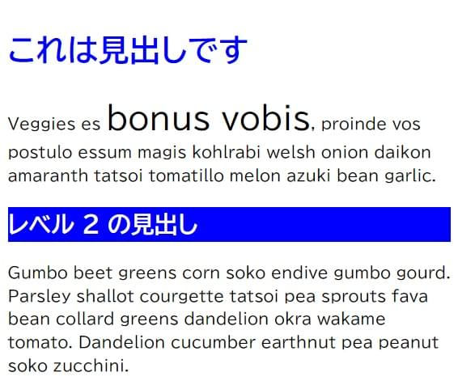
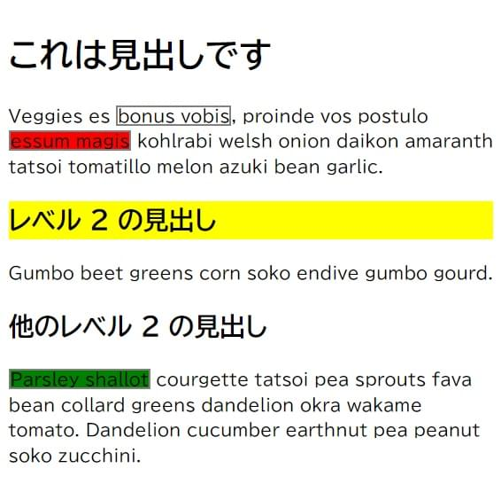
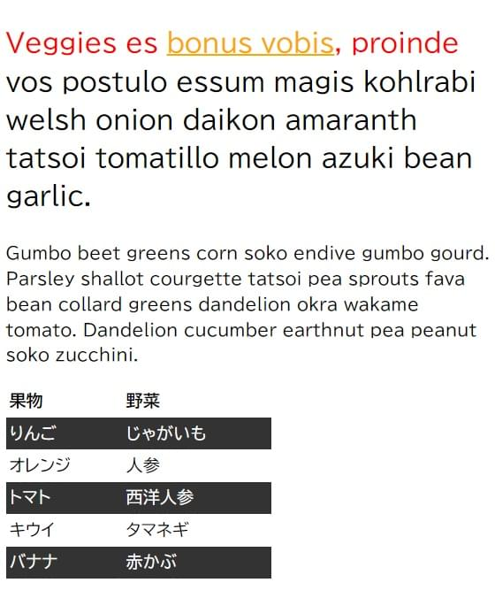
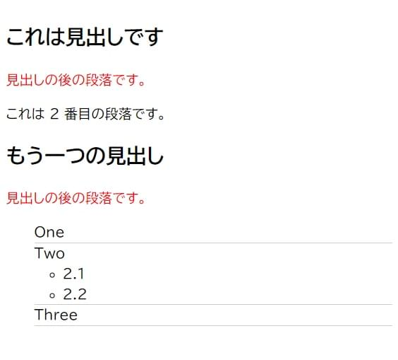
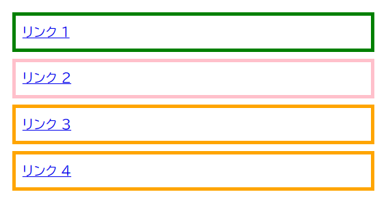

このスキルテストの目的は、 [CSS セレクター](/ja/docs/Learn_web_development/Core/Styling_basics/Basic_selectors)を理解しているかどうかを評価することです。

これらの課題を完了するには、HTML は編集せずに CSS のみ編集してください。

> [!NOTE]
> 手助けが必要な場合は、[スキルテスト](/ja/docs/Learn_web_development#スキルテスト)使用ガイドをお読みください。また、[コミュニケーションチャネル](/ja/docs/MDN/Community/Communication_channels)のいずれかを使用して、私たちに連絡することもできます。

## 課題 1

この課題では、 HTML を変えずに CSS を使用して以下のことを行ってください。

1. `<h1>` の見出しを青にする。
2. `<h2>` の見出しを青背景の白文字にする。
3. `<span>` で囲まれたテキストのフォントサイズが `200%` になるようにする。

最終結果は下記の画像のようになるはずです。



```html live-sample___type
<div class="container">
  <h1>これは見出しです</h1>
  <p>
    Veggies es <span>bonus vobis</span>, proinde vos postulo essum magis
    kohlrabi welsh onion daikon amaranth tatsoi tomatillo melon azuki bean
    garlic.
  </p>
  <h2>レベル 2 の見出し</h2>
  <p>
    Gumbo beet greens corn soko endive gumbo gourd. Parsley shallot courgette
    tatsoi pea sprouts fava bean collard greens dandelion okra wakame tomato.
    Dandelion cucumber earthnut pea peanut soko zucchini.
  </p>
</div>
```

```css live-sample___type
body {
  font: 1.2em / 1.5 sans-serif;
}
/* ここにスタイルを追加 */
```

{{EmbedLiveSample("type", "", "260px")}}

<details>
<summary>ここをクリックすると、模範解答を表示します。</summary>

色やサイズを変更するには、`h1`、`h2`、`span` セレクターを対象とする必要があります。

```css
h1 {
  color: blue;
}

h2 {
  background-color: blue;
  color: white;
}

span {
  font-size: 200%;
}
```

</details>

## 課題 2

この課題を完成させるには、次のことを行ってください。

1. id が `special` の要素の背景を黄色にする。
2. `alert` クラスの要素に 1px の灰色の境界線をつける。
3. `alert` クラスを持つ要素が `stop` クラスも持つ場合、背景を赤にする。
4. `alert` クラスを持つ要素が `go` クラスも持つ場合、背景を緑色にする。

最終結果は下記の画像のようになるはずです。



```html live-sample___class-id
<div class="container">
  <h1>これは見出しです</h1>
  <p>
    Veggies es <span class="alert">bonus vobis</span>, proinde vos postulo
    <span class="alert stop">essum magis</span> kohlrabi welsh onion daikon
    amaranth tatsoi tomatillo melon azuki bean garlic.
  </p>
  <h2 id="special">レベル 2 の見出し</h2>
  <p>Gumbo beet greens corn soko endive gumbo gourd.</p>
  <h2>他のレベル 2 の見出し</h2>
  <p>
    <span class="alert go">Parsley shallot</span> courgette tatsoi pea sprouts
    fava bean collard greens dandelion okra wakame tomato. Dandelion cucumber
    earthnut pea peanut soko zucchini.
  </p>
</div>
```

```css live-sample___class-id
body {
  font: 1.2em / 1.5 sans-serif;
}
/* ここにスタイルを追加 */
```

{{EmbedLiveSample("class-id", "", "320px")}}

<details>
<summary>ここをクリックすると、模範解答を表示します。</summary>

これは、クラスセレクターと ID セレクターの違いを理解しているか、また、アイテムの複数のクラスを対象とする方法を理解しているかを検査するものです。

```css
#special {
  background-color: yellow;
}

.alert {
  border: 2px solid grey;
}

.alert.stop {
  background-color: red;
}

.alert.go {
  background-color: green;
}
```

</details>

## 課題 3

この課題では、 HTML に追加することなく、以下の変更を行ってください。

- リンクをスタイル設定し、リンク状態をオレンジ色に、訪問済みリンクを緑色に、ホバー時のアンダーラインを除去する。
- コンテナーの中にある最初の要素を font-size: 150% にし、その要素の最初の行を赤くする。
- 表内の行を 1 つおきに選択し、背景色を #333 に、前景色を白にする。

最終結果は下記の画像のようになるはずです。



以下のライブコードを更新して、完成例を再現してみてください。

```html live-sample___pseudo
<div class="container">
  <p>
    Veggies es <a href="http://example.com">bonus vobis</a>, proinde vos postulo
    essum magis kohlrabi welsh onion daikon amaranth tatsoi tomatillo melon
    azuki bean garlic.
  </p>
  <p>
    Gumbo beet greens corn soko endive gumbo gourd. Parsley shallot courgette
    tatsoi pea sprouts fava bean collard greens dandelion okra wakame tomato.
    Dandelion cucumber earthnut pea peanut soko zucchini.
  </p>
  <table>
    <tbody>
      <tr>
        <th>果物</th>
        <th>野菜</th>
      </tr>
      <tr>
        <td>りんご</td>
        <td>じゃがいも</td>
      </tr>
      <tr>
        <td>オレンジ</td>
        <td>人参</td>
      </tr>
      <tr>
        <td>トマト</td>
        <td>西洋人参</td>
      </tr>
      <tr>
        <td>キウイ</td>
        <td>タマネギ</td>
      </tr>
      <tr>
        <td>バナナ</td>
        <td>赤かぶ</td>
      </tr>
    </tbody>
  </table>
</div>
```

```css live-sample___pseudo
body {
  font: 1.2em / 1.5 sans-serif;
}
* {
  box-sizing: border-box;
}

table {
  border-collapse: collapse;
  width: 300px;
}

td,
th {
  padding: 0.2em;
  text-align: left;
}

/* ここにスタイルを追加 */
```

{{EmbedLiveSample("pseudo", "", "320px")}}

<details>
<summary>ここをクリックすると、模範解答を表示します。</summary>

コンテンツに擬似クラス (`:first-child`) と擬似要素 (`::first-line`) を適用します。
`a` 要素の`:link`、`:visited`、`:hover`の状態にスタイル設定を行い、 `:nth-child` 擬似クラスを使用して表の行を縞模様にします。

```css
.container p:first-child {
  font-size: 150%;
}

.container p:first-child::first-line {
  color: red;
}

a:link {
  color: orange;
}

a:visited {
  color: green;
}

a:hover {
  text-decoration: none;
}

tr:nth-child(even) {
  background-color: #333;
  color: #fff;
}
```

</details>

## 課題 4

この課題では、以下のことを行っていただきたいと思います。

1. `<h2>` 要素の直後の段落を赤くする。
2. 箇条書きを取り除き、 ul の直接の子でクラスが `list` であるリストアイテムにのみ、 1px のグレーの下境界線を追加します。

最終結果は下記の画像のようになるはずです。



```html live-sample___combinators
<div class="container">
  <h2>これは見出しです</h2>
  <p>見出しの後の段落です。</p>
  <p>これは 2 番目の段落です。</p>

  <h2>もう一つの見出し</h2>
  <p>見出しの後の段落です。</p>
  <ul class="list">
    <li>One</li>
    <li>
      Two
      <ul>
        <li>2.1</li>
        <li>2.2</li>
      </ul>
    </li>
    <li>Three</li>
  </ul>
</div>
```

```css live-sample___combinators
body {
  font: 1.2em / 1.5 sans-serif;
}

/* ここにスタイルを追加 */
```

{{EmbedLiveSample("combinators", "", "350px")}}

<details>
<summary>ここをクリックすると、模範解答を表示します。</summary>

この課題では、さまざまな結合子を使用する方法を理解しているか調べます。
適切な解答は次の通りです。

```css
h2 + p {
  color: red;
}

.list > li {
  list-style: none;
  border-bottom: 1px solid #ccc;
}
```

</details>

## 課題 5

この課題を完了するには、属性セレクターを使用して、次の課題に対する解決策を提供してください。

1. `<a>` 要素に `title` 属性を対象とし、境界線をピンクにします (`border-color: pink`)。
2. `<a>` 要素のうち、 `href` 属性のどこかに `contact` という単語を含むものを対象とし、境界線をオレンジ色にします (`border-color: orange`)。
3. `<a>` 要素のうち、 `href` 属性が `https` で始まるものを対象とし、緑色の境界線 (`border-color: green`) を与えます。

最終結果は下記の画像のようになるはずです。



```html live-sample___attribute-links
<ul>
  <li><a href="https://example.com">リンク 1</a></li>
  <li><a href="http://example.com" title="Visit example.com">リンク 2</a></li>
  <li><a href="/contact">リンク 3</a></li>
  <li><a href="../contact/index.html">リンク 4</a></li>
</ul>
```

```css live-sample___attribute-links
body {
  font: 1.2em / 1.5 sans-serif;
}

ul {
  list-style: none;
  margin: 0;
  padding: 0;
}

li {
  margin: 0 0 0.5em 0;
}

a {
  display: block;
  padding: 0.5em;
}

a {
  border: 5px solid grey;
}

/* ここにスタイルを追加 */
```

{{EmbedLiveSample("attribute-links", "", "300px")}}

<details>
<summary>ここをクリックすると、模範解答を表示します。</summary>

- title 属性を持つ要素を選択するには、角カッコ内に title を追加します (`a[title]`)。これにより、唯一タイトル属性を持つ 2 つ目のリンクが選択されます。

- `<a>` 要素の `href` 属性の値のどこかに "contact" という語が格納されている要素を対象とし、境界線をオレンジ色 (`border-color: orange`) にします。
  ここで照合したいのは、 href 値の `/contact` と `../contact` の 2 つです。そのため、値のどこかに文字列 "contact" が含まれていることを照合する必要があり、 `*=` を使用します。これにより 3 つ目と 4 つ目のリンクが選択されます。

- `<a>` 要素の `href` 値が `https` で始まるものを対象とし、緑色の境界線 (`border-color: green`) を設定します。
  `href` 値が "https" で始まるものを探していくには、最初のリンクのみを選択するために `^=` を使用します。

```css
a[title] {
  border-color: pink;
}
a[href*="contact"] {
  border-color: orange;
}
a[href^="https"] {
  border-color: green;
}
```

</details>
