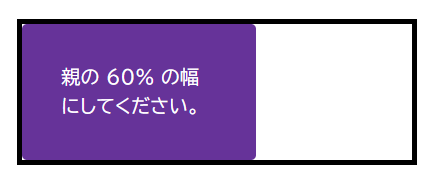

このスキルテストの目的は、 [CSS でのアイテムのサイズ設定](/ja/docs/Learn_web_development/Core/Styling_basics/Sizing)の様々な方法を理解しているかどうかを評価することです。

> [!NOTE]
> 手助けが必要な場合は、[スキルテスト](/ja/docs/Learn_web_development#スキルテスト)使用ガイドをお読みください。また、[コミュニケーションチャネル](/ja/docs/MDN/Community/Communication_channels)のいずれかを使用して、私たちに連絡することもできます。

## 課題 1

この課題では、 2 つのボックスがあります。

この課題を完成させるには、次のことを行ってください。

1. 最初のボックスは、高さが少なくとも `100px` になるようにし、コンテンツの量が少なくてその高さに達しない場合でも、その高さになるようにします。ただし、コンテンツが 100 ピクセルに収まらない場合でも、コンテンツがあふれないようにしてください。
2. HTML からコンテンツを削除して、コンテンツがない場合でもボックスの高さが `100px` になることを確認してください。
3. 2 つ目のボックスの高さは `100px` に固定し、コンテンツが多すぎるとはみ出るようにしてください。

最終結果は、以下の画像のようになるはずです。


```html live-sample___height-min-height
<div class="box box1">
  <p>
    Veggies es bonus vobis, proinde vos postulo essum magis kohlrabi welsh onion
    daikon amaranth tatsoi tomatillo melon azuki bean garlic. Gumbo beet greens
    corn soko endive gumbo gourd.
  </p>
</div>

<div class="box box2">
  <p>
    Veggies es bonus vobis, proinde vos postulo essum magis kohlrabi welsh onion
    daikon amaranth tatsoi tomatillo melon azuki bean garlic. Gumbo beet greens
    corn soko endive gumbo gourd.
  </p>
</div>
```

```css live-sample___height-min-height
body {
  font: 1.2em / 1.5 sans-serif;
  padding: 1em;
}

.box {
  border: 5px solid #000;
  width: 400px;
  margin-bottom: 1em;
}

.box1 {
  /* ここにスタイルを追加 */
}

.box2 {
  /* ここにスタイルを追加 */
}
```

{{EmbedLiveSample("height-min-height", "", "500px")}}

<details>
<summary>ここをクリックすると、模範解答を表示します。</summary>

2 つのボックスがあり、最初のボックスは最小の高さが与えられ、その場合、追加のコンテンツを展開して収容しますが、コンテンツが除去されると、ボックスは少なくとも `min-height` と同じ高さになります。 2 つ目は修正された高さで指定され、コンテンツがあふれた状態になります。

```css
.box1 {
  min-height: 100px;
}

.box2 {
  height: 100px;
}
```

</details>

## 課題 2

この課題では、別のボックスを格納しているボックスがあります。

この課題を完成させるには、次のことを行ってください。

1. 課題は、内側のボックスの幅を外側のボックスの幅の `60%` にすることです。 {{cssxref("box-sizing")}} プロパティの値は `border-box` に設定されており、これは全体の幅がパディングと境界線を含んでいることを意味しています。
2. また、幅（またはインラインサイズ）を使用して、内側のボックスに `10%` のパディング値を与えてください。

最終的には下記画像のようになるはずです。



```html live-sample___percentages
<div class="box">
  <div class="inner">親の 60% の幅にしてください。</div>
</div>
```

```css live-sample___percentages
body {
  font: 1.2em / 1.5 sans-serif;
  padding: 1em;
}

.box {
  border: 5px solid #000;
  width: 400px;
  margin-bottom: 1em;
}

.inner {
  background-color: rebeccapurple;
  color: white;
  border-radius: 5px;
}

* {
  box-sizing: border-box;
}
.inner {
  /* ここにスタイルを追加 */
}
```

{{EmbedLiveSample("percentages", "", "250px")}}

<details>
<summary>ここをクリックすると、模範解答を表示します。</summary>

ボックスをコンテナーの 60% にし、すべての辺に 10% のパディングを与えます。
すべての要素はすでに `box-sizing: border-box` が設定されており、どの幅を使用しているかについて心配する必要はありません。

```css
* {
  box-sizing: border-box;
}
.inner {
  width: 60%;
  padding: 10%;
}
```

</details>

## 課題 3

この課題では、箱の中に 2 つの画像があります。一方の画像はボックスより小さく、もう一方はボックスからはみ出す大きさです。

この課題を完成させるには、ボックスがレスポンシブであり、伸長したり縮小したりできると想像してください。大きな画像がボックス内に縮小され、小さな画像が伸縮しないように、画像に宣言を適用してください。

最終的には下記画像のようになるはずです。


```html live-sample___max-width
<div class="box">
  
</div>

<div class="box">
  
</div>
```

```css live-sample___max-width
body {
  font: 1.2em / 1.5 sans-serif;
  padding: 1em;
}
.box {
  border: 5px solid #000;
  margin-bottom: 1em;
  width: 500px;
}

img {
  /* ここにスタイルを追加 */
}
```

{{EmbedLiveSample("max-width", "", "700px")}}

<details>
<summary>ここをクリックすると、模範解答を表示します。</summary>

この例には、ボックスからはみ出す画像とボックスよりも小さい画像があります。大きな画像がボックスと同じ大きさだけ伸長するように発生させるには、 `max-width` を 100% に設定する必要があります。 `width: 100%` を使用すると、小さな画像が伸長します。

```css
img {
  max-width: 100%;
}
```

</details>
