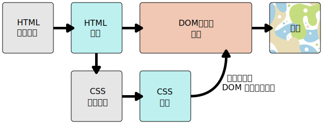

{{LearnSidebar}}

{{NextMenu("Learn_web_development/Core/Styling_basics/Getting_started", "Learn_web_development/Core/Styling_basics")}}

**{{Glossary("CSS")}}** (Cascading Style Sheets) を使用すると、見栄えの良いウェブページを作成することができますが、どのような仕組みになっているのでしょうか。この記事では、 CSS とは何か、基本的な構文はどのようなものか、また、どうやってブラウザーが CSS を HTML に適用してスタイル設定するのかについて説明します。

<table>
  <tbody>
    <tr>
      <th scope="row">前提知識:</th>
      <td>
        基本的なコンピューターリテラシー、<a
          href="/ja/docs/Learn_web_development/Getting_started/Environment_setup/Installing_software"
          >基本的なソフトウェアがインストールされていること</a
        >、基本的な<a
          href="/ja/docs/Learn_web_development/Getting_started/Environment_setup/Dealing_with_files"
          >ファイルの操作方法</a
        >に関する知識、 HTML の基本（<a href="/ja/docs/Learn_web_development/Core/Structuring_content"
          >HTML 概論</a
        >を学習のこと）。
      </td>
    </tr>
    <tr>
      <th scope="row">学習成果:</th>
      <td>
        <ul>
          <li>CSS の目的。</li>
          <li>HTML はスタイル設定とは関係ないこと。</li>
          <li>ブラウザーの既定のスタイルという概念。</li>
          <li>CSS コードはどのようなものか。</li>
          <li>CSS が HTML にどのように適用されるのか。</li>
        <ul>
      </td>
    </tr>
  </tbody>
</table>

## ブラウザーの既定のスタイル

[HTML によるコンテンツの構造化](/ja/docs/Learn_web_development/Core/Structuring_content)モジュールでは、HTML とは何か、そして文書をマークアップするためにどのように使用されるかについて説明しました。こうした文書はウェブブラウザーで表示できます。見出しは通常のテキストよりも大きく表示され、段落は改行され、段落間に空間が確保されます。リンクは色付きで下線が引かれ、他のテキストと判別できるようになっています。

ここで見えているのは、ブラウザーの既定のスタイルです。これは、ページの作成者が明示的なスタイルを指定していない場合でも、ページが基本的に読みやすいように、ブラウザーが HTML に適用するとても基本的なスタイルです。これらのスタイルは、ブラウザーに含まれる既定の CSS スタイルシートで定義されています。これらは HTML とは関係がありません。


もしすべてのウェブサイトがそれと同じように見えていたら、ウェブは退屈な場所になってしまいます。これが、 CSS について学ぶ必要がある理由です。

## CSS は何のためのものか

CSS を使用すると、 HTML 要素がブラウザー上でどのように見えるかを正確に制御でき、好きなデザインやレイアウトで文書をユーザーに表示することができます。

**文書**とは通常、マークアップ言語を使用して構造化されたテキストファイルを指します。最も一般的なマークアップ言語は {{Glossary("HTML")}} ですが、 {{Glossary("SVG")}} や {{Glossary("XML")}} など、マークアップ言語は他にもあります。

文書をユーザーに**表現**するということは、閲覧者が利用できる形に変換するということです。{{Glossary("browser","ブラウザー")}}、たとえば {{Glossary("Mozilla Firefox","Firefox")}}、{{Glossary("Google Chrome","Chrome")}}、{{Glossary("Microsoft Edge","Edge")}} などは、例えばコンピューター画面、プロジェクター、プリンターなど、視覚的に文書を表現するように設計されています。

> [!NOTE]
> ブラウザーは{{Glossary("User agent","ユーザーエージェント")}}と呼ばれることがあり、基本的にはコンピューターシステム内でユーザーを代理するコンピュータープログラムという意味です。

CSS はテキストの装飾に使用することができます。例えば、見出しやリンクの[色](/ja/docs/Web/CSS/color_value)や[サイズ](/ja/docs/Web/CSS/font-size)を変更することができます。また、 CSS はレイアウトの作成にも使用することができます。例えば、段組みのないテキストを、[メインコンテンツ領域と関連情報のサイドバーを持つレイアウトに変える](/ja/docs/Web/CSS/Layout_cookbook/Column_layouts)ことができます。さらに、 CSS は[アニメーション](/ja/docs/Web/CSS/CSS_animations)などの効果にも使用することができます。具体的な例については、この段落内のリンクを参照してください。

CSS 言語は、関連する機能を含むモジュールに分類されています。例えば、 MDN のリファレンスページで「[背景と境界線](/ja/docs/Web/CSS/CSS_backgrounds_and_borders)」モジュールを参照すると、その目的や含まれるプロパティや機能について知ることができます。また、そのモジュールには、技術を定義する仕様書へのリンクも含まれています。

## CSS の構文の基本

CSSはルールベースの言語です。つまり、ウェブページ上の特定の要素または要素グループに適用すべきスタイルのグループを指定することで、ルールを定義します。

例えば、ページのメインの見出しを大きな赤いテキストにするというスタイルを適用することができます。次のコードは、これを実現するとてもシンプルな CSS ルールを示しています。

```css
h1 {
  color: red;
  font-size: 5em;
}
```

- 上記の例では、CSS ルールは{{Glossary("CSS Selector", "セレクター")}}で始まっています。これにより、スタイルを適用する HTML 要素が選択されます。この場合、レベル 1 の見出し（`{{htmlelement("Heading_Elements", "&lt;h1>")}}`）にスタイルを適用します。
- それから一組の中括弧 (`{ }`) があります。
- 中括弧には 1 つまたは複数の**宣言**が含まれており、**プロパティ**と**値**のペアという形で表されます。コロンの前にはプロパティ（例えば、上記の例では `color`）を指定し、コロンの後にはプロパティの値を指定します（`red` は `color` プロパティに設定する値です）。
- この例には、 2 つの宣言があります。 1 つは `color` 、もう 1 つは `font-size` です。

それぞれの CSS プロパティごとに、許容される値は異なります。上記の例では、 `color` プロパティがあり、さまざまな[色の値](/ja/docs/Learn_web_development/Core/Styling_basics/Values_and_units#色)を取ることができます。また、 `font-size` プロパティもあります。このプロパティでは、さまざまな[サイズの単位](/ja/docs/Learn_web_development/Core/Styling_basics/Values_and_units#数値、長さ、パーセント値)を値として取ることができます。

CSS スタイルシートには、このようなルールが他にもたくさん格納されており、次から次へと書かれています。

```css
h1 {
  color: red;
  font-size: 5em;
}

p {
  color: black;
}
```

いくつかの値はすぐに調べられますが、他にも調べていく必要があるものもあります。MDNで個々のプロパティページでは、プロパティとその値をすばやく調べるのに役立ちまる。

> [!NOTE]
> MDN の [CSS リファレンス](/ja/docs/Web/CSS/Reference)には、掲載されている CSS プロパティページのすべてへのリンクを（他の CSS 機能とともに）見つけることができます。あるいは、CSS 機能についてさらに詳しい情報を知りたい場合は、お好みの検索エンジンで "mdn _css-機能名_" を検索してみてください。 例えば、 "mdn color" や "mdn font-size" と検索してみてください。

## どのように CSS は HTML に適用されるのか

ブラウザーが文書を表示するとき、ブラウザーはそのコンテンツをスタイル情報と結合する必要があります。以下にリストしたいくつかの段階で文書が処理されます。これはブラウザーがウェブページを読み込むときに起こることを単純化したものであり、各ブラウザーで処理は異なるものの、おおよそ何が起こるかを示しています。

1. ブラウザーが HTML を読み込みます。
2. HTML を {{Glossary("DOM")}} (_Document Object Model_) ツリーと呼ばれるツリー風の構造に変換します。 DOM は文書をコンピューターのメモリー内で表現したものです。
3. それから、ブラウザーは HTML 文書からリンクされているリソースの大部分、例えば埋め込まれた画像や動画、そして CSS を取得します。 JavaScript はもう少し後に処理されるので、話を簡単にするためここでは説明しません。
4. ブラウザーは取得した CSS を構文解析し、適用される HTML 要素（DOM では**ノード**として表される）に基づいて、異なるルールを異なる「容器」に分類します。 その後、ブラウザーは必要に応じて異なる要素にスタイルを適用します（この中間段階は**レンダーツリー**と呼ばれます）。
5. レンダーツリーは、ルール適用後の構造にレイアウトされます。
6. ページが画面に表示されます（この段階は描画と呼ばれます）。

簡単に図に表すと次のとおりです。



### DOM について

前述のように、 DOM はツリーのような構造です。マークアップ言語の各要素、属性、およびテキストは、このツリー構造の {{Glossary("Node/DOM","DOM ノード")}}になります。ノードは他の DOM ノードとの関係によって定義されます。要素は子ノードの親であり、子ノードには兄弟があります。

DOM は CSS と文書のコンテンツが出会う場所であるため、DOM を理解すると CSS の設計、デバッグ、および保守に役立ちます。ブラウザーの開発者ツールによって、どのルールが適用されるかを確認するために、アイテムを選択することで DOM にナビゲートされます。

長く退屈な説明ではなく、例を用いて実際の HTML が DOM に変換される様子を見てみましょう。

以下のような HTML があります。

```html
<p>
  Let's use:
  <span>Cascading</span>
  <span>Style</span>
  <span>Sheets</span>
</p>
```

ブラウザーは HTML を構文解析し、そこから DOM を作成します。以下のようなものです。

```plain
P
├─ "Let's use:"
├─ SPAN
|  └─ "Cascading"
├─ SPAN
|  └─ "Style"
└─ SPAN
    └─ "Sheets"
```

この DOM では、 `<p>` 要素に対応するノードが親ノードです。子には、テキストノードと 3 つの `<span>` 要素に対応するノードがあります。 `SPAN` ノードは親でもあり、テキストノードを子に持ちます。ブラウザーは上述の HTML をこのように構文解析し、DOM ツリーを以下のようにレンダリングし出力します。

{{EmbedLiveSample('More on the DOM', '100%', 55)}}

```css hidden
p {
  margin: 0;
}
```

## DOM への CSS 適用

文書に次の CSS を追加して、スタイルを設定したとします。

```html hidden
<p>
  Let's use:
  <span>Cascading</span>
  <span>Style</span>
  <span>Sheets</span>
</p>
```

```css
span {
  border: 1px solid black;
  background-color: lime;
}
```

この場合、ブラウザーは前の節と同様に、まず DOM ツリーを作成します。次に CSS を解釈します。 CSS で利用できるルールは `span` セレクターだけなので、ブラウザーはすばやく CSS を並べ替えます。そのルールを 3 つの `<span>` のそれぞれに適用し、最終的な視覚表現を画面へ描画します。

結果、次のとおり出力されます。

{{EmbedLiveSample('Applying CSS to the DOM', '100%', 90)}}

## まとめ

CSS とは何か、またこれがどのように動作するのかについてある程度理解していただけたと思いますので、これから CSS を自分で書くことを始める方には、次のステップに進みましょう。

{{NextMenu("Learn_web_development/Core/Styling_basics/Getting_started", "Learn_web_development/Core/Styling_basics")}}
