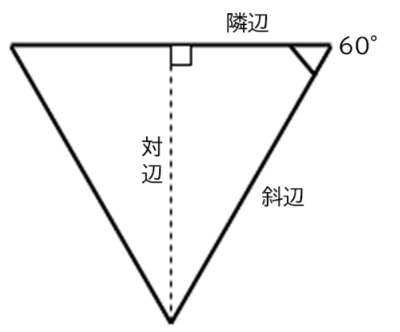

{{PreviousMenuNext("Learn_web_development/Extensions/Client-side_APIs/Video_and_audio_APIs", "Learn_web_development/Extensions/Client-side_APIs/Client-side_storage", "Learn_web_development/Extensions/Client-side_APIs")}}

ブラウザーには、Scalable Vector Graphics ([SVG](/ja/docs/Web/SVG)) 言語から HTML の {{htmlelement("canvas")}} 要素に描画するための API まで、とても強力なグラフィックプログラミングツールが含まれています（[キャンバス API](/ja/docs/Web/API/Canvas_API) と [WebGL](/ja/docs/Web/API/WebGL_API) を参照）。この記事では、キャンバスについて紹介し、さらに詳しく学ぶためのリソースを提供します。

<table>
  <tbody>
    <tr>
      <th scope="row">前提知識:</th>
      <td>
        <a href="/ja/docs/Learn_web_development/Core/Structuring_content">HTML</a>、<a href="/ja/docs/Learn_web_development/Core/Styling_basics">CSS</a>、<a href="/ja/docs/Learn_web_development/Core/Scripting">JavaScript</a> に親しんでおくこと、特に <a href="/ja/docs/Learn_web_development/Core/Scripting/Object_basics">JavaScript オブジェクトの基本</a>と <a href="/ja/docs/Learn_web_development/Core/Scripting/DOM_scripting">DOM スクリプティング</a>や<a href="/ja/docs/Learn_web_development/Core/Scripting/Network_requests">ネットワークリスクエスト</a>などのコア API を扱っているものを理解しておくこと。
      </td>
    </tr>
    <tr>
      <th scope="row">学習成果:</th>
      <td>
        <ul>
          <li>このレッスンで取り上げる API によって実現される概念と用途。</li>
          <li><code>&lt;canvas&gt;</code> の基本構文と使用方法、および関連する API。</li>
          <li>タイマーと <code>requestAnimationFrame()</code> を使用してループするアニメーションを作成すること。</li>
        </ul>
      </td>
    </tr>
  </tbody>
</table>

## ウェブでのグラフィック

ウェブはもともとテキストだけでした、それではとてもつまらなかったので、画像が登場しました。最初は {{htmlelement("img")}} 要素によって、後には {{cssxref("background-image")}} といった CSS のプロパティを経て、 [SVG](/ja/docs/Web/SVG) が導入されました。

しかし、これではまだ十分ではありませんでした。 [CSS](/ja/docs/Learn_web_development/Core/Styling_basics) や [JavaScript](/ja/docs/Learn_web_development/Core/Scripting) を使用して、マークアップで表現された SVG ベクター画像をアニメーションさせたり操作したりすることはできますが、ビットマップ画像に対して同じことをする方法はまだなく、利用できるツールもかなり限定されていたのです。ウェブでは、アニメーションやゲーム、三次元のシーンなど、 C++ や Java といった低水準の言語が扱う要件を効果的に作成する方法がまだありませんでした。

ブラウザーが {{htmlelement("canvas")}} 要素と関連する[キャンバス API](/ja/docs/Web/API/Canvas_API) に対応し始めた頃から状況は改善されました。後述するように、キャンバスは二次元アニメーション、ゲーム、データの視覚化、その他の種類のアプリケーションを作成するためのいくつかの有用なツールを提供し、特にウェブプラットフォームが提供する他の API と組み合わせたときにその威力を発揮しますが、アクセシブルにするには難しかったり不可能であったりします。

以下の例は、もともと [JavaScript オブジェクト入門](/ja/docs/Learn_web_development/Extensions/Advanced_JavaScript_objects/Object_building_practice)モジュールで出会った、キャンバスベースのシンプルな二次元の弾むボールのアニメーションを示しています。

```html hidden live-sample___bouncing-balls
<h1>弾むボール</h1>
<canvas></canvas>
```

```css hidden live-sample___bouncing-balls
html,
body {
  margin: 0;
}

html {
  font-family: "Helvetica Neue", "Helvetica", "Arial", sans-serif;
  height: 100%;
}

body {
  overflow: hidden;
  height: inherit;
}

h1 {
  font-size: 2rem;
  letter-spacing: -1px;
  position: absolute;
  margin: 0;
  top: -4px;
  right: 5px;

  color: transparent;
  text-shadow: 0 0 4px white;
}
```

```js hidden live-sample___bouncing-balls
// キャンバスをセットアップ

const canvas = document.querySelector("canvas");
const ctx = canvas.getContext("2d");

const width = (canvas.width = window.innerWidth);
const height = (canvas.height = window.innerHeight);

// 乱数を生成する関数

function random(min, max) {
  return Math.floor(Math.random() * (max - min + 1)) + min;
}

// ランダムな RGB 色値を生成する関数

function randomRGB() {
  return `rgb(${random(0, 255)} ${random(0, 255)} ${random(0, 255)})`;
}

const balls = [];

class Ball {
  constructor(x, y, velX, velY, color, size) {
    this.x = x;
    this.y = y;
    this.velX = velX;
    this.velY = velY;
    this.color = color;
    this.size = size;
  }

  draw() {
    ctx.beginPath();
    ctx.fillStyle = this.color;
    ctx.arc(this.x, this.y, this.size, 0, 2 * Math.PI);
    ctx.fill();
  }

  update() {
    if (this.x + this.size >= width) {
      this.velX = -Math.abs(this.velX);
    }

    if (this.x - this.size <= 0) {
      this.velX = Math.abs(this.velX);
    }

    if (this.y + this.size >= height) {
      this.velY = -Math.abs(this.velY);
    }

    if (this.y - this.size <= 0) {
      this.velY = Math.abs(this.velY);
    }

    this.x += this.velX;
    this.y += this.velY;
  }

  collisionDetect() {
    for (const ball of balls) {
      if (!(this === ball)) {
        const dx = this.x - ball.x;
        const dy = this.y - ball.y;
        const distance = Math.sqrt(dx * dx + dy * dy);

        if (distance < this.size + ball.size) {
          ball.color = this.color = randomRGB();
        }
      }
    }
  }
}

while (balls.length < 25) {
  const size = random(10, 20);
  const ball = new Ball(
    // 描画エラーを防ぐため、ボールの位置は常にキャンバスの端から
    // ボール 1 個分以上の幅だけ離して描画する
    random(0 + size, width - size),
    random(0 + size, height - size),
    random(-7, 7),
    random(-7, 7),
    randomRGB(),
    size,
  );

  balls.push(ball);
}

function loop() {
  ctx.fillStyle = "rgba(0, 0, 0, 0.25)";
  ctx.fillRect(0, 0, width, height);

  for (const ball of balls) {
    ball.draw();
    ball.update();
    ball.collisionDetect();
  }

  requestAnimationFrame(loop);
}

loop();
```

{{EmbedLiveSample("bouncing-balls", '100%', 500)}}

2006〜2007 年頃、Mozilla は三次元キャンバスの実装を実験的に行うために作業を開始しました。これが [WebGL](/ja/docs/Web/API/WebGL_API) となり、ブラウザーベンダーの間で評判となり、2009 年から 2010 年頃に標準化されました。WebGL を使うと、ウェブブラウザーの中で本格的な三次元グラフィックを作成することができます。

この記事では、生の WebGL コードはとても複雑であるため、主に二次元キャンバスに焦点を当てます。しかし、[WebGL ライブラリーを使用して、より簡単に三次元シーンを作成する方法](#webgl)を紹介します。また、生の WebGL を使用するチュートリアルは他の場所にあります。[WebGL 入門](/ja/docs/Web/API/WebGL_API/Tutorial/Getting_started_with_WebGL)を参照してください。

## \<canvas> を始めよう

ウェブページに二次元または三次元のシーンを作成する場合、HTML の {{htmlelement("canvas")}} 要素から開始する必要があります。この要素は、ページ上で画像が描画される領域を定義するために使用されます。これは、ページ上に要素を記載するのと同じくらい簡単です。

```html
<canvas width="320" height="240"></canvas>
```

これにより、ページ上に 320 × 240 ピクセルの大きさのキャンバスが作成されます。

`<canvas>` タグの中には、代替コンテンツを記述してください。これは、キャンバスに対応していないブラウザーのユーザーや、スクリーンリーダーのユーザーに対して、キャンバスのコンテンツを説明するものです。

```html
<canvas width="320" height="240">
  <p>キャンバスが見えない人向けの説明。</p>
</canvas>
```

代替コンテンツは、キャンバスのコンテンツに代わる有益なコンテンツを提供する必要があります。例えば、常に更新される株価のグラフをレンダリングしている場合、代替コンテンツは最新の株価グラフの静止画像で、 `alt` テキストで株価の内容を言ったり、個々の株価ページへのリンクのリストを表示したりすることができます。

> [!NOTE]
> キャンバスのコンテンツはスクリーンリーダーにとってアクセシブルではありません。キャンバス要素自体に直接 [`aria-label`](/ja/docs/Web/Accessibility/ARIA/Reference/Attributes/aria-label) 属性の値として説明テキストを含めるか、開始タグと閉じられた `<canvas>` タグ内に代替コンテンツを記述するかしてください。キャンバスのコンテンツは DOM に所属しませんが、その中にある代替コンテンツは所属します。

### キャンバスの作成とサイズ変更

まずは、これから実験を行うための独自のキャンバステンプレートを作成しましょう。

1. まず、ローカルのハードドライブに `canvas-template` という名前のディレクトリーを作成します。
2. そのディレクトリーに `index.html` という名前のファイルを新規作成し、以下の内容をそのファイルに保存してください。

   ```html
   <!doctype html>
   <html lang="ja">
     <head>
       <meta charset="utf-8" />
       <meta name="viewport" content="width=device-width, initial-scale=1.0" />
       <title>キャンバス</title>
       <script src="script.js" defer></script>
       <link href="style.css" rel="stylesheet" />
     </head>
     <body>
       <canvas class="myCanvas">
         <p>ここに適切な代替コンテンツを追加します。</p>
       </canvas>
     </body>
   </html>
   ```

   ```html hidden live-sample___2-canvas-rectangles live-sample___3_canvas_paths live-sample___4-canvas-text live-sample___5-canvas-images live-sample___6-canvas-for-loop
   <canvas class="myCanvas">
     <p>ここに適切な代替コンテンツを追加します。</p>
   </canvas>
   ```

3. `style.css` という名前のファイルをディレクトリー内に新規作成し、次の CSS ルールをそのファイルに保存してください。

   ```css live-sample___2-canvas-rectangles live-sample___3_canvas_paths live-sample___4-canvas-text live-sample___5-canvas-images live-sample___6-canvas-for-loop live-sample___7-canvas-walking-animation
   body {
     margin: 0;
     overflow: hidden;
   }
   ```

4. ディレクトリー内に `script.js` という名前のファイルを作成してください。このファイルの内容は、ひとまず空のままにしておいてください。

5. 次に、`script.js` を開き、以下の JavaScript の行を追加してください。

   ```js live-sample___2-canvas-rectangles live-sample___3_canvas_paths live-sample___4-canvas-text live-sample___5-canvas-images live-sample___6-canvas-for-loop live-sample___7-canvas-walking-animation
   const canvas = document.querySelector(".myCanvas");
   const width = (canvas.width = window.innerWidth);
   const height = (canvas.height = window.innerHeight);
   ```

   ここでは、定数 `canvas` にキャンバスへの参照を格納しています。 2 つ目の行では、新しい定数 `width` とキャンバスの `width` プロパティを {{domxref("Window.innerWidth")}} （ビューポート幅に等しい値）に設定しています。3 行目では、新しい定数 `height` とキャンバスの `height` プロパティを {{domxref("Window.innerHeight")}} （ビューポートの高さを指定）に等しくなるように設定しています。これで、ブラウザーウィンドウの幅と高さをすべて満たすキャンバスを保有することができます。

   また、複数の等号で代入を一斉に連結しているのがわかると思います。これは JavaScript で許可されており、複数の変数をすべて同じ値にしたい場合に有効なテクニックです。キャンバスの幅と高さは、変数 width/height で簡単にアクセスできるようにしたいと思いました。後で利用できるようにするために有用な値だからです（たとえば、キャンバスの幅のちょうど半分の大きさのものを描きたい場合など）。

> [!NOTE]
> 前述のように、一般にキャンバスのサイズは、HTML 属性または DOM プロパティを使用して設定する必要があります。CSS を使うこともできますが、その場合は、サイズ調整がキャンバスの描画完了後に行われるため、他の画像と同様に、キャンバスがピクセル化したり歪んだりしてしまうという問題があります。

### キャンバスのコンテキストと最終セットアップを取得する

キャンバステンプレートが完成したと考えることができるようになる前に、最後にもうひとつやっておくことがあります。キャンバスに描画するには、コンテキストと呼ばれる描画領域への特別な参照を取得する必要があります。これは {{domxref("HTMLCanvasElement.getContext()")}} メソッドを使用して行います。基本的な使用法では、取得したいコンテキストの型名を表す 1 つの文字列を引数として受け取ります。

この場合、二次元のキャンバスを取得したいので、`script.js` の他の行の下に、以下の JavaScript を追加してください。

```js live-sample___2-canvas-rectangles live-sample___3_canvas_paths live-sample___4-canvas-text live-sample___5-canvas-images live-sample___6-canvas-for-loop live-sample___7-canvas-walking-animation
const ctx = canvas.getContext("2d");
```

> [!NOTE]
> 他にも、 WebGL の場合は `webgl`、WebGPU の場合は `webgpu` などのコンテキスト値を選ぶことができますが、この記事では必要ありません。

これでキャンバスには下地ができ、描画する準備ができました。これで `ctx` 変数に {{domxref("CanvasRenderingContext2D")}} オブジェクトが格納され、キャンバス上でのすべての描画処理にはこのオブジェクトの操作が必要となります。

次に移動する前に最後のことをしましょう。キャンバスの背景を黒く塗って、キャンバス API を最初に体験してもらいましょう。 JavaScript の一番下に以下の行を追加してください。

```js live-sample___2-canvas-rectangles live-sample___3_canvas_paths live-sample___4-canvas-text live-sample___5-canvas-images live-sample___6-canvas-for-loop
ctx.fillStyle = "black";
ctx.fillRect(0, 0, width, height);
```

ここでは、キャンバスの {{domxref("CanvasRenderingContext2D.fillStyle", "fillStyle")}} プロパティを使用して塗りつぶし色を設定し（これは、CSS のプロパティと同様の[色値](/ja/docs/Learn_web_development/Core/Styling_basics/Values_and_units#色)をとります）、次に {{domxref("CanvasRenderingContext2D.fillRect", "fillRect")}} メソッドを用いてキャンバスの全領域を占める矩形を描画しています（最初の 2 つの引数は矩形の左上隅の座標です。最後の 2 つは矩形を描く幅と高さで、変数 `width` と `height` は有用であることは既に示しました）。

さて、テンプレートが完成しましたので、次に移動させます。

## 二次元のキャンバスの基本

上で述べたように、すべての描画処理は {{domxref("CanvasRenderingContext2D")}} オブジェクト（ここでは `ctx`）に対する操作で行われます。多くの処理では、どこに何を描くかを正確に指定するために座標を与える必要があります。キャンバスの左上は点 (0, 0) で、水平 (x) 軸は左から右へ、垂直 (y) 軸は上から下へ走ります。


図形を描くには、矩形の図形プリミティブを使用するか、一定のパスに沿って線をなぞり、その図形を塗りつぶす方法を取る傾向があるようです。以下では、その両方の方法を示します。

### 簡単な矩形

まずは簡単な矩形から始めてみましょう。

1. まず、新しくコーディングしたキャンバステンプレートのコピーを作成します。
2. 次に、 JavaScript の一番下に、以下の行を追加します。

   ```js live-sample___2-canvas-rectangles
   ctx.fillStyle = "red";
   ctx.fillRect(50, 50, 100, 150);
   ```

   HTML をブラウザーで読み込むと、キャンバスには赤い矩形が現れるはずです。その左上隅はキャンバスの上端と左端から 50 ピクセル離れており（最初の 2 つの引数で定義）、幅は 100 ピクセル、高さは 150 ピクセルです（3 番目と 4 番目の引数で定義）。

3. もうひとつ矩形を追加してみましょう。今度は緑色の矩形です。 JavaScript の一番下に以下のものを追加してください。

   ```js live-sample___2-canvas-rectangles
   ctx.fillStyle = "green";
   ctx.fillRect(75, 75, 100, 100);
   ```

   保存して更新すると、新しい矩形が表示されます。この点は重要です。矩形や行を描くなどのグラフィック処理は、発生した順番に実行されます。たとえば、壁にペンキを塗るとき、ペンキが重なり合うと、その下にあるものが隠れてしまうことがあります。これは何らかの方法で変更することはできないので、グラフィックを描く順序を注意深く考える必要があります。

4. 半透明の色を指定することで、例えば `rgb()` を使用して半透明のグラフィックを描画することができることに注意してください。「アルファチャンネル」は、色が持つ透明度の量を定義します。この値が高いほど、その背後にあるものをより見えなくすることができます。コードに以下のように追加してください。

   ```js live-sample___2-canvas-rectangles
   ctx.fillStyle = "rgb(255 0 255 / 75%)";
   ctx.fillRect(25, 100, 175, 50);
   ```

5. 今度は自分自身でもっと矩形を描いてみてください。楽しみましょう。

### ストロークと線の幅

これまで、塗りつぶされた矩形の描画について見てきましたが、輪郭だけの矩形（グラフィックデザインでは**ストローク**と呼びます）を描画することも可能です。ストロークに必要な色を設定するには、 {{domxref("CanvasRenderingContext2D.strokeStyle", "strokeStyle")}} プロパティを使用します。ストロークの矩形を描くには {{domxref("CanvasRenderingContext2D.strokeRect", "strokeRect")}} を使用して行われます。

1. 前の例に以下のものを追加してください。また、前の JavaScript の行の下に追加してください。

   ```js
   ctx.strokeStyle = "white";
   ctx.strokeRect(25, 25, 175, 200);
   ```

2. ストロークの既定幅は 1 ピクセルです。これを変更するには {{domxref("CanvasRenderingContext2D.lineWidth", "lineWidth")}} プロパティの値を調整します（ストロークの幅のピクセル数を表す数値を受け取ります）。前の 2 行の間に以下の行を追加してください。

   ```js
   ctx.lineWidth = 5;
   ```

これで、白い輪郭がかなり太くなったことがわかると思います。これで一旦終了です。この時点で、例はこのようになります。

```js hidden live-sample___2-canvas-rectangles
ctx.strokeStyle = "white";
ctx.lineWidth = 5;
ctx.strokeRect(25, 25, 175, 200);
```

{{EmbedLiveSample("2-canvas-rectangles", '100%', 250)}}

**Play** ボタンを押すと、MDN Playground でサンプルを開き、ソースコードを編集することができます。

### パスの描画

矩形よりも複数の複雑なものを描画する場合は、パスを描画する必要があります。基本的には、描きたい図形をなぞるためにペンがキャンバス上で移動させるパスを正確に指定するためのコードを書くことになります。キャンバスには、直線、円、ベジェ曲線などを描くための関数が含まれています。

この節を始めるに当たり、新しい例を描くためのキャンバステンプレートの新しいコピーを作成しましょう。

以下の節すべてにおいて、いくつかの共通のメソッドとプロパティを使用します。

- {{domxref("CanvasRenderingContext2D.beginPath", "beginPath()")}} — キャンバス上で現在ペンがある点からパスの描画を開始します。新しいキャンバスの場合、ペンは (0, 0) から開始されます。
- {{domxref("CanvasRenderingContext2D.moveTo", "moveTo()")}} — ペンをキャンバス上の異なる点に移動させると、線を記録したりトレースしたりせずに、ペンは新しい位置に「ジャンプ」します。
- {{domxref("CanvasRenderingContext2D.fill", "fill()")}} — これまでなぞったパスの中身を塗りつぶして、塗りつぶした図形を描きます。
- {{domxref("CanvasRenderingContext2D.stroke", "stroke()")}} — これまでに描いたパスに沿ってストロークを描き、アウトライン図形を描きます。
- また、矩形だけでなく、パスに対しても `lineWidth` や `fillStyle`/`strokeStyle` のような機能を使用することができます。

典型的な、簡単なパス描画処理をすると、次のようになります。

```js
ctx.fillStyle = "red";
ctx.beginPath();
ctx.moveTo(50, 50);
// draw your path
ctx.fill();
```

#### 線を描く

キャンバスには正三角形を描いてみましょう。

1. まずはじめに、以下のヘルパー関数をコードの一番下に追加してください。これは度数の値をラジアンに変換するもので、 JavaScript で角度の値を指定する必要があるときは、常にラジアン単位で指定しますが、人間は通常度数で考えるので有用です。

   ```js live-sample___3_canvas_paths
   function degToRad(degrees) {
     return (degrees * Math.PI) / 180;
   }
   ```

2. 次に、先ほどの追加部分の下に従うことでパスを開始します。ここでは、三角形の色を設定し、パスを描き始め、何も描かずにペンを (50, 50) に移動させています。そこが三角形を描き始める場所です。

   ```js live-sample___3_canvas_paths
   ctx.fillStyle = "red";
   ctx.beginPath();
   ctx.moveTo(50, 50);
   ```

3. 次に、スクリプトの末尾に以下の行を追加してください。

   ```js live-sample___3_canvas_paths
   ctx.lineTo(150, 50);
   const triHeight = 50 * Math.tan(degToRad(60));
   ctx.lineTo(100, 50 + triHeight);
   ctx.lineTo(50, 50);
   ctx.fill();
   ```

   では、順番に動作させてみましょう。

   最初に、(150, 50) へ直線を引きます。このパスは、x 軸に沿って右へ 100 ピクセル進みます。

   次に、この正三角形の高さを、簡単な三角法を使用して算出します。基本的には、三角形は下向きに描かれています。正三角形の角度は常に 60 度です。高さを計算するには、正三角形を真ん中から 2 つに分割し、それぞれ 90 度、 60 度、 30 度の角度を持つようにすればいいのです。それぞれの辺は次のように呼びます。
   - 一番長い辺は、**斜辺 (hypotenuse)** と呼ばれます。
   - 60 度の角度の横にある辺は、**隣辺 (adjacent)** と呼ばれています。これは、先ほど引いた線の半分なので、50ピクセルであることが分かっています。
   - 60度の角と反対側にある辺は、**対辺 (opposite)** と呼ばれています。これが計算したい三角形の高さになります。

   

   三角測量の基本的な公式の 1 つは、隣辺の長さに角度の正接（タンジェント）を掛けたものは、対辺に等しいということです。したがって、 `50 * Math.tan(degToRad(60))` といえます。 {{jsxref("Math.tan()")}} はラジアン単位の入力値を想定しているので、 60 度をラジアンに変換するために `degToRad()` 関数を使用しています。

4. 高さが計算できたので、 `(100, 50 + triHeight)` へもう一本線を引きます。X 座標は単純で、前に設定した 2 つの X 値の中間の値でなければなりません。一方 Y 値は、三角形の頂点がキャンバスの頂点から 50 ピクセル離れていることが分かっているため、50 に三角形の高さを足した値でなければなりません。
5. 次の行は、三角形の開始点まで戻る線を描きます。
6. 最後に、 `ctx.fill()` を実行してパスを終了させ、図形を塗りつぶします。

#### 円を描く

では、キャンバスにはどのように円を描くのかを見てみましょう。これは {{domxref("CanvasRenderingContext2D.arc", "arc()")}} メソッドを使用して実現します。このメソッドは、指定した点に円の全体または一部を描画するものです。

1. キャンバスには円弧を追加してみましょう。コードの一番下に以下のように追加してください。

   ```js live-sample___3_canvas_paths
   ctx.fillStyle = "blue";
   ctx.beginPath();
   ctx.arc(150, 106, 50, degToRad(0), degToRad(360), false);
   ctx.fill();
   ```

   `arc()` は 6 つの引数を取ります。最初の 2 つは円弧の中心の位置を指定します (それぞれ X と Y)。3 番目は円の半径、4 番目と 5 番目は円を描く開始角度と終了角度を指定し（つまり 0 と 360 度を指定すると完全な円になります）、6 番目は円を反時計回りに描くか（反時計回り）時計回りに描くか（`false` は時計回り）を定義します。

   > [!NOTE]
   > 0 度は水平方向で右側です。

2. もうひとつ、円弧を加えてみましょう。

   ```js live-sample___3_canvas_paths
   ctx.fillStyle = "yellow";
   ctx.beginPath();
   ctx.arc(200, 106, 50, degToRad(-45), degToRad(45), true);
   ctx.lineTo(200, 106);
   ctx.fill();
   ```

   こちらのパターンもとてもよく似ていますが、 2 つの違いがあります。
   - `arc()` の最後の引数を `true` に設定しています。これは、反時計回りに弧を描くという意味で、たとえ弧が -45 度から始まって 45 度で終わるように指定されていても、この部分の内側ではなく 270 度の周囲に弧を描くということになります。もし、 `true` を `false` に変更してからコードを再実行すると、 90 度の輪切りだけが描画されます。
   - `fill()` を呼び出す前に、円の中心に線を引いています。これは、パックマンスタイルの切り抜きレンダリングになります。この行を削除して（試してみてください！）コードを再実行すると、円弧の開始点と終了点の間で円の端が切り落とされただけの状態になります。これは、キャンバスのもう一つの重要な点を示しています。不完全なパス（つまり、閉じられていないパス）を塗りつぶそうとすると、ブラウザーは始点と終点の間を直線で埋めてから、それを塗りつぶします。

最終的には以下のような例となります。

{{EmbedLiveSample("3_canvas_paths", '100%', 200)}}

**Play** ボタンを押すと、MDN Playground でサンプルを開き、ソースコードを編集することができます。

> [!NOTE]
> ベジェ曲線などの高度なパス描画機能については、[キャンバスでの図形の描画](/ja/docs/Web/API/Canvas_API/Tutorial/Drawing_shapes)チュートリアルをご覧ください。

### テキスト

キャンバスには、テキストを描画するための機能あります。これらを簡単に探検してみましょう。キャンバスのテンプレートを新しくコピーし、そこに新しい例を描画することから始めましょう。

テキストは 2 つのメソッドを使用して描画されます。

- {{domxref("CanvasRenderingContext2D.fillText", "fillText()")}} — 中身を塗りつぶしたテキストを描く。
- {{domxref("CanvasRenderingContext2D.strokeText", "strokeText()")}} — テキストの輪郭線を描く。

どちらも基本的な使い方として、描画する文字列と、テキストの描画を開始する点の X 座標と Y 座標の 3 つのプロパティを取ります。これは、**テキストボックス**（文字通り、描画するテキストを囲むボックス）の**左下**隅となりますが、他の描画処理は左上隅から開始する傾向があるので混乱するかもしれません。気を付けてください。

また、テキストのレンダリングを制御するのに役立つプロパティも、 {{domxref("CanvasRenderingContext2D.font", "font")}} をはじめとしていくつかあります。このプロパティは、 CSS の {{cssxref("font")}} プロパティと同じ構文を値として受け取ります。

キャンバスのコンテンツはスクリーンリーダーに対するアクセシビリティがありません。キャンバスに描かれたテキストは DOM では利用できませんが、アクセシビリティを確保するためには利用できるようにする必要があります。この例では、テキストを `aria-label` の値として記載しています。

以下のブロックを JavaScript の最下部に追加してみてください。

```js live-sample___4-canvas-text
ctx.strokeStyle = "white";
ctx.lineWidth = 1;
ctx.font = "36px arial";
ctx.strokeText("キャンバステキスト", 50, 50);

ctx.fillStyle = "red";
ctx.font = "48px georgia";
ctx.fillText("キャンバステキスト", 50, 150);

canvas.setAttribute("aria-label", "キャンバステキスト");
```

ここでは、アウトラインとストロークの 2 つのテキストを描きます。例はこのようになるはずです。

{{EmbedLiveSample("4-canvas-text", '100%', 180)}}

**Play** ボタンを押すと、MDN Playground でサンプルを開き、ソースコードを編集することができます。どんなものが出来上がるか、遊んでみてください。キャンバスのテキストで利用できるオプションについては、[テキストの描画](/ja/docs/Web/API/Canvas_API/Tutorial/Drawing_text)に詳細な情報があります。

### キャンバスへの画像の描画

キャンバスには、外部の画像を描画することができます。これには、単純な画像、動画のフレーム、他にもキャンバスのコンテンツが使用できます。ここでは、キャンバス上に簡単な画像を使用する場合について説明します。

1. 前回と同様に、新しい例を描くために、キャンバステンプレートを新しくコピーします。

   画像は {{domxref("CanvasRenderingContext2D.drawImage", "drawImage()")}} メソッドを使用してキャンバスに描画します。最も単純なものは、描画する画像の参照と、画像の左上隅の X 座標と Y 座標の 3 つの引数を取ります。

2. まず、キャンバスには埋め込む画像ソースを取得することから開始しましょう。以下の行を JavaScript の最下部に追加してください。

   ```js live-sample___5-canvas-images
   const image = new Image();
   image.src =
     "https://mdn.github.io/shared-assets/images/examples/fx-nightly-512.png";
   ```

   ここでは新しい {{domxref("HTMLImageElement")}} オブジェクトを、 {{domxref("HTMLImageElement.Image()", "Image()")}} コンストラクターを使用して作成しています。返されるオブジェクトは、既存の {{htmlelement("img")}} 要素への参照を取得したときに返されるオブジェクトと同じ型です。次に、その [`src`](/ja/docs/Web/HTML/Reference/Elements/img#src) 属性を、 Firefox のロゴ画像と同じになるように設定します。この時点で、ブラウザーは画像の読み込みを開始します。

3. ここで、 `drawImage()` を使用して画像を埋め込むことができますが、最初に画像ファイルが読み込まれたことを確認する必要があり、そうでなければコードは失敗してしまいます。これは `load` イベントを使用して実現することができます。このイベントは画像の読み込みが完了したときにのみ発行されます。前のブロックの下に、以下のブロックを追加してください。

   ```js
   image.addEventListener("load", () => ctx.drawImage(image, 20, 20));
   ```

   今、この例をブラウザーで読み込めば、少し大きめではありますが、キャンバスに画像が埋め込まれているのが確認できるはずです。

4. でも、まだあります。 画像の一部だけを表示したり、サイズを変更したりしたい場合はどうすればよいのでしょうか。 `drawImage()` のより複雑なバージョンを使用すれば、どちらも可能です。 `ctx.drawImage()` の行を次のように更新してください。

   ```js
   ctx.drawImage(image, 0, 0, 512, 512, 50, 40, 185, 185);
   ```

   ```js hidden live-sample___5-canvas-images
   image.addEventListener("load", () =>
     ctx.drawImage(image, 0, 0, 512, 512, 50, 40, 185, 185),
   );
   ```

   - 最初の引数は、前回と同じく画像の参照です。
   - 2 番目と 3 番目の引数は、読み込んだ画像から切り出したい領域の左上隅の座標を、画像自体の左上隅を基準にして定義します。 2 番目の引数より左側や 3 番目の引数より上側は何も描画されません。
   - 4 番目と 5 番目の引数は、読み込んだ元画像から切り出したい領域の幅と高さを定義します。
   - 6 番目と 7 番目の引数は、画像の切り出し部分の左上隅をキャンバスの左上隅と関連させて描画する座標を定義します。
   - 8 番目と 9 番目の引数は、画像の切り出し領域を描画するための幅と高さを定義するものです。今回は、元のスライスと同じ寸法を保有しましたが、異なる値を指定することでリサイズすることも可能です。

5. 画像が有意に更新された場合、説明も更新しなければなりません。

   ```js live-sample___5-canvas-images
   canvas.setAttribute("aria-label", "Firefox ロゴ");
   ```

最終的な例はこのようになるはずです。

{{EmbedLiveSample("5-canvas-images", '100%', 260)}}

**Play** ボタンを押すと、MDN Playground でサンプルを開き、ソースコードを編集することができます。

## ループとアニメーション

ここまで、二次元キャンバスのとても基本的な使用方法を説明しましたが、実際に何らかの方法で更新したりアニメーションさせたりしない限り、キャンバスの能力をフルに体験することはできません。キャンバスにはスクリプト可能な画像が指定されています。もし、何も変更しないのであれば、静止画像を使用して、すべての作業を省く方がよいでしょう。

### ループの作成

キャンバスでループを使うのはなかなか楽しいものです。他の JavaScript コードと同じように、 [`for`](/ja/docs/Web/JavaScript/Reference/Statements/for) （または他の種類のの）ループの中でキャンバスのコマンドを実行することができます。

簡単な例を作ってみましょう。

1. キャンバステンプレートの新しいコピーをもう 1 つ作成します。
2. 以下の行を JavaScript の一番下に追加します。これには新しいメソッド {{domxref("CanvasRenderingContext2D.translate", "translate()")}} が含まれていて、キャンバスの原点を移動させます。

   ```js live-sample___6-canvas-for-loop
   ctx.translate(width / 2, height / 2);
   ```

   これにより、座標原点 (0, 0) は左上隅ではなく、キャンバスの中央に移されます。これは、今回のようにキャンバスの中心から相対的にデザインを描画させたい多くの状況でとても有用です。

3. ここで、 JavaScript の一番下に、以下のコードを追加してください。

   ```js live-sample___6-canvas-for-loop
   function degToRad(degrees) {
     return (degrees * Math.PI) / 180;
   }

   function rand(min, max) {
     return Math.floor(Math.random() * (max - min + 1)) + min;
   }

   let length = 250;
   let moveOffset = 20;
   ```

   ここでは、上の三角形の例で見たのと同じ `degToRad()` 関数、指定された下限と上限の間の乱数を返す `rand()` 関数、変数 `length` と `moveOffset` （これについては後で詳しく説明します）を実装しています。

4. ここでのアイディアは、 `for` ループの中でキャンバス上に何かを描くことができ、それを毎回反復処理することで、何か面白いものを作成することができるというものです。以下のコードを `for` ループの中に追加してください。

   ```js live-sample___6-canvas-for-loop
   for (let i = 0; i < length; i++) {
     ctx.fillStyle = `rgb(${255 - length} 0 ${255 - length} / 90%)`;
     ctx.beginPath();
     ctx.moveTo(moveOffset, moveOffset);
     ctx.lineTo(moveOffset + length, moveOffset);
     const triHeight = (length / 2) * Math.tan(degToRad(60));
     ctx.lineTo(moveOffset + length / 2, moveOffset + triHeight);
     ctx.lineTo(moveOffset, moveOffset);
     ctx.fill();

     length--;
     moveOffset += 0.7;
     ctx.rotate(degToRad(5));
   }
   ```

   つまり、各反復処理において、
   - `fillStyle` にやや透明な紫色のシェードを設定します。このシェードは `length` の値に基づいて毎回変更されます。後で分かるように、長さはループを実行するたびに小さくなるので、ここでの効果は、三角形を連続して描画するたびに色が明るくなることです。
   - パスを開始します。
   - ペンを座標 `(moveOffset, moveOffset)` に移動します。この変数は、新しい三角形を描画するたびに、どれだけの距離を移動するかを定義するものです。
   - 座標 `(moveOffset+length, moveOffset)` に直線を描画します。これは、長さ `length` の直線を X 軸に平行に描画します。
   - 先ほどと同様に、三角形の高さを計算します。
   - 三角形の下向きの角まで線を引き、それから三角形の始点に戻る線を描きます。
   - `fill()` を呼び出して、三角形を塗りつぶします。
   - 三角形の並びを記述する変数を更新し、次の三角形を描画する準備ができるようにします。 長さ`の値を 1 ずつ減らしていくので、三角形は毎回少しずつ小さくなります。 そして、{{domxref("CanvasRenderingContext2D.rotate", "rotate()")}} という別の新しい関数を使用して、キャンバス全体を回転させることができるようにします。次の三角形を描画する前に 5 度回転させています。

これで完了です。最終的な例はこのようになるはずです。

{{EmbedLiveSample("6-canvas-for-loop", '100%', 550)}}

**Play** ボタンを押すと、MDN Playground でサンプルを開き、ソースコードを編集することができます。ぜひこの例で遊んでみて、自分自身で作ってみてください。例えば、

- 三角形の代わりに矩形や円弧を描画したり、画像を埋め込んだりする。
- length`と`moveOffset` の値で遊んでみる。
- 上で記載したが使用しなかった `rand()` 関数を使用して乱数を導入する。

### アニメーション

上で作成したループの例は楽しいものでしたが、本格的なキャンバスアプリケーション（ゲームやリアルタイムのビジュアライゼーションなど）では、実に継続的なループが必要です。キャンバスを映画のように考えるなら、ディスプレイをフレームごとに更新して、更新されたビューを表示させることが実際に必要であり、人間の目に滑らかな動きが現れるような、理想的なリフレッシュレートは 60 フレーム/秒です。

JavaScript で、関数を 1 秒間に数回繰り返し実行することができる関数がいくつかありますが、ここでの目的に最適なのは {{domxref("window.requestAnimationFrame()")}} です。これは 1 つの引数を取ります - 各フレームに対して実行したい関数の名前です。次にブラウザーが画面の内側へ更新する準備ができたとき、その関数が呼び出されます。その関数がアニメーションの新しい更新を描画し、関数の終わりの直前に再び `requestAnimationFrame()` を呼び出すと、アニメーションループが実行され続けます。ループは `requestAnimationFrame()` の呼び出しをやめるか、呼び出した後、フレームが呼び出される前に {{domxref("window.cancelAnimationFrame()")}} を呼び出すと終わりになります。

> [!NOTE]
> アニメーションを使用し終わったら、メインコードから `cancelAnimationFrame()` を呼び出して、まだ実行されるのを待っている更新がないことを確認するのは良い習慣です。

ブラウザーは、アニメーションを一定の速度で実行したり、見えないものをアニメーションさせるのに無駄なリソースを使わないようにするなど、複雑な細部にわたって作業しています。

これらがどのように動作するかを確認するために、[弾むボールの例](#frame_bouncing-balls)を手早くもう一度見てみましょう。すべてのものが移動し続けるループのコードは次のようになります。

```js
function loop() {
  ctx.fillStyle = "rgb(0 0 0 / 25%)";
  ctx.fillRect(0, 0, width, height);

  for (const ball of balls) {
    ball.draw();
    ball.update();
    ball.collisionDetect();
  }

  requestAnimationFrame(loop);
}

loop();
```

コードの一番下で `loop()` 関数を一度実行してサイクルを開始し、最初のアニメーションフレームを描画します。`loop()` 関数は次に `requestAnimationFrame(loop)` を呼び出して、アニメーションの次のフレームを何度も何度も実行する役割を果たします。

各フレームでキャンバスを完全にクリアして、すべてを再描画していることに注意してください。存在するすべてのボールについて描画し、位置を更新して、他のボールと衝突していないかどうかを調べています。キャンバスにグラフィックを描画したら、DOM 要素のようにそのグラフィックを個別に操作する方法はありません。描画されたボールはキャンバスの一部であり、個別にアクセスできる要素やオブジェクトではないため、キャンバス上でそれぞれのボールを移動させることはできません。フレーム全体を消去してすべてを再描画するか、どの部分を消去する必要があるかを正確に把握し、キャンバスの必要最小限の領域だけを消去して再描画するコードを持つか、どちらかの方法で消去と再描画を行う必要があります。

グラフィックのアニメーションの最適化は、プログラミングの一つの専門分野であり、たくさんの賢いテクニックが利用できます。しかし、この例では、そのような技術は必要ありません。

一般に、キャンバスでアニメーションを行うには、以下のような段階を踏みます。

1. キャンバスの中身を消去します（例： {{domxref("CanvasRenderingContext2D.fillRect", "fillRect()")}} や {{domxref("CanvasRenderingContext2D.clearRect", "clearRect()")}} などで）。
2. （必要に応じて）{{domxref("CanvasRenderingContext2D.save", "save()")}} で状態を保存します。これは、キャンバス上で更新した設定を保存してから継続したい場合に必要で、より高度なアプリケーションに有用です。
3. アニメーションさせるグラフィックを描画します。
4. 手順 2 で保存した設定を {{domxref("CanvasRenderingContext2D.restore", "restore()")}} を使用して復元します。
5. `requestAnimationFrame()` を呼び出して、アニメーションの次のフレームを描画するように予約します。

> [!NOTE]
> ここでは `save()` と `restore()` は取り上げませんが、これらは[座標変換](/ja/docs/Web/API/Canvas_API/Tutorial/Transformations)のチュートリアル (とそれに続くもの) でうまく説明されています。

### 歩くオブジェクトのアニメーション

それでは、簡単なアニメーションを作ってみましょう。スプライトシートを使って、画面上を移動するオブジェクトをアニメーションさせます。

1. キャンバスのテンプレートの新しいコピーを作成し、コードエディターで開いてください。

2. 画像を反映するための代替 HTML を更新してください。

   ```html live-sample___7-canvas-walking-animation
   <canvas class="myCanvas">
     <p>歩いている猫。</p>
   </canvas>
   ```

3. 今回は、背景を黒く塗りません。そこで、`ctx` 変数を取得した後、代わりに背景を薄い灰色で塗りつぶします。

   ```js live-sample___7-canvas-walking-animation
   ctx.fillStyle = "#e5e6e9";
   ctx.fillRect(0, 0, width, height);
   ```

4. JavaScript の一番下に、次の行を追加して、座標原点が再びキャンバスの中央に来るようにします。

   ```js live-sample___7-canvas-walking-animation
   ctx.translate(width / 2, height / 2);
   ```

5. では、新しい {{domxref("HTMLImageElement")}} オブジェクトを作成し、その [`src`](/ja/docs/Web/API/HTMLImageElement/src) に読み込ませたい画像を設定しましょう。そして、`onload` イベントハンドラーを追加して、画像を読み込んだら `draw()` 関数が起動するよう設定しましょう。

   ```js live-sample___7-canvas-walking-animation
   const image = new Image();
   image.src =
     "https://developer.mozilla.org/shared-assets/images/examples/web-animations/cat_sprite.png";
   image.onload = draw;
   ```

6. 次に、スプライトが画面上に描画される位置と、表示したいスプライトの番号を記録するための変数を追加します。

   ```js live-sample___7-canvas-walking-animation
   let spriteIndex = 0;
   let posX = 0;
   const spriteWidth = 300;
   const spriteHeight = 150;
   const totalSprites = 12;
   ```

   スプライトシートの画像（Mike Thomas 氏の [Walking cycle using CSS animation](https://codepen.io/mikethomas/pen/kQjKLW) CodePen から謹んで拝借しました）について説明します。画像はこのような感じです。

   

   3 つの列があります。各列は、猫がそれぞれ異なるペース（歩く、小走り、全速力）で動く様子を表すシーケンスです。各シーケンスには 12 個または 13 個のスプライトが含まれており、それぞれのサイズは幅 300 ピクセル、高さ 150 ピクセルです。ここでは、12 個のスプライトを含む、一番左側の「歩く」シーケンスを使用します。各スプライトをきれいに表示するには、前述の Firefox ロゴの場合と同様に、`drawImage()` を使用してスプライトシートから単一のスプライト画像を切り出し、その部分のみを表示する必要があります。切り出す部分の X 座標と Y 座標は、それぞれ `spriteWidth` と `spriteHeight` の倍数でなければなりません。最左端のシーケンスを使用しているため、X座標は常に0になります。切り出す部分のサイズは常に `spriteWidth` × `spriteHeight` となります。

7. では、コードの一番下に空の `draw()` 関数を挿入して、いくつかのコードで埋められるようにしましょう。

   ```js
   function draw() {}
   ```

   ```js-nolint hidden live-sample___7-canvas-walking-animation
   function draw() {
   ```

8. この節の残りのコードは `draw()` の中に記述します。まず、以下の行を追加します。これはキャンバスで各フレームを描画するための準備をするものです。矩形の左上隅を `-(width / 2), -(height / 2)` と指定しなければならないことに注意してください。これは、先ほど原点位置を `width/2, height/2` と指定したためです。

   ```js live-sample___7-canvas-walking-animation
   ctx.fillRect(-(width / 2), -(height / 2), width, height);
   ```

8. 次に、drawImage の引数 9 個版を使用して画像を描画します。次のものを追加します。

   ```js live-sample___7-canvas-walking-animation
   ctx.drawImage(
     image,
     0,
     spriteIndex * spriteHeight,
     spriteWidth,
     spriteHeight,
     0 + posX,
     -spriteHeight / 2,
     spriteWidth,
     spriteHeight,
   );
   ```

   見ての通りです。
   - 埋め込む画像として `image` を指定します。
   - 2 番目と 3 番目の引数は、元の画像から切り抜くスライスの左上隅を指定します。X 値は 0（左端の列）とし、Y 値は `spriteHeight` の倍数で順次変化します。X 値を `spriteWidth` または `2 * spriteWidth` に置き換えることで、他の列を選択することもできます。
   - 4 番目と 5 番目の引数は、切り抜くスライスのサイズを指定します。つまり、`spriteWidth` と `spriteHeight` です。
   - 6 番目と 7 番目の引数は、キャンバス上にスライスを描画するボックスの左上隅を指定します。X 座標は 0 + `posX` であり、これは `posX` の値を変更することで描画位置を変更できることを意味します。Y 座標は `-spriteHeight / 2` であり、これにより画像はキャンバス上で縦方向に中央に配置されます。
   - 8 番目と 9 番目の引数は、キャンバス上の画像のサイズを指定します。ここでは元のサイズを維持したいので、幅と高さを `spriteWidth` と `spriteHeight` を指定します。

10. それでは、描画のたびに（まあ、少なくとも一部の描画のたびに）`spriteIndex` の値を変更してみましょう。`draw()` 関数の最後に、次のブロックを追加してください。

    ```js live-sample___7-canvas-walking-animation
    if (posX % 11 === 0) {
      if (spriteIndex === totalSprites - 1) {
        spriteIndex = 0;
      } else {
        spriteIndex++;
      }
    }
    ```

   ブロック全体を `if (posX % 11 === 0) { }` で囲んでいます。モジュロ演算子 (`%`)（[剰余演算子](/ja/docs/Web/JavaScript/Reference/Operators/Remainder)とも呼ばれます）を使用して、 `posX` の値が余りなく 11 で正確に割り切れるかどうかを調べています。その場合は、`spriteIndex` をインクリメントして次のスプライトに進みます（最後のスプライトの処理が終わると、0 に巻き戻ります）。これは実質的に、11 フレームごとにスプライトを更新していることに相当し、1 秒あたりおよそ 6 フレームとなります（`requestAnimationFrame()` は、可能であれば 1 秒あたり最大 60 フレームの頻度で呼び出されます）。フレームレートを意図的に遅くしているのは、使用できるスプライトが 12 個しかないためです。もし 60 分の 1 秒ごとに 1 つずつ表示してしまうと、オブジェクトの動きが速すぎてしまいます。

   外側のブロックの中では [`if...else`](/ja/docs/Web/JavaScript/Reference/Statements/if...else) 文を使用して、 `spriteIndex` の値が最後の 1 つであるかどうかを調べています。もし、すでに最後のスプライトを示していれば、 `spriteIndex` を 0 に戻し、そうでなければ、1 だけ増加させます。

11. 次に、各フレームで `posX` 値を変更する方法を作業する必要があります。次のコードブロックを、前回のコードのすぐ下に追加してください。

    ```js live-sample___7-canvas-walking-animation
    if (posX < -width / 2 - spriteWidth) {
      const newStartPos = width / 2;
      posX = Math.ceil(newStartPos);
    } else {
      posX -= 2;
    }
    ```

    別の `if...else` 文を使用して、`posX` の値が `-width/2 - spriteWidth` より小さくなったかどうかを確認しています。これは、猫が画面の左端から外れてしまったことを意味します。その場合は、猫が画面の右端のすぐ右側に位置するように位置を計算します。

    もし猫がまだ画面の端からはみ出していない場合は、`posX` を 2 だけ減らします。これにより、次に描画する際に猫が少しだけ左に移動するようになります。

11. 最後に、アニメーションをループさせるために、 `draw()` 関数の一番下に {{domxref("window.requestAnimationFrame", "requestAnimationFrame()")}} を呼び出す必要があります。

    ```js live-sample___7-canvas-walking-animation
    window.requestAnimationFrame(draw);
    ```

```js-nolint hidden live-sample___7-canvas-walking-animation
}
```

これで完了です。最終的な例はこのようになるはずです。

{{EmbedLiveSample("7-canvas-walking-animation", '100%', 260)}}

**Play** ボタンを押すと、MDN Playground でサンプルを開き、ソースコードを編集することができます。

### 簡単なお絵描きアプリ

最後のアニメーションの例として、とてもシンプルな描画アプリケーションを示し、アニメーションループとユーザー入力（この場合はマウスの動きなど）をどのように組み合わせられるかを説明したいと思います。このアプリケーションを実際に作ってみることはせず、コードの最も注目される部分だけを見ていきます。

```html hidden live-sample___8-canvas-drawing-app
<div class="toolbar">
  <input type="color" aria-label="select pen color" value="#ff0000" />
  <div>
    <input
      type="range"
      min="2"
      max="50"
      value="30"
      aria-label="select pen size" /><span class="output">30</span>
  </div>
  <button>キャンバスをクリア</button>
</div>

<canvas class="myCanvas">
  <p>ここに適切な代替コンテンツを追加します。</p>
</canvas>
```

```css hidden live-sample___8-canvas-drawing-app
body {
  margin: 0;
  overflow: hidden;
  background: #cccccc;
}

.toolbar {
  height: 75px;
  background: #cccccc;
  padding: 5px 20px;
  display: flex;
  justify-content: center;
  align-items: center;
}

.toolbar div {
  margin: 0 20px;
  flex: 3;
}

input[type="color"],
button {
  flex: 1;
}

input[type="range"] {
  width: calc(100% - 20px);
}

output {
  width: 20px;
}

span {
  position: relative;
  bottom: 5px;
}
```

```js hidden live-sample___8-canvas-drawing-app
const canvas = document.querySelector(".myCanvas");
const width = (canvas.width = window.innerWidth);
const height = (canvas.height = window.innerHeight - 85);
const ctx = canvas.getContext("2d");

ctx.fillStyle = "black";
ctx.fillRect(0, 0, width, height);

const colorPicker = document.querySelector('input[type="color"]');
const sizePicker = document.querySelector('input[type="range"]');
const output = document.querySelector(".output");
const clearBtn = document.querySelector("button");

// 角度をラジアンに変換
function degToRad(degrees) {
  return (degrees * Math.PI) / 180;
}

// sizePicker 出力値を更新

sizePicker.addEventListener(
  "input",
  () => (output.textContent = sizePicker.value),
);
```

この例を下でライブで実行できます。**Play** ボタンを押すと、MDN Playground でサンプルを開き、ソースコードを編集することができます。

{{EmbedLiveSample("8-canvas-drawing-app", '100%', 600)}}

最も興味深い部分を見ていきましょう。まず最初に、マウスの X と Y の座標と、クリックされているかどうかを `curX`、`curY`、`pressed` という 3 つの変数で記録しています。マウスが移動したら、 `onmousemove` イベントハンドラーとして設定された関数を発行し、現在の X と Y の値を取得します。また、`onmousedown` と `onmouseup` イベントハンドラーを使用して、マウスボタンが押されたときに `pressed` の値を `true` に変更し、離したときに再び `false` に戻しています。

```js live-sample___8-canvas-drawing-app
let curX;
let curY;
let pressed = false;

// マウスポインターの座標を更新する
document.addEventListener("mousemove", (e) => {
  curX = e.pageX;
  curY = e.pageY;
});

canvas.addEventListener("mousedown", () => (pressed = true));

canvas.addEventListener("mouseup", () => (pressed = false));
```

"Clear canvas" ボタンが押されたら、キャンバス全体を黒に戻す簡単な関数を実行します。これは、これまでと同じ方法です。

```js live-sample___8-canvas-drawing-app
clearBtn.addEventListener("click", () => {
  ctx.fillStyle = "black";
  ctx.fillRect(0, 0, width, height);
});
```

描画ループは今回はとてもシンプルです。pressed が `true` の場合、カラーピッカーの値に等しい塗りつぶしスタイルと、範囲入力で設定した値に等しい半径を持つ円を描画します。垂直方向の測定はビューポートの上部から行われるため、円を測定した位置から 85 ピクセル上に描画する必要がありますが、キャンバスの上部から相対的に円を描いているので、ツールバーの高さ 85 ピクセルよりも下から始まっています。もし、 y 座標として `curY` だけで描画した場合、マウス位置より 85 ピクセル低い位置に現れることになります。

```js live-sample___8-canvas-drawing-app
function draw() {
  if (pressed) {
    ctx.fillStyle = colorPicker.value;
    ctx.beginPath();
    ctx.arc(
      curX,
      curY - 85,
      sizePicker.value,
      degToRad(0),
      degToRad(360),
      false,
    );
    ctx.fill();
  }

  requestAnimationFrame(draw);
}

draw();
```

すべての {{htmlelement("input")}} 型の対応が進んでいます。ブラウザーがある入力型に対応していない場合は、単純なテキストフィールドに戻ります。

## WebGL

さて、そろそろ二次元を離れ、三次元キャンバスについて簡単に見てみましょう。三次元キャンバスの中身は [WebGL API](/ja/docs/Web/API/WebGL_API) を使用して指定します。これは二次元キャンバス API とは完全に別の API ですが、どちらも {{htmlelement("canvas")}} 要素に描画されます。

WebGL は [OpenGL](/ja/docs/Glossary/OpenGL) (Open Graphics Library) に基づいており、コンピューターの [GPU](/ja/docs/Glossary/GPU) と直接通信することが可能です。そのため、生の WebGL を書くことは、通常の JavaScript よりも C++ のような低レベル言語に近く、非常に複雑ですが非常に強力です。

### ライブラリーの使用

その複雑さから、ほとんどの人は [Three.js](/ja/docs/Games/Techniques/3D_on_the_web/Building_up_a_basic_demo_with_Three.js), [PlayCanvas](/ja/docs/Games/Techniques/3D_on_the_web/Building_up_a_basic_demo_with_PlayCanvas), [Babylon.js](/ja/docs/Games/Techniques/3D_on_the_web/Building_up_a_basic_demo_with_Babylon.js) などのサードパーティの JavaScript ライブラリーを使用して三次元グラフィックのコードを記述しています。これらのほとんどは同じように動作し、基本的な図形やカスタム図形を作成する機能、表示カメラや照明を配置する機能、テクスチャで表面を覆う機能などを提供します。これは、あなたに代わって WebGL を処理し、より高いレベルで作業できるようにしてくれます。

これらの API を使用することは、別の新しい API（この場合はサードパーティーの API）を学習することを意味しますが、生の WebGL を使用するよりもはるかに簡単な方法です。

### 回転する立方体

WebGL ライブラリーを使って何かを作成する簡単な例を見てみましょう。ここでは、最も人気のあるものの 1 つである [Three.js](/ja/docs/Games/Techniques/3D_on_the_web/Building_up_a_basic_demo_with_Three.js) を選んでみましょう。このチュートリアルでは、先ほど見た三次元の回転する立方体を作成します。

1. まず、ローカルハードドライブに `webgl-cube` という名前の新しいフォルダーを作成してください。
2. その中に、`index.html` という名前の新しいファイルを作成し、以下のコンテンツを追加してください。

   ```html
   <!doctype html>
   <html lang="ja">
     <head>
       <meta charset="utf-8" />
       <meta name="viewport" content="width=device-width, initial-scale=1.0" />

       <title>Three.js basic cube example</title>

       <script src="https://cdn.jsdelivr.net/npm/three-js@79.0.0/three.min.js"></script>
       <script src="script.js" defer></script>
       <link href="style.css" rel="stylesheet" />
     </head>

     <body></body>
   </html>
   ```

   ```html hidden live-sample___9-webgl-cube
   <script src="https://cdn.jsdelivr.net/npm/three-js@79.0.0/three.min.js"></script>
   ```

3. 次に、先ほどと同じフォルダー内に、`script.js` という名前の新しいファイルをもう 1 つ作成します。現時点では、内容は空のままにしておきます。
4. 次に、同じフォルダー内に `style.css` という名前の新しいファイルをもう 1 つ作成し、そこに以下の内容を追加してください。

   ```css live-sample___9-webgl-cube
   html,
   body {
     margin: 0;
   }

   body {
     overflow: hidden;
   }
   ```

5. ページに `three.js` を読み込みます（HTML の最初の `<script>` 要素がこれを行っています）。そこで、`script.js` ファイルに、これを利用する JavaScript を記述し始めましょう。まずは新しいシーンを作成することから始めましょう。`script.js` ファイルに以下のコードを追加してください。

   ```js live-sample___9-webgl-cube
   const scene = new THREE.Scene();
   ```

   [`Scene()`](https://threejs.org/docs/index.html#api/en/scenes/Scene) コンストラクターは、表示しようとする三次元の世界全体を表す新しいシーンを作成します。

5. 次に、シーンを見るための**カメラ**が必要です。三次元画像の用語では、カメラは世界における視聴者の位置を表します。カメラを作成するには、以下の行を次に追加してください。

   ```js live-sample___9-webgl-cube
   const camera = new THREE.PerspectiveCamera(
     75,
     window.innerWidth / window.innerHeight,
     0.1,
     1000,
   );
   camera.position.z = 5;
   ```

   [`PerspectiveCamera()`](https://threejs.org/docs/index.html#api/en/cameras/PerspectiveCamera) コンストラクターは 4 つの引数を取ります。
   - 視野角です。カメラの前方で画面に表示されるべき領域の広さを度数で表します。
   - {{glossary("aspect ratio", "アスペクト比")}}です。通常、これはシーンの幅をシーンの高さで割った比率です。別の値を使用すると、シーンが歪みます（それが狙いかもしれませんが、通常はそうではありません）。
   - 前方平面です。カメラにどれだけ近づけば、オブジェクトを画面に描画しなくなるか、を指定します。指先を目と目の間の空間にどんどん移動させていくと、やがて見えなくなることを思い浮かべてください。
   - 後方平面です。カメラからどのくらい離れれば描画されなくなるかを指定します。

   また、カメラの位置は CSS と同じく、画面から視聴者である自分に向けて、 Z 軸から距離単位で 5 つ外側になるように設定しています。

7. 3 つ目の重要な要素は「レンダラー」です。これは指定されたカメラを通して見た、指定されたシーンをレンダリングするオブジェクトです。 [`WebGLRenderer()`](https://threejs.org/docs/index.html#api/en/renderers/WebGLRenderer) コンストラクターを使ってとりあえず作成しておきますが、これは後ほど使用することにします。以下の行を次に追加します。

   ```js live-sample___9-webgl-cube
   const renderer = new THREE.WebGLRenderer();
   renderer.setSize(window.innerWidth, window.innerHeight);
   document.body.appendChild(renderer.domElement);
   ```

   最初の行では新しいレンダラーを作成し、 2 つ目の行ではレンダラーがカメラのビューを描画するサイズを設定し、 3 つ目の行ではレンダラーが作成した {{htmlelement("canvas")}} 要素を文書内の {{htmlelement("body")}} に追加しています。これで、レンダラーが描画した何らかのものがウィンドウに表示されるようになります。

8. 次に、キャンバス上に表示する立方体を作成します。JavaScript で以下のコードを追加してください。

   ```js live-sample___9-webgl-cube
   let cube;

   const loader = new THREE.TextureLoader();

   loader.load(
     "https://mdn.github.io/shared-assets/images/examples/learn/metal003.png",
     (texture) => {
       texture.wrapS = THREE.RepeatWrapping;
       texture.wrapT = THREE.RepeatWrapping;
       texture.repeat.set(2, 2);

       const geometry = new THREE.BoxGeometry(2.4, 2.4, 2.4);
       const material = new THREE.MeshLambertMaterial({ map: texture });
       cube = new THREE.Mesh(geometry, material);
       scene.add(cube);

       draw();
     },
   );
   ```

   まだ少しやることがあるので、順を追って考えてみましょう。
   - 最初に `cube` グローバル変数を作成し、コード内の任意の場所から立方体にアクセスできるようにします。
   - 次に、新しい [`TextureLoader`](https://threejs.org/docs/index.html#api/en/loaders/TextureLoader) オブジェクトを作成し、 `load()` を呼び出します。 `load()`はこの場合、2 つの引数を取ります（もっと取ることもできますが）。読み込むテクスチャ (PNG) と、テクスチャが読み込まれたときに実行される関数です。
   - この関数の内部では、[`texture`](https://threejs.org/docs/index.html#api/en/textures/Texture) オブジェクトのプロパティを使用して、立方体のすべての辺に 2 x 2 の画像の繰り返しを回り込ませるように指定しています。次に、新しい [`BoxGeometry`](https://threejs.org/docs/index.html#api/en/geometries/BoxGeometry) オブジェクトと新しい [`MeshLambertMaterial`](https://threejs.org/docs/index.html#api/en/materials/MeshLambertMaterial) オブジェクトを作成し、それらを [`Mesh`](https://threejs.org/docs/index.html#api/en/objects/Mesh) で結合して立方体を作成しています。オブジェクトは通常、形状（どのような形か）と素材（表面がどのように見えるか）を必要とします。
   - 最後に、立方体をシーンに追加し、 `draw()` 関数を呼び出して、アニメーションを開始します。

9. `draw()` の定義に入る前に、シーンを少し盛り上げるために、ライトをいくつか追加します。以下、ブロックを追加していきます。

   ```js
   const light = new THREE.AmbientLight("white"); // 白い柔らかいライト
   scene.add(light);

   const spotLight = new THREE.SpotLight("white");
   spotLight.position.set(100, 1000, 1000);
   spotLight.castShadow = true;
   scene.add(spotLight);
   ```

   [`AmbientLight`](https://threejs.org/docs/index.html#api/en/lights/AmbientLight) オブジェクトは、シーン全体を少し明るくするソフトライトのようなもので、外にいるときの太陽のようなものです。一方、[`SpotLight`](https://threejs.org/docs/index.html#api/en/lights/SpotLight) オブジェクトは、指向性のある光線で、懐中電灯やトーチ（実際にはスポットライト）のようなものです。

10. 最後に、コードの一番下に `draw()` 関数を追加しましょう。

    ```js live-sample___9-webgl-cube
    function draw() {
      cube.rotation.x += 0.01;
      cube.rotation.y += 0.01;
      renderer.render(scene, camera);

      requestAnimationFrame(draw);
    }
    ```

    これはかなり直感的です。各フレームで立方体を X 軸と Y 軸でわずかに回転させ、カメラで見たシーンを描画し、最後に `requestAnimationFrame()` を呼び出して次のフレームを描くスケジュールを決めています。

最終的には、次のような仕上がりになるはずです。

{{EmbedLiveSample("9-webgl-cube", "100%", 500)}}

> [!NOTE]
> GitHub リポジトリーには、もうひとつ興味深い三次元立方体の例である [Three.js Video Cube](https://github.com/mdn/learning-area/tree/main/javascript/apis/drawing-graphics/threejs-video-cube) ([ライブで表示](https://mdn.github.io/learning-area/javascript/apis/drawing-graphics/threejs-video-cube/)) も掲載されています。これは {{domxref("MediaDevices.getUserMedia", "getUserMedia()")}} を使用して、コンピューターのウェブカメラから動画ストリームを受け取り、それをテクスチャとして立方体の横に投影しています。

## まとめ

この時点で、キャンバスと WebGL を使用したグラフィックプログラミングの基礎と、これらの API を使用してできることについて有益な考えを持ち、さらに詳しい情報を得るにはどこに行けばよいかについても十分な考えを持つことができるようになっているはずです。楽しんでください。

## 関連情報

キャンバスには、まだまだ学ぶべきことがたくさんあります。この記事は、その先を導いてくれるでしょう。

- [キャンバスのチュートリアル](/ja/docs/Web/API/Canvas_API/Tutorial) — 二次元キャンバスについて知っておくべきことを、ここで扱った内容よりもとても詳しく説明しているチュートリアルシリーズです。必読です。
- [WebGL のチュートリアル](/ja/docs/Web/API/WebGL_API/Tutorial) — 生の WebGL プログラミングの基本を学ぶシリーズ。
- [Three.js を使った基本的なデモの作成](/ja/docs/Games/Techniques/3D_on_the_web/Building_up_a_basic_demo_with_Three.js) — Three.js の基本的なチュートリアルです。 [PlayCanvas](/ja/docs/Games/Techniques/3D_on_the_web/Building_up_a_basic_demo_with_PlayCanvas) や [Babylon.js](/ja/docs/Games/Techniques/3D_on_the_web/Building_up_a_basic_demo_with_Babylon.js) にも同等のガイドがあります。
- [ゲーム開発](/ja/docs/Games) — は、 MDN でウェブゲームを開発するためのランディングページです。ここには、二次元および三次元キャンバスに関する実に有益なチュートリアルやテクニックがあります。「テクニックとチュートリアル」メニューオプションをご覧ください。

## 例

- [Violent theremin](https://github.com/mdn/webaudio-examples/tree/main/violent-theremin) — 音声を生成するためにウェブオーディオ API を使用し、それと一緒に美しく視覚化するためにキャンバスを使用します。
- [Voice change-o-matic](https://github.com/mdn/voice-change-o-matic) — ウェブオーディオ API からのリアルタイムの音声データを視覚化するためにキャンバスを使用します。

{{PreviousMenuNext("Learn_web_development/Extensions/Client-side_APIs/Video_and_audio_APIs", "Learn_web_development/Extensions/Client-side_APIs/Client-side_storage", "Learn_web_development/Extensions/Client-side_APIs")}}
